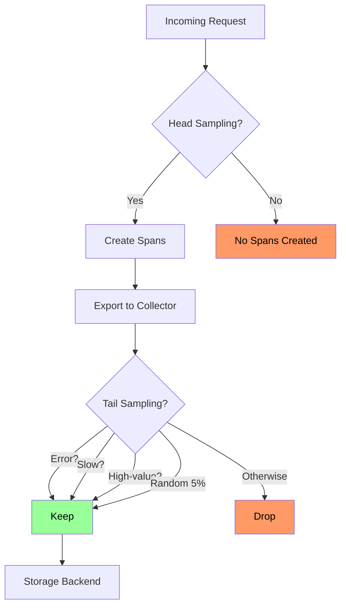
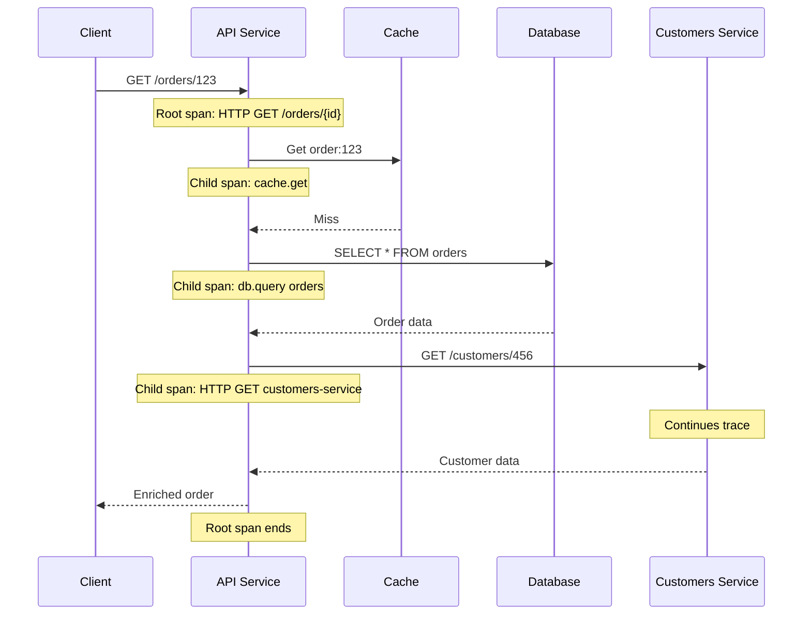
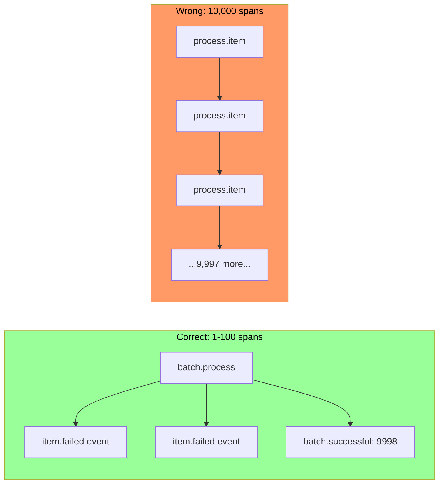
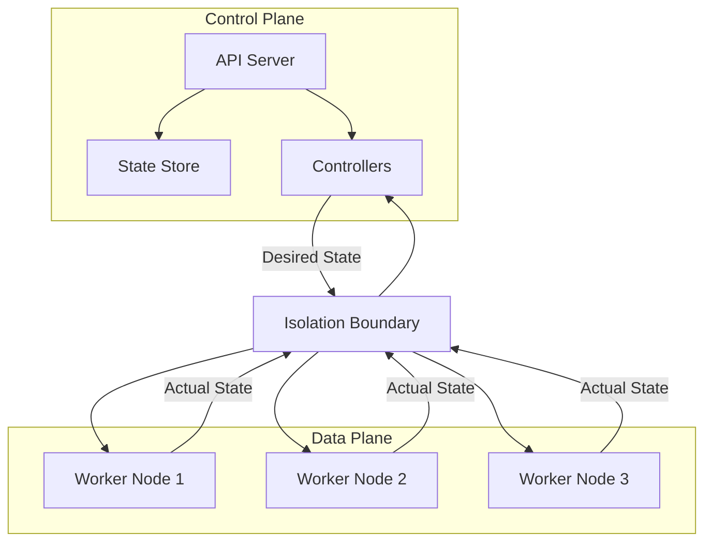

# Mermaid usage

## src/content/articles/opentelemetry-span-design-granularity-overhead/pdf.mdx

```mermaid
gantt
    title Trace Waterfall (readable)
    dateFormat X
    axisFormat %L ms

    section Request
    HTTP GET /orders/123           :a1, 0, 150

    section Cache
    cache.get                      :a2, 5, 15

    section Database
    db.query orders                :a3, 20, 80

    section Enrichment
    enrichOrder                    :a4, 85, 140
    http.get /customers/456        :a5, 90, 120
    http.get /products/789         :a6, 90, 110
```

Figure: Readable trace waterfall with clear hierarchy.

Figure: Head sampling reduces overhead; tail sampling preserves interesting traces.

```mermaid
gantt
    title Trace Waterfall (over-instrumented)
    dateFormat X
    axisFormat %L ms

    section Request
    HTTP GET /orders/123           :a1, 0, 150

    section Validation
    validate.request               :a2, 2, 5
    parse.json                     :a3, 5, 8
    validate.orderId               :a4, 8, 10

    section Cache
    cache.get                      :a5, 10, 12
    serialize.key                  :a6, 10, 11
    redis.get                      :a7, 11, 12
    deserialize.result             :a8, 12, 13

    section Database
    db.getConnection               :a9, 15, 18
    db.query orders                :a10, 18, 75
    db.releaseConnection           :a11, 75, 77
    map.toEntity                   :a12, 77, 79

    section Response
    serialize.json                 :a13, 140, 145
    set.headers                    :a14, 145, 147
    send.response                  :a15, 147, 150
```

Figure: Over-instrumented trace—wall of spans obscures the critical path.

Figure: Request instrumentation sequence.

Figure: Batch instrumentation approaches—events vs spans.

## src/content/articles/platform-architecture-control-plane-data-plane-separation/index.mdx

