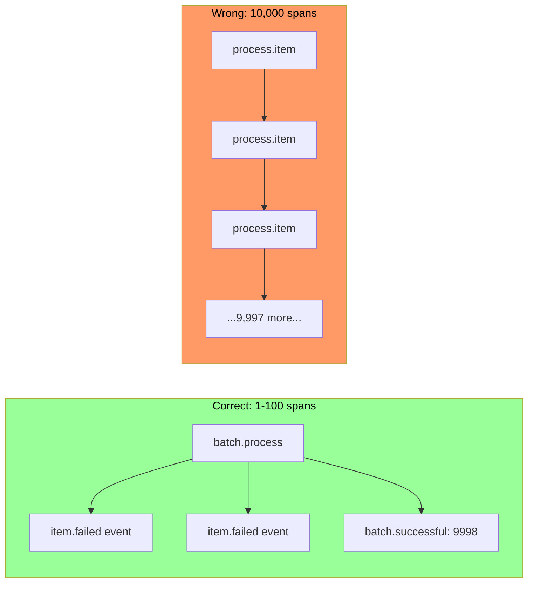
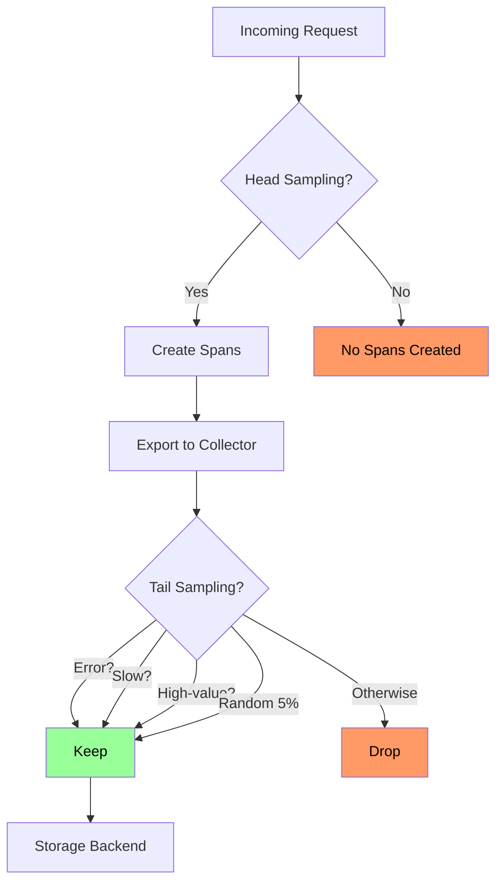
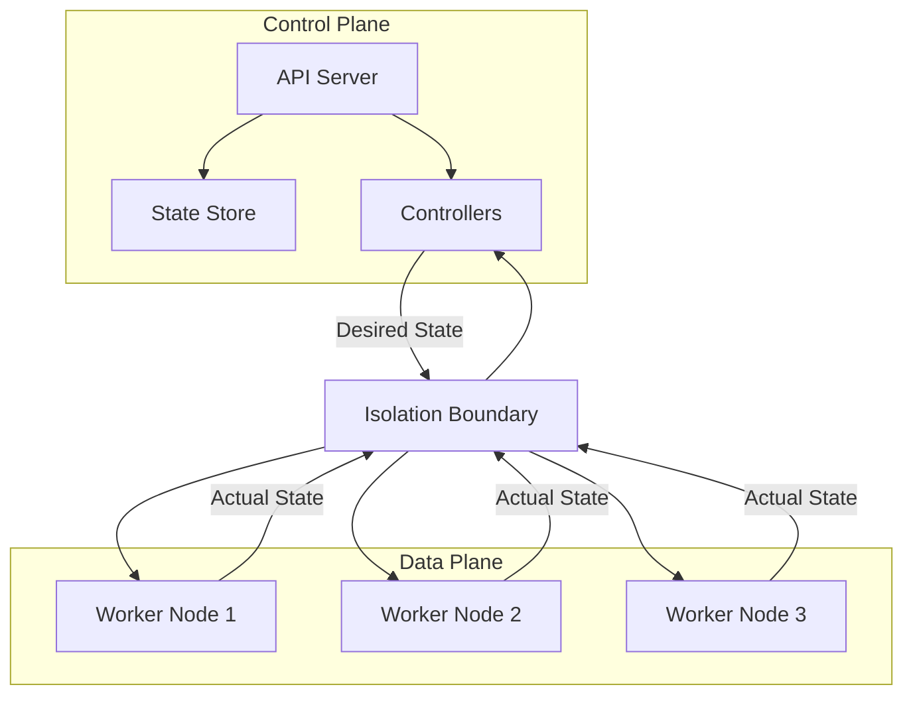
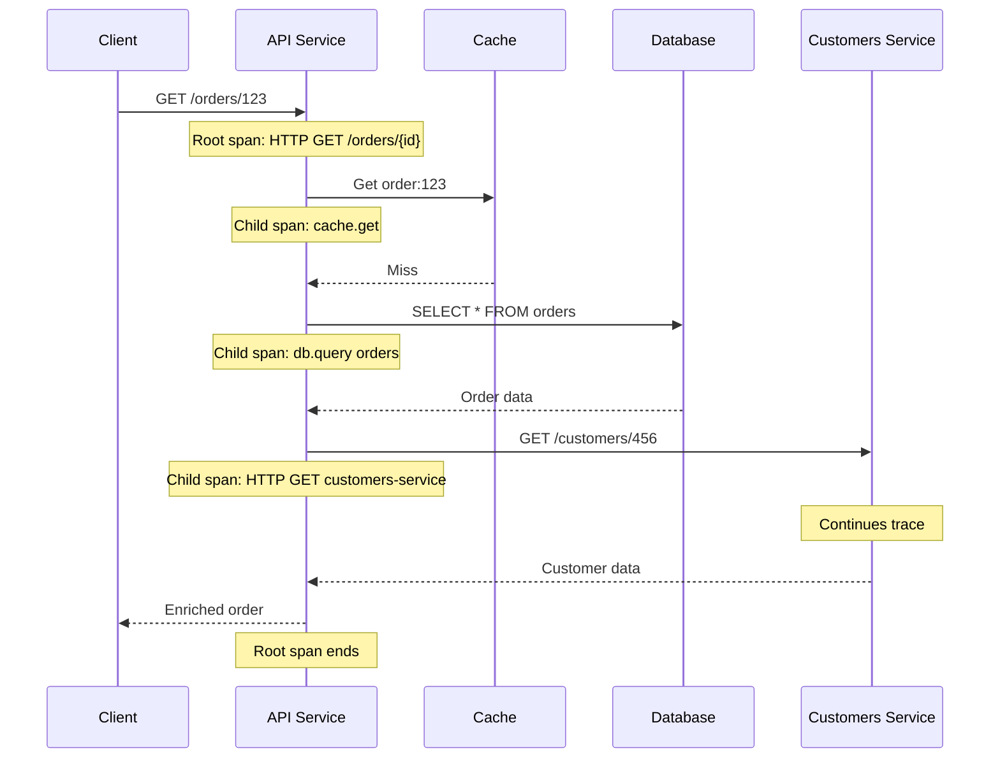
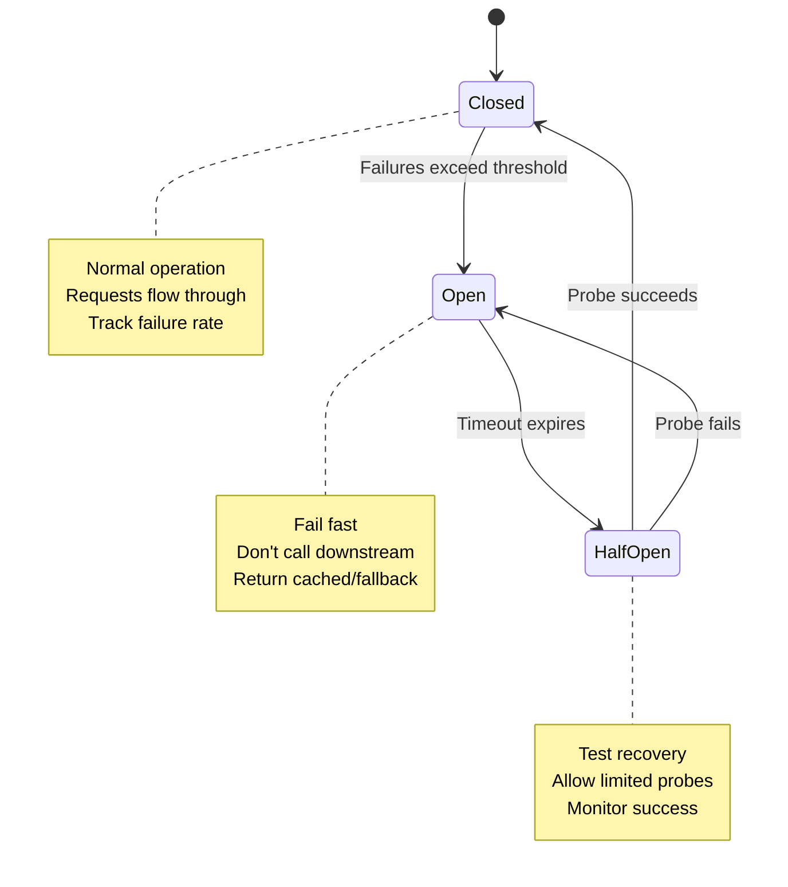

# Mermaid usage

- `flowchart LR`, `flowchart TD` - shows a sequence of actions.
- `gantt`
- `graph TD` - legacy implementation, use `flowchart` instead.
- `sequenceDiagram`
- `stateDiagram-v2` -  is meant for Finite State Machines (FSM), shows the status of a system at any given time.

**Quick Comparison Table**

| Type                  | Purpose                               | Key Feature                                                  | Syntax Note                                                  |
| :-------------------- | :------------------------------------ | :----------------------------------------------------------- | :----------------------------------------------------------- |
| **`flowchart`**       | Visualizing processes or logic flows. | **Newest engine**: Supports subgraphs, better styling, and more shapes. | Use `flowchart TD` or `flowchart LR`.                        |
| **`graph`**           | Legacy version of the flowchart.      | Older engine with fewer features and more rigid layouts.     | Often used interchangeably but lacks `flowchart`'s flexibility. |
| **`stateDiagram-v2`** | Modeling system behavior/states.      | **UML-compliant**: Focuses on "States" and "Transitions."    | Uses `[*] ->` for start/end points.                          |

## flowchart LR

```text
flowchart LR
    subgraph correct[Correct: 1-100 spans]
        B1[batch.process] --> E1[item.failed event]
        B1 --> E2[item.failed event]
        B1 --> A1[batch.successful: 9998]
    end

    subgraph wrong[Wrong: 10,000 spans]
        I1[process.item] --> I2[process.item]
        I2 --> I3[process.item]
        I3 --> I4[...9,997 more...]
    end

    style correct fill:#9f9,color:#000
    style wrong fill:#f96,color:#000
```



## flowchart TD

```text
flowchart TD
    A[Incoming Request] --> B{Head Sampling?}

    B -->|Yes| C[Create Spans]
    B -->|No| D[No Spans Created]

    C --> E[Export to Collector]
    E --> F{Tail Sampling?}

    F -->|Error?| G[Keep]
    F -->|Slow?| G
    F -->|High-value?| G
    F -->|Random 5%| G
    F -->|Otherwise| H[Drop]

    G --> I[Storage Backend]

    style D fill:#f96,color:#000
    style H fill:#f96,color:#000
    style G fill:#9f9,color:#000
```



## graph TD

```text
graph TD
    subgraph CP[Control Plane]
        A[API Server] --> B[State Store]
        A --> C[Controllers]
    end

    D[Isolation Boundary]

    subgraph DP[Data Plane]
        F[Worker Node 1]
        G[Worker Node 2]
        H[Worker Node 3]
    end

    C -->|"Desired State"| D
    D --> F
    D --> G
    D --> H

    F -->|"Actual State"| D
    G -->|"Actual State"| D
    H -->|"Actual State"| D
    D --> C
```



## sequenceDiagram

```text
sequenceDiagram
    participant Client
    participant API as API Service
    participant Cache
    participant DB as Database
    participant Customers as Customers Service

    Client->>API: GET /orders/123
    Note over API: Root span: HTTP GET /orders/{id}

    API->>Cache: Get order:123
    Note over API: Child span: cache.get
    Cache-->>API: Miss

    API->>DB: SELECT * FROM orders
    Note over API: Child span: db.query orders
    DB-->>API: Order data

    API->>Customers: GET /customers/456
    Note over API: Child span: HTTP GET customers-service
    Note over Customers: Continues trace
    Customers-->>API: Customer data

    API-->>Client: Enriched order
    Note over API: Root span ends
```



## stateDiagram-v2

```text
stateDiagram-v2
    [*] --> Closed
    Closed --> Open: Failures exceed threshold
    Open --> HalfOpen: Timeout expires
    HalfOpen --> Closed: Probe succeeds
    HalfOpen --> Open: Probe fails

    note right of Closed
        Normal operation
        Requests flow through
        Track failure rate
    end note

    note right of Open
        Fail fast
        Don't call downstream
        Return cached/fallback
    end note

    note right of HalfOpen
        Test recovery
        Allow limited probes
        Monitor success
    end note
```



## gantt

```text
gantt
    title Trace Waterfall (over-instrumented)
    dateFormat X
    axisFormat %L ms

    section Request
    HTTP GET /orders/123           :a1, 0, 150

    section Validation
    validate.request               :a2, 2, 5
    parse.json                     :a3, 5, 8
    validate.orderId               :a4, 8, 10

    section Cache
    cache.get                      :a5, 10, 12
    serialize.key                  :a6, 10, 11
    redis.get                      :a7, 11, 12
    deserialize.result             :a8, 12, 13

    section Database
    db.getConnection               :a9, 15, 18
    db.query orders                :a10, 18, 75
    db.releaseConnection           :a11, 75, 77
    map.toEntity                   :a12, 77, 79

    section Response
    serialize.json                 :a13, 140, 145
    set.headers                    :a14, 145, 147
    send.response                  :a15, 147, 150
```


```mermaid
gantt
    title Trace Waterfall (over-instrumented)
    dateFormat X
    axisFormat %L ms

    section Request
    HTTP GET /orders/123           :a1, 0, 150

    section Validation
    validate.request               :a2, 2, 5
    parse.json                     :a3, 5, 8
    validate.orderId               :a4, 8, 10

    section Cache
    cache.get                      :a5, 10, 12
    serialize.key                  :a6, 10, 11
    redis.get                      :a7, 11, 12
    deserialize.result             :a8, 12, 13

    section Database
    db.getConnection               :a9, 15, 18
    db.query orders                :a10, 18, 75
    db.releaseConnection           :a11, 75, 77
    map.toEntity                   :a12, 77, 79

    section Response
    serialize.json                 :a13, 140, 145
    set.headers                    :a14, 145, 147
    send.response                  :a15, 147, 150
```

Figure: Over-instrumented trace—wall of spans obscures the critical path.
