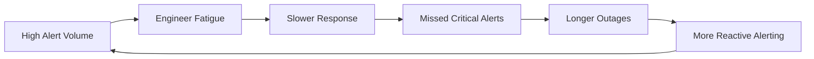
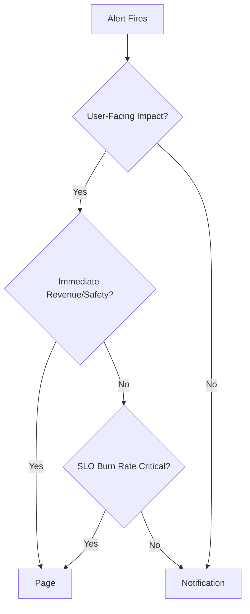
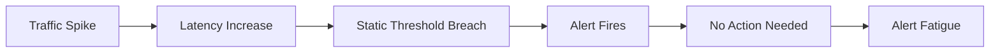
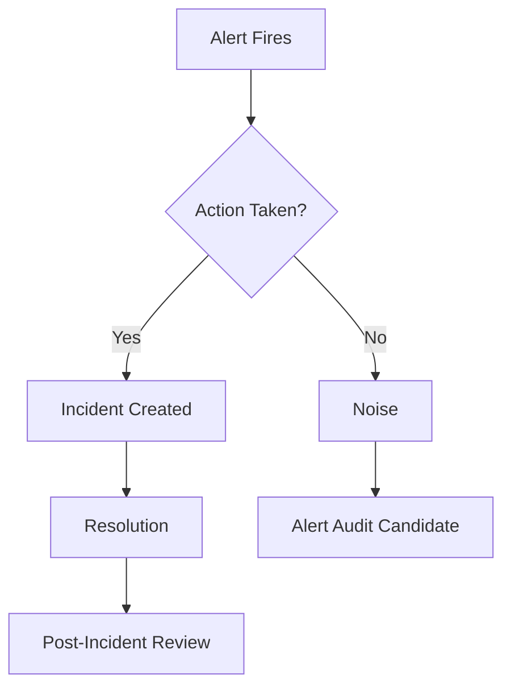

*[SLO]: Service Level Objective
*[SLI]: Service Level Indicator
*[MTTR]: Mean Time To Recovery
*[MTTA]: Mean Time To Acknowledge
*[PagerDuty]: Incident management platform
*[OpsGenie]: Incident alerting service

# Alert Fatigue: From 200 Alerts to 5 Pages

## Introduction

Brief overview of the alert fatigue problem: teams receiving hundreds of alerts daily, on-call engineers ignoring pages, and the organizational cost when critical issues get lost in noise. This section sets up the core tension between comprehensive monitoring and actionable alerting.

_Include a real-world scenario: an on-call engineer's shift with 47 alerts, 44 of which required no action, and the one critical alert that got missed._

<Callout type="warning">
Every alert you keep dilutes the ones that matter. An alert that fires but requires no action is worse than no alert at all—it trains engineers to ignore pages.
</Callout>

## The Cost of Alert Noise

### Quantifying the Problem

Discuss the measurable impact of alert fatigue: MTTA degradation, on-call burnout, missed incidents, and the false economy of "more alerts = better coverage." Include metrics that teams should track to understand their own alert health.

_Suggested data points: average alerts per on-call shift, percentage requiring action, MTTA trends over time, on-call satisfaction scores._


Figure: The alert fatigue feedback loop—more alerts create conditions that demand even more alerts.

### The Psychology of Ignored Alerts

Explain why engineers start ignoring alerts: habituation, learned helplessness, and the cognitive load of triaging noise. Reference research on alarm fatigue in healthcare (where this problem is well-studied) and draw parallels to software operations.

> The boy who cried wolf was not lying—the wolf was real. But by the time it mattered, nobody was listening.
> — Adapted proverb

## The Alert Audit Process

### Step 1: Inventory Everything

Walk through the process of cataloging every alert in the system. Include what metadata to capture: alert name, firing frequency, action rate, owning team, and last modification date.

| Field | Description | Why It Matters |
|-------|-------------|----------------|
| Alert Name | Identifier in monitoring system | Tracking and deduplication |
| Firing Frequency | Alerts/week over last 90 days | Identifies noisy alerts |
| Action Rate | % of firings requiring human action | Core signal for usefulness |
| Owning Team | Team responsible for response | Accountability |
| Last Modified | When alert was last updated | Staleness indicator |
| Linked Runbook | URL to response documentation | Actionability check |

Table: Alert inventory fields for the audit process.

<Callout type="info">
Export alert history from your monitoring platform. Most systems (Prometheus/Alertmanager, Datadog, PagerDuty) support historical exports. You need 90 days minimum to capture weekly patterns.
</Callout>

### Step 2: Classify by Action Rate

Detail how to categorize alerts based on what happens when they fire. The key metric is action rate: what percentage of firings resulted in a human taking an action (not just acknowledging and closing).

```yaml title="alert-classification.yaml"
classifications:
  actionable:
    action_rate: ">= 80%"
    disposition: "Keep, improve runbook"

  noisy:
    action_rate: "20-80%"
    disposition: "Investigate thresholds, consider aggregation"

  useless:
    action_rate: "< 20%"
    disposition: "Delete or convert to dashboard metric"

  stale:
    last_modified: "> 6 months"
    last_fired: "> 3 months"
    disposition: "Review for deletion"
```
Code: Alert classification thresholds—adjust percentages based on your team's tolerance.

### Step 3: The Deletion Conversation

Address the organizational resistance to deleting alerts. Teams fear removing coverage, but unused alerts provide false confidence. Include talking points for convincing stakeholders that fewer, better alerts improve reliability.

<Callout type="danger">
An alert with a 5% action rate is not "coverage"—it is noise that makes your 95% action-rate alerts harder to notice. Delete it or fix it.
</Callout>

## Severity Classification That Works

### The Two-Tier Model

Propose a simplified severity model: pages (wake someone up) and notifications (review during business hours). Explain why multi-tier severity systems (P1/P2/P3/P4/P5) often fail—everything becomes P2.


Figure: Decision tree for page vs. notification classification.

### Defining "Page-Worthy"

Establish clear criteria for what deserves to wake someone up. Include the questions every alert should answer: What is broken? Who is affected? What should the responder do first?

| Criterion | Page | Notification |
|-----------|------|--------------|
| User-facing functionality down | ✅ | |
| SLO error budget exhausted | ✅ | |
| Security incident in progress | ✅ | |
| Capacity threshold (proactive) | | ✅ |
| Background job failure | | ✅ |
| Non-critical dependency degraded | | ✅ |

Table: Page vs. notification decision matrix.

### Time-Based Escalation

Explain how to configure alerts that start as notifications and escalate to pages if unresolved. This catches slow-burn issues without paging for every transient spike.

```yaml title="alertmanager-escalation.yaml" {7-8,15-16}
route:
  receiver: 'slack-notifications'
  routes:
    - match:
        severity: warning
      receiver: 'slack-notifications'
      continue: true
      # Escalate to page if unresolved after 30 minutes
      routes:
        - match:
            severity: warning
          receiver: 'pagerduty-escalation'
          repeat_interval: 30m

receivers:
  - name: 'slack-notifications'
    slack_configs:
      - channel: '#alerts'

  - name: 'pagerduty-escalation'
    pagerduty_configs:
      - service_key: '<key>'
```
Code: Alertmanager configuration for time-based escalation from Slack notification to PagerDuty page.

## Aggregation Strategies

### The Symptom vs. Cause Problem

Explain why alerting on symptoms (user-facing impact) is more actionable than alerting on causes (CPU spike, memory pressure). A single symptom alert replaces dozens of cause alerts.

<Callout type="info">
Alert on what users experience, not on what might cause problems. "Checkout latency > 2s" is one alert. "High CPU," "Memory pressure," "Database slow," and "Cache miss rate" are four alerts for the same incident.
</Callout>

### Grouping Related Alerts

Detail how to configure alert grouping in Alertmanager or similar tools. The goal is one notification per incident, not one notification per symptom.

```yaml title="alertmanager-grouping.yaml"
route:
  group_by: ['alertname', 'service', 'environment']
  group_wait: 30s
  group_interval: 5m
  repeat_interval: 4h
```
Code: Alertmanager grouping configuration—tune `group_wait` based on alert correlation patterns.

### Dependent Alert Suppression

Explain inhibition rules: when a parent alert fires, suppress child alerts. If the database is down, suppress all "database connection failed" alerts from dependent services.

```yaml title="alertmanager-inhibition.yaml"
inhibit_rules:
  - source_match:
      alertname: 'DatabaseDown'
    target_match:
      dependency: 'database'
    equal: ['environment']
```
Code: Inhibition rule to suppress downstream alerts when the root cause is already alerting.

## Threshold Tuning

### Static Thresholds and Their Problems

Discuss why static thresholds fail: traffic patterns change, deployments shift baselines, and what was a 95th percentile yesterday is normal today.


Figure: Static thresholds misfiring during expected traffic changes.

### SLO-Based Alerting

Introduce error budget burn rate alerting as an alternative to static thresholds. Alert when you are consuming error budget faster than sustainable, not when a metric crosses an arbitrary line.

```text
Burn rate = (error rate) / (1 - SLO target)

Example:
- SLO target: 99.9% (0.1% error budget)
- Current error rate: 0.5%
- Burn rate: 0.5% / 0.1% = 5x

At 5x burn rate, you exhaust a 30-day error budget in 6 days.
```

<Callout type="success">
SLO-based alerts answer "are we on track?" rather than "did this metric cross a line?" They tolerate expected variation and fire only when reliability is actually at risk.
</Callout>

### Multi-Window Burn Rate Alerts

Explain the multi-window approach: alert on both short-term spikes (high burn rate over 5 minutes) and sustained degradation (moderate burn rate over 1 hour). This catches both acute incidents and slow-burn problems.

| Window | Burn Rate | Catches |
|--------|-----------|---------|
| 5m | 14.4x | Acute incidents, sudden failures |
| 1h | 6x | Sustained degradation |
| 6h | 1x | Slow-burn issues |

Table: Multi-window burn rate thresholds for a 99.9% SLO.

```yaml title="prometheus-multiwindow.yaml"
groups:
  - name: slo-alerts
    rules:
      - alert: HighErrorBurnRate
        expr: |
          (
            sum(rate(http_requests_total{status=~"5.."}[5m]))
            /
            sum(rate(http_requests_total[5m]))
          ) > (14.4 * 0.001)
          and
          (
            sum(rate(http_requests_total{status=~"5.."}[1h]))
            /
            sum(rate(http_requests_total[1h]))
          ) > (14.4 * 0.001)
        labels:
          severity: page
        annotations:
          summary: "Error budget burning at 14.4x rate"
```
Code: Prometheus alert rule for multi-window burn rate detection.

## Making Alerts Actionable

### The Runbook Requirement

Every page-worthy alert must have a runbook. Define the minimum content: what the alert means, first diagnostic steps, escalation path, and rollback procedures if applicable.

```markdown title="runbook-template.md"
# Alert: CheckoutLatencyHigh

## What This Means
Checkout API p99 latency exceeds 2 seconds. Users are experiencing
slow or failed purchases.

## Immediate Actions
1. Check deployment status: `kubectl get deployments -n checkout`
2. Verify database connectivity: `psql -h $DB_HOST -c "SELECT 1"`
3. Check downstream dependencies: [Dependency Dashboard](/dashboards/checkout-deps)

## Escalation
- If database issue: Page DBA on-call
- If payment provider: Check [StatusPage](https://status.stripe.com)

## Rollback
If recent deployment: `kubectl rollout undo deployment/checkout-api`
```
Code: Runbook template structure—adapt sections to your incident response process.

<Callout type="warning">
An alert without a runbook is a puzzle, not a page. If you cannot document what to do, the alert is not ready for production.
</Callout>

### Alert Description Best Practices

Explain what information to include in alert descriptions and annotations. The on-call engineer should understand impact and next steps without opening a dashboard.

```yaml title="prometheus-annotations.yaml" {8-15}
groups:
  - name: checkout
    rules:
      - alert: CheckoutLatencyHigh
        expr: histogram_quantile(0.99, rate(checkout_duration_seconds_bucket[5m])) > 2
        labels:
          severity: page
          service: checkout
        annotations:
          summary: "Checkout p99 latency {{ $value | humanizeDuration }}"
          description: |
            Checkout API responding slowly. Users may see timeouts.

            Affected environment: {{ $labels.environment }}
            Current p99: {{ $value | humanizeDuration }}
            Dashboard: https://grafana/d/checkout
            Runbook: https://wiki/runbooks/checkout-latency
```
Code: Alert annotations that provide actionable context in the page itself.

## The Discipline of Maintenance

### Regular Alert Reviews

Establish a cadence for reviewing alerts. Suggest monthly reviews of alert firing patterns and quarterly reviews of alert usefulness. Include what questions to ask in each review.

| Review Type | Frequency | Questions |
|-------------|-----------|-----------|
| Firing Review | Monthly | Which alerts fired most? What was the action rate? |
| Usefulness Review | Quarterly | Do we still need this alert? Is the threshold still valid? |
| Runbook Review | Quarterly | Is the runbook current? Did it help in recent incidents? |
| Owner Review | Annually | Does the owning team still exist? Do they still own this service? |

Table: Alert maintenance review cadence.

### Alert Ownership

Discuss the importance of clear ownership. Alerts without owners become abandoned—thresholds drift, runbooks rot, and nobody knows if the alert still matters.

<Callout type="info">
Every alert needs an owner, and ownership should be encoded in the alert itself (label, annotation, or alert name). Orphaned alerts are the first candidates for deletion.
</Callout>

### The Deletion Budget

Propose a forcing function: every quarter, teams must delete or significantly improve 10% of their alerts. This counteracts the natural tendency to add alerts without removing old ones.

## Measuring Success

### Alert Health Metrics

Define the metrics that indicate healthy alerting: action rate, MTTA, alert-to-incident ratio, and on-call satisfaction.


Figure: Alert outcome tracking for health metrics.

| Metric | Healthy | Warning | Critical |
|--------|---------|---------|----------|
| Action Rate | > 80% | 50-80% | < 50% |
| MTTA | < 5 min | 5-15 min | > 15 min |
| Alerts per On-Call Shift | < 10 | 10-25 | > 25 |
| On-Call Satisfaction | > 7/10 | 5-7/10 | < 5/10 |

Table: Alert health metric thresholds.

### Before and After

Walk through a case study of alert reduction. Show the metrics before (high volume, low action rate) and after (reduced volume, high action rate, improved MTTA).

## Conclusion

Summarize the key principles: audit ruthlessly, classify by action rate, aggregate by symptom, tune with SLOs, require runbooks, and maintain continuously. Emphasize that alert reduction is not about less monitoring—it is about more signal and less noise.

<Callout type="success">
The goal is not zero alerts—it is zero useless alerts. Every page should be a real problem that requires human judgment to resolve.
</Callout>

---

## Cover Prompt

### Prompt 1: Abstract Alert Overload Visualization

Create a dark, moody digital illustration showing a single glowing green signal (representing an actionable alert) emerging clearly from a chaotic storm of hundreds of dim, red and orange notification icons swirling in the background. The composition should convey the concept of signal vs. noise. Style: modern tech illustration, dark background with high contrast lighting, cinematic depth of field, 16:9 aspect ratio.

### Prompt 2: On-Call Engineer Focus Scene

Illustrate a calm, focused engineer at a minimal workstation with a single clean dashboard showing one alert, contrasted against a ghostly background showing the same engineer overwhelmed by dozens of floating notification windows. Split composition showing before/after. Style: stylized digital art, muted color palette with one accent color (green) for the actionable alert, professional tech aesthetic, 16:9 aspect ratio.

### Prompt 3: Funnel Filtering Metaphor

Design an abstract visualization of a wide funnel at the top receiving hundreds of small alert icons (mixed colors, chaotic), filtering down through classification layers, with only a handful of clean, distinct alerts emerging at the bottom. Each layer of the funnel should be labeled subtly (Audit, Classify, Aggregate). Style: clean infographic illustration, isometric perspective, tech company brand aesthetic, blue and green color scheme, 16:9 aspect ratio.

### Prompt 4: Signal Amplification Through Reduction

Create a visual metaphor showing a radar or sonar screen with a single bright, clear ping in the center, surrounded by a faded halo showing where noise used to be. The clear ping should be labeled or styled to suggest it represents a critical, actionable alert. Style: military-tech aesthetic, dark background with green/cyan glow, vintage CRT monitor texture, 16:9 aspect ratio.

### Prompt 5: The Alert Audit Dashboard

Illustrate a stylized monitoring dashboard showing alert metrics transforming from chaotic (left side: crowded charts, red indicators, overwhelmed UI) to clean (right side: sparse, green indicators, clear hierarchy). The transition should flow naturally across the image. Style: UI/UX focused illustration, modern SaaS aesthetic, subtle gradients, professional color palette, 16:9 aspect ratio.
