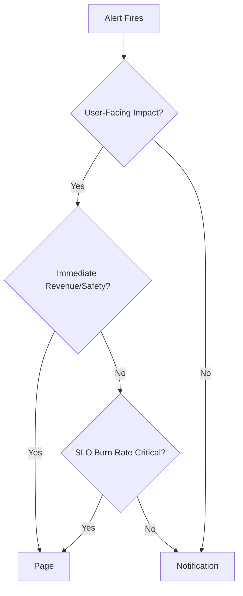
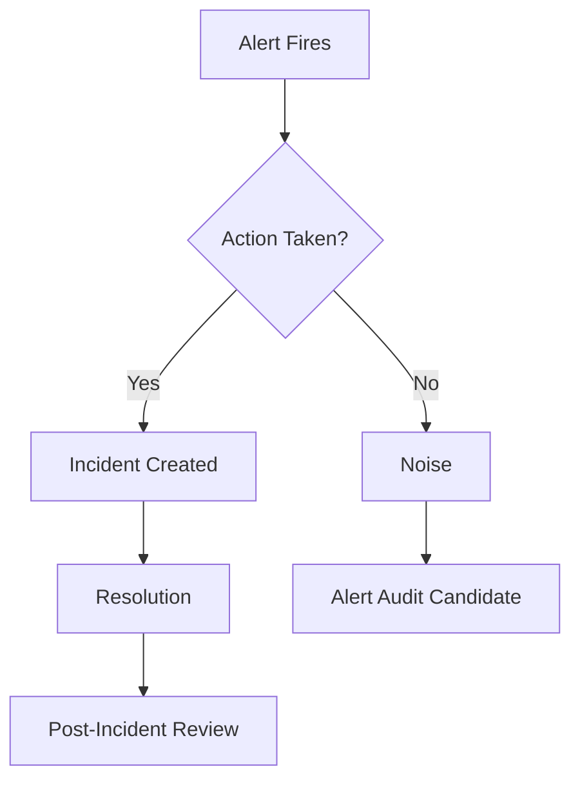

*[SLO]: Service Level Objective
*[SLI]: Service Level Indicator
*[MTTR]: Mean Time To Recovery
*[MTTA]: Mean Time To Acknowledge
*[PagerDuty]: Incident management platform
*[OpsGenie]: Incident alerting service

# Alert Fatigue: From 200 Alerts to 5 Pages

## Introduction

If you've been on-call, you know the drill: the phone buzzes, you context-switch out of whatever you were doing, check the alert, determine it's noise, acknowledge, and try to remember what you were working on. Repeat forty times in a shift.

I inherited a monitoring setup where the on-call engineer averaged 47 alerts per 24-hour rotation. Forty-four of those required no action—thresholds set too aggressively, alerts for non-problems, duplicate notifications for the same underlying issue. The forty-fifth was a memory leak that had been slowly building for three hours. By the time anyone noticed it in the noise, the service had already crashed and restarted twice.

That's the core problem: comprehensive monitoring and actionable alerting are often at odds. Teams add alerts because something might go wrong, and removing an alert feels like removing a safety net. But the math works against you—an engineer who has acknowledged thirty false positives is not in the right headspace to notice the thirty-first is real.

<Callout type="warning">Every alert you keep dilutes the ones that matter. An alert that fires but requires no action is worse than no alert at all—it trains engineers to ignore pages. </Callout>

This article walks through the process I used to take that 200-alert-per-week system down to roughly 35—about 5 pages per day that actually matter—with a page action rate above 90%. The approach is systematic: audit what you have, classify by usefulness, fix or delete the noise, and establish maintenance practices so the problem doesn't recur.

## The Cost of Alert Noise

### Quantifying the Problem

Alert fatigue has measurable costs, even if teams don't track them. The most direct metric is MTTA—mean time to acknowledge. When engineers are conditioned to expect noise, acknowledgment slows. I've seen MTTA drift from under two minutes to over fifteen as alert volume increased, because the on-call engineer stopped keeping their phone nearby.

Beyond response time, there's the burnout factor. On-call rotations with high alert volume have higher turnover. Engineers start trading shifts, calling in sick, or quietly job-hunting. The institutional knowledge that walks out the door is expensive to replace.

The metrics worth tracking:

- _Alerts per on-call shift_: Total alert volume during a rotation. Anything above 20 per 24-hour shift is a red flag.
- _Action rate_: Percentage of alerts that required human intervention beyond acknowledgment. Below 50% means more than half your alerts are noise.
- _MTTA trend_: Is acknowledgment time increasing? That's a leading indicator of fatigue.
- _On-call satisfaction_: Periodic surveys. Engineers will tell you when on-call is unsustainable if you ask.

The feedback loop is real. After an incident caused by a missed alert, the instinct is to add more alerts. But if the alert was missed because of volume, adding more alerts makes the next miss more likely, not less.

### The Psychology of Ignored Alerts

There's solid research on this from healthcare, where alarm fatigue kills patients. The dynamic is the same: when most alarms are false positives, clinicians stop responding urgently. Studies in ICUs found that 72-99% of alarms required no clinical intervention[^1], and staff developed coping mechanisms—turning down volume, disabling non-critical alarms, or simply not rushing to respond.

[^1]: Sendelbach S, Funk M. "Alarm fatigue: a patient safety concern." AACN Adv Crit Care. 2013 Oct-Dec;24(4):378-86. doi: 10.1097/NCI.0b013e3182a903f9

Software operations is no different. After enough false positives, engineers develop learned helplessness. The page becomes background noise. The rational response to "this alert is usually nothing" is to treat it as nothing, even when it isn't.

The problem compounds with time. New team members inherit the existing alert volume and assume it's normal. They don't know which alerts used to matter before threshold drift made them useless. The institutional memory of _why_ an alert exists fades, and nobody wants to delete something that might be important.

## The Alert Audit Process

### Step 1: Inventory Everything

Before you can fix alert noise, you need to know what you have. This sounds obvious, but most teams can't answer "how many alerts do we have?" without digging.

Export your alert definitions and firing history. Prometheus/Alertmanager stores this in rules files and the `ALERTS` metric. Datadog and PagerDuty have API endpoints for historical data. You want at least 90 days of history to capture weekly and monthly patterns—some alerts only fire during end-of-month batch processing or quarterly traffic spikes.

For each alert, capture:

| Field | Description | Why It Matters |
|-------|-------------|----------------|
| Alert Name | Identifier in monitoring system | Tracking and deduplication |
| Firing Frequency | Alerts/week over last 90 days | Identifies noisy alerts |
| Action Rate | % of firings requiring human action | Core signal for usefulness |
| Owning Team | Team responsible for response | Accountability |
| Last Modified | When alert was last updated | Staleness indicator |
| Linked Runbook | URL to response documentation | Actionability check |

Table: Alert inventory fields for the audit process.

The "action rate" column is the most important and the hardest to populate. You'll need to cross-reference alert firings with incident tickets or on-call logs. If your tooling doesn't track this automatically, you'll need to reconstruct it from memory or start tracking it going forward.

<Callout type="info">
Export alert history from your monitoring platform. Most systems (Prometheus/Alertmanager, Datadog, PagerDuty) support historical exports. You need 90 days minimum to capture weekly patterns.
</Callout>

### Step 2: Classify by Action Rate

Once you have the inventory, sort by action rate. This single metric tells you more about alert usefulness than anything else.

The question to answer: when this alert fired, did someone do something? Not "acknowledge and close"—that's not action. Did someone SSH into a box, restart a service, page another team, roll back a deployment, or otherwise intervene?

I use four buckets:

```yaml title="alert-classification.yaml"
# Alert classification buckets based on action rate
# Adjust thresholds based on your team's tolerance
classifications:
  actionable:
    action_rate: ">= 80%"  # Most alerts result in human intervention
    disposition: "Keep, improve runbook"

  noisy:
    action_rate: "20-80%"  # Alerts fire for real issues but need tuning
    disposition: "Investigate thresholds, consider aggregation"

  useless:
    action_rate: "< 20%"   # Rarely results in action—likely noise
    disposition: "Delete or convert to dashboard metric"

  stale:
    last_modified: "> 6 months"  # Not maintained
    last_fired: "> 3 months"     # Possibly obsolete
    disposition: "Review for deletion"
```

Code: Alert classification thresholds—adjust percentages based on your team's tolerance.

The "noisy" bucket is where most of the work happens. These alerts fire for real issues, but the threshold is wrong or multiple alerts fire for the same underlying problem. Fixing them requires understanding why action wasn't taken—was the alert a false positive, or did the problem resolve itself before anyone could respond?

### Step 3: The Deletion Conversation

Deleting alerts is politically difficult. Someone created that alert for a reason. Maybe there was an incident, and the alert was the action item from the postmortem. Deleting it feels like ignoring the lessons learned.

But an alert that fires constantly and gets ignored isn't a lesson learned—it's a lesson forgotten. The incident that created it is no longer prevented by the alert; the alert just adds to the noise that makes the _next_ incident harder to catch.

The talking points that work:

- "This alert fired 47 times last quarter. How many of those were real problems?" (Usually: zero or one.)
- "Would you notice if this alert stopped firing tomorrow?" (Usually: no.)
- "If we delete this, what's the worst case?" (Usually: we'd notice the problem some other way, slightly later.)

The goal isn't to delete every alert—it's to delete the alerts that provide no signal. An alert with 5% action rate isn't coverage. It's noise that makes the 95% action-rate alerts harder to notice.

<Callout type="danger">
An alert with a 5% action rate is not "coverage"—it is noise that makes your 95% action-rate alerts harder to notice. Delete it or fix it.
</Callout>

## Severity Classification That Works

### The Two-Tier Model

I've seen teams with five-tier severity systems (P1 through P5) where everything ends up as P2. The middle tiers become a dumping ground because nobody wants to classify something as low priority (what if it's actually important?) but P1 feels too dramatic for most issues.

Two tiers work better: pages and notifications. A page wakes someone up or interrupts their work immediately. A notification goes to a channel that gets reviewed during business hours. That's it.

The decision is binary: does this require immediate human attention, or can it wait until someone is already working? If you can't answer that question clearly for an alert, the alert isn't well-defined.



Figure: Decision tree for page vs. notification classification.

### Defining "Page-Worthy"

A page should meet all three criteria:

1. _Something is broken right now._ Not "might break soon" or "is trending toward a problem." Actually broken.
2. _Users are affected._ Either external customers or internal users who can't do their jobs.
3. _Human judgment is required._ Automated remediation can't handle it, or hasn't been implemented yet.

If an alert doesn't meet all three, it's a notification at most.

| Criterion | Page | Notification |
|-----------|------|--------------|
| User-facing functionality down | ✅ | |
| SLO error budget exhausted | ✅ | |
| Security incident in progress | ✅ | |
| Capacity threshold (proactive) | | ✅ |
| Background job failure | | ✅ |
| Non-critical dependency degraded | | ✅ |

Table: Page vs. notification decision matrix.

The hardest calls are proactive alerts—things that aren't broken yet but will be soon. Disk filling up, certificate expiring, capacity approaching limits. These should almost never be pages. If you have time to address it proactively, you have time to address it during business hours. Page-worthy means _right now_, not _sometime today_.

### Time-Based Escalation

For issues that might resolve themselves but shouldn't be ignored indefinitely, use escalation. Start as a notification; escalate to a page if unresolved after a threshold.

This works well for flapping services, transient network issues, and dependency problems that usually recover. The first occurrence goes to Slack. If it's still firing 30 minutes later, someone gets paged.

```yaml title="alertmanager-escalation.yaml" {7-8,15-16}
route:
  receiver: 'slack-notifications'
  routes:
    - match:
        severity: warning
      receiver: 'slack-notifications'
      continue: true
      # Escalate to page if unresolved after 30 minutes
      routes:
        - match:
            severity: warning
          receiver: 'pagerduty-escalation'
          repeat_interval: 30m

receivers:
  - name: 'slack-notifications'
    slack_configs:
      - channel: '#alerts'

  - name: 'pagerduty-escalation'
    pagerduty_configs:
      - service_key: '<key>'
```

Code: Alertmanager configuration for time-based escalation from Slack notification to PagerDuty page.

The `repeat_interval` is key—it controls how long an unresolved alert waits before escalating. Tune this based on how long your typical transient issues last. If most self-heal within 15 minutes, set escalation at 20-30 minutes.

## Aggregation Strategies

### The Symptom vs. Cause Problem

Most alert configurations work backwards. They alert on causes—CPU spikes, memory pressure, disk I/O, connection pool exhaustion—hoping to catch problems before users notice. The result is dozens of alerts for a single incident, each describing a different aspect of the same failure.

Flip this around. Alert on symptoms instead: what users actually experience. A single "checkout latency exceeds SLO" alert replaces the CPU alert, the database alert, the cache alert, and the memory alert. They're all symptoms of the same underlying problem, and the responder doesn't need to be told about each one separately.

<Callout type="info">
Alert on what users experience, not on what might cause problems. "Checkout latency > 2s" is one alert. "High CPU," "Memory pressure," "Database slow," and "Cache miss rate" are four alerts for the same incident.
</Callout>

Cause-based alerts still have a place—as diagnostic information in dashboards and runbooks, not as paging conditions. When the symptom alert fires, the responder can check the cause metrics to understand _why_. But the page itself should describe the user impact, not the infrastructure state.

The exception is proactive capacity alerts where you genuinely want to act before users are affected. Disk filling up, certificate expiring, license approaching limits. These are notifications, not pages, and they're alerting on a cause because the symptom (outage) hasn't happened yet.

### Grouping Related Alerts

Even with symptom-based alerting, multiple alerts can fire during an incident. The payment service is slow, the order service is slow, the inventory service is slow—they might all be hitting the same overloaded database. You don't want three pages; you want one notification that mentions all three.

Alert grouping combines related alerts into a single notification. Configure it based on how your incidents typically correlate:

```yaml title="alertmanager-grouping.yaml"
route:
  # Group alerts by these labels to combine related notifications
  group_by: ['alertname', 'service', 'environment']
  # Wait 30s before sending first notification to allow grouping
  group_wait: 30s
  # Send updates about ongoing alerts every 5 minutes
  group_interval: 5m
  # Don't repeat identical notifications more than every 4 hours
  repeat_interval: 4h
```

Code: Alertmanager grouping configuration—tune `group_wait` based on alert correlation patterns.

The `group_wait` parameter is critical. It determines how long Alertmanager waits before sending the first notification, allowing related alerts to arrive and get grouped together. Too short and you get multiple notifications as alerts trickle in. Too long and you delay response to real incidents.

Start with 30 seconds and adjust based on your alert correlation patterns. If you frequently see related alerts arriving within a minute of each other, increase `group_wait` to 60 seconds. If most incidents involve a single alert, you can reduce it.

The `group_interval` controls how often you get updates about an ongoing grouped alert. Set this high enough that you're not spammed with "still broken" messages, but low enough that you notice when new services join the incident.

### Dependent Alert Suppression

Some alerts are always consequences of other alerts. If the database is down, every service that depends on the database will fail its health checks. You don't need six "connection refused" alerts—you need one "database down" alert.

Inhibition rules suppress downstream alerts when the root cause is already alerting:

```yaml title="alertmanager-inhibition.yaml"
# Suppress downstream alerts when root cause is already alerting
inhibit_rules:
  - source_match:
      alertname: 'DatabaseDown'  # The root cause alert
    target_match:
      dependency: 'database'     # Suppress alerts with this label
    equal: ['environment']       # Only in the same environment
```

Code: Inhibition rule to suppress downstream alerts when the root cause is already alerting.

This requires labeling your alerts with their dependencies. When you create an alert for a service, add a `dependency` label listing the infrastructure it relies on. When the source alert (DatabaseDown) fires, all target alerts with `dependency: database` in the same environment get suppressed.

Build your inhibition rules to match your architecture. Common patterns:

- Network partition alerts suppress all cross-zone communication failures
- Load balancer alerts suppress backend health check failures
- DNS alerts suppress all hostname resolution failures
- Cloud provider alerts suppress regional service alerts

The goal is one alert per root cause, not one alert per affected component. Map your dependencies and configure suppression accordingly.

Symptom-based alerting and alert aggregation reduce noise from redundant alerts, but even a well-designed alert becomes noise if its threshold doesn't reflect reality. The next challenge is tuning those thresholds to fire only when action is genuinely needed.

## Threshold Tuning

### Static Thresholds and Their Problems

A threshold set to "latency > 500ms" works on the day you create it. A week later, traffic patterns have shifted, you've deployed new code, and the baseline has moved. The threshold fires constantly during peak hours and never fires during off-peak, regardless of whether anything is actually wrong.

Static thresholds fail because systems aren't static. Traffic patterns change daily, weekly, and seasonally. Deployments shift performance baselines. Infrastructure changes alter what's normal. A threshold tuned for today's traffic becomes noise tomorrow.

The temptation is to raise thresholds until they stop firing. But high thresholds miss real problems. A threshold set to "latency > 2s" won't fire when latency degrades from 200ms to 1.5s—a tenfold degradation that users absolutely notice.

The problem isn't the threshold value; it's the approach. Static thresholds answer the wrong question. "Is latency above 500ms?" doesn't tell you if users are having a bad experience. It tells you a number crossed a line.

### SLO-Based Alerting

Error budget burn rate alerting asks a better question: are we consuming reliability faster than we can afford?

Define an SLO—say, 99.9% of requests succeed within acceptable latency over a 30-day window. That gives you an error budget of 0.1%: roughly 43 minutes of total downtime per month. An error budget is the inverse of your SLO—it's the amount of unreliability you can tolerate before violating your reliability target. The question becomes: at the current error rate, how fast are we burning through that budget?

```text
Burn rate = (error rate) / (1 - SLO target)

Example:
- SLO target: 99.9% (0.1% error budget)
- Current error rate: 0.5%
- Burn rate: 0.5% / 0.1% = 5x

At 5x burn rate, you exhaust a 30-day error budget in 6 days.
```

A 5x burn rate is a problem. A 1x burn rate means you're exactly on track—using budget at the expected pace. Alert when burn rate exceeds what's sustainable, not when a metric crosses an arbitrary threshold.

<Callout type="success">
SLO-based alerts answer "are we on track?" rather than "did this metric cross a line?" They tolerate expected variation and fire only when reliability is actually at risk.
</Callout>

This approach handles traffic variation naturally. During a traffic spike, errors might increase in absolute terms, but if the error _rate_ stays constant, the burn rate stays constant. You don't get paged for handling more traffic successfully.

### Multi-Window Burn Rate Alerts

A single burn rate window has a tradeoff: short windows catch acute incidents but generate noise from transient spikes; long windows catch sustained issues but respond slowly to sudden failures.

Use multiple windows together. Alert when _both_ a short window and a long window show elevated burn rates. This filters out transient spikes (which only show in the short window) while still catching acute incidents quickly.

| Window | Burn Rate | Catches |
|--------|-----------|---------|
| 5m | 14.4x | Acute incidents, sudden failures |
| 1h | 6x | Sustained degradation |
| 6h | 1x | Slow-burn issues |

Table: Multi-window burn rate thresholds for a 99.9% SLO.

The 5-minute/14.4x combination catches a complete outage within minutes. If your error rate jumps to 100%, burn rate hits 1000x—well above the 14.4x threshold. But the 1-hour window must also show elevated burn rate before the alert fires. A 30-second blip won't trigger anything.

```yaml title="prometheus-multiwindow.yaml"
groups:
  - name: slo-alerts
    rules:
      - alert: HighErrorBurnRate
        # Threshold calculation: 14.4 * 0.001 = 0.0144 (1.44% error rate)
        # For a 99.9% SLO (0.1% error budget), 14.4x burn rate means
        # consuming budget 14.4x faster than sustainable.
        # At this rate, a 30-day budget exhausts in ~50 hours.
        expr: |
          (
            sum(rate(http_requests_total{status=~"5.."}[5m]))
            /
            sum(rate(http_requests_total[5m]))
          ) > (14.4 * 0.001)
          and
          (
            sum(rate(http_requests_total{status=~"5.."}[1h]))
            /
            sum(rate(http_requests_total[1h]))
          ) > (14.4 * 0.001)
        labels:
          severity: page
        annotations:
          summary: "Error budget burning at 14.4x rate"
```

Code: Prometheus alert rule for multi-window burn rate detection.

The math behind these thresholds comes from Google's SRE workbook. A 14.4x burn rate over 5 minutes, if sustained, exhausts a monthly budget in roughly 2 hours. The thresholds are chosen to give you enough time to respond before the budget is gone while still filtering out noise.

## Making Alerts Actionable

### The Runbook Requirement

A page without a runbook is a puzzle delivered at 3 AM. The on-call engineer gets woken up, stares at an alert name, and has to figure out what it means and what to do—while sleep-deprived and under pressure.

Every page-worthy alert needs a runbook. Not a novel, not comprehensive documentation of the entire system—a focused document that answers the immediate questions:

1. _What does this alert mean?_ One paragraph explaining the symptom in user terms.
2. _What should I check first?_ Three to five diagnostic commands or dashboard links.
3. _Who do I escalate to?_ Contact information for specialized help.
4. _Can I roll back?_ If applicable, the exact rollback command.

```markdown title="runbook-template.md"
# Alert: CheckoutLatencyHigh

## What This Means
Checkout API p99 latency exceeds 2 seconds. Users are experiencing
slow or failed purchases.

## Immediate Actions
1. Check deployment status: `kubectl get deployments -n checkout`
2. Verify database connectivity: `psql -h $DB_HOST -c "SELECT 1"`
3. Check downstream dependencies: [Dependency Dashboard](/dashboards/checkout-deps)

## Recent Changes
- Check recent deployments: `kubectl rollout history deployment/checkout-api`
- Review commits: [Last 24h commits](https://github.com/org/checkout/commits)
- Check infra changes: [Terraform runs](https://app.terraform.io/org/runs)

## Known False Positives
- End-of-month batch processing (1st-3rd of each month) causes latency spikes
- Payment provider maintenance windows (check StatusPage first)
- Expected during large promotional events—verify with marketing calendar

## Escalation
- If database issue: Page DBA on-call
- If payment provider: Check [StatusPage](https://status.stripe.com)

## Rollback
If recent deployment: `kubectl rollout undo deployment/checkout-api`
```

Code: Runbook template structure—adapt sections to your incident response process.

<Callout type="warning">
An alert without a runbook is a puzzle, not a page. If you cannot document what to do, the alert is not ready for production.
</Callout>

The discipline of writing runbooks also improves alert quality. If you can't explain what an alert means or what to do about it, the alert probably isn't ready for production. The act of writing the runbook forces you to think through whether the alert is actually actionable.

Keep runbooks short. Long runbooks don't get read during incidents. If your runbook is more than a page, either the alert is too broad (split it) or the runbook includes reference material that belongs elsewhere.

### Alert Description Best Practices

The alert notification itself should contain enough context to begin investigation without opening additional tools. The on-call engineer shouldn't have to log into Grafana to understand what's broken.

Include in every alert:

- _What's happening_ — the symptom in plain language
- _Where it's happening_ — environment, region, service
- _How bad it is_ — current metric values
- _Where to look_ — direct links to relevant dashboards
- _What to do_ — link to the runbook

```yaml title="prometheus-annotations.yaml" {8-15}
groups:
  - name: checkout
    rules:
      - alert: CheckoutLatencyHigh
        expr: histogram_quantile(0.99, rate(checkout_duration_seconds_bucket[5m])) > 2
        labels:
          severity: page
          service: checkout
        annotations:
          summary: "Checkout p99 latency {{ $value | humanizeDuration }}"
          description: |
            Checkout API responding slowly. Users may see timeouts.

            Affected environment: {{ $labels.environment }}
            Current p99: {{ $value | humanizeDuration }}
            Dashboard: https://grafana/d/checkout
            Runbook: https://wiki/runbooks/checkout-latency
```

Code: Alert annotations that provide actionable context in the page itself.

Use templating to include dynamic values. The specific latency value, the affected environment, the current error count—these help the responder gauge severity immediately. "Checkout latency is high" is less useful than "Checkout p99 is 4.2 seconds in production."

Avoid jargon in summaries. The alert will often be read on a phone, possibly by someone who doesn't work on this service daily. "Checkout slow" beats "checkout_duration_seconds p99 > threshold" for quick comprehension.

## The Discipline of Maintenance

### Regular Alert Reviews

Establish a cadence for reviewing alerts. Suggest monthly reviews of alert firing patterns and quarterly reviews of alert usefulness. Include what questions to ask in each review.

| Review Type | Frequency | Questions |
|-------------|-----------|-----------|
| Firing Review | Monthly | Which alerts fired most? What was the action rate? |
| Usefulness Review | Quarterly | Do we still need this alert? Is the threshold still valid? |
| Runbook Review | Quarterly | Is the runbook current? Did it help in recent incidents? |
| Owner Review | Annually | Does the owning team still exist? Do they still own this service? |

Table: Alert maintenance review cadence.

Monthly firing reviews catch the immediate problems: which alerts are generating noise, which have low action rates. Pull the data, identify the worst offenders, and either fix them or delete them.

Quarterly usefulness reviews step back and ask whether alerts still make sense. Services change, architectures evolve, and alerts that were critical two years ago might be monitoring components that no longer exist. The quarterly review is also when you check whether thresholds still reflect current traffic patterns.

Runbook reviews happen alongside usefulness reviews. A runbook that hasn't been updated in a year probably doesn't reflect current procedures. After any significant incident, update the relevant runbooks while the response is fresh.

### Alert Ownership

Every alert needs an owner. Not "the platform team" or "whoever deployed this service"—a specific team that's responsible for the alert's accuracy, the runbook's currency, and the threshold's validity.

Encode ownership in the alert itself:

```yaml
labels:
  team: checkout                      # Owning team for accountability
  slack_channel: "#checkout-oncall"   # Where to notify for this alert
  escalation_policy: checkout-tier1   # PagerDuty escalation path
```

When teams reorganize or services change ownership, alert ownership should transfer explicitly. Add an "owner" label to your alert schema and require it for all production alerts. Alerts without owners are orphans—nobody updates them, nobody maintains them, and they gradually become noise.

<Callout type="info">
Every alert needs an owner, and ownership should be encoded in the alert itself (label, annotation, or alert name). Orphaned alerts are the first candidates for deletion.
</Callout>

During your annual owner review, verify that the team in the owner label still exists and still owns the service. Organizational changes leave orphaned alerts behind. Someone needs to claim them or delete them.

### The Deletion Budget

Alert counts grow naturally. Someone adds an alert during an incident, another gets added during a deployment, a third comes from a vendor integration. Rarely does anyone go back and remove alerts. The count ratchets upward.

Counter this with a deletion budget: every quarter, each team must delete or significantly improve 10% of their alerts. Not disable—delete. If an alert isn't worth fixing, it isn't worth keeping.

Why 10%? It's aggressive enough to force real decisions—you can't meet the target by only deleting obviously obsolete alerts—but sustainable enough that teams don't feel like they're dismantling their monitoring. At 10% per quarter, you review your entire alert inventory over roughly two years, which matches the typical lifecycle of infrastructure changes.

This sounds aggressive, but in practice most teams find the first few rounds easy. There are always alerts that nobody remembers creating, alerts for services that no longer exist, and alerts that duplicate other alerts. The deletion budget forces teams to actually look at their alert inventory rather than letting it accumulate.

"Significantly improve" is an escape valve for alerts that genuinely need to exist but need work. Rewriting a vague alert to be actionable, adding a runbook, or tuning a noisy threshold all count. But the default should be deletion. If you can't articulate why an alert needs to exist, it probably doesn't.

### Testing Your Alerts

Alerts that have never fired are alerts you can't trust. You don't know if the threshold is reachable, if the notification routing works, or if the runbook makes sense until the alert actually triggers.

Test alerts intentionally. During maintenance windows or in staging environments, create the conditions that should fire each critical alert:

- Saturate CPU or memory to test resource alerts
- Return 500 errors from a canary endpoint to test error rate alerts
- Add artificial latency to test SLO burn rate alerts
- Take down a dependency to test downstream failure alerts

This is chaos engineering applied to observability. If you're running game days or disaster recovery exercises, include alert verification as part of the scenario. When you simulate a database failover, verify that the database alerts fire and route correctly.

```yaml title="alert-testing-checklist.yaml"
# Quarterly alert testing checklist
alert_tests:
  - alert: HighErrorRate
    test_method: "Deploy canary returning 5xx for 2 minutes"
    expected: "Page within 5 minutes"
    last_tested: "2024-01-15"

  - alert: DatabaseDown
    test_method: "Failover to standby in staging"
    expected: "Page within 2 minutes, inhibit downstream alerts"
    last_tested: "2024-01-10"

  - alert: DiskSpaceLow
    test_method: "Fill temp volume to 90%"
    expected: "Notification within 15 minutes"
    last_tested: "2024-01-08"
```

Code: Track alert testing as part of your maintenance cadence.

Alerts that can't be tested are alerts that might not work when you need them. If you can't figure out how to trigger an alert safely, that's a signal the alert condition might be too vague or the system too fragile to test—both worth investigating.

## Measuring Success

### Alert Health Metrics

You can't improve what you don't measure. Track these metrics to understand whether your alerting is getting better or worse:

_Action rate_ is the percentage of alerts that result in human action—creating an incident, making a change, or escalating to another team. An 80% action rate means 80% of alerts were worth investigating. Below 50%, most of your alerts are noise.

_Mean Time to Acknowledge (MTTA)_ measures how long it takes someone to start responding to an alert. High MTTA indicates either too many alerts (responders are overwhelmed) or poor alert routing (alerts going to the wrong people).

_Alerts per on-call shift_ counts the total alert volume during a rotation. More than 25 alerts per shift usually means someone is getting paged multiple times per hour, which is unsustainable.

_On-call satisfaction_ is a subjective measure, but it matters. Survey your on-call rotation quarterly. If satisfaction is low, your alerting needs work regardless of what the other metrics say.



Figure: Alert outcome tracking for health metrics.

| Metric | Healthy | Warning | Critical |
|--------|---------|---------|----------|
| Action Rate | &gt; 80% | 50-80% | &lt; 50% |
| MTTA | &lt; 5 min | 5-15 min | &gt; 15 min |
| Alerts per On-Call Shift | &lt; 10 | 10-25 | &gt; 25 |
| On-Call Satisfaction | &gt; 7/10 | 5-7/10 | &lt; 5/10 |

Table: Alert health metric thresholds.

These thresholds aren't universal—adjust them based on your context. A small team with a simple service might target fewer than 5 alerts per shift. A large platform team might accept more. What matters is that you're tracking the numbers and trending in the right direction.

### Before and After

The numbers tell the story better than any argument.

Remember the system I inherited? Forty-seven alerts per 24-hour rotation, forty-four requiring no action—a 6% action rate. MTTA had drifted to 12 minutes because the on-call engineer stopped keeping their phone nearby. On-call satisfaction was 4/10. Engineers dreaded their shifts. Alert channels were muted. Real problems got lost in the noise.

After six months of systematic improvement—auditing, deleting, aggregating, tuning thresholds—we got to about 5 pages per day that actually mattered: 35 alerts per week, 90% action rate, 3-minute MTTA, on-call satisfaction at 8/10.

That's an 80% reduction in alert volume with more than double the signal quality. MTTA dropped because there's less noise to wade through. Satisfaction improved because on-call stopped being punishment.

The alerts that remain are genuinely important. When something pages, it means something. Engineers trust the system again. They respond quickly because they know the alert is real.

This doesn't happen overnight. It takes months of consistent effort: auditing alerts, having difficult conversations about what to delete, improving the alerts you keep. But the payoff is substantial. Better response times, happier engineers, and incidents that get caught instead of lost in noise.

## Conclusion

Alert fatigue is a solvable problem. The solution isn't more sophisticated technology or better machine learning—it's disciplined engineering practice applied to alerting.

Start with an audit. Know what you have, how often it fires, and what happens when it does. Delete the alerts that never result in action. Combine the alerts that fire together. Tune thresholds to match your SLOs instead of arbitrary numbers.

Make every remaining alert actionable. Write runbooks. Include context in the alert itself. Ensure someone owns each alert and maintains it over time.

Then keep maintaining. Alert hygiene isn't a one-time project; it's an ongoing practice. Monthly reviews, quarterly deletion budgets, annual ownership checks. The moment you stop paying attention, alert count starts creeping up again.

The goal isn't to eliminate alerts—it's to make every alert meaningful. When the system pages you at 3 AM, it should be because something is genuinely broken and needs human judgment to fix. Anything less is a failure of engineering discipline, not a fact of life.

<Callout type="success">
The goal is not zero alerts—it is zero useless alerts. Every page should be a real problem that requires human judgment to resolve.
</Callout>

## Further Reading

- [Google SRE Book: Chapter 6 - Monitoring Distributed Systems](https://sre.google/sre-book/monitoring-distributed-systems/) — Foundational principles on what to monitor and why.
- [Google SRE Workbook: Chapter 5 - Alerting on SLOs](https://sre.google/workbook/alerting-on-slos/) — Detailed guidance on error budget burn rate alerting and multi-window thresholds.
- [Alertmanager Documentation](https://prometheus.io/docs/alerting/latest/alertmanager/) — Configuration reference for grouping, inhibition, and routing.
- [PagerDuty Incident Response Guide](https://response.pagerduty.com/) — Practical playbooks for on-call operations and incident management.
