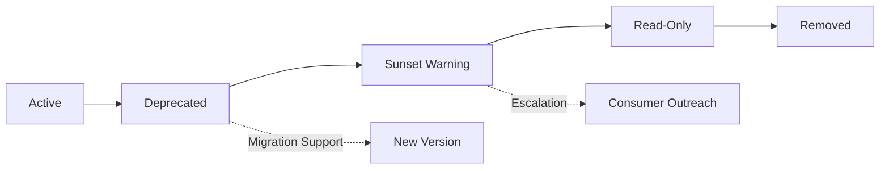
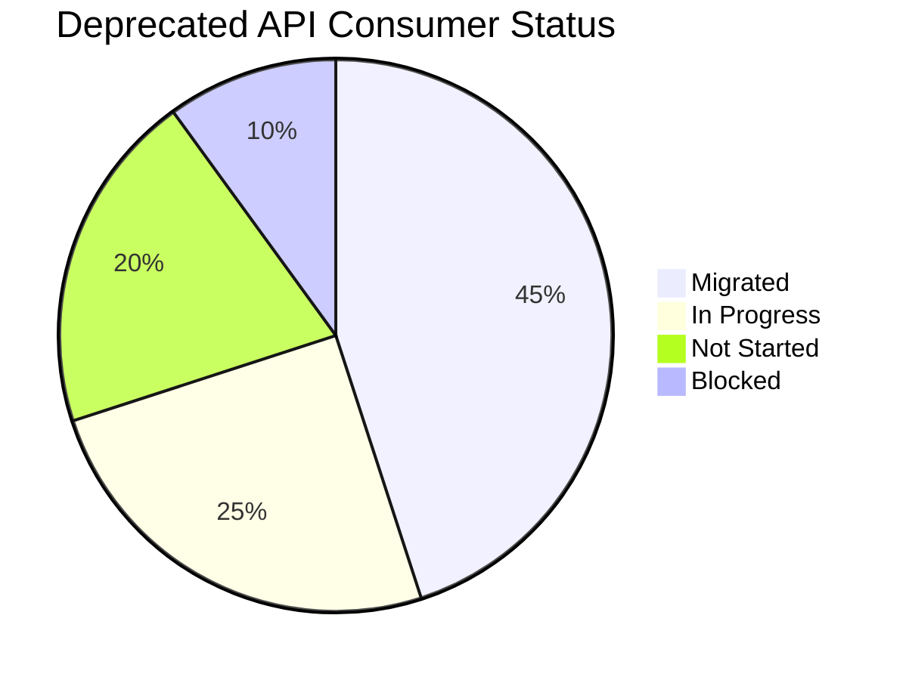
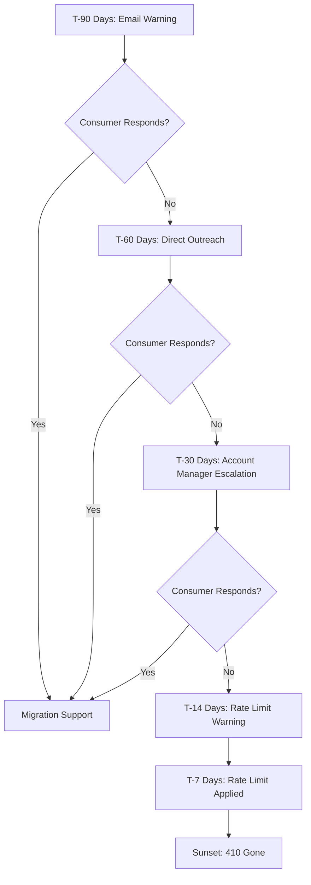
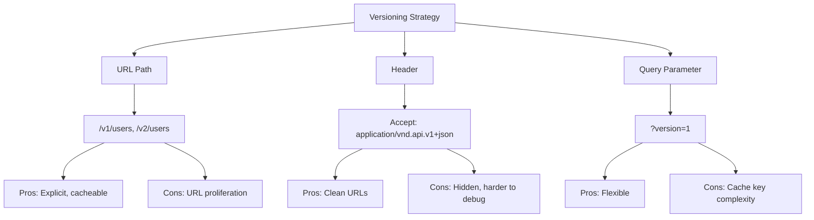

*[API]: Application Programming Interface
*[SDK]: Software Development Kit
*[HTTP]: Hypertext Transfer Protocol
*[RFC]: Request for Comments
*[SLA]: Service Level Agreement
*[EOL]: End of Life

# API Deprecation Playbooks That Work

## Introduction

Brief overview of why API deprecation is harder than it looks: consumers ignore warnings, sunset dates slip, and deprecated endpoints live forever because someone important still uses them. This section frames deprecation as a social and organizational problem, not just a technical one.

_Include a real-world scenario: an API version marked "deprecated" two years ago that still handles 30% of traffic because three enterprise customers never migrated._

<Callout type="warning">
Deprecation without enforcement is just wishful thinking. If there is no consequence for ignoring sunset headers, consumers will ignore them indefinitely.
</Callout>

## The Deprecation Lifecycle

### Phases of Deprecation

Walk through the complete lifecycle: announcement, deprecation period, migration support, sunset warning, and removal. Each phase has distinct goals and communication requirements.


Figure: API deprecation lifecycle with parallel migration support track.

| Phase | Duration | Consumer Communication | Enforcement |
|-------|----------|----------------------|-------------|
| Deprecated | 6-12 months | Announcement, docs update | Deprecation header |
| Sunset Warning | 3 months | Direct outreach to active consumers | Sunset header with date |
| Read-Only | 2-4 weeks | Final warning, support escalation | Write operations disabled |
| Removed | — | Post-removal documentation | 410 Gone response |

Table: Deprecation phase timeline with communication and enforcement actions.

### Setting Realistic Timelines

Discuss how to set deprecation timelines based on consumer patterns. Enterprise APIs need longer windows than internal services. Include factors to consider: consumer update cycles, contractual obligations, and the cost of maintaining deprecated versions.

<Callout type="info">
Enterprise consumers often have quarterly release cycles. A 3-month deprecation window means they get exactly one chance to migrate. Plan for 6-12 months minimum for external APIs.
</Callout>

## Sunset Headers: The Technical Foundation

### RFC 8594: The Sunset HTTP Header

Explain the Sunset header standard and its semantics. Include the header format, how clients should interpret it, and common implementation mistakes.

```http title="sunset-header-response.http"
HTTP/1.1 200 OK
Content-Type: application/json
Deprecation: true
Sunset: Sat, 01 Jun 2025 00:00:00 GMT
Link: <https://api.example.com/v3/users>; rel="successor-version"

{
  "users": [...]
}
```
Code: Response headers for a deprecated endpoint with sunset date and successor link.

### Deprecation Header Semantics

Detail the Deprecation header (separate from Sunset) and how the two work together. Deprecation signals intent; Sunset signals deadline.

```yaml title="api-gateway-headers.yaml" {5-8}
routes:
  - path: /api/v1/*
    upstream: legacy-service
    headers:
      add:
        Deprecation: "true"
        Deprecation-Date: "2024-06-01T00:00:00Z"
        Sunset: "Sat, 01 Jun 2025 00:00:00 GMT"
        Link: '</api/v2/{path}>; rel="successor-version"'
```
Code: API gateway configuration adding deprecation headers to legacy routes.

### Warning Headers for Detailed Context

Explain how to use the Warning header (RFC 7234) to provide additional deprecation context without breaking clients that do not understand custom headers.

```http title="warning-header-detail.http"
HTTP/1.1 200 OK
Warning: 299 - "API v1 is deprecated. Migrate to v2 by 2025-06-01. See https://docs.example.com/migration"
```
Code: Warning header providing human-readable deprecation context.

## Usage Tracking for Deprecation

### Identifying Active Consumers

Walk through how to track which consumers are using deprecated endpoints. Include metrics to capture: consumer identity (API key, OAuth client), request volume, endpoint coverage, and last-seen timestamps.

```sql title="consumer-usage-query.sql"
SELECT
    api_key_id,
    client_name,
    COUNT(*) as request_count,
    COUNT(DISTINCT endpoint) as endpoints_used,
    MAX(request_timestamp) as last_seen,
    MIN(request_timestamp) as first_seen
FROM api_requests
WHERE
    api_version = 'v1'
    AND request_timestamp > NOW() - INTERVAL '30 days'
GROUP BY api_key_id, client_name
ORDER BY request_count DESC;
```
Code: Query to identify active consumers of deprecated API version.

### Building a Consumer Migration Dashboard

Describe the dashboard that tracks migration progress. Include visualizations for: total deprecated traffic over time, consumer migration status, and endpoint-level usage breakdown.


Figure: Consumer migration status breakdown for deprecation tracking.

| Metric | Purpose | Alert Threshold |
|--------|---------|-----------------|
| Deprecated Traffic % | Overall migration progress | > 20% at T-30 days |
| Active Consumer Count | Remaining migration work | > 5 at T-30 days |
| New Consumer Sign-ups | Preventing new adoption | Any new consumer |
| Traffic by Consumer | Identify largest blockers | Top 3 consumers |

Table: Deprecation dashboard metrics with alert thresholds.

### Blocking New Adoption

Explain how to prevent new consumers from adopting deprecated APIs while existing consumers migrate. Include API key provisioning changes, documentation updates, and SDK version controls.

<Callout type="danger">
Never allow new consumers to start using a deprecated API. Every new adoption extends your deprecation timeline and increases migration support costs.
</Callout>

```yaml title="api-gateway-new-consumer-block.yaml"
routes:
  - path: /api/v1/*
    conditions:
      # Block API keys created after deprecation announcement
      - header: X-API-Key
        check: created_before
        value: "2024-01-15"
    on_failure:
      status: 403
      body: |
        {
          "error": "new_consumers_blocked",
          "message": "API v1 is deprecated. New integrations must use v2.",
          "migration_guide": "https://docs.example.com/v2/migration"
        }
```
Code: Gateway configuration blocking new consumers from deprecated API.

## Communication Strategies

### The Announcement Checklist

Detail what a deprecation announcement should include: timeline, migration guide link, breaking changes summary, support contact, and FAQ for common concerns.

```markdown title="deprecation-announcement-template.md"
# API v1 Deprecation Notice

## Timeline
- **Deprecated**: January 15, 2024
- **Sunset**: June 1, 2025
- **Removal**: July 1, 2025

## What's Changing
API v1 endpoints will return 410 Gone after July 1, 2025.

## Migration Guide
Complete migration documentation: [V1 to V2 Migration Guide](link)

## Breaking Changes in V2
- Authentication moved from API key to OAuth 2.0
- Pagination changed from offset to cursor-based
- Response envelope removed (data no longer wrapped)

## Support
- Migration office hours: Thursdays 2-3pm UTC
- Support channel: #api-migration-help
- Direct support: api-support@example.com

## FAQ
**Q: Can I get an extension?**
A: Contact api-support@example.com with your use case by March 1, 2025.
```
Code: Deprecation announcement template covering all required information.

### Multi-Channel Communication

Explain why a single announcement is not enough. Include the communication channels to use: email to registered developers, in-dashboard notifications, documentation banners, and API response headers.

| Channel | Timing | Audience |
|---------|--------|----------|
| Blog/Changelog | Announcement | All developers |
| Email | Announcement + monthly | Registered consumers |
| API Headers | Every request | Active consumers |
| Dashboard Banner | Continuous | Logged-in users |
| Direct Outreach | T-90, T-30, T-7 days | High-traffic consumers |

Table: Multi-channel deprecation communication schedule.

### Escalation Paths When Consumers Ignore Warnings

Detail the escalation process for consumers who are not migrating. Include technical escalation (rate limiting, degraded service) and organizational escalation (account management, contract review).


Figure: Consumer escalation path for deprecation timeline enforcement.

<Callout type="warning">
Enterprise consumers may require executive-to-executive escalation. Build relationships with account managers early in the deprecation process—you will need them for the final push.
</Callout>

## Migration Tooling and Support

### Migration Guides That Actually Help

Discuss what makes a migration guide useful: endpoint mapping tables, code examples in consumer languages, common pitfalls, and validation tools.

```typescript title="migration-example-before-after.ts"
// BEFORE: API v1
const response = await fetch('https://api.example.com/v1/users', {
  headers: { 'X-API-Key': apiKey }
});
const { data: users } = await response.json(); // v1 wraps in data envelope

// AFTER: API v2
const response = await fetch('https://api.example.com/v2/users', {
  headers: { 'Authorization': `Bearer ${accessToken}` }
});
const users = await response.json(); // v2 returns array directly
```
Code: Side-by-side migration example showing authentication and response format changes.

### Endpoint Mapping Tables

Provide a template for endpoint mapping that shows old endpoints, new equivalents, and any behavioral differences.

| V1 Endpoint | V2 Endpoint | Changes |
|-------------|-------------|---------|
| `GET /v1/users` | `GET /v2/users` | Cursor pagination, no envelope |
| `GET /v1/users/:id` | `GET /v2/users/:id` | Field renames: `created` → `createdAt` |
| `POST /v1/users` | `POST /v2/users` | Request body schema changed |
| `DELETE /v1/users/:id` | `DELETE /v2/users/:id` | Now returns 204, not 200 with body |
| `GET /v1/users/:id/orders` | `GET /v2/orders?userId=:id` | Moved to orders resource |

Table: V1 to V2 endpoint mapping with behavioral changes noted.

### SDK Version Management

Explain how to manage SDK deprecation alongside API deprecation. Include version pinning strategies, deprecation warnings in SDK code, and forcing SDK upgrades.

```typescript title="sdk-deprecation-warning.ts" {3-8}
// In SDK v1.x
export async function getUsers(): Promise<User[]> {
  console.warn(
    '[DEPRECATION] SDK v1.x uses deprecated API v1. ' +
    'Upgrade to SDK v2.x before June 1, 2025. ' +
    'See: https://docs.example.com/sdk/migration'
  );

  const response = await this.client.get('/v1/users');
  return response.data.users;
}
```
Code: SDK method with runtime deprecation warning to drive consumer awareness.

### Migration Validation Tools

Describe tools that help consumers validate their migration: shadow traffic comparison, response diff tools, and compatibility test suites.

```bash title="migration-validator.sh"
#!/bin/bash
# Compare responses between v1 and v2 for the same request

V1_RESPONSE=$(curl -s -H "X-API-Key: $API_KEY" \
  "https://api.example.com/v1/users?limit=10")

V2_RESPONSE=$(curl -s -H "Authorization: Bearer $TOKEN" \
  "https://api.example.com/v2/users?limit=10")

# Transform v1 response to v2 format for comparison
V1_TRANSFORMED=$(echo "$V1_RESPONSE" | jq '.data | map({id, name, createdAt: .created})')

# Diff the responses
diff <(echo "$V1_TRANSFORMED" | jq -S .) <(echo "$V2_RESPONSE" | jq -S .)
```
Code: Shell script comparing v1 and v2 responses to validate migration correctness.

## Enforcement Mechanisms

### Graduated Enforcement

Explain the progression from soft warnings to hard enforcement. Each step increases pressure while giving consumers time to react.

| Phase | Mechanism | Consumer Impact |
|-------|-----------|-----------------|
| Warning | Deprecation headers only | None (headers ignored by most) |
| Logging | Log all deprecated calls | None (internal tracking) |
| Rate Limiting | Reduce rate limits by 50% | Degraded performance |
| Read-Only | Disable write operations | Partial functionality loss |
| Removal | Return 410 Gone | Complete failure |

Table: Graduated enforcement progression for API deprecation.

### Rate Limiting Deprecated Endpoints

Detail how to use rate limiting as an enforcement mechanism. Reducing rate limits creates pressure to migrate without completely breaking consumers.

```yaml title="rate-limit-deprecated.yaml" {7-12}
rate_limits:
  - path: /api/v2/*
    limits:
      - requests: 1000
        period: 1m

  - path: /api/v1/*
    limits:
      - requests: 100  # 10x lower than v2
        period: 1m
    headers:
      X-RateLimit-Deprecation-Notice: "Rate limits reduced for deprecated API. Migrate to v2 for full limits."
```
Code: Rate limit configuration applying reduced limits to deprecated API version.

### The 410 Gone Response

Explain the proper use of HTTP 410 Gone for removed endpoints. Include what information to provide in the response body to help consumers who hit removed endpoints.

```json title="410-gone-response.json"
{
  "error": "endpoint_removed",
  "message": "This API version has been removed.",
  "removed_date": "2025-07-01",
  "migration_guide": "https://docs.example.com/v2/migration",
  "successor_endpoint": "https://api.example.com/v2/users",
  "support_contact": "api-support@example.com"
}
```
Code: 410 Gone response body providing migration guidance for removed endpoints.

<Callout type="info">
410 Gone is semantically correct for removed API versions—it tells clients the resource existed but is now permanently unavailable. 404 Not Found implies it never existed.
</Callout>

## Handling Edge Cases

### Enterprise Customers With Contractual Obligations

Discuss how to handle customers whose contracts guarantee API availability. Include strategies: contract renegotiation, extended support tiers, and migration assistance programs.

> The contract says we support API v1 until 2026. The engineering team wants to remove it in 2025. Welcome to enterprise software.
> — Every platform team eventually

### Critical Integrations You Cannot Break

Address the reality that some integrations are too important to break, even after sunset. Include strategies: extended maintenance windows, dedicated migration support, and executive escalation.

<Callout type="danger">
If a consumer represents significant revenue and refuses to migrate, you have a business problem, not a technical problem. Escalate to business stakeholders before sunset.
</Callout>

### Versioning Strategies to Reduce Future Pain

Discuss API versioning approaches that make future deprecations easier: URL versioning, header versioning, and the tradeoffs between them.


Figure: API versioning strategy comparison with tradeoffs.

## Measuring Deprecation Success

### Key Metrics

Define the metrics that indicate successful deprecation: traffic migration rate, consumer migration rate, support ticket volume, and incidents related to deprecated APIs.

| Metric | Target | Measurement |
|--------|--------|-------------|
| Deprecated Traffic | < 5% at sunset | API gateway metrics |
| Migrated Consumers | > 95% at sunset | Consumer tracking dashboard |
| Support Tickets | Declining trend | Support system |
| Migration Incidents | Zero P1s | Incident tracking |

Table: Deprecation success metrics with targets.

### Post-Deprecation Review

Explain the importance of reviewing each deprecation cycle. What worked? What took longer than expected? How can the next deprecation be smoother?

```markdown title="deprecation-retro-template.md"
# API v1 Deprecation Retrospective

## Timeline Adherence
- Planned sunset: June 1, 2025
- Actual removal: August 15, 2025
- Delay reason: 3 enterprise customers required extended migration support

## Consumer Migration
- Total consumers at announcement: 147
- Migrated before sunset: 138 (94%)
- Required extended support: 9 (6%)

## What Worked
- Early direct outreach to top 20 consumers by traffic
- Migration office hours for live support
- Endpoint mapping table reduced support tickets

## What Didn't Work
- Initial 6-month timeline too short for enterprise customers
- SDK deprecation warnings not visible enough
- Rate limiting escalation started too late

## Recommendations for Next Deprecation
- Start with 12-month timeline for external APIs
- Add SDK deprecation warnings at compile time, not runtime
- Begin rate limiting at T-90 days, not T-30 days
```
Code: Post-deprecation retrospective template for process improvement.

## Conclusion

Summarize the key principles: communicate early and often, track usage obsessively, enforce gradually but firmly, and plan for the consumers who will not move voluntarily. Emphasize that deprecation is a process that requires sustained attention, not a single announcement.

<Callout type="success">
Successful deprecation is measured by what does not happen: no outages, no angry customers, and no deprecated endpoints lingering years past their sunset date.
</Callout>

---

## Cover Prompt

### Prompt 1: Sunset Over API Architecture

Create a dramatic sunset scene where the sun is setting behind a stylized cityscape made of API endpoint blocks and server racks. The fading light casts long shadows over deprecated v1 endpoints while new v2 endpoints glow with fresh morning light on the opposite horizon. Style: architectural illustration meets nature photography, warm orange and purple sunset colors transitioning to cool blue dawn, 16:9 aspect ratio.

### Prompt 2: Migration Bridge Metaphor

Illustrate a grand suspension bridge spanning a digital chasm. On one side, legacy API infrastructure (older, weathered styling). On the other, modern API architecture (clean, glowing). Consumers (represented as small vehicles or data packets) are crossing the bridge. Some legacy infrastructure is beginning to crumble. Style: isometric digital illustration, tech-meets-infrastructure aesthetic, blue and orange color scheme, 16:9 aspect ratio.

### Prompt 3: Countdown Timer Visualization

Design an abstract visualization of a large digital countdown timer (showing "30 DAYS REMAINING") surrounded by flowing streams of API traffic gradually redirecting from old endpoints (red/orange streams) to new endpoints (green/blue streams). The deprecated endpoints should be visually fading. Style: data visualization art, dark background with glowing elements, motion blur on traffic streams, 16:9 aspect ratio.

### Prompt 4: Communication Network Deprecation

Create an illustration showing a network of connected nodes (API consumers) receiving deprecation signals. Central broadcast tower sending out warning waves. Some nodes are updated (green), some are receiving warnings (yellow), some are ignoring signals (red). The red nodes should have visual representation of warning headers bouncing off them. Style: network topology visualization, broadcast/signal aesthetic, muted colors with warning highlights, 16:9 aspect ratio.

### Prompt 5: Version Evolution Timeline

Illustrate a horizontal timeline showing API version evolution from v1 to v3. V1 is archaeological/fossil-like (being excavated), v2 is current and thriving (active, glowing), v3 is emerging (blueprint/wireframe style). Include visual representations of sunset headers as amber warning lights above v1. Style: timeline infographic illustration, evolution/archaeology meets technology, warm to cool color gradient left to right, 16:9 aspect ratio.
