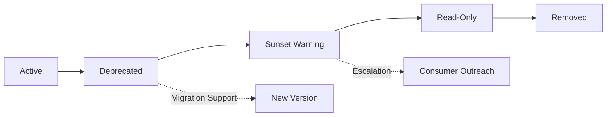
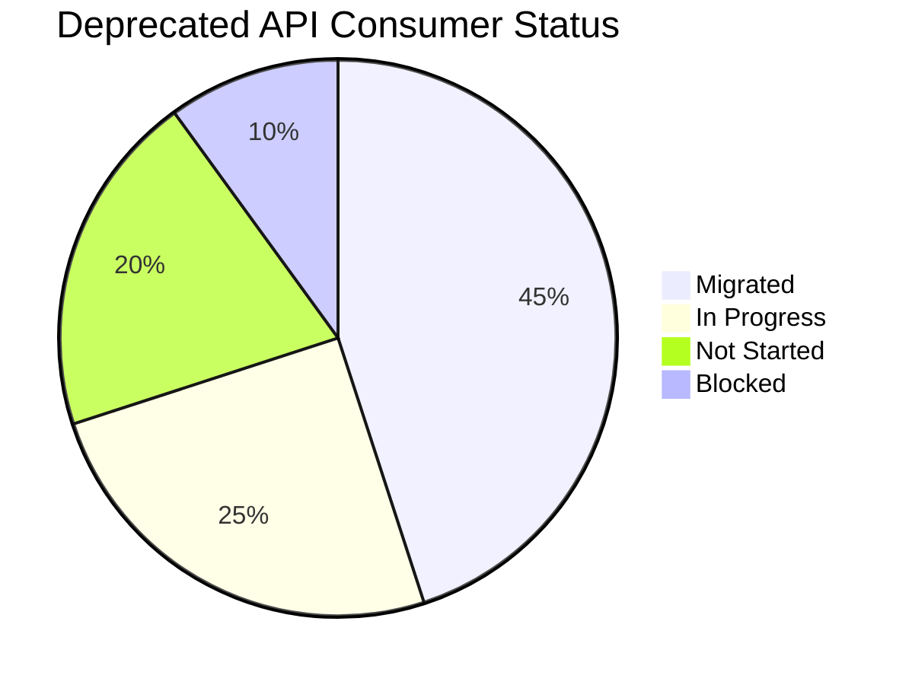

*[API]: Application Programming Interface
*[SDK]: Software Development Kit
*[HTTP]: Hypertext Transfer Protocol
*[RFC]: Request for Comments
*[SLA]: Service Level Agreement
*[EOL]: End of Life

## Introduction

API deprecation looks simple on paper: announce a sunset date, send some emails, flip the switch. In practice, it is one of the most politically fraught operations in platform engineering. Consumers ignore warnings. Sunset dates slip. Deprecated endpoints live forever because someone important still uses them.

I once inherited an API version marked "deprecated" two years prior that still handled 30% of production traffic. Three enterprise customers had never migrated. Two of them had contracts that technically guaranteed API availability. The third was our largest account, and nobody wanted to be the engineer who broke their integration. The deprecation announcement had been sent, the documentation updated, the sunset date long passed—and nothing had actually changed. We eventually got all three migrated—it took graduated enforcement, executive escalation, and migration support that felt like hand-holding—but we did it, and we learned what actually works in the process.

The technical side of deprecation is straightforward: add some headers, update some docs, eventually return 410 Gone. The hard part is organizational. Deprecation is a coordination problem across teams, companies, and incentive structures. Your consumers have no inherent motivation to migrate. They have working code. Migration is work, and work has costs. Unless you create consequences for not migrating, they will not migrate.

<Callout type="warning">
Deprecation without enforcement is just wishful thinking. If there is no consequence for ignoring sunset headers, consumers will ignore them indefinitely.
</Callout>

This article covers the full deprecation lifecycle: the technical standards (Sunset headers, Deprecation headers), the tracking systems (who is still using the deprecated API and how much), the communication strategies (because one email is never enough), and the enforcement mechanisms (because eventually you have to make it hurt). The goal is not just to deprecate an API—it is to actually remove it.

## The Deprecation Lifecycle

### Phases of Deprecation

A deprecation is not an event; it is a process with distinct phases. Each phase has different goals, different communication requirements, and different enforcement mechanisms. Skipping phases or rushing through them is how you end up with deprecated APIs that never actually get removed.

The phases are: announcement, active deprecation, sunset warning, read-only mode (optional but useful), and removal. The timeline between phases depends on your consumer base—internal APIs can move faster than external ones, and enterprise APIs need the longest runways.



Figure: API deprecation lifecycle with parallel migration support track.

| Phase | Duration | Consumer Communication | Enforcement |
|-------|----------|----------------------|-------------|
| Deprecated | See timeline guidance below | Announcement, docs update | Deprecation header |
| Sunset Warning | 3 months | Direct outreach to active consumers | Sunset header with date |
| Read-Only | 2-4 weeks | Final warning, support escalation | Write operations disabled |
| Removed | — | Post-removal documentation | 410 Gone response |

Table: Deprecation phase timeline with communication and enforcement actions.

The read-only phase is optional but valuable. Disabling write operations while keeping reads working gives consumers a preview of what full removal will feel like. It also reduces the blast radius if someone has a critical read path they forgot about—they will discover it before complete removal, and you will get a support ticket instead of a production outage.

### Setting Realistic Timelines

The biggest mistake in deprecation planning is setting timelines based on how long you _want_ the deprecation to take rather than how long it _will_ take. Your consumers have their own release cycles, their own priorities, and their own backlogs. Your deprecation is not at the top of their list.

Timeline guidance varies by consumer type:

- _Internal APIs_ (consumed by teams in your organization): 3-6 months. You can coordinate directly and have organizational leverage to prioritize migration work.
- _External APIs_ (consumed by third-party developers): 6-12 months minimum. These consumers have their own backlogs and no inherent motivation to prioritize your deprecation.
- _Enterprise APIs_ (consumed by large customers with contracts): 12 months minimum. Enterprise customers often have quarterly release cycles, change control boards, and contractual review processes. A 3-month window gives them exactly one release cycle to complete migration—assuming they prioritize it immediately, which they will not.

<Callout type="info">
The timeline guidance above represents minimums. When in doubt, add time. The cost of maintaining a deprecated version for a few extra months is almost always lower than the cost of breaking consumers who needed more runway.
</Callout>

Factors that extend your timeline:

- _Contractual obligations_: If your SLA or terms of service guarantee API availability for a period, you are bound by that regardless of your technical preferences.
- _Consumer update cycles_: Mobile apps have app store review delays. Enterprise software has change control processes. B2B integrations have their own release schedules.
- _Migration complexity_: Breaking changes require more time than additive changes. Authentication changes are particularly painful.
- _Consumer count_: More consumers means more support load and more edge cases. Budget time accordingly.

The cost of maintaining a deprecated version longer is usually lower than the cost of breaking consumers who did not have time to migrate. Set aggressive-but-achievable timelines, then hold firm on enforcement.

## Sunset Headers: The Technical Foundation

### RFC 8594: The Sunset HTTP Header

The Sunset header is defined in RFC 8594 and provides a machine-readable way to communicate when a resource will become unavailable. The value is an HTTP-date timestamp indicating the sunset time.

```http title="sunset-header-response.http"
HTTP/1.1 200 OK
Content-Type: application/json
Deprecation: true
Sunset: Sat, 01 Jun 2025 00:00:00 GMT
Link: <https://api.example.com/v3/users>; rel="successor-version"

{
  "users": [...]
}
```

Code: Response headers for a deprecated endpoint with sunset date and successor link.

The header format is straightforward, but there are common implementation mistakes:

_Wrong date format_: The Sunset header requires HTTP-date format (RFC 7231), not ISO 8601. `Sat, 01 Jun 2025 00:00:00 GMT` is correct. `2025-06-01T00:00:00Z` is not.

_Timezone confusion_: Always use GMT. Local timezones create ambiguity about exactly when the sunset occurs.

_Missing Link header_: The Sunset header tells consumers _when_ the endpoint goes away, but not _where_ to go instead. Always include a Link header with `rel="successor-version"` pointing to the replacement endpoint.

Clients that understand the Sunset header can parse it and take automated action—logging warnings, alerting operators, or even failing builds if a dependency has a sunset date in the past. Most clients ignore it entirely, which is why you need additional communication channels.

### Deprecation Header Semantics

The Deprecation header (defined in a separate draft specification) signals that a resource is deprecated, distinct from the Sunset header that signals when it will be removed. The two headers serve different purposes and should be used together.

- _Deprecation_ signals intent: "We plan to remove this."
- _Sunset_ signals deadline: "We will remove this on this date."

An endpoint can be deprecated without a sunset date (you know you want to remove it but have not committed to a timeline), and in rare cases an endpoint can have a sunset date without being deprecated (scheduled maintenance windows, for example). In practice, you will usually set both.

Most API gateways support adding headers to responses. Here is an example using AWS API Gateway's OpenAPI extension format:

```yaml title="api-gateway-openapi.yaml"
# AWS API Gateway OpenAPI 3.0 - deprecation headers via response parameters
paths:
  /v1/users:
    get:
      deprecated: true  # OpenAPI native deprecation flag
      x-amazon-apigateway-integration:
        type: http_proxy
        uri: "https://legacy-service.internal/users"
        responses:
          default:
            responseParameters:
              method.response.header.Deprecation: "'true'"
              method.response.header.Sunset: "'Sat, 01 Jun 2025 00:00:00 GMT'"
              method.response.header.Link: "'</v2/users>; rel=successor-version'"
```

Code: AWS API Gateway OpenAPI excerpt showing deprecation header injection via `responseParameters`.

The `Deprecation-Date` header is not part of any RFC but is useful for indicating when the deprecation was announced. This helps consumers understand how long they have known about the deprecation—and helps you respond to complaints about insufficient notice.

### Warning Headers for Detailed Context

The Warning header (RFC 7234, though deprecated in RFC 9111) provides a way to include human-readable deprecation messages in responses. While the header itself is technically deprecated in HTTP semantics, it remains useful for API deprecation because many clients and logging systems will capture and display it.

```http title="warning-header-detail.http"
HTTP/1.1 200 OK
Warning: 299 - "API v1 is deprecated. Migrate to v2 by 2025-06-01. See https://docs.example.com/migration"
```

Code: Warning header providing human-readable deprecation context.

The `299` warning code means "Miscellaneous persistent warning"—the warning applies to all requests to this resource, not just this specific response. The format is `warn-code warn-agent "warn-text"`, where the warn-agent can be `-` if you do not want to specify it.

The advantage of Warning headers over custom headers is that some HTTP clients and proxies will log or display them automatically. The disadvantage is that the header is large and adds overhead to every response. Use it during the sunset warning phase when you want maximum visibility, not necessarily from day one of deprecation.

For more detailed or structured deprecation information, consider a custom header that clients can opt into parsing:

```http title="custom-deprecation-header.http"
HTTP/1.1 200 OK
X-API-Deprecation-Info: {"deprecated": true, "sunset": "2025-06-01", "successor": "/v2/users", "migration_guide": "https://docs.example.com/migration"}
```

Code: Custom JSON header for structured deprecation metadata.

This gives you flexibility to include whatever information consumers need, at the cost of requiring custom parsing logic.

## Usage Tracking for Deprecation

### Identifying Active Consumers

You cannot deprecate what you cannot measure. Before announcing a deprecation, you need to know exactly who is using the deprecated API, how much traffic they send, and which endpoints they hit. This data drives every other decision: timeline length, communication priority, and enforcement escalation.

The minimum data to capture for each consumer:

- _Consumer identity_: API key, OAuth client ID, or whatever authentication mechanism you use. You need to know who to contact.
- _Request volume_: Total requests over the tracking period. High-volume consumers need more attention.
- _Endpoint coverage_: Which specific endpoints they use. A consumer using one endpoint is easier to migrate than one using twenty.
- _Last seen_: When they last made a request. A consumer who has not called the API in 60 days may have already migrated or abandoned their integration.
- _First seen_: When they started using the API. Consumers who adopted recently may be easier to move.

```sql title="consumer-usage-query.sql"
-- Query to identify active consumers of a deprecated API version
-- Run against your API request logs or analytics warehouse
SELECT
    api_key_id,
    client_name,
    COUNT(*) as request_count,
    COUNT(DISTINCT endpoint) as endpoints_used,
    MAX(request_timestamp) as last_seen,
    MIN(request_timestamp) as first_seen
FROM api_requests
WHERE
    api_version = 'v1'
    AND request_timestamp > NOW() - INTERVAL '30 days'
GROUP BY api_key_id, client_name
ORDER BY request_count DESC;
```

Code: Query to identify active consumers of deprecated API version.

Run this query weekly throughout the deprecation period. The output becomes your migration tracking list. Sort by request count to prioritize outreach—the top 10 consumers by volume often represent 80% or more of deprecated traffic.

If you do not have per-consumer tracking today, implementing it is the first step before announcing any deprecation. You cannot send targeted communications, measure migration progress, or enforce deadlines without knowing who your consumers are.

### Building a Consumer Migration Dashboard

A deprecation dashboard serves two purposes: it gives you visibility into migration progress, and it creates organizational accountability. When leadership can see that 30% of traffic is still on the deprecated API with 45 days until sunset, they understand why the deprecation might need executive escalation.

The core visualizations:



Figure: Consumer migration status breakdown for deprecation tracking.

Track consumer status manually or through automated detection. A consumer is "migrated" when they have zero requests to the deprecated API and non-zero requests to the new API. "In progress" means they are calling both versions. "Not started" means they are only calling the deprecated version. "Blocked" is a manual flag for consumers who have communicated that they cannot migrate without help.

| Metric | Purpose | Alert Threshold |
|--------|---------|-----------------|
| Deprecated Traffic % | Overall migration progress | &gt; 20% at T-30 days |
| Active Consumer Count | Remaining migration work | &gt; 5 at T-30 days |
| New Consumer Sign-ups | Preventing new adoption | Any new consumer |
| Traffic by Consumer | Identify largest blockers | Top 3 consumers |

Table: Deprecation dashboard metrics with alert thresholds.

Set alerts on these metrics. If deprecated traffic is still above 20% with 30 days until sunset, something is wrong—either consumers are not migrating, or your timeline was unrealistic. Either way, you need to act.

The dashboard should also show a time series of deprecated traffic percentage. A healthy deprecation shows a steady downward trend. A flat line means consumers are not migrating. An upward trend means you have a serious problem—possibly new consumers adopting the deprecated API.

### Blocking New Adoption

The moment you announce a deprecation, stop allowing new consumers to adopt the deprecated API. Every new consumer extends your deprecation timeline and increases your support burden. This is non-negotiable.

<Callout type="danger">
Never allow new consumers to start using a deprecated API. Every new adoption extends your deprecation timeline and increases migration support costs.
</Callout>

Enforcement mechanisms:

_API key provisioning_: When creating new API keys or OAuth clients, do not grant access to deprecated API versions. The provisioning system should default to the latest stable version.

_Documentation_: Remove the deprecated API from public documentation, or move it to an "archived" section with prominent deprecation warnings. New developers should not find the deprecated API when searching for how to integrate.

_SDK distribution_: If you publish SDKs, stop distributing versions that use the deprecated API. Remove them from package managers or mark them as deprecated in the registry metadata.

_Gateway enforcement_: Configure your API gateway to reject requests from API keys created after the deprecation announcement date:

```typescript title="deprecation-authorizer.ts"
import { APIGatewayTokenAuthorizerEvent, APIGatewayAuthorizerResult } from 'aws-lambda';
import { APIGateway } from '@aws-sdk/client-api-gateway';

const apiGateway = new APIGateway({});
const DEPRECATION_CUTOFF = new Date('2024-01-15');
const V1_API_ARN = 'arn:aws:execute-api:us-east-1:123456789:abc123/*/GET/v1/*';

export async function handler(
  event: APIGatewayTokenAuthorizerEvent
): Promise<APIGatewayAuthorizerResult> {
  const apiKeyId = event.authorizationToken;

  // Fetch API key metadata from API Gateway
  const keyData = await apiGateway.getApiKey({
    apiKey: apiKeyId,
    includeValue: false
  });

  const keyCreatedAt = keyData.createdDate ? new Date(keyData.createdDate) : new Date(0);
  const isNewConsumer = keyCreatedAt > DEPRECATION_CUTOFF;

  if (isNewConsumer) {
    // Deny access to deprecated API for keys created after deprecation
    return {
      principalId: apiKeyId,
      policyDocument: {
        Version: '2012-10-17',
        Statement: [{
          Action: 'execute-api:Invoke',
          Effect: 'Deny',
          Resource: V1_API_ARN
        }]
      },
      context: {
        errorCode: 'NEW_CONSUMER_BLOCKED',
        message: 'API v1 is deprecated. New integrations must use v2.',
        migrationGuide: 'https://docs.example.com/v2/migration'
      }
    };
  }

  // Allow existing consumers
  return {
    principalId: apiKeyId,
    policyDocument: {
      Version: '2012-10-17',
      Statement: [{
        Action: 'execute-api:Invoke',
        Effect: 'Allow',
        Resource: V1_API_ARN
      }]
    }
  };
}
```

Code: Lambda authorizer that blocks API keys created after the deprecation date from accessing v1 endpoints.

This is aggressive, but necessary. The alternative is explaining to stakeholders why the deprecation is delayed because new consumers keep adopting the thing you are trying to remove.

## Communication Strategies

### The Announcement Checklist

A deprecation announcement is a legal document as much as a technical one. When a consumer complains that they did not have enough notice, you need to point to a clear, dated announcement that contained all the relevant information. Missing information in your announcement becomes a reason for consumers to request extensions.

Every deprecation announcement must include:

- _Timeline with specific dates_: Not "Q2 2025" but "June 1, 2025." Ambiguous dates create confusion and arguments.
- _Migration guide link_: The announcement tells consumers _what_ is happening; the guide tells them _how_ to respond.
- _Breaking changes summary_: A quick list of what will break. Consumers need to assess migration effort.
- _Support contact_: Where to get help. Include both self-service resources and human contact options.
- _FAQ for common concerns_: Pre-answer the questions you know consumers will ask.

```markdown title="deprecation-announcement-template.md"
# API v1 Deprecation Notice

## Timeline
- **Deprecated**: January 15, 2024
- **Sunset**: June 1, 2025
- **Removal**: July 1, 2025

## What Is Changing
API v1 endpoints will return 410 Gone after July 1, 2025.

## Migration Guide
Complete migration documentation: [V1 to V2 Migration Guide](link)

## Breaking Changes in V2
- Authentication moved from API key to OAuth 2.0
- Pagination changed from offset to cursor-based
- Response envelope removed (data no longer wrapped)

## Support
- Migration office hours: Thursdays 2-3pm UTC
- Support channel: #api-migration-help
- Direct support: api-support@example.com

## FAQ
**Q: Can I get an extension?**
A: Contact api-support@example.com with your use case by March 1, 2025.
```

Code: Deprecation announcement template covering all required information.

Publish the announcement in a permanent location with a stable URL. You will reference this URL in every subsequent communication, in API response headers, and potentially in legal discussions. Blog posts that scroll off the front page or Slack messages that disappear are not sufficient.

### Multi-Channel Communication

A single announcement email has approximately a 20% open rate on a good day. If your deprecation strategy relies on one email, 80% of your consumers will miss it. Effective deprecation communication requires multiple channels, repeated over time, with increasing urgency as the sunset approaches.

| Channel | Timing | Audience |
|---------|--------|----------|
| Blog/Changelog | Announcement | All developers |
| Email | Announcement + monthly | Registered consumers |
| API Headers | Every request | Active consumers |
| Dashboard Banner | Continuous | Logged-in users |
| Direct Outreach | T-90, T-30, T-7 days | High-traffic consumers |

Table: Multi-channel deprecation communication schedule.

The channels serve different purposes:

_Blog and changelog_ reach the broadest audience, including developers who are evaluating your API but have not yet integrated. They set the public record.

_Email_ reaches registered consumers directly. Send the initial announcement, then monthly reminders with updated migration statistics. Include the consumer's own usage data if possible—"Your API key made 50,000 requests to deprecated endpoints last month" is more compelling than generic warnings.

_API headers_ reach consumers who are actively using the deprecated API, even if they ignore emails. The Deprecation and Sunset headers we discussed earlier serve this purpose.

_Dashboard banners_ catch consumers when they log in to manage their integration. A persistent, non-dismissable banner during the final 30 days is appropriate.

_Direct outreach_ is reserved for high-traffic consumers and the final push before sunset. This means phone calls, not emails. If a consumer represents 10% of deprecated traffic and has not responded to automated communications, someone needs to call them.

### Escalation Paths When Consumers Ignore Warnings

Most consumers will not migrate until they feel pressure. Your escalation path should apply increasing pressure while giving consumers opportunities to respond at each stage. The goal is migration, not punishment—but consumers need to believe that enforcement is real.

A typical escalation timeline looks like this: at T-90 days, send an email warning. If no response, escalate to direct outreach at T-60. Still nothing? Bring in account managers at T-30. At T-14, warn about rate limiting. At T-7, apply rate limits. At sunset, return 410 Gone.

The escalation path has two tracks: technical and organizational.

_Technical escalation_ includes rate limiting, degraded service quality, and eventually hard removal. These are the consequences that make ignoring deprecation uncomfortable.

_Organizational escalation_ involves account managers, customer success teams, and potentially executives. For enterprise customers, the engineering team sending emails is often less effective than their account manager explaining that continued API access is at risk.

<Callout type="warning">
Enterprise consumers may require executive-to-executive escalation. Build relationships with account managers early in the deprecation process—you will need them for the final push.
</Callout>

Document every escalation attempt. When a consumer claims they were not warned, you need a record showing the emails sent, the calls attempted, and the responses (or lack thereof). This documentation protects you organizationally and sometimes legally.

Communication creates awareness, but consumers also need practical support to act on it. The next section covers the migration tooling that turns deprecation announcements into completed migrations.

## Migration Tooling and Support

### Migration Guides That Actually Help

Most migration guides are useless. They describe what changed without showing how to change it. A developer reads "authentication moved to OAuth 2.0" and still has no idea what code to write. Good migration guides are reference material that developers can copy, paste, and adapt.

The components of a useful migration guide:

_Endpoint mapping tables_ show every old endpoint, its new equivalent, and what changed. Developers should be able to look up any v1 endpoint and immediately find the v2 replacement.

_Code examples in multiple languages_ demonstrate the actual code changes. If your consumers use JavaScript, Python, and Go, show examples in all three. Abstract descriptions help no one.

_Common pitfalls_ list the mistakes developers will make and how to avoid them. You know what these are—you made them yourself when building v2.

_Validation tools_ let developers verify their migration is correct before switching production traffic.

```typescript title="migration-example-before-after.ts"
// BEFORE: API v1
const response = await fetch('https://api.example.com/v1/users', {
  headers: { 'X-API-Key': apiKey }
});
const { data: users } = await response.json(); // v1 wraps in data envelope

// AFTER: API v2
const response = await fetch('https://api.example.com/v2/users', {
  headers: { 'Authorization': `Bearer ${accessToken}` }
});
const users = await response.json(); // v2 returns array directly
```

Code: Side-by-side migration example showing authentication and response format changes.

The before/after format is critical. Developers scan migration guides looking for patterns that match their code. When they see code that looks like theirs on the left, they know exactly what to write on the right.

### Endpoint Mapping Tables

Every migration guide needs a comprehensive endpoint mapping table. This is the single most referenced part of any migration documentation—developers will return to it repeatedly throughout their migration work.

The table should include:

- The old endpoint path and method
- The new endpoint path and method (if different)
- A summary of behavioral changes (not just "changed"—what specifically changed)

| V1 Endpoint | V2 Endpoint | Changes |
|-------------|-------------|---------|
| `GET /v1/users` | `GET /v2/users` | Cursor pagination, no envelope |
| `GET /v1/users/:id` | `GET /v2/users/:id` | Field renames: `created` → `createdAt` |
| `POST /v1/users` | `POST /v2/users` | Request body schema changed |
| `DELETE /v1/users/:id` | `DELETE /v2/users/:id` | Now returns 204, not 200 with body |
| `GET /v1/users/:id/orders` | `GET /v2/orders?userId=:id` | Moved to orders resource |

Table: V1 to V2 endpoint mapping with behavioral changes noted.

For complex changes, link from the table to detailed documentation. The table provides the overview; linked pages provide the depth. A developer migrating one endpoint should not have to read documentation for endpoints they do not use.

### SDK Version Management

If you publish SDKs, SDK deprecation runs parallel to API deprecation—but with different mechanics. Consumers who use your SDK will not see HTTP headers. They need deprecation warnings surfaced through the SDK itself.

Runtime warnings are the most direct approach. Every call to a deprecated method logs a warning:

```typescript title="sdk-deprecation-warning.ts" {3-8}
// In SDK v1.x
export async function getUsers(): Promise<User[]> {
  console.warn(
    '[DEPRECATION] SDK v1.x uses deprecated API v1. ' +
    'Upgrade to SDK v2.x before June 1, 2025. ' +
    'See: https://docs.example.com/sdk/migration'
  );

  const response = await this.client.get('/v1/users');
  return response.data.users;
}
```

Code: SDK method with runtime deprecation warning to drive consumer awareness.

Runtime warnings have a problem: developers only see them if they run their code and look at logs. For stronger enforcement, use compile-time deprecation. Most languages have deprecation annotations that generate warnings or errors at build time:

- TypeScript/JavaScript: JSDoc `@deprecated` tag (shows in IDE, but no build errors)
- Java: `@Deprecated` annotation with `forRemoval = true`
- Python: `warnings.warn()` with `DeprecationWarning`
- Go: Comment convention `// Deprecated:` (recognized by `staticcheck`)

For the strongest enforcement, stop publishing new versions of the deprecated SDK. If consumers cannot `npm install` or `pip install` a new version, they are forced to migrate. This is aggressive—use it in the final phase of deprecation when you need to force action.

### Migration Validation Tools

The biggest fear during migration is breaking production. Consumers delay migration because they are not confident the new API will behave identically to the old one. Validation tools reduce this fear by letting consumers verify correctness before switching.

_Response comparison tools_ call both API versions with the same inputs and diff the outputs:

```bash title="migration-validator.sh"
#!/bin/bash
# Compare responses between v1 and v2 for the same request

V1_RESPONSE=$(curl -s -H "X-API-Key: $API_KEY" \
  "https://api.example.com/v1/users?limit=10")

V2_RESPONSE=$(curl -s -H "Authorization: Bearer $TOKEN" \
  "https://api.example.com/v2/users?limit=10")

# Transform v1 response to v2 format for comparison
V1_TRANSFORMED=$(echo "$V1_RESPONSE" | jq '.data | map({id, name, createdAt: .created})')

# Diff the responses
diff <(echo "$V1_TRANSFORMED" | jq -S .) <(echo "$V2_RESPONSE" | jq -S .)
```

Code: Shell script comparing v1 and v2 responses to validate migration correctness.

_Shadow traffic_ is even more powerful. Route a copy of production traffic to the new API version without serving the responses to users. Compare the shadow responses to what v1 would have returned. This catches edge cases that synthetic tests miss.

_Compatibility test suites_ let consumers run your tests against their integration. Publish a test suite that exercises the v2 API and verifies correct behavior. Consumers run the suite after migration to confirm everything works.

The investment in validation tools pays off in reduced support load. Every consumer who can self-validate their migration is a consumer who does not file a support ticket.

## Enforcement Mechanisms

### Graduated Enforcement

Enforcement is the difference between a deprecation that succeeds and one that drags on forever. But enforcement done poorly—jumping straight to breaking consumers—creates incidents, erodes trust, and generates executive escalations that derail your timeline anyway.

Graduated enforcement applies increasing pressure over time. Each step is uncomfortable enough to motivate action but not so severe that it causes outages. Consumers who ignore soft warnings eventually hit hard consequences, but they have multiple opportunities to respond before that happens.

| Phase | Mechanism | Consumer Impact |
|-------|-----------|-----------------|
| Warning | Deprecation headers only | None (headers ignored by most) |
| Logging | Log all deprecated calls | None (internal tracking) |
| Rate Limiting | Reduce rate limits by 50% | Degraded performance |
| Read-Only | Disable write operations | Partial functionality loss |
| Removal | Return 410 Gone | Complete failure |

Table: Graduated enforcement progression for API deprecation.

The key insight is that each phase serves a different purpose:

_Warning and logging_ are for you, not consumers. They establish the paper trail and give you data on who needs to migrate.

_Rate limiting_ is the first enforcement consumers actually feel. Their integrations still work, but they work worse. This motivates action without causing outages.

_Read-only mode_ previews removal. Consumers discover which parts of their integration will break, but reads still work. This is particularly valuable for consumers who have forgotten they depend on the deprecated API.

_Removal_ is the final step. By this point, you have given consumers months of warning and multiple escalations. Anyone still hitting the deprecated API has chosen not to migrate.

### Rate Limiting Deprecated Endpoints

Rate limiting is the most effective soft enforcement mechanism. It makes using the deprecated API painful without making it impossible. Consumers experience degraded performance—slower responses, occasional 429 errors—that motivates migration without causing complete failures.

The implementation is straightforward: configure lower rate limits for deprecated endpoints than for their replacements.

```yaml title="rate-limit-deprecated.yaml" {7-12}
rate_limits:
  - path: /api/v2/*
    limits:
      - requests: 1000
        period: 1m

  - path: /api/v1/*
    limits:
      - requests: 100  # 10x lower than v2
        period: 1m
    headers:
      X-RateLimit-Deprecation-Notice: "Rate limits reduced for deprecated API. Migrate to v2 for full limits."
```

Code: Rate limit configuration applying reduced limits to deprecated API version.

Start with a modest reduction—maybe 50% of normal limits—and decrease further as the sunset approaches. At T-30 days, reduce to 25%. At T-7 days, reduce to 10%. This creates escalating pressure without a sudden cliff.

Always include a header explaining why the rate limit is lower than expected. Developers debugging rate limit errors need to understand that the solution is migration, not requesting a limit increase.

Rate limiting has a political advantage over hard removal: it is reversible. If an executive escalates because a critical consumer is affected, you can temporarily restore normal limits while addressing the situation. You cannot un-break an integration that hit a 410 Gone.

### The 410 Gone Response

HTTP 410 Gone is the correct status code for removed API endpoints. Unlike 404 Not Found (which implies the resource never existed or might exist at a different URL), 410 explicitly communicates that the resource existed but has been permanently removed.

When returning 410, include a response body that helps consumers understand what happened and what to do:

```json title="410-gone-response.json"
{
  "error": "endpoint_removed",
  "message": "This API version has been removed.",
  "removed_date": "2025-07-01",
  "migration_guide": "https://docs.example.com/v2/migration",
  "successor_endpoint": "https://api.example.com/v2/users",
  "support_contact": "api-support@example.com"
}
```

Code: 410 Gone response body providing migration guidance for removed endpoints.

<Callout type="info">
410 Gone is semantically correct for removed API versions—it tells clients the resource existed but is now permanently unavailable. 404 Not Found implies it never existed.
</Callout>

The response body matters because consumers who hit a 410 in production need to understand the situation immediately. A developer debugging a production incident at 2 AM should not have to search documentation to figure out why the API stopped working. Give them the migration guide URL right in the error response.

Some teams return 410 for the entire deprecated API version. Others return 410 on a per-endpoint basis as each endpoint is migrated. Per-endpoint removal is more work but allows incremental migration—consumers can migrate one endpoint at a time, and you can remove endpoints as soon as their traffic drops to zero.

## Handling Edge Cases

### Enterprise Customers With Contractual Obligations

Contracts complicate everything. An enterprise customer's contract may explicitly guarantee API v1 availability until a specific date, or it may include vague language about "maintaining backward compatibility" that their lawyers interpret broadly. Either way, you cannot deprecate your way out of a legal obligation.

> The contract says we support API v1 until 2026. The engineering team wants to remove it in 2025. Welcome to enterprise software.
>
> — Heard in every enterprise platform team eventually

When you discover a contractual conflict, you have several options:

_Renegotiate the contract_: Work with your sales or legal team to amend the contract. Offer something in exchange—extended support for the new API, migration assistance, a discount. Many customers will accept a reasonable deal if approached early.

_Create an extended support tier_: Offer continued v1 access as a paid add-on. This shifts the cost of maintenance to the customers who require it and creates a financial incentive to migrate. Price it high enough that migration looks attractive.

_Provide dedicated migration assistance_: Some enterprise customers cannot migrate because they lack engineering resources, not because they lack willingness. Offering to help—whether through documentation, office hours, or direct engineering support—can unblock them.

_Wait it out_: If the contract expires in 6 months and your deprecation timeline is 12 months, you may be able to simply wait. Maintain the deprecated API until the contractual obligation expires, then proceed with removal.

The key is discovering contractual obligations early. Before announcing any deprecation, ask your sales and legal teams: "Do any customer contracts reference this API version?" Finding out at T-30 days that you cannot proceed is worse than finding out at the start.

### Critical Integrations You Cannot Break

Some consumers are too important to break, contract or not. Your largest customer, a key partner, a consumer whose failure would generate press coverage—these integrations require special handling.

<Callout type="danger">
If a consumer represents significant revenue and refuses to migrate, you have a business problem, not a technical problem. Escalate to business stakeholders before sunset.
</Callout>

The engineering team cannot solve business problems. If a critical consumer is not migrating, escalate to whoever owns the business relationship. Account managers, customer success, executives—someone with organizational authority needs to have a conversation about priorities.

Strategies for critical integrations:

_Extended maintenance windows_: Keep the deprecated API running for specific consumers past the general sunset date. This is expensive but sometimes necessary. Be explicit about the end date—"We will maintain v1 for your integration until December 31, 2025, after which it will be removed regardless."

_Dedicated migration support_: Assign engineering resources to help the consumer migrate. Pair programming sessions, code reviews of their migration, direct Slack access to your team. Make migration as easy as possible.

_Executive escalation on both sides_: Sometimes the consumer's engineering team wants to migrate but cannot get prioritization from their leadership. Your executive calling their executive can unlock resources.

The goal is migration, not accommodation. Every special case you create extends your maintenance burden. Use these strategies to get critical consumers migrated, not to excuse them from migrating indefinitely.

## Versioning Strategies to Reduce Future Pain

The best time to think about deprecation is when designing the API. Versioning strategies that make deprecation easier save significant effort on every future deprecation cycle. Investing in a clear versioning approach now means smoother deprecations for years to come.

### Choosing a Versioning Strategy

The three common approaches each have tradeoffs:

_URL path versioning_ (`/v1/users`, `/v2/users`) is the most explicit. Versions are visible in every request, easy to route at the gateway level, and cacheable independently. The downside is URL proliferation—you end up with parallel URL hierarchies that can be confusing.

_Header versioning_ (`Accept: application/vnd.api.v1+json`) keeps URLs clean but hides the version in headers. This makes debugging harder—you cannot tell from a URL which version a request targets. It also complicates caching since the same URL returns different responses based on headers.

_Query parameter versioning_ (`?version=1`) is flexible and visible, but it complicates cache keys and can be accidentally omitted.

| Strategy | Visibility | Cacheability | Routing Complexity |
|----------|------------|--------------|-------------------|
| URL Path | High | Simple | Simple |
| Header | Low | Complex | Moderate |
| Query Parameter | Medium | Complex | Simple |

Table: API versioning strategy comparison.

For most teams, URL path versioning is the right choice. The explicitness is worth the URL proliferation. When you deprecate v1, the migration path is obvious: change `/v1/` to `/v2/` in your URLs. No header manipulation, no query parameter changes, just a straightforward find-and-replace.

### Versioning Principles That Ease Deprecation

Beyond choosing a strategy, certain principles make future deprecations smoother:

_Version at the API level, not the endpoint level_. Consumers should interact with a single API version at a time. Mixed-version integrations (calling some v1 endpoints and some v2 endpoints simultaneously) are fragile and complicate migration tracking.

_Plan for at least two live versions_. Your infrastructure should support running the current version and the previous version in parallel. This gives consumers a migration runway while you develop the next version.

_Document version differences incrementally_. Every time you add to v2 something that differs from v1, document the change immediately. Waiting until deprecation to write migration docs means reconstructing months of changes from memory and commit logs.

_Automate version routing_. Your API gateway should route requests to the correct backend based on version. Manual routing or application-level version switching creates operational burden during deprecation.

Whatever strategy you choose, be consistent. Mixing versioning strategies within an API creates confusion and makes deprecation harder.

## Measuring Deprecation Success

### Key Metrics

A deprecation succeeds when the deprecated API is actually removed. But you need leading indicators along the way to know whether you are on track or heading for a missed deadline.

The core metrics:

| Metric | Target | Measurement |
|--------|--------|-------------|
| Deprecated Traffic | &lt; 5% at sunset | API gateway metrics |
| Migrated Consumers | &gt; 95% at sunset | Consumer tracking dashboard |
| Support Tickets | Declining trend | Support system |
| Migration Incidents | Zero P1s | Incident tracking |

Table: Deprecation success metrics with targets.

_Deprecated traffic percentage_ is your primary metric. Track it weekly and plot the trend. A healthy deprecation shows steady decline. If the percentage is flat or rising, something is wrong—either consumers are not migrating, or new consumers are adopting the deprecated API despite your blocks.

_Consumer migration rate_ tracks how many distinct consumers have completed migration, regardless of their traffic volume. A small number of high-traffic consumers can dominate your traffic metrics while dozens of smaller consumers remain unmigrated. Track both.

_Support ticket volume_ indicates whether your migration documentation and tooling are working. A spike in tickets suggests confusion or missing documentation. A steady decline suggests consumers are self-serving their migrations successfully.

_Migration incidents_ track problems caused by the migration itself—consumers who migrated but hit bugs, performance regressions, or unexpected behavior differences. Zero P1 incidents is the goal. Any P1 incident during migration erodes trust and slows adoption.

Set alerts on these metrics at key milestones. If deprecated traffic is above 20% at T-30 days, you need to escalate. If it is above 5% at T-7 days, you may need to delay the sunset or accept breaking some consumers.

### Post-Deprecation Review

Every deprecation is a learning opportunity. What worked? What took longer than expected? What would you do differently? Capture these lessons while they are fresh, or you will repeat the same mistakes on the next deprecation.

Run a retrospective within two weeks of final removal. Include everyone involved: the engineering team, developer relations, support, account management. Different perspectives reveal different problems.

```markdown title="deprecation-retro-template.md"
# API v1 Deprecation Retrospective

## Timeline Adherence
- Planned sunset: June 1, 2025
- Actual removal: August 15, 2025
- Delay reason: 3 enterprise customers required extended migration support

## Consumer Migration
- Total consumers at announcement: 147
- Migrated before sunset: 138 (94%)
- Required extended support: 9 (6%)

## What Worked
- Early direct outreach to top 20 consumers by traffic
- Migration office hours for live support
- Endpoint mapping table reduced support tickets

## What Did Not Work
- Initial 6-month timeline too short for enterprise customers
- SDK deprecation warnings not visible enough
- Rate limiting escalation started too late

## Recommendations for Next Deprecation
- Start with 12-month timeline for external APIs
- Add SDK deprecation warnings at compile time, not runtime
- Begin rate limiting at T-90 days, not T-30 days
```

Code: Post-deprecation retrospective template for process improvement.

The retrospective document becomes institutional knowledge. When someone new joins the team and asks "how do we deprecate APIs here?", you can point them to previous retrospectives. Over time, you build a playbook tuned to your specific consumer base and organizational constraints.

Common lessons that emerge from retrospectives:

- Timelines were too aggressive (almost always)
- Communication started too late or was not persistent enough
- Enterprise customers need more lead time than anticipated
- Migration tooling gaps created unnecessary support load
- Rate limiting should have started earlier

Document these lessons and apply them to the next deprecation. The goal is continuous improvement—each deprecation should be smoother than the last.

## Conclusion

Remember that API version I inherited, the one marked "deprecated" for two years while still handling 30% of production traffic? We eventually got it to zero. It took executive escalation for one customer, dedicated migration pairing sessions for another, and contract renegotiation for the third. The sunset date slipped by four months. But we removed it—actually removed it, not just declared it deprecated and hoped for the best.

API deprecation is a coordination problem disguised as a technical problem. The technical implementation—Sunset headers, 410 responses, rate limiting—is straightforward. The hard part is getting hundreds of consumers, each with their own priorities and constraints, to take action on your timeline.

The principles that make deprecation work:

_Communicate early and often_. One email is not enough. Multiple channels, repeated over months, with increasing urgency. Make it impossible for consumers to claim they did not know.

_Track usage obsessively_. You cannot manage what you do not measure. Know exactly who is using the deprecated API, how much traffic they send, and whether they are making progress on migration.

_Enforce gradually but firmly_. Soft warnings escalate to rate limits escalate to removal. Each step gives consumers a chance to respond, but the consequences are real and the timeline is non-negotiable.

_Plan for the consumers who will not move voluntarily_. Some consumers will not migrate until it hurts. Build your escalation path assuming resistance, and you will be pleasantly surprised when consumers migrate early.

Deprecation is not a single announcement—it is a sustained campaign that requires attention for months. Staff it accordingly. The alternative is deprecated APIs that linger for years, consuming maintenance effort, blocking architectural improvements, and frustrating everyone involved.

<Callout type="success">
Successful deprecation is measured by what does not happen: no outages, no angry customers, and no deprecated endpoints lingering years past their sunset date.
</Callout>

## Quick Reference Checklist

Use this checklist to track progress through a deprecation cycle:

### Pre-Announcement

- [ ] Implement per-consumer usage tracking
- [ ] Identify all active consumers and their traffic volumes
- [ ] Check for contractual obligations that affect timeline
- [ ] Draft migration guide with endpoint mapping table
- [ ] Set up deprecation dashboard with key metrics
- [ ] Configure blocks on new consumer adoption

### Announcement Phase

- [ ] Publish deprecation announcement with specific dates
- [ ] Add Deprecation and Sunset headers to all responses
- [ ] Update documentation (archive deprecated content)
- [ ] Send initial email to all registered consumers
- [ ] Brief account managers on enterprise customer outreach
- [ ] Stop publishing deprecated SDK versions

### Active Migration (Ongoing)

- [ ] Send monthly reminder emails with consumer-specific usage data
- [ ] Run weekly migration tracking reports
- [ ] Conduct direct outreach to top consumers by traffic
- [ ] Hold migration office hours or support sessions
- [ ] Document and resolve migration blockers

### Pre-Sunset (T-30 days)

- [ ] Escalate unmigrated enterprise customers to account managers
- [ ] Begin graduated rate limiting
- [ ] Send final warning communications
- [ ] Verify all migration documentation is complete

### Sunset and Removal

- [ ] Switch to read-only mode (if applicable)
- [ ] Return 410 Gone for removed endpoints
- [ ] Monitor for incidents during removal window
- [ ] Maintain support channel for stragglers

### Post-Deprecation

- [ ] Run retrospective within two weeks of removal
- [ ] Document lessons learned for future deprecations
- [ ] Archive deprecation tracking data
- [ ] Celebrate with the team—you actually removed it
