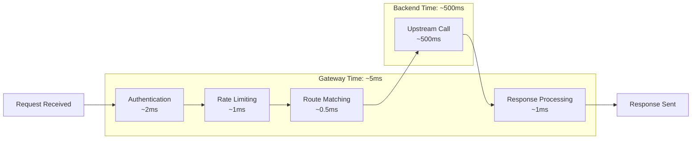

import Callout from '@components/Callout/index.astro'

*[API]: Application Programming Interface
*[RED]: Rate, Errors, Duration
*[W3C]: World Wide Web Consortium
*[HTTP]: Hypertext Transfer Protocol
*[P99]: 99th Percentile

## Introduction

Last month I spent four hours debugging what turned out to be a 30-second problem. Users reported 5-second delays on uploads. The gateway dashboard showed P99 latency at 200ms. Every backend claimed sub-100ms response times.

The problem: we measured the wrong interval. Our gateway tracked time from "request received" to "response sent," but spent 4 seconds waiting for slow consumers to upload request bodies _before the timer started_. The gateway wasn't slow—we were measuring the wrong thing.

Gateway observability is useless if it doesn't connect upstream and downstream. You see total latency when you need to know whether the gateway or the backend is slow. You see disconnected traces that stop at the gateway boundary when the problem is downstream.

When you're debugging at 3am, the difference between a 5-minute resolution and a 5-hour slog comes down to answering three questions instantly: Is the problem in the gateway or the backend? Is it affecting everyone or one consumer? Is it getting worse?

This article covers the most important gateway metric (latency breakdown), how distributed tracing makes request flows visible, and a 5-step debugging workflow.

## The Gateway Time vs. Backend Time Problem

The most valuable gateway metric isn't total request duration. It's the breakdown of _where time went_. When someone reports "the API is slow," you need to immediately answer: is the gateway slow, or is the backend slow?

Without this distinction, you're guessing. A request that takes 3 seconds total could be 2.9 seconds in the gateway and 100ms in the backend (gateway problem), or 10ms in the gateway and 2.99 seconds in the backend (backend problem). The fix is completely different, but aggregate latency metrics can't tell them apart.

The request lifecycle through a gateway has distinct phases, each consuming time:



Figure: Request lifecycle showing gateway overhead vs. backend latency with typical durations.

At minimum, instrument these separately:

- _Gateway overhead_: Total request time minus upstream time
- _Upstream time_: Time from sending the backend request until receiving the complete response
- _Auth time_: Time spent on authentication and authorization
- _Rate limit time_: Time spent checking rate limits

Here is how to instrument this in Prometheus:

```yaml title="gateway-latency-metrics.yaml"
# Prometheus metric definitions for Kong Gateway or similar
# Export via gateway metrics plugin or OpenTelemetry sidecar
metrics:
  # Total request duration (includes everything)
  - name: gateway_request_duration_seconds
    type: histogram
    labels: [method, route, upstream]
    buckets: [0.01, 0.025, 0.05, 0.1, 0.25, 0.5, 1, 2.5, 5, 10]

  # Upstream call duration (backend time only)
  - name: gateway_upstream_duration_seconds
    type: histogram
    labels: [method, route, upstream]
    buckets: [0.01, 0.025, 0.05, 0.1, 0.25, 0.5, 1, 2.5, 5, 10]

  # Auth phase duration
  - name: gateway_auth_duration_seconds
    type: histogram
    labels: [auth_provider]
    buckets: [0.001, 0.005, 0.01, 0.025, 0.05, 0.1, 0.25, 0.5]
```

Code: Prometheus metrics for separating gateway and backend latency.

With these metrics, you can calculate gateway overhead in PromQL:

```promql
# Gateway overhead only (excludes backend time)
# Result in seconds
gateway_overhead_seconds =
  gateway_request_duration_seconds - gateway_upstream_duration_seconds

# Backend time only (for inverse calculation)
backend_time_seconds = gateway_upstream_duration_seconds
```

For AWS API Gateway, use CloudWatch metrics (`Latency` and `IntegrationLatency`) to achieve the same breakdown—the concepts are identical.

When latency increases, this breakdown immediately narrows your investigation:

- **Total latency is 3.2 seconds**: Is that a problem with the gateway or the backend?
- **Gateway time is 5ms, backend time is 3.2 seconds**: The backend is slow. Don't investigate the gateway. (Good gateway time is typically under 10ms for simple auth and routing.)
- **Gateway time is 3 seconds, backend time is 200ms**: The gateway has a problem (slow auth plugin, connection pool exhaustion, rate limiter blocking).

- **Gateway overhead spiked, upstream time flat**: Problem is in the gateway itself—check CPU, memory, connection pools, or auth provider latency.
- **Upstream time spiked, gateway overhead flat**: Problem is in the backend—check backend service metrics, database performance, or downstream API calls.
- **Both spiked**: Problem is systemic—check network issues, load balancer health, or cascading failures.

The real-world impact: I once investigated a "slow gateway" complaint where P99 latency was 3.2 seconds. The breakdown showed 2ms gateway overhead and 3.198 seconds upstream time. The problem was a slow database query in the backend, not the gateway. Without the breakdown, we would have spent days optimizing the wrong component.

<Callout type="info">
Most "gateway latency" complaints are backend latency. Instrument each phase separately so you can prove where time actually goes.
</Callout>

## Distributed Tracing: Connecting the Dots

Metrics show aggregate health, but when something goes wrong, you need to see what happened to _specific requests_. Distributed tracing provides that request-level visibility by tracking individual requests across services.

The gateway is the most critical point for trace context propagation. If the gateway doesn't forward trace headers to backends, your traces stop at the gateway boundary—you see the consumer-to-gateway span, but not the gateway-to-backend spans. The request flow becomes invisible exactly where you need it most.

### Trace Context Propagation

The W3C Trace Context standard defines the `traceparent` header, which carries the trace ID, span ID, and sampling decision. Modern tracing systems (Jaeger, Tempo, AWS X-Ray) support this standard.

```http title="w3c-trace-context.http"
# Incoming request from consumer
GET /api/users HTTP/1.1
Host: api.example.com
traceparent: 00-0af7651916cd43dd8448eb211c80319c-b7ad6b7169203331-01
#            ^^ ^^^^^^^^(trace-id)^^^^^^^^ ^^^^(span-id)^^^^ ^^
#         version                                          sampled

# Gateway must forward to upstream (with new span ID)
GET /users HTTP/1.1
Host: users-service.internal
traceparent: 00-0af7651916cd43dd8448eb211c80319c-00f067aa0ba902b7-01
#            ^^ ^^^^^^^^(same trace-id)^^^^^ ^^^^(new span-id)^^ ^^
```

Code: W3C Trace Context propagation from consumer through gateway to backend.

The trace ID (`0af765...`) stays the same across all spans, connecting the entire request flow. The span ID changes for each service to identify individual operations. The sampling flag (`01`) tells all services that this trace should be included in sampling (vs `00` for "don't sample").

These tracing systems are interoperable via W3C Trace Context—you can trace from AWS X-Ray through a Kong gateway to a backend using Jaeger, all using the same trace ID.

<Callout type="tip">
**Tool Compatibility**: Kong Gateway, NGINX, and Envoy support W3C Trace Context out of the box. AWS API Gateway doesn't propagate `traceparent` automatically—you must forward it manually using mapping templates or Lambda authorizers.
</Callout>

Common propagation failures that break traces:

- _No propagation_: Gateway doesn't forward `traceparent` to backends. Traces end at the gateway.
- _Mixed formats_: Consumer sends W3C format, gateway converts to B3 format for some backends but not others. Traces fragment.
- _Sampling ignored_: Consumer marks trace as "don't sample" but gateway samples anyway, or vice versa.

Verify propagation by checking a trace end-to-end in your tracing UI. You should see a single trace with spans from consumer, gateway, and all backends. If you see disconnected traces, propagation is broken.

### What to Put in Gateway Spans

A minimal span that just records "request happened" is useless. A well-designed span captures the context needed to understand the request:

| Span Attribute | Source | Example Value |
|----------------|--------|---------------|
| `http.method` | Request | `POST` |
| `http.route` | Route match | `/users/:id` |
| `http.status_code` | Response | `200` |
| `gateway.upstream.name` | Routing decision | `users-service` |
| `gateway.consumer_id` | Auth plugin | `consumer-abc123` (opaque ID, not PII) |
| `gateway.retry_count` | Retry logic | `2` |
| `gateway.circuit_breaker.state` | Circuit breaker | `closed` |
| `auth.method` | Auth plugin | `jwt`, `api-key` |

Table: Essential gateway span attributes for debugging.

These attributes let you filter traces by consumer, route, or upstream in your tracing UI. When investigating a consumer complaint, you can immediately find all their traces and see which routes they hit and which backends served them.

### Tail Sampling Strategy

At high traffic volumes, you can't keep every trace. Tail sampling makes the decision _after_ a trace completes, allowing you to keep all errors and slow requests while sampling only 1% of fast successful requests. The tradeoff is that the collector must buffer spans in memory before making the decision, which increases memory usage and adds latency to trace delivery (usually 5-10 seconds).

Configure this in an OpenTelemetry Collector:

```yaml title="otel-tail-sampling.yaml"
# OpenTelemetry Collector tail sampling configuration
# Deployed as sidecar or separate collector service
processors:
  tail_sampling:
    decision_wait: 10s
    policies:
      - name: errors
        type: status_code
        status_code: {status_codes: [ERROR]}
      - name: slow
        type: latency
        latency: {threshold_ms: 2000}
      - name: sample-fast-success
        type: probabilistic
        probabilistic: {sampling_percentage: 1}
```

Code: Tail sampling configuration to keep all errors and slow requests.

This captures the traces you actually need for debugging—failures and performance problems—without storing millions of routine successful requests.

## A Quick Debugging Workflow

When latency alerts fire, follow this pattern: metrics narrow scope → traces show detail → logs explain why.

### Step 1: Identify Scope

Is latency high for all routes or specific routes?

```promql
# P99 latency by route
histogram_quantile(0.99,
  sum(rate(gateway_request_duration_seconds_bucket[5m])) by (le, route)
)
```

If one route is slow, focus there. If all routes are slow, the problem is gateway-wide.

### Step 2: Gateway vs. Backend

Is the gateway slow, or is a backend slow?

```promql
# Gateway overhead only
avg(gateway_request_duration_seconds - gateway_upstream_duration_seconds) by (route)
```

If gateway overhead is high, check gateway resources (CPU, memory, connection pools). If upstream time is high, the problem is in the backend.

### Step 3: Examine Traces

Find slow traces for the affected route in your tracing UI (Jaeger, Tempo, AWS X-Ray). Sort by duration. Look for:

- Long spans indicating slow backend calls
- Multiple retry attempts
- Time spent waiting for connections (connection pool exhaustion)
- Slow auth or rate limiting checks

### Step 4: Check Upstream Health

Are circuit breakers tripping? Connection pools exhausted?

```promql
# Circuit breaker state (0=closed, 1=half-open, 2=open)
gateway_circuit_breaker_state{upstream="affected-service"}

# Connection pool utilization
gateway_upstream_connections_active / gateway_upstream_connections_max
```

If circuit breakers are open, the gateway's protecting itself from a failing backend. If connection pools are at capacity, the gateway's connection-starved.

### Step 5: Correlate with Logs

Search logs for the affected time range and route. Look for:

- Error messages from backends
- Timeout logs
- Retry attempts
- Connection errors or exhausted connection pool warnings

The pattern is always the same: start broad with metrics, zoom in with traces, explain with logs.

## Conclusion

Gateway observability isn't about collecting more data—it's about making the gateway transparent so you can answer three questions in seconds instead of hours:

1. **Is the problem in the gateway or the backend?** Latency breakdown and span timing answer this.
2. **Is it affecting everyone or one consumer?** Per-consumer metrics and trace attributes answer this.
3. **Is it getting worse?** Time-series metrics and trace sampling answer this.

The comprehensive guide (linked below) covers additional topics: structured logging with correlation IDs, dashboard design for debugging instead of monitoring, alerting strategies to reduce noise, handling high-cardinality consumers, and controlling costs in production.

_Start with latency breakdown metrics. Add distributed tracing once you need request-level visibility. Everything else is details. The difference between a 5-minute fix and a 5-hour nightmare is knowing which side of the gateway is slow._

---

## Want the Complete Guide?

This article covered the fundamentals of gateway latency visibility and distributed tracing. The complete deep-dive guide includes:

- **Complete metric instrumentation**: RED method metrics, consumer-level metrics, upstream health tracking
- **Structured logging with correlation IDs**: Request ID propagation, error context logging, log aggregation strategies
- **Dashboard design for debugging**: Overview dashboards, drill-down workflows, consumer-specific views
- **Alert strategies**: SLI-based alerts, upstream-specific alerts, consumer abuse detection
- **Three complete debugging scenarios**: Latency spikes, intermittent 503 errors, consumer-specific performance issues
- **Implementation considerations**: Cardinality management, performance impact, cost considerations, security and privacy, testing your observability, vendor-agnostic instrumentation with OpenTelemetry

**[Download the complete guide (PDF)](/)**—over 8,800 words of in-depth coverage with code examples, diagrams, and real-world debugging workflows.
