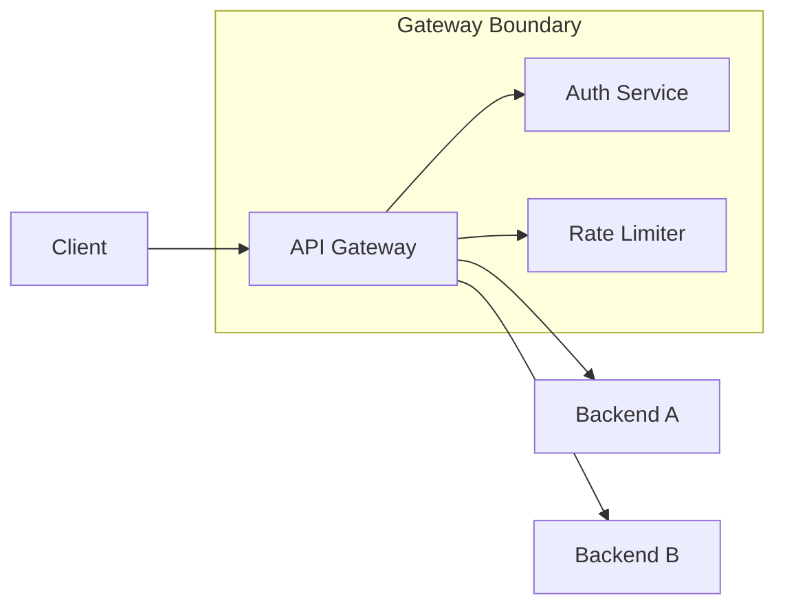
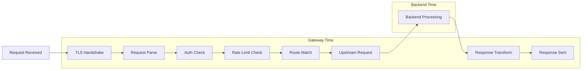
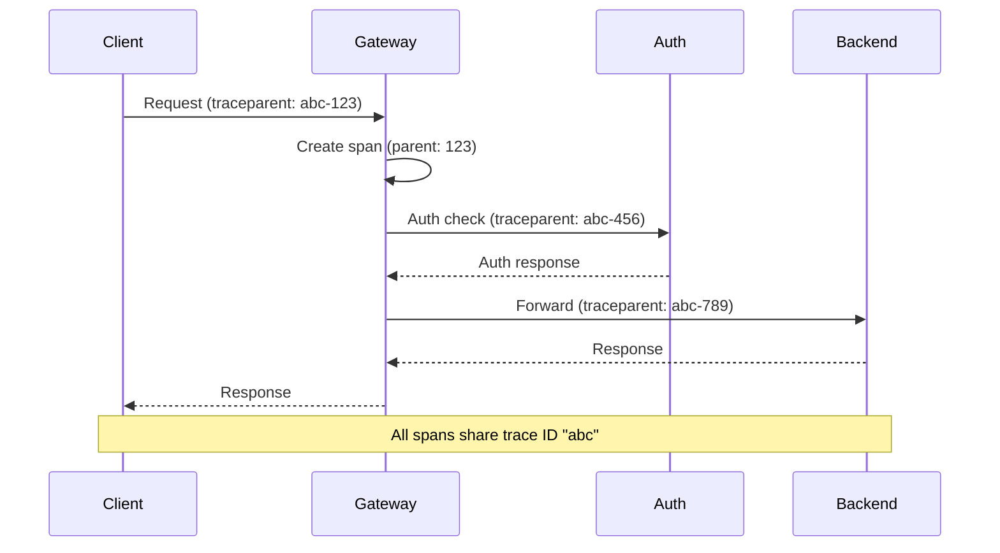
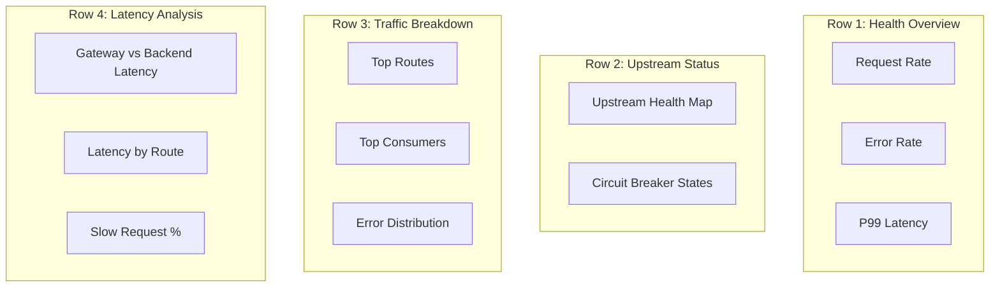

*[API]: Application Programming Interface
*[RED]: Rate, Errors, Duration
*[USE]: Utilization, Saturation, Errors
*[SLI]: Service Level Indicator
*[SLO]: Service Level Objective
*[OTEL]: OpenTelemetry
*[W3C]: World Wide Web Consortium
*[HTTP]: Hypertext Transfer Protocol
*[gRPC]: Google Remote Procedure Call
*[P99]: 99th Percentile

# API Gateway Observability That Actually Helps

## Introduction

Brief overview of why gateway observability is both critical and frequently broken: gateways sit at the intersection of every request but often generate metrics that answer the wrong questions, traces that stop at the gateway boundary, and logs that cannot be correlated with upstream or downstream activity. This section frames the problem as making the gateway transparent rather than a black box.

_Include a real-world scenario: a latency spike where the gateway metrics show everything is fine, but users are experiencing 5-second delays because the gateway is not measuring what matters._

<Callout type="warning">
Gateway observability is useless if it does not connect to upstream and downstream services. A gateway that only measures itself is a black box in the middle of your request path.
</Callout>

## The Three Pillars at the Gateway

### Why Gateways Are Special

Explain why gateway observability differs from service observability: every request passes through, aggregation hides individual service problems, and the gateway often adds its own latency that gets blamed on backends.


Figure: API gateway as the central observation point for all traffic.

### Metrics, Traces, and Logs: What Each Provides

Brief overview of what each pillar contributes to gateway debugging. Metrics for trends and alerting, traces for request flow, logs for detailed context.

| Pillar | Answers | Limitations |
|--------|---------|-------------|
| Metrics | How many? How fast? What percentage? | Aggregated, loses individual request detail |
| Traces | What path did this request take? Where did time go? | Sampling may miss rare events |
| Logs | What exactly happened? What were the values? | High volume, hard to correlate without IDs |

Table: Observability pillar strengths and limitations for gateway debugging.

## Gateway Metrics That Matter

### The RED Method for Gateways

Detail the RED method (Rate, Errors, Duration) applied specifically to API gateways. Include what dimensions to capture: by route, by upstream, by consumer, by response code.

```yaml title="gateway-red-metrics.yaml"
metrics:
  # Rate: requests per second
  - name: gateway_requests_total
    type: counter
    labels: [method, route, upstream, status_code, consumer_id]

  # Errors: error rate by type
  - name: gateway_errors_total
    type: counter
    labels: [method, route, upstream, error_type, consumer_id]

  # Duration: latency distribution
  - name: gateway_request_duration_seconds
    type: histogram
    labels: [method, route, upstream, consumer_id]
    buckets: [0.01, 0.025, 0.05, 0.1, 0.25, 0.5, 1, 2.5, 5, 10]
```
Code: Gateway metric definitions using RED method with appropriate labels.

### Breaking Down Latency

Explain how to decompose gateway latency into its components: client read time, authentication, rate limiting, upstream selection, backend request, response transformation, and client write time.


Figure: Request lifecycle showing gateway vs. backend latency components.

<Callout type="info">
Most "gateway latency" complaints are actually backend latency. Instrument each phase separately so you can prove where the time goes.
</Callout>

```prometheus title="latency-breakdown-queries.promql"
# Gateway overhead (excluding backend)
gateway_overhead_seconds =
  gateway_request_duration_seconds - gateway_upstream_duration_seconds

# Auth latency specifically
histogram_quantile(0.99,
  sum(rate(gateway_auth_duration_seconds_bucket[5m])) by (le, auth_provider)
)

# Rate limiter latency
histogram_quantile(0.99,
  sum(rate(gateway_ratelimit_duration_seconds_bucket[5m])) by (le, limiter)
)
```
Code: PromQL queries to isolate gateway overhead from backend latency.

### Consumer-Level Metrics

Discuss why per-consumer metrics matter: identifying abusive consumers, debugging consumer-specific issues, and supporting usage-based billing.

| Metric | Purpose | Alert Example |
|--------|---------|---------------|
| Requests by Consumer | Usage tracking, abuse detection | Consumer exceeds 10x normal rate |
| Errors by Consumer | Consumer-specific issues | Single consumer > 50% error rate |
| Latency by Consumer | Performance isolation | Consumer P99 > 2x global P99 |
| Quota Usage | Rate limit tracking | Consumer at 90% of quota |

Table: Consumer-level metrics for gateway debugging and alerting.

<Callout type="danger">
High-cardinality consumer labels can explode metric storage. Use consumer ID labels only on aggregate metrics, not on high-frequency histograms. Consider sampling or rollup for consumer-level detail.
</Callout>

### Upstream Health Metrics

Detail metrics that track the health of backend services from the gateway's perspective: connection pool status, circuit breaker state, retry rates, and timeout frequencies.

```yaml title="upstream-health-metrics.yaml"
metrics:
  # Connection pool utilization
  - name: gateway_upstream_connections_active
    type: gauge
    labels: [upstream]

  - name: gateway_upstream_connections_idle
    type: gauge
    labels: [upstream]

  # Circuit breaker state
  - name: gateway_circuit_breaker_state
    type: gauge
    labels: [upstream]
    values: {closed: 0, half_open: 1, open: 2}

  # Retry behavior
  - name: gateway_upstream_retries_total
    type: counter
    labels: [upstream, retry_reason]

  # Timeout tracking
  - name: gateway_upstream_timeouts_total
    type: counter
    labels: [upstream, timeout_type]
```
Code: Upstream health metrics for monitoring backend availability from the gateway.

## Distributed Tracing Through Gateways

### Trace Context Propagation

Explain how trace context must flow through the gateway to connect client requests with backend spans. Cover W3C Trace Context, B3, and the pitfalls when gateways do not propagate headers.

```http title="trace-propagation-headers.http"
# Incoming request with W3C Trace Context
GET /api/users HTTP/1.1
Host: api.example.com
traceparent: 00-0af7651916cd43dd8448eb211c80319c-b7ad6b7169203331-01
tracestate: vendor=value

# Gateway must forward to upstream
GET /users HTTP/1.1
Host: users-service.internal
traceparent: 00-0af7651916cd43dd8448eb211c80319c-new-span-id-here-01
tracestate: vendor=value
```
Code: W3C Trace Context header propagation through API gateway.


Figure: Trace context propagation creating connected spans across gateway boundary.

### Gateway Span Design

Detail what information gateway spans should capture: route matched, upstream selected, transformations applied, authentication results, and rate limit decisions.

```json title="gateway-span-attributes.json"
{
  "span_name": "gateway.request",
  "attributes": {
    "http.method": "POST",
    "http.route": "/api/v2/users",
    "http.status_code": 201,
    "gateway.route.name": "users-create",
    "gateway.upstream.name": "users-service",
    "gateway.upstream.address": "10.0.1.50:8080",
    "gateway.auth.method": "oauth2",
    "gateway.auth.consumer_id": "client-abc123",
    "gateway.ratelimit.remaining": 847,
    "gateway.transform.request": true,
    "gateway.transform.response": false
  },
  "events": [
    {"name": "auth.validated", "timestamp": "..."},
    {"name": "ratelimit.checked", "timestamp": "..."},
    {"name": "upstream.selected", "timestamp": "..."}
  ]
}
```
Code: Gateway span attributes capturing routing, auth, and transformation decisions.

<Callout type="info">
Add span events for each gateway processing phase. Events with timestamps let you see exactly where time went without creating separate child spans for every operation.
</Callout>

### Sampling Strategies at the Gateway

Discuss trace sampling decisions: head-based vs. tail-based, always sampling errors, and the tradeoff between coverage and cost.

| Strategy | When to Use | Tradeoff |
|----------|-------------|----------|
| Head-based (1%) | High traffic, cost-sensitive | Misses rare errors |
| Tail-based | Need all errors | Requires collector buffering |
| Error sampling (100%) | Debugging priority | Higher storage for errors |
| Consumer-based | Enterprise customer debugging | Selective high coverage |

Table: Trace sampling strategies for API gateways.

```yaml title="otel-collector-sampling.yaml" {8-15}
processors:
  tail_sampling:
    decision_wait: 10s
    num_traces: 100000
    policies:
      # Always sample errors
      - name: errors
        type: status_code
        status_code: {status_codes: [ERROR]}
      # Always sample slow requests
      - name: slow-requests
        type: latency
        latency: {threshold_ms: 2000}
      # Sample 1% of everything else
      - name: probabilistic
        type: probabilistic
        probabilistic: {sampling_percentage: 1}
```
Code: OpenTelemetry Collector tail sampling configuration for gateway traces.

## Structured Logging for Correlation

### Log Schema for Gateway Requests

Define a consistent log schema that enables correlation across gateway, upstream, and downstream services. Include required fields: trace ID, request ID, consumer ID, route, upstream, and timing breakdowns.

```json title="gateway-log-schema.json"
{
  "timestamp": "2024-01-15T10:30:00.000Z",
  "level": "info",
  "message": "request completed",
  "trace_id": "0af7651916cd43dd8448eb211c80319c",
  "span_id": "b7ad6b7169203331",
  "request_id": "req-abc123",
  "consumer_id": "client-xyz",
  "http": {
    "method": "POST",
    "path": "/api/v2/users",
    "status_code": 201,
    "request_size_bytes": 1024,
    "response_size_bytes": 256
  },
  "gateway": {
    "route": "users-create",
    "upstream": "users-service",
    "upstream_address": "10.0.1.50:8080"
  },
  "timing": {
    "total_ms": 145,
    "gateway_ms": 12,
    "upstream_ms": 133,
    "auth_ms": 3,
    "ratelimit_ms": 1
  },
  "auth": {
    "method": "oauth2",
    "scopes": ["users:write"]
  }
}
```
Code: Structured log schema for gateway requests with correlation fields.

### Correlation ID Propagation

Explain how to ensure correlation IDs flow through the entire request chain. Include generating IDs at the gateway when clients do not provide them.

```yaml title="gateway-correlation-config.yaml" {5-12}
http:
  request_headers:
    # Accept client-provided correlation ID
    - name: X-Request-ID
      propagate: true
      generate_if_missing: true
      generator: uuid

    # Always propagate trace context
    - name: traceparent
      propagate: true
    - name: tracestate
      propagate: true

  response_headers:
    # Return correlation ID to client for support requests
    - name: X-Request-ID
      source: request
```
Code: Gateway configuration for correlation ID generation and propagation.

### Error Context in Logs

Detail what additional context to log when errors occur. Include upstream error details, retry history, and circuit breaker state.

```json title="gateway-error-log.json" {12-28}
{
  "timestamp": "2024-01-15T10:30:00.000Z",
  "level": "error",
  "message": "upstream request failed",
  "trace_id": "0af7651916cd43dd8448eb211c80319c",
  "request_id": "req-abc123",
  "http": {
    "method": "POST",
    "path": "/api/v2/users",
    "status_code": 503
  },
  "error": {
    "type": "upstream_error",
    "upstream": "users-service",
    "upstream_status": 500,
    "upstream_error": "database connection timeout",
    "retries_attempted": 2,
    "retry_history": [
      {"attempt": 1, "status": 500, "latency_ms": 5023},
      {"attempt": 2, "status": 500, "latency_ms": 5018}
    ],
    "circuit_breaker": {
      "state": "half_open",
      "failures": 47,
      "last_success": "2024-01-15T10:25:00.000Z"
    }
  }
}
```
Code: Error log with upstream failure context, retry history, and circuit breaker state.

## Dashboards That Answer Questions

### The Gateway Overview Dashboard

Define the panels for a gateway overview dashboard that answers: Is the gateway healthy? What is the traffic pattern? Are backends responding?

| Panel | Visualization | Query |
|-------|---------------|-------|
| Request Rate | Time series | `sum(rate(gateway_requests_total[5m]))` |
| Error Rate | Time series | `sum(rate(gateway_requests_total{status=~"5.."}[5m])) / sum(rate(gateway_requests_total[5m]))` |
| P50/P95/P99 Latency | Time series | `histogram_quantile(0.99, sum(rate(gateway_request_duration_seconds_bucket[5m])) by (le))` |
| Upstream Health | Status map | Circuit breaker states by upstream |
| Top Routes | Bar chart | Request rate by route, sorted |
| Error Breakdown | Pie chart | Errors by type and upstream |

Table: Gateway overview dashboard panels with purpose and queries.


Figure: Gateway dashboard layout with logical panel grouping.

### The Debugging Dashboard

Design a dashboard for active incident debugging. Focus on drill-down capabilities: from aggregate metrics to specific routes to individual requests.

<Callout type="info">
The debugging dashboard should start with the symptom (high latency, errors) and drill down to the cause (specific upstream, specific consumer, specific route). Every panel should link to more detail.
</Callout>

```json title="grafana-drilldown-link.json"
{
  "links": [
    {
      "title": "View traces for this route",
      "url": "/explore?left=[\"now-1h\",\"now\",\"jaeger\",{\"query\":\"service=gateway route=${__data.fields.route}\"}]",
      "targetBlank": true
    },
    {
      "title": "View logs for this request",
      "url": "/explore?left=[\"now-1h\",\"now\",\"loki\",{\"expr\":\"{service=\\\"gateway\\\"} |= \\\"${__data.fields.request_id}\\\"\"}]",
      "targetBlank": true
    }
  ]
}
```
Code: Grafana data link configuration for drilling from metrics to traces and logs.

### Consumer-Specific Views

Describe dashboards for debugging consumer-specific issues. Include templating for consumer selection and comparison views.

| Panel | Purpose |
|-------|---------|
| Consumer Traffic vs. Global | Is this consumer's pattern unusual? |
| Consumer Error Rate vs. Global | Are errors consumer-specific or systemic? |
| Consumer Latency Distribution | Is this consumer hitting slow endpoints? |
| Consumer Route Usage | What endpoints is this consumer using? |
| Consumer Quota Status | Is rate limiting affecting this consumer? |

Table: Consumer debugging dashboard panels.

## Alerting on Gateway Signals

### SLI-Based Alerts

Define alerts based on gateway SLIs rather than arbitrary thresholds. Include availability, latency, and throughput alerts.

```yaml title="gateway-sli-alerts.yaml"
groups:
  - name: gateway-slis
    rules:
      # Availability: error rate exceeds error budget burn
      - alert: GatewayHighErrorRate
        expr: |
          (
            sum(rate(gateway_requests_total{status=~"5.."}[5m]))
            /
            sum(rate(gateway_requests_total[5m]))
          ) > 0.01
        for: 2m
        labels:
          severity: page
        annotations:
          summary: "Gateway error rate {{ $value | humanizePercentage }} exceeds 1% SLO"

      # Latency: P99 exceeds target
      - alert: GatewayHighLatency
        expr: |
          histogram_quantile(0.99,
            sum(rate(gateway_request_duration_seconds_bucket[5m])) by (le)
          ) > 2
        for: 5m
        labels:
          severity: warning
        annotations:
          summary: "Gateway P99 latency {{ $value | humanizeDuration }} exceeds 2s target"
```
Code: Gateway SLI-based alert rules for availability and latency.

### Upstream-Specific Alerts

Detail alerts that detect upstream degradation before it affects overall gateway metrics.

```yaml title="upstream-alerts.yaml" {5-12}
groups:
  - name: gateway-upstreams
    rules:
      # Circuit breaker opened
      - alert: UpstreamCircuitOpen
        expr: gateway_circuit_breaker_state == 2
        for: 0m
        labels:
          severity: warning
        annotations:
          summary: "Circuit breaker open for {{ $labels.upstream }}"
          runbook: "https://wiki/runbooks/gateway-circuit-breaker"

      # High retry rate indicates upstream instability
      - alert: UpstreamHighRetryRate
        expr: |
          sum(rate(gateway_upstream_retries_total[5m])) by (upstream)
          /
          sum(rate(gateway_requests_total[5m])) by (upstream)
          > 0.1
        for: 5m
        labels:
          severity: warning
        annotations:
          summary: "{{ $labels.upstream }} retry rate {{ $value | humanizePercentage }}"
```
Code: Upstream health alerts detecting circuit breaker state and retry rates.

<Callout type="warning">
Alert on upstream health separately from overall gateway health. A single unhealthy upstream should not page if the gateway is correctly routing around it.
</Callout>

### Consumer Abuse Detection

Configure alerts for detecting consumer behavior that indicates abuse or misconfiguration.

| Alert | Condition | Action |
|-------|-----------|--------|
| Consumer Rate Spike | 10x normal request rate | Investigate, possible abuse |
| Consumer Error Spike | > 50% error rate for consumer | Contact consumer, likely misconfiguration |
| Consumer Quota Exhaustion | 95% of quota used | Notify consumer, offer quota increase |
| New Consumer High Volume | New API key with > 1000 req/min | Review registration, possible bot |

Table: Consumer behavior alerts for abuse and misconfiguration detection.

## Common Gateway Debugging Scenarios

### Scenario: Latency Spike Investigation

Walk through debugging a latency spike using gateway observability. Start with metrics, narrow to specific routes/upstreams, examine traces, correlate with logs.

```markdown title="latency-debug-runbook.md"
# Gateway Latency Spike Investigation

## Step 1: Identify Scope
Query: Is latency high for all routes or specific routes?
```promql
histogram_quantile(0.99,
  sum(rate(gateway_request_duration_seconds_bucket[5m])) by (le, route)
)
```

## Step 2: Gateway vs. Backend
Query: Is the gateway slow, or is a backend slow?
```promql
# Gateway overhead only
avg(gateway_request_duration_seconds - gateway_upstream_duration_seconds) by (route)
```

## Step 3: Examine Traces
Find slow traces for the affected route in Jaeger/Tempo.
Look for: long spans, retries, connection waits.

## Step 4: Check Upstream Health
Query: Are circuit breakers tripping? Connection pools exhausted?
```promql
gateway_circuit_breaker_state{upstream="affected-service"}
gateway_upstream_connections_active / gateway_upstream_connections_max
```

## Step 5: Correlate with Logs
Search logs for the affected time range and route.
Look for: error messages, timeout logs, retry logs.
```
Code: Latency spike investigation runbook using gateway observability.

### Scenario: Intermittent 503 Errors

Detail debugging intermittent errors that are hard to reproduce. Use trace sampling, error logging, and consumer correlation.

<Callout type="info">
Intermittent errors are often consumer-specific (malformed requests), upstream-specific (one unhealthy instance), or timing-specific (connection pool exhaustion under load). Check each dimension separately.
</Callout>

### Scenario: Consumer Reports Slow API

Describe how to debug when a specific consumer reports performance issues that do not appear in aggregate metrics.

```promql title="consumer-specific-queries.promql"
# Consumer's error rate vs. global
sum(rate(gateway_requests_total{consumer_id="client-abc", status=~"5.."}[1h]))
/
sum(rate(gateway_requests_total{consumer_id="client-abc"}[1h]))

# Consumer's latency distribution
histogram_quantile(0.99,
  sum(rate(gateway_request_duration_seconds_bucket{consumer_id="client-abc"}[1h])) by (le)
)

# Consumer's route usage pattern
topk(10,
  sum(rate(gateway_requests_total{consumer_id="client-abc"}[1h])) by (route)
)
```
Code: PromQL queries for investigating consumer-specific performance issues.

## Implementation Considerations

### Cardinality Management

Discuss the tension between rich labels and metric cardinality. Include strategies for managing high-cardinality dimensions like consumer ID and request path.

| Dimension | Cardinality Risk | Mitigation |
|-----------|------------------|------------|
| Consumer ID | High (thousands) | Use only on counters, not histograms |
| Route | Medium (hundreds) | Use route pattern, not full path |
| Upstream Instance | Medium | Aggregate to upstream name |
| Status Code | Low (tens) | Safe to use everywhere |
| Method | Very Low (< 10) | Safe to use everywhere |

Table: Label cardinality management strategies for gateway metrics.

### Performance Impact

Address the performance overhead of observability. Include guidelines for what to measure synchronously vs. asynchronously.

<Callout type="danger">
Synchronous logging and tracing in the request path adds latency. Use buffered/async exporters for logs and traces. Metrics counters are cheap; histograms are more expensive.
</Callout>

### Vendor-Agnostic Instrumentation

Recommend using OpenTelemetry for vendor-agnostic instrumentation that can export to multiple backends.

```yaml title="otel-gateway-config.yaml"
exporters:
  prometheus:
    endpoint: "0.0.0.0:9090"
  otlp:
    endpoint: "tempo.monitoring:4317"
  loki:
    endpoint: "http://loki.monitoring:3100/loki/api/v1/push"

service:
  pipelines:
    metrics:
      receivers: [otlp]
      processors: [batch]
      exporters: [prometheus]
    traces:
      receivers: [otlp]
      processors: [batch, tail_sampling]
      exporters: [otlp]
    logs:
      receivers: [otlp]
      processors: [batch]
      exporters: [loki]
```
Code: OpenTelemetry Collector configuration for multi-backend gateway observability.

## Conclusion

Summarize the key principles: measure what matters for debugging (not vanity metrics), propagate context through the gateway boundary, design dashboards that answer questions, and alert on symptoms that require action. Emphasize that good gateway observability makes the gateway invisible—you see through it to the actual problem.

<Callout type="success">
The goal of gateway observability is to make the gateway transparent. When debugging, you should see the request flow through the gateway as clearly as if the gateway were not there.
</Callout>

---

## Cover Prompt

### Prompt 1: Three Pillars Visualization

Create an architectural illustration showing three glowing pillars (metrics, traces, logs) supporting an API gateway structure. Data flows through the gateway as luminous streams, with each pillar capturing different aspects of the flow. The pillars should be interconnected with subtle light bridges representing correlation. Style: modern tech architecture illustration, dark background with cyan/blue/purple glow effects, isometric perspective, 16:9 aspect ratio.

### Prompt 2: Request Flow X-Ray

Illustrate an API gateway as a transparent glass structure with a request traveling through it. The request path is illuminated like an X-ray or MRI scan, showing internal components (auth, rate limiting, routing) as the request passes through. Upstream services visible on the other side. Style: medical imaging meets tech visualization, blue monochrome with highlight colors for key components, cross-section view, 16:9 aspect ratio.

### Prompt 3: Observatory Control Room

Design a stylized observatory/mission control room with multiple screens showing gateway dashboards, trace waterfalls, and log streams. An operator (silhouette) monitors the displays. The central screen shows a request path diagram. Style: retro-futuristic control room aesthetic, dark room with glowing screens, NASA mission control inspiration, 16:9 aspect ratio.

### Prompt 4: Signal Through Noise

Create an abstract visualization of a clear signal (representing useful observability data) emerging from a chaotic field of noise. The gateway sits at the center, acting as a filter that transforms raw data streams into organized, colored channels (red for metrics, blue for traces, green for logs). Style: data art, abstract flowing forms, dark background with vibrant data streams, motion blur effects, 16:9 aspect ratio.

### Prompt 5: Connected Spans Constellation

Illustrate distributed trace spans as a constellation of connected stars. The gateway span is the bright central star, with upstream and downstream service spans connected by trace context lines. Each span shows timing information as light intensity. Background shows faint unconnected spans (unsampled requests). Style: astronomical visualization, dark space background, constellation-style connections, warm golden spans against cool blue background, 16:9 aspect ratio.
