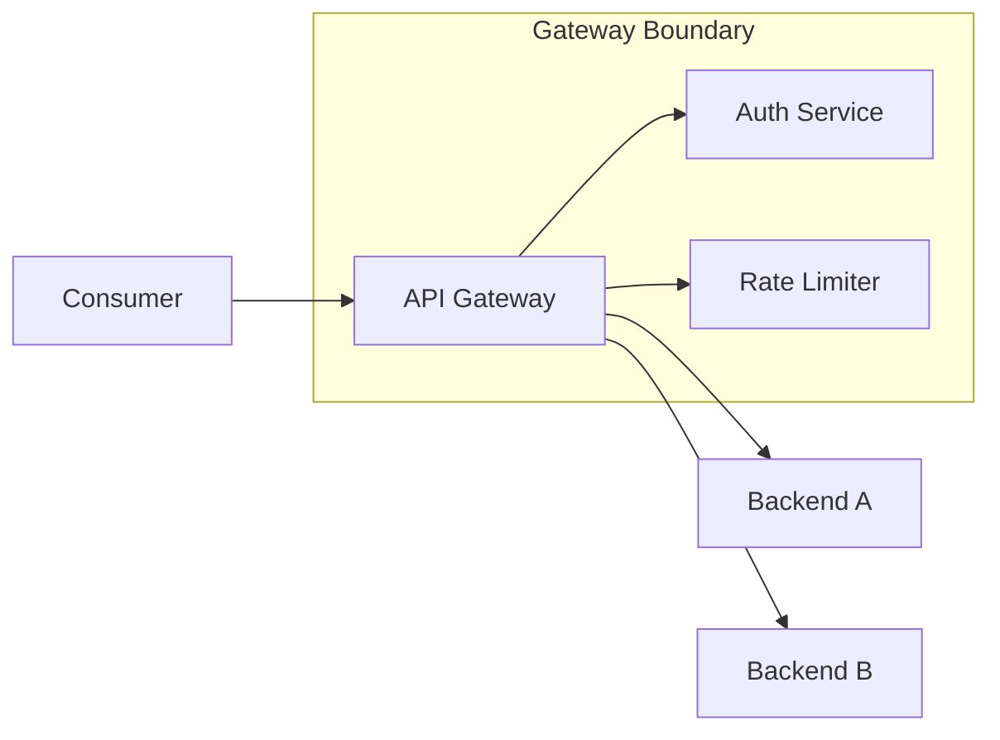
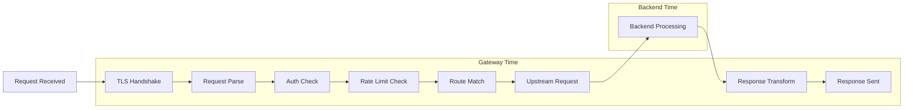
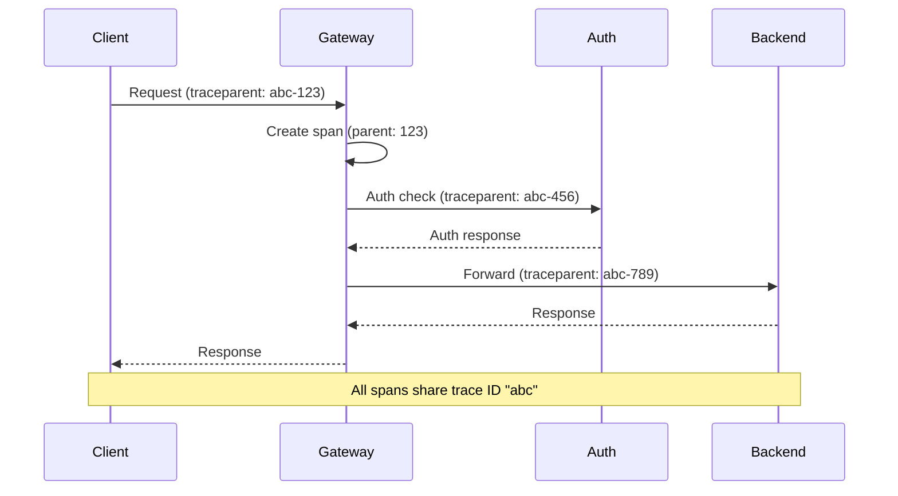
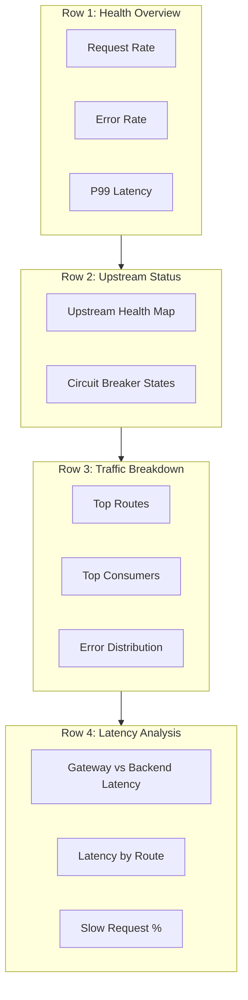

import Callout from '@components/Callout/index.astro'

*[API]: Application Programming Interface
*[RED]: Rate, Errors, Duration
*[USE]: Utilization, Saturation, Errors
*[SLI]: Service Level Indicator
*[SLO]: Service Level Objective
*[OTEL]: OpenTelemetry
*[W3C]: World Wide Web Consortium
*[HTTP]: Hypertext Transfer Protocol
*[gRPC]: Google Remote Procedure Call
*[P99]: 99th Percentile

## Introduction

Last month I spent four hours debugging a latency spike that turned out to be a 30-second issue. Users were reporting 5-second delays, the gateway dashboard showed P99 latency at 200ms, and every backend service claimed sub-100ms response times. The gateway was "healthy" according to every metric we had.

The problem was simple once discovered: our gateway metrics measured the wrong thing. We tracked time from "request received" to "response sent," but the gateway spent 4 seconds waiting for slow consumers to finish uploading request bodies before the timer even started. The gateway was not slow—it was measuring the wrong interval.

This is the recurring pattern with gateway observability: the gateway sits at the intersection of every request, generating enormous volumes of data, and most of it answers questions nobody is asking. Metrics that show aggregate throughput when you need per-consumer breakdown. Traces that stop at the gateway boundary when the problem is in the backend. Logs that cannot be correlated with anything because they lack trace IDs.

<Callout type="warning">
Gateway observability is useless if it does not connect to upstream and downstream services. A gateway that only measures itself is a black box in the middle of your request path.
</Callout>

The goal of gateway observability is not to monitor the gateway—it is to make the gateway _transparent_. When something goes wrong, you should be able to trace a request from consumer through gateway to backend and back, seeing exactly where time went and what decisions were made. The gateway should add context to the observability picture, not obscure it.

This article covers how to instrument API gateways so the data actually helps during incidents: metrics that decompose latency into actionable components, traces that flow through the gateway boundary, logs that correlate across services, and dashboards designed for debugging rather than looking impressive in status meetings. Examples throughout demonstrate vendor-agnostic patterns using Kong Gateway, AWS API Gateway, and Envoy—the principles apply regardless of your specific gateway.

## The Three Pillars at the Gateway

### Why Gateways Are Special

Gateway observability is not the same as service observability, and treating it the same way is how you end up with dashboards that look busy but do not help.

The fundamental difference is scope: every request passes through the gateway. When a backend service has a problem, its own metrics show the issue clearly—error rate spikes, latency increases, throughput drops. But the gateway sees that same problem diluted across all the traffic it handles. If one of ten backends is failing, the gateway's aggregate error rate increases by 10%, which might not even trigger an alert.



Figure: API gateway as the central observation point for all traffic.

The gateway also adds its own latency that frequently gets blamed on backends. Authentication checks, rate limit lookups, request transformation, response transformation, TLS termination—these all take time. When users complain about slow APIs, the default assumption is that backends are slow, but I have seen gateway overhead account for 200ms+ on requests where the backend responded in 50ms.

The third challenge is that gateways make decisions that affect observability downstream. Which backend instance received the request? Was the request retried? Did a circuit breaker trip? These decisions happen at the gateway but affect how you interpret backend metrics and traces. If the gateway does not record these decisions, you are debugging with incomplete information.

### Metrics, Traces, and Logs: What Each Provides

Each observability pillar answers different questions, and gateway debugging typically requires all three in sequence.

_Metrics_ answer aggregate questions: How many requests? What is the error rate? What is the P99 latency? Metrics are cheap to collect and query, making them the right starting point for identifying _that_ a problem exists and roughly _where_ it is. But metrics lose individual request detail—you know latency increased, but not which specific requests were slow or why.

_Traces_ answer flow questions: What path did this request take? Where did the time go? Which service was responsible for the delay? Traces connect the dots across service boundaries, which is exactly what you need when the gateway is in the middle. The limitation is sampling—at high traffic volumes, you cannot keep every trace, so rare errors might not be captured.

_Logs_ answer detail questions: What exactly happened? What were the input values? What error message was returned? Logs provide the context that metrics and traces lack, but they are high-volume and hard to navigate without correlation IDs linking them to specific traces.

| Pillar | Answers | Limitations |
|--------|---------|-------------|
| Metrics | How many? How fast? What percentage? | Aggregated, loses individual request detail |
| Traces | What path did this request take? Where did time go? | Sampling may miss rare events |
| Logs | What exactly happened? What were the values? | High volume, hard to correlate without IDs |

Table: Observability pillar strengths and limitations for gateway debugging.

The debugging workflow typically moves from metrics to traces to logs: metrics identify the problem scope, traces pinpoint the responsible service or component, and logs provide the specific context needed to understand root cause.

## Gateway Metrics That Matter

### The RED Method for Gateways

The RED method (Rate, Errors, Duration) provides a solid foundation for gateway metrics. The key is choosing the right label dimensions so you can slice the data in ways that actually help during debugging.

_Rate_ shows throughput: requests per second, broken down by route, upstream, and consumer. Sudden changes in rate often indicate either traffic shifts (a consumer changed their integration) or problems (retries inflating request counts).

_Errors_ indicate failure rate: the percentage of requests returning 4xx or 5xx status codes. For gateways, you need to distinguish between gateway-generated errors (rate limiting, authentication failures) and upstream errors (backend returned 500). The distinction matters because the remediation is completely different.

_Duration_ reveals latency: how long requests take, typically captured as a histogram so you can compute percentiles. For gateways, the critical insight is separating gateway time from backend time—more on this in the next section.

The metric definitions below use Prometheus naming conventions. Most API gateways (Kong, Envoy, NGINX) can export these directly or via an OpenTelemetry sidecar. For AWS API Gateway, you would use CloudWatch metrics with custom dimensions—the concepts are the same, but the configuration is different.

```yaml title="gateway-red-metrics.yaml" {7,13,18-19}
# Prometheus metric definitions for gateway instrumentation
# These would be implemented in your gateway's metrics plugin or custom instrumentation
metrics:
  # Rate: requests per second
  - name: gateway_requests_total
    type: counter
    labels: [method, route, upstream, status_code, consumer_id]

  # Errors: error rate by type
  - name: gateway_errors_total
    type: counter
    labels: [method, route, upstream, error_type, consumer_id]

  # Duration: latency distribution
  - name: gateway_request_duration_seconds
    type: histogram
    labels: [method, route, upstream, consumer_id]
    buckets: [0.01, 0.025, 0.05, 0.1, 0.25, 0.5, 1, 2.5, 5, 10]
```

Code: Prometheus metric definitions for gateway instrumentation.

These labels are not automatic — your gateway instrumentation code must extract and attach them to each metric. The `method` comes from the HTTP request. The `route` is the matched route pattern (e.g., `/users/:id`), not the raw path (which would create unbounded cardinality). The `upstream` is the backend service name that the gateway selected. The `consumer_id` comes from your authentication layer (API key, OAuth client ID, etc.). The `status_code` is the HTTP response status.

The label choices matter for debugging. Including `route` lets you identify which endpoints are problematic. Including `upstream` lets you identify which backend is misbehaving. Including `consumer_id` lets you identify whether a problem is global or consumer-specific. Including `status_code` lets you distinguish between different failure modes.

Be thoughtful about histogram buckets (predefined latency ranges like 0-10ms, 10-50ms, etc.). The default Prometheus buckets are rarely appropriate for API latency. The buckets above are tuned for typical API traffic: most requests should complete in under 100ms, with the upper buckets catching slow outliers. Adjust based on your actual latency distribution.

### Breaking Down Latency

The single most useful gateway metric is not total request duration—it is the breakdown of where time went. When someone reports "the API is slow," you need to immediately answer: is the gateway slow, or is the backend slow?



Figure: Request lifecycle showing gateway vs. backend latency components.

At minimum, instrument these separately:

- _Gateway overhead_: Total request time minus upstream time. This is pure gateway processing.
- _Upstream time_: Time from sending the request to the backend until receiving the complete response.
- _Auth time_: Time spent on authentication and authorization checks.
- _Rate limit time_: Time spent checking rate limits (usually negligible, but spikes indicate rate limiter issues).

<Callout type="info">
Most "gateway latency" complaints are actually backend latency. Instrument each phase separately so you can prove where the time goes.
</Callout>

```promql title="latency-breakdown-queries.promql"
# PromQL queries for Prometheus/Grafana dashboards
# These assume the gateway is exporting the metrics defined above
# [5m] provides 5-minute rolling averages - balances responsiveness with noise reduction

# Gateway overhead (excluding backend)
gateway_overhead_seconds =
  gateway_request_duration_seconds - gateway_upstream_duration_seconds

# Auth latency specifically
histogram_quantile(0.99,
  sum(rate(gateway_auth_duration_seconds_bucket[5m])) by (le, auth_provider)
)

# Rate limiter latency
histogram_quantile(0.99,
  sum(rate(gateway_ratelimit_duration_seconds_bucket[5m])) by (le, limiter)
)
```

Code: PromQL queries for Prometheus/Grafana to isolate gateway overhead from backend latency.

When latency increases, this breakdown immediately narrows the investigation. If gateway overhead is flat but upstream time spiked, the problem is in a backend. If auth time spiked, something is wrong with your identity provider. If gateway overhead increased but no specific component did, you might be hitting resource limits on the gateway itself.

### Consumer-Level Metrics

Per-consumer metrics answer questions that aggregate metrics cannot: Is this problem affecting everyone, or just one consumer? Is one consumer responsible for most of the traffic? Is a consumer's error rate high because of their code or because of our systems?

| Metric | Purpose | Alert Example |
|--------|---------|---------------|
| Requests by Consumer | Usage tracking, abuse detection | Consumer exceeds 10x normal rate |
| Errors by Consumer | Consumer-specific issues | Single consumer > 50% error rate |
| Latency by Consumer | Performance isolation | Consumer P99 > 2x global P99 |
| Quota Usage | Rate limit tracking | Consumer at 90% of quota |

Table: Consumer-level metrics for gateway debugging and alerting.

Consumer-level metrics are invaluable for debugging support tickets. When a consumer reports problems, you can immediately pull their specific metrics and compare to global baselines. If their error rate is 40% while the global rate is 0.1%, the problem is likely in their integration—they are hitting endpoints incorrectly or sending malformed requests. If their error rate matches the global rate, the problem is systemic and affects everyone, not just them.

<Callout type="danger">
High-cardinality consumer labels can explode metric storage. Use consumer ID labels only on aggregate metrics, not on high-frequency histograms. Consider sampling or rollup for consumer-level detail.
</Callout>

The cardinality warning is serious. If you have 10,000 consumers and add `consumer_id` to a histogram with 15 buckets, you have created 150,000 time series per metric. Multiply by multiple metrics and multiple routes, and you can easily exceed what Prometheus can handle. Strategies include:

- Use `consumer_id` only on counters, not histograms
- Roll up consumer metrics to a separate, lower-resolution store
- Sample consumer-level histograms (1 in 100 requests)
- Use recording rules to pre-aggregate consumer metrics

### Upstream Health Metrics

The gateway has a unique view of backend health: it sees every request to every backend, it manages connection pools, and it makes circuit breaker decisions. Expose these as metrics so you can correlate backend issues with gateway behavior.

```yaml title="upstream-health-metrics.yaml"
# Prometheus metrics exposed by Kong Gateway's Prometheus plugin
# Similar metrics available in Envoy via /stats endpoint
metrics:
  # Connection pool utilization
  - name: gateway_upstream_connections_active
    type: gauge
    labels: [upstream]

  - name: gateway_upstream_connections_idle
    type: gauge
    labels: [upstream]

  # Circuit breaker state
  - name: gateway_circuit_breaker_state
    type: gauge
    labels: [upstream]
    values: {closed: 0, half_open: 1, open: 2}

  # Retry behavior
  - name: gateway_upstream_retries_total
    type: counter
    labels: [upstream, retry_reason]

  # Timeout tracking
  - name: gateway_upstream_timeouts_total
    type: counter
    labels: [upstream, timeout_type]
```

Code: Upstream health metrics from Kong Gateway's Prometheus plugin.

Connection pool metrics reveal resource exhaustion before it causes visible failures. If active connections are at maximum and idle connections are zero, the gateway is connection-starved—new requests will queue or fail. This often happens when backends become slow (connections are held longer) or when traffic spikes.

Circuit breaker state is critical context for debugging. When a backend's error rate spikes, you need to know whether the circuit breaker tripped. If it did, the gateway is protecting other backends and the problem is isolated. If it did not, either the threshold is too high or the errors are not meeting the trip criteria.

Retry metrics tell you about transient failures. A high retry rate without a corresponding error rate increase means retries are successfully masking backend instability. This is good (users are not affected) but also concerning (the backend is unhealthy and retries add load). Zero retries means either backends are perfectly healthy or your retry configuration is not working.

## Distributed Tracing Through Gateways

Metrics show the aggregate health of your gateway, but when something goes wrong, you need to see what happened to specific requests. Distributed tracing provides that request-level visibility by tracking the path of individual requests through your system.

### Trace Context Propagation

The gateway is the most critical point for trace context propagation. If the gateway does not forward trace headers to backends, your traces stop at the gateway boundary—you see the consumer-to-gateway span and the gateway-to-backend span, but they are not connected. The request flow becomes invisible exactly where you need visibility most.

The W3C Trace Context standard defines two headers: `traceparent` (containing the trace ID, parent span ID, and sampling flag) and `tracestate` (containing vendor-specific data). This standardization enables different tracing systems to interoperate—a trace can flow from your mobile app through your gateway to third-party services, all using the same trace ID regardless of which vendor each system uses.

```http title="trace-propagation-headers.http"
# Incoming request with W3C Trace Context
GET /api/users HTTP/1.1
Host: api.example.com
traceparent: 00-0af7651916cd43dd8448eb211c80319c-b7ad6b7169203331-01
tracestate: vendor=value

# Gateway must forward to upstream
GET /users HTTP/1.1
Host: users-service.internal
traceparent: 00-0af7651916cd43dd8448eb211c80319c-new-span-id-here-01
tracestate: vendor=value
```

Code: W3C Trace Context header propagation through API gateway.

The gateway creates its own span as a child of the incoming span, then creates new child spans for each outbound request. The trace ID stays the same throughout—that is what connects all the spans into a single trace. The span IDs change at each hop to distinguish different operations.



Figure: Trace context propagation creating connected spans across gateway boundary.

Common propagation failures I have seen:

- _Gateway strips unknown headers_: Some gateways have an allowlist for forwarded headers, and trace headers are not on it by default. Suddenly all your traces end at the gateway.
- _Mixed header formats_: Client sends W3C format, gateway converts to B3 for one backend but not another. Traces fragment.
- _Sampling decision ignored_: Client marks the trace as "do not sample" but gateway creates spans anyway, or vice versa.
- _Missing propagation to auth services_: Gateway forwards headers to backends but not to sidecar auth checks, so auth latency is invisible in traces.

Verify propagation by checking a trace end-to-end in your tracing UI. You should see a single trace with spans from client, gateway, and all downstream services. If you see disconnected traces, propagation is broken somewhere.

### Gateway Span Design

What you put in gateway spans determines what you can learn from traces. A minimal span that just records "request happened" is nearly useless. A well-designed span captures the decisions the gateway made and the context needed to understand why.

How you configure this depends on your gateway. For Kong Gateway, you configure span attributes through the OpenTelemetry plugin. For Envoy, you use the tracing configuration in the bootstrap config. For AWS API Gateway, you get basic spans through X-Ray but with limited attribute customization—you may need a Lambda authorizer or integration to add custom attributes.

Here is an example using Kong Gateway's OpenTelemetry plugin, which provides fine-grained control over span attributes:

```yaml title="kong-opentelemetry-plugin.yaml"
# Kong Gateway plugin configuration (applied via Admin API or declarative config)
plugins:
  - name: opentelemetry
    config:
      endpoint: "http://otel-collector.monitoring:4318/v1/traces"
      resource_attributes:
        service.name: api-gateway
        deployment.environment: production
      # Headers to extract as span attributes
      header_type: w3c
      # Custom attributes added to every span
      spans:
        - name: "kong.request"
          attributes:
            gateway.route.name: "$(route.name)"
            gateway.upstream.name: "$(service.name)"
            gateway.auth.consumer_id: "$(consumer.id)"
            gateway.ratelimit.remaining: "$(rate_limit.remaining)"
```

Code: Kong Gateway OpenTelemetry plugin configuration for custom span attributes.

The resulting spans will include attributes like these:

| Attribute | Source | Example Value |
|-----------|--------|---------------|
| `http.method` | Request | `POST` |
| `http.route` | Matched route | `/api/v2/users` |
| `http.status_code` | Response | `201` |
| `gateway.route.name` | Kong route config | `users-create` |
| `gateway.upstream.name` | Kong service config | `users-service` |
| `gateway.auth.consumer_id` | Auth plugin | `client-abc123` |

Table: Gateway span attributes with their sources.

The attributes follow OpenTelemetry semantic conventions where they exist (`http.method`, `http.route`, `http.status_code`) and use a `gateway.*` namespace for gateway-specific attributes. This namespacing keeps gateway attributes distinct from backend attributes when you are looking at a trace.

Span events are underutilized. Instead of creating a separate child span for each gateway operation (auth check, rate limit check, route matching), add events to the main gateway span with timestamps. This gives you the timing breakdown without the overhead of additional spans. You can see that auth took 3ms and rate limiting took 1ms without those appearing as separate spans in the trace waterfall.

<Callout type="info">
Add span events for each gateway processing phase. Events with timestamps let you see exactly where time went without creating separate child spans for every operation.
</Callout>

Include failure context in spans. When a request fails, the span should capture why: which circuit breaker tripped, what error the backend returned, how many retries were attempted. This context is often the difference between "backend failed" and "backend timed out after 3 retries because the connection pool was exhausted."

### Sampling Strategies at the Gateway

At high traffic volumes, you cannot keep every trace—storage costs and query performance make it impractical. The question is which traces to keep and which to drop.

_Head-based sampling_ makes the decision at the start of the trace, typically at the gateway. The gateway decides "keep this trace" or "drop this trace" based on a probability (1% sampling means keep 1 in 100 traces). The advantage is simplicity and low overhead. The disadvantage is that you might drop the one trace that showed a rare error.

_Tail-based sampling_ makes the decision after the trace is complete, when you know the outcome. You can keep all error traces and all slow traces while sampling normal traces at 1%. The disadvantage is that you need to buffer complete traces before deciding, which requires more infrastructure (typically an OpenTelemetry Collector with sufficient memory).

| Strategy | When to Use | Tradeoff |
|----------|-------------|----------|
| Head-based (1%) | High traffic, cost-sensitive | Misses rare errors |
| Tail-based | Need all errors | Requires collector buffering |
| Error sampling (100%) | Debugging priority | Higher storage for errors |
| Consumer-based | Enterprise customer debugging | Selective high coverage |

Table: Trace sampling strategies for API gateways.

Tail sampling makes sampling decisions after a trace completes rather than at the start, allowing you to keep 100% of slow or failed requests while sampling only 1% of fast successful ones. This approach captures the traces you actually need for debugging without overwhelming your storage.

For most gateway deployments, I recommend tail-based sampling with policies that keep all errors and all slow requests:

```yaml title="otel-collector-sampling.yaml" {8-15}
# OpenTelemetry Collector config (otel-collector-config.yaml)
# Deploy as a sidecar or standalone service receiving traces from your gateway
processors:
  tail_sampling:
    decision_wait: 10s
    num_traces: 100000
    policies:
      # Always sample errors
      - name: errors
        type: status_code
        status_code: {status_codes: [ERROR]}
      # Always sample slow requests
      - name: slow-requests
        type: latency
        latency: {threshold_ms: 2000}
      # Sample 1% of everything else
      - name: probabilistic
        type: probabilistic
        probabilistic: {sampling_percentage: 1}
```

Code: OpenTelemetry Collector tail sampling processor configuration.

The `decision_wait` parameter is critical—it is how long the collector waits for a trace to complete before making the sampling decision. Set it longer than your slowest expected request, or slow traces will be decided before they finish and might not be sampled correctly.

Consumer-based sampling is useful when specific consumers need higher visibility, typically enterprise customers with support agreements. You can configure 100% sampling for their traffic while sampling everyone else at 1%. This requires the gateway to set a sampling attribute based on consumer ID, and the collector to have a policy that checks for it.

## Structured Logging for Correlation

### Log Schema for Gateway Requests

Logs are the third pillar, and for gateway debugging they serve a specific purpose: capturing the detail that metrics and traces cannot. Metrics tell you _that_ latency increased; traces tell you _where_ the time went; logs tell you _why_—the specific error message, the exact request payload that triggered the failure, the authentication details that explain why a request was rejected.

The key to useful gateway logs is a consistent schema with correlation fields. Every log entry must include the trace ID and request ID so you can connect logs to traces and group all logs for a single request together.

```json title="gateway-log-schema.json"
// Example structured log entry from Kong Gateway or AWS API Gateway access logs
// This schema works with CloudWatch Logs, Loki, Elasticsearch, or any JSON log store
{
  "timestamp": "2024-01-15T10:30:00.000Z",
  "level": "info",
  "message": "request completed",
  "trace_id": "0af7651916cd43dd8448eb211c80319c",
  "span_id": "b7ad6b7169203331",
  "request_id": "req-abc123",
  "consumer_id": "client-xyz",
  "http": {
    "method": "POST",
    "path": "/api/v2/users",
    "status_code": 201,
    "request_size_bytes": 1024,
    "response_size_bytes": 256
  },
  "gateway": {
    "route": "users-create",
    "upstream": "users-service",
    "upstream_address": "10.0.1.50:8080"
  },
  "timing": {
    "total_ms": 145,
    "gateway_ms": 12,
    "upstream_ms": 133,
    "auth_ms": 3,
    "ratelimit_ms": 1
  },
  "auth": {
    "method": "oauth2",
    "scopes": ["users:write"]
  }
}
```

Code: Structured JSON log schema for gateway requests with correlation fields.

The `trace_id` links this log entry to the distributed trace. The `request_id` is a gateway-generated identifier that you can give to consumers for support requests—"Please provide the request ID from the X-Request-ID header" gives you instant access to all logs for that request.

The timing breakdown in the logs complements the metrics. Metrics give you aggregates and percentiles; logs give you the exact timing for specific requests. When investigating why a particular request was slow, you can see that auth took 3ms but upstream took 133ms, pointing you directly at the backend.

For AWS API Gateway, you configure access logging with a custom format in CloudWatch Logs:

```json title="aws-api-gateway-access-log-format.json"
// AWS API Gateway access log format (set in stage settings)
// Configure under Stage > Logs/Tracing > Custom Access Logging
{
  "requestId": "$context.requestId",
  "traceId": "$context.xrayTraceId",
  "ip": "$context.identity.sourceIp",
  "consumer": "$context.identity.apiKey",
  "requestTime": "$context.requestTime",
  "httpMethod": "$context.httpMethod",
  "path": "$context.path",
  "status": "$context.status",
  "responseLength": "$context.responseLength",
  "integrationLatency": "$context.integrationLatency",
  "responseLatency": "$context.responseLatency"
}
```

Code: AWS API Gateway custom access log format for CloudWatch Logs.

### Correlation ID Propagation

Correlation IDs link related requests across services. The gateway should accept a correlation ID from clients (for end-to-end tracing from mobile apps or web frontends) or generate one if the client does not provide it. Either way, the gateway must propagate the ID to all upstream services.

```yaml title="kong-correlation-config.yaml" {5-12}
# Kong Gateway correlation-id plugin configuration
# Apply globally or per-route via Admin API or declarative config
plugins:
  - name: correlation-id
    config:
      header_name: X-Request-ID
      generator: uuid
      echo_downstream: true
  - name: request-transformer
    config:
      add:
        headers:
          # Always propagate trace context to upstreams
          - "traceparent:$(headers.traceparent)"
          - "tracestate:$(headers.tracestate)"
```

Code: Kong Gateway correlation-id plugin configuration for request ID generation and propagation.

The `echo_downstream: true` setting returns the correlation ID to the client in the response. This is critical for debugging—when a user reports a problem, they can provide the request ID from the response header, and you can immediately find all logs and traces for that request.

For AWS API Gateway, the `$context.requestId` is automatically generated and can be returned to clients via a response header mapping:

```yaml title="aws-api-gateway-request-id.yaml"
# AWS API Gateway response header mapping (OpenAPI extension)
# Add to your API definition to return request ID to clients
x-amazon-apigateway-gateway-responses:
  DEFAULT_4XX:
    responseParameters:
      gatewayresponse.header.X-Request-ID: "context.requestId"
  DEFAULT_5XX:
    responseParameters:
      gatewayresponse.header.X-Request-ID: "context.requestId"
```

Code: AWS API Gateway OpenAPI extension to return request ID in error responses.

### Error Context in Logs

When requests fail, the default log entry is rarely sufficient. "Request failed with status 503" tells you almost nothing. Useful error logs capture the chain of events that led to the failure: what the upstream returned, how many retries were attempted, what the circuit breaker state was.

```json title="gateway-error-log.json" {12-28}
// Error log entry with full failure context
// This level of detail makes debugging possible without reproducing the issue
{
  "timestamp": "2024-01-15T10:30:00.000Z",
  "level": "error",
  "message": "upstream request failed",
  "trace_id": "0af7651916cd43dd8448eb211c80319c",
  "request_id": "req-abc123",
  "http": {
    "method": "POST",
    "path": "/api/v2/users",
    "status_code": 503
  },
  "error": {
    "type": "upstream_error",
    "upstream": "users-service",
    "upstream_status": 500,
    "upstream_error": "database connection timeout",
    "retries_attempted": 2,
    "retry_history": [
      {"attempt": 1, "status": 500, "latency_ms": 5023},
      {"attempt": 2, "status": 500, "latency_ms": 5018}
    ],
    "circuit_breaker": {
      "state": "half_open",
      "failures": 47,
      "last_success": "2024-01-15T10:25:00.000Z"
    }
  }
}
```

Code: Error log with upstream failure context, retry history, and circuit breaker state.

This log entry tells the complete story: the users-service backend returned 500 with "database connection timeout." The gateway retried twice, both attempts took about 5 seconds and returned 500. The circuit breaker is in half_open state with 47 failures, and the last successful request was 5 minutes ago. From this single log entry, you know the problem is a database issue in the users-service, the circuit breaker is working (it tripped and is now testing), and the user saw a 503 because all retries failed.

Capture different context for different error types:

- _Authentication failures_: Which auth method was attempted, what the auth service returned, token expiration details
- _Rate limit rejections_: Current quota usage, limit configuration, when the quota resets
- _Upstream timeouts_: Configured timeout value, actual elapsed time, connection vs. read timeout
- _Circuit breaker trips_: Failure threshold, current failure count, time until retry

## Dashboards That Answer Questions

With metrics, traces, and logs instrumented, the next step is organizing this data into dashboards that answer specific questions during incidents. Metrics are only valuable if you can use them to answer questions. A wall of graphs showing request rates and latencies is not a dashboard—it's a screensaver. Effective dashboards are designed around the questions you need to answer during normal operations and incident response.

### The Gateway Overview Dashboard

The overview dashboard answers three questions that operations teams ask constantly: Is the gateway healthy? What does traffic look like? Are backends responding?

| Panel | Visualization | Query |
|-------|---------------|-------|
| Request Rate | Time series | `sum(rate(gateway_requests_total[5m]))` |
| Error Rate | Time series | `sum(rate(gateway_requests_total{status=~"5.."}[5m])) / sum(rate(gateway_requests_total[5m]))` |
| P50/P95/P99 Latency | Time series | `histogram_quantile(0.99, sum(rate(gateway_request_duration_seconds_bucket[5m])) by (le))` |
| Upstream Health | Status map | Circuit breaker states by upstream |
| Top Routes | Bar chart | Request rate by route, sorted |
| Error Breakdown | Pie chart | Errors by type and upstream |

Table: Gateway overview dashboard panels with purpose and queries.

The layout matters. Arrange panels so that related information is grouped and the eye naturally flows from high-level health to specific details:



Figure: Gateway dashboard layout with logical panel grouping.

Row 1 gives you immediate health status—if everything is green, you can stop looking. Row 2 shows backend status, helping you quickly identify if a problem is gateway-side or upstream-side. Rows 3 and 4 provide the detail needed to narrow down issues to specific routes or consumers.

For AWS CloudWatch, you can create a similar dashboard using CloudWatch metrics from API Gateway. The metric names differ—`Count` instead of `gateway_requests_total`, `5XXError` for server errors, `Latency` for response time—but the dashboard structure remains the same. AWS CloudWatch Dashboards support similar layouts with widgets for metrics, alarms, and logs.

### The Debugging Dashboard

The overview dashboard tells you something is wrong. The debugging dashboard helps you find out _what_ is wrong. The key difference is interactivity: every panel should link to more detail, enabling you to drill from symptoms to causes.

<Callout type="info">
The debugging dashboard should start with the symptom (high latency, errors) and drill down to the cause (specific upstream, specific consumer, specific route). Every panel should link to more detail.
</Callout>

In Grafana, data links connect panels to traces and logs:

```json title="grafana-panel-drilldown-links.json"
// Grafana panel data link configuration
// Add to any table or graph panel to enable drill-down to traces and logs
{
  "links": [
    {
      "title": "View traces for this route",
      "url": "/explore?left=[\"now-1h\",\"now\",\"tempo\",{\"query\":\"service=gateway route=${__data.fields.route}\"}]",
      "targetBlank": true
    },
    {
      "title": "View logs for this request",
      "url": "/explore?left=[\"now-1h\",\"now\",\"loki\",{\"expr\":\"{service=\\\"gateway\\\"} |= \\\"${__data.fields.request_id}\\\"\"}]",
      "targetBlank": true
    }
  ]
}
```

Code: Grafana data link configuration for drilling from metrics to traces and logs.

With these links configured, clicking on a route in a "Top Routes by Error Rate" panel takes you directly to traces for that route. Clicking on a request ID in an error table opens the logs for that specific request. This seamless navigation between metrics, traces, and logs is what makes debugging fast.

The debugging dashboard should also include comparison views. When latency spikes, you need to see current latency compared to the same time yesterday or last week. When errors increase, you need to see whether the error distribution changed or just the volume. Grafana's built-in comparison features (time shift, relative time ranges) make this straightforward.

### Consumer-Specific Views

When a consumer reports a problem, you need to answer: Is this consumer-specific, or is everyone affected? A consumer debugging view provides this context by comparing one consumer's experience to the global baseline.

| Panel | Purpose |
|-------|---------|
| Consumer Traffic vs. Global | Is this consumer's pattern unusual? |
| Consumer Error Rate vs. Global | Are errors consumer-specific or systemic? |
| Consumer Latency Distribution | Is this consumer hitting slow endpoints? |
| Consumer Route Usage | What endpoints is this consumer using? |
| Consumer Quota Status | Is rate limiting affecting this consumer? |

Table: Consumer debugging dashboard panels.

Use Grafana's template variables to make the dashboard interactive. Create a variable named `consumer_id` that queries for all distinct consumer IDs from your metrics (`label_values(gateway_requests_total, consumer_id)`), then add a dropdown selector to your dashboard. Reference the variable in panel queries using `$consumer_id`, and all panels update automatically when the user selects a different consumer. This makes it trivial to investigate consumer complaints—select their ID, see their experience, and immediately identify whether the problem is on your side or theirs.

For high-value consumers or partners, consider dedicated dashboards that you can share directly with them. These dashboards show only their data (filtering by consumer ID) and omit internal details like upstream names. This transparency builds trust and reduces support burden—consumers can self-diagnose many issues without opening a ticket.

## Alerting on Gateway Signals

Dashboards help you investigate known problems, but alerts detect problems before you're looking. Good alerts wake you up for problems that require human intervention. Bad alerts wake you up for problems that resolve themselves, or worse, for conditions that are not actually problems. Gateway alerting is particularly prone to noise because gateways see every failure in your system—if you alert on every error, you will be paged constantly.

### SLI-Based Alerts

The most effective gateway alerts are based on Service Level Indicators (SLIs) rather than arbitrary thresholds. Instead of alerting when error rate exceeds 1%, alert when error rate exceeds your error budget burn rate. This ties alerts directly to user impact and business commitments.

```yaml title="gateway-sli-alerts.yaml" {17}
# Prometheus Alertmanager rules for gateway SLIs
# For AWS: Use CloudWatch Alarms instead, configured via AWS Console or Terraform
# These rules assume Kong/Envoy metrics scraped by Prometheus
groups:
  - name: gateway-slis
    rules:
      # Availability: error rate exceeds error budget burn
      - alert: GatewayHighErrorRate
        expr: |
          (
            sum(rate(gateway_requests_total{status=~"5.."}[5m]))
            /
            sum(rate(gateway_requests_total[5m]))
          ) > 0.01
        for: 2m
        labels:
          severity: page
        annotations:
          summary: "Gateway error rate {{ $value | humanizePercentage }} exceeds 1% SLO"

      # Latency: P99 exceeds target
      - alert: GatewayHighLatency
        expr: |
          histogram_quantile(0.99,
            sum(rate(gateway_request_duration_seconds_bucket[5m])) by (le)
          ) > 2
        for: 5m
        labels:
          severity: warning
        annotations:
          summary: "Gateway P99 latency {{ $value | humanizeDuration }} exceeds 2s target"
```

Code: Gateway SLI-based alert rules for availability and latency.

The `for` duration is critical. A 2-minute `for` on the error rate alert means you will not be paged for brief spikes—only sustained error rates. This eliminates noise from transient failures while still catching real outages. Adjust based on your SLO: tighter SLOs require shorter `for` durations, but too short and you will alert on noise.

For AWS API Gateway, the equivalent CloudWatch Alarm uses the `5XXError` metric with a threshold alarm. The math expression capability lets you calculate error rate as a percentage, and you can set the evaluation period to achieve the same effect as Prometheus's `for` duration.

### Upstream-Specific Alerts

Upstream-specific alerts catch problems before they affect overall gateway metrics. If one of five backends is failing, your aggregate error rate might only be 20%—below your SLO threshold—but you still want to know about it before it gets worse.

```yaml title="prometheus-upstream-health-alerts.yaml" {8-15}
# Prometheus Alertmanager rules for upstream health monitoring
# Requires Kong or Envoy with circuit breaker metrics exposed
# AWS API Gateway doesn't expose circuit breaker state—use Lambda/ECS health checks instead
groups:
  - name: gateway-upstreams
    rules:
      # Circuit breaker opened
      - alert: UpstreamCircuitOpen
        expr: gateway_circuit_breaker_state == 2  # 0=closed, 1=half-open, 2=open
        for: 0m
        labels:
          severity: warning
        annotations:
          summary: "Circuit breaker open for {{ $labels.upstream }}"
          runbook: "https://wiki/runbooks/gateway-circuit-breaker"

      # High retry rate indicates upstream instability
      - alert: UpstreamHighRetryRate
        expr: |
          sum(rate(gateway_upstream_retries_total[5m])) by (upstream)
          /
          sum(rate(gateway_requests_total[5m])) by (upstream)
          > 0.1
        for: 5m
        labels:
          severity: warning
        annotations:
          summary: "{{ $labels.upstream }} retry rate {{ $value | humanizePercentage }}"
```

Code: Upstream health alerts detecting circuit breaker state and retry rates.

Notice the circuit breaker alert has `for: 0m`—it fires immediately when the circuit opens. This is intentional: a circuit breaker opening is an important event that you want to know about right away, even if the circuit closes again quickly. The alert tells you something went wrong; investigate even if the immediate symptoms have resolved.

<Callout type="warning">
Alert on upstream health separately from overall gateway health. A single unhealthy upstream should not page if the gateway is correctly routing around it.
</Callout>

The retry rate alert catches a different failure mode: upstreams that are responding but failing intermittently. A 10% retry rate means one in ten requests is failing on the first attempt and succeeding on retry. This masks the problem from end users (they see success) but indicates backend instability that will get worse.

### Consumer Abuse Detection

Consumer-level alerts protect your infrastructure from misbehaving clients. These alerts are typically warnings rather than pages—you want to investigate and possibly contact the consumer, not necessarily wake up at 3am.

| Alert | Condition | Action |
|-------|-----------|--------|
| Consumer Rate Spike | 10x normal request rate | Investigate, possible abuse |
| Consumer Error Spike | > 50% error rate for consumer | Contact consumer, likely misconfiguration |
| Consumer Quota Exhaustion | 95% of quota used | Notify consumer, offer quota increase |
| New Consumer High Volume | New API key with > 1000 req/min | Review registration, possible bot |

Table: Consumer behavior alerts for abuse and misconfiguration detection.

The "10x normal rate" alert requires baseline tracking—you need to know what normal looks like for each consumer. Prometheus recording rules can pre-compute rolling averages, or you can use anomaly detection features in tools like Datadog or Grafana Cloud. A sudden spike from a consumer often indicates either a bug in their code (infinite retry loop) or abuse (credential compromise).

The "new consumer high volume" alert is particularly valuable. Legitimate new integrations usually ramp up gradually as developers test and deploy. A brand-new API key immediately hitting 1000 requests per minute is suspicious—either a bot registered through your self-service portal, or a compromised credential being exploited.

## Common Gateway Debugging Scenarios

With instrumentation and dashboards in place, you're ready to debug real problems. Theory is useful, but debugging is a skill you learn by doing. These scenarios walk through common gateway problems using the observability tools we have discussed. Each follows the same pattern: start with the symptom, use metrics to narrow scope, examine traces for detail, and correlate with logs for the full story.

### Scenario: Latency Spike Investigation

You receive an alert: P99 latency has exceeded 2 seconds. Users are complaining. Here is how to investigate systematically:

```markdown title="latency-debug-runbook.md"
# Gateway Latency Spike Investigation
# Use this runbook when gateway latency alerts fire

## Step 1: Identify Scope

Query: Is latency high for all routes or specific routes?

\`\`\`promql
histogram_quantile(0.99,
  sum(rate(gateway_request_duration_seconds_bucket[5m])) by (le, route)
)
\`\`\`

If one route is slow, focus there. If all routes are slow, the problem is gateway-wide.

## Step 2: Gateway vs. Backend

Query: Is the gateway slow, or is a backend slow?

\`\`\`promql
# Gateway overhead only
avg(gateway_request_duration_seconds - gateway_upstream_duration_seconds) by (route)
\`\`\`

If gateway overhead is high, check gateway resources (CPU, memory, connection pools).
If upstream time is high, the problem is in the backend.

## Step 3: Examine Traces

Find slow traces for the affected route in Jaeger/Tempo.
Look for: long spans, retries, connection waits, DNS resolution.

## Step 4: Check Upstream Health

Query: Are circuit breakers tripping? Connection pools exhausted?

\`\`\`promql
gateway_circuit_breaker_state{upstream="affected-service"}
gateway_upstream_connections_active / gateway_upstream_connections_max
\`\`\`

## Step 5: Correlate with Logs

Search logs for the affected time range and route.
Look for: error messages, timeout logs, retry logs, connection errors.

**AWS Alternative**: Use CloudWatch Logs Insights with queries like:
`fields @timestamp, requestId, route, latency | filter latency > 2000 | sort @timestamp desc`
```

Code: Latency spike investigation runbook using gateway observability.

The key insight in latency debugging is separating gateway time from upstream time. If your gateway adds 10ms of overhead but the upstream takes 3 seconds, optimizing the gateway is pointless. Conversely, if the gateway is spending 2 seconds establishing connections, the backend is fine—you have a gateway configuration problem.

### Scenario: Intermittent 503 Errors

Intermittent errors are the hardest to debug because they are gone by the time you look. The key is capturing enough context _when they happen_ so you can investigate later.

<Callout type="info">
Intermittent errors are often consumer-specific (malformed requests), upstream-specific (one unhealthy instance), or timing-specific (connection pool exhaustion under load). Check each dimension separately.
</Callout>

Here is the systematic investigation approach:

**Step 1: Check Error Distribution by Consumer**

```promql
# Errors by consumer over last hour ([1h] captures intermittent patterns better than [5m])
sum(rate(gateway_requests_total{status=~"5.."}[1h])) by (consumer_id)
```

If one consumer accounts for all errors, investigate their request pattern. Check logs for that consumer_id to see what makes their requests different—malformed JSON, expired tokens, hitting deprecated endpoints.

**Step 2: Check Upstream Instance Health**

```promql
# Errors by upstream instance
sum(rate(gateway_requests_total{status=~"503"}[1h])) by (upstream, upstream_instance)
```

If errors come from a single upstream instance, that instance is unhealthy. Check its logs for out-of-memory errors, database connection failures, or application crashes. The load balancer might not have removed it if it responds to health checks but fails real requests.

**Step 3: Correlate with Traffic Patterns**

```promql
# Error rate vs traffic rate over time
sum(rate(gateway_requests_total{status=~"5.."}[5m])) /
sum(rate(gateway_requests_total[5m]))
```

Plot this alongside total traffic. If errors spike when traffic spikes, you have a capacity problem—connection pool exhaustion, CPU saturation, or backend database connection limits.

**Step 4: Check Connection Pool Metrics**

```promql
# Connection pool utilization
gateway_upstream_connections_active / gateway_upstream_connections_max
```

If this approaches 1.0 during error spikes, the gateway is connection-starved. Increase the connection pool size or investigate why connections are being held longer than expected (slow queries, stuck requests).

**Step 5: Examine Traces for Failing Requests**

Search your tracing system for spans with status code 503 during the error window. Look for patterns:

- Long wait times before backend connection (connection pool exhaustion)
- Multiple retries that all fail (backend truly unavailable)
- Fast failures (circuit breaker tripped, immediately returning error)

For intermittent errors, increase your trace sampling temporarily. If you are sampling 1% of requests, you might miss the failing requests entirely. Tail-based sampling (sample all errors regardless of rate) ensures you capture the traces you need.

### Scenario: Consumer Reports Slow API

A consumer opens a support ticket: "Your API is slow." Your aggregate metrics look fine. Here is how to investigate systematically:

**Step 1: Compare Consumer Metrics to Global Baseline**

```promql title="consumer-specific-queries.promql"
# PromQL queries for Grafana/Prometheus
# Replace "client-abc" with the consumer's actual ID
# [1h] time range provides stable averages for comparison

# Consumer's error rate vs. global
sum(rate(gateway_requests_total{consumer_id="client-abc", status=~"5.."}[1h]))
/
sum(rate(gateway_requests_total{consumer_id="client-abc"}[1h]))

# Consumer's latency distribution
histogram_quantile(0.99,
  sum(rate(gateway_request_duration_seconds_bucket{consumer_id="client-abc"}[1h])) by (le)
)

# Consumer's route usage pattern
topk(10,
  sum(rate(gateway_requests_total{consumer_id="client-abc"}[1h])) by (route)
)
```

Code: PromQL queries for investigating consumer-specific performance issues.

**Step 2: Analyze Route Usage Pattern**

The route usage query shows which endpoints this consumer calls most frequently. Compare their P99 latency for each route against the global P99 for that route:

```promql
# Consumer's latency for specific route vs global latency
histogram_quantile(0.99,
  sum(rate(gateway_request_duration_seconds_bucket{consumer_id="client-abc", route="/users/:id"}[1h])) by (le)
)
# vs
histogram_quantile(0.99,
  sum(rate(gateway_request_duration_seconds_bucket{route="/users/:id"}[1h])) by (le)
)
```

If this consumer's latency matches the global latency for the routes they use, the API is performing normally—they just happen to hit slower endpoints.

**Step 3: Check for Consumer-Specific Errors**

```promql
# Consumer's errors by type
sum(rate(gateway_requests_total{consumer_id="client-abc"}[1h])) by (status_code)
```

High 429 (rate limit) responses add latency because the consumer retries. High 401/403 (auth failures) suggest credential issues that cause retry loops.

**Step 4: Examine Traces for This Consumer**

Search traces filtered by `consumer_id="client-abc"` for the last hour. Sort by duration to find their slowest requests. Look for:

- Repeated auth failures followed by retries
- Requests to endpoints that require expensive joins or aggregations
- Geographic routing delays if your backend is in a different region

**Step 5: Determine Root Cause**

These queries often reveal one of several patterns:

- _Consumer hits slow endpoints_: Their route usage pattern shows they use endpoints that are legitimately slower than average. The API is working correctly; their use case just happens to hit expensive operations. Solution: Document endpoint latency characteristics or provide faster alternatives.

- _Consumer has high error rate_: They are seeing errors that retry successfully but add latency. This might be rate limiting, authentication issues, or malformed requests that trigger validation errors. Solution: Work with consumer to fix their integration.

- _Consumer is geographically distant_: If your gateway is in us-east-1 and the consumer is in Sydney, network latency alone explains their experience. Solution: Consider edge deployments or CDN caching.

- _Consumer's traffic pattern causes contention_: Large batch operations or bursts of concurrent requests might hit connection limits or cause database contention that does not affect other consumers. Solution: Implement request throttling or dedicated connection pools for high-volume consumers.

## Implementation Considerations

### Cardinality Management

Every label you add to a metric multiplies the number of time series Prometheus must store. A metric with labels for method (10 values), route (100 values), and status code (50 values) produces 50,000 time series—before you add consumer ID with its thousands of possible values.

This cardinality explosion has real consequences: increased memory usage, slower queries, and eventually Prometheus falling over under the load. The solution is not to avoid labels, but to be strategic about which labels appear on which metrics.

| Dimension | Cardinality Risk | Mitigation |
|-----------|------------------|------------|
| Consumer ID | High (thousands) | Use only on counters, not histograms |
| Route | Medium (hundreds) | Use route pattern, not full path |
| Upstream Instance | Medium | Aggregate to upstream name |
| Status Code | Low (tens) | Safe to use everywhere |
| Method | Very Low (&lt;10) | Safe to use everywhere |

Table: Label cardinality management strategies for gateway metrics.

The key insight is that histograms are expensive because each histogram bucket is a separate time series. A histogram with 10 buckets and a consumer_id label with 1000 consumers produces 10,000 time series for that single metric. Counters are cheap—one time series per label combination. So put `consumer_id` on your request counter, but not on your latency histogram.

For high-cardinality dimensions you need, use recording rules to pre-aggregate. Instead of storing per-consumer latency histograms, compute and store the P99 latency per consumer every minute. You lose the ability to compute arbitrary percentiles after the fact, but you gain a sustainable cardinality.

### Performance Impact

Observability should not become a performance problem itself. Every log write, every span export, every metric increment takes CPU cycles and memory. At gateway scale—thousands or millions of requests per second—these costs add up.

<Callout type="danger">
Synchronous logging and tracing in the request path adds latency. Use buffered/async exporters for logs and traces. Metrics counters are cheap; histograms are more expensive.
</Callout>

The general principle: make the hot path cheap, and do expensive work asynchronously.

_Metrics_ are the cheapest form of observability. Incrementing a counter is a single atomic operation. Histogram observations are more expensive because they require finding the right bucket, but still fast. Keep metric operations in the request path.

_Traces_ are moderately expensive. Creating spans, adding attributes, and propagating context all take time. The span export should be asynchronous—buffer spans in memory and export them in batches. Never block the request waiting for span export to complete.

_Logs_ are the most expensive if done wrong. Synchronous file writes or network calls for every log entry will kill your throughput. Use buffered, asynchronous log shipping. Consider sampling verbose logs at high traffic levels—log 1% of successful requests but 100% of errors.

For extremely high-throughput gateways, consider tiered observability. Log full detail for errors and sampled requests, minimal detail for everything else. Export full traces for slow and failed requests, sampled traces for normal requests. This gives you the detail you need for debugging without drowning in data.

### Cost Considerations

Observability infrastructure has real costs: storage for metrics and logs, compute for trace processing, network bandwidth for data export. At scale, these costs can be significant.

Balance observability depth with cost:

- _Metrics_: Cheapest. Store for months or years. Watch cardinality—high-cardinality labels multiply costs quickly.
- _Traces_: Moderate cost. Store for days or weeks. Use tail sampling to keep what matters, discard the rest.
- _Logs_: Most expensive. Store structured logs (JSON) for days, ship raw logs to cold storage if compliance requires longer retention. Sample verbose success logs at high volumes.

The most expensive observability is the observability you never use. Instrument with purpose—capture data that answers specific debugging questions. Delete unused dashboards and stale alerts. Review your cardinality monthly and prune unnecessary label dimensions.

### Security and Privacy

Observability systems see everything, including sensitive data. Logs and traces can inadvertently capture API keys, passwords, session tokens, personal information, and payment details.

<Callout type="warning">
Scrub sensitive data before logging or tracing. Never log request bodies or auth headers without redaction. Consider who has access to your observability data—it may be more sensitive than your production database.
</Callout>

Implement redaction at the gateway:

- Mask auth headers (Authorization, API-Key, X-Auth-Token)
- Redact PII fields in request/response bodies
- Hash or truncate sensitive identifiers (email → sha256 hash, credit card → last 4 digits)
- Limit access to gateway observability dashboards—not everyone needs to see all consumers' traffic patterns

For compliance (GDPR, HIPAA, PCI-DSS), document what you log and why. Implement log retention policies that match your legal obligations. Be prepared to delete logs for specific consumers upon request (right to be forgotten).

### Testing Your Observability

The worst time to discover your observability is broken is during an incident. Test your instrumentation before you need it.

**Synthetic Testing**: Create automated tests that exercise your API and verify that metrics, traces, and logs appear correctly. Check that:

- Trace IDs propagate end-to-end from gateway to all backends
- Consumer IDs appear correctly in metrics and logs
- Circuit breakers trip when expected and metrics reflect the state change
- Error logs contain the context fields you need for debugging

**Load Testing**: Run load tests that simulate production traffic patterns. Monitor your observability infrastructure during the load test:

- Does Prometheus keep up with metric ingestion?
- Does your tracing backend handle the span volume without sampling errors?
- Do log aggregation systems stay within latency SLAs?

Test failure scenarios explicitly. Intentionally break a backend and verify that:

- Circuit breaker metrics show the state change
- Traces show retry attempts and eventual failure
- Error logs include upstream error details
- Dashboards and alerts behave as expected

### Vendor-Agnostic Instrumentation

Lock-in is real. If you instrument your gateway with Datadog-specific libraries, switching to Grafana Cloud later means re-instrumenting everything. The solution is to use OpenTelemetry as your instrumentation layer and configure exporters for your current backends.

```yaml title="otel-gateway-config.yaml"
# OpenTelemetry Collector configuration
# Acts as a vendor-neutral collection point for all telemetry
# Change exporters without changing gateway instrumentation
exporters:
  prometheus:
    endpoint: "0.0.0.0:9090"
  otlp:
    endpoint: "tempo.monitoring:4317"
  loki:
    endpoint: "http://loki.monitoring:3100/loki/api/v1/push"

service:
  pipelines:
    metrics:
      receivers: [otlp]
      processors: [batch]
      exporters: [prometheus]
    traces:
      receivers: [otlp]
      processors: [batch, tail_sampling]
      exporters: [otlp]
    logs:
      receivers: [otlp]
      processors: [batch]
      exporters: [loki]
```

Code: OpenTelemetry Collector configuration for multi-backend gateway observability.

With this architecture, your gateway sends all telemetry to the OpenTelemetry Collector using the OTLP protocol. The collector then exports to whatever backends you use. Switching from Prometheus to Datadog means changing the collector config, not the gateway instrumentation.

This also enables fan-out: send metrics to both Prometheus (for alerting) and a data warehouse (for long-term analysis). Send traces to both Tempo (for debugging) and a sampling service (for analytics). The collector is the integration point, not your gateway code.

## Conclusion

Gateway observability is not about collecting data—it is about answering questions. When something goes wrong, you need to know: Is the problem in the gateway or the backend? Is it affecting everyone or just one consumer? Is it getting worse or recovering?

The three pillars work together. Metrics tell you that something is wrong and give you the aggregate picture. Traces show you exactly where time went for specific requests. Logs capture the detail that explains why failures happened. Without all three, you are debugging blind.

Design your observability for the questions you will ask during incidents:

- _Is the gateway healthy?_ Request rate, error rate, and latency percentiles answer this instantly.
- _Is a specific backend unhealthy?_ Per-upstream metrics and circuit breaker state tell you.
- _Is a specific consumer affected?_ Consumer-specific labels let you slice the data.
- _What happened to this specific request?_ Trace ID and request ID correlation connect all the pieces.

Start with the metrics that matter for your specific use case, instrument your traces with correlation IDs, and log the context you wish you had during the last incident. The observability you build today is the debugging superpower you will rely on tomorrow.

<Callout type="success">
The goal of gateway observability is to make the gateway transparent. When debugging, you should see the request flow through the gateway as clearly as if the gateway were not there.
</Callout>
