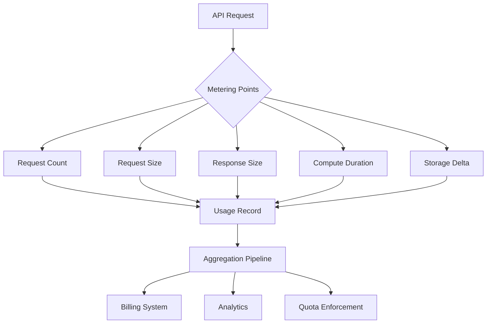
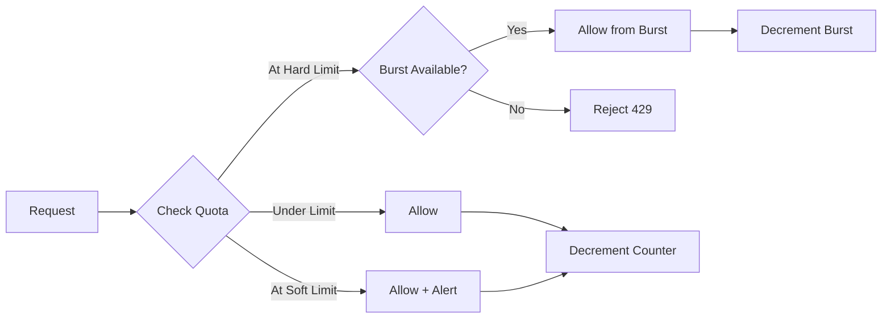
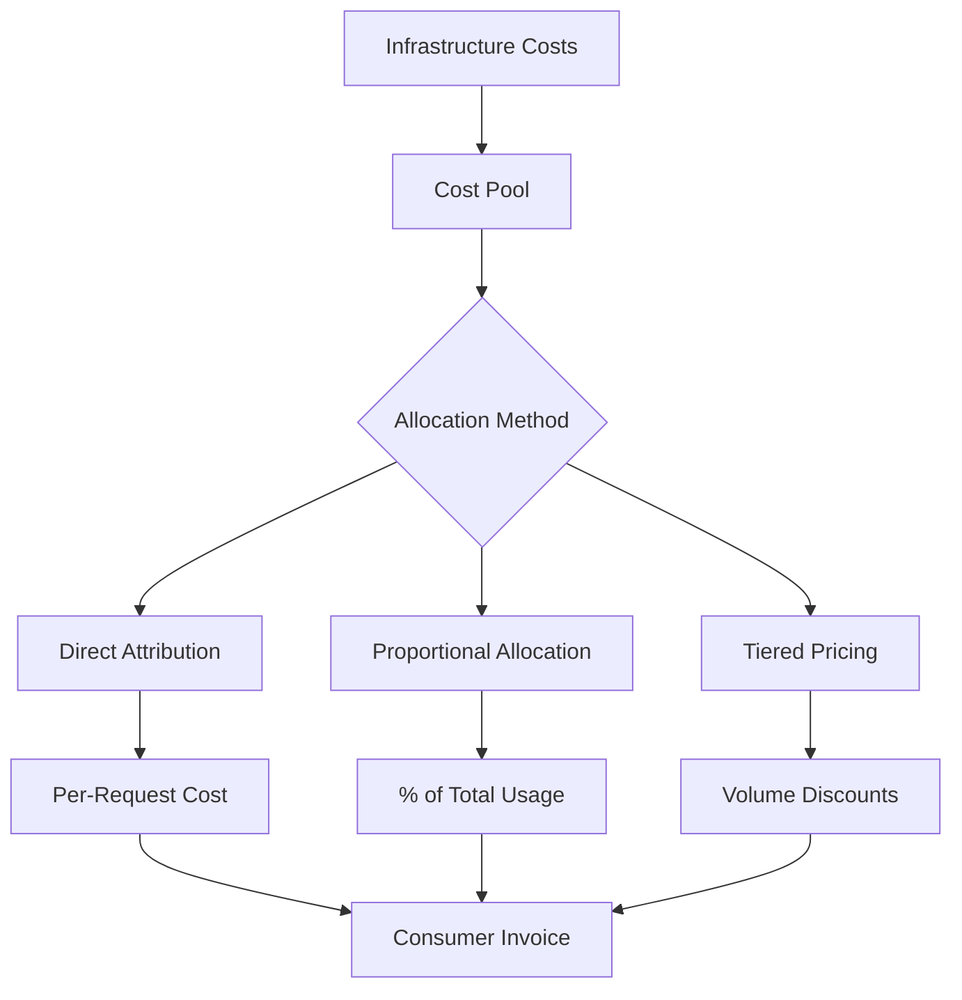
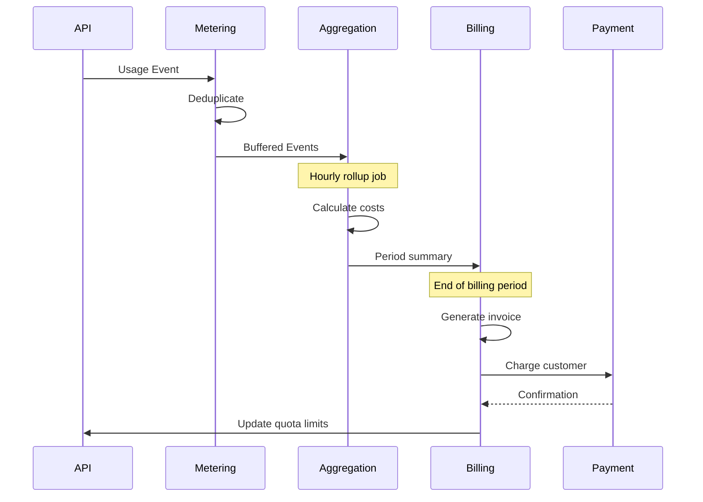
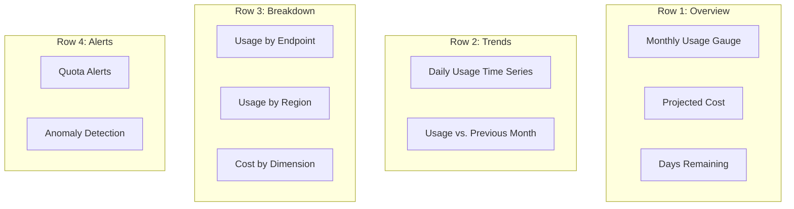
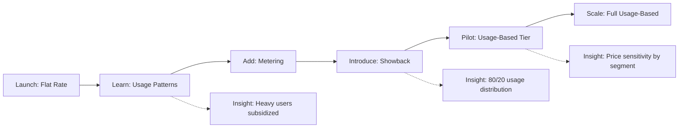

*[API]: Application Programming Interface
*[SaaS]: Software as a Service
*[COGS]: Cost of Goods Sold
*[ARR]: Annual Recurring Revenue
*[MAU]: Monthly Active Users
*[RPM]: Requests Per Minute
*[QPS]: Queries Per Second
*[P99]: 99th Percentile

# API Cost Management: Metering, Quotas, Chargebacks

## Introduction

Brief overview of why API cost management matters: APIs are not free to operate, usage patterns vary wildly between consumers, and without measurement, heavy users subsidize light users (or vice versa). This section frames cost management as an engineering problem that enables business decisions.

_Include a real-world scenario: an internal API where one team consumes 80% of capacity but the cost is split evenly across all consuming teams, creating perverse incentives and budget conflicts._

<Callout type="warning">
You cannot manage API costs you do not measure. Without usage metering, you are flying blind on capacity planning, pricing decisions, and cost allocation.
</Callout>

## The Metering Foundation

### What to Meter

Define the usage dimensions that matter for cost attribution. Not every metric is billable, but you need to capture enough to support future billing models.

| Dimension | Example | Cost Driver |
|-----------|---------|-------------|
| Request Count | 1.2M requests/month | Infrastructure scaling |
| Data Transfer | 500 GB egress/month | Network costs |
| Compute Time | 150 CPU-hours/month | Processing-intensive endpoints |
| Storage | 50 GB stored | Persistent data APIs |
| Unique Users | 10,000 MAU | License-based pricing |
| Feature Usage | 500 report generations | Premium feature tracking |

Table: Common metering dimensions mapped to cost drivers.


Figure: Metering data flow from API request to billing and enforcement systems.

### Metering Architecture Patterns

Discuss synchronous vs. asynchronous metering, and the tradeoffs between accuracy and latency impact.

<Callout type="info">
Synchronous metering adds latency to every request. For high-throughput APIs, use asynchronous metering with eventual consistency—billing does not need millisecond accuracy.
</Callout>

```yaml title="async-metering-architecture.yaml"
components:
  api_gateway:
    responsibilities:
      - Extract consumer identity
      - Emit usage event to message queue
      - Continue request processing (non-blocking)

  usage_collector:
    source: message_queue
    responsibilities:
      - Deduplicate events
      - Enrich with cost metadata
      - Write to time-series store

  aggregation_service:
    schedule: "*/5 * * * *"  # Every 5 minutes
    responsibilities:
      - Roll up raw events to consumer/period buckets
      - Calculate cost attribution
      - Update quota counters
```
Code: Asynchronous metering architecture with separated collection and aggregation.

### Event Schema Design

Define a metering event schema that captures enough context for billing without excessive cardinality.

```json title="usage-event-schema.json"
{
  "event_id": "evt_abc123",
  "timestamp": "2024-01-15T10:30:00.000Z",
  "consumer": {
    "id": "cust_xyz",
    "plan": "enterprise",
    "organization_id": "org_456"
  },
  "request": {
    "endpoint": "/api/v2/reports/generate",
    "method": "POST",
    "status_code": 200
  },
  "usage": {
    "request_count": 1,
    "request_bytes": 2048,
    "response_bytes": 1048576,
    "compute_ms": 3500,
    "billable_units": 1
  },
  "metadata": {
    "region": "us-east-1",
    "api_version": "v2",
    "feature_flags": ["premium_reports"]
  }
}
```
Code: Usage event schema with consumer context, request details, and billable dimensions.

### Idempotency and Deduplication

Address the problem of duplicate metering events. Include strategies for idempotent event processing.

```sql title="deduplication-query.sql"
-- Upsert usage event with idempotency
INSERT INTO usage_events (
    event_id,
    consumer_id,
    timestamp,
    request_count,
    request_bytes,
    response_bytes
)
VALUES (
    'evt_abc123',
    'cust_xyz',
    '2024-01-15T10:30:00Z',
    1,
    2048,
    1048576
)
ON CONFLICT (event_id) DO NOTHING;

-- Or use a deduplication window
INSERT INTO usage_events (...)
SELECT ...
WHERE NOT EXISTS (
    SELECT 1 FROM usage_events
    WHERE event_id = 'evt_abc123'
    AND timestamp > NOW() - INTERVAL '24 hours'
);
```
Code: SQL patterns for idempotent usage event insertion with deduplication.

<Callout type="danger">
Double-counting usage events leads to overbilling disputes and customer trust erosion. Build deduplication into your metering pipeline from day one—retrofitting is expensive.
</Callout>

## Quota Enforcement

### Quota Models

Compare different quota models: hard limits, soft limits, burst allowances, and rolling windows.

| Model | Behavior | Use Case |
|-------|----------|----------|
| Hard Limit | Reject requests over quota | Prevent runaway costs |
| Soft Limit | Allow overage, bill extra | Usage-based pricing |
| Burst Allowance | Allow temporary spikes | Handle legitimate traffic bursts |
| Rolling Window | Reset over sliding period | Smooth usage patterns |
| Token Bucket | Accumulate unused quota | Reward consistent usage |

Table: Quota enforcement models with use cases.


Figure: Quota enforcement decision flow with soft limits and burst allowance.

### Rate Limiting vs. Quota Enforcement

Clarify the difference between rate limiting (requests per second) and quota enforcement (requests per billing period). Both are needed.

| Mechanism | Scope | Purpose |
|-----------|-------|---------|
| Rate Limiting | Per-second/minute | Protect infrastructure, ensure fairness |
| Quota Enforcement | Per-day/month | Control costs, enforce plan limits |

Table: Rate limiting vs. quota enforcement—different tools for different problems.

```yaml title="combined-limits-config.yaml"
consumers:
  enterprise:
    rate_limits:
      requests_per_second: 100
      burst_size: 200
    quotas:
      monthly_requests: 10000000
      monthly_compute_hours: 500
      monthly_egress_gb: 1000

  starter:
    rate_limits:
      requests_per_second: 10
      burst_size: 20
    quotas:
      monthly_requests: 100000
      monthly_compute_hours: 10
      monthly_egress_gb: 50
```
Code: Configuration showing both rate limits and monthly quotas by plan tier.

### Quota Counter Implementation

Detail how to implement quota counters that are accurate, fast, and handle distributed systems challenges.

```typescript title="quota-counter.ts" {12-24}
interface QuotaCounter {
  consumerId: string;
  period: string; // "2024-01"
  dimension: string; // "requests" | "compute_ms" | "egress_bytes"
  used: number;
  limit: number;
}

async function checkAndIncrementQuota(
  consumerId: string,
  dimension: string,
  increment: number
): Promise<{ allowed: boolean; remaining: number }> {
  const period = getCurrentBillingPeriod();
  const key = `quota:${consumerId}:${period}:${dimension}`;

  // Atomic increment with limit check (Redis example)
  const script = `
    local current = tonumber(redis.call('GET', KEYS[1]) or '0')
    local limit = tonumber(ARGV[1])
    local increment = tonumber(ARGV[2])
    if current + increment > limit then
      return {0, limit - current}
    end
    redis.call('INCRBY', KEYS[1], increment)
    redis.call('EXPIRE', KEYS[1], 2678400) -- 31 days
    return {1, limit - current - increment}
  `;

  const [allowed, remaining] = await redis.eval(script, [key], [limit, increment]);
  return { allowed: allowed === 1, remaining };
}
```
Code: Atomic quota counter implementation using Redis for distributed enforcement.

### Communicating Quota Status

Explain how to communicate quota status to consumers via response headers and dedicated endpoints.

```http title="quota-headers-response.http"
HTTP/1.1 200 OK
Content-Type: application/json
X-RateLimit-Limit: 100
X-RateLimit-Remaining: 87
X-RateLimit-Reset: 1705320000
X-Quota-Limit: 10000000
X-Quota-Used: 4523891
X-Quota-Remaining: 5476109
X-Quota-Reset: 2024-02-01T00:00:00Z

{
  "data": [...]
}
```
Code: Response headers communicating both rate limit and quota status.

```json title="quota-endpoint-response.json"
{
  "consumer_id": "cust_xyz",
  "billing_period": "2024-01",
  "quotas": {
    "requests": {
      "limit": 10000000,
      "used": 4523891,
      "remaining": 5476109,
      "percent_used": 45.2
    },
    "compute_hours": {
      "limit": 500,
      "used": 127.5,
      "remaining": 372.5,
      "percent_used": 25.5
    },
    "egress_gb": {
      "limit": 1000,
      "used": 234.7,
      "remaining": 765.3,
      "percent_used": 23.5
    }
  },
  "alerts": [
    {
      "type": "approaching_limit",
      "dimension": "requests",
      "threshold": 80,
      "current": 45.2
    }
  ]
}
```
Code: Dedicated quota status endpoint response with usage breakdown and alerts.

## Cost Attribution

### Mapping Usage to Costs

Explain how to translate raw usage metrics into dollar costs. Include infrastructure cost modeling and allocation methodologies.


Figure: Cost attribution flow from infrastructure costs to consumer invoices.

### Cost Models

Compare different cost models and when to use each.

| Model | Formula | Best For |
|-------|---------|----------|
| Per-Request | $0.001 × requests | Simple, predictable APIs |
| Compute-Based | $0.10 × CPU-hours | Processing-intensive workloads |
| Data Transfer | $0.05 × GB | Data-heavy APIs |
| Tiered | Decreasing $/unit at volume | Encouraging growth |
| Flat + Overage | $500/month + $0.0005/request over 1M | Predictable base + flexibility |

Table: Cost models with formulas and use cases.

```yaml title="pricing-tiers.yaml"
pricing:
  requests:
    tiers:
      - up_to: 1000000
        unit_price: 0.001  # $1 per 1000
      - up_to: 10000000
        unit_price: 0.0008  # $0.80 per 1000
      - up_to: 100000000
        unit_price: 0.0005  # $0.50 per 1000
      - unlimited:
        unit_price: 0.0003  # $0.30 per 1000

  compute:
    unit: cpu_hour
    price: 0.10

  egress:
    unit: gb
    tiers:
      - up_to: 100
        unit_price: 0.00  # First 100 GB free
      - unlimited:
        unit_price: 0.05
```
Code: Tiered pricing configuration with volume discounts and free tiers.

### Internal Chargeback Implementation

Detail how to implement chargebacks for internal APIs. Include organizational challenges and technical solutions.

<Callout type="info">
Internal chargebacks are as much an organizational challenge as a technical one. Get finance and team leads aligned on the allocation methodology before building the system.
</Callout>

```sql title="chargeback-report-query.sql"
-- Monthly chargeback report by consuming team
SELECT
    ct.team_name,
    ct.cost_center,
    DATE_TRUNC('month', u.timestamp) AS billing_month,
    SUM(u.request_count) AS total_requests,
    SUM(u.compute_ms) / 3600000.0 AS compute_hours,
    SUM(u.egress_bytes) / 1073741824.0 AS egress_gb,
    -- Cost calculation
    SUM(u.request_count) * 0.0001 AS request_cost,
    (SUM(u.compute_ms) / 3600000.0) * 0.10 AS compute_cost,
    (SUM(u.egress_bytes) / 1073741824.0) * 0.05 AS egress_cost,
    -- Total
    SUM(u.request_count) * 0.0001 +
    (SUM(u.compute_ms) / 3600000.0) * 0.10 +
    (SUM(u.egress_bytes) / 1073741824.0) * 0.05 AS total_cost
FROM usage_events u
JOIN consumers c ON u.consumer_id = c.id
JOIN consuming_teams ct ON c.team_id = ct.id
WHERE u.timestamp >= DATE_TRUNC('month', CURRENT_DATE - INTERVAL '1 month')
  AND u.timestamp < DATE_TRUNC('month', CURRENT_DATE)
GROUP BY ct.team_name, ct.cost_center, DATE_TRUNC('month', u.timestamp)
ORDER BY total_cost DESC;
```
Code: SQL query generating monthly chargeback report by consuming team.

### Showback vs. Chargeback

Explain the difference between showback (visibility without billing) and chargeback (actual cost transfer). Recommend starting with showback.

| Approach | Visibility | Budget Impact | Organizational Friction |
|----------|------------|---------------|------------------------|
| No Attribution | None | Hidden in shared costs | Low |
| Showback | Full | Informational only | Low |
| Soft Chargeback | Full | Budget guidance | Medium |
| Hard Chargeback | Full | Actual cost transfer | High |

Table: Attribution approaches from visibility-only to hard chargebacks.

<Callout type="warning">
Start with showback before implementing chargebacks. Teams need time to understand their usage patterns and optimize before costs hit their budgets.
</Callout>

## Billing Integration

### Usage-Based Billing Flow

Walk through the complete billing flow from usage events to invoice generation.


Figure: End-to-end billing flow from API usage to payment processing.

### Integrating with Billing Platforms

Discuss integration patterns with billing platforms (Stripe Billing, Chargebee, internal systems).

```typescript title="stripe-usage-reporting.ts" {8-20}
import Stripe from 'stripe';

const stripe = new Stripe(process.env.STRIPE_SECRET_KEY);

async function reportUsageToStripe(
  subscriptionItemId: string,
  usage: UsageSummary
): Promise<void> {
  // Report metered usage to Stripe
  await stripe.subscriptionItems.createUsageRecord(
    subscriptionItemId,
    {
      quantity: usage.billableUnits,
      timestamp: Math.floor(usage.periodEnd.getTime() / 1000),
      action: 'set', // 'set' replaces, 'increment' adds
    }
  );

  console.log(`Reported ${usage.billableUnits} units for ${subscriptionItemId}`);
}

// Called at end of billing period
async function finalizeUsage(consumerId: string): Promise<void> {
  const usage = await aggregateUsageForPeriod(consumerId);
  const subscriptionItemId = await getStripeSubscriptionItem(consumerId);
  await reportUsageToStripe(subscriptionItemId, usage);
}
```
Code: Stripe usage-based billing integration for metered subscriptions.

### Handling Billing Disputes

Address how to handle disputes when consumers question their usage. Include audit log requirements.

```json title="usage-audit-record.json"
{
  "audit_id": "aud_789",
  "consumer_id": "cust_xyz",
  "billing_period": "2024-01",
  "dispute": {
    "claimed_usage": 4000000,
    "billed_usage": 4523891,
    "discrepancy": 523891
  },
  "investigation": {
    "raw_event_count": 4523891,
    "duplicate_events": 0,
    "failed_requests_included": false,
    "sample_events": [
      {"event_id": "evt_001", "timestamp": "...", "endpoint": "..."},
      {"event_id": "evt_002", "timestamp": "...", "endpoint": "..."}
    ]
  },
  "resolution": {
    "outcome": "confirmed_accurate",
    "explanation": "Consumer miscounted due to retry logic in their client",
    "adjustment": 0
  }
}
```
Code: Usage dispute audit record with investigation details and resolution.

<Callout type="info">
Keep raw usage events for at least one billing cycle beyond the dispute window. You need evidence to resolve disputes, and "trust us" is not a compelling argument.
</Callout>

## Dashboards and Reporting

### Consumer Usage Dashboard

Define the dashboard consumers need to understand and manage their usage.

| Panel | Visualization | Purpose |
|-------|---------------|---------|
| Current Period Usage | Gauge/Progress | How much quota used |
| Usage Trend | Time series | Daily/hourly usage pattern |
| Usage by Endpoint | Bar chart | Which APIs drive usage |
| Projected Month-End | Stat | Forecast based on current rate |
| Cost Breakdown | Pie chart | Where money is going |
| Alerts | List | Approaching limits, unusual patterns |

Table: Consumer-facing usage dashboard panels.


Figure: Consumer usage dashboard layout with logical panel grouping.

### Internal Cost Visibility Dashboard

Describe dashboards for internal teams managing API costs.

```promql title="cost-visibility-queries.promql"
# Total monthly cost across all consumers
sum(
  increase(usage_billable_units_total[30d])
) * 0.001

# Cost by consumer tier
sum by (plan) (
  increase(usage_billable_units_total[30d])
) * 0.001

# Top 10 consumers by cost
topk(10,
  sum by (consumer_id) (
    increase(usage_billable_units_total[30d])
  ) * 0.001
)

# Cost trend (daily)
sum(increase(usage_billable_units_total[1d])) * 0.001
```
Code: PromQL queries for internal cost visibility dashboard.

### Anomaly Detection

Explain how to detect usage anomalies that might indicate abuse, bugs, or billing issues.

```yaml title="usage-anomaly-alerts.yaml"
alerts:
  # Consumer usage spike
  - name: ConsumerUsageSpike
    condition: |
      (
        sum(rate(usage_requests_total{consumer_id=~".+"}[1h])) by (consumer_id)
        /
        sum(avg_over_time(usage_requests_total{consumer_id=~".+"}[7d:1h])) by (consumer_id)
      ) > 5
    severity: warning
    annotation: "Consumer {{ $labels.consumer_id }} usage 5x above 7-day average"

  # Potential credential leak (new IPs, high volume)
  - name: PotentialCredentialLeak
    condition: |
      count by (consumer_id) (
        count_over_time(usage_requests_total{consumer_id=~".+"}[1h])
      ) > 100  # Requests from >100 unique IPs
    severity: critical
    annotation: "Consumer {{ $labels.consumer_id }} requests from unusual number of IPs"
```
Code: Usage anomaly detection alerts for abuse and security issues.

## Organizational Considerations

### Getting Buy-In for Cost Attribution

Discuss the organizational challenges of implementing cost attribution and how to build consensus.

> The hardest part of API cost attribution is not the engineering—it is getting agreement on what is fair.
> — Every platform team eventually

### Gradual Rollout Strategy

Recommend a phased approach: instrument first, report second, enforce third.

| Phase | Duration | Deliverable | Organizational Impact |
|-------|----------|-------------|----------------------|
| Instrument | 1-2 months | Metering pipeline | None (invisible) |
| Report | 2-3 months | Showback dashboards | Awareness |
| Soft Enforce | 1-2 months | Warnings at limits | Behavior change |
| Hard Enforce | Ongoing | Quotas and billing | Budget impact |

Table: Phased rollout for API cost management implementation.

<Callout type="success">
Start with visibility. Teams cannot optimize what they cannot see. Give them 2-3 months of usage data before introducing hard quotas or chargebacks.
</Callout>

### Pricing Model Evolution

Address how pricing models evolve as you learn more about usage patterns and costs.


Figure: Pricing model evolution from flat rate to usage-based billing.

## Implementation Checklist

### Technical Requirements

Provide a checklist for implementing API cost management.

```markdown title="implementation-checklist.md"
## Metering Pipeline
- [ ] Usage event schema defined
- [ ] Event emission from API gateway
- [ ] Message queue for async processing
- [ ] Deduplication logic implemented
- [ ] Time-series storage configured
- [ ] Aggregation jobs scheduled

## Quota Enforcement
- [ ] Quota counter implementation (Redis/similar)
- [ ] Rate limit vs. quota separation
- [ ] Quota headers in responses
- [ ] Quota status API endpoint
- [ ] 429 response with retry-after

## Cost Attribution
- [ ] Cost model defined
- [ ] Infrastructure costs mapped to usage
- [ ] Chargeback report generation
- [ ] Finance team alignment

## Billing Integration
- [ ] Billing platform integration
- [ ] Usage reporting automation
- [ ] Invoice generation
- [ ] Dispute handling process

## Observability
- [ ] Consumer usage dashboard
- [ ] Internal cost dashboard
- [ ] Anomaly detection alerts
- [ ] Audit log retention
```
Code: Implementation checklist for API cost management systems.

## Conclusion

Summarize the key principles: meter everything (even if you do not bill for it yet), enforce quotas at multiple levels, attribute costs transparently, and roll out gradually. Emphasize that cost management is a business enabler—it lets you offer usage-based pricing, identify your most valuable consumers, and make informed capacity decisions.

<Callout type="success">
API cost management is not about charging customers more—it is about understanding the true cost of your API and making informed decisions about pricing, capacity, and investment.
</Callout>

---

## Cover Prompt

### Prompt 1: Metering Pipeline Flow

Create a stylized visualization of data flowing through a metering pipeline. API requests enter as streams of light, pass through measurement gates that capture dimensions (counters, timers, gauges), and aggregate into glowing usage buckets. Final output shows cost calculations. Style: data flow visualization, dark background with luminous data streams, tech-forward aesthetic, blue and gold color scheme, 16:9 aspect ratio.

### Prompt 2: Quota Gauge Dashboard

Illustrate a sleek dashboard interface showing multiple circular gauge meters for different quota dimensions (requests, compute, storage). Some gauges are in green (safe), one is in yellow (warning), one approaching red (limit). Clean, modern SaaS dashboard aesthetic with subtle depth and shadows. Style: UI design illustration, dark mode dashboard, gradient fills on gauges, professional enterprise aesthetic, 16:9 aspect ratio.

### Prompt 3: Cost Attribution Breakdown

Design an abstract visualization of cost allocation. A central "cost pool" (represented as a glowing sphere or container) distributes costs to different consumers represented as receiving nodes of varying sizes. Connection lines show attribution flow with dollar amounts. Style: network/flow diagram aesthetic, financial visualization meets tech, green/blue gradient for money flow, dark background, 16:9 aspect ratio.

### Prompt 4: Usage Tiers Staircase

Create an isometric illustration of ascending staircases/platforms representing pricing tiers. Lower tiers are crowded with small consumers, higher tiers have fewer but larger consumers. Each tier shows a price tag and usage range. Visual metaphor for volume-based pricing. Style: isometric illustration, clean geometric shapes, tiered gradient colors (light to premium), minimalist tech aesthetic, 16:9 aspect ratio.

### Prompt 5: Billing Cycle Timeline

Illustrate a horizontal timeline showing the billing cycle: usage events flowing in continuously, aggregation checkpoints, end-of-period invoice generation, and payment processing. Each stage represented as a distinct station on the timeline with appropriate iconography. Style: timeline infographic, process visualization, dark theme with accent colors for each stage, modern fintech aesthetic, 16:9 aspect ratio.
