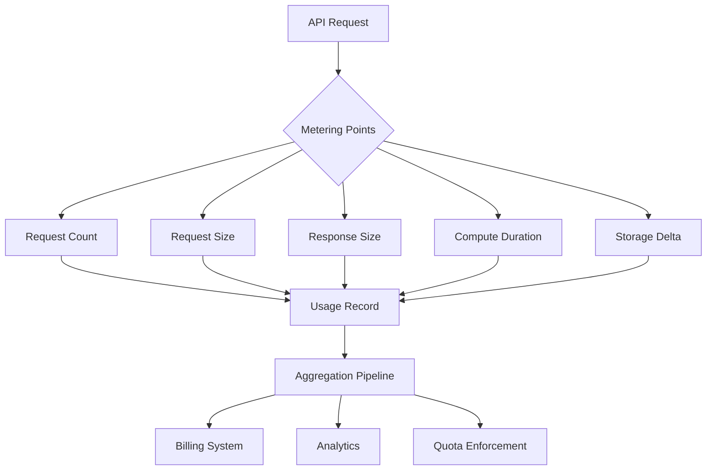
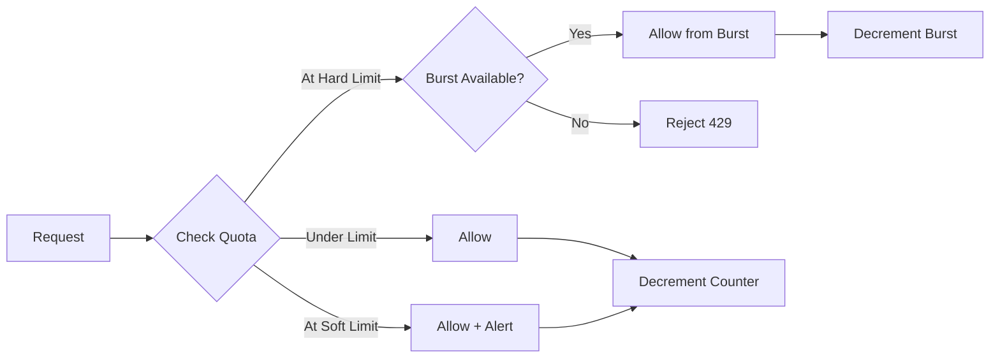
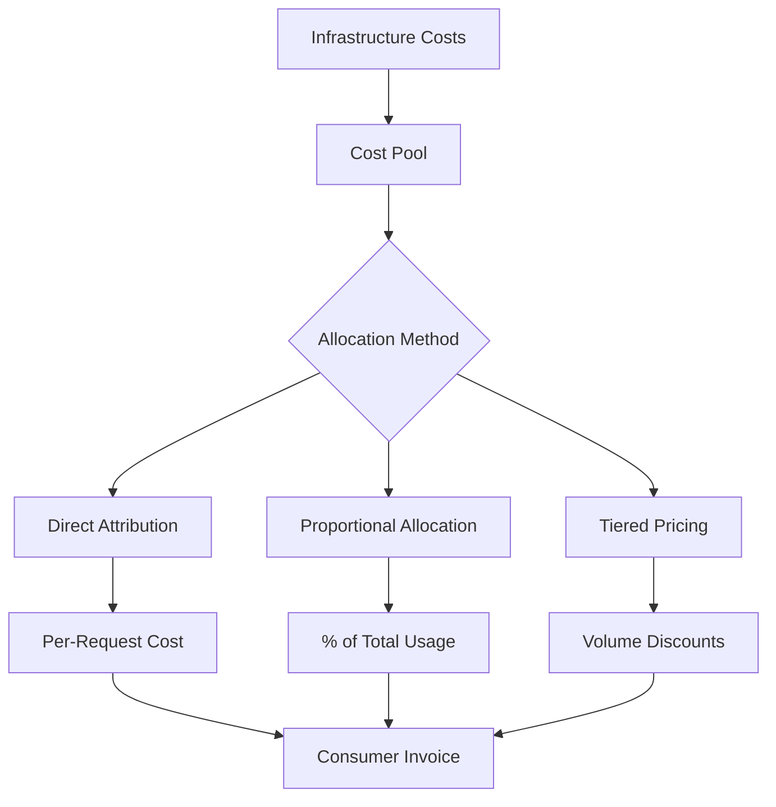
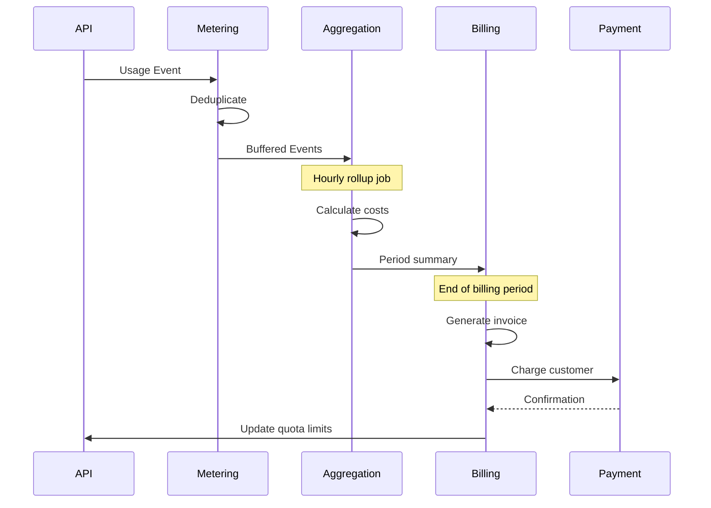
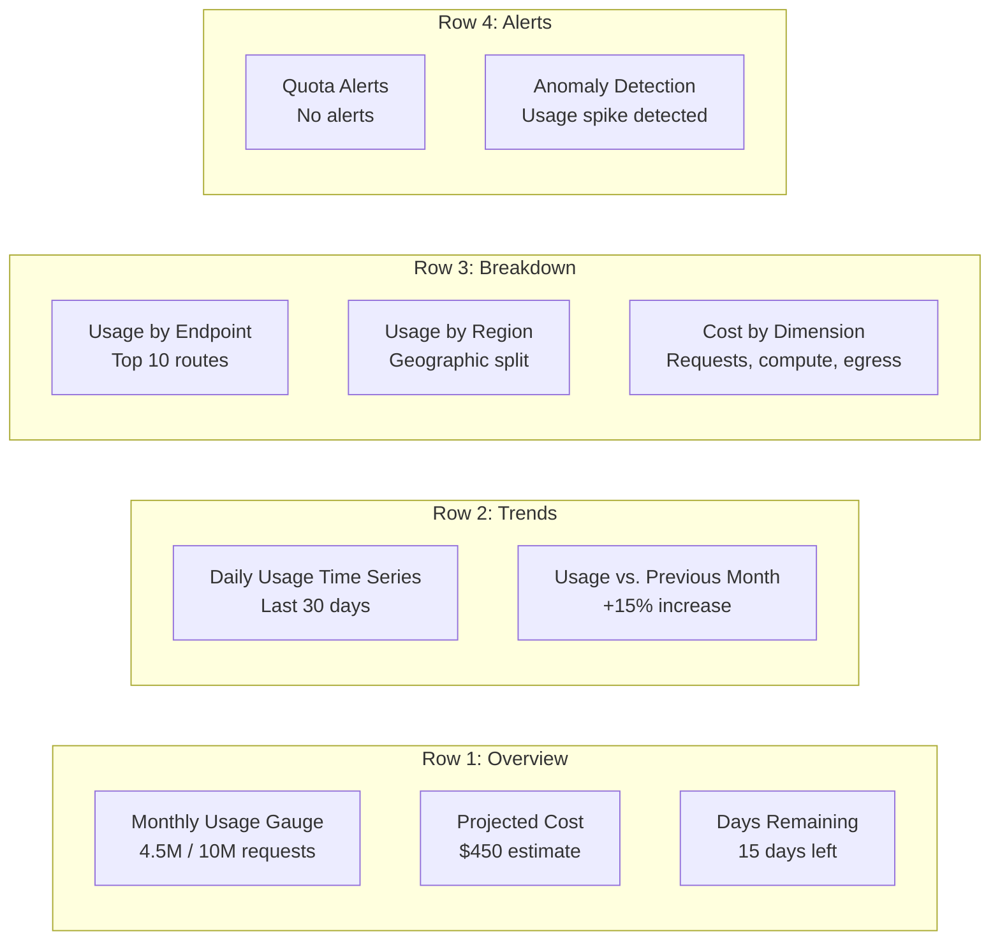
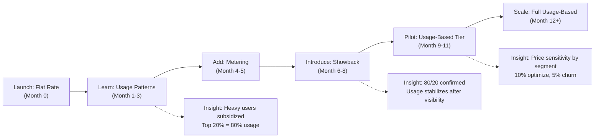

import Callout from '@components/Callout/index.astro'

*[API]: Application Programming Interface
*[SaaS]: Software as a Service
*[COGS]: Cost of Goods Sold
*[ARR]: Annual Recurring Revenue
*[MAU]: Monthly Active Users
*[RPM]: Requests Per Minute
*[QPS]: Queries Per Second
*[P99]: 99th Percentile

## Introduction

Last year I watched a finance director lose his mind during a quarterly budget review. His team's infrastructure costs had doubled, but when he asked engineering why, nobody could answer. The problem wasn't capacity—it was one internal team consuming 80% of an API's capacity while costs were split evenly across six teams. The heavy user's budget allocation: $15,000. Their actual cost: $120,000. The other five teams were subsidizing them, and nobody knew.

This isn't a billing problem—it's a visibility problem. APIs aren't free to operate. Every request costs compute time, network transfer, and storage. Usage patterns vary wildly between consumers: one might make 100 requests per day, another 10 million. Without measurement, you're guessing at capacity planning, pricing decisions become political negotiations, and cost allocation is fiction.

The pattern I've seen repeatedly: teams build APIs focused on functionality, ship them, then realize months later they can't answer basic questions. Which team is driving costs? Which endpoints are expensive? Should we charge for this feature? By then, changing the contract is organizational surgery.

<Callout type="warning">
You can't manage API costs you don't measure. Without usage metering, you're flying blind on capacity planning, pricing decisions, and cost allocation.
</Callout>

## The Metering Foundation

### What to Meter

Not every metric needs to be billable, but you need to capture enough dimensions to support future billing models and answer cost questions. The challenge is balancing granularity against cardinality—too many dimensions and your time-series database explodes, too few and you can't attribute costs accurately.

The metrics that drive API costs:

| Dimension | Example | Cost Driver |
|-----------|---------|-------------|
| Request Count | 1.2M requests/month | Infrastructure scaling |
| Data Transfer | 500 GB egress/month | Network costs |
| Compute Time | 150 CPU-hours/month | Processing-intensive endpoints |
| Storage | 50 GB stored | Persistent data APIs |
| Unique Users | 10,000 MAU | License-based pricing |
| Feature Usage | 500 report generations | Premium feature tracking |

Table: Common metering dimensions mapped to cost drivers.

Request count is universal—every API tracks it. But it's often a poor proxy for cost. A 200-byte health check and a 50MB data export both count as "one request," but their infrastructure impact differs by orders of magnitude. Add data transfer and compute time to capture the actual resource consumption.

For storage-backed APIs (document processing, media transcoding, backup systems), track storage deltas. For APIs with expensive features (PDF generation, video encoding, ML inference), track feature-specific usage separately. The billing model can come later, but you can't retroactively meter usage you never captured.



Figure: Metering data flow from API request to billing and enforcement systems.

### Metering Architecture Patterns

The first question: should metering be synchronous or asynchronous? Synchronous metering blocks the request until the usage event is recorded. It's accurate but adds latency to every request. Asynchronous metering emits the event and continues processing—it's fast but introduces eventual consistency challenges.

For high-throughput APIs, async metering is usually the right call. Billing doesn't need millisecond accuracy. If a usage event takes 50ms to persist but your API target is sub-100ms latency, synchronous metering breaks your SLA. Emit events to a message queue and process them out-of-band.

<Callout type="info">
Synchronous metering adds latency to every request. For high-throughput APIs, use asynchronous metering with eventual consistency—billing doesn't need millisecond accuracy.
</Callout>

```yaml title="async-metering-architecture.yaml"
# Deployed as sidecar or separate service
components:
  api_gateway:
    responsibilities:
      - Extract consumer identity from auth token
      - Emit usage event to SQS/Kinesis
      - Continue request processing (non-blocking)
    latency_impact: ~1-2ms

  usage_collector:
    source: sqs_queue
    responsibilities:
      - Consume events in batches
      - Deduplicate within time window
      - Enrich with cost metadata (plan tier, rate)
      - Write to TimescaleDB/ClickHouse
    throughput: 50k events/sec

  aggregation_service:
    schedule: "*/5 * * * *"  # Every 5 minutes
    responsibilities:
      - Roll up raw events to consumer/period buckets
      - Calculate cost attribution
      - Update quota counters in Redis
      - Generate alerts for approaching limits
```

Code: Asynchronous metering architecture with separated collection and aggregation.

The tradeoff: eventual consistency means quota enforcement lags usage by minutes. If a consumer hits their quota, they might get a few extra requests through before the quota counter updates. For most use cases, this is acceptable—you're billing by the month, not by the second. For strict enforcement scenarios (preventing abuse, hard cost controls), check quotas synchronously but meter asynchronously.

### Event Schema Design

Design your usage event schema once. Changing it later means migrating historical data or maintaining multiple schemas. Capture enough context for billing, but avoid high-cardinality fields that explode your time-series database.

```json title="usage-event-schema.json"
{
  "event_id": "evt_1a2b3c4d5e",
  "timestamp": "2024-01-15T10:30:00.123Z",
  "consumer": {
    "id": "team_analytics",
    "plan": "enterprise",
    "organization_id": "org_acme"
  },
  "request": {
    "endpoint": "/api/v2/reports/generate",
    "method": "POST",
    "status_code": 200,
    "region": "us-east-1"
  },
  "usage": {
    "request_count": 1,
    "request_bytes": 2048,
    "response_bytes": 1048576,
    "compute_ms": 3500,
    "storage_delta_bytes": 0
  },
  "metadata": {
    "api_version": "v2",
    "feature_flags": ["premium_reports"],
    "billable": true
  }
}
```

Code: Usage event schema with consumer context, request details, and billable dimensions.

Key decisions:

- **Identifiers**: Use opaque IDs (`team_analytics`) not email addresses or names. Consumer IDs should be stable—if a team renames themselves, the ID stays constant.
- **Timestamps**: Use ISO 8601 with millisecond precision. Time zones matter for billing periods.
- **Status codes**: Separate billable requests (2xx) from errors (4xx, 5xx). You probably don't want to charge for failed requests.
- **Cardinality**: Avoid unbounded fields like IP addresses or user agents in dimensions you'll aggregate by. Route patterns (`/users/:id`) are fine, raw paths (`/users/12345`) are not.

### Idempotency and Deduplication

Network failures, retries, and at-least-once delivery guarantees mean you'll receive duplicate usage events. Without deduplication, you'll overcount usage and overbill consumers. This destroys trust faster than anything else.

You can handle this with idempotency keys (each event gets a unique ID that prevents duplicates) or time-window deduplication (checking if the same event appeared recently).

```sql title="deduplication-with-idempotency.sql"
-- PostgreSQL/TimescaleDB example
-- Idempotent insert using event_id as unique constraint
INSERT INTO usage_events (
    event_id,
    consumer_id,
    timestamp,
    request_count,
    request_bytes,
    response_bytes,
    compute_ms
)
VALUES (
    'evt_1a2b3c4d5e',
    'team_analytics',
    '2024-01-15T10:30:00.123Z',
    1,
    2048,
    1048576,
    3500
)
ON CONFLICT (event_id) DO NOTHING;
```

Code: Idempotent usage event insertion using unique constraint on event_id.

For time-series databases without unique constraints, use time-window deduplication:

```sql title="time-window-deduplication.sql"
-- Check if event exists within last 24 hours before inserting
INSERT INTO usage_events (...)
SELECT ...
WHERE NOT EXISTS (
    SELECT 1 FROM usage_events
    WHERE event_id = 'evt_1a2b3c4d5e'
    AND timestamp > NOW() - INTERVAL '24 hours'
);
```

Code: Time-window deduplication for databases without unique constraints.

Workflow integration: run deduplication as part of your aggregation pipeline (every 5 minutes for real-time quotas, hourly for billing). For large datasets (>100M events/day), partition the `usage_events` table by timestamp and add an index on `(event_id, timestamp)` to keep query performance under 100ms.

Choose the deduplication window based on your retry logic. If your queue consumer retries for up to 6 hours, deduplicate across 12 hours to be safe. The storage cost of keeping event IDs for deduplication is negligible compared to the cost of billing disputes.

<Callout type="danger">
Double-counting usage events leads to overbilling disputes and customer trust erosion. Build deduplication into your metering pipeline from day one—retrofitting is expensive.
</Callout>

## Quota Enforcement

### Quota Models

Quotas answer the question: "How much usage is too much?" But "too much" depends on context. A hard limit that rejects requests prevents runaway costs but creates a poor user experience. A soft limit that allows overages is forgiving but harder to predict financially. You need both, applied at different levels.

| Model | Behavior | Use Case |
|-------|----------|----------|
| Hard Limit | Reject requests over quota | Prevent runaway costs |
| Soft Limit | Allow overage, bill extra | Usage-based pricing |
| Burst Allowance | Allow temporary spikes | Handle legitimate traffic bursts |
| Rolling Window | Reset over sliding period | Smooth usage patterns |
| Token Bucket | Accumulate unused quota | Reward consistent usage |

Table: Quota enforcement models with use cases.

Hard limits are common for free tiers and trial accounts—once you hit the cap, you're done until the next billing period. Soft limits work for paid plans where you want to allow growth but charge for it. Burst allowances let consumers handle legitimate spikes (a batch job that runs monthly) without hitting a hard wall.

Token buckets are elegant for smoothing usage. Instead of "1 million requests per month," you get tokens at a steady rate (about 385 requests per hour for a 1M monthly quota). If you don't use them, they accumulate up to a cap. This prevents someone from using their entire monthly quota in the first day, then being throttled for the remaining 29 days.



Figure: Quota enforcement decision flow with soft limits and burst allowance.

### Rate Limiting vs. Quota Enforcement

Rate limiting and quota enforcement solve different problems. Rate limiting is "requests per second"—it protects infrastructure and ensures fairness. Quota enforcement is "requests per billing period"—it controls costs and enforces plan limits. You need both.

| Mechanism | Scope | Purpose |
|-----------|-------|---------|
| Rate Limiting | Per-second/minute | Protect infrastructure, ensure fairness |
| Quota Enforcement | Per-day/month | Control costs, enforce plan limits |

Table: Rate limiting vs. quota enforcement—different tools for different problems.

A consumer might have a rate limit of 100 requests per second but a monthly quota of 10 million requests. The rate limit prevents them from overwhelming your API with a sudden burst. The quota prevents them from consuming resources beyond their plan tier over the billing period.

```yaml title="combined-limits-config.yaml"
# Kong Gateway configuration for combined rate limits and quotas
# Compatible with Kong Gateway 3.x (Enterprise Edition for quota plugin)
# Deploy to: kong.yml or via Kong Admin API declarative config endpoint
consumers:
  enterprise_tier:
    rate_limits:
      requests_per_second: 100
      burst_size: 200           # Allow brief spikes to 200 rps
    quotas:
      monthly_requests: 10000000
      monthly_compute_hours: 500
      monthly_egress_gb: 1000

  starter_tier:
    rate_limits:
      requests_per_second: 10
      burst_size: 20
    quotas:
      monthly_requests: 100000
      monthly_compute_hours: 10
      monthly_egress_gb: 50
```

Code: Configuration showing both rate limits and monthly quotas by plan tier.

The interaction matters: if a starter-tier consumer hits their monthly quota on day 15, you still enforce the rate limit. They're throttled to 10 requests per second, but every request past their quota either gets rejected (hard limit) or billed at overage rates (soft limit).

### Quota Counter Implementation

Quota counters need to be fast, accurate, and work correctly in distributed systems. The naive approach—read current usage, check if increment would exceed limit, write new value—is a race condition. Multiple requests can check the quota simultaneously, all see "under limit," and all increment past it.

The atomic operation is critical:

```python title="quota_counter.py"
from typing import Tuple
from datetime import datetime
import redis

# Connect to Redis
redis_client = redis.Redis(host='localhost', port=6379, decode_responses=True)

def check_and_increment_quota(
    consumer_id: str,
    dimension: str,
    increment: int,
    limit: int
) -> Tuple[bool, int]:
    """
    Atomically check quota and increment usage counter.

    This function uses a Lua script that runs on the Redis server.
    The script executes atomically - no other operations can interleave.
    This prevents race conditions in distributed systems.

    Error handling: Redis connection failures should fall back to allowing
    the request (fail open) and log for manual review. Retrying on script
    execution errors risks double-counting.
    """
    period = get_current_billing_period()  # e.g., "2024-01"
    key = f"quota:{consumer_id}:{period}:{dimension}"

    # Lua script runs server-side on Redis for atomic check-and-increment
    # The script is a string in Python, but Redis executes it as Lua
    lua_script = """
    local current = tonumber(redis.call('GET', KEYS[1]) or '0')
    local limit = tonumber(ARGV[1])
    local increment = tonumber(ARGV[2])

    -- Check if increment would exceed limit
    if current + increment > limit then
        return {0, limit - current}  -- Deny, return remaining quota
    end

    -- Allow request and increment counter
    redis.call('INCRBY', KEYS[1], increment)
    redis.call('EXPIRE', KEYS[1], 2678400)  -- 31 days in seconds
    return {1, limit - current - increment}  -- Allow, return remaining quota
    """
    # End Lua script

    # Execute Lua script atomically on Redis server
    result = redis_client.eval(lua_script, 1, key, limit, increment)
    allowed = result[0] == 1
    remaining = result[1]

    return allowed, remaining

def get_current_billing_period() -> str:
    """Return current billing period as YYYY-MM string."""
    return datetime.now().strftime("%Y-%m")
```

Code: Atomic quota counter using Python with embedded Lua script for Redis.

Consumers need visibility into their quota status before they hit the limit. Communicate it in response headers and provide a dedicated API endpoint.

```http title="quota-headers-response.http"
HTTP/1.1 200 OK
Content-Type: application/json
X-RateLimit-Limit: 100
X-RateLimit-Remaining: 87
X-RateLimit-Reset: 1705320000
X-Quota-Limit: 10000000
X-Quota-Used: 4523891
X-Quota-Remaining: 5476109
X-Quota-Reset: 2024-02-01T00:00:00Z

{
  "data": [...]
}
```

Code: Response headers communicating both rate limit and quota status.

The pattern is adopted from GitHub's API: every response includes quota headers. Consumers can check their status without making a separate API call. The reset timestamp tells them when the quota refreshes—critical for clients that implement backoff or scheduling logic.

For dashboards and detailed breakdowns, provide a quota status endpoint:

```json title="quota-endpoint-response.json"
{
  "consumer_id": "team_analytics",
  "billing_period": "2024-01",
  "quotas": {
    "requests": {
      "limit": 10000000,
      "used": 4523891,
      "remaining": 5476109,
      "percent_used": 45.2
    },
    "compute_hours": {
      "limit": 500,
      "used": 127.5,
      "remaining": 372.5,
      "percent_used": 25.5
    },
    "egress_gb": {
      "limit": 1000,
      "used": 234.7,
      "remaining": 765.3,
      "percent_used": 23.5
    }
  },
  "alerts": [
    {
      "type": "approaching_limit",
      "dimension": "requests",
      "threshold": 80,
      "message": "You're at 45% of your monthly request quota"
    }
  ]
}
```

Code: Dedicated quota status endpoint response with usage breakdown and alerts.

Send alerts at 50%, 75%, and 90% of quota usage—this gives consumers time to optimize their code, upgrade their plan, or at least know throttling is coming.

When quotas reset (typically at the start of a new billing period), requests immediately succeed again. The quota counter resets to zero atomically, but be aware of clock skew in distributed systems—use a grace period (2-5 minutes) where requests near the reset boundary are allowed even if the counter hasn't reset yet. This prevents frustrating "429 errors at midnight" support tickets.

## Cost Attribution

### Mapping Usage to Costs

You've captured usage metrics—now you need to translate them into dollar costs. The challenge is that infrastructure costs are bundled (you pay for compute, storage, network, overhead) but usage is granular (requests, bytes, milliseconds). The mapping is never exact.

Three common approaches:

**Direct attribution**: Map specific costs directly to usage dimensions. If your compute bill is $10,000 and you processed 10 million requests, each request costs $0.001 in compute. Simple, but it ignores fixed costs and assumes all requests are equal.

**Proportional allocation**: Create a cost pool of all API infrastructure costs, then allocate based on usage share. If Team A made 60% of requests, they get 60% of costs. Fair for similar usage patterns, but a team making cheap health checks subsidizes one making expensive video transcoding.

**Tiered pricing**: Charge different rates based on volume or feature usage. High-volume consumers get volume discounts, premium features cost more. This is closer to how SaaS companies price APIs and aligns incentives better than pure cost recovery.



Figure: Cost attribution flow from infrastructure costs to consumer invoices.

Most internal APIs start with direct attribution (simple to explain) then move to proportional allocation once they realize different usage patterns have different costs. External APIs almost always use tiered pricing because it creates better business incentives.

### Cost Models

Picking a cost model is as much psychology as math. The model shapes behavior—per-request pricing encourages consumers to reduce calls, compute-based pricing encourages efficient code, tiered pricing encourages growth.

| Model | Formula | Best For |
|-------|---------|----------|
| Per-Request | $0.001 × requests | Simple, predictable APIs |
| Compute-Based | $0.10 × CPU-hours | Processing-intensive workloads |
| Data Transfer | $0.05 × GB | Data-heavy APIs |
| Tiered | Decreasing $/unit at volume | Encouraging growth |
| Flat + Overage | $500/month + $0.001/request over 1M | Predictable base + flexibility |

Table: Cost models with formulas and use cases.

The "Flat + Overage" model is underrated for internal APIs. It gives teams predictable budgets (the $500/month base covers normal usage) while preventing abuse (overages are billed separately). Finance likes it because budgets are stable, and engineering likes it because there's flexibility for legitimate spikes.

```yaml title="pricing-tiers.yaml"
# Pricing configuration consumed by billing/aggregation service
# Store in config management (AWS Systems Manager, Consul, database)
# Referenced by cost calculation logic in the aggregation pipeline
pricing:
  requests:
    tiers:
      - up_to: 1000000
        unit_price: 0.001  # $1 per 1000 requests
      - up_to: 10000000
        unit_price: 0.0008  # $0.80 per 1000 (20% discount)
      - up_to: 100000000
        unit_price: 0.0005  # $0.50 per 1000 (50% discount)
      - unlimited:
        unit_price: 0.0003  # $0.30 per 1000 (70% discount)

  compute:
    unit: cpu_hour
    price: 0.10

  egress:
    unit: gb
    tiers:
      - up_to: 100
        unit_price: 0.00  # First 100 GB free (AWS-style)
      - unlimited:
        unit_price: 0.05
```

Code: Tiered pricing configuration with volume discounts and free tiers.

Volume discounts align incentives: you want high usage (more value from your API investment), and consumers get lower unit costs as they grow. The free tier for egress is a nod to AWS pricing—sometimes it's better to eliminate tiny charges that create more billing friction than revenue.

### Internal Chargeback Implementation

Internal chargebacks are where cost attribution gets political. You're not just tracking costs—you're moving money between teams' budgets. The technical part is straightforward; the organizational part requires diplomacy.

<Callout type="info">
Internal chargebacks are as much an organizational challenge as a technical one. Get finance and team leads aligned on the allocation methodology before building the system.
</Callout>

The SQL for generating chargeback reports is simple once you've instrumented metering:

```sql title="chargeback-report-query.sql"
-- Monthly chargeback report by consuming team
-- Aggregates usage and applies cost rates
SELECT
    ct.team_name,
    ct.cost_center,
    DATE_TRUNC('month', u.timestamp) AS billing_month,

    -- Usage totals
    SUM(u.request_count) AS total_requests,
    SUM(u.compute_ms) / 3600000.0 AS compute_hours,
    SUM(u.egress_bytes) / 1073741824.0 AS egress_gb,

    -- Cost calculation (rates from pricing config)
    SUM(u.request_count) * 0.0001 AS request_cost,
    (SUM(u.compute_ms) / 3600000.0) * 0.10 AS compute_cost,
    (SUM(u.egress_bytes) / 1073741824.0) * 0.05 AS egress_cost,

    -- Total cost for chargeback
    SUM(u.request_count) * 0.0001 +
    (SUM(u.compute_ms) / 3600000.0) * 0.10 +
    (SUM(u.egress_bytes) / 1073741824.0) * 0.05 AS total_cost
FROM usage_events u
JOIN consumers c ON u.consumer_id = c.id
JOIN consuming_teams ct ON c.team_id = ct.id
WHERE u.timestamp >= DATE_TRUNC('month', CURRENT_DATE - INTERVAL '1 month')
  AND u.timestamp < DATE_TRUNC('month', CURRENT_DATE)
GROUP BY ct.team_name, ct.cost_center, DATE_TRUNC('month', u.timestamp)
ORDER BY total_cost DESC;
```

Code: SQL query generating monthly chargeback report by consuming team.

Export this to CSV, send it to finance, and let them handle the budget transfers. The first month you run chargebacks, expect complaints. Teams will question the methodology, dispute costs, and ask for historical data to validate. This is why you keep raw usage events—you need evidence.

### Showback vs. Chargeback

There's a spectrum between "no cost visibility" and "full chargebacks." Most organizations benefit from moving gradually rather than jumping straight to chargebacks.

| Approach | Visibility | Budget Impact | Organizational Friction |
|----------|------------|---------------|------------------------|
| No Attribution | None | Hidden in shared costs | Low |
| Showback | Full | Informational only | Low |
| Soft Chargeback | Full | Budget guidance | Medium |
| Hard Chargeback | Full | Actual cost transfer | High |

Table: Attribution approaches from visibility-only to hard chargebacks.

**Showback** means "here's what you're using, here's what it costs, but we're not moving money between budgets." It's pure visibility. Teams can see their consumption and optimize without financial pressure.

**Soft chargeback** means "here's your cost, it's tracked against your budget, but we're not enforcing it strictly." Finance tracks it, teams know they're accountable, but there's flexibility for legitimate overages.

**Hard chargeback** means "we're moving money from your budget to the API team's budget." This is real accountability. It creates strong incentives to optimize but also creates friction when teams dispute costs.

<Callout type="warning">
Start with showback before implementing chargebacks. Teams need time to understand their usage patterns and optimize before costs hit their budgets.
</Callout>

I've seen organizations that jumped straight to hard chargebacks and created resentment. Teams felt blindsided by costs they didn't understand and couldn't control. Give them 2-3 months of showback first—usage behavior changes when teams can see their consumption, even without financial consequences.

## Billing Integration

### Usage-Based Billing Flow

Once you have usage data and cost models, you need to connect it to an invoicing system. For external APIs, this usually means integrating with a billing platform like Stripe, Chargebee, or AWS Marketplace. For internal APIs, it's often a CSV export to finance.

The flow is consistent regardless of the destination:



Figure: End-to-end billing flow from API usage to payment processing.

The key decision point is timing. Do you report usage continuously (every hour, every day) or only at the end of the billing period? Continuous reporting gives consumers real-time visibility into costs but requires more API calls to the billing platform. End-of-period reporting is simpler but consumers don't see costs until the bill arrives.

Most systems use a hybrid: update usage dashboards continuously (from your own database) but only report to the billing platform at period end for final invoicing.

### Integrating with Billing Platforms

Stripe Billing is the most common choice for external API monetization. It handles subscriptions, usage-based billing, invoice generation, and payment processing. Your job is to report usage at the end of each billing period.

```python title="stripe_usage_reporting.py"
import stripe
from datetime import datetime
from typing import Dict

stripe.api_key = "sk_live_..."

def report_usage_to_stripe(
    subscription_item_id: str,
    usage_summary: Dict[str, int]
) -> None:
    """
    Report metered usage to Stripe at end of billing period.
    Stripe handles proration, invoicing, and payment collection.
    """
    # Report usage for this billing period
    # 'set' replaces the total, 'increment' adds to it
    stripe.SubscriptionItem.create_usage_record(
        subscription_item_id,
        quantity=usage_summary['billable_units'],
        timestamp=int(datetime.now().timestamp()),
        action='set'  # Use 'set' for reporting period totals
        # action='set' replaces previous value for this period (use with scheduled aggregation jobs)
        # action='increment' adds to previous value (use when reporting individual usage events)
        # Most billing integrations use 'set' to report aggregated totals
    )

    print(f"Reported {usage_summary['billable_units']} units to Stripe")

def finalize_billing_period(consumer_id: str) -> None:
    """
    Called at end of billing period to finalize usage and trigger invoice.
    Run this as a scheduled job (cron, Lambda, Cloud Scheduler).
    """
    # Aggregate usage from your metering database
    usage = aggregate_usage_for_period(consumer_id)

    # Get the Stripe subscription item ID (stored during signup)
    subscription_item_id = get_stripe_subscription_item(consumer_id)

    # Report to Stripe - this triggers invoice generation
    report_usage_to_stripe(subscription_item_id, usage)
```

Code: Stripe Billing integration for usage-based API pricing.

For AWS SaaS products sold through AWS Marketplace, you report usage via the AWS Metering Marketplace API instead. The pattern is identical—aggregate usage, report to the billing platform, let them handle invoicing.

### Handling Billing Disputes

Billing disputes are inevitable. A consumer will question a charge, claim they didn't make that many requests, or argue about what should be billable. Your defense is data—raw usage events that prove what happened.

This is why you keep raw usage events for at least one billing cycle beyond the dispute window. You need evidence.

```json title="usage-audit-record.json"
{
  "audit_id": "aud_20240115_001",
  "consumer_id": "team_analytics",
  "billing_period": "2024-01",
  "dispute": {
    "claimed_usage": 4000000,
    "billed_usage": 4523891,
    "discrepancy": 523891,
    "dispute_reason": "Consumer tracked requests client-side, count mismatch"
  },
  "investigation": {
    "raw_event_count": 4523891,
    "duplicate_events_removed": 0,
    "failed_requests_excluded": 127,
    "investigation_notes": "Consumer retry logic caused double counting on their side",
    "sample_events": [
      {
        "event_id": "evt_001",
        "timestamp": "2024-01-15T10:30:00Z",
        "endpoint": "/api/reports",
        "status": 200
      },
      {
        "event_id": "evt_002",
        "timestamp": "2024-01-15T10:30:05Z",
        "endpoint": "/api/reports",
        "status": 200
      }
    ]
  },
  "resolution": {
    "outcome": "confirmed_accurate",
    "explanation": "Consumer's retry logic caused double counting in their client metrics. Server logs show no duplicates. Offering sample event IDs for verification.",
    "adjustment": 0,
    "resolved_by": "platform_team",
    "resolved_date": "2024-02-05"
  }
}
```

Code: Usage dispute audit record with investigation details and resolution.

The most common dispute is "we counted X requests but you billed for Y." This usually happens because the consumer's client-side tracking doesn't account for retries, failed requests they filtered out, or requests that timed out before completion but still hit your API.

Your response: provide sample event IDs, timestamps, and endpoints so they can correlate with their logs. Most disputes resolve once they see the raw data. If there's a genuine metering bug, you adjust the bill and fix the pipeline.

<Callout type="info">
Keep raw usage events for at least one billing cycle beyond the dispute window. You need evidence to resolve disputes, and "trust us" isn't a compelling argument.
</Callout>

## Dashboards and Reporting

Metering data and billing systems are useless if nobody can see what's happening. Dashboards make usage patterns visible to both consumers (so they can optimize) and platform teams (so they can plan capacity). Without visibility, you're asking teams to trust black-box billing statements.

### Consumer Usage Dashboard

Consumers need to see their usage in real-time, not when the bill arrives. A good usage dashboard answers three questions: How much am I using? What's driving my usage? Am I going to hit my quota?

The essential panels:

| Panel | Visualization | Purpose |
|-------|---------------|---------|
| Current Period Usage | Gauge/Progress | How much quota used |
| Usage Trend | Time series | Daily/hourly usage pattern |
| Usage by Endpoint | Bar chart | Which APIs drive usage |
| Projected Month-End | Stat | Forecast based on current rate |
| Cost Breakdown | Pie chart | Where money is going |
| Alerts | List | Approaching limits, unusual patterns |

Table: Consumer-facing usage dashboard panels.

The layout matters. Put the most important information at the top—current usage and projected costs. Trends and breakdowns go below. Alerts go at the bottom unless they're critical (approaching quota), then promote them to the top.



Figure: Consumer usage dashboard layout with logical panel grouping.

Projected month-end usage is critical. If a consumer is at 50% of their quota with 25% of the month remaining, they're on track to use 200% of their quota. Show them this projection so they can optimize before hitting limits.

### Internal Cost Visibility Dashboard

Platform teams need a different view—total costs, top consumers, cost trends, and anomalies. This dashboard is for capacity planning and identifying optimization opportunities.

The queries you need (Prometheus examples):

```promql title="cost-visibility-queries.promql"
# Prometheus/Grafana queries for cost dashboards
# Deploy these as panels in Grafana or similar
# Time range syntax: [30d] = last 30 days, [1d] = last 1 day, [7d:1h] = 7-day range with 1-hour resolution

# Total monthly cost across all consumers
sum(
  increase(usage_billable_units_total[30d])
) * 0.001

# Cost by consumer tier (enterprise vs starter)
sum by (plan) (
  increase(usage_billable_units_total[30d])
) * 0.001

# Top 10 consumers by cost
topk(10,
  sum by (consumer_id) (
    increase(usage_billable_units_total[30d])
  ) * 0.001
)

# Daily cost trend (spot growth or drops)
sum(increase(usage_billable_units_total[1d])) * 0.001

# Cost efficiency: requests per dollar spent
# Typical range: 10k-100k requests per dollar
# Track trends: dropping efficiency indicates rising costs per request
sum(increase(usage_requests_total[30d]))
/
sum(increase(usage_billable_units_total[30d]) * 0.001)
```

Code: PromQL queries for internal cost visibility dashboard.

The top consumers query is important. Usually 80% of costs come from 20% of consumers. Knowing who they are helps with capacity planning and pricing negotiations. If one consumer is driving 60% of your API costs but paying a flat fee, you have a pricing problem.

### Anomaly Detection

Usage spikes can mean three things: legitimate growth, a bug causing retry storms, or credential abuse. Anomaly detection helps you distinguish between them.

Set up alerts for unusual patterns:

```yaml title="usage-anomaly-alerts.yaml"
# Prometheus alerting rules for usage anomalies
# Deploy to Prometheus Alertmanager
# Assumes metrics named 'usage_requests_total' exported from metering pipeline (see Metering Foundation section)
groups:
  - name: usage_anomalies
    interval: 5m
    rules:
      # Consumer usage spike (5x normal)
      - alert: ConsumerUsageSpike
        expr: |
          (
            sum(rate(usage_requests_total{consumer_id=~".+"}[1h])) by (consumer_id)
            /
            sum(avg_over_time(usage_requests_total{consumer_id=~".+"}[7d:1h])) by (consumer_id)
          ) > 5
        for: 15m
        labels:
          severity: warning
        annotations:
          summary: "Consumer {{ $labels.consumer_id }} usage 5x above baseline"
          description: "Usage spike detected - check for retry storms or increased load"

      # Potential credential leak or abuse
      - alert: PotentialCredentialLeak
        expr: |
          count by (consumer_id) (
            count_over_time(usage_requests_total{consumer_id=~".+"}[1h])
          ) > 100
        for: 5m
        labels:
          severity: critical
        annotations:
          summary: "Consumer {{ $labels.consumer_id }} requests from unusual number of IPs"
          description: "Possible credential leak - requests from >100 unique IPs in 1 hour"

      # Sudden drop in usage (service outage indicator)
      - alert: UsageDropOff
        expr: |
          (
            sum(rate(usage_requests_total[1h])) by (consumer_id)
            /
            sum(avg_over_time(usage_requests_total[7d:1h])) by (consumer_id)
          ) < 0.2
        for: 30m
        labels:
          severity: warning
        annotations:
          summary: "Consumer {{ $labels.consumer_id }} usage dropped 80%"
          description: "Check if consumer service is down or having issues"
```

Code: Usage anomaly detection alerts for abuse, bugs, and service issues.

The credential leak alert is particularly important. If you see requests from 100+ unique IPs in an hour for a single consumer, either their API key leaked or they're running a distributed system. Reach out proactively—they'll appreciate the heads up if it's a leak.

## Implementation Checklist

### Technical Requirements

You're building multiple systems that need to work together: metering, aggregation, quota enforcement, cost calculation, and reporting. It's easy to lose track of what's done and what's missing. Use a checklist.

```markdown title="implementation-checklist.md"
# API Cost Management Implementation Checklist

## Metering Pipeline (see Metering Foundation section)
- [ ] Usage event schema defined
- [ ] Event emission from API gateway/middleware
- [ ] Message queue for async processing (SQS, Kinesis, RabbitMQ)
- [ ] Deduplication logic implemented
- [ ] Time-series storage configured (TimescaleDB, ClickHouse, Prometheus)
- [ ] Aggregation jobs scheduled (every 5 min / hourly / daily)
- [ ] Event retention policy set (90 days minimum for disputes)

## Quota Enforcement (see Quota Enforcement section)
- [ ] Quota counter implementation (Redis with Lua scripts)
- [ ] Rate limit vs. quota separation
- [ ] Quota headers in API responses (X-Quota-* headers)
- [ ] Quota status API endpoint (/api/quota/status)
- [ ] 429 response with Retry-After header
- [ ] Alert thresholds configured (50%, 75%, 90%)

## Cost Attribution (see Cost Attribution section)
- [ ] Cost model defined (per-request, compute-based, tiered)
- [ ] Infrastructure costs mapped to usage dimensions
- [ ] Pricing configuration externalized (not hardcoded)
- [ ] Chargeback report generation (SQL query + CSV export)
- [ ] Finance team alignment on methodology

## Billing Integration (see Billing Integration section)
- [ ] Billing platform integration (Stripe, Chargebee, internal)
- [ ] Usage reporting automation (scheduled job at period end)
- [ ] Invoice generation workflow
- [ ] Dispute handling process documented
- [ ] Raw event storage for audit trail

## Observability (see Dashboards and Reporting section)
- [ ] Consumer usage dashboard deployed
- [ ] Internal cost visibility dashboard
- [ ] Anomaly detection alerts configured
- [ ] Audit log retention policy (billing period + 90 days)
- [ ] Dashboard access controls (consumers see only their data)

## Organizational (see Organizational Considerations section)
- [ ] Pricing model documented
- [ ] Gradual rollout plan approved
- [ ] Showback phase timeline (2-3 months recommended)
- [ ] Team communication plan
- [ ] Escalation path for billing disputes

## Testing and Validation
- [ ] Metering pipeline test: emit test events and verify they appear in storage
- [ ] Quota enforcement test: high-concurrency load testing of Lua scripts
- [ ] Billing accuracy test: spot-check manual calculations vs automated totals
- [ ] Multi-region test: verify usage aggregation works across regions (if applicable)
- [ ] Security audit: metering pipeline authentication and event validation
```

Code: Implementation checklist for API cost management systems.

The order matters: build metering first (you need data), then reporting (visibility), then enforcement (quotas), then billing (money). Trying to build them in parallel creates dependencies you can't resolve.

**Multi-region considerations**: If your API runs across multiple regions, each region typically has its own metering pipeline writing to region-local storage, then aggregated to a central database for billing. Quota counters should be global (using Redis Cluster or a distributed counter service) to prevent consumers from bypassing quotas by spreading requests across regions.

**Security note**: Secure your metering pipeline. Consumers should not be able to emit fake low-usage events to reduce their bills. Use authenticated message queues, validate event signatures, and monitor for unusual patterns (sudden drops in reported usage from a consumer indicate possible tampering).

## Organizational Considerations

The technical foundation is only half the battle. Getting organizational buy-in, rolling out gradually, and evolving your pricing model are where most implementations succeed or fail.

### Getting Buy-In for Cost Attribution

The technical work is straightforward. The organizational work is where most cost attribution projects stall. You're proposing to make invisible costs visible, and that makes people uncomfortable. Teams that currently consume 80% of an API's resources at 20% of the budget won't be enthusiastic about paying their actual costs.

The pitch needs to frame cost attribution as an enabler, not a punitive measure:

**For Engineering Teams**: "This helps you understand which parts of your system are expensive so you can optimize effectively. Right now you're guessing."

**For Finance**: "We can finally answer 'what does this API cost per team' and make data-driven decisions about pricing, capacity, and investment."

**For Leadership**: "This enables us to scale sustainably. We're currently cross-subsidizing heavy users from light users, which creates perverse incentives."

The most common objection: "This will create budget battles between teams." True. But the alternative is cross-subsidization where one team's budget unknowingly funds everyone else's usage. Cost visibility creates accountability—budget battles are a feature, not a bug.

> The hardest part of API cost attribution isn't the engineering—it's getting agreement on what's fair.

### Gradual Rollout Strategy

Jumping straight to hard enforcement will cause significant organizational friction and backlash. A phased rollout lets you see your usage, understand the patterns, and optimize before financial consequences kick in.

| Phase | Duration | Deliverable | Organizational Impact |
|-------|----------|-------------|----------------------|
| Instrument | 1-2 months | Metering pipeline | None (invisible) |
| Report | 2-3 months | Showback dashboards | Awareness |
| Soft Enforce | 1-2 months | Warnings at limits | Behavior change |
| Hard Enforce | Ongoing | Quotas and billing | Budget impact |

Table: Phased rollout for API cost management implementation.

Soft Enforce warnings look like this:

> **Subject**: API Quota Alert: You've used 90% of your monthly allocation
>
> Your team (team-mobile-app) has used 9M of your 10M request quota for February 2024. At your current rate, you'll hit your limit in 3 days.
>
> **Next steps**:
> - Review your usage dashboard: https://platform.example.com/quota
> - Identify high-usage endpoints (likely /v2/user/profile based on patterns)
> - Consider optimizing request batching or caching
> - If you need more capacity, upgrade to the Growth plan
>
> Questions? Reply to this email or ping #api-platform on Slack.

This gives teams actionable information and time to respond before enforcement kicks in.

**Instrument phase**: Build the metering pipeline, get data flowing, validate accuracy. You don't see anything yet. Use this time to debug your instrumentation and handle edge cases.

**Report phase**: Launch showback dashboards. You can see your usage but it doesn't affect budgets. Watch usage patterns change—you optimize just from visibility, even without financial pressure.

**Soft enforce phase**: Add quota warnings and alerts. "You're at 90% of your monthly quota" emails start going out. Behavior changes again as you realize quotas are real.

**Hard enforce phase**: Turn on quota enforcement and chargebacks. Requests over quota get throttled or billed at overage rates. This is when you find out if your pricing is right.

<Callout type="success">
Start with visibility. You can't optimize what you can't see. Give yourself 2-3 months of usage data before introducing hard quotas or chargebacks.
</Callout>

The mistake you should avoid: skip phases 2 and 3, jump straight from instrumentation to hard enforcement. Teams feel blindsided, complain they never had a chance to optimize, and the whole initiative gets political. Don't skip the gradual rollout.

### Pricing Model Evolution

Your pricing model will evolve as you learn more about usage patterns. The first model is always wrong—you don't know enough about cost drivers yet. Plan for iteration.



Figure: Pricing model evolution from flat rate to usage-based billing with typical timelines.

Readiness indicators: move to the next phase when (1) data quality is stable (< 1% discrepancies), (2) you've stopped hearing "why is my usage so high" questions, and (3) you've documented edge cases that caused confusion in the current phase.

You'll discover that some endpoints are far more expensive than others. Your initial "one price per request" model doesn't reflect that. You'll find that some consumers are price-sensitive and will optimize aggressively, while others value convenience over cost. You'll realize that volume discounts encourage growth better than flat rates.

This is normal. Build flexibility into your pricing config from the start—make it easy to change rates, add tiers, or introduce new billable dimensions. Your pricing will change, plan for it.

## Conclusion

API cost management is fundamentally about visibility and incentives. Without metering, you can't answer basic questions: Which team is driving costs? Should we optimize this endpoint? Is this pricing model working? You're flying blind.

The pattern that works: start with instrumentation, add visibility through dashboards, introduce soft enforcement with warnings, then move to hard enforcement with quotas and billing. Give teams time to adapt at each phase. The organizations that skip steps create resentment and political battles.

The key principles:

**Meter everything**—even if you're not billing for it today. You can't retroactively meter usage you never captured. Start with request count, data transfer, and compute time. Add more dimensions as you understand cost drivers.

**Enforce quotas at multiple levels**—rate limits protect infrastructure, monthly quotas control costs. You need both. Hard limits prevent abuse, soft limits with overages enable growth.

**Attribute costs transparently**—showback before chargeback. Teams need to understand their usage patterns before costs hit their budgets. Disputes are inevitable; raw usage events are your defense.

**Roll out gradually**—instrumentation, reporting, soft enforcement, hard enforcement. Each phase builds trust and gives teams time to optimize. Jumping straight to hard enforcement creates organizational friction.

API cost management enables business decisions you couldn't make before. You can offer usage-based pricing that aligns with value delivered. You can identify optimization opportunities by seeing which endpoints are expensive. You can make capacity decisions based on data instead of politics.

<Callout type="success">
API cost management isn't about charging customers more—it's about understanding the true cost of your API and making informed decisions about pricing, capacity, and investment.
</Callout>

Here's your starting point: pick your highest-traffic API (the one consuming the most infrastructure budget), instrument it to meter request count only, and deploy a read-only dashboard showing usage by consumer. Run this for 30 days without enforcement. You'll immediately see usage patterns you didn't know existed—teams making 10x more requests than others, endpoints that are unexpectedly expensive, retry storms from misconfigured clients. Fix the obvious problems, then add more dimensions (data transfer, compute time) and introduce soft quotas. Expand from there.

The infrastructure you build now—the metering pipeline, the quota counters, the cost attribution logic—will serve you for years. Get the foundation right, then iterate on pricing and enforcement.

