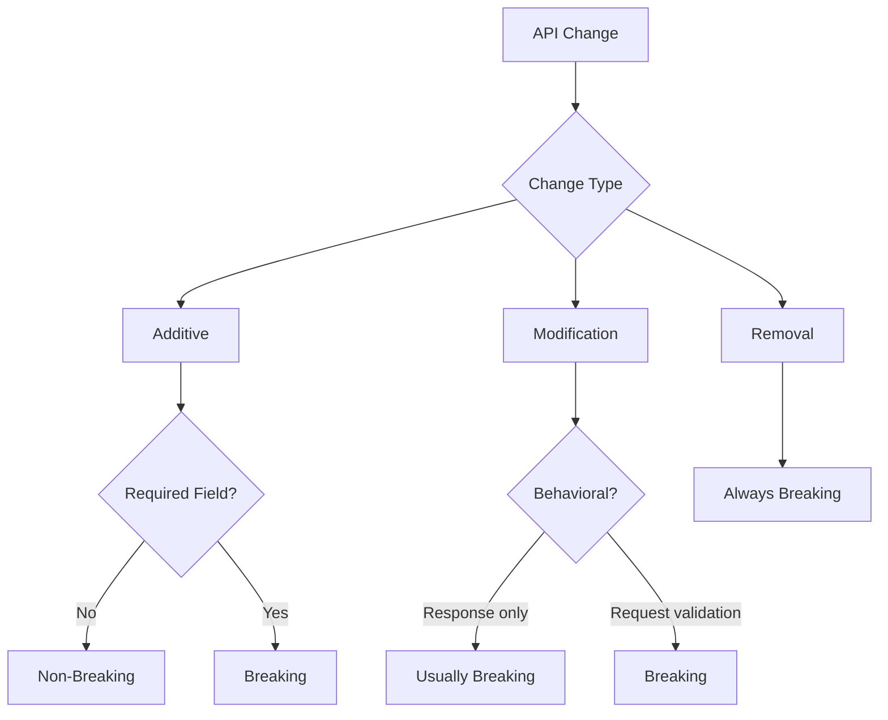
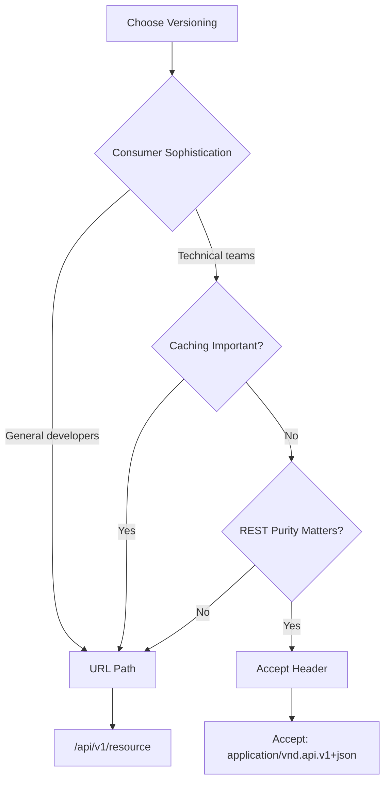
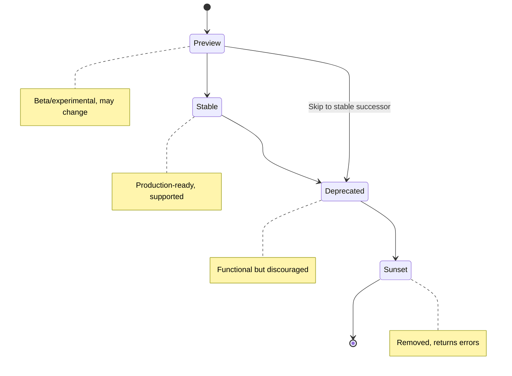
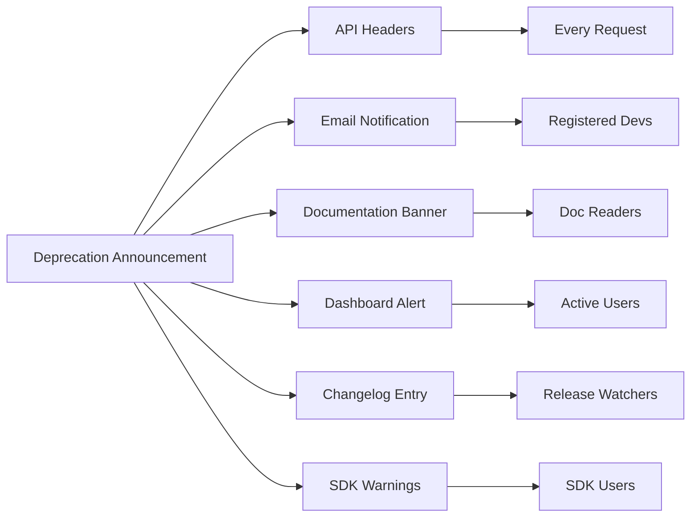
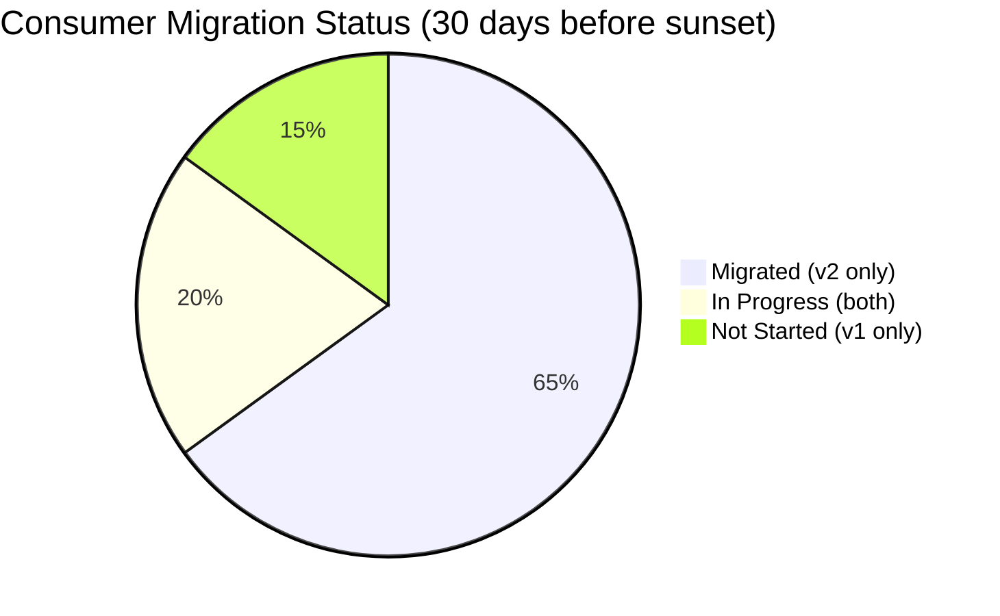
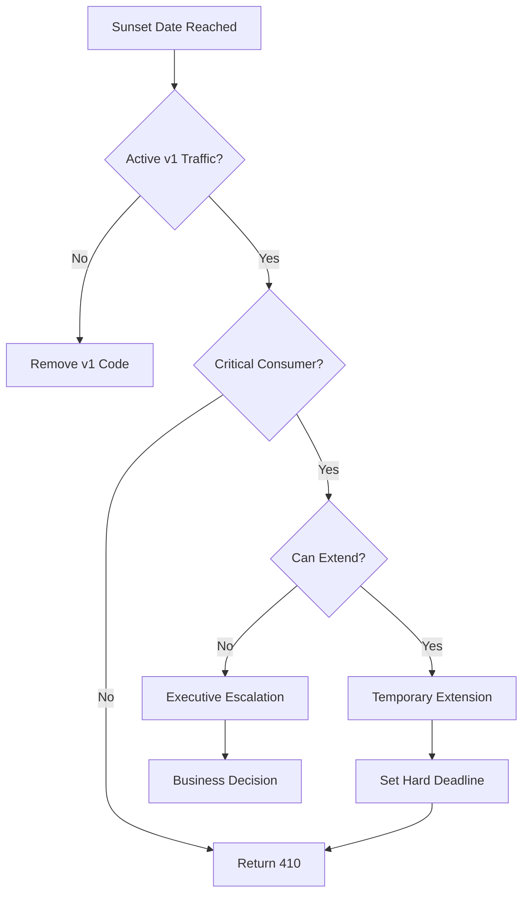

*[API]: Application Programming Interface
*[URL]: Uniform Resource Locator
*[HTTP]: Hypertext Transfer Protocol
*[SDK]: Software Development Kit
*[SemVer]: Semantic Versioning
*[REST]: Representational State Transfer
*[RFC]: Request for Comments
*[JSON]: JavaScript Object Notation

# API Versioning: Deprecation Without Breaking Consumers

## Introduction

Brief overview of the API versioning dilemma: you need to evolve your API to fix mistakes and add capabilities, but every change risks breaking consumers who built against the current contract. This section frames versioning as a balance between API evolution velocity and consumer stability.

_Include a real-world scenario: a team that avoided versioning for years, accumulated technical debt in their API design, and now faces the painful choice between a breaking v2 or living with design mistakes forever._

<Callout type="warning">
Deprecation is a social problem as much as a technical one. The technical mechanics of versioning are straightforward—getting consumers to actually migrate is the hard part.
</Callout>

## Versioning Strategy Fundamentals

### Why Version APIs

Explain the forces that drive API versioning: fixing design mistakes, supporting new use cases, performance improvements that require contract changes, and security fixes that cannot be backward compatible.

| Driver | Example | Versioning Impact |
|--------|---------|-------------------|
| Design Mistakes | Poorly named fields, wrong data types | Breaking change, new version |
| New Capabilities | Additional fields, new endpoints | Usually additive, no version bump |
| Performance | Pagination changes, response restructuring | May require new version |
| Security | Auth scheme changes, field removal | Often requires new version |
| Deprecation | Removing unused endpoints | Requires version after deprecation period |

Table: API change drivers and their versioning implications.

### Breaking vs. Non-Breaking Changes

Define what constitutes a breaking change. Include the gray areas that trip teams up.


Figure: Decision tree for classifying API changes as breaking or non-breaking.

<Callout type="info">
Adding a required field to a request is a breaking change. Adding an optional field is not. This distinction trips up many teams—test your changes against existing client code.
</Callout>

**Non-Breaking Changes:**
- Adding optional request fields
- Adding response fields
- Adding new endpoints
- Adding new enum values (if clients handle unknown values)
- Relaxing validation (accepting more inputs)

**Breaking Changes:**
- Removing fields (request or response)
- Renaming fields
- Changing field types
- Adding required request fields
- Tightening validation (rejecting previously valid inputs)
- Changing response structure
- Changing error formats
- Changing authentication schemes

### The Versioning Spectrum

Compare versioning approaches from no versioning to aggressive versioning, with tradeoffs.

| Approach | Description | Consumer Impact | Maintenance Cost |
|----------|-------------|-----------------|------------------|
| No Versioning | All changes in place | High breakage risk | Low |
| Eternal Compatibility | Never break, only add | Consumer stability | Technical debt |
| Major Versions Only | v1, v2, v3 | Clear migration points | Moderate |
| Date-Based | 2024-01-15, 2024-06-01 | Predictable cadence | Higher |
| Per-Endpoint | Mix of versions | Granular control | Complex |

Table: Versioning approaches with tradeoffs.

## Versioning Mechanisms

### URL Path Versioning

Explain URL-based versioning (`/v1/users`, `/v2/users`) with pros, cons, and implementation patterns.

```http title="url-versioning-examples.http"
# Version in path (most common)
GET /api/v1/users HTTP/1.1
Host: api.example.com

GET /api/v2/users HTTP/1.1
Host: api.example.com

# Version in subdomain (less common)
GET /users HTTP/1.1
Host: v1.api.example.com
```
Code: URL path versioning examples showing path and subdomain approaches.

```yaml title="gateway-url-versioning.yaml"
routes:
  - path: /api/v1/*
    upstream: api-v1-service
    strip_prefix: /api/v1

  - path: /api/v2/*
    upstream: api-v2-service
    strip_prefix: /api/v2

  # Default to latest stable version
  - path: /api/*
    redirect: /api/v2$request_uri
    status: 308
```
Code: API gateway routing configuration for URL path versioning.

**Pros:**
- Explicit and visible in logs/debugging
- Easy to route at load balancer/gateway level
- Cacheable (URL is part of cache key)
- Simple for consumers to understand

**Cons:**
- URL changes for every version
- Hard to version individual endpoints differently
- Looks like a different resource (REST purists object)

### Header-Based Versioning

Detail header-based versioning using `Accept` headers or custom headers.

```http title="header-versioning-examples.http"
# Accept header (content negotiation)
GET /users HTTP/1.1
Host: api.example.com
Accept: application/vnd.example.v2+json

# Custom header
GET /users HTTP/1.1
Host: api.example.com
X-API-Version: 2

# Accept-Version (emerging convention)
GET /users HTTP/1.1
Host: api.example.com
Accept-Version: 2.0
```
Code: Header-based versioning approaches with Accept header and custom headers.

```yaml title="gateway-header-versioning.yaml" {5-12}
routes:
  - path: /api/*
    match:
      headers:
        - name: Accept
          regex: "application/vnd\\.example\\.v1\\+json"
    upstream: api-v1-service

  - path: /api/*
    match:
      headers:
        - name: Accept
          regex: "application/vnd\\.example\\.v2\\+json"
    upstream: api-v2-service

  # Default version when no header specified
  - path: /api/*
    upstream: api-v2-service
```
Code: Gateway configuration for header-based version routing.

**Pros:**
- Clean URLs (same resource, different representation)
- RESTful (content negotiation is REST concept)
- Can version granularly per request

**Cons:**
- Hidden from casual observation
- Harder to test in browser
- Cache key must include headers
- Consumers must configure headers correctly

### Query Parameter Versioning

Explain query parameter versioning (`/users?version=2`) and when it makes sense.

```http title="query-param-versioning.http"
GET /users?api_version=2 HTTP/1.1
Host: api.example.com
```
Code: Query parameter versioning example.

<Callout type="warning">
Query parameter versioning is generally discouraged. It pollutes the URL with meta-information and complicates caching. Use URL path or header versioning instead.
</Callout>

### Choosing a Versioning Strategy

Provide a decision framework for selecting a versioning approach.


Figure: Decision tree for selecting API versioning strategy.

| Factor | URL Path Wins | Header Wins |
|--------|---------------|-------------|
| Consumer technical level | Lower | Higher |
| Debugging ease | ✅ | |
| Caching simplicity | ✅ | |
| REST compliance | | ✅ |
| Granular versioning | | ✅ |
| Browser testability | ✅ | |

Table: Versioning strategy selection factors.

## Version Lifecycle Management

### Defining Version States

Establish clear version states and what each means for consumers.


Figure: API version state machine showing lifecycle transitions.

| State | Support Level | Breaking Changes | Consumer Action |
|-------|---------------|------------------|-----------------|
| Preview | Best effort | May occur | Test only, not production |
| Stable | Full support | None | Safe for production |
| Deprecated | Security only | None | Plan migration |
| Sunset | None | N/A | Must have migrated |

Table: Version states with support levels and consumer expectations.

### Deprecation Timeline Planning

Discuss how to set deprecation timelines based on consumer characteristics.

```yaml title="version-lifecycle-policy.yaml"
version_lifecycle:
  preview:
    minimum_duration: "3 months"
    notice_before_stable: "2 weeks"

  stable:
    minimum_support: "24 months"
    breaking_change_policy: "never"

  deprecated:
    minimum_duration: "12 months"
    notice_channels:
      - changelog
      - email
      - api_headers
      - dashboard_banner
    escalation_schedule:
      - days_before_sunset: 90
        action: "first_warning_email"
      - days_before_sunset: 30
        action: "urgent_warning"
      - days_before_sunset: 7
        action: "final_warning"

  sunset:
    response_code: 410
    response_includes:
      - migration_guide_url
      - successor_version
      - support_contact
```
Code: Version lifecycle policy configuration with timelines and actions.

<Callout type="info">
Enterprise consumers typically need 12+ months deprecation notice due to their release cycles. Internal APIs can use shorter timelines. Know your consumers before setting policy.
</Callout>

### Parallel Version Support

Address the operational cost of running multiple API versions simultaneously.

| Approach | Description | Operational Cost |
|----------|-------------|------------------|
| Code Branching | Separate codebases per version | High (duplicate fixes) |
| Adapter Layer | Transform v1 requests to v2 internally | Medium (maintenance) |
| Feature Flags | Same code, version controls behavior | Low (complexity risk) |
| Separate Services | Independent deployments | High (infrastructure) |

Table: Parallel version support approaches with operational costs.

```typescript title="adapter-pattern-example.ts" {8-22}
// V2 handler (canonical implementation)
async function getUsersV2(params: V2Params): Promise<V2Response> {
  const users = await db.users.find(params);
  return { users, cursor: params.cursor };
}

// V1 adapter (transforms to/from V2)
async function getUsersV1(params: V1Params): Promise<V1Response> {
  // Transform V1 request to V2 format
  const v2Params: V2Params = {
    limit: params.limit,
    cursor: offsetToCursor(params.offset), // V1 used offset pagination
  };

  const v2Response = await getUsersV2(v2Params);

  // Transform V2 response to V1 format
  return {
    data: v2Response.users.map(user => ({
      ...user,
      created: user.createdAt, // V1 used different field name
    })),
    total: await db.users.count(),
    offset: params.offset,
  };
}
```
Code: Adapter pattern maintaining V1 compatibility by transforming to/from V2 internally.

## Sunset Headers and Communication

### RFC 8594 Sunset Header

Detail the Sunset header standard and proper implementation.

```http title="sunset-header-response.http"
HTTP/1.1 200 OK
Content-Type: application/json
Deprecation: true
Deprecation-Date: Mon, 01 Jan 2024 00:00:00 GMT
Sunset: Sat, 01 Jun 2025 00:00:00 GMT
Link: <https://api.example.com/v3/users>; rel="successor-version"
Link: <https://docs.example.com/migration/v2-to-v3>; rel="deprecation"

{
  "users": [...]
}
```
Code: Complete deprecation response headers including Sunset, Deprecation, and Link headers.

### Header Semantics Explained

Clarify the difference between related headers and when to use each.

| Header | Purpose | Format |
|--------|---------|--------|
| `Deprecation` | Signals endpoint is deprecated | `true` or ISO 8601 date |
| `Sunset` | Date when endpoint will stop working | HTTP date (RFC 7231) |
| `Link rel="successor-version"` | URL of replacement endpoint | URL |
| `Link rel="deprecation"` | URL of deprecation information | URL |
| `Warning` | Human-readable deprecation notice | Warning code + text |

Table: Deprecation-related HTTP headers with purposes and formats.

```yaml title="gateway-deprecation-headers.yaml"
routes:
  - path: /api/v1/*
    upstream: api-service
    response_headers:
      Deprecation: "true"
      Sunset: "Sat, 01 Jun 2025 00:00:00 GMT"
      Link: |
        </api/v2/{path}>; rel="successor-version",
        <https://docs.example.com/migration/v1-to-v2>; rel="deprecation"
      Warning: '299 - "API v1 is deprecated. Migrate to v2 by 2025-06-01"'
```
Code: Gateway configuration adding all deprecation-related headers to v1 responses.

### Communicating Through Multiple Channels

Explain why headers alone are not enough and what other channels to use.


Figure: Multi-channel deprecation communication reaching different consumer segments.

| Channel | Reaches | Timing |
|---------|---------|--------|
| API Headers | Active consumers | Every request |
| Email | Registered developers | Announcement + reminders |
| Documentation | New and existing consumers | Continuous |
| Dashboard | Portal users | Continuous |
| Changelog/Blog | Release followers | Announcement |
| SDK | Library users | Compile/runtime |
| Status Page | Operations teams | Major milestones |

Table: Deprecation communication channels with audience and timing.

<Callout type="danger">
Do not rely solely on API headers for deprecation communication. Most consumers do not check response headers. Use email and dashboard notifications to ensure visibility.
</Callout>

## Migration Support

### Migration Guide Structure

Define what a useful migration guide contains.

```markdown title="migration-guide-template.md"
# Migrating from API v1 to v2

## Overview
- **Deprecation date**: January 1, 2024
- **Sunset date**: June 1, 2025
- **Estimated migration effort**: 2-4 hours for typical integration

## Breaking Changes Summary
1. Authentication changed from API key to OAuth 2.0
2. Pagination changed from offset to cursor-based
3. Response envelope removed
4. Several fields renamed for consistency

## Step-by-Step Migration

### Step 1: Update Authentication
**Before (v1):**
```http
GET /v1/users HTTP/1.1
X-API-Key: your-api-key
```

**After (v2):**
```http
GET /v2/users HTTP/1.1
Authorization: Bearer your-access-token
```

`[Detailed OAuth 2.0 setup guide](./oauth-setup.md)`

### Step 2: Update Pagination
...

## Endpoint Mapping
| v1 Endpoint | v2 Endpoint | Notes |
|-------------|-------------|-------|
| GET /v1/users | GET /v2/users | Pagination changed |
| POST /v1/users | POST /v2/users | Request body schema changed |
...

## Field Mapping
| v1 Field | v2 Field | Change |
|----------|----------|--------|
| created | createdAt | Renamed |
| updated | updatedAt | Renamed |
| user_id | id | Renamed |
...

## FAQ
**Q: Can I use both versions during migration?**
A: Yes, both versions will run in parallel until the sunset date.

## Support
- Migration office hours: Thursdays 2-3pm UTC
- Slack channel: #api-migration
- Email: api-support@example.com
```
Code: Migration guide template with all essential sections.

### SDK Migration Support

Discuss how to support SDK users during API version transitions.

```typescript title="sdk-version-migration.ts" {5-13}
// SDK v2.x with v1 compatibility mode
import { ApiClient } from '@example/sdk';

const client = new ApiClient({
  // Enable v1 compatibility during migration
  apiVersion: 'v1', // Default is 'v2'
  onDeprecationWarning: (warning) => {
    console.warn(`[Deprecation] ${warning.message}`);
    console.warn(`Migrate by: ${warning.sunsetDate}`);
    console.warn(`Migration guide: ${warning.migrationUrl}`);
    // Optionally send to logging service
    logger.warn('api_deprecation', warning);
  },
});

// Code works the same, SDK handles version differences
const users = await client.users.list({ limit: 10 });
```
Code: SDK with version compatibility mode and deprecation warning callbacks.

```typescript title="sdk-compile-time-deprecation.ts"
/**
 * @deprecated Use `client.users.list()` instead. Will be removed in SDK v3.0.
 * @see https://docs.example.com/migration/sdk-v2-to-v3
 */
export async function getUsers(
  params: GetUsersParams
): Promise<GetUsersResponse> {
  console.warn(
    '[DEPRECATED] getUsers() is deprecated. Use client.users.list() instead.'
  );
  return client.users.list(params);
}
```
Code: SDK function with JSDoc deprecation annotation and runtime warning.

### Consumer Migration Tracking

Explain how to track which consumers have migrated and which need attention.

```sql title="migration-tracking-query.sql"
-- Consumer migration status dashboard
WITH consumer_usage AS (
  SELECT
    consumer_id,
    api_version,
    COUNT(*) as request_count,
    MAX(timestamp) as last_request
  FROM api_requests
  WHERE timestamp > NOW() - INTERVAL '30 days'
  GROUP BY consumer_id, api_version
)
SELECT
  c.consumer_id,
  c.name,
  c.email,
  COALESCE(v1.request_count, 0) as v1_requests,
  COALESCE(v2.request_count, 0) as v2_requests,
  CASE
    WHEN v1.request_count IS NULL THEN 'Migrated'
    WHEN v2.request_count IS NOT NULL THEN 'In Progress'
    ELSE 'Not Started'
  END as migration_status,
  v1.last_request as last_v1_request
FROM consumers c
LEFT JOIN consumer_usage v1 ON c.consumer_id = v1.consumer_id AND v1.api_version = 'v1'
LEFT JOIN consumer_usage v2 ON c.consumer_id = v2.consumer_id AND v2.api_version = 'v2'
ORDER BY v1.request_count DESC NULLS LAST;
```
Code: SQL query tracking consumer migration status based on API version usage.


Figure: Consumer migration status breakdown showing progress toward sunset date.

## Enforcement and Sunset

### Graduated Enforcement

Detail the escalation from soft deprecation to hard sunset.

| Phase | Behavior | Consumer Impact |
|-------|----------|-----------------|
| Announced | Headers only | None |
| Soft Deprecated | Headers + logging | None |
| Rate Limited | Reduced rate limits for v1 | Performance degradation |
| Read-Only | Write operations disabled | Partial functionality |
| Sunset | 410 Gone for all requests | Complete failure |

Table: Graduated enforcement phases with consumer impact.

```yaml title="graduated-enforcement-config.yaml" {8-24}
versions:
  v1:
    state: deprecated
    sunset_date: "2025-06-01"
    enforcement:
      # Phase 1: Headers only (current)
      - after: "2024-01-01"
        actions:
          - add_deprecation_headers

      # Phase 2: Rate limiting at T-90
      - after: "2025-03-01"
        actions:
          - add_deprecation_headers
          - reduce_rate_limit: 50%

      # Phase 3: Read-only at T-30
      - after: "2025-05-01"
        actions:
          - add_deprecation_headers
          - reduce_rate_limit: 25%
          - block_write_operations

      # Phase 4: Sunset
      - after: "2025-06-01"
        actions:
          - return_410_gone
```
Code: Graduated enforcement configuration with phased restrictions.

### The 410 Gone Response

Explain proper sunset response handling.

```json title="410-response-body.json"
{
  "error": {
    "code": "VERSION_SUNSET",
    "message": "API v1 has been sunset and is no longer available.",
    "sunset_date": "2025-06-01",
    "successor": {
      "version": "v2",
      "base_url": "https://api.example.com/v2",
      "migration_guide": "https://docs.example.com/migration/v1-to-v2"
    },
    "support": {
      "email": "api-support@example.com",
      "documentation": "https://docs.example.com/v2"
    }
  }
}
```
Code: 410 Gone response body with migration information for sunset endpoints.

<Callout type="info">
Keep sunset responses helpful. Even after removal, consumers hitting the old endpoint should get clear guidance on where to go. A generic 404 is frustrating; a 410 with migration links is useful.
</Callout>

### Handling Stragglers

Address what to do when consumers have not migrated by sunset.


Figure: Decision tree for handling consumers who miss the sunset deadline.

<Callout type="warning">
Have an escalation path for critical consumers who cannot meet the deadline. Sunset extensions should be rare and time-bound, but the option must exist for business-critical integrations.
</Callout>

## Operational Considerations

### Version-Aware Monitoring

Discuss how to monitor API health per version.

```yaml title="version-monitoring-alerts.yaml"
alerts:
  - name: V1ErrorRateHigh
    expr: |
      sum(rate(http_requests_total{api_version="v1", status=~"5.."}[5m]))
      /
      sum(rate(http_requests_total{api_version="v1"}[5m]))
      > 0.01
    annotations:
      summary: "API v1 error rate elevated"

  - name: V1TrafficIncreasing
    expr: |
      sum(rate(http_requests_total{api_version="v1"}[1d]))
      >
      sum(rate(http_requests_total{api_version="v1"}[1d] offset 7d)) * 1.1
    annotations:
      summary: "Deprecated v1 traffic increasing (should be declining)"

  - name: V2AdoptionStalled
    expr: |
      sum(rate(http_requests_total{api_version="v2"}[7d]))
      /
      sum(rate(http_requests_total[7d]))
      < 0.8
    for: 7d
    annotations:
      summary: "V2 adoption below 80% after 7 days"
```
Code: Version-specific monitoring alerts for deprecation tracking.

### Documentation Strategy

Explain how to manage documentation across API versions.

| Approach | Description | Maintenance |
|----------|-------------|-------------|
| Versioned Docs | Separate doc sites per version | High |
| Single Site + Selector | One site with version toggle | Medium |
| Combined + Annotations | One doc with version notes | Low |

Table: Documentation strategies for multi-version APIs.

```markdown title="versioned-docs-example.md"
# Get Users

> **Version Availability**
> - v1: Deprecated (sunset 2025-06-01)
> - v2: Current (stable)
> - v3: Preview (beta)

## v2 (Current)

### Request
```http
GET /v2/users?cursor=abc123&limit=20 HTTP/1.1
Authorization: Bearer {token}
```

### Response
```json
{
  "users": [...],
  "nextCursor": "def456"
}
```

## v1 (Deprecated)

<Callout type="warning">
API v1 is deprecated and will be removed on June 1, 2025.
`[Migration guide →](/migration/v1-to-v2)`
</Callout>

### Request
```http
GET /v1/users?offset=0&limit=20 HTTP/1.1
X-API-Key: {api-key}
```
```
Code: Documentation structure showing version availability and deprecation notices.

## Conclusion

Summarize the key principles: choose a versioning strategy that matches your consumers, communicate deprecation through every available channel, provide migration support that actually helps, and enforce sunset dates while having escalation paths for critical cases. Emphasize that successful versioning is about building trust—consumers need to believe you will give them adequate time and support to migrate.

<Callout type="success">
The goal of API versioning is not to avoid change—it is to change at a pace your consumers can follow. Version thoughtfully, communicate relentlessly, and support completely.
</Callout>

