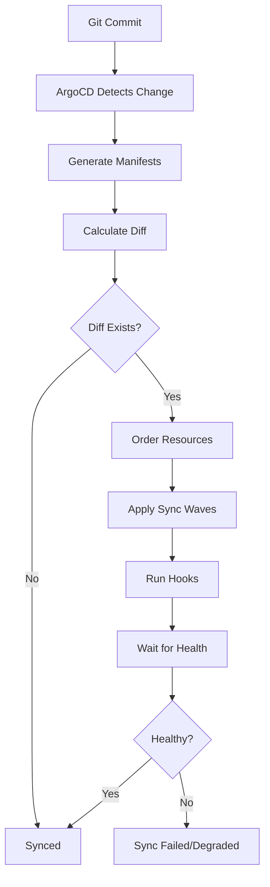
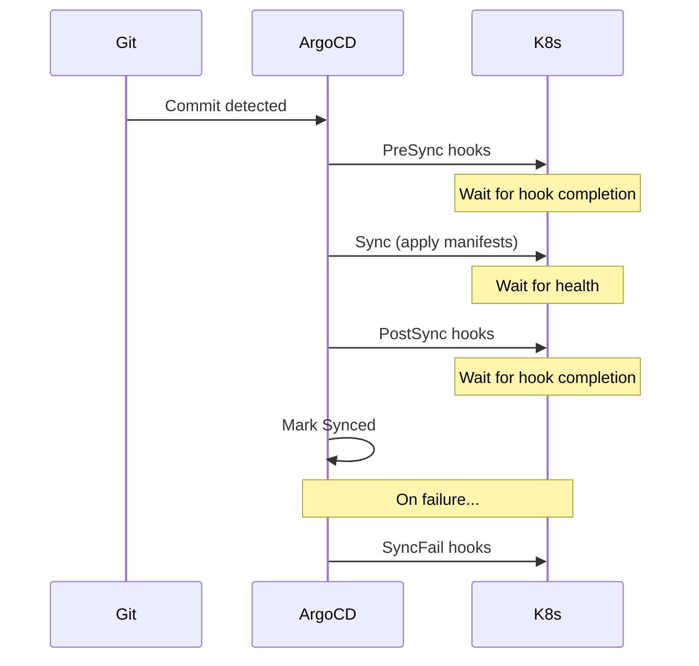
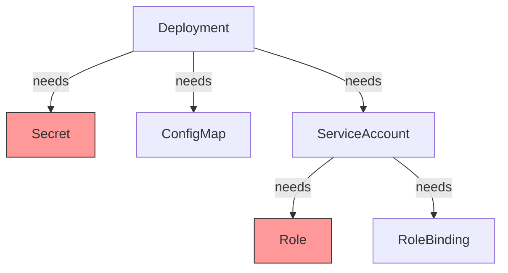
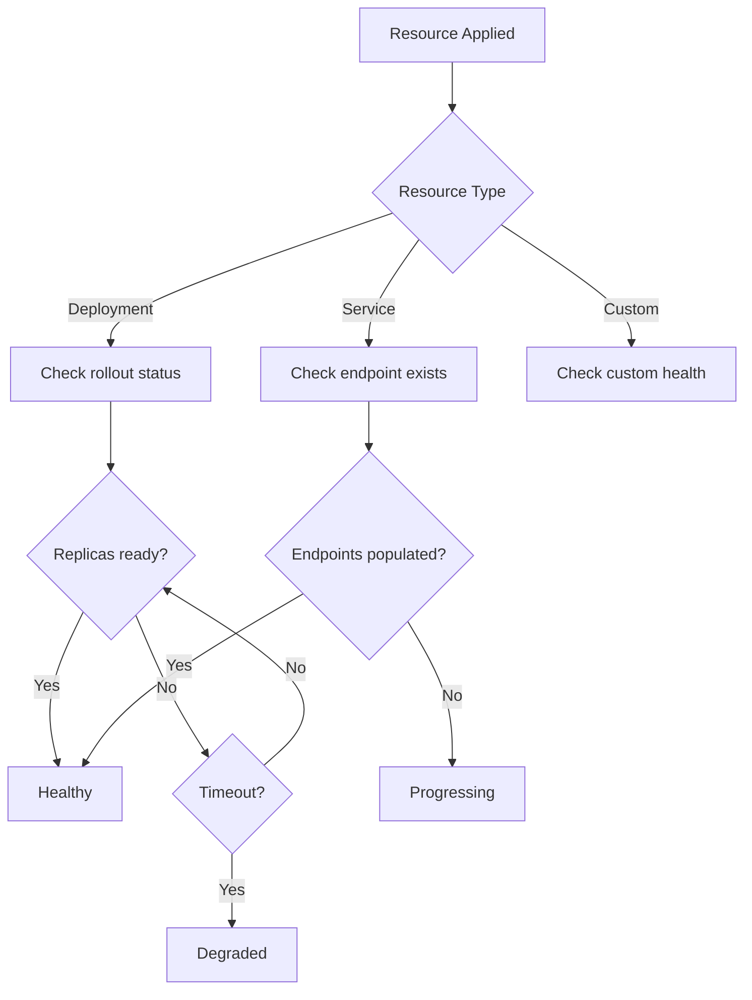
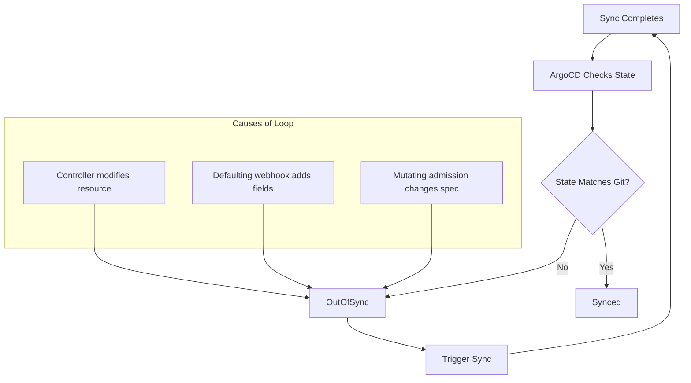

*[GitOps]: Git as single source of truth for declarative infrastructure
*[ArgoCD]: Declarative GitOps continuous delivery tool for Kubernetes
*[CRD]: Custom Resource Definition
*[RBAC]: Role-Based Access Control
*[HPA]: Horizontal Pod Autoscaler
*[PVC]: Persistent Volume Claim
*[YAML]: YAML Ain't Markup Language
*[K8s]: Kubernetes

# GitOps Failure Modes: When ArgoCD Sync Breaks

## Introduction

Brief overview of why ArgoCD sync failures are particularly frustrating: GitOps promises declarative simplicity, but when sync fails, the abstraction breaks down and you are left debugging Kubernetes state machines, resource dependencies, and timing issues that the declarative model was supposed to hide. This section frames the problem as the gap between GitOps theory and operational reality.

_Include a real-world scenario: a deployment that worked in staging but hangs indefinitely in production because of a sync wave ordering issue that only manifests under load._

<Callout type="warning">
GitOps hides complexity until sync fails. When ArgoCD gets stuck, you need to understand what is happening underneath the declarative abstraction to debug it.
</Callout>

## Understanding ArgoCD Sync Mechanics

### The Sync Process Explained

Walk through what actually happens during an ArgoCD sync: manifest generation, diff calculation, resource ordering, apply phases, and health assessment.


Figure: ArgoCD sync process from Git commit to healthy application state.

### Sync Waves and Resource Ordering

Explain how ArgoCD orders resource application and why this matters for dependencies.

```yaml title="sync-wave-annotations.yaml" {5,13,21}
# Wave -1: Secrets and ConfigMaps first
apiVersion: v1
kind: Secret
metadata:
  annotations:
    argocd.argoproj.io/sync-wave: "-1"
  name: app-secrets
---
# Wave 0: Services and deployments (default)
apiVersion: apps/v1
kind: Deployment
metadata:
  annotations:
    argocd.argoproj.io/sync-wave: "0"
  name: app
---
# Wave 1: Post-deployment resources
apiVersion: batch/v1
kind: Job
metadata:
  annotations:
    argocd.argoproj.io/sync-wave: "1"
  name: db-migration
```
Code: Sync wave annotations controlling resource application order.

| Wave | Typical Resources | Purpose |
|------|-------------------|---------|
| -2 | Namespaces, CRDs | Infrastructure prerequisites |
| -1 | Secrets, ConfigMaps | Configuration dependencies |
| 0 | Deployments, Services | Main application (default) |
| 1 | Jobs, migrations | Post-deployment tasks |
| 2 | HPA, PodDisruptionBudgets | Scaling configuration |

Table: Common sync wave ordering pattern for application deployments.

<Callout type="info">
Resources in the same sync wave are applied in parallel. ArgoCD waits for all resources in a wave to be healthy before proceeding to the next wave.
</Callout>

### Sync Hooks Explained

Detail the different hook types and when each executes.


Figure: Hook execution sequence during ArgoCD sync lifecycle.

| Hook Type | When It Runs | Use Case |
|-----------|--------------|----------|
| PreSync | Before any manifests applied | Database backups, pre-flight checks |
| Sync | During normal sync | Rarely used (default behavior) |
| PostSync | After all manifests healthy | Notifications, smoke tests |
| SyncFail | When sync fails | Cleanup, alerting |
| Skip | Never (resource skipped) | Templates, documentation |

Table: ArgoCD hook types with execution timing and use cases.

```yaml title="hook-example.yaml" {6-8}
apiVersion: batch/v1
kind: Job
metadata:
  name: db-migration
  annotations:
    argocd.argoproj.io/hook: PreSync
    argocd.argoproj.io/hook-delete-policy: HookSucceeded
    argocd.argoproj.io/sync-wave: "-1"
spec:
  template:
    spec:
      containers:
        - name: migrate
          image: app:latest
          command: ["./migrate.sh"]
      restartPolicy: Never
  backoffLimit: 3
```
Code: PreSync hook for database migration with cleanup policy.

## Common Sync Failure Categories

### Resource Dependency Failures

Explain failures caused by missing or misconfigured dependencies between resources.


Figure: Resource dependency graph showing potential failure points (red = missing).

**Common Symptoms:**
- Pod stuck in `CreateContainerConfigError`
- `secret "x" not found` errors
- `serviceaccount "x" not found` errors

```bash title="debug-dependency-failure.sh"
# Check what secrets a deployment needs
kubectl get deployment app -o jsonpath='{.spec.template.spec.containers[*].envFrom[*].secretRef.name}'

# Check if secret exists
kubectl get secret app-secrets

# Check ArgoCD resource status
argocd app get myapp --show-operation

# Check events for failed pods
kubectl get events --field-selector reason=Failed --sort-by='.lastTimestamp'
```
Code: Commands for debugging resource dependency failures.

<Callout type="danger">
ArgoCD's default sync does not guarantee ordering between resources in the same wave. If resource A depends on resource B and both are in wave 0, the sync may fail randomly depending on apply order.
</Callout>

### Hook Failures

Detail common hook failure scenarios and debugging approaches.

| Failure Mode | Symptom | Cause |
|--------------|---------|-------|
| Hook timeout | Sync stuck at "Running PreSync hooks" | Hook job takes too long |
| Hook crash | Sync failed, hook pod in CrashLoopBackOff | Bug in hook script |
| Hook not deleted | Old hook blocks new sync | Missing delete policy |
| Hook wrong phase | Resources applied before prerequisites | Wrong hook type |

Table: Common hook failure modes with symptoms and causes.

```yaml title="hook-timeout-fix.yaml" {7-8}
apiVersion: batch/v1
kind: Job
metadata:
  name: slow-migration
  annotations:
    argocd.argoproj.io/hook: PreSync
    # Extend timeout for long-running hooks
    argocd.argoproj.io/sync-wave: "-1"
spec:
  activeDeadlineSeconds: 600  # 10 minute timeout
  template:
    spec:
      containers:
        - name: migrate
          image: app:latest
          command: ["./long-migration.sh"]
      restartPolicy: Never
```
Code: Hook configuration with extended timeout for long-running operations.

### Health Check Failures

Explain how ArgoCD determines resource health and why health checks fail.


Figure: ArgoCD health assessment flow for different resource types.

```lua title="custom-health-check.lua"
-- Custom health check for a CRD
-- Place in argocd-cm ConfigMap under resource.customizations.health
hs = {}
hs.status = "Progressing"
hs.message = ""

if obj.status ~= nil then
  if obj.status.phase == "Ready" then
    hs.status = "Healthy"
    hs.message = "Resource is ready"
  elseif obj.status.phase == "Failed" then
    hs.status = "Degraded"
    hs.message = obj.status.message or "Resource failed"
  else
    hs.status = "Progressing"
    hs.message = "Waiting for resource to be ready"
  end
end

return hs
```
Code: Custom Lua health check for CRDs that ArgoCD does not know how to assess.

### Diff/Drift Detection Issues

Address false positives in diff detection that cause perpetual "OutOfSync" states.

```yaml title="ignore-differences.yaml"
apiVersion: argoproj.io/v1alpha1
kind: Application
metadata:
  name: myapp
spec:
  ignoreDifferences:
    # Ignore fields managed by controllers
    - group: apps
      kind: Deployment
      jsonPointers:
        - /spec/replicas  # Managed by HPA
    # Ignore cluster-specific annotations
    - group: ""
      kind: Service
      jsonPointers:
        - /metadata/annotations/cloud.google.com~1neg-status
    # Ignore all managedFields (Kubernetes internal)
    - group: "*"
      kind: "*"
      managedFieldsManagers:
        - kube-controller-manager
```
Code: Application-level ignoreDifferences configuration for expected drift.

<Callout type="info">
If a resource shows OutOfSync but the diff looks identical, check for whitespace differences, field ordering, or default values that Kubernetes adds but your manifests do not include.
</Callout>

## Debugging Workflow

### Step 1: Identify the Failure Point

Start with high-level status, then drill down to specific resources.

```bash title="debug-step-1.sh"
# Get application status overview
argocd app get myapp

# Get detailed sync status
argocd app get myapp --show-operation

# List resources with their sync/health status
argocd app resources myapp

# Get specific resource status
argocd app resources myapp --kind Deployment --name app
```
Code: Commands for identifying where in the sync process failure occurred.

### Step 2: Examine ArgoCD Logs

Detail where to find relevant logs for different failure types.

```bash title="debug-step-2.sh"
# ArgoCD application controller logs (sync decisions)
kubectl logs -n argocd -l app.kubernetes.io/name=argocd-application-controller -f

# ArgoCD repo server logs (manifest generation)
kubectl logs -n argocd -l app.kubernetes.io/name=argocd-repo-server -f

# ArgoCD server logs (API/UI issues)
kubectl logs -n argocd -l app.kubernetes.io/name=argocd-server -f

# Filter for specific application
kubectl logs -n argocd -l app.kubernetes.io/name=argocd-application-controller | grep "myapp"
```
Code: ArgoCD component logs for different failure types.

| Component | Log Location | Failure Types |
|-----------|--------------|---------------|
| application-controller | Controller pod | Sync decisions, health checks |
| repo-server | Repo server pod | Manifest generation, Helm/Kustomize |
| server | Server pod | API errors, authentication |
| redis | Redis pod | Caching issues, state corruption |

Table: ArgoCD components and their log relevance.

### Step 3: Inspect Kubernetes State

Check the actual cluster state when ArgoCD reports problems.

```bash title="debug-step-3.sh"
# Check deployment rollout status
kubectl rollout status deployment/app -n myapp

# Describe deployment for events
kubectl describe deployment app -n myapp

# Check pod status and events
kubectl get pods -n myapp
kubectl describe pod -n myapp -l app=myapp

# Check recent events in namespace
kubectl get events -n myapp --sort-by='.lastTimestamp' | tail -20

# Check resource quotas if pods pending
kubectl describe resourcequota -n myapp
```
Code: Kubernetes commands for inspecting actual cluster state during sync failures.

### Step 4: Reproduce and Fix

Provide strategies for reproducing sync issues and validating fixes.

```bash title="debug-step-4.sh"
# Dry-run sync to see what would happen
argocd app sync myapp --dry-run

# Sync with increased verbosity
argocd app sync myapp --loglevel debug

# Force sync (skip pruning safety)
argocd app sync myapp --force

# Sync specific resources only
argocd app sync myapp --resource apps:Deployment:app

# Hard refresh (clear cache, re-fetch from Git)
argocd app get myapp --hard-refresh
```
Code: Commands for reproducing and testing sync fixes.

## Specific Failure Scenarios

### Scenario: Sync Stuck on Hook

Walk through debugging a sync that hangs waiting for a hook.

```markdown title="hook-stuck-runbook.md"
# Runbook: Sync Stuck on Hook

## Symptoms
- Sync status shows "Running PreSync hooks" or "Running PostSync hooks"
- Sync has been in this state for longer than expected

## Diagnosis

1. Identify the stuck hook:
```bash
kubectl get jobs -n myapp -l argocd.argoproj.io/hook
```

2. Check hook job status:
```bash
kubectl describe job <hook-job-name> -n myapp
```

3. Check hook pod logs:
```bash
kubectl logs -n myapp -l job-name=<hook-job-name>
```

## Common Causes

| Cause | Fix |
|-------|-----|
| Hook script error | Fix script, redeploy |
| Missing permissions | Add RBAC for hook ServiceAccount |
| Image pull failure | Check image name and pull secret |
| Resource limits | Increase memory/CPU limits |
| External dependency | Ensure dependency is available |

## Resolution

1. If hook can be safely skipped:
```bash
argocd app sync myapp --prune --force
```

2. If hook needs to complete:
- Fix the underlying issue
- Delete the stuck job
- Trigger new sync

3. To prevent recurrence:
- Add `activeDeadlineSeconds` to job spec
- Add proper health checks to hook
- Consider using `hook-delete-policy: BeforeHookCreation`
```
Code: Runbook for debugging sync stuck on hook execution.

### Scenario: OutOfSync Loop

Debug applications that sync successfully but immediately show OutOfSync again.


Figure: OutOfSync loop caused by external modifications to resources.

```yaml title="outofsync-diagnosis.yaml"
# Check what ArgoCD sees as different
# Run: argocd app diff myapp

# Example diff output showing HPA modifying replicas:
# --- /apps/v1/Deployment/myapp/app
# +++ live
# @@ -15,7 +15,7 @@
#    spec:
# -    replicas: 3
# +    replicas: 5  # Modified by HPA

# Solution: Add to Application spec
spec:
  ignoreDifferences:
    - group: apps
      kind: Deployment
      jsonPointers:
        - /spec/replicas
```
Code: Diagnosing and fixing OutOfSync loop caused by HPA replica management.

<Callout type="warning">
Never ignore differences on fields that represent actual drift you care about. Only ignore fields that are legitimately managed by other controllers (HPA replicas, cert-manager annotations, etc.).
</Callout>

### Scenario: CRD Sync Order Problem

Address the chicken-and-egg problem of CRDs and their instances.

```yaml title="crd-ordering.yaml" {5-6,16-17}
# CRD definition - must be in earlier sync wave
apiVersion: apiextensions.k8s.io/v1
kind: CustomResourceDefinition
metadata:
  annotations:
    argocd.argoproj.io/sync-wave: "-5"
    argocd.argoproj.io/sync-options: SkipDryRunOnMissingResource=true
  name: myresources.example.com
spec:
  # ... CRD spec
---
# CRD instance - must wait for CRD to exist
apiVersion: example.com/v1
kind: MyResource
metadata:
  annotations:
    argocd.argoproj.io/sync-wave: "0"
  name: my-instance
spec:
  # ... instance spec
```
Code: CRD and instance ordering with sync waves to prevent race condition.

### Scenario: Resource Pruning Gone Wrong

Debug issues where ArgoCD prunes resources unexpectedly.

```yaml title="prune-protection.yaml" {5-6}
# Protect critical resources from pruning
apiVersion: v1
kind: Secret
metadata:
  annotations:
    argocd.argoproj.io/sync-options: Prune=false
  name: critical-secret
---
# Application-level prune settings
apiVersion: argoproj.io/v1alpha1
kind: Application
spec:
  syncPolicy:
    automated:
      prune: true
      selfHeal: true
    syncOptions:
      # Don't prune if sync fails
      - PrunePropagationPolicy=foreground
      # Require manual prune for certain resources
      - PruneLast=true
```
Code: Prune protection for critical resources and safe prune policies.

| Sync Option | Effect |
|-------------|--------|
| `Prune=false` | Never prune this resource |
| `PruneLast=true` | Prune after all other resources synced |
| `PrunePropagationPolicy=foreground` | Wait for dependents before pruning |
| `ApplyOutOfSyncOnly=true` | Only apply resources that differ |

Table: ArgoCD sync options affecting prune behavior.

## Prevention Strategies

### Manifest Validation

Implement pre-commit validation to catch issues before they reach ArgoCD.

```yaml title="github-action-validation.yaml"
name: Validate Manifests
on: [pull_request]

jobs:
  validate:
    runs-on: ubuntu-latest
    steps:
      - uses: actions/checkout@v4

      - name: Install tools
        run: |
          curl -LO https://github.com/instrumenta/kubeval/releases/latest/download/kubeval-linux-amd64.tar.gz
          tar xf kubeval-linux-amd64.tar.gz
          sudo mv kubeval /usr/local/bin/

      - name: Validate YAML syntax
        run: |
          find . -name '*.yaml' -exec yamllint {} \;

      - name: Validate Kubernetes schemas
        run: |
          kubeval --strict manifests/**/*.yaml

      - name: Dry-run against cluster
        run: |
          argocd app diff myapp --local ./manifests --exit-code
```
Code: CI pipeline for manifest validation before merge.

### Sync Windows

Configure sync windows to prevent changes during sensitive periods.

```yaml title="sync-windows.yaml"
apiVersion: argoproj.io/v1alpha1
kind: AppProject
metadata:
  name: production
spec:
  syncWindows:
    # Allow syncs only during business hours
    - kind: allow
      schedule: "0 9 * * 1-5"  # 9 AM weekdays
      duration: 8h
      applications:
        - "*"
    # Block syncs during peak traffic
    - kind: deny
      schedule: "0 12 * * *"  # Noon daily
      duration: 2h
      applications:
        - "critical-*"
    # Allow manual syncs anytime for emergencies
    - kind: allow
      schedule: "* * * * *"
      duration: 24h
      manualSync: true
```
Code: Sync window configuration restricting automated deployments to safe periods.

### Monitoring and Alerting

Set up alerts for sync failures before they become incidents.

```yaml title="argocd-alerts.yaml"
groups:
  - name: argocd
    rules:
      - alert: ArgoCDSyncFailed
        expr: |
          argocd_app_info{sync_status="OutOfSync"} == 1
          and
          argocd_app_info{health_status!="Healthy"} == 1
        for: 10m
        labels:
          severity: warning
        annotations:
          summary: "ArgoCD app {{ $labels.name }} sync failed"
          runbook: "https://wiki/runbooks/argocd-sync-failed"

      - alert: ArgoCDSyncStuck
        expr: |
          time() - argocd_app_info{sync_status="Syncing"} > 1800
        labels:
          severity: critical
        annotations:
          summary: "ArgoCD app {{ $labels.name }} sync stuck for 30+ minutes"

      - alert: ArgoCDAppDegraded
        expr: |
          argocd_app_info{health_status="Degraded"} == 1
        for: 5m
        labels:
          severity: critical
        annotations:
          summary: "ArgoCD app {{ $labels.name }} is degraded"
```
Code: Prometheus alerting rules for ArgoCD sync failures.

<Callout type="success">
Alert on sync failures early. A 10-minute OutOfSync alert gives you time to investigate before users notice. A 30-minute stuck sync is almost always a real problem requiring intervention.
</Callout>

## Advanced Troubleshooting

### Resource Tracking Methods

Explain ArgoCD's resource tracking and when to change methods.

| Method | How It Works | When to Use |
|--------|--------------|-------------|
| label | Adds ArgoCD label to resources | Default, simple apps |
| annotation | Adds ArgoCD annotation | When labels cause issues |
| annotation+label | Both | Migration between methods |

Table: ArgoCD resource tracking methods.

```yaml title="tracking-method.yaml"
apiVersion: argoproj.io/v1alpha1
kind: Application
metadata:
  name: myapp
spec:
  syncPolicy:
    syncOptions:
      # Use annotation tracking if labels interfere with selectors
      - ServerSideApply=true
      - RespectIgnoreDifferences=true
```
Code: Application configuration using server-side apply for complex resources.

### Debugging Manifest Generation

Troubleshoot Helm and Kustomize rendering issues.

```bash title="debug-manifest-generation.sh"
# See what ArgoCD generates from your repo
argocd app manifests myapp

# Compare local vs remote generation
argocd app diff myapp --local ./path/to/manifests

# For Helm apps, check values resolution
argocd app get myapp -o yaml | grep -A 50 'helm:'

# Test Helm template locally
helm template myapp ./chart -f values.yaml -f values-prod.yaml

# Test Kustomize locally
kustomize build ./overlays/production

# Check repo-server can access the repo
kubectl exec -n argocd deploy/argocd-repo-server -- \
  ls /tmp/<repo-hash>/
```
Code: Commands for debugging manifest generation from Helm and Kustomize.

### Recovering from Corrupt State

Handle scenarios where ArgoCD state becomes inconsistent.

```bash title="recovery-commands.sh"
# Force refresh application state from Git
argocd app get myapp --hard-refresh

# Delete and recreate application (preserves resources)
argocd app delete myapp --cascade=false
argocd app create myapp --repo ... --path ... --dest-server ...

# Clear ArgoCD Redis cache
kubectl delete pod -n argocd -l app.kubernetes.io/name=argocd-redis

# Restart application controller to clear in-memory state
kubectl rollout restart deployment -n argocd argocd-application-controller
```
Code: Recovery commands for ArgoCD state corruption scenarios.

<Callout type="danger">
The `--cascade=false` flag is critical when deleting an application for recovery. Without it, ArgoCD will delete all the Kubernetes resources the application manages.
</Callout>

## Conclusion

Summarize the key debugging principles: start with ArgoCD status, check sync waves and hooks, examine Kubernetes state, and understand the resource dependency graph. Emphasize that GitOps simplifies the happy path but requires understanding the underlying mechanics when things fail.

<Callout type="success">
GitOps is not magic—it is automation. When the automation fails, you need to understand what it was trying to do. Master the sync process, and debugging becomes systematic rather than frustrating.
</Callout>

---

## Cover Prompt

### Prompt 1: Broken Sync Chain

Create a visualization of a sync process as a chain of connected gears. Most gears are turning smoothly (green glow), but one gear is jammed/broken (red glow, sparks), causing downstream gears to stop. Labels on gears show sync phases (PreSync, Sync, PostSync). Style: mechanical/industrial illustration, dark background with metallic textures, dramatic lighting on the broken gear, 16:9 aspect ratio.

### Prompt 2: GitOps Pipeline Obstruction

Illustrate a pipeline carrying Git commits (represented as glowing packages) toward a Kubernetes cluster. The pipeline has a blockage/obstruction point where packages are backing up. A diagnostic panel shows error messages. Style: pipeline/plumbing visualization, tech-industrial aesthetic, blue-green color scheme with red warning indicators, cross-section view, 16:9 aspect ratio.

### Prompt 3: Dependency Graph Tangle

Design an abstract visualization of a resource dependency graph with some nodes connected properly (green lines) and others with broken/missing connections (red dashed lines). The tangled center represents the complexity hidden by GitOps. Style: network graph visualization, dark background, nodes as glowing orbs, connection lines with varying opacity, 16:9 aspect ratio.

### Prompt 4: ArgoCD Dashboard Warning State

Create a stylized ArgoCD-inspired dashboard interface showing an application in degraded state. Multiple sync waves displayed as horizontal tracks, with one track showing a stuck/failed resource. Warning indicators and error messages visible. Style: UI/dashboard illustration, dark mode interface, status indicator colors (red, yellow, green), modern DevOps aesthetic, 16:9 aspect ratio.

### Prompt 5: Debugging Detective Scene

Illustrate a detective/investigator silhouette examining a complex Kubernetes cluster diagram with a magnifying glass. The magnifying glass reveals hidden sync issues within the cluster. Clues (log snippets, error codes) scattered around. Style: noir detective meets tech, dramatic shadows, blue and amber accent lighting, investigative atmosphere, 16:9 aspect ratio.
