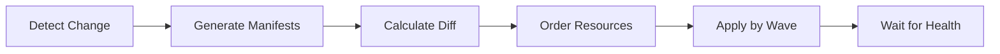

*[GitOps]: Git as single source of truth for declarative infrastructure
*[ArgoCD]: Declarative GitOps continuous delivery tool for Kubernetes
*[CRD]: Custom Resource Definition
*[HPA]: Horizontal Pod Autoscaler

import Callout from '@components/Callout/index.astro'

GitOps sells you on declarative simplicity: define your desired state in Git, and ArgoCD makes it so. The pitch works beautifully in demos. In production, you'll eventually stare at a sync that's been "Progressing" for 20 minutes, wondering what's actually happening inside the black box.

I hit this during a production deployment that had worked flawlessly in staging for months. The sync started normally, applied the first few resources, then stopped. No error. No timeout. Just... stuck. Manual `kubectl apply` worked fine—it only hung when deployed through ArgoCD.

The root cause was a sync wave ordering issue. A PreSync hook was waiting for a service that wouldn't exist until wave 0, but the hook was in wave -1. In staging, the service happened to exist from a previous deployment. In production, we'd just created the namespace. The dependency was always broken—we just never noticed.

This is the gap between GitOps theory and operational reality. When sync fails, you need to understand what ArgoCD is actually doing underneath the abstraction.

## What ArgoCD Is Actually Doing

Before debugging, you need a mental model of the sync process. When you push a commit or click "Sync," ArgoCD kicks off a multi-phase process:


Figure: ArgoCD sync process from Git commit to healthy application.

First, ArgoCD detects the change through polling or webhooks. It generates manifests (running Helm template or Kustomize build if needed), calculates the diff against live cluster state, orders resources by sync wave, applies them wave by wave, and waits for each to become healthy before proceeding.

### Sync Waves Control Ordering

Kubernetes doesn't guarantee resource creation order. Sync waves give you explicit control—each resource can have an `argocd.argoproj.io/sync-wave` annotation with an integer value. Lower numbers go first:

```yaml title="manifests/app/resources.yaml"
# Sync wave annotations control resource ordering.
# Lower numbers apply first; default is wave 0.

apiVersion: v1
kind: Secret
metadata:
  annotations:
    argocd.argoproj.io/sync-wave: "-1"
  name: app-secrets
---
apiVersion: apps/v1
kind: Deployment
metadata:
  annotations:
    argocd.argoproj.io/sync-wave: "0"
  name: app
```
Code: Sync wave annotations ensuring Secret exists before Deployment.

Resources in the same wave apply in parallel. ArgoCD waits for all resources in a wave to be healthy before moving to the next. If your Deployment in wave 0 references that Secret, you're guaranteed it exists.

The wave numbers themselves are arbitrary—what matters is the relative order. Here's a pattern that works for most applications:

| Wave | Typical Resources | Purpose |
|------|-------------------|---------|
| -2 | Namespaces, CRDs | Infrastructure prerequisites |
| -1 | Secrets, ConfigMaps | Configuration dependencies |
| 0 | Deployments, Services | Main application (default) |
| 1 | Jobs, migrations | Post-deployment tasks |

Table: Common sync wave ordering pattern.

### Hooks Run Outside Normal Sync

Sync waves control ordering _within_ the apply phase. But what if you need to run something _before_ sync starts, or _after_ it completes?

Hooks let you run resources _outside_ the normal apply process—before sync starts (PreSync), after it completes (PostSync), or when it fails (SyncFail). The most common use case is database migrations: run them after new code deploys but before traffic shifts.

Hooks are typically Kubernetes Jobs. The critical thing to understand: ArgoCD waits for hooks to complete before proceeding. If a hook hangs, your entire sync hangs—with no timeout by default.

<Callout type="warning">
Always set `activeDeadlineSeconds` on hook Jobs. Without it, ArgoCD will wait forever for a stuck hook.
</Callout>

## The Four-Step Debugging Workflow

When sync fails, resist the urge to poke at random things. A systematic approach gets you to the root cause faster.

### Step 1: Identify the Failure Point

Start broad and narrow down:

```bash title="debug-argocd-sync.sh"
# Get application status overview
argocd app get myapp

# Get detailed sync operation status
argocd app get myapp --show-operation

# List resources with sync/health status
argocd app resources myapp
```
Code: Commands for identifying where sync failed.

The output tells you sync status (Synced, OutOfSync, Unknown) and health status (Healthy, Progressing, Degraded). The combination reveals the problem category:

- **OutOfSync + Healthy**: Drift problem—something's modifying the resource after ArgoCD applies it
- **Degraded**: Something failed to start—check pod events
- **Progressing for a long time**: Something's stuck—likely a hook or slow rollout

The `--show-operation` flag shows which phase the sync is in. "Running PreSync hooks" means a hook is stuck. "Sync error" with a message means apply failed.

### Step 2: Examine ArgoCD Logs

ArgoCD has several components, each handling different parts:

```bash title="check-argocd-logs.sh"
# Application controller logs (sync decisions, health checks)
kubectl logs -n argocd -l app.kubernetes.io/name=argocd-application-controller | grep "myapp"

# Repo server logs (manifest generation, Helm/Kustomize)
kubectl logs -n argocd -l app.kubernetes.io/name=argocd-repo-server | grep "myapp"
```
Code: ArgoCD component logs for different failure types.

Most sync failures show up in application-controller logs. If you're seeing "manifest generation failed" or Helm/Kustomize errors, check repo-server instead.

### Step 3: Inspect Kubernetes State

ArgoCD reports what Kubernetes tells it. Verify what's actually happening:

```bash title="inspect-kubernetes-state.sh"
# Check pod status and events
kubectl get pods -n myapp
kubectl describe pod -n myapp -l app=myapp

# Check recent events
kubectl get events -n myapp --sort-by='.lastTimestamp' | tail -20
```
Code: Kubernetes commands for inspecting actual cluster state.

The `kubectl describe` Events section is often the most useful—it shows why pods failed to schedule, failed to pull images, or failed to start. Common culprits: image pull failures, resource quota exceeded, missing secrets.

### Step 4: Test Your Fix

ArgoCD provides options for testing before committing:

```bash title="test-argocd-fix.sh"
# Dry-run to see what would happen
argocd app sync myapp --dry-run

# Hard refresh to clear stale cache
argocd app get myapp --hard-refresh

# Sync specific resource only
argocd app sync myapp --resource apps:Deployment:app
```
Code: Commands for testing sync fixes safely.

Use `--dry-run` to verify your fix before applying. Use `--hard-refresh` when ArgoCD seems to be showing stale state. Use `--resource` to test a single resource without re-syncing everything.

## Recognizing Common Failure Patterns

Once you've gathered information, match it against these common patterns:

| Pattern | Symptom | Likely Cause | Quick Fix |
|---------|---------|--------------|-----------|
| Stuck on hook | "Running PreSync hooks" forever | Hook Job not completing | Check job logs, add `activeDeadlineSeconds` |
| OutOfSync loop | Syncs successfully, immediately OutOfSync | Controller modifying resource | Add `ignoreDifferences` for that field |
| Missing resource | "secret X not found" | Dependency ordering | Move dependency to earlier sync wave |
| CRD not found | "server doesn't have resource type" | CRD applied too late | Put CRD in wave -5 |

Table: Common ArgoCD sync failure patterns with quick fixes.

The "stuck on hook" pattern connects directly to the intro story—my production incident was exactly this. The hook was waiting for a dependency that didn't exist yet. Once you know to check hook job logs with `kubectl logs -l job-name=<hook>`, the cause usually becomes obvious.

The OutOfSync loop deserves special mention because it can be maddening. You sync, it completes, and five seconds later it's OutOfSync again. The cause is always something modifying the resource after ArgoCD applies it. The most common culprit is HPA changing replica counts. Use `argocd app diff myapp` to see exactly which fields are changing, then add them to `ignoreDifferences` in your Application spec.

<Callout type="info">
If a resource shows OutOfSync but the diff looks identical, check for whitespace differences, field ordering, or default values that Kubernetes adds but your manifests don't include.
</Callout>

## Conclusion

ArgoCD sync failures are frustrating because they break the promise of GitOps: you pushed to Git, so it should just work. But that frustration fades once you understand what's happening beneath the abstraction.

The workflow covered here gives you a systematic approach: identify _what_ failed by checking ArgoCD status, understand _when_ it failed by examining sync waves and hooks, verify _why_ it failed by inspecting Kubernetes state, and test your fix before committing. Most failures fall into a few recognizable categories—once you identify the pattern, the fix is usually straightforward.

What makes this workflow valuable isn't memorizing every edge case. It's building a mental model of what ArgoCD is actually doing during sync. When you understand that sync waves control ordering, that hooks block until completion, and that health checks determine when ArgoCD considers a resource "ready," you can reason about failures even when they don't match a known pattern.

GitOps isn't magic—it's automation. When the automation fails, you need to understand what it was trying to do. The declarative model abstracts away the _how_ of deployment, which is powerful until something goes wrong. Then the abstraction becomes the obstacle. The debugging skills in this article help you see through it.

---

**CTA Title:** Go Deeper: The Complete ArgoCD Troubleshooting Guide

**CTA Body:** This article covers the essential debugging workflow, but production incidents often require more. The complete guide includes detailed runbooks for specific failure scenarios (stuck hooks, CRD ordering, pruning accidents), prevention strategies (CI validation, sync windows, alerting configuration), and advanced recovery techniques for when ArgoCD state becomes corrupted. Download the PDF to have a comprehensive reference ready for your next sync failure.
