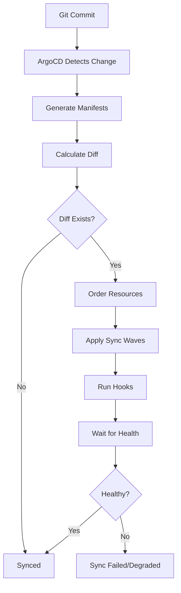
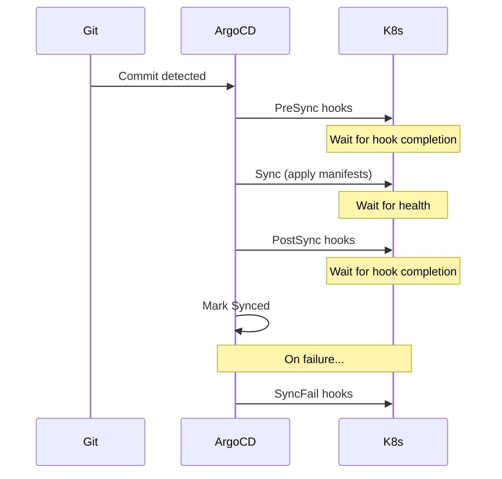
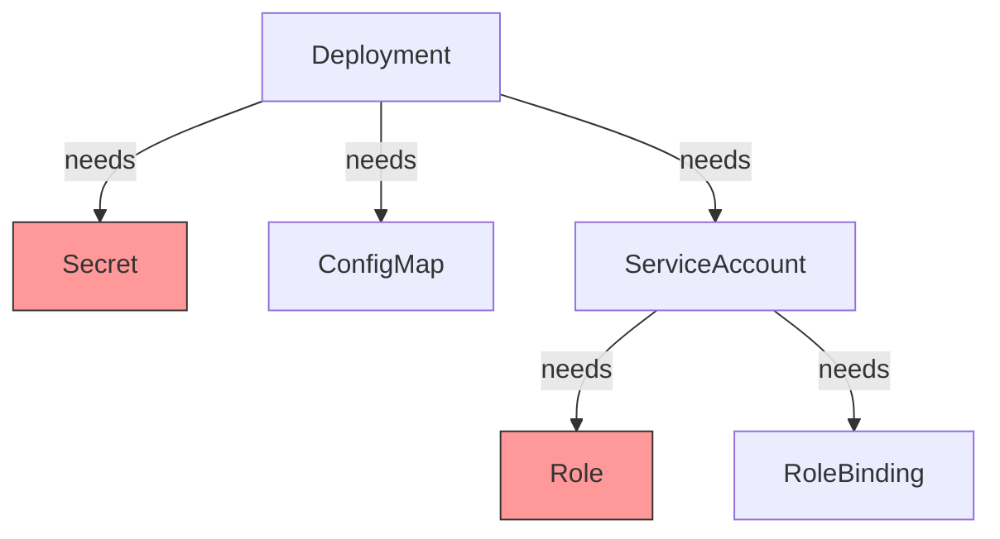
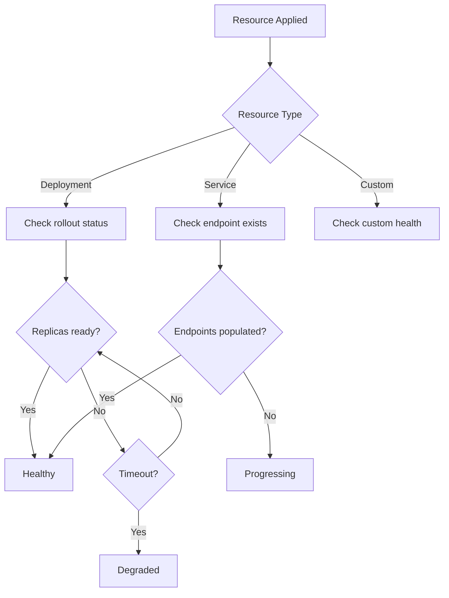
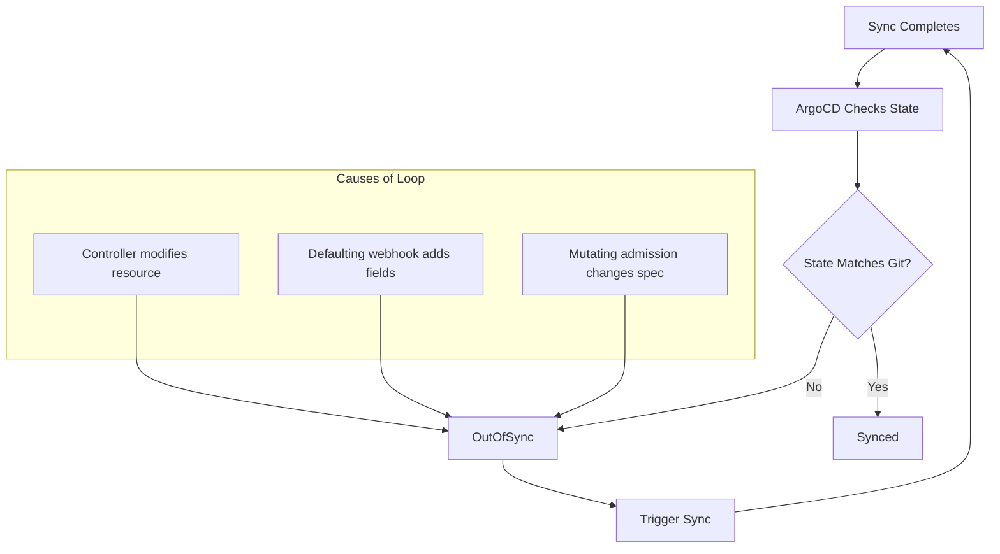

*[GitOps]: Git as single source of truth for declarative infrastructure
*[ArgoCD]: Declarative GitOps continuous delivery tool for Kubernetes
*[CRD]: Custom Resource Definition
*[RBAC]: Role-Based Access Control
*[HPA]: Horizontal Pod Autoscaler
*[PVC]: Persistent Volume Claim
*[YAML]: YAML Ain't Markup Language
*[K8s]: Kubernetes

import Callout from '@components/Callout/index.astro'

GitOps sells you on declarative simplicity: define your desired state in Git, and ArgoCD makes it so. The pitch works beautifully in demos. In production, you'll eventually stare at a sync that's been "Progressing" for 20 minutes, wondering what's actually happening inside the black box.

I hit this wall during a production deployment that had worked flawlessly in staging for months. The sync started normally, applied the first few resources, then stopped. No error. No timeout. Just... stuck. The ArgoCD UI showed "Syncing" with a spinner. Kubernetes showed pods running. Logs showed nothing useful. Manual `kubectl apply` worked fine—it only hung when deployed through ArgoCD.

The root cause turned out to be a sync wave ordering issue. A PreSync hook was waiting for a service that wouldn't exist until wave 0, but the hook was in wave -1. In staging, the service happened to exist from a previous deployment. In production, we'd just created the namespace. The dependency was always broken—we just never noticed because we never deployed to a clean environment.

This is the gap between GitOps theory and operational reality. The declarative model abstracts away the _how_ of deployment, which is great until something goes wrong. Then you need to understand exactly what ArgoCD is doing: how it orders resources, when hooks execute, how it determines health, and why it might decide your perfectly valid manifests can't be applied.

<Callout type="warning">
GitOps hides complexity until sync fails. When ArgoCD gets stuck, you need to understand what's happening underneath the declarative abstraction to debug it.
</Callout>

This article breaks down the sync process, catalogs the failure modes I've encountered (and how to recognize them), and provides a systematic debugging workflow. The goal isn't to memorize every edge case—it's to build a mental model of what ArgoCD is actually doing so you can reason about failures when they happen.

## Understanding ArgoCD Sync Mechanics

Before debugging failures, you need a clear picture of what ArgoCD is actually doing during a sync. The process has more steps than most people realize, and failures can occur at any of them.

### The Sync Process Explained

When you push a commit or click "Sync" in the UI, ArgoCD kicks off a multi-phase process. Understanding these phases tells you where to look when something goes wrong.

First, ArgoCD detects the change—either through polling the Git repository or receiving a webhook. It then generates the manifests, which might involve running Helm template, Kustomize build, or just reading raw YAML files. This is where Helm value resolution and Kustomize overlays get applied.

Next comes diff calculation. ArgoCD compares the generated manifests against the live cluster state. If there's no difference, you're already synced—nothing to do. If there is a difference, ArgoCD needs to figure out _how_ to apply the changes.

Resource ordering happens next. ArgoCD sorts resources by sync wave, then by kind (namespaces before deployments, for example), then by name. This ordering determines which resources get applied first.

Finally, ArgoCD applies resources wave by wave, runs any hooks at the appropriate phases, and waits for each resource to become healthy before moving on. If any resource fails to become healthy within the timeout, the sync fails or marks the application as degraded.


Figure: ArgoCD sync process from Git commit to healthy application state.

### Sync Waves and Resource Ordering

Kubernetes doesn't guarantee the order in which resources are created. If you `kubectl apply -f` a directory, resources might be created in any order. Usually that's fine—Kubernetes' reconciliation loops eventually sort things out. But "eventually" can mean failed pods, restarts, and transient errors that confuse monitoring.

Sync waves give you explicit control over ordering. Each resource can have an `argocd.argoproj.io/sync-wave` annotation with an integer value. Lower numbers go first. Resources without the annotation default to wave 0.

```yaml title="manifests/app/resources.yaml"
# Kubernetes manifests with ArgoCD sync-wave annotations.
# These annotations are added directly to your application manifests
# in your GitOps repository. ArgoCD reads them during sync to determine
# resource application order.

# Wave -1: Secrets and ConfigMaps first
apiVersion: v1
kind: Secret
metadata:
  annotations:
    argocd.argoproj.io/sync-wave: "-1"
  name: app-secrets
---
# Wave 0: Services and deployments (default)
apiVersion: apps/v1
kind: Deployment
metadata:
  annotations:
    argocd.argoproj.io/sync-wave: "0"
  name: app
---
# Wave 1: Post-deployment resources
apiVersion: batch/v1
kind: Job
metadata:
  annotations:
    argocd.argoproj.io/sync-wave: "1"
  name: db-migration
```
Code: Sync wave annotations controlling resource application order.

The wave number itself is arbitrary—what matters is the relative ordering. I've seen teams use -10 to 10, and others use -2 to 2. Pick a convention and stick with it. Here's a pattern that works for most applications:

| Wave | Typical Resources | Purpose |
|------|-------------------|---------|
| -2 | Namespaces, CRDs | Infrastructure prerequisites |
| -1 | Secrets, ConfigMaps | Configuration dependencies |
| 0 | Deployments, Services | Main application (default) |
| 1 | Jobs, migrations | Post-deployment tasks |
| 2 | HPA, PodDisruptionBudgets | Scaling configuration |

Table: Common sync wave ordering pattern for application deployments.

<Callout type="info">
Resources in the same sync wave are applied in parallel. ArgoCD waits for all resources in a wave to be healthy before proceeding to the next wave.
</Callout>

The "wait for healthy" behavior is critical. If wave -1 has a Secret and a ConfigMap, ArgoCD applies both simultaneously and waits for both to exist before moving to wave 0. If your Deployment in wave 0 references that Secret, you're guaranteed it exists. Without sync waves, you'd have a race condition.

### Sync Hooks Explained

Sync waves control ordering _within_ the normal apply process. Hooks let you run resources _outside_ that process entirely—before sync starts, after it completes, or when it fails.

The most common use case is database migrations. You want to run migrations after the new code is deployed but before traffic shifts to it. Or you want to take a backup before any changes are applied. Hooks give you those insertion points.


Figure: Hook execution sequence during ArgoCD sync lifecycle.

ArgoCD supports five hook types, each running at a specific point in the sync lifecycle:

| Hook Type | When It Runs | Use Case |
|-----------|--------------|----------|
| PreSync | Before any manifests applied | Database backups, pre-flight checks |
| Sync | During normal sync | Rarely used (default behavior) |
| PostSync | After all manifests healthy | Notifications, smoke tests |
| SyncFail | When sync fails | Cleanup, alerting |
| Skip | Never (resource skipped) | Templates, documentation |

Table: ArgoCD hook types with execution timing and use cases.

Hooks are typically Kubernetes Jobs that run a script or command. You define them as regular manifests in your GitOps repo, but the hook annotations tell ArgoCD to treat them specially:

```yaml title="manifests/app/migrations/db-migration-job.yaml"
# PreSync hook for database migrations. This Job runs before ArgoCD
# applies any other manifests, ensuring the database schema is ready
# before the new application version starts. Place in your GitOps repo
# alongside your application manifests.

apiVersion: batch/v1
kind: Job
metadata:
  name: db-migration
  annotations:
    argocd.argoproj.io/hook: PreSync
    argocd.argoproj.io/hook-delete-policy: HookSucceeded
    argocd.argoproj.io/sync-wave: "-1"
spec:
  template:
    spec:
      containers:
        - name: migrate
          image: app:latest
          command: ["./migrate.sh"]
      restartPolicy: Never
  backoffLimit: 3
```
Code: PreSync hook for database migration with cleanup policy.

The `hook-delete-policy` annotation controls what happens to the hook resource after it runs. `HookSucceeded` deletes the Job after it completes successfully, keeping your namespace clean. `BeforeHookCreation` deletes the old hook before creating a new one—useful when you want to see the previous hook's logs until the next sync. Without a delete policy, hook resources accumulate, and old hooks can block new syncs if they're still present.

Hooks and sync waves can be combined. In the example above, the migration hook has both `hook: PreSync` and `sync-wave: "-1"`. This means it runs before the normal sync _and_ before any other PreSync hooks in higher waves. If you have multiple PreSync hooks that depend on each other, use sync waves to order them.

## Common Sync Failure Categories

Now that you understand the mechanics, let's look at the failure modes. I've grouped these into four categories based on where in the sync process they occur. Recognizing which category you're dealing with tells you where to start debugging.

### Resource Dependency Failures

The most common sync failures happen because a resource references something that doesn't exist yet. Your Deployment needs a Secret, but the Secret hasn't been created. Your Pod uses a ServiceAccount, but the ServiceAccount's RoleBinding is missing.

These failures are frustrating because they're often intermittent. Sync works sometimes (when resources happen to be created in the right order) and fails other times (when they're not). The randomness makes them hard to reproduce and diagnose.


Figure: Resource dependency graph showing potential failure points (red = missing).

When a dependency is missing, pods fail to start with characteristic error messages:

**Common Symptoms:**
- Pod stuck in `CreateContainerConfigError`
- `secret "x" not found` errors
- `serviceaccount "x" not found` errors

The fix is usually straightforward: put the dependency in an earlier sync wave. But first you need to identify which dependency is missing:

```bash title="debug-dependency-failure.sh"
# Check what secrets a deployment needs
kubectl get deployment app -o jsonpath='{.spec.template.spec.containers[*].envFrom[*].secretRef.name}'

# Check if secret exists
kubectl get secret app-secrets

# Check ArgoCD resource status
argocd app get myapp --show-operation

# Check events for failed pods
kubectl get events --field-selector reason=Failed --sort-by='.lastTimestamp'
```
Code: Commands for debugging resource dependency failures.

<Callout type="danger">
ArgoCD's default sync does not guarantee ordering between resources in the same wave. If resource A depends on resource B and both are in wave 0, the sync may fail randomly depending on apply order.
</Callout>

### Hook Failures

Hooks fail differently than normal resources because they're Jobs, not long-running workloads. A Deployment that can't start will keep retrying—you have time to notice and fix it. A hook Job that fails blocks the entire sync immediately.

The trickiest hook failures are timeouts. ArgoCD waits for hooks to complete before proceeding, and "complete" means the Job reached a terminal state (Succeeded or Failed). If your hook runs longer than expected, the sync just hangs. There's no timeout by default—ArgoCD will wait forever.

| Failure Mode | Symptom | Cause |
|--------------|---------|-------|
| Hook timeout | Sync stuck at "Running PreSync hooks" | Hook job takes too long |
| Hook crash | Sync failed, hook pod in CrashLoopBackOff | Bug in hook script |
| Hook not deleted | Old hook blocks new sync | Missing delete policy |
| Hook wrong phase | Resources applied before prerequisites | Wrong hook type |

Table: Common hook failure modes with symptoms and causes.

For long-running hooks like database migrations, always set `activeDeadlineSeconds` on the Job. This gives ArgoCD a timeout—if the migration takes longer than expected, the sync fails instead of hanging forever:

```yaml title="manifests/app/migrations/slow-migration-job.yaml" {14}
# Long-running migration hook with explicit timeout.
# The activeDeadlineSeconds ensures ArgoCD doesn't wait forever
# if the migration hangs or takes longer than expected.

apiVersion: batch/v1
kind: Job
metadata:
  name: slow-migration
  annotations:
    argocd.argoproj.io/hook: PreSync
    argocd.argoproj.io/sync-wave: "-1"
spec:
  activeDeadlineSeconds: 600  # 10 minute timeout
  template:
    spec:
      containers:
        - name: migrate
          image: app:latest
          command: ["./long-migration.sh"]
      restartPolicy: Never
```
Code: Hook configuration with extended timeout for long-running operations.

The "hook not deleted" failure deserves special mention. If your previous sync left a hook Job lying around (because you didn't set a delete policy), and that Job has the same name as the new hook, ArgoCD can't create the new one. The fix is to add `hook-delete-policy: BeforeHookCreation` so ArgoCD cleans up old hooks before creating new ones.

### Health Check Failures

ArgoCD doesn't just apply resources—it waits for them to become healthy. "Healthy" means something different for each resource type. Deployments are healthy when their replicas are ready. Services are healthy when they have endpoints. Jobs are healthy when they complete successfully.

For [built-in Kubernetes types](https://kubernetes.io/docs/concepts/workloads/), ArgoCD has hardcoded health checks that usually do the right thing. The problems start when you use Custom Resources. ArgoCD doesn't know how to assess the health of your custom CRD, so it just marks it "Healthy" immediately after creation—even if the controller hasn't reconciled it yet.


Figure: ArgoCD health assessment flow for different resource types.

For CRDs, you need to write custom health checks in Lua.[^lua-only] These go in the `argocd-cm` ConfigMap

[^lua-only]: Lua is the only scripting language supported by ArgoCD for custom health assessments and resource actions. and tell ArgoCD how to interpret your CRD's status field:

```lua title="argocd-cm-health-customization.lua"
-- Custom health check for a CRD.
-- Add to argocd-cm ConfigMap under:
--   resource.customizations.health.<group>_<kind>
-- Example key: resource.customizations.health.example.com_MyResource

hs = {}
hs.status = "Progressing"
hs.message = ""

if obj.status ~= nil then
  if obj.status.phase == "Ready" then
    hs.status = "Healthy"
    hs.message = "Resource is ready"
  elseif obj.status.phase == "Failed" then
    hs.status = "Degraded"
    hs.message = obj.status.message or "Resource failed"
  else
    hs.status = "Progressing"
    hs.message = "Waiting for resource to be ready"
  end
end

return hs
```
Code: Custom Lua health check for CRDs that ArgoCD does not know how to assess.

### Diff/Drift Detection Issues

Sometimes ArgoCD reports a resource as `OutOfSync` even though you haven't changed anything. You click "Sync," it completes successfully, and then immediately shows `OutOfSync` again. This is the dreaded sync loop, and it usually means something in the cluster is modifying the resource after ArgoCD applies it.

The most common culprit is the Horizontal Pod Autoscaler. Your manifest says `replicas: 3`, but HPA scales it to 5. ArgoCD sees the difference and wants to "fix" it back to 3. HPA scales it back to 5. Repeat forever.

The fix is to tell ArgoCD to ignore fields that are managed by other controllers:

```yaml title="argocd-apps/myapp.yaml"
# ArgoCD Application manifest with ignoreDifferences.
# This goes in your ArgoCD application definition, not
# in the application manifests themselves. Use it to
# tell ArgoCD which fields are managed by other controllers.

apiVersion: argoproj.io/v1alpha1
kind: Application
metadata:
  name: myapp
spec:
  ignoreDifferences:
    # Ignore fields managed by controllers
    - group: apps
      kind: Deployment
      jsonPointers:
        - /spec/replicas  # Managed by HPA
    # Ignore cluster-specific annotations
    - group: ""
      kind: Service
      jsonPointers:
        - /metadata/annotations/cloud.google.com~1neg-status
    # Ignore all managedFields (Kubernetes internal)
    - group: "*"
      kind: "*"
      managedFieldsManagers:
        - kube-controller-manager
```
Code: Application-level ignoreDifferences configuration for expected drift.

<Callout type="info">
If a resource shows `OutOfSync` but the diff looks identical, check for whitespace differences, field ordering, or default values that Kubernetes adds but your manifests do not include.
</Callout>

Other common sources of drift:
- **Mutating webhooks** that add labels or annotations to resources
- **Kubernetes defaulting** that adds fields your manifest doesn't specify (like `imagePullPolicy: IfNotPresent`)
- **Controller timestamps** like `lastTransitionTime` in status fields
- **Cloud provider annotations** added by load balancer controllers or ingress controllers

Use `argocd app diff myapp` to see exactly what ArgoCD thinks is different. If the diff shows fields you don't care about, add them to `ignoreDifferences`.

## Debugging Workflow

Now that you understand _what_ can fail, let's talk about _how_ to investigate when it does. When a sync fails, resist the urge to immediately start poking at random things. A systematic approach gets you to the root cause faster. I follow a four-step process: identify where in the sync process the failure occurred, check the relevant logs, inspect the actual Kubernetes state, then reproduce and fix.

### Step 1: Identify the Failure Point

Start broad and narrow down. The ArgoCD CLI gives you a quick overview of what's happening:

```bash title="debug-step-1.sh"
# Get application status overview
argocd app get myapp

# Get detailed sync status
argocd app get myapp --show-operation

# List resources with their sync/health status
argocd app resources myapp

# Get specific resource status
argocd app resources myapp --kind Deployment --name app
```
Code: Commands for identifying where in the sync process failure occurred.

The `argocd app get` output tells you the sync status (Synced, OutOfSync, Unknown) and health status (Healthy, Progressing, Degraded, Missing). If sync status is OutOfSync but health is Healthy, you have a drift problem. If health is Degraded, something failed to start. If health is Progressing for a long time, something is stuck.

The `--show-operation` flag shows the current or last sync operation, including which phase it's in and any error messages. This is where you'll see "Running PreSync hooks" if a hook is stuck, or "Sync error" with a message if apply failed.

### Step 2: Examine ArgoCD Logs

Once you know roughly where the failure is, check the logs for the relevant ArgoCD component. ArgoCD has several pods, and each handles different parts of the sync process:

```bash title="debug-step-2.sh"
# ArgoCD application controller logs (sync decisions)
kubectl logs -n argocd -l app.kubernetes.io/name=argocd-application-controller -f

# ArgoCD repo server logs (manifest generation)
kubectl logs -n argocd -l app.kubernetes.io/name=argocd-repo-server -f

# ArgoCD server logs (API/UI issues)
kubectl logs -n argocd -l app.kubernetes.io/name=argocd-server -f

# Filter for specific application
kubectl logs -n argocd -l app.kubernetes.io/name=argocd-application-controller | grep "myapp"
```
Code: ArgoCD component logs for different failure types.

| Component | Log Location | Failure Types |
|-----------|--------------|---------------|
| application-controller | Controller pod | Sync decisions, health checks |
| repo-server | Repo server pod | Manifest generation, Helm/Kustomize |
| server | Server pod | API errors, authentication |
| redis | Redis pod | Caching issues, state corruption |

Table: ArgoCD components and their log relevance.

Most sync failures show up in the application-controller logs. If your issue is "manifest generation failed" or you're seeing Helm/Kustomize errors, check the repo-server logs instead. The server pod logs are rarely useful for sync issues—they're more for API and authentication problems.

### Step 3: Inspect Kubernetes State

ArgoCD's view of the world comes from Kubernetes, so when ArgoCD reports a problem, verify what's actually happening in the cluster. Sometimes ArgoCD's status is stale, or the problem is a Kubernetes issue that ArgoCD is just reporting.

```bash title="debug-step-3.sh"
# Check deployment rollout status
kubectl rollout status deployment/app -n myapp

# Describe deployment for events
kubectl describe deployment app -n myapp

# Check pod status and events
kubectl get pods -n myapp
kubectl describe pod -n myapp -l app=myapp

# Check recent events in namespace
kubectl get events -n myapp --sort-by='.lastTimestamp' | tail -20

# Check resource quotas if pods pending
kubectl describe resourcequota -n myapp
```
Code: Kubernetes commands for inspecting actual cluster state during sync failures.

The `kubectl describe` output for pods is often the most useful. Look at the Events section at the bottom—it shows why pods failed to schedule, failed to pull images, or failed to start containers. Common culprits: image pull failures (wrong tag, missing pull secret), resource quota exceeded, node selector constraints not satisfied.

### Step 4: Reproduce and Fix

Once you understand the failure, you need to fix it and verify the fix works. ArgoCD provides several options for testing changes before committing them:

```bash title="debug-step-4.sh"
# Dry-run sync to see what would happen
argocd app sync myapp --dry-run

# Sync with increased verbosity
argocd app sync myapp --loglevel debug

# Force sync (skip pruning safety)
argocd app sync myapp --force

# Sync specific resources only
argocd app sync myapp --resource apps:Deployment:app

# Hard refresh (clear cache, re-fetch from Git)
argocd app get myapp --hard-refresh
```
Code: Commands for reproducing and testing sync fixes.

The `--dry-run` flag shows you what ArgoCD _would_ do without actually doing it. Use this to verify your fix before applying it.

The `--resource` flag lets you sync a single resource, which is useful when you've fixed one thing and want to test it without re-syncing everything.

The `--hard-refresh` flag clears ArgoCD's cache and re-fetches manifests from Git. Use this when ArgoCD seems to be showing stale state, or when you've made changes to the repo and ArgoCD hasn't picked them up yet.

Be careful with `--force`. It tells ArgoCD to delete and recreate resources instead of patching them, which can cause downtime. Only use it when you're stuck and understand the consequences.

## Specific Failure Scenarios

The debugging workflow above applies to any failure, but some scenarios come up often enough that they deserve specific runbooks. Here are the four I encounter most frequently.

### Scenario: Sync Stuck on Hook

You triggered a sync, and it's been sitting at "Running PreSync hooks" for 10 minutes. The ArgoCD UI shows a spinner. Nothing seems to be happening. This is one of the most frustrating failure modes because there's no error message—just silence.

The root cause is almost always a hook Job that isn't completing. Either it's still running (legitimately slow), it's stuck waiting for something (resource contention, external dependency), or it crashed and Kubernetes is respecting the backoff retry delay.

Here's the runbook I use:

```markdown title="runbooks/hook-stuck.md"
# Runbook: Sync Stuck on Hook

## Symptoms
- Sync status shows "Running PreSync hooks" or "Running PostSync hooks"
- Sync has been in this state for longer than expected

## Diagnosis

1. Identify the stuck hook:
\`\`\`bash
kubectl get jobs -n myapp -l argocd.argoproj.io/hook
\`\`\`

2. Check hook job status:
\`\`\`bash
kubectl describe job <hook-job-name> -n myapp
\`\`\`

3. Check hook pod logs:
\`\`\`bash
kubectl logs -n myapp -l job-name=<hook-job-name>
\`\`\`

## Common Causes

- **Hook script error**: Fix script, redeploy
- **Missing permissions**: Add RBAC for hook ServiceAccount
- **Image pull failure**: Check image name and pull secret
- **Resource limits**: Increase memory/CPU limits
- **External dependency**: Ensure dependency is available

## Resolution

1. If hook can be safely skipped:
\`\`\`bash
argocd app sync myapp --prune --force
\`\`\`

2. If hook needs to complete:
- Fix the underlying issue
- Delete the stuck job
- Trigger new sync

3. To prevent recurrence:
- Add `activeDeadlineSeconds` to job spec
- Add proper health checks to hook
- Consider using `hook-delete-policy: BeforeHookCreation`
```
Code: Runbook for debugging sync stuck on hook execution.

The key insight is that ArgoCD can't tell you why the hook is stuck—it only knows the Job hasn't reached a terminal state. You have to dig into Kubernetes to find the actual cause.

### Scenario: OutOfSync Loop

This one is maddening. You sync the application, it completes successfully, and five seconds later it shows OutOfSync again. You sync again. Same result. The application is perpetually out of sync no matter how many times you sync it.

The cause is always something modifying the resource after ArgoCD applies it. ArgoCD applies your manifest, a controller or webhook modifies the resource, ArgoCD detects the difference and marks it OutOfSync.


Figure: OutOfSync loop caused by external modifications to resources.

To diagnose, run `argocd app diff myapp` and look at what's different. The diff will show you exactly which fields are changing:

```yaml title="argocd-apps/myapp-with-ignore.yaml"
# Check what ArgoCD sees as different
# Run: argocd app diff myapp

# Example diff output showing HPA modifying replicas:
# --- /apps/v1/Deployment/myapp/app
# +++ live
# @@ -15,7 +15,7 @@
#    spec:
# -    replicas: 3
# +    replicas: 5  # Modified by HPA

# Solution: Add to Application spec
spec:
  ignoreDifferences:
    - group: apps
      kind: Deployment
      jsonPointers:
        - /spec/replicas
```
Code: Diagnosing and fixing OutOfSync loop caused by HPA replica management.

<Callout type="warning">
Never ignore differences on fields that represent actual drift you care about. Only ignore fields that are legitimately managed by other controllers (HPA replicas, cert-manager annotations, etc.).
</Callout>

### Scenario: CRD Sync Order Problem

Custom Resource Definitions have a chicken-and-egg problem: you can't create a Custom Resource until its CRD exists, but if both are in the same ArgoCD application, they might be applied in the wrong order.

The symptom is a sync failure with an error like `the server doesn't have a resource type "MyResource"`. ArgoCD tried to create the Custom Resource before the CRD was registered with the API server.

The fix has two parts. First, put the CRD in an earlier sync wave so it's applied first. Second, add `SkipDryRunOnMissingResource=true` to the CRD because ArgoCD's dry-run will fail if the CRD doesn't exist yet:

```yaml title="manifests/crds/myresource-crd.yaml" {5-6,16-17}
# CRD definition - must be in earlier sync wave.
# The SkipDryRunOnMissingResource option prevents dry-run failures
# when the CRD doesn't exist yet in the cluster.

apiVersion: apiextensions.k8s.io/v1
kind: CustomResourceDefinition
metadata:
  annotations:
    argocd.argoproj.io/sync-wave: "-5"
    argocd.argoproj.io/sync-options: SkipDryRunOnMissingResource=true
  name: myresources.example.com
spec:
  # ... CRD spec
---
# CRD instance - must wait for CRD to exist
apiVersion: example.com/v1
kind: MyResource
metadata:
  annotations:
    argocd.argoproj.io/sync-wave: "0"
  name: my-instance
spec:
  # ... instance spec
```
Code: CRD and instance ordering with sync waves to prevent race condition.

I use wave -5 for CRDs because I want plenty of room for other infrastructure resources (Namespaces at -3, Secrets at -1, etc.). The specific number doesn't matter as long as it's lower than the wave of any resources that use the CRD.

### Scenario: Resource Pruning Gone Wrong

Pruning is ArgoCD's way of deleting resources that exist in the cluster but not in Git. It's powerful and dangerous. If you accidentally remove a manifest from Git, ArgoCD will helpfully delete the corresponding resource from your cluster. Sometimes that's a Secret you definitely didn't want deleted.

The most common pruning accidents happen when:
- You refactor your manifests and forget to include something
- You rename a resource (ArgoCD sees it as "delete old, create new")
- A merge conflict resolution drops a file
- You're testing changes in a branch and accidentally merge to main

Protect critical resources with the `Prune=false` annotation. This tells ArgoCD to never prune this resource, even if it disappears from Git:

```yaml title="manifests/app/secrets/critical-secret.yaml" {9}
# Protect critical resources from accidental pruning.
# The Prune=false annotation ensures this resource survives
# even if it's accidentally removed from the Git repository.

apiVersion: v1
kind: Secret
metadata:
  annotations:
    argocd.argoproj.io/sync-options: Prune=false
  name: critical-secret
---
# Application-level prune settings go in your ArgoCD Application manifest
apiVersion: argoproj.io/v1alpha1
kind: Application
spec:
  syncPolicy:
    automated:
      prune: true
      selfHeal: true
    syncOptions:
      # Don't prune if sync fails
      - PrunePropagationPolicy=foreground
      # Require manual prune for certain resources
      - PruneLast=true
```
Code: Prune protection for critical resources and safe prune policies.

Beyond per-resource protection, ArgoCD offers several application-level sync options that control pruning behavior:

| Sync Option | Effect |
|-------------|--------|
| `Prune=false` | Never prune this resource |
| `PruneLast=true` | Prune after all other resources synced |
| `PrunePropagationPolicy=foreground` | Wait for dependents before pruning |
| `ApplyOutOfSyncOnly=true` | Only apply resources that differ |

Table: ArgoCD sync options affecting prune behavior.

For applications with automated sync enabled, I recommend `PruneLast=true` at the application level. This ensures pruning only happens after all other resources are healthy, reducing the blast radius if something goes wrong during the sync.

## Prevention Strategies

Debugging sync failures is valuable, but preventing them is better. The most effective teams I've worked with treat sync failures as signals to improve their deployment process, not just problems to fix. After enough incidents, patterns emerge—and those patterns point to prevention strategies.

The goal isn't to eliminate all sync failures (that's impossible), but to catch the preventable ones early and make the inevitable ones easier to diagnose.

### Manifest Validation

Most sync failures I've seen could have been caught before the manifests ever reached ArgoCD. A typo in a resource name, an invalid API version, a missing required field—these are CI problems, not deployment problems. Shift validation left and you'll dramatically reduce sync failures.

The key is layering validation: syntax checking catches malformed YAML, schema validation catches invalid Kubernetes resources, and dry-run testing catches issues with your actual cluster state.

```yaml title="github-action-validation.yaml"
name: Validate Manifests
on: [pull_request]

jobs:
  validate:
    runs-on: ubuntu-latest
    steps:
      - uses: actions/checkout@v4

      - name: Install tools
        run: |
          curl -LO https://github.com/instrumenta/kubeval/releases/latest/download/kubeval-linux-amd64.tar.gz
          tar xf kubeval-linux-amd64.tar.gz
          sudo mv kubeval /usr/local/bin/

      - name: Validate YAML syntax
        run: |
          find . -name '*.yaml' -exec yamllint {} \;

      - name: Validate Kubernetes schemas
        run: |
          kubeval --strict manifests/**/*.yaml

      - name: Dry-run against cluster
        run: |
          argocd app diff myapp --local ./manifests --exit-code
```
Code: CI pipeline for manifest validation before merge.

The `argocd app diff --local` step is particularly valuable—it compares what ArgoCD _would_ generate against what's currently deployed. This catches not just invalid manifests but manifests that would cause unexpected changes. I've seen this single check prevent dozens of incidents where someone accidentally reverted a hotfix or overwrote a manual configuration.

<Callout type="tip">
Run `kubeval` with `--strict` mode to catch unknown fields. Kubernetes accepts unknown fields silently, which means typos in field names (like `replcia` instead of `replica`) won't cause errors—they'll just be ignored. Strict mode catches these.
</Callout>

### Sync Windows

Not every hour is a good time to deploy. Sync windows let you control _when_ ArgoCD can apply changes, which is critical for production environments where you need predictability.

```yaml title="argocd-projects/production-sync-windows.yaml"
# AppProject sync window configuration.
# Applies to all applications within this project.
apiVersion: argoproj.io/v1alpha1
kind: AppProject
metadata:
  name: production
spec:
  syncWindows:
    # Allow syncs only during business hours
    - kind: allow
      schedule: "0 9 * * 1-5"  # 9 AM weekdays
      duration: 8h
      applications:
        - "*"
    # Block syncs during peak traffic
    - kind: deny
      schedule: "0 12 * * *"  # Noon daily
      duration: 2h
      applications:
        - "critical-*"
    # Allow manual syncs anytime for emergencies
    - kind: allow
      schedule: "* * * * *"
      duration: 24h
      manualSync: true
```
Code: Sync window configuration restricting automated deployments to safe periods.

The `manualSync: true` window is important—it lets you override the restrictions for emergency deployments. Without this escape hatch, sync windows can become a liability during incidents when you _need_ to deploy a fix immediately.

I typically set up three types of windows: an allow window during business hours when the team is available to respond to issues, a deny window during peak traffic when failed deployments have maximum impact, and an always-on manual window for emergencies. The specific times depend on your traffic patterns and team distribution.

### Monitoring and Alerting

Sync failures are inevitable. What matters is how quickly you detect and respond to them. ArgoCD exposes Prometheus metrics that make it straightforward to alert on sync problems before they become user-facing incidents.

```yaml title="argocd-alerts.yaml"
groups:
  - name: argocd
    rules:
      - alert: ArgoCDSyncFailed
        expr: |
          argocd_app_info{sync_status="OutOfSync"} == 1
          and
          argocd_app_info{health_status!="Healthy"} == 1
        for: 10m
        labels:
          severity: warning
        annotations:
          summary: "ArgoCD app {{ $labels.name }} sync failed"
          runbook: "https://wiki/runbooks/argocd-sync-failed"

      - alert: ArgoCDSyncStuck
        expr: |
          time() - argocd_app_info{sync_status="Syncing"} > 1800
        labels:
          severity: critical
        annotations:
          summary: "ArgoCD app {{ $labels.name }} sync stuck for 30+ minutes"

      - alert: ArgoCDAppDegraded
        expr: |
          argocd_app_info{health_status="Degraded"} == 1
        for: 5m
        labels:
          severity: critical
        annotations:
          summary: "ArgoCD app {{ $labels.name }} is degraded"
```
Code: Prometheus alerting rules for ArgoCD sync failures.

The three alerts above cover the most common failure modes: sync failures (OutOfSync + unhealthy), stuck syncs (syncing for too long), and degraded applications (healthy but degraded status). The `for` clause prevents alert noise from transient states—a brief OutOfSync during a normal deployment shouldn't page anyone.

The runbook link in the annotations is critical. When an engineer gets paged at 3 AM, they shouldn't have to remember the debugging workflow—they should be able to follow a documented procedure. Link each alert to a runbook that walks through the investigation steps.

<Callout type="success">
Alert on sync failures early. A 10-minute OutOfSync alert gives you time to investigate before users notice. A 30-minute stuck sync is almost always a real problem requiring intervention.
</Callout>

## Advanced Troubleshooting

When the standard debugging workflow doesn't reveal the problem, you need to dig deeper into ArgoCD's internals. These techniques address edge cases that arise in complex deployments or after upgrades.

### Resource Tracking Methods

ArgoCD needs to know which resources belong to which application. It tracks this ownership through labels or annotations on the resources themselves. Most of the time, the default label-based tracking works fine—but it can cause problems when those labels interfere with other systems.

The most common issue I've seen is with label selectors. If your application uses label selectors that happen to match ArgoCD's tracking labels, you can get unexpected behavior. Switching to annotation-based tracking resolves this, since annotations aren't used in selectors.

The table below summarizes when to use each tracking method:

| Method | How It Works | When to Use |
|--------|--------------|-------------|
| label | Adds ArgoCD label to resources | Default, simple apps |
| annotation | Adds ArgoCD annotation | When labels cause issues |
| annotation+label | Both | Migration between methods |

Table: ArgoCD resource tracking methods.

To change the tracking method or enable related sync options, configure them in your Application spec. The example below shows server-side apply, which is particularly useful when combined with annotation tracking for resources managed by multiple controllers:

```yaml title="argocd-apps/myapp-server-side-apply.yaml"
apiVersion: argoproj.io/v1alpha1
kind: Application
metadata:
  name: myapp
spec:
  syncPolicy:
    syncOptions:
      # Use annotation tracking if labels interfere with selectors
      - ServerSideApply=true
      - RespectIgnoreDifferences=true
```
Code: Application configuration using server-side apply for complex resources.

Server-side apply (`ServerSideApply=true`) is worth calling out here. It delegates conflict resolution to the Kubernetes API server rather than ArgoCD, which handles field ownership more gracefully. If you're seeing persistent drift on resources managed by multiple controllers (like HPA modifying replica counts), server-side apply often resolves the conflict.

### Debugging Manifest Generation

ArgoCD doesn't deploy your YAML files directly—it renders them through Helm, Kustomize, or plain directory processing first. When sync fails with manifest-related errors, you need to see what ArgoCD actually generated, which might differ from what you expect.

The most common surprise is values resolution in Helm. ArgoCD might be using different values files than you're testing locally, or environment-specific overrides might not be applied in the order you expect.

```bash title="debug-manifest-generation.sh"
# See what ArgoCD generates from your repo
argocd app manifests myapp

# Compare local vs remote generation
argocd app diff myapp --local ./path/to/manifests

# For Helm apps, check values resolution
argocd app get myapp -o yaml | grep -A 50 'helm:'

# Test Helm template locally
helm template myapp ./chart -f values.yaml -f values-prod.yaml

# Test Kustomize locally
kustomize build ./overlays/production

# Check repo-server can access the repo
kubectl exec -n argocd deploy/argocd-repo-server -- \
  ls /tmp/<repo-hash>/
```
Code: Commands for debugging manifest generation from Helm and Kustomize.

The `argocd app manifests` command is your friend here—it shows you exactly what ArgoCD will apply, after all the templating. Compare this output to what you generate locally, and discrepancies will jump out. The repo-server access check at the end catches a common issue where ArgoCD can't clone or access your repository due to network or authentication problems.

### Recovering from Corrupt State

Sometimes ArgoCD's internal state becomes inconsistent with reality. This can happen after failed upgrades, network partitions, or manual resource modifications that confuse the controller. The symptoms vary—perpetual OutOfSync, missing resources in the UI, or sync operations that silently do nothing.

```bash title="recovery-commands.sh"
# Step 1: Try this first - force refresh from Git
argocd app get myapp --hard-refresh

# Step 2: If refresh doesn't help - delete and recreate app (preserves resources)
argocd app delete myapp --cascade=false
argocd app create myapp --repo ... --path ... --dest-server ...

# Step 3: If state is still corrupt - clear Redis cache
kubectl delete pod -n argocd -l app.kubernetes.io/name=argocd-redis

# Step 4: Nuclear option - restart application controller
kubectl rollout restart deployment -n argocd argocd-application-controller
```
Code: Recovery commands for ArgoCD state corruption scenarios.

Start with `--hard-refresh`, which forces ArgoCD to re-read the Git repository and recalculate the desired state. This resolves most caching issues. If that doesn't work, the nuclear option is deleting and recreating the Application resource—but _only_ with `--cascade=false`, which preserves the actual Kubernetes resources while resetting ArgoCD's tracking state.

<Callout type="danger">
The `--cascade=false` flag is critical when deleting an application for recovery. Without it, ArgoCD will delete all the Kubernetes resources the application manages.
</Callout>

## Conclusion

ArgoCD sync failures are frustrating because they break the promise of GitOps: you pushed to Git, so it should just work. But that frustration fades once you understand what's actually happening beneath the abstraction.

The debugging workflow follows a clear pattern. Start with the ArgoCD UI or CLI to understand _what_ failed. Check sync waves and hooks to understand _when_ it failed. Examine Kubernetes state to understand _why_ it failed. And trace the resource dependency graph to understand whether the failure is isolated or will cascade.

Most sync failures fall into a few categories: resource dependency issues (usually ordering problems), hook failures (scripts that time out or crash), health check failures (resources that don't become ready), and drift detection issues (differences between desired and live state that shouldn't exist). Once you recognize the category, the fix is usually straightforward.

The prevention strategies matter as much as the debugging skills. CI validation catches manifest errors before they reach ArgoCD. Sync windows prevent deployments during high-risk periods. Alerting ensures you know about failures before users do. And runbooks mean that when things fail at 3 AM, you have a documented path to resolution.

<Callout type="success">
GitOps is not magic—it is automation. When the automation fails, you need to understand what it was trying to do. Master the sync process, and debugging becomes systematic rather than frustrating.
</Callout>
