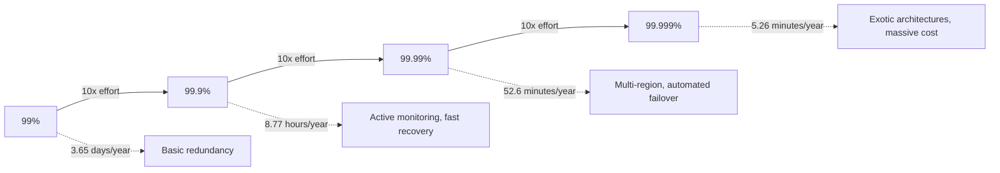
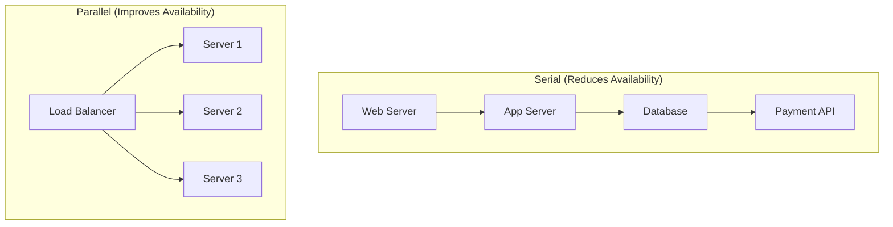
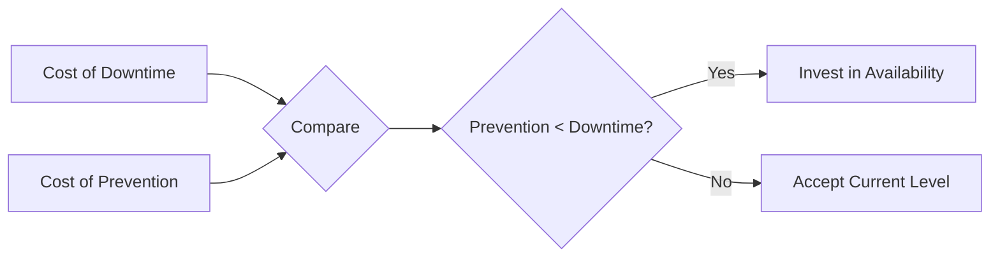
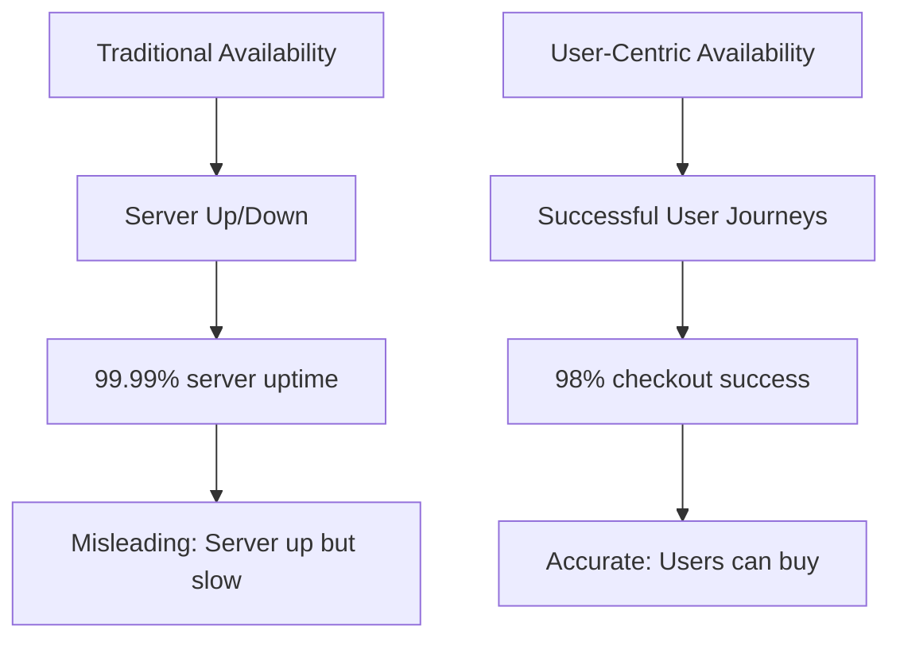
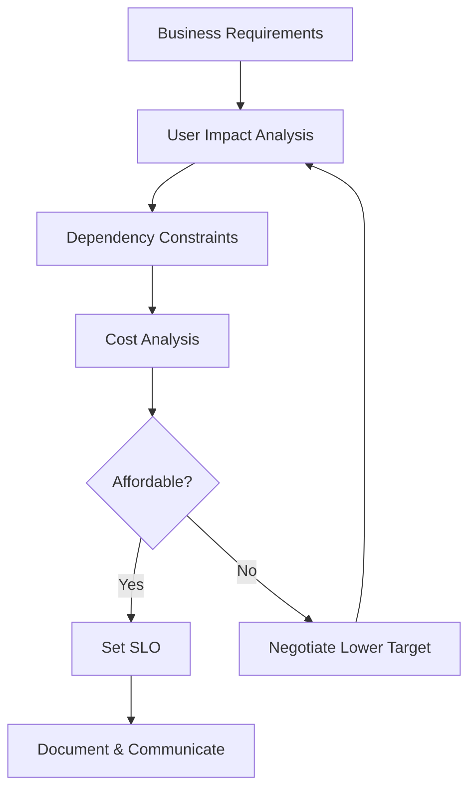
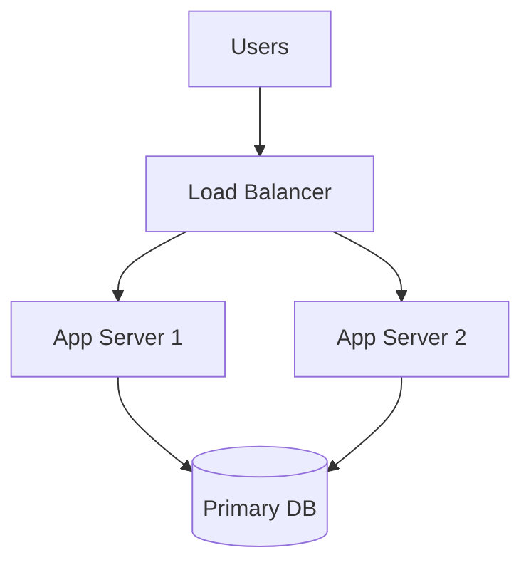
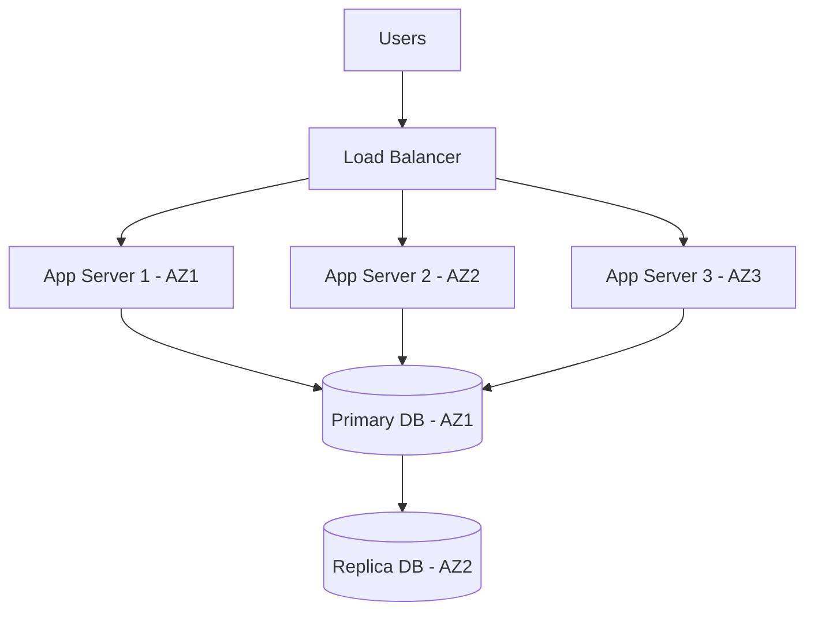
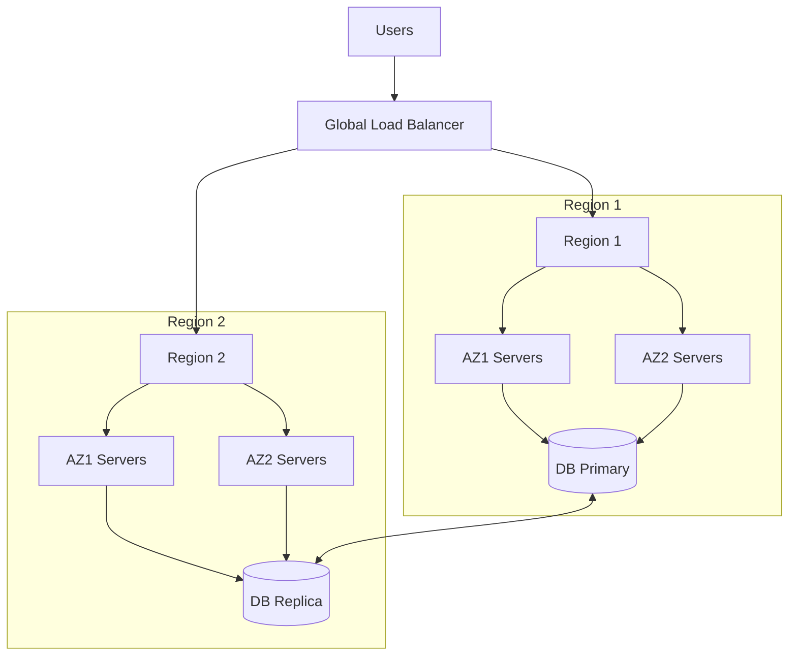

*[SLA]: Service Level Agreement
*[SLO]: Service Level Objective
*[SLI]: Service Level Indicator
*[MTTR]: Mean Time To Recovery
*[MTBF]: Mean Time Between Failures
*[RPO]: Recovery Point Objective
*[RTO]: Recovery Time Objective
*[HA]: High Availability
*[DR]: Disaster Recovery

# The Cost of Five Nines: When 99.9% Wins

## Introduction

Brief overview of the availability aspirations that drive infrastructure decisions: everyone wants "five nines" (99.999%) because it sounds impressive, but few understand the exponential cost curve or have done the business math to justify it. This section frames availability targeting as an economic decision, not a technical badge of honor.

_Include a real-world scenario: a startup spending 40% of their infrastructure budget chasing 99.99% when their users would not notice the difference between 99.9% and 99.99%, and the opportunity cost of features not built._

<Callout type="warning">
Every nine costs roughly 10x more than the previous one. Before committing to an availability target, know exactly what you are buying and whether the business value justifies the cost.
</Callout>

## The Math of Nines

### What the Numbers Actually Mean

Translate availability percentages into concrete downtime windows that stakeholders can understand.

| Availability | Annual Downtime | Monthly Downtime | Weekly Downtime |
|--------------|-----------------|------------------|-----------------|
| 99% (two nines) | 3.65 days | 7.31 hours | 1.68 hours |
| 99.9% (three nines) | 8.77 hours | 43.83 minutes | 10.08 minutes |
| 99.95% | 4.38 hours | 21.92 minutes | 5.04 minutes |
| 99.99% (four nines) | 52.60 minutes | 4.38 minutes | 1.01 minutes |
| 99.999% (five nines) | 5.26 minutes | 26.30 seconds | 6.05 seconds |

Table: Availability percentages translated to actual downtime windows.


Figure: The exponential cost curve of availability improvements.

### Calculating Composite Availability

Explain how system availability is calculated from component availability, and why chains of dependencies drive overall availability down.

$$
A_{system} = A_1 \times A_2 \times A_3 \times ... \times A_n
$$

```text
Example: Three 99.9% components in series
System availability = 0.999 × 0.999 × 0.999 = 0.997 (99.7%)

Three 99.9% components became one 99.7% system.
You lost almost a full "nine" just by having dependencies.
```

<Callout type="info">
Your system availability cannot exceed your least available dependency. If your payment provider is 99.9%, your checkout flow cannot be 99.99% no matter how much you spend on your own infrastructure.
</Callout>

### Parallel vs. Serial Dependencies

Explain how redundancy (parallel components) improves availability while dependencies (serial components) reduce it.


Figure: Serial dependencies multiply failure probability; parallel redundancy reduces it.

$$
A_{parallel} = 1 - (1 - A_1) \times (1 - A_2) \times ... \times (1 - A_n)
$$

```text
Example: Two 99% servers in parallel (either can serve traffic)
Availability = 1 - (0.01 × 0.01) = 1 - 0.0001 = 99.99%

Two cheap servers achieved what one expensive server could not.
```

## The Cost Curve

### Infrastructure Costs by Availability Tier

Detail the infrastructure investments required at each availability level.

| Tier | Typical Architecture | Relative Cost |
|------|---------------------|---------------|
| 99% | Single region, basic monitoring | 1x (baseline) |
| 99.9% | Multi-AZ, load balancing, automated recovery | 2-3x |
| 99.95% | Active-passive DR, comprehensive monitoring | 4-6x |
| 99.99% | Multi-region active-active, global load balancing | 10-20x |
| 99.999% | Exotic redundancy, zero-downtime everything | 50-100x+ |

Table: Infrastructure cost multipliers by availability tier.

```yaml title="availability-tier-architecture.yaml"
tiers:
  two_nines:  # 99%
    regions: 1
    zones: 1
    database: single_instance
    failover: manual
    monitoring: basic_uptime_checks
    estimated_cost: "$500/month"

  three_nines:  # 99.9%
    regions: 1
    zones: 3
    database: multi_az_replica
    failover: automated_within_region
    monitoring: comprehensive_apm
    estimated_cost: "$2,000/month"

  four_nines:  # 99.99%
    regions: 2+
    zones: 3_per_region
    database: global_replication
    failover: automated_cross_region
    monitoring: full_observability_stack
    estimated_cost: "$15,000/month"

  five_nines:  # 99.999%
    regions: 3+
    zones: 3_per_region
    database: active_active_global
    failover: instant_automatic
    monitoring: predictive_with_chaos_engineering
    estimated_cost: "$100,000+/month"
```
Code: Architecture and cost estimates by availability tier (costs are illustrative).

### Hidden Costs Beyond Infrastructure

Discuss the non-infrastructure costs that scale with availability targets.

| Cost Category | Why It Scales | Example |
|---------------|---------------|---------|
| Engineering Time | More complex systems require more expertise | Senior SREs vs. junior ops |
| Testing | More failure modes to validate | Chaos engineering programs |
| On-Call | Tighter response requirements | 24/7 staffing vs. best-effort |
| Tooling | Better observability needed | $50k/year APM vs. free tier |
| Opportunity Cost | Time not spent on features | Every hour on HA is not on product |

Table: Hidden costs that increase with availability targets.

<Callout type="danger">
The biggest hidden cost is opportunity cost. Engineering hours spent achieving 99.99% are hours not spent building features that might grow revenue faster than the avoided downtime costs.
</Callout>

### The Cost-Benefit Crossover

Explain how to find the point where additional availability investment stops paying off.


Figure: Basic cost-benefit decision for availability investment.

$$
\text{Investment justified when: } \text{Cost of Downtime} \times \text{Downtime Reduction} > \text{Cost of Prevention}
$$

```typescript title="availability-roi-calculator.ts"
interface AvailabilityAnalysis {
  currentAvailability: number;  // e.g., 0.999
  targetAvailability: number;   // e.g., 0.9999
  revenuePerHour: number;       // Revenue at risk during downtime
  costToAchieve: number;        // Annual cost of improvement
}

function calculateROI(analysis: AvailabilityAnalysis): {
  downtimeReductionHours: number;
  revenueSaved: number;
  roi: number;
} {
  const hoursPerYear = 8760;

  const currentDowntimeHours = hoursPerYear * (1 - analysis.currentAvailability);
  const targetDowntimeHours = hoursPerYear * (1 - analysis.targetAvailability);
  const downtimeReductionHours = currentDowntimeHours - targetDowntimeHours;

  const revenueSaved = downtimeReductionHours * analysis.revenuePerHour;
  const roi = (revenueSaved - analysis.costToAchieve) / analysis.costToAchieve;

  return { downtimeReductionHours, revenueSaved, roi };
}

// Example: Should we go from 99.9% to 99.99%?
const analysis = calculateROI({
  currentAvailability: 0.999,
  targetAvailability: 0.9999,
  revenuePerHour: 10000,  // $10k/hour during downtime
  costToAchieve: 150000,  // $150k/year for multi-region
});

// Result:
// downtimeReductionHours: 7.88 hours (8.77h - 0.88h)
// revenueSaved: $78,800
// roi: -47% (costs more than it saves!)
```
Code: ROI calculator for availability investments showing when improvements are not justified.

## User Impact Analysis

### Not All Downtime Is Equal

Explain how downtime timing and type affects actual user impact.

| Downtime Type | User Impact | Availability Impact |
|---------------|-------------|---------------------|
| 3am maintenance (low traffic) | Minimal | Same as peak hours |
| Peak hour outage | Severe | Same as off-hours |
| Degraded performance | Moderate | Often not counted |
| Partial outage (one feature) | Varies | Depends on measurement |

Table: Same availability number can mean very different user experiences.

<Callout type="info">
A 99.9% availability measured 24/7 might mean all downtime happens during off-peak hours when nobody notices, or all during peak hours when everyone suffers. The number alone does not tell you.
</Callout>

### Measuring What Users Actually Experience

Discuss user-centric availability metrics vs. infrastructure metrics.


Figure: Infrastructure availability vs. user experience availability.

```yaml title="user-centric-sli.yaml"
slis:
  # Traditional (infrastructure-focused)
  server_availability:
    good: "http_response_code < 500"
    total: "all_requests"
    target: 99.99%

  # User-centric (experience-focused)
  checkout_success:
    good: "checkout_completed AND latency < 3s"
    total: "checkout_attempts"
    target: 99.5%

  search_experience:
    good: "search_returned_results AND latency < 500ms"
    total: "search_requests"
    target: 99.9%

  # The user-centric SLI often has a lower target
  # but is more meaningful for the business
```
Code: User-centric SLIs that measure actual experience, not just uptime.

### User Tolerance Thresholds

Explain that users have diminishing sensitivity to availability improvements beyond a certain point.

| User Segment | Acceptable Unavailability | Reason |
|--------------|---------------------------|--------|
| Consumer app | ~30 min/month (99.9%) | Will retry, has alternatives |
| Business tool | ~5 min/month (99.99%) | Productivity impact |
| Financial trading | Seconds/year (99.999%+) | Every second costs money |
| Life safety systems | Near-zero | Lives at stake |

Table: Different user segments have different availability expectations.

> Nobody ever churned because your app was down for 5 minutes once a month. They churn because your app is slow every day, or lacks a feature they need, or your competitor shipped something better.
> — Wisdom from SRE retrospectives

## Setting Realistic Targets

### The SLO Setting Process

Walk through how to set availability targets that balance business needs with engineering reality.


Figure: SLO setting process balancing business needs with constraints.

### Questions to Ask Before Setting Targets

Provide a checklist for the conversations that should happen before committing to availability targets.

```markdown title="availability-target-checklist.md"
## Business Questions
- [ ] What is the revenue impact of one hour of downtime?
- [ ] What is the revenue impact of degraded performance?
- [ ] Are there contractual SLA requirements from customers?
- [ ] What do competitors offer?
- [ ] What is the reputational cost of publicized outages?

## Technical Questions
- [ ] What is our current measured availability?
- [ ] What are our dependencies' SLAs?
- [ ] What is our theoretical maximum given dependencies?
- [ ] What architecture changes are needed for each tier?
- [ ] What is the cost of each tier?

## Organizational Questions
- [ ] Do we have the engineering expertise?
- [ ] Can we staff 24/7 on-call if needed?
- [ ] Is leadership willing to prioritize reliability over features?
- [ ] Do we have budget for the tooling required?

## Reality Check
- [ ] Is the target achievable given our dependencies?
- [ ] Is the cost justified by the business value?
- [ ] Are we measuring the right thing (user experience vs. uptime)?
- [ ] Have we accounted for planned maintenance?
```
Code: Checklist for conversations before committing to availability targets.

### Dependency-Constrained Targets

Explain how to account for dependencies when setting targets.

```yaml title="dependency-analysis.yaml"
service: checkout
target_availability: "???"

dependencies:
  - name: payment_gateway
    sla: 99.95%
    criticality: blocking

  - name: inventory_service
    internal_slo: 99.9%
    criticality: blocking

  - name: email_service
    internal_slo: 99.5%
    criticality: non_blocking  # Can queue and retry

  - name: analytics
    internal_slo: 99%
    criticality: non_blocking  # Fire and forget

# Calculation for blocking dependencies:
# Max achievable = 0.9995 × 0.999 = 0.9985 (99.85%)
#
# Even with perfect internal systems, checkout cannot exceed 99.85%
# Setting a 99.99% SLO would be dishonest.
#
# Realistic target: 99.8% (with buffer for internal issues)
```
Code: Dependency analysis showing how external constraints limit achievable availability.

<Callout type="warning">
Do not set availability targets higher than your dependencies allow. A 99.99% SLO when your payment provider offers 99.95% is a promise you cannot keep.
</Callout>

## Architecture Patterns by Tier

### Two Nines (99%): Keep It Simple

Describe the minimal architecture for 99% availability.


Figure: Simple two-nines architecture with basic redundancy.

**Characteristics:**
- Single region, single availability zone acceptable
- Basic load balancing (can be DNS-based)
- Single database with backup/restore
- Manual intervention expected during failures
- On-call response time: hours acceptable

### Three Nines (99.9%): Professional Grade

Detail the architecture additions needed for 99.9%.


Figure: Three-nines architecture with multi-AZ deployment.

**Additions from 99%:**
- Multi-availability zone deployment
- Database replication with automated failover
- Health checks and automated instance replacement
- Comprehensive monitoring and alerting
- On-call response time: minutes required

### Four Nines (99.99%): Serious Business

Describe the significant architecture changes for 99.99%.


Figure: Four-nines architecture with multi-region deployment.

**Additions from 99.9%:**
- Multi-region deployment
- Global load balancing with health-based routing
- Cross-region database replication
- Automated regional failover
- Zero-downtime deployments required
- 24/7 on-call with &lt15 minute response

### Five Nines (99.999%): Exotic Territory

Explain why five nines requires fundamentally different approaches.

<Callout type="danger">
Five nines (5.26 minutes/year of downtime) means you cannot have a single failure that takes more than a few seconds to recover from. This requires exotic architectures, massive redundancy, and organizational commitment that most companies cannot justify.
</Callout>

**Requirements for 99.999%:**
- Active-active multi-region (not failover, simultaneous)
- No single points of failure anywhere
- Sub-second automated recovery
- Chaos engineering as standard practice
- Dedicated reliability engineering team
- Feature velocity sacrificed for stability

```yaml title="five-nines-requirements.yaml"
infrastructure:
  regions: 3+
  availability_zones_per_region: 3+
  database: active_active_global
  cache: distributed_multi_region
  queues: replicated_cross_region

operations:
  on_call: 24/7_dedicated_team
  response_time: "<1 minute"
  recovery_automation: "fully_automated"
  deployment_strategy: "zero_downtime_required"

testing:
  chaos_engineering: "continuous"
  disaster_recovery_drills: "monthly"
  game_days: "quarterly"

organizational:
  dedicated_sre_team: true
  reliability_budget: ">20%_of_engineering"
  executive_commitment: "reliability_over_features"
```
Code: Requirements checklist for five-nines availability.

## The Business Conversation

### Presenting Availability Tradeoffs

Explain how to communicate availability options to business stakeholders.

| Option | Availability | Annual Downtime | Cost | Best For |
|--------|--------------|-----------------|------|----------|
| A | 99.9% | 8.77 hours | $50k/year | Most SaaS products |
| B | 99.95% | 4.38 hours | $120k/year | B2B with SLA requirements |
| C | 99.99% | 52 minutes | $400k/year | Critical business systems |
| D | 99.999% | 5 minutes | $2M+/year | Financial, healthcare |

Table: Availability options presented with business-relevant tradeoffs.

### When to Push Back

Provide guidance on when to push back on availability requirements.

```markdown title="pushback-scenarios.md"
## When to Push Back on Five Nines

1. **Revenue does not justify it**
   - Calculate: downtime_hours_saved × revenue_per_hour
   - If this is less than cost, push back

2. **Dependencies do not support it**
   - "We cannot exceed our payment provider's 99.95%"
   - Show the math on composite availability

3. **Team cannot sustain it**
   - 24/7 on-call requires 4-5 engineers minimum
   - Burnout is a reliability risk too

4. **Better alternatives exist**
   - "We could improve 99.9% to 99.95% for $70k, or add Feature X for $70k"
   - "Which creates more value?"

## How to Present Alternatives

Instead of: "We can't do five nines"
Try: "Here's what we can achieve at each investment level,
      and here's the business impact of each option"
```
Code: Scenarios and language for pushing back on unrealistic availability targets.

### Documenting the Decision

Explain why the availability target decision should be documented with rationale.

```markdown title="availability-decision-record.md"
# Availability Target Decision Record

## Context
Product team requested 99.99% availability for the checkout service
based on competitive pressure claims.

## Analysis

### Business Impact
- Revenue during downtime: $15,000/hour
- Current availability: 99.85% (13.14 hours/year downtime)
- Lost revenue at current: ~$197,000/year

### Options Considered

| Target | Downtime | Lost Revenue | Infrastructure Cost | Net Cost |
|--------|----------|--------------|---------------------|----------|
| 99.9% | 8.77h | $131,550 | $80,000 | $211,550 |
| 99.95% | 4.38h | $65,700 | $180,000 | $245,700 |
| 99.99% | 0.88h | $13,140 | $500,000 | $513,140 |

### Dependency Constraints
- Payment gateway SLA: 99.95%
- Maximum achievable: ~99.93%

## Decision
Target: **99.9%** availability SLO

## Rationale
1. 99.99% is not achievable given payment gateway dependency
2. Cost of 99.95% ($245k) exceeds cost of 99.9% ($211k)
   with minimal user experience difference
3. Remaining budget better spent on features that reduce checkout abandonment

## Approved By
- CTO: [date]
- VP Engineering: [date]
- Product Lead: [date]
```
Code: Decision record template documenting availability target rationale.

## Conclusion

Summarize the key principles: understand the exponential cost curve, calculate composite availability including dependencies, measure user experience rather than just uptime, and make availability decisions based on business value rather than engineering ego. Emphasize that 99.9% is the right answer for most services, and five nines is almost never worth the cost.

<Callout type="success">
The goal is not maximum availability—it is appropriate availability. Spend your reliability budget where it creates the most value, and accept that some downtime is not just acceptable but economically rational.
</Callout>

---

## Cover Prompt

### Prompt 1: The Exponential Cost Staircase

Create a dramatic visualization of a staircase where each step (representing a "nine" of availability) is exponentially taller and more ornate than the last. A figure stands at 99.9% looking up at the towering steps above. The 99.999% step reaches into clouds with a price tag visible. Style: architectural illustration, dramatic perspective looking up, warm to cool gradient as steps rise, 16:9 aspect ratio.

### Prompt 2: Balance Scale of Availability

Design an image of an ornate balance scale. One side holds infrastructure elements (servers, databases, globe icons) representing availability costs. The other side holds business elements (money bags, users, clocks). The scale is tipped showing imbalance. Style: classical illustration meets tech iconography, gold and blue color scheme, centered composition, 16:9 aspect ratio.

### Prompt 3: The Nines Ruler/Measurement

Illustrate a stylized ruler or measuring tape marked with availability percentages (99%, 99.9%, 99.99%, 99.999%). The gaps between marks increase exponentially. Dollar signs accumulate in the gaps. A magnifying glass focuses on the tiny gap between 99.99% and 99.999%. Style: technical illustration, blueprint aesthetic with highlight colors, clean lines, 16:9 aspect ratio.

### Prompt 4: Diminishing Returns Graph Visualization

Create an artistic interpretation of a cost-benefit curve. The X-axis shows availability increasing (99% to 99.999%), the Y-axis shows cost rising exponentially. The "value zone" in the middle is highlighted green, while the extreme right (five nines) is highlighted red as "diminishing returns." Style: data visualization art, chart becomes abstract landscape, dark background with glowing curve, 16:9 aspect ratio.

### Prompt 5: Nine Lives of Availability

Design a creative illustration showing nine cat lives/figures, with each successive "life" requiring more protection, armor, and support systems. The first few cats are simple, middle ones have helmets and shields, the last ones are in elaborate protective bubbles with life support. Style: whimsical tech illustration, playful but making a serious point, warm color palette, 16:9 aspect ratio.
