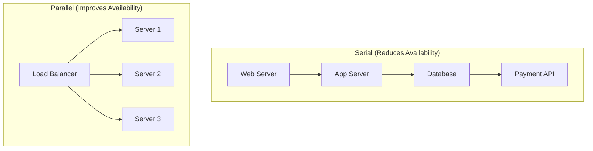
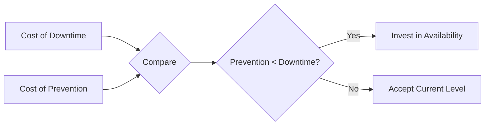
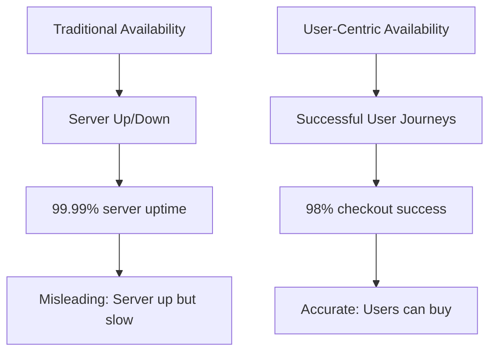
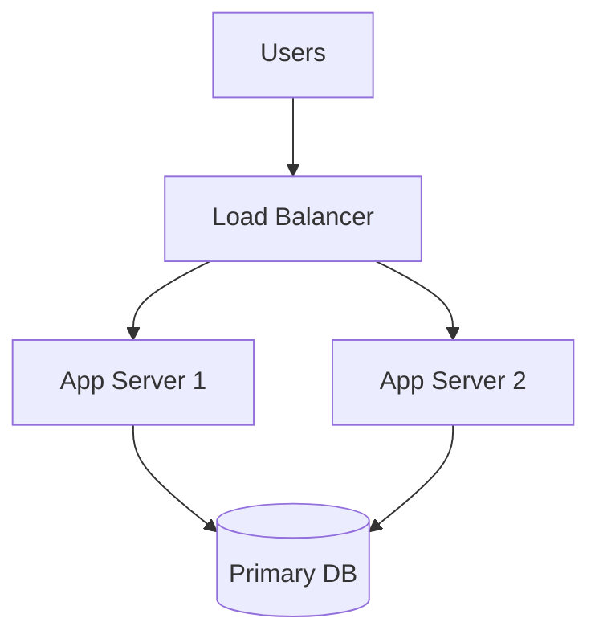
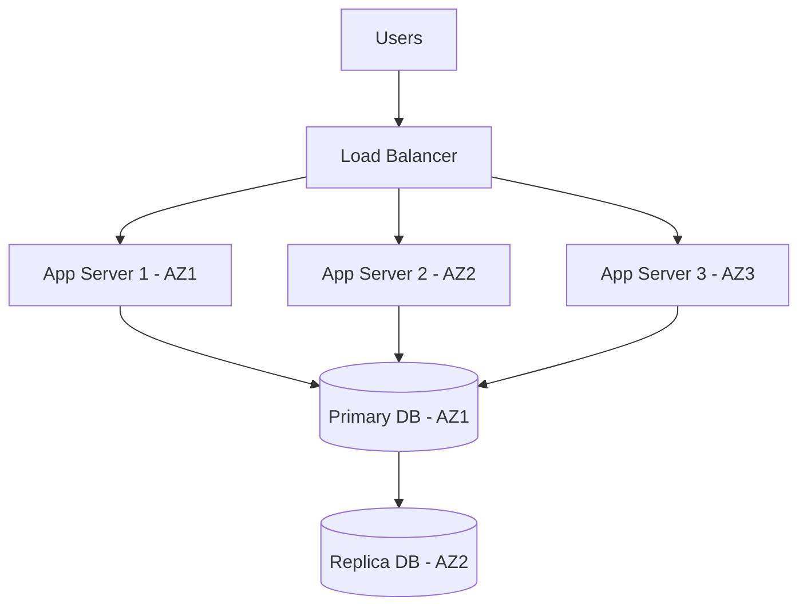
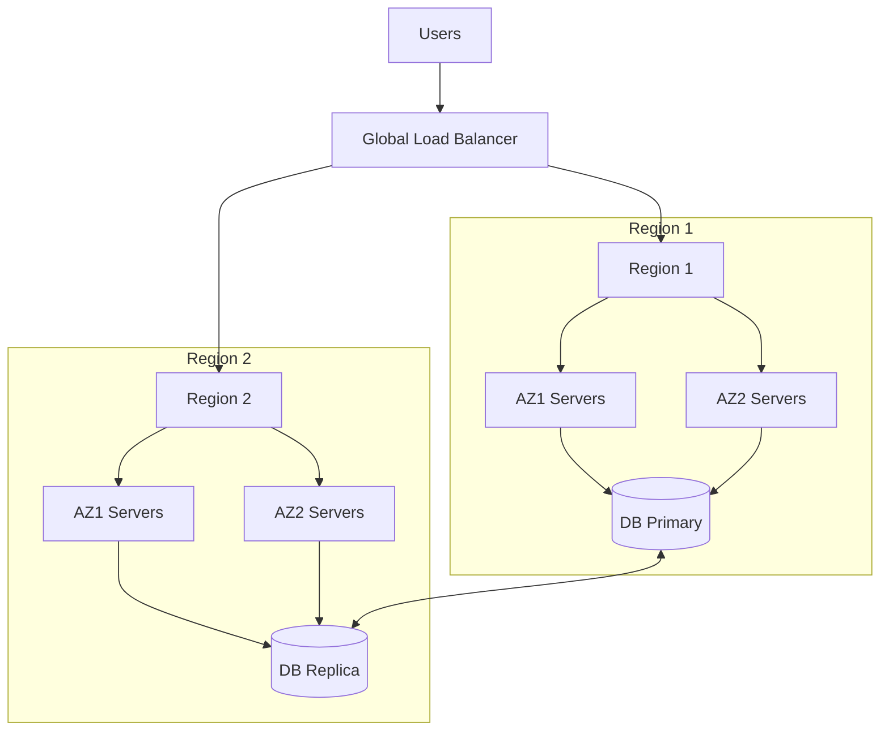

*[SLA]: Service Level Agreement
*[SLO]: Service Level Objective
*[SLI]: Service Level Indicator
*[MTTR]: Mean Time To Recovery
*[MTBF]: Mean Time Between Failures
*[RPO]: Recovery Point Objective
*[RTO]: Recovery Time Objective
*[HA]: High Availability
*[DR]: Disaster Recovery

> "We need five nines."

Most of us have heard this in planning meetings. It sounds impressive—99.999% availability, only 5 minutes of downtime per year. The kind of number you put in a pitch deck. The problem is that the people asking for five nines rarely understand what it costs, and almost never have the business case to justify it.

I once worked with a startup that was spending 40% of their infrastructure budget chasing 99.99% availability. They had multi-region failover, global load balancing, and a 24/7 on-call rotation that was burning out their small team. When I asked what revenue they lost during downtime, the answer was roughly $2,000 per hour. They were spending $150,000 annually to save maybe $15,000 in downtime costs. Meanwhile, their competitors were shipping features faster because they weren't over-engineering their infrastructure.

The worst part? Their users couldn't tell the difference. The app was a B2B tool used primarily during business hours. Most of their "downtime" happened at 3am when nobody was logged in anyway.

This is the trap: availability targeting becomes a badge of engineering honor rather than an economic decision. Every additional nine costs roughly 10x more than the previous one. Before committing to a target, you need to know exactly what you're buying and whether the business value justifies the investment.

<Callout type="warning">
This article argues that 99.9% is the right target for most services. If you're in financial trading, healthcare, or life safety systems—keep reading anyway. The cost-benefit framework still applies; your crossover point is just higher than most.
</Callout>

## The Math of Nines

### What the Numbers Actually Mean

Before diving into cost analysis, let's ground the discussion in concrete numbers. Availability percentages are abstract—stakeholders need to understand what they actually mean in terms of downtime.

| Availability | Annual Downtime | Monthly Downtime | Weekly Downtime |
|--------------|-----------------|------------------|-----------------|
| 99% (two nines) | 87.6 hours | 7.31 hours | 1.68 hours |
| 99.9% (three nines) | 8.77 hours | 43.83 minutes | 10.08 minutes |
| 99.95% | 4.38 hours | 21.92 minutes | 5.04 minutes |
| 99.99% (four nines) | 52.60 minutes | 4.38 minutes | 1.01 minutes |
| 99.999% (five nines) | 5.26 minutes | 26.30 seconds | 6.05 seconds |

Table: Availability percentages translated to actual downtime windows.

The jump from 99.9% to 99.99% looks small—just 0.09 percentage points. But in downtime terms, you're going from nearly 9 hours per year to under an hour. And getting that last nine from 99.99% to 99.999%? You're reducing downtime from 52 minutes to 5 minutes annually. The marginal improvement shrinks while the cost explodes.

### Calculating Composite Availability

Here's where the math gets uncomfortable. Your system's availability isn't determined by your best component—it's determined by multiplying all your components together. Every dependency in the critical path drags your overall availability down.

$$
A_{system} = A_1 \times A_2 \times A_3 \times ... \times A_n
$$

Let's say you have three services, each running at a respectable 99.9%:

```text
Example: Three 99.9% components in series
System availability = 0.999 × 0.999 × 0.999 = 0.997 (99.7%)

Three 99.9% components became one 99.7% system.
You lost almost a full "nine" just by having dependencies.
```

This is why microservices architectures often have worse availability than monoliths unless carefully designed. Every network hop, every service call, every database query is another multiplicative factor dragging your availability down.

<Callout type="info">
Your system availability cannot exceed your least available dependency. If your payment provider is 99.9%, your checkout flow cannot be 99.99% no matter how much you spend on your own infrastructure.
</Callout>

### Parallel vs. Serial Dependencies

The composite availability formula assumes serial dependencies—requests must pass through each component in sequence. But redundancy works in the opposite direction. When you have multiple components that can handle the same request, failures have to occur _simultaneously_ to cause an outage.


Figure: Serial dependencies multiply failure probability; parallel redundancy reduces it.

The formula for parallel availability inverts the logic—you multiply the _failure_ probabilities:

$$
A_{parallel} = 1 - (1 - A_1) \times (1 - A_2) \times ... \times (1 - A_n)
$$

This is where the magic happens:

```text
Example: Two 99% servers in parallel (either can serve traffic)
Availability = 1 - (0.01 × 0.01) = 1 - 0.0001 = 99.99%

Two cheap servers achieved what one expensive server could not.
```

This is the fundamental insight behind all high-availability architectures: redundancy is cheaper than perfection. Two mediocre servers behind a load balancer beat one expensive server every time. The key constraint is that the failures must be _independent_—if both servers share a network switch that fails, you don't get the parallel availability benefit.

## The Cost Curve

### Infrastructure Costs by Availability Tier

The "10x per nine" rule of thumb is surprisingly accurate when you look at real infrastructure costs. Each availability tier requires fundamentally different architectural approaches, not just more of the same hardware.

| Tier | Typical Architecture | Relative Cost |
|------|---------------------|---------------|
| 99% | Single region, basic monitoring | 1x (baseline) |
| 99.9% | Multi-AZ, load balancing, automated recovery | 2-3x |
| 99.95% | Active-passive DR, comprehensive monitoring | 4-6x |
| 99.99% | Multi-region active-active, global load balancing | 10-20x |
| 99.999% | Exotic redundancy, zero-downtime everything | 50-100x+ |

Table: Infrastructure cost multipliers by availability tier.

Here's what each tier actually looks like in practice. At **99%**, you're running single-region, single-zone infrastructure with a single database instance, manual failover, and basic uptime checks—roughly $500/month in infrastructure. At **99.9%**, you need multi-AZ deployment within a region, database replication with automated failover, and comprehensive APM—around $2,000/month.

The jump to **99.99%** is where things change fundamentally. You're no longer just adding redundancy within a region; you need multi-region deployment with global replication, automated cross-region failover, and a full observability stack. Infrastructure alone runs $15,000/month or more. And **99.999%** requires active-active global databases, instant automated failover, and predictive monitoring with continuous chaos engineering—$100,000+/month before you've hired anyone.

Notice the jump from three nines to four nines—you go from regional redundancy to global redundancy. That's not just more servers; it's fundamentally different complexity. You're now dealing with cross-region latency, data consistency across continents, and failure modes that don't exist in single-region deployments.

### Hidden Costs Beyond Infrastructure

Infrastructure is the visible cost. The hidden costs are often larger.

| Cost Category | Why It Scales | Example |
|---------------|---------------|---------|
| Engineering Time | More complex systems require more expertise | Senior SREs vs. junior ops |
| Testing | More failure modes to validate | Chaos engineering programs |
| On-Call | Tighter response requirements | 24/7 staffing vs. best-effort |
| Tooling | Better observability needed | $50k/year APM vs. free tier |
| Opportunity Cost | Time not spent on features | Every hour on HA is not on product |

Table: Hidden costs that increase with availability targets.

The on-call math alone can be decisive. To maintain a sustainable 24/7 on-call rotation with reasonable response times, you need at minimum 4-5 engineers. At $150k fully loaded cost per engineer, that's $600k-$750k annually just for the humans—before you've bought a single server. For a startup, that's often more than the entire infrastructure budget at the 99.9% tier.

<Callout type="danger">
The biggest hidden cost is opportunity cost. Engineering hours spent achieving 99.99% are hours not spent building features that might grow revenue faster than the avoided downtime costs.
</Callout>

### The Cost-Benefit Crossover

At some point, investing more in availability stops making economic sense. Finding that crossover point is the key decision.


Figure: Basic cost-benefit decision for availability investment.

The formula is straightforward:

$$
\text{Investment justified when: } \text{Cost of Downtime} \times \text{Downtime Reduction} > \text{Cost of Prevention}
$$

Let's make this concrete with a calculator:

```python title="availability_roi_calculator.py"
from dataclasses import dataclass

@dataclass
class AvailabilityAnalysis:
    current_availability: float  # e.g., 0.999
    target_availability: float   # e.g., 0.9999
    revenue_per_hour: float      # Revenue at risk during downtime
    cost_to_achieve: float       # Annual cost of improvement

def calculate_roi(analysis: AvailabilityAnalysis) -> dict:
    hours_per_year = 8760

    current_downtime_hours = hours_per_year * (1 - analysis.current_availability)
    target_downtime_hours = hours_per_year * (1 - analysis.target_availability)
    downtime_reduction_hours = current_downtime_hours - target_downtime_hours

    revenue_saved = downtime_reduction_hours * analysis.revenue_per_hour
    roi = (revenue_saved - analysis.cost_to_achieve) / analysis.cost_to_achieve

    return {
        "downtime_reduction_hours": downtime_reduction_hours,
        "revenue_saved": revenue_saved,
        "roi": roi,
    }

# Example: Should we go from 99.9% to 99.99%?
analysis = calculate_roi(AvailabilityAnalysis(
    current_availability=0.999,
    target_availability=0.9999,
    revenue_per_hour=10_000,  # $10k/hour during downtime
    cost_to_achieve=150_000,  # $150k/year for multi-region
))

# Result:
# downtime_reduction_hours: 7.88 hours (8.77h - 0.88h)
# revenue_saved: $78,800
# roi: -47% (costs more than it saves!)
```
Code: ROI calculator for availability investments showing when improvements are not justified.

This example is illuminating. Even at $10,000 per hour of lost revenue—which is substantial for most companies—the jump from 99.9% to 99.99% doesn't pay off. You'd spend $150k to save $78k. You'd need revenue at risk of roughly $19,000 per hour before that investment makes sense.

Most businesses don't have that math. E-commerce sites doing $50 million annually work out to about $5,700 per hour _on average_, and downtime rarely loses you 100% of that—customers often just come back later. The crossover point for four nines is higher than most teams realize.

## User Impact Analysis

### Not All Downtime Is Equal

The dirty secret of availability metrics is that they treat all minutes equally. A minute of downtime at 3am on a Sunday counts the same as a minute during Black Friday checkout rush. Your availability number doesn't distinguish between them—but your users absolutely do.

| Downtime Type | User Impact | Availability Impact |
|---------------|-------------|---------------------|
| 3am maintenance (low traffic) | Minimal | Same as peak hours |
| Peak hour outage | Severe | Same as off-hours |
| Degraded performance | Moderate | Often not counted |
| Partial outage (one feature) | Varies | Depends on measurement |

Table: Same availability number can mean very different user experiences.

This is why scheduled maintenance windows still make sense. If you can concentrate your allowed downtime into periods when users aren't around, your effective availability—what users actually experience—is much higher than your measured availability.

<Callout type="info">
A 99.9% availability measured 24/7 might mean all downtime happens during off-peak hours when nobody notices, or all during peak hours when everyone suffers. The number alone does not tell you.
</Callout>

### Measuring What Users Actually Experience

Infrastructure metrics lie. Your servers can report 99.99% uptime while users experience a broken checkout flow because one downstream service times out intermittently. The server is "up"—it's just not _useful_.


Figure: Infrastructure availability vs. user experience availability.

User-centric SLIs measure what actually matters: can users complete the actions they came to perform?

```yaml title="user-centric-slis.yaml"
# SLI example, typically expressed in OpenSLO format
slis:
  # Traditional (infrastructure-focused)
  server_availability:
    good: "http_response_code < 500"
    total: "all_requests"
    target: 99.99%

  # User-centric (experience-focused)
  checkout_success:
    good: "checkout_completed AND latency < 3s"
    total: "checkout_attempts"
    target: 99.5%

  search_experience:
    good: "search_returned_results AND latency < 500ms"
    total: "search_requests"
    target: 99.9%

  # The user-centric SLI often has a lower target
  # but is more meaningful for the business
```
Code: User-centric SLIs that measure actual experience, not just uptime.[^openslo]

[^openslo]: In practice, SLI/SLO definitions are often expressed in [OpenSLO](https://openslo.com/), a vendor-neutral specification for defining SLOs as code. OpenSLO lets you define reliability targets in a portable format that tools like Sloth, Nobl9, and others can consume—avoiding lock-in to any particular observability vendor.

Notice that the user-centric targets are often _lower_ than infrastructure targets. That's not a mistake. A 99.5% checkout success rate is harder to achieve than 99.99% server uptime, because it requires the entire stack—frontend, API, payment processor, inventory system—to work together successfully.

### User Tolerance Thresholds

Here's a truth that frees you from the five nines trap: users have a tolerance threshold, and improvements beyond that threshold are invisible to them. Nobody notices the difference between 99.95% and 99.99% availability. They notice slow pages. They notice missing features. They notice clunky UX.

| User Segment | Acceptable Unavailability | Reason |
|--------------|---------------------------|--------|
| Consumer app | ~30 min/month (99.9%) | Will retry, has alternatives |
| Business tool | ~5 min/month (99.99%) | Productivity impact |
| Financial trading | Seconds/year (99.999%+) | Every second costs money |
| Life safety systems | Near-zero | Lives at stake |

Table: Different user segments have different availability expectations.

Consumer applications sit firmly in the 99.9% tier. Your users have phones that crash, WiFi that drops, and browsers that freeze. They're accustomed to retrying. What they're _not_ accustomed to is waiting 8 seconds for a page to load, or finding the feature they need is missing.

> Nobody ever churned because your app was down for 5 minutes once a month. They churn because your app is slow every day, or lacks a feature they need, or your competitor shipped something better.
> — SRE retrospectives

## Setting Realistic Targets

### The SLO Setting Process

Setting availability targets is an iterative negotiation between what the business wants, what users need, what dependencies allow, and what you can afford. It's not a one-time decision—it's a process that surfaces hidden assumptions and forces alignment across engineering and business stakeholders.

The typical flow starts with business requirements, moves through user impact analysis and dependency constraints, then hits cost analysis. If the cost is affordable, you set the SLO and document it. If not—and this is where the real work happens—you negotiate a lower target and loop back through user impact analysis. Most teams start with aspirational targets, run the numbers, and realize they need to have uncomfortable conversations with stakeholders about what's actually achievable and affordable.

Those conversations are easier when you come prepared with specific questions.

### Questions to Ask Before Setting Targets

Before committing to an availability target, you need answers to questions that span business, technical, and organizational domains. This isn't bureaucracy—it's due diligence that prevents you from making promises you can't keep.

1. **Business Questions**
   - [ ] What is the revenue impact of one hour of downtime?
   - [ ] What is the revenue impact of degraded performance?
   - [ ] Are there contractual SLA requirements from customers?
   - [ ] What do competitors offer?
   - [ ] What is the reputational cost of publicized outages?

2. **Technical Questions**
   - [ ] What is our current measured availability?
   - [ ] What are our dependencies' SLAs?
   - [ ] What is our theoretical maximum given dependencies?
   - [ ] What architecture changes are needed for each tier?
   - [ ] What is the cost of each tier?

3. **Organizational Questions**
   - [ ] Do we have the engineering expertise?
   - [ ] Can we staff 24/7 on-call if needed?
   - [ ] Is leadership willing to prioritize reliability over features?
   - [ ] Do we have budget for the tooling required?

4. **Reality Check**
   - [ ] Is the target achievable given our dependencies?
   - [ ] Is the cost justified by the business value?
   - [ ] Are we measuring the right thing (user experience vs. uptime)?
   - [ ] Have we accounted for planned maintenance?

The "Reality Check" section is where most targets get revised downward. It's better to have that conversation before making commitments than after missing them.

### Dependency-Constrained Targets

Your availability ceiling isn't set by your ambition—it's set by your weakest critical dependency. If your payment processor guarantees 99.95% and your checkout flow requires payment processing, you physically cannot offer better than 99.95% on checkout, no matter how perfect your own systems are.

Consider a checkout service with four dependencies:

- **Payment gateway** (external): 99.95% SLA, _blocking_—checkout fails without it
- **Inventory service** (internal): 99.9% SLO, _blocking_—can't sell what you can't verify
- **Email service** (internal): 99.5% SLO, _non-blocking_—can queue and retry confirmations later
- **Analytics** (internal): 99% SLO, _non-blocking_—fire and forget

The distinction between blocking and non-blocking dependencies is crucial. Email confirmation can fail without breaking checkout—you queue it and retry later. But if the payment gateway is down, checkout is down, period. Only blocking dependencies factor into your availability ceiling.

For the blocking dependencies, the math is multiplicative:

$$
\text{Max achievable} = 0.9995 \times 0.999 = 0.9985 \text{ (99.85%)}
$$

Even with perfect internal systems, checkout cannot exceed 99.85%. Setting a 99.99% SLO would be dishonest. A realistic target would be 99.8%—leaving buffer for your own issues on top of dependency constraints.

<Callout type="warning">
Do not set availability targets higher than your dependencies allow. A 99.99% SLO when your payment provider offers 99.95% is a promise you cannot keep.
</Callout>

## Architecture Patterns by Tier

Each availability tier requires a fundamentally different architecture—not just more of the same. Understanding what each tier actually looks like helps you make informed decisions about where to invest.

### Two Nines (99%): Keep It Simple

At 99%, you're allowed about 87 hours of downtime per year. That's generous enough that you can handle most failures manually, take scheduled maintenance windows, and still have budget left over for the occasional unexpected outage.


Figure: Simple two-nines architecture with basic redundancy.

**Characteristics:**

- Single region, single availability zone acceptable
- Basic load balancing (can be DNS-based)
- Single database with backup/restore
- Manual intervention expected during failures
- On-call response time: hours acceptable

This is where most early-stage startups should be. You're not building for scale yet—you're building to learn what customers want. Every hour spent on redundancy is an hour not spent on product discovery.

### Three Nines (99.9%): Professional Grade

At 99.9%, you're down to 8.77 hours of allowed downtime per year. That's still a meaningful budget, but it means you can no longer rely on manual intervention for common failures. Automation becomes necessary.


Figure: Three-nines architecture with multi-AZ deployment.

**Additions from 99%:**

- Multi-availability zone deployment
- Database replication with automated failover
- Health checks and automated instance replacement
- Comprehensive monitoring and alerting
- On-call response time: minutes required

This is the sweet spot for most SaaS products. It's achievable with standard cloud provider tools, doesn't require exotic architecture, and provides reliability that users perceive as "always works." Going beyond this tier requires deliberate justification.

### Four Nines (99.99%): Serious Business

At 99.99%, you're allowed only 52 minutes of downtime per year. That's less than one incident. Any regional outage—and cloud providers have them—could blow your entire annual budget in a single event.


Figure: Four-nines architecture with multi-region deployment.

**Additions from 99.9%:**

- Multi-region deployment
- Global load balancing with health-based routing
- Cross-region database replication
- Automated regional failover
- Zero-downtime deployments required
- 24/7 on-call with &lt;15 minute response

The jump from three nines to four nines is where costs explode. You're not just adding more servers—you're fundamentally changing how you operate. Cross-region data replication alone introduces complexity that many teams underestimate: latency, consistency tradeoffs, split-brain scenarios.

### Five Nines (99.999%): Exotic Territory

At 99.999%, you're allowed 5.26 minutes of downtime per year. That's not per incident—that's _total_. A single page load timeout could consume a meaningful portion of your annual budget.

<Callout type="danger">
Five nines (5.26 minutes/year of downtime) means you cannot have a single failure that takes more than a few seconds to recover from. This requires exotic architectures, massive redundancy, and organizational commitment that most companies cannot justify.
</Callout>

**Requirements for 99.999%:**

- Active-active multi-region (not failover, _simultaneous_)
- No single points of failure anywhere
- Sub-second automated recovery
- Chaos engineering as standard practice
- Dedicated reliability engineering team
- Feature velocity sacrificed for stability

The organizational requirements are as demanding as the technical ones. You need executive commitment that reliability trumps feature delivery. You need a dedicated SRE team that does nothing but reliability work. You need a culture where "move fast and break things" is heresy.

Most companies claiming five nines are either lying, measuring incorrectly, or spending far more than the reliability is worth. Before pursuing this tier, ask: is there genuinely $2M+ per year in value at risk from an additional 47 minutes of downtime?

### When Five Nines Is Actually Justified

There are domains where five nines isn't overkill—it's table stakes. Financial trading systems measure downtime in dollars per millisecond; a one-second outage during market hours can cost more than a year of infrastructure. Healthcare systems controlling medication dispensing or patient monitoring can't afford "we'll retry in a few minutes." Air traffic control, nuclear plant monitoring, emergency services dispatch—these systems have regulatory and safety requirements that make the ROI calculation irrelevant.

The pattern in these cases: the cost of failure isn't measured in lost revenue, it's measured in lives, regulatory penalties, or market position that can never be recovered. If your system falls into this category, you already know it. If you're not sure, it probably doesn't.

## The Business Conversation

### Presenting Availability Tradeoffs

Business stakeholders don't care about architecture diagrams or failure modes. They care about risk, cost, and competitive positioning. Present availability as a menu of options with business-relevant tradeoffs.

| Option | Availability | Annual Downtime | Total Cost | Best For |
|--------|--------------|-----------------|------------|----------|
| A | 99.9% | 8.77 hours | $50k/year | Most SaaS products |
| B | 99.95% | 4.38 hours | $120k/year | B2B with SLA requirements |
| C | 99.99% | 52 minutes | $400k/year | Critical business systems |
| D | 99.999% | 5 minutes | $2M+/year | Financial, healthcare |

Table: Availability options with total annual cost (infrastructure + people + tooling + opportunity cost).

Frame it as investment decisions, not technical requirements. "Option B costs $70k more than Option A and reduces downtime by 4 hours. At our revenue rate, that's worth it if we value each hour of uptime at $17,500 or more."

### When to Push Back

Not every availability request deserves a "yes." Part of engineering leadership is knowing when to push back—and how to do it constructively.

**When to push back on five nines:**

1. **Revenue doesn't justify it** — Calculate downtime hours saved multiplied by revenue per hour. If this is less than the cost, the math doesn't work.

2. **Dependencies don't support it** — "We cannot exceed our payment provider's 99.95%" is a constraint, not an excuse. Show the composite availability math.

3. **Team can't sustain it** — 24/7 on-call requires 4-5 engineers minimum for a sustainable rotation. Burnout is a reliability risk too.

4. **Better alternatives exist** — "We could improve from 99.9% to 99.95% for $70k, or add Feature X for $70k. Which creates more value?"

**How to present alternatives:**

Instead of "We can't do five nines," try "Here's what we can achieve at each investment level, and here's the business impact of each option." The first sounds like an engineering limitation. The second sounds like strategic thinking.

### Documenting the Decision

Whatever you decide, write it down. Availability targets have a way of becoming organizational mythology—"we're a five nines shop" gets repeated in hallways long after anyone remembers why. A decision record captures the reasoning so future teams can revisit it when circumstances change.

A good availability decision record includes:

1. **Context**: What triggered the discussion? Was it a customer request, a competitive claim, an outage, or a planning exercise?

2. **Business impact analysis**: What's the actual revenue at risk during downtime? What's current availability and what does that cost?

3. **Options considered**: Present at least three tiers with their downtime, lost revenue, infrastructure cost, and net cost. Make the tradeoffs explicit.

4. **Dependency constraints**: What's the maximum achievable given external dependencies? This often eliminates options immediately.

5. **Decision and rationale**: State the chosen target and _why_. "99.99% is not achievable given our payment gateway's 99.95% SLA" is more useful than "we chose 99.9%."

6. **Approvals**: Get sign-off from engineering leadership, product, and ideally finance. Availability targets are business decisions, not just technical ones.

The most important part is the rationale. When someone asks "why aren't we five nines?" in two years, the answer is documented: because our dependencies don't support it, and the cost exceeds the benefit by 3x.

## Conclusion

The next time someone says "we need five nines," you now have the tools to have a real conversation instead of nodding along.

Start with the math: each additional nine costs roughly 10x more than the previous one. Then calculate your composite availability—your system can't exceed its weakest critical dependency, and most payment processors, identity providers, and cloud services sit around 99.9-99.95%. Factor in the hidden costs: the 24/7 on-call rotation, the senior SREs, the observability tooling, the opportunity cost of features not built.

Then ask the hard question: what's the actual business value of that additional availability? For most SaaS products, the answer is less than the cost. The crossover point where four nines pays off is higher than most teams realize—often requiring $19,000 per hour of revenue at risk before the math works.

Measure what matters to users, not what's easy to measure. Server uptime is a vanity metric; successful user journeys are the real SLI. And remember that users have tolerance thresholds—nobody churns over 5 minutes of monthly downtime, but they absolutely churn over slow pages and missing features.

For most services, 99.9% is the right answer. It's achievable with standard cloud tools, sustainable for normal-sized teams, and provides reliability that users perceive as "always works." Going beyond requires deliberate justification, not engineering ego.

<Callout type="success">
The goal is not maximum availability—it's appropriate availability. Spend your reliability budget where it creates the most value, and accept that some downtime is not just acceptable but economically rational.
</Callout>
