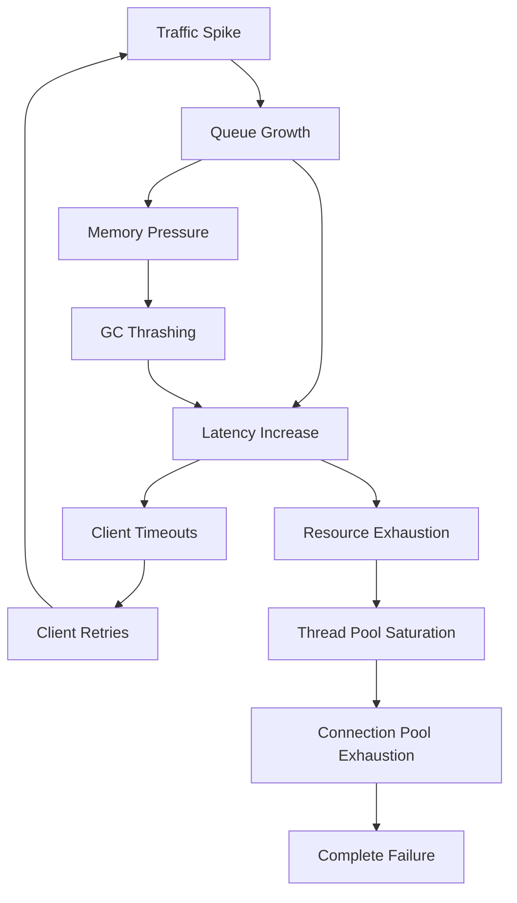
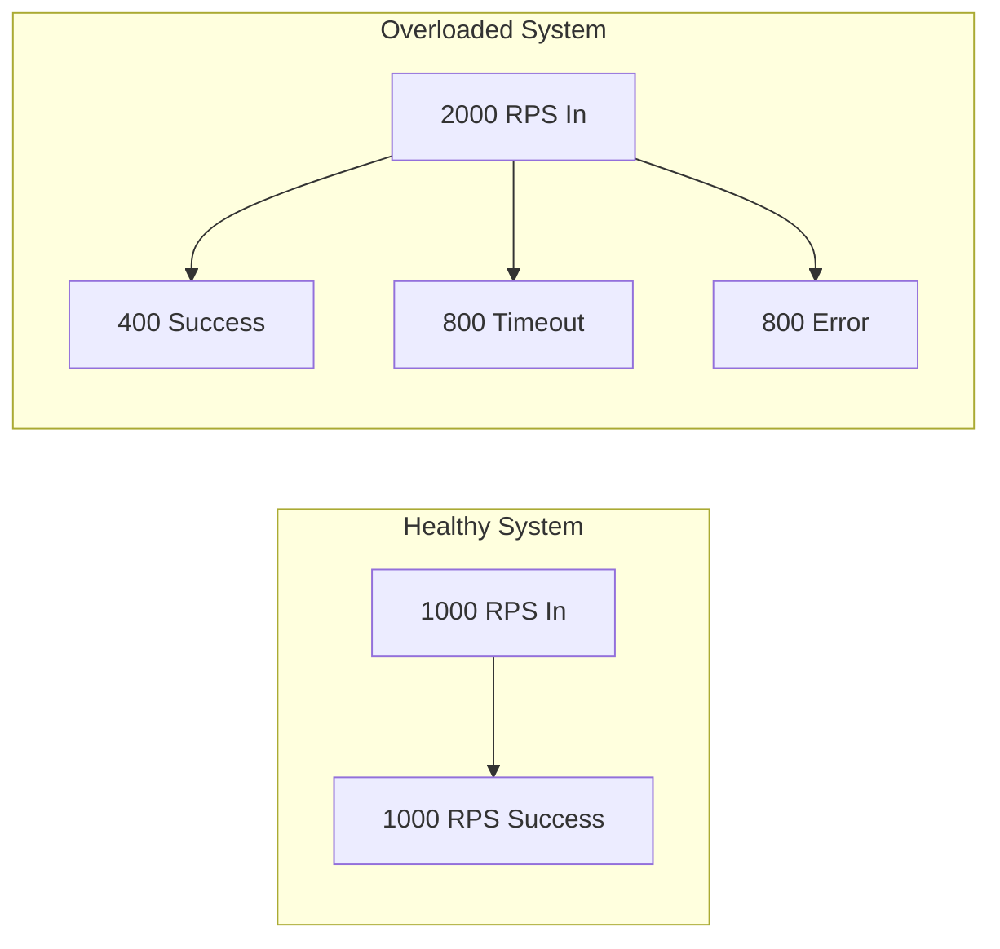
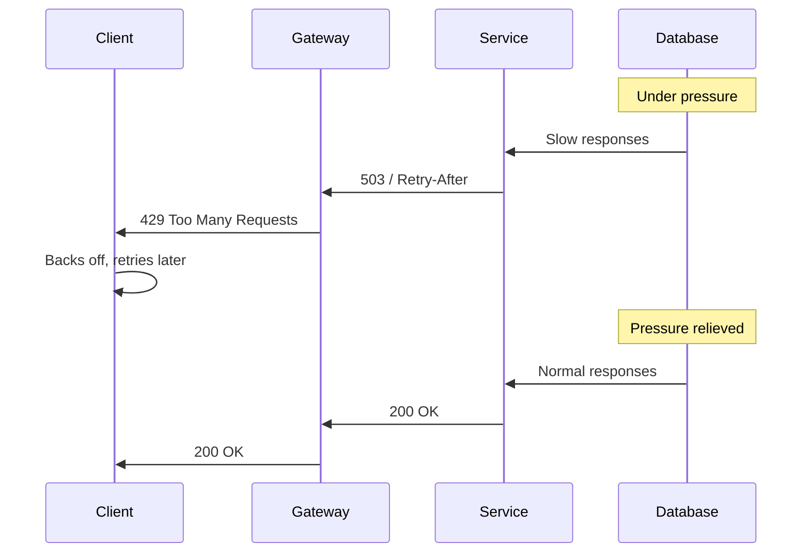
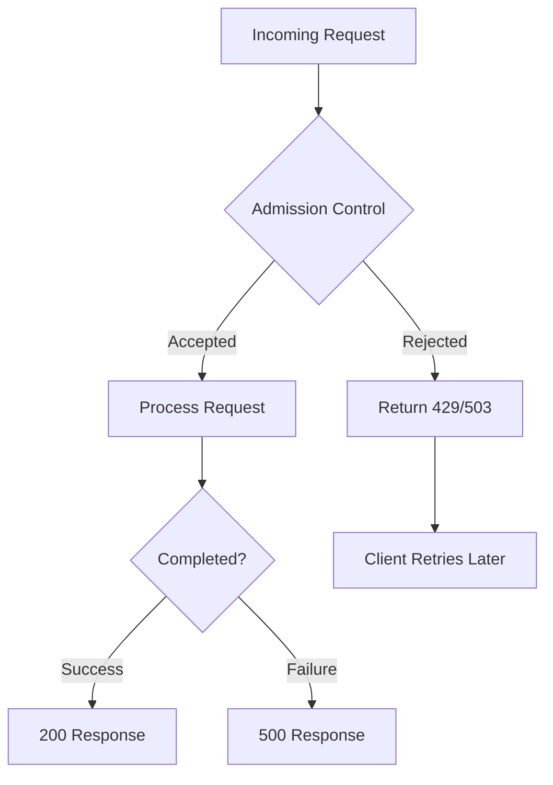
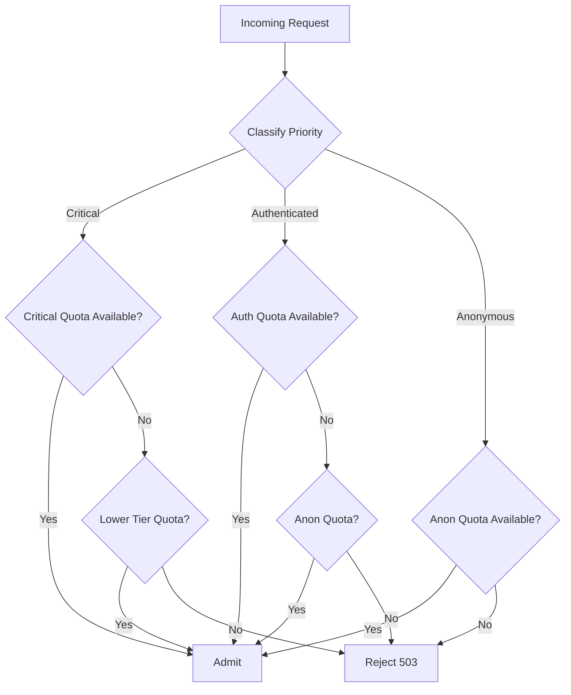
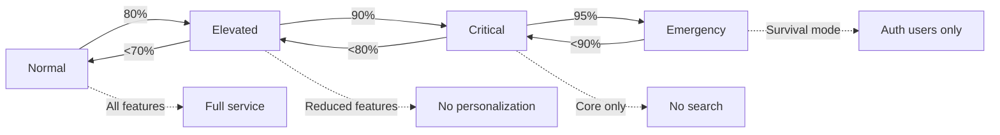
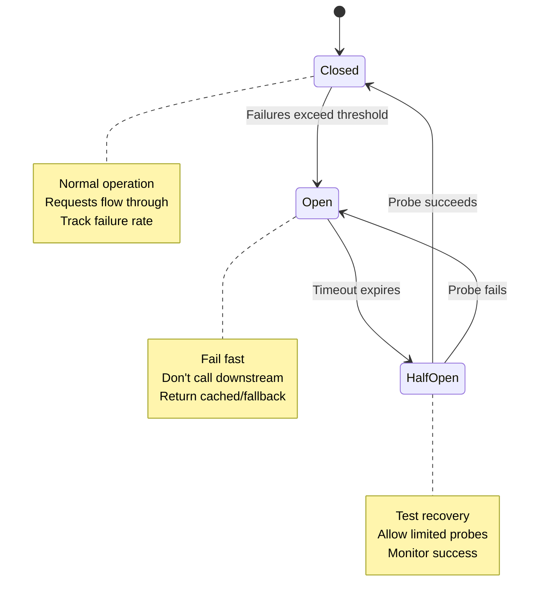
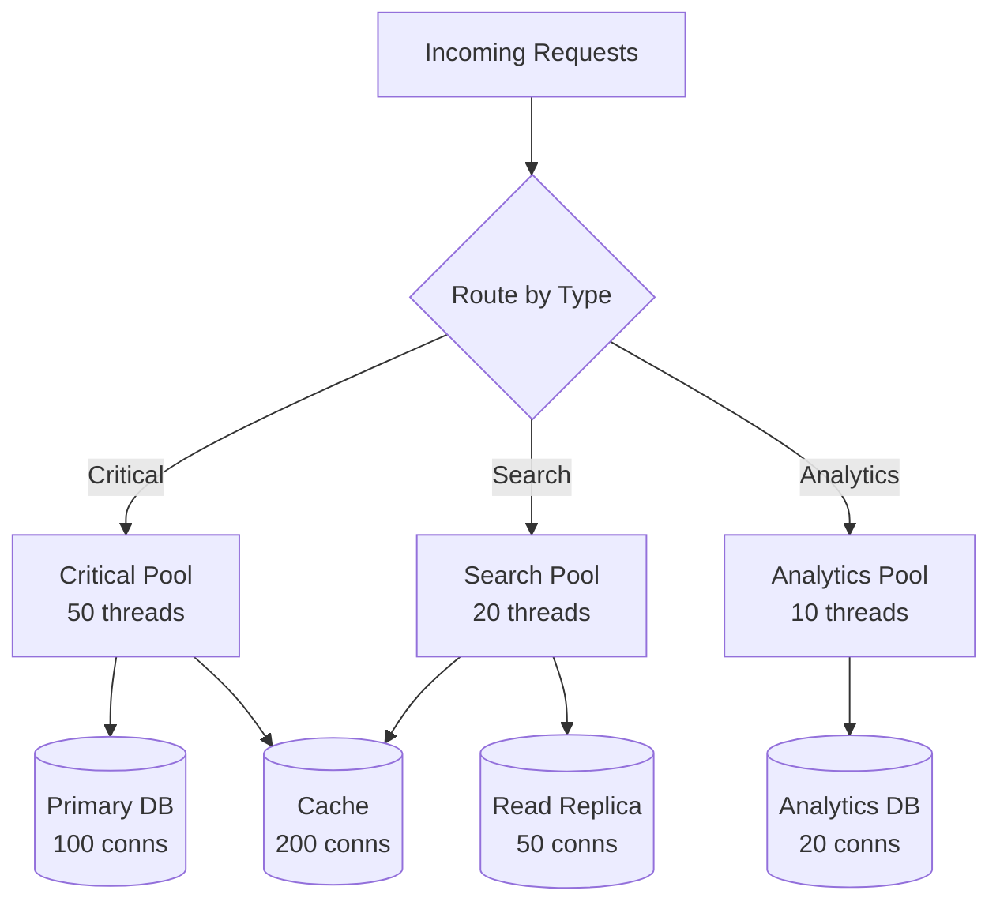

*[QoS]: Quality of Service
*[LIFO]: Last In, First Out
*[FIFO]: First In, First Out
*[CoDel]: Controlled Delay
*[AIMD]: Additive Increase Multiplicative Decrease
*[RTT]: Round Trip Time
*[P99]: 99th Percentile Latency
*[SLO]: Service Level Objective
*[RPS]: Requests Per Second

# Backpressure Patterns: Staying Alive Under Load

## Introduction

Brief overview of why systems fail catastrophically under load: without explicit overload handling, systems accept work they cannot complete, queues grow unbounded, latency spikes, timeouts cascade, and a recoverable spike becomes a prolonged outage. This section frames backpressure as a survival mechanism—the ability to say "no" gracefully.

_Include a real-world scenario: a flash sale brings 10x normal traffic, the system accepts all requests, database connections exhaust, response times climb from 200ms to 30 seconds, clients retry aggressively, and what could have been a 15-minute degradation becomes a 4-hour outage._

<Callout type="warning">
A system without backpressure will accept work until it collapses. The goal is not to handle unlimited load—it is to handle your design capacity reliably and degrade gracefully beyond it.
</Callout>

## Understanding Overload

### The Anatomy of Cascading Failure

Explain how overload propagates through a system and why it tends to get worse rather than self-correcting.


Figure: The cascading failure loop where overload compounds itself through retries and resource exhaustion.

### Little's Law and Queue Theory

Explain the fundamental relationship between throughput, latency, and queue depth.

$$
L = \lambda \times W
$$

Where:
- $L$ = average number of items in system (queue depth)
- $\lambda$ = arrival rate (requests per second)
- $W$ = average time in system (latency)

```text
Example: System processing 100 RPS with 200ms latency
Queue depth = 100 × 0.2 = 20 requests in flight

Same system under overload: 500 RPS arriving, still processing 100 RPS
Effective latency grows as queue builds
After 1 minute: 24,000 requests queued, latency > 4 minutes
```

<Callout type="info">
Little's Law explains why overload causes latency to explode. When arrival rate exceeds processing rate, queue depth grows without bound, and every queued request adds to everyone's wait time.
</Callout>

### Goodput vs. Throughput

Distinguish between work attempted and work successfully completed.

| Metric | Definition | Under Normal Load | Under Overload |
|--------|------------|-------------------|----------------|
| Throughput | Requests processed | 1000 RPS | 1200 RPS |
| Goodput | Successful responses | 1000 RPS | 400 RPS |
| Badput | Failed/timed out | 0 RPS | 800 RPS |

Table: Throughput can increase during overload while goodput collapses.


Figure: Accepting more load than capacity results in worse outcomes than rejecting excess load.

## Backpressure Mechanisms

### What Is Backpressure?

Define backpressure as the propagation of flow control signals from consumers back to producers.


Figure: Backpressure propagates from the constrained resource back to the client.

### Explicit vs. Implicit Backpressure

Compare different backpressure signaling mechanisms.

| Type | Mechanism | Example | Pros | Cons |
|------|-----------|---------|------|------|
| Explicit | Protocol-level signals | HTTP 429, TCP flow control | Clear signal, client can react | Requires client cooperation |
| Implicit | Increased latency | Slow responses | No implementation needed | Clients may not notice, retry |
| Connection-based | Refuse connections | Connection limits | Hard boundary | Poor client experience |
| Queue-based | Bounded queues | Reject when full | Predictable latency | Work is lost |

Table: Backpressure mechanisms and their tradeoffs.

### TCP Flow Control as Inspiration

Explain how TCP's flow control provides a model for application-level backpressure.

```text
TCP Flow Control:
1. Receiver advertises window size (how much it can accept)
2. Sender limits in-flight data to window size
3. As receiver processes data, window opens
4. If receiver is slow, window shrinks to zero (backpressure)

Application equivalent:
1. Service advertises capacity (rate limits, queue depth)
2. Clients limit concurrent requests
3. As service recovers, capacity opens
4. If service is slow, clients back off
```

## Admission Control

### The Bouncer Pattern

Explain admission control as deciding upfront whether to accept work, rather than accepting and failing later.


Figure: Admission control rejects work at the door rather than accepting and failing.

<Callout type="success">
It is better to reject 20% of requests immediately than to accept 100% and fail 40% after wasting resources on them. Fast rejection preserves capacity for requests you can actually serve.
</Callout>

### Admission Control Strategies

Detail different approaches to deciding which requests to admit.

```typescript title="admission-control-strategies.ts"
interface AdmissionController {
  shouldAdmit(request: Request): boolean;
}

// Strategy 1: Simple rate limiting
class RateLimitAdmission implements AdmissionController {
  private tokens: number;
  private readonly maxTokens: number;
  private readonly refillRate: number;

  shouldAdmit(request: Request): boolean {
    if (this.tokens > 0) {
      this.tokens--;
      return true;
    }
    return false;
  }
}

// Strategy 2: Concurrency limiting
class ConcurrencyAdmission implements AdmissionController {
  private inFlight: number = 0;
  private readonly maxConcurrent: number;

  shouldAdmit(request: Request): boolean {
    if (this.inFlight < this.maxConcurrent) {
      this.inFlight++;
      return true;
    }
    return false;
  }
}

// Strategy 3: Latency-based (adaptive)
class LatencyAdmission implements AdmissionController {
  private recentLatencies: number[] = [];
  private readonly targetLatency: number;

  shouldAdmit(request: Request): boolean {
    const p99 = this.calculateP99();
    // Reject more aggressively as latency increases
    const admitProbability = this.targetLatency / Math.max(p99, this.targetLatency);
    return Math.random() < admitProbability;
  }
}

// Strategy 4: Queue depth based
class QueueDepthAdmission implements AdmissionController {
  private queueDepth: number = 0;
  private readonly maxQueueDepth: number;

  shouldAdmit(request: Request): boolean {
    return this.queueDepth < this.maxQueueDepth;
  }
}
```
Code: Different admission control strategies with varying tradeoffs.

### Priority-Based Admission

Explain how to implement tiered admission control that protects important traffic.

```yaml title="priority-admission-config.yaml"
admission_control:
  enabled: true

  tiers:
    - name: critical
      match:
        - path: "/health"
        - path: "/api/payments/*"
        - header: "X-Priority: critical"
      quota_percentage: 30  # Reserve 30% capacity

    - name: authenticated
      match:
        - header: "Authorization: Bearer *"
      quota_percentage: 50  # Reserve 50% capacity

    - name: anonymous
      match:
        - default: true
      quota_percentage: 20  # Only 20% for anonymous

  # Under overload, shed in reverse priority order
  shedding_order:
    - anonymous      # Shed first
    - authenticated  # Shed second
    - critical       # Shed last (or never)
```
Code: Priority-based admission control configuration.


Figure: Priority admission allows critical traffic to borrow from lower-priority quotas.

## Load Shedding

### What to Shed and When

Define load shedding as the active dropping of work to preserve system stability.

| Shedding Strategy | When to Use | Tradeoff |
|-------------------|-------------|----------|
| Random | Simple implementation | May drop important requests |
| LIFO (newest first) | Reduce queuing latency | Unfair to new arrivals |
| FIFO (oldest first) | Likely already timed out | Wasted work on old requests |
| Priority-based | Protect important traffic | Complexity, starvation risk |
| Cost-based | Protect expensive operations | Requires cost tracking |

Table: Load shedding strategies with their use cases and tradeoffs.

### LIFO Shedding: Drop the Newest

Explain why dropping newest requests can be better than FIFO during overload.

```text
Scenario: Queue has 100 requests, processing takes 100ms each

FIFO shedding (traditional):
- Request 1 (oldest): waited 10 seconds, will be served
- Request 100 (newest): will wait 10+ seconds, likely timeout
- Client already gave up on request 1, wasted work

LIFO shedding (counterintuitive but effective):
- Request 100 (newest): rejected immediately, client can retry
- Request 1 (oldest): served, but client may have given up
- Better: CoDel-style approach that considers wait time
```

<Callout type="info">
LIFO shedding sounds unfair but often produces better outcomes. A request that just arrived and gets rejected can be retried immediately. A request that waited 30 seconds and finally gets served may find the client already gave up.
</Callout>

### CoDel: Controlled Delay

Explain the CoDel algorithm for intelligent queue management.

```typescript title="codel-queue.ts"
interface CoDelConfig {
  targetDelay: number;      // Target queuing delay (e.g., 5ms)
  interval: number;         // Observation interval (e.g., 100ms)
}

class CoDelQueue<T> {
  private queue: Array<{ item: T; enqueueTime: number }> = [];
  private dropping: boolean = false;
  private firstAboveTime: number = 0;
  private dropNext: number = 0;
  private count: number = 0;

  constructor(private config: CoDelConfig) {}

  enqueue(item: T): void {
    this.queue.push({ item, enqueueTime: Date.now() });
  }

  dequeue(): T | null {
    if (this.queue.length === 0) return null;

    const entry = this.queue.shift()!;
    const sojournTime = Date.now() - entry.enqueueTime;

    if (sojournTime < this.config.targetDelay) {
      // Queue delay is acceptable
      this.firstAboveTime = 0;
      this.dropping = false;
      return entry.item;
    }

    // Queue delay exceeds target
    if (this.firstAboveTime === 0) {
      this.firstAboveTime = Date.now();
    } else if (Date.now() - this.firstAboveTime > this.config.interval) {
      // Been above target for too long, start dropping
      this.dropping = true;
      this.count++;
      this.dropNext = Date.now() + this.config.interval / Math.sqrt(this.count);
    }

    if (this.dropping && Date.now() >= this.dropNext) {
      // Drop this packet and schedule next drop
      this.count++;
      this.dropNext = Date.now() + this.config.interval / Math.sqrt(this.count);
      return null; // Dropped
    }

    return entry.item;
  }
}
```
Code: CoDel (Controlled Delay) queue implementation that drops based on sojourn time.

### Graceful Degradation Tiers

Design a multi-tier degradation strategy.

```yaml title="graceful-degradation-tiers.yaml"
degradation_tiers:
  normal:
    trigger: "load < 80%"
    features:
      - full_search_results
      - personalized_recommendations
      - real_time_analytics
      - detailed_error_messages

  elevated:
    trigger: "load 80-90%"
    actions:
      - disable: personalized_recommendations
      - reduce: search_results_to_10
      - cache: aggressive_caching
    features:
      - basic_search
      - cached_recommendations
      - delayed_analytics

  critical:
    trigger: "load 90-95%"
    actions:
      - disable: search
      - disable: analytics
      - static: serve_cached_pages
    features:
      - core_transactions_only
      - static_content
      - essential_apis_only

  emergency:
    trigger: "load > 95%"
    actions:
      - shed: anonymous_traffic
      - shed: non_critical_apis
      - static: full_static_mode
    features:
      - authenticated_users_only
      - payment_processing
      - health_endpoints
```
Code: Multi-tier graceful degradation configuration.


Figure: Degradation tiers with hysteresis to prevent oscillation.

## Client Communication

### HTTP Status Codes for Overload

Explain the correct HTTP status codes for communicating overload to clients.

| Status Code | Meaning | When to Use | Client Action |
|-------------|---------|-------------|---------------|
| 429 | Too Many Requests | Rate limit exceeded | Back off, retry with delay |
| 503 | Service Unavailable | Temporary overload | Retry after delay |
| 504 | Gateway Timeout | Upstream timeout | May retry |
| 507 | Insufficient Storage | Queue/buffer full | Reduce request rate |

Table: HTTP status codes for overload scenarios.

### Retry-After Header

Explain how to use the Retry-After header effectively.

```typescript title="retry-after-middleware.ts"
import { Request, Response, NextFunction } from 'express';

interface OverloadState {
  isOverloaded: boolean;
  estimatedRecoverySeconds: number;
  currentLoad: number;
}

function getOverloadState(): OverloadState {
  // Implementation that checks system metrics
  return {
    isOverloaded: true,
    estimatedRecoverySeconds: 30,
    currentLoad: 0.95,
  };
}

function overloadMiddleware(req: Request, res: Response, next: NextFunction) {
  const state = getOverloadState();

  if (!state.isOverloaded) {
    return next();
  }

  // Calculate retry delay based on load
  const retryAfter = Math.min(
    state.estimatedRecoverySeconds,
    Math.ceil(state.currentLoad * 60) // Max 60 seconds
  );

  res.setHeader('Retry-After', retryAfter);
  res.setHeader('X-RateLimit-Remaining', '0');
  res.setHeader('X-RateLimit-Reset', Date.now() + retryAfter * 1000);

  // Include machine-readable details
  res.status(503).json({
    error: 'service_unavailable',
    message: 'Service is temporarily overloaded',
    retry_after: retryAfter,
    details: {
      current_load: state.currentLoad,
      estimated_recovery: `${retryAfter}s`,
    },
  });
}
```
Code: Middleware that returns informative overload responses with Retry-After headers.

<Callout type="warning">
Always include a Retry-After header when returning 429 or 503. Without it, clients have no guidance and may retry immediately, making the overload worse.
</Callout>

### Client-Side Backoff Patterns

Explain how clients should respond to backpressure signals.

```typescript title="client-backoff.ts"
interface BackoffConfig {
  initialDelayMs: number;
  maxDelayMs: number;
  multiplier: number;
  jitter: number;  // 0-1, percentage of randomization
}

class ExponentialBackoff {
  private attempt: number = 0;

  constructor(private config: BackoffConfig) {}

  getNextDelay(retryAfterHeader?: string): number {
    // Honor server's Retry-After if provided
    if (retryAfterHeader) {
      const serverDelay = parseInt(retryAfterHeader, 10) * 1000;
      if (!isNaN(serverDelay)) {
        return this.addJitter(serverDelay);
      }
    }

    // Calculate exponential backoff
    const exponentialDelay = this.config.initialDelayMs *
      Math.pow(this.config.multiplier, this.attempt);
    const cappedDelay = Math.min(exponentialDelay, this.config.maxDelayMs);

    this.attempt++;
    return this.addJitter(cappedDelay);
  }

  private addJitter(delay: number): number {
    const jitterRange = delay * this.config.jitter;
    const jitter = (Math.random() - 0.5) * 2 * jitterRange;
    return Math.max(0, delay + jitter);
  }

  reset(): void {
    this.attempt = 0;
  }
}

// Usage
const backoff = new ExponentialBackoff({
  initialDelayMs: 1000,
  maxDelayMs: 60000,
  multiplier: 2,
  jitter: 0.25,
});

async function fetchWithBackoff(url: string, maxRetries: number = 5) {
  for (let i = 0; i < maxRetries; i++) {
    try {
      const response = await fetch(url);

      if (response.status === 429 || response.status === 503) {
        const retryAfter = response.headers.get('Retry-After');
        const delay = backoff.getNextDelay(retryAfter ?? undefined);
        console.log(`Rate limited, waiting ${delay}ms before retry`);
        await sleep(delay);
        continue;
      }

      backoff.reset();
      return response;
    } catch (error) {
      const delay = backoff.getNextDelay();
      console.log(`Request failed, waiting ${delay}ms before retry`);
      await sleep(delay);
    }
  }

  throw new Error(`Failed after ${maxRetries} retries`);
}
```
Code: Client-side exponential backoff with jitter and Retry-After support.

## Implementation Patterns

### Circuit Breakers for Downstream Protection

Explain how circuit breakers protect against downstream failures cascading upstream.


Figure: Circuit breaker state machine for downstream protection.

```typescript title="circuit-breaker.ts"
enum CircuitState {
  CLOSED = 'closed',
  OPEN = 'open',
  HALF_OPEN = 'half_open',
}

interface CircuitBreakerConfig {
  failureThreshold: number;      // Failures before opening
  successThreshold: number;      // Successes to close from half-open
  timeout: number;               // Time in open state before half-open
  windowSize: number;            // Time window for counting failures
}

class CircuitBreaker {
  private state: CircuitState = CircuitState.CLOSED;
  private failures: number = 0;
  private successes: number = 0;
  private lastFailureTime: number = 0;
  private openTime: number = 0;

  constructor(
    private name: string,
    private config: CircuitBreakerConfig,
  ) {}

  async execute<T>(operation: () => Promise<T>, fallback?: () => T): Promise<T> {
    if (this.state === CircuitState.OPEN) {
      if (Date.now() - this.openTime > this.config.timeout) {
        this.state = CircuitState.HALF_OPEN;
        this.successes = 0;
      } else {
        // Circuit is open, fail fast
        if (fallback) return fallback();
        throw new Error(`Circuit ${this.name} is open`);
      }
    }

    try {
      const result = await operation();
      this.onSuccess();
      return result;
    } catch (error) {
      this.onFailure();
      if (fallback) return fallback();
      throw error;
    }
  }

  private onSuccess(): void {
    this.failures = 0;
    if (this.state === CircuitState.HALF_OPEN) {
      this.successes++;
      if (this.successes >= this.config.successThreshold) {
        this.state = CircuitState.CLOSED;
      }
    }
  }

  private onFailure(): void {
    this.failures++;
    this.lastFailureTime = Date.now();

    if (this.failures >= this.config.failureThreshold) {
      this.state = CircuitState.OPEN;
      this.openTime = Date.now();
    }
  }
}
```
Code: Circuit breaker implementation with closed, open, and half-open states.

### Bulkheads for Isolation

Explain how bulkhead patterns prevent one failure from consuming all resources.

```yaml title="bulkhead-config.yaml"
bulkheads:
  # Separate thread pools for different operations
  thread_pools:
    critical_api:
      size: 50
      queue_size: 100
      timeout: 5s

    search:
      size: 20
      queue_size: 50
      timeout: 10s

    analytics:
      size: 10
      queue_size: 20
      timeout: 30s

  # Separate connection pools for different backends
  connection_pools:
    primary_database:
      size: 100
      min_idle: 20
      max_wait: 1s

    read_replica:
      size: 50
      min_idle: 10
      max_wait: 500ms

    cache:
      size: 200
      min_idle: 50
      max_wait: 100ms
```
Code: Bulkhead configuration isolating different workloads.


Figure: Bulkhead architecture isolating different workloads into separate resource pools.

<Callout type="success">
Bulkheads ensure that a slow analytics query cannot exhaust the connection pool needed for critical payment processing. Isolation prevents cascading failures across unrelated functionality.
</Callout>

### Adaptive Concurrency Limits

Explain how to automatically adjust concurrency limits based on observed behavior.

```typescript title="adaptive-concurrency.ts"
interface AdaptiveLimiterConfig {
  initialLimit: number;
  minLimit: number;
  maxLimit: number;
  targetLatency: number;      // Target P99 latency
  smoothing: number;          // 0-1, how fast to adjust
}

class AdaptiveConcurrencyLimiter {
  private limit: number;
  private inFlight: number = 0;
  private latencies: number[] = [];

  constructor(private config: AdaptiveLimiterConfig) {
    this.limit = config.initialLimit;
  }

  async acquire(): Promise<boolean> {
    if (this.inFlight >= this.limit) {
      return false;
    }
    this.inFlight++;
    return true;
  }

  release(latencyMs: number): void {
    this.inFlight--;
    this.latencies.push(latencyMs);

    // Adjust limit periodically
    if (this.latencies.length >= 100) {
      this.adjustLimit();
      this.latencies = [];
    }
  }

  private adjustLimit(): void {
    const p99 = this.calculateP99();

    if (p99 < this.config.targetLatency * 0.8) {
      // Latency well below target, increase limit (AIMD: additive increase)
      this.limit = Math.min(
        this.config.maxLimit,
        this.limit + 1
      );
    } else if (p99 > this.config.targetLatency) {
      // Latency above target, decrease limit (AIMD: multiplicative decrease)
      this.limit = Math.max(
        this.config.minLimit,
        Math.floor(this.limit * 0.9)
      );
    }
  }

  private calculateP99(): number {
    const sorted = [...this.latencies].sort((a, b) => a - b);
    const index = Math.floor(sorted.length * 0.99);
    return sorted[index];
  }
}
```
Code: Adaptive concurrency limiter using AIMD (Additive Increase Multiplicative Decrease).

## Testing Overload Handling

### Load Testing for Backpressure

Explain how to test that backpressure mechanisms work correctly.

```yaml title="load-test-scenarios.yaml"
scenarios:
  - name: "Gradual ramp to saturation"
    description: "Verify graceful degradation as load increases"
    phases:
      - duration: 2m
        rate: 100rps  # Below capacity
      - duration: 2m
        rate: 200rps  # At capacity
      - duration: 2m
        rate: 400rps  # Above capacity
      - duration: 2m
        rate: 100rps  # Recovery
    assertions:
      - "p99_latency < 1s during all phases"
      - "error_rate < 5% when rate <= capacity"
      - "503_rate increases gracefully above capacity"
      - "recovery to normal within 30s of load reduction"

  - name: "Sudden spike"
    description: "Verify system survives traffic spike"
    phases:
      - duration: 1m
        rate: 100rps  # Baseline
      - duration: 30s
        rate: 1000rps  # 10x spike
      - duration: 2m
        rate: 100rps  # Return to baseline
    assertions:
      - "no complete outage during spike"
      - "goodput remains > 50% of baseline during spike"
      - "full recovery within 60s after spike"

  - name: "Sustained overload"
    description: "Verify stable degradation under prolonged overload"
    phases:
      - duration: 10m
        rate: 300rps  # 50% above capacity
    assertions:
      - "system remains responsive throughout"
      - "no resource exhaustion (memory, connections)"
      - "error rate stabilizes (not increasing)"
```
Code: Load test scenarios specifically designed to validate backpressure mechanisms.

### Chaos Engineering for Overload

Describe chaos experiments that validate overload handling.

| Experiment | Method | Expected Behavior |
|------------|--------|-------------------|
| Queue bomb | Fill queues to capacity | System sheds load, stays responsive |
| Thread starvation | Block worker threads | Circuit breakers trip, fallbacks activate |
| Memory pressure | Allocate memory in dependency | GC pressure handled, graceful degradation |
| Connection exhaustion | Hold connections open | New requests rejected cleanly |
| Cascade trigger | Fail upstream service | Downstream services shed load appropriately |

Table: Chaos experiments for validating overload handling.

```bash title="chaos-overload-test.sh"
#!/bin/bash
# Chaos experiment: Verify system survives connection exhaustion

echo "Starting connection exhaustion experiment"

# Hold 90% of database connections
for i in {1..90}; do
  psql -h db.example.com -c "SELECT pg_sleep(300)" &
done

echo "Holding 90 connections for 5 minutes"
echo "Monitoring system behavior..."

# Monitor during experiment
for i in {1..60}; do
  curl -s http://app.example.com/health | jq '.status'
  curl -s http://app.example.com/metrics | grep 'http_requests_total'
  sleep 5
done

# Cleanup
echo "Releasing connections"
pkill -f "pg_sleep"

echo "Experiment complete. Check dashboards for behavior analysis."
```
Code: Chaos experiment script for connection exhaustion testing.

<Callout type="danger">
Never run chaos experiments in production without proper safeguards. Start in staging, have kill switches ready, and ensure the blast radius is contained.
</Callout>

## Observability for Overload

### Key Metrics to Monitor

List the essential metrics for understanding system load and backpressure effectiveness.

```yaml title="overload-metrics.yaml"
metrics:
  # Capacity indicators
  - name: request_rate
    type: counter
    labels: [endpoint, status]
    alert: "rate > capacity_threshold"

  - name: concurrent_requests
    type: gauge
    labels: [service]
    alert: "value > concurrency_limit * 0.9"

  - name: queue_depth
    type: gauge
    labels: [queue_name]
    alert: "value > max_depth * 0.8"

  # Backpressure indicators
  - name: requests_rejected
    type: counter
    labels: [reason]  # rate_limit, queue_full, circuit_open

  - name: shed_requests
    type: counter
    labels: [tier, reason]

  - name: retry_after_seconds
    type: histogram
    labels: [endpoint]

  # Health indicators
  - name: goodput_ratio
    type: gauge
    description: "successful_requests / total_requests"
    alert: "value < 0.9"

  - name: latency_p99
    type: histogram
    labels: [endpoint]
    alert: "value > slo_threshold"
```
Code: Essential metrics for overload monitoring.

### Dashboard Layout

Describe how to organize an overload monitoring dashboard.

```text
+--------------------------------------------------+
|  LOAD & CAPACITY                                  |
|  [Request Rate] [Concurrency] [Queue Depth]       |
|  Current vs. Max capacity indicators              |
+--------------------------------------------------+
|  BACKPRESSURE ACTIVITY                           |
|  [429s/min] [503s/min] [Shed Rate] [Circuit State]|
|  Active backpressure mechanisms                   |
+--------------------------------------------------+
|  HEALTH INDICATORS                               |
|  [Goodput %] [P99 Latency] [Error Rate]          |
|  Are we serving users effectively?               |
+--------------------------------------------------+
|  DEGRADATION STATE                               |
|  Current tier: [NORMAL|ELEVATED|CRITICAL|EMERGENCY]
|  Features disabled: [list]                        |
+--------------------------------------------------+
```

## Conclusion

Summarize the key principles of backpressure and overload handling: systems must have explicit mechanisms to reject work they cannot complete, fast rejection is better than slow failure, clients need clear signals to back off, and graceful degradation preserves core functionality. Emphasize that backpressure is not about handling unlimited load—it is about maintaining service quality within design capacity and degrading predictably beyond it.

<Callout type="success">
A well-designed system does not try to be infinitely scalable. It knows its limits, communicates them clearly, and degrades gracefully when those limits are exceeded. Controlled degradation always beats uncontrolled failure.
</Callout>

---

## Cover Prompt

### Prompt 1: The Pressure Valve

Create a dramatic visualization of an industrial pressure system with multiple valves. Some valves are releasing steam (representing load shedding), pressure gauges show different zones (green/yellow/red), and the system remains intact despite high pressure. Style: industrial/mechanical illustration, warm metal tones with steam effects, dramatic lighting, 16:9 aspect ratio.

### Prompt 2: The Bouncer at the Door

Design an image of a stylized nightclub entrance with a velvet rope. A bouncer (represented abstractly) controls a queue of requests (shown as glowing orbs or data packets). Some are admitted, others are politely turned away with a "come back later" gesture. Style: neon-lit urban scene, cyberpunk aesthetic, purple and blue color scheme, 16:9 aspect ratio.

### Prompt 3: Traffic Flow Control

Illustrate a complex highway interchange with traffic signals, on-ramps with metering lights, and flow indicators. Some lanes are moving smoothly while overflow traffic is redirected. The system maintains flow despite heavy load. Style: aerial view, architectural/urban planning aesthetic, clean lines, blue and orange traffic indicators, 16:9 aspect ratio.

### Prompt 4: The Dam and Spillway

Create an image of a hydroelectric dam with water flowing through controlled spillways. The dam represents capacity limits, spillways represent load shedding, and the reservoir shows queue depth. Everything is operating in controlled fashion despite high water levels. Style: engineering illustration, cross-section view, blue water tones contrasting with concrete gray, 16:9 aspect ratio.

### Prompt 5: Graceful Degradation Tiers

Design a visualization of a building with multiple floors, each representing a degradation tier. The ground floor (emergency) is fortified and always lit. Higher floors (normal operations) have more features but can be "powered down" during stress. Power flows upward from a stable base. Style: architectural cutaway, blueprint meets modern infographic, warm to cool gradient from bottom to top, 16:9 aspect ratio.
