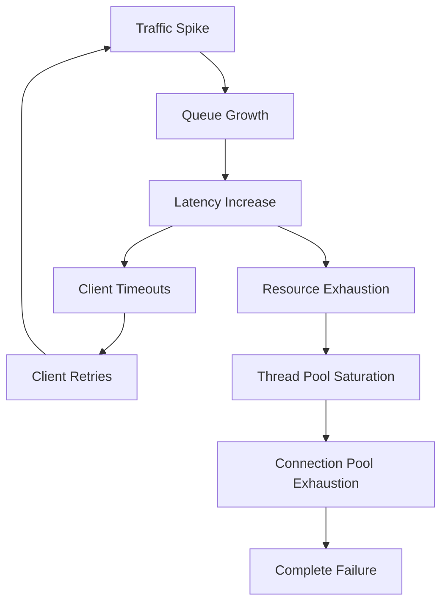
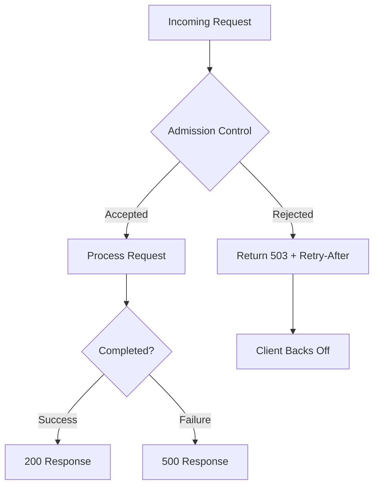

import Callout from '@components/Callout/index.astro'

*[QoS]: Quality of Service
*[LIFO]: Last In, First Out
*[FIFO]: First In, First Out
*[CoDel]: Controlled Delay
*[P99]: 99th Percentile Latency
*[SLO]: Service Level Objective
*[RPS]: Requests Per Second

I watched an e-commerce platform collapse during a flash sale. Traffic spiked to 10x normal within minutes. The system accepted every request—and that was the problem. Database connections exhausted. Response times climbed from 200ms to 30 seconds. Clients started timing out and retrying, which doubled the load again. What could have been a 15-minute degradation became a 4-hour outage.

The fix wasn't more capacity. It was teaching the system to say "no."

Most systems don't fail because they can't handle load. They fail because they try to handle _all_ the load. Without explicit overload handling, a system accepts work it cannot complete, queues grow unbounded, and what starts as a traffic spike becomes a prolonged outage.

<Callout type="warning">
A system without backpressure will accept work until it collapses. The goal isn't handling unlimited load—it's handling your design capacity reliably and degrading gracefully beyond it.
</Callout>

## Understanding Overload

### The Cascading Failure Loop

Overload doesn't just make systems slow—it makes them _worse_. There's a vicious cycle at work: load increases, latency increases, clients timeout, clients retry, and now you have even more load. A 2x traffic spike becomes a 4x spike from retries alone.


Figure: The cascading failure loop where overload compounds itself through retries and resource exhaustion.

The retry loop is the most insidious—well-intentioned client retry logic turns a temporary overload into a sustained assault. Thread pool saturation means requests that _could_ be processed sit waiting for a worker. Connection pool exhaustion means even those workers can't reach the database. This is why overload tends to get worse rather than self-correcting.

### Why Latency Explodes Under Load

There's a fundamental relationship between throughput, latency, and queue depth called Little's Law:

$$
L = \lambda \times W
$$

Where L is the average queue depth, λ is the arrival rate (requests per second), and W is the average time in system (latency). When arrival rate exceeds processing rate, the queue grows without bound. And here's the cruel part: every request in the queue adds to _everyone's_ wait time.

Consider a system processing 100 RPS with 200ms latency—that's 20 requests in flight at any moment. Now hit it with 500 RPS while it can still only process 100. After one minute, you've got 24,000 requests queued, and latency exceeds 4 minutes. By the time requests are served, clients have long since given up.

### Goodput vs. Throughput

Here's a counterintuitive truth: throughput can _increase_ during overload while your system becomes effectively useless. The distinction is between throughput (work attempted) and goodput (work successfully completed).

| Metric | Definition | Normal Load | Under Overload |
|--------|------------|-------------|----------------|
| Throughput | Requests processed | 1000 RPS | 1200 RPS |
| Goodput | Successful responses | 1000 RPS | 400 RPS |
| Badput | Failed/timed out | 0 RPS | 800 RPS |

Table: Throughput can increase during overload while goodput collapses.

Under overload, your system might process more requests than ever—but most of that work is wasted. Requests timeout after consuming resources. Database queries complete but the client already gave up.

This is the key insight: if you'd simply rejected 1,000 of those 2,000 requests immediately, you could have successfully served the other 1,000. Instead, by accepting all of them, you served only 400. _Fast rejection is better than slow failure._

## Admission Control

### The Bouncer Pattern

Think of admission control like a nightclub bouncer. The bouncer's job isn't to throw people out after they're inside causing trouble—it's to decide at the door who gets in. If the club is at capacity, new arrivals wait outside. The people inside have a good experience.

Admission control works the same way: decide _upfront_ whether to accept work, rather than accepting everything and failing later. A request rejected at the door costs almost nothing. A request that gets halfway through your system before timing out has consumed database connections, CPU cycles, and memory—resources that could have served requests you _could_ complete.

Here's how that flow looks in practice:


Figure: Admission control rejects work at the door rather than accepting and failing.

<Callout type="success">
It's better to reject 20% of requests immediately than to accept 100% and fail 40% after wasting resources. Fast rejection preserves capacity for requests you can actually serve.
</Callout>

### Practical Admission Strategies

I've found four approaches cover most scenarios:

**Rate limiting** is the simplest—cap throughput at N requests per second regardless of what the system can handle. It's blunt but effective as a safety valve.

**Concurrency limiting** is smarter because it naturally adapts. Allow N requests in-flight simultaneously. If requests are fast, you serve more per second; if they're slow, you serve fewer but don't overload.

**Latency-based admission** is the most sophisticated—it directly targets the metric you care about. As P99 latency increases, admission probability decreases. The system automatically finds its sustainable capacity.

**Queue depth limiting** rejects when the work queue exceeds a threshold. This bounds worst-case latency since you know how much work is ahead of any new request.

```typescript title="latency-admission-middleware.ts"
// Express middleware for latency-based admission control
import { Request, Response, NextFunction } from 'express';

class LatencyAdmission {
  private recentLatencies: number[] = [];

  constructor(private readonly targetLatencyMs: number) {}

  shouldAdmit(): boolean {
    const p99 = this.calculateP99();
    const admitProbability = this.targetLatencyMs / Math.max(p99, this.targetLatencyMs);
    return Math.random() < admitProbability;
  }

  recordLatency(ms: number) {
    this.recentLatencies.push(ms);
    if (this.recentLatencies.length > 1000) {
      this.recentLatencies.shift();
    }
  }

  private calculateP99(): number {
    if (this.recentLatencies.length === 0) return this.targetLatencyMs;
    const sorted = [...this.recentLatencies].sort((a, b) => a - b);
    return sorted[Math.floor(sorted.length * 0.99)];
  }
}

// Create middleware with 200ms target latency
const admissionController = new LatencyAdmission(200);

export function admissionMiddleware(req: Request, res: Response, next: NextFunction) {
  const start = Date.now();

  if (!admissionController.shouldAdmit()) {
    return res.status(503).set('Retry-After', '30').json({
      error: 'service_unavailable',
      message: 'Server at capacity, please retry later',
    });
  }

  // Record latency when response finishes
  res.on('finish', () => {
    admissionController.recordLatency(Date.now() - start);
  });

  next();
}

// Usage: app.use(admissionMiddleware);
```
Code: Express middleware for latency-based admission control.

### Priority-Based Admission

Not all requests are equal. During overload, you want to protect critical traffic—health checks, payment processing, authenticated users—while shedding less important work.

```yaml title="aws-alb-priority-rules.yaml"
# AWS ALB listener rules - higher priority numbers = lower precedence
Rules:
  - Priority: 1
    Conditions:
      - Field: path-pattern
        Values: ["/health", "/api/payments/*"]
    Actions:
      - Type: forward
        TargetGroupArn: !Ref CriticalTargetGroup

  - Priority: 10
    Conditions:
      - Field: http-header
        HttpHeaderConfig:
          HttpHeaderName: Authorization
          Values: ["Bearer *"]
    Actions:
      - Type: forward
        TargetGroupArn: !Ref AuthenticatedTargetGroup

  - Priority: 100
    Conditions:
      - Field: path-pattern
        Values: ["/*"]
    Actions:
      - Type: forward
        TargetGroupArn: !Ref AnonymousTargetGroup
```
Code: Priority-based routing reserves capacity for critical traffic.

The key insight is that critical traffic can _borrow_ capacity from lower tiers. If the anonymous quota is exhausted but the critical quota has room, anonymous requests are rejected while payments keep flowing.

## Load Shedding and Graceful Degradation

### Choosing What to Shed

Load shedding is the deliberate dropping of work to preserve system stability. It sounds brutal, but the alternative is worse. When you're drowning, you throw cargo overboard to keep the ship afloat.

| Strategy | When to Use | Tradeoff |
|----------|-------------|----------|
| Random | Simple implementation | May drop important requests |
| LIFO (newest first) | Reduce queuing latency | Fresh requests rejected fast |
| Priority-based | Protect important traffic | Complexity, starvation risk |
| CoDel | Adaptive, self-tuning | More complex to implement |

Table: Load shedding strategies and their tradeoffs.

LIFO shedding sounds counterintuitive—drop the _newest_ requests?—but in my experience it often produces better outcomes. A request that just arrived and gets rejected immediately can be retried right away. A request that waited 30 seconds in a queue and finally gets served? That client probably gave up long ago. You did all that work for nothing.

CoDel (Controlled Delay) is even smarter. It tracks how long each request has been queued. If wait times stay below a target, the queue is healthy. If they stay above the target for an interval, CoDel starts dropping—but only enough to bring the queue back under control. It's self-tuning and responds to actual conditions rather than static thresholds.

### Graceful Degradation Tiers

Load shedding doesn't have to be all-or-nothing. Think of it like a submarine diving deeper—at each depth threshold, you seal off another compartment. The ship loses functionality but gains survivability.

```yaml title="feature-flags-degradation.yaml"
# Feature flag configuration for graceful degradation
# Application checks load metrics and toggles features accordingly
# Each tier defines its complete feature set (not inherited from previous)
degradation_tiers:
  normal:
    trigger: "load < 80%"
    recover_at: "load < 80%"
    features:
      personalized_recommendations: true
      real_time_analytics: true
      search_results: 50
      anonymous_access: true

  elevated:
    trigger: "load >= 80%"
    recover_at: "load < 70%"  # Hysteresis prevents oscillation
    features:
      personalized_recommendations: false
      real_time_analytics: true
      search_results: 10  # Reduced from 50
      anonymous_access: true

  critical:
    trigger: "load >= 90%"
    recover_at: "load < 80%"
    features:
      personalized_recommendations: false
      real_time_analytics: false
      search_results: false
      anonymous_access: true

  emergency:
    trigger: "load >= 95%"
    recover_at: "load < 90%"
    features:
      personalized_recommendations: false
      real_time_analytics: false
      search_results: false
      anonymous_access: false  # Authenticated users only
```
Code: Multi-tier graceful degradation with hysteresis to prevent oscillation.

Notice the _hysteresis_—the thresholds to recover are lower than the thresholds to degrade. You enter "elevated" at 80% but don't return to "normal" until you're below 70%. Without this, a system hovering around 80% would constantly flip between states, which is worse than staying in one.

<Callout type="info">
Graceful degradation requires knowing which features are expendable. Work with product owners to classify features into tiers _before_ an incident. During an outage is the wrong time to debate whether search is more important than recommendations.
</Callout>

## Conclusion

Every system has limits. The question isn't whether yours will face overload—it's whether it will handle overload gracefully or collapse catastrophically.

Three principles to carry forward:

**Fast rejection beats slow failure.** When you can't serve a request, say so immediately. A 503 returned in 5ms is infinitely better than a timeout after 30 seconds. The fast rejection frees resources and gives clients useful information.

**Not all work is equal—prioritize ruthlessly.** During overload, protect what matters: health checks, payments, authenticated users. Shed the non-essential to preserve the critical.

**Degrade predictably rather than fail catastrophically.** A system that maintains 50% goodput during a 10x traffic spike is succeeding. A system that accepts everything and serves nothing has failed completely.

The underlying principle is simple: _some_ work completing successfully is better than _all_ work failing. Build systems that know their limits, and you'll build systems that survive.

---

**CTA Headline:** Go Deeper: The Complete Guide to Backpressure Patterns

**CTA Body:** This article covers the fundamentals of admission control and load shedding. The full guide includes implementation patterns for circuit breakers, bulkheads, and adaptive concurrency limits, plus detailed code examples in TypeScript, Python, Go, and infrastructure configurations for AWS, Istio, and pgBouncer. You'll also find chaos engineering experiments for testing your backpressure mechanisms and observability configurations for monitoring overload in production.

**CTA Button Text:** Download the PDF Guide
