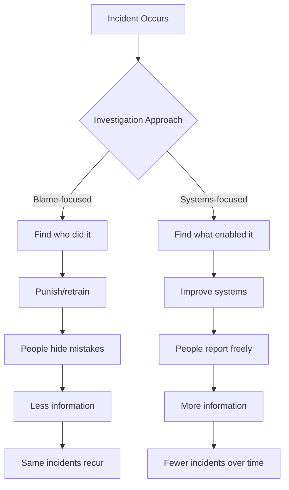
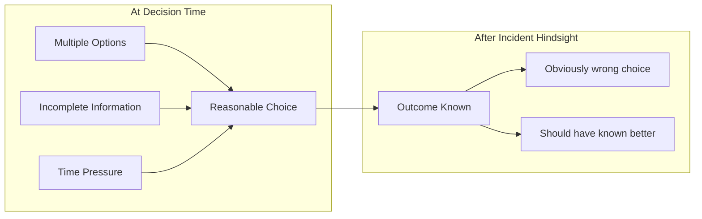
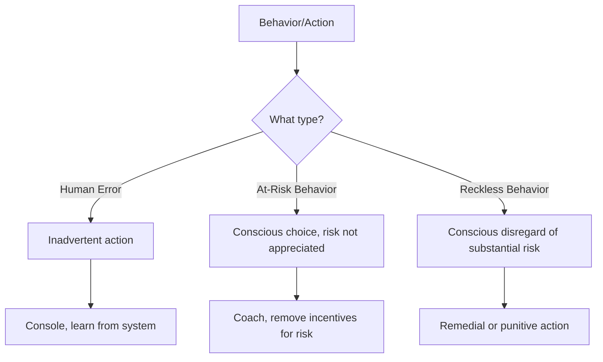
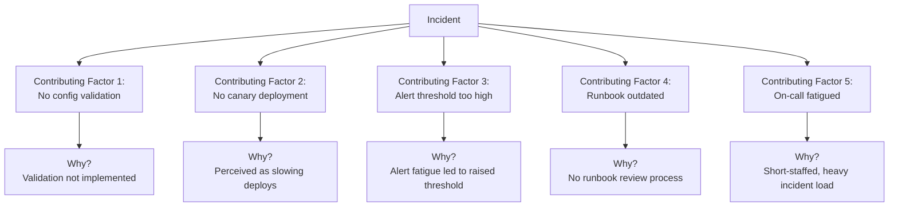
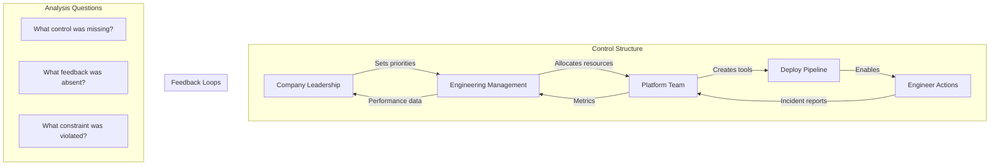
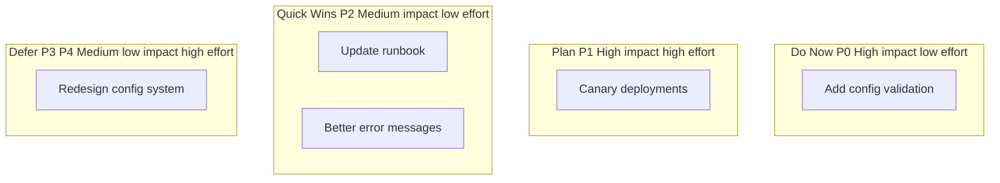

*[RCA]: Root Cause Analysis
*[COD]: Contributing Factor
*[MTTR]: Mean Time To Recovery
*[MTTD]: Mean Time To Detection
*[SRE]: Site Reliability Engineering
*[HRO]: High Reliability Organization
*[STAMP]: Systems-Theoretic Accident Model and Processes
*[CAST]: Causal Analysis based on STAMP

# Incident Analysis Beyond Human Error

## Introduction

Brief overview of why traditional incident analysis fails: the instinct to find "the person who broke it" feels satisfying but produces shallow analysis and defensive cultures. This section frames blameless postmortems not as being soft on mistakes, but as a rigorous methodology for finding systemic causes that prevent recurrence.

_Include a real-world scenario: an engineer fat-fingers a production config change, causing a 2-hour outage. The blame-focused investigation stops at "engineer made a mistake, needs more training." The blameless investigation asks why a single engineer could make that change without review, why there was no canary, why monitoring did not catch it faster, and finds five systemic improvements._

<Callout type="warning">
"Human error" is not a root cause—it is the starting point for investigation. Every incident involves human actions, but the interesting question is: what about the system made that action likely, possible, and undetected?
</Callout>

## The Case Against Blame

### Why Blame Feels Right But Fails

Explain the psychological appeal of blame and why it produces poor outcomes.

| Blame-Based Approach | Systemic Approach |
|---------------------|-------------------|
| Finds a person to hold accountable | Finds system conditions to improve |
| Investigation stops at human action | Investigation continues to context |
| "Don't do that again" | "Make that harder to do" |
| People hide mistakes | People report near-misses |
| Same incident recurs with different person | Incident class becomes less likely |

Table: Blame-based vs. systemic approaches to incident analysis.


Figure: The divergent outcomes of blame-focused vs. systems-focused investigation.

### The "Bad Apple" Fallacy

Debunk the notion that incidents are caused by uniquely careless or incompetent individuals.

> If you believe the problem is a "bad apple," you will try to remove the bad apple. If you believe the problem is the barrel, you will redesign the barrel. The evidence from every high-reliability industry is clear: it is always the barrel.
> — Adapted from Sidney Dekker

```text
The "Bad Apple" Theory:
- Assumes most people are careful, a few are careless
- Solution: Find and remove the careless ones
- Problem: Careless people are everywhere; you cannot screen them out
- Result: Blame rotates through the workforce

The "System" Theory:
- Assumes all people will make errors given the right conditions
- Solution: Design systems that tolerate human error
- Problem: Requires more effort and investment
- Result: Actual reduction in incident frequency and severity
```

<Callout type="info">
Aviation and healthcare learned this decades ago: blaming individuals for accidents increased secrecy and prevented learning. Only when they shifted to systems thinking did safety actually improve.
</Callout>

### Hindsight Bias and Outcome Bias

Explain how knowing the outcome distorts our analysis of the decision-making process.


Figure: Hindsight makes decisions that were reasonable at the time appear obviously wrong.

**Counterfactual questioning to fight hindsight bias:**
- Would I have made the same decision with the same information?
- What would have had to be different for this to be a success story?
- How many times has this same action been taken without incident?

## Building a Blameless Culture

### What "Blameless" Actually Means

Clarify that blameless does not mean no accountability—it means appropriate accountability.

| What Blameless IS | What Blameless IS NOT |
|-------------------|----------------------|
| Holding systems accountable | Letting individuals off the hook |
| Safe to report errors | Safe to be negligent |
| Learning from mistakes | Ignoring mistakes |
| Improving processes | Accepting poor processes |
| Psychological safety | Lack of standards |

Table: Clarifying what blameless culture actually means.

```yaml title="accountability-framework.yaml"
accountability_model:
  individual_accountability:
    appropriate_for:
      - Willful violation of known safety rules
      - Deliberate sabotage
      - Gross negligence (extremely rare)
    not_appropriate_for:
      - Mistakes made in good faith
      - Errors enabled by poor tooling
      - Actions that followed normal practice

  system_accountability:
    appropriate_for:
      - Missing guardrails
      - Inadequate monitoring
      - Unclear procedures
      - Insufficient training
      - Tool failures
      - Process gaps

  leadership_accountability:
    appropriate_for:
      - Creating pressure that encouraged shortcuts
      - Not investing in safety measures
      - Setting conflicting priorities
      - Ignoring known risks
```
Code: Framework distinguishing individual, system, and leadership accountability.

### Prerequisites for Blameless Culture

List the organizational conditions that must exist for blameless postmortems to work.

```markdown title="blameless-prerequisites-checklist.md"
## Leadership Behaviors
- [ ] Executives publicly own their role in systemic failures
- [ ] No one has been fired or punished for honest mistakes
- [ ] Near-miss reporting is celebrated, not penalized
- [ ] Postmortems are required, blame is not

## Process Safeguards
- [ ] Postmortem documents cannot be used in performance reviews
- [ ] Facilitators are trained to redirect blame language
- [ ] Action items focus on systems, not individuals
- [ ] "Human error" is banned as a root cause

## Cultural Indicators
- [ ] People openly share mistakes in public channels
- [ ] Junior engineers feel safe questioning senior decisions
- [ ] "I don't know" is an acceptable answer
- [ ] Postmortems are well-attended and engaged

## Counter-Indicators (Red Flags)
- [ ] People hedge language to protect themselves
- [ ] Incidents are under-reported
- [ ] Postmortems feel like interrogations
- [ ] Action items include "retrain the person who did X"
```
Code: Checklist for assessing blameless culture readiness.

<Callout type="danger">
You cannot mandate blameless culture. If people have seen colleagues punished for mistakes, no policy will make them feel safe. Building trust takes consistent behavior over time, especially from leadership.
</Callout>

### The Just Culture Model

Introduce the Just Culture framework for distinguishing types of behavior.


Figure: Just Culture model distinguishing human error from at-risk and reckless behavior.

| Behavior Type | Example | Response |
|---------------|---------|----------|
| Human Error | Typo in command | System improvement |
| At-Risk | Skipping checklist under time pressure | Remove pressure, reinforce process |
| Reckless | Knowingly bypassing safety controls | Remedial action appropriate |

Table: Just Culture behavior categories with appropriate responses.

## The Postmortem Process

### Timeline Construction

Explain how to build an accurate timeline as the foundation for analysis.

```yaml title="timeline-template.yaml"
incident_timeline:
  metadata:
    incident_id: "INC-2024-0142"
    title: "Payment processing outage"
    duration: "2h 15m"
    severity: "SEV1"

  events:
    - time: "2024-03-15T14:23:00Z"
      event: "Config change deployed to production"
      actor: "deployment-bot"
      source: "deployment logs"

    - time: "2024-03-15T14:25:00Z"
      event: "First customer complaints in support queue"
      actor: "customers"
      source: "Zendesk"

    - time: "2024-03-15T14:32:00Z"
      event: "On-call engineer paged"
      actor: "PagerDuty"
      source: "PagerDuty logs"

    - time: "2024-03-15T14:35:00Z"
      event: "Engineer begins investigation"
      actor: "engineer-a"
      source: "Slack"

    - time: "2024-03-15T14:52:00Z"
      event: "Root cause identified (config regression)"
      actor: "engineer-a"
      source: "Slack"

    - time: "2024-03-15T15:10:00Z"
      event: "Fix deployed, monitoring for recovery"
      actor: "engineer-a"
      source: "deployment logs"

    - time: "2024-03-15T16:38:00Z"
      event: "All systems confirmed recovered"
      actor: "engineer-a"
      source: "monitoring dashboards"
```
Code: Timeline template capturing events, actors, and sources.

**Timeline construction tips:**
- Use UTC timestamps consistently
- Include what people were thinking, not just doing
- Capture decision points and why options were chosen
- Note information that was available vs. not available at each point
- Include non-events (alerts that did not fire, people not paged)

### Facilitation Techniques

Describe how to run a postmortem meeting that avoids blame.

```markdown title="facilitator-guide.md"
## Before the Meeting
- [ ] Timeline pre-populated and shared
- [ ] Key participants identified and invited
- [ ] Ground rules prepared
- [ ] Private pre-interviews with key actors if needed

## Opening (5 minutes)
- State the goal: learning, not blame
- Review ground rules:
  - No "should have" statements
  - Assume everyone acted rationally given their information
  - Focus on systems, not individuals
  - We are all on the same team

## Timeline Review (20-30 minutes)
- Walk through timeline chronologically
- Ask clarifying questions: "What were you seeing at this point?"
- Fill gaps: "What happened between X and Y?"
- Capture context: "What else was going on that day?"

## Analysis (30-40 minutes)
- Use "Five Whys" sparingly and carefully
- Ask "What" instead of "Why": "What led to that decision?"
- Identify contributing factors, not root causes
- Look for systemic patterns

## Action Items (15-20 minutes)
- Each factor gets at least one action item
- Assign owners and due dates
- Prioritize by impact and effort
- Avoid "be more careful" type actions

## Closing (5 minutes)
- Summarize key learnings
- Thank participants for candor
- Schedule follow-up for action item review
```
Code: Facilitator guide for running effective blameless postmortems.

<Callout type="warning">
The facilitator's most important job is redirecting blame language in real-time. When someone says "they should have known," redirect to "what would have made that clearer?"
</Callout>

### Language Matters: Blame-Free Vocabulary

Provide translations from blame-oriented to learning-oriented language.

| Instead of... | Try... |
|---------------|--------|
| "They should have..." | "What would have helped them..." |
| "Why didn't they..." | "What was preventing..." |
| "The mistake was..." | "The contributing factor was..." |
| "Human error" | "The action that triggered..." |
| "Failed to notice" | "The signal was not surfaced..." |
| "Knew better" | "The knowledge was not available at that moment..." |
| "Careless" | "The system did not catch..." |

Table: Translating blame language to learning language.

## Contributing Factor Analysis

### Beyond "Root Cause"

Explain why "root cause" is often a misleading concept and contributing factors are more useful.


Figure: Multiple contributing factors, each with their own chain of causation.

> Looking for "the root cause" implies there is one. In complex systems, incidents arise from the confluence of multiple factors, none of which is "the" cause. Remove any one, and the incident might not have happened—or might have happened differently.

### The "Five Whys" and Its Limitations

Explain how to use Five Whys effectively and when it fails.

```text
Five Whys - Done Poorly:

Q: Why did the system go down?
A: Because a config change broke it.

Q: Why did the config change break it?
A: Because the engineer made a mistake.

Q: Why did the engineer make a mistake?
A: Because they were careless.

[Investigation stops at blame]

---

Five Whys - Done Well:

Q: Why did the system go down?
A: Because a config change disabled authentication.

Q: Why did the config change disable authentication?
A: Because the config schema changed and old values became invalid.

Q: Why did old values become invalid?
A: Because the migration script did not update existing configs.

Q: Why did the migration not update existing configs?
A: Because no one knew configs existed in that format.

Q: Why did no one know?
A: Because the documentation was outdated and there was no config inventory.

[Investigation finds systemic issues]
```

<Callout type="info">
Five Whys works when each "why" leads to a system condition. It fails when it leads to human attributes (careless, rushed, didn't know). If you reach a human attribute, ask "what about the system allowed/encouraged that?"
</Callout>

### STAMP/CAST Analysis for Complex Incidents

Introduce systems-theoretic analysis for complex incidents.


Figure: STAMP model showing control structure and feedback loops for analyzing complex incidents.

**CAST Analysis Questions:**
1. What were the control actions that contributed to the incident?
2. Why were those actions taken? (Context, information, pressure)
3. What safety constraints were violated?
4. Why did the control structure not prevent this?
5. What feedback loops were missing or inadequate?

## Remediation and Action Items

### Effective Action Items

Define what makes a good remediation action item.

```yaml title="action-item-quality.yaml"
good_action_items:
  characteristics:
    - specific: "Add validation for auth config changes"
    - measurable: "Deploy canary to 1% before full rollout"
    - assignable: "Single owner, clear responsibility"
    - realistic: "Can be completed in stated timeframe"
    - systemic: "Prevents class of incidents, not just this one"

  examples:
    good:
      - "Add pre-deploy hook that validates config schema"
      - "Implement 1% canary with automatic rollback on error spike"
      - "Add config change review requirement to deploy pipeline"

    bad:
      - "Be more careful with config changes"
      - "Engineer X needs training"
      - "Review all configs" (no scope, no criteria)
      - "Improve monitoring" (not specific)
```
Code: Criteria for effective action items.

### Prioritization Framework

Explain how to prioritize remediations when there are many potential actions.

| Priority | Impact | Effort | Example |
|----------|--------|--------|---------|
| P0 | High impact, low effort | Days | Add validation to block invalid configs |
| P1 | High impact, high effort | Weeks | Implement canary deployment pipeline |
| P2 | Medium impact, low effort | Days | Update runbook with new scenarios |
| P3 | Medium impact, high effort | Months | Redesign config management system |
| P4 | Low impact | Any | Nice-to-have improvements |

Table: Prioritization matrix for remediation action items.


Figure: Quadrant chart for visualizing remediation prioritization.

### Tracking and Follow-Through

Explain the importance of tracking action items to completion.

```yaml title="action-tracking.yaml"
action_items:
  - id: "INC-2024-0142-AI-001"
    title: "Add config validation to deploy pipeline"
    owner: "platform-team"
    assignee: "@sarah"
    created: "2024-03-18"
    due: "2024-03-25"
    status: "in_progress"

    progress:
      - date: "2024-03-19"
        update: "Validation rules designed, PR in review"
      - date: "2024-03-22"
        update: "Merged to staging, testing"

    verification:
      method: "Attempt to deploy invalid config in staging"
      expected: "Deploy blocked with clear error message"

  - id: "INC-2024-0142-AI-002"
    title: "Implement canary deployments for config changes"
    owner: "platform-team"
    assignee: "@mike"
    created: "2024-03-18"
    due: "2024-04-15"
    status: "planned"
    blocked_by: "AI-001"
```
Code: Action item tracking with progress updates and verification criteria.

<Callout type="success">
An incident without completed action items is an incident that will recur. Track actions to completion, verify they work, and close the loop in a follow-up meeting.
</Callout>

## The Postmortem Document

### Document Template

Provide a comprehensive postmortem document template.

```markdown title="postmortem-template.md"
# Postmortem: [Incident Title]

**Incident ID:** INC-YYYY-XXXX
**Date:** YYYY-MM-DD
**Duration:** X hours Y minutes
**Severity:** SEV1/SEV2/SEV3
**Author:** [Name]
**Status:** Draft/Review/Final

## Executive Summary
[2-3 sentences: what happened, impact, key learnings]

## Impact
- **Users affected:** [number/percentage]
- **Revenue impact:** [if applicable]
- **Data impact:** [if applicable]
- **Duration:** [detection to resolution]

## Timeline
[Detailed timeline with timestamps, events, actors]

## Contributing Factors
1. **[Factor 1]:** [Description of how it contributed]
2. **[Factor 2]:** [Description of how it contributed]
3. **[Factor 3]:** [Description of how it contributed]

## What Went Well
- [Things that worked during incident response]
- [Existing safeguards that limited impact]

## What Could Be Improved
- [Gaps in detection/response/recovery]
- [Process or tooling improvements needed]

## Action Items
| ID | Action | Owner | Due Date | Status |
|----|--------|-------|----------|--------|
| 1 | [Action description] | [Owner] | [Date] | [Status] |

## Lessons Learned
[Key takeaways that apply beyond this specific incident]

## Appendix
- Links to dashboards, logs, Slack threads
- Related incidents
- External resources
```
Code: Comprehensive postmortem document template.

### Writing for Multiple Audiences

Explain how to write a postmortem that serves different readers.

| Audience | Needs | Section Focus |
|----------|-------|---------------|
| Executives | Quick summary, business impact | Executive Summary, Impact |
| On-call engineers | What to do if it recurs | Timeline, Action Items |
| Future investigators | Full context | Contributing Factors, Appendix |
| Other teams | What they can learn | Lessons Learned |

Table: Tailoring postmortem content for different audiences.

## Measuring Incident Analysis Effectiveness

### Metrics That Matter

Define metrics for evaluating postmortem program effectiveness.

```yaml title="postmortem-metrics.yaml"
process_metrics:
  postmortem_rate:
    definition: "Incidents with completed postmortems / total incidents"
    target: ">95% for SEV1-2, >80% for SEV3"

  time_to_postmortem:
    definition: "Days from incident to postmortem meeting"
    target: "<5 business days"

  action_completion_rate:
    definition: "Action items completed / total action items"
    target: ">90% within 30 days"

outcome_metrics:
  recurrence_rate:
    definition: "Similar incidents after remediation / incidents with that factor"
    target: "<10%"

  mttr_trend:
    definition: "Change in mean time to recovery over time"
    target: "Decreasing trend"

  near_miss_reports:
    definition: "Near-misses reported voluntarily"
    target: "Increasing trend (indicates psychological safety)"

culture_metrics:
  participation:
    definition: "Unique attendees at postmortems / engineering headcount"
    target: ">50% participate per quarter"

  satisfaction:
    definition: "Survey: 'Postmortems help us improve' (1-5)"
    target: ">4.0 average"
```
Code: Metrics for measuring postmortem program effectiveness.

### Review Cadence

Describe regular reviews to improve the postmortem process itself.

```markdown title="postmortem-review-cadence.md"
## Weekly
- Review open action items, unblock if needed
- Check for overdue postmortems
- Spot-check recent postmortems for quality

## Monthly
- Aggregate metrics review
- Identify patterns across incidents
- Review for systemic themes

## Quarterly
- Process retrospective: Is our postmortem process working?
- Training refresh for facilitators
- Share learnings cross-org

## Annually
- Full program review
- Benchmark against industry
- Major process improvements
```
Code: Review cadence for continuous improvement of incident analysis.

## Conclusion

Summarize the key principles: human error is where investigation begins, not ends; blame-focused investigation produces hiding, systems-focused investigation produces learning; multiple contributing factors create incidents, not single root causes; effective remediation requires specific, systemic action items tracked to completion. Emphasize that blameless culture is not soft—it is rigorous and demanding—but it demands improvement from systems rather than punishment of individuals.

<Callout type="success">
The goal of incident analysis is not to find who to blame. It is to find what to change so that the same class of incident becomes less likely. A blameless postmortem that produces no systemic improvements has failed—not because it did not assign blame, but because it did not learn.
</Callout>

---

## Cover Prompt

### Prompt 1: The System Lens

Create an image of a magnifying glass examining a complex system diagram (interconnected nodes and lines). Through the lens, the viewer sees system components highlighted; outside the lens, shadowy human figures are visible but not the focus. Style: technical illustration, clean lines, blue and white color scheme with subtle gold highlights, 16:9 aspect ratio.

### Prompt 2: The Investigation Table

Design an image of a large conference table viewed from above, covered with timeline cards, diagrams, and documents. Multiple hands point at different system factors (servers, pipelines, alerts) rather than at any person. Collaborative investigation aesthetic. Style: overhead view, warm lighting, paper and digital elements mixed, 16:9 aspect ratio.

### Prompt 3: The Iceberg of Causation

Illustrate an iceberg where "Human Action" is the small visible tip above water, and below the waterline are much larger layers labeled with systemic factors: "Process Gaps," "Tool Limitations," "Organizational Pressures," "System Design." Style: cross-section illustration, cool blue tones, clear labeling, dramatic scale contrast, 16:9 aspect ratio.

### Prompt 4: The Root System

Create an image of a single incident (represented as a fallen tree or withered plant) with an extensive root system visible underground. Each root represents a contributing factor, spreading in different directions, all connecting to the surface event. Style: botanical illustration meets technical diagram, earth tones with technical overlays, 16:9 aspect ratio.

### Prompt 5: The Learning Loop

Design a visualization of a continuous improvement cycle: Incident → Analysis → Learning → Improvement → Resilience → (back to start but at a higher level, spiral upward). The emphasis is on forward motion and growth, not punishment or backward-looking blame. Style: abstract/geometric, upward spiral motion, gradient from darker (incident) to lighter (resilience), 16:9 aspect ratio.
