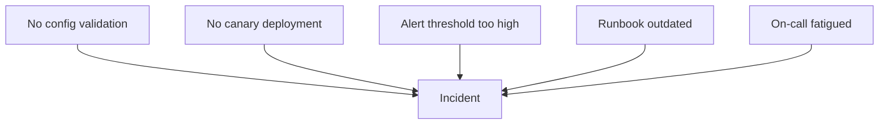

An engineer fat-fingers a production config change. The payment service goes down for two hours. Customers are angry, revenue is lost, and everyone wants to know what happened.

The instinctive investigation goes like this: Who made the change? Why weren't they more careful? They need more training. Maybe a written warning. Case closed.

This feels satisfying—we found the problem and addressed it. But three months later, a _different_ engineer makes a _different_ config mistake, and we're back here again. The "solution" didn't prevent anything—it just rotated the blame to someone new.

There's a better way. Instead of asking "who screwed up?" blameless postmortems ask: Why could a single engineer make that change without review? Why was there no canary deployment? Why didn't monitoring catch the error before customers did? That investigation finds five systemic improvements instead of one scapegoat.

## Why Blame Feels Right But Fails

Blame provides closure. We have a narrative: someone did something wrong, we identified them, and we've dealt with it. Our brains crave this kind of simple causation. It's cognitively easier than grappling with systemic complexity.

But blame produces terrible outcomes. When people fear punishment for mistakes, they stop reporting near-misses. They hedge their language in postmortems. They cover their tracks. The information you need to prevent future incidents disappears into self-protective silence.

| Blame-Based Approach | Systemic Approach |
|---------------------|-------------------|
| Finds a person to hold accountable | Finds system conditions to improve |
| Investigation stops at human action | Investigation continues to context |
| "Don't do that again" | "Make that harder to do" |
| People hide mistakes | People report near-misses |
| Same incident recurs with different person | Incident class becomes less likely |

Table: How blame-based and systemic approaches differ in practice and outcomes.

The divergence compounds over time. Blame-focused organizations accumulate hidden risk because they've optimized for concealment. Systems-focused organizations accumulate learning because they've optimized for disclosure.

Beyond information hiding, blame-based thinking leads to another trap: the search for a scapegoat. There's a comforting belief that most engineers are careful and competent, and incidents happen because a few "bad apples" are careless. If we could just identify and remove these people, incidents would stop.

This theory has been tested extensively in aviation, healthcare, and nuclear power. It doesn't hold up. "Careless" people aren't a distinct population you can screen out—everyone makes errors under the right conditions. Fatigue, time pressure, confusing interfaces, incomplete information, and conflicting priorities create errors in even the most skilled practitioners.

If you fire the engineer who made today's mistake, someone else will make a similar mistake next month—because the conditions that enabled the error remain unchanged.

## What "Blameless" Actually Means

"Blameless" is frequently misunderstood. It doesn't mean no one is accountable. It doesn't mean we ignore mistakes or lower our standards. It means we hold the _right things_ accountable—and in complex systems, that's almost never an individual human making a one-off error.

| What Blameless IS | What Blameless IS NOT |
|-------------------|----------------------|
| Holding systems accountable | Letting individuals off the hook |
| Safe to report errors | Safe to be negligent |
| Learning from mistakes | Ignoring mistakes |
| Improving processes | Accepting poor processes |
| Psychological safety | Lack of standards |

Table: Clarifying what blameless culture actually means.

The distinction matters because different types of accountability call for different responses. An engineer who made an honest mistake while following normal practices needs system improvements. A manager who created deadline pressure that encouraged skipping safety checks needs to change their leadership approach. These are both accountability—just not the "find someone to blame" kind.

The Just Culture framework, developed in healthcare and aviation, helps distinguish between behaviors:

- _Human error_ is inadvertent—a typo, a misremembered procedure. The response is system improvement.
- _At-risk behavior_ involves conscious shortcuts where the person doesn't fully appreciate the risk—skipping a checklist because "it's always fine." The response is coaching and removing incentives for the shortcut.
- _Reckless behavior_ is conscious disregard of a known substantial risk—genuinely rare in professional settings and the only category where punitive action may be appropriate.

Most incidents involve human error or at-risk behavior. Both call for system-level responses, not individual punishment.

<Callout type="warning">
You can't mandate blameless culture. If people have seen colleagues punished for mistakes, no policy will make them feel safe. Building trust takes consistent behavior over time, especially from leadership.
</Callout>

## Finding Contributing Factors, Not "Root Causes"

The phrase "root cause" implies there's one cause at the bottom of the causal chain—find it, fix it, and the problem is solved. In complex systems, this is almost never true. Incidents arise from the confluence of multiple factors, none of which is _the_ cause. Remove any one of them, and the incident might not have happened—or might have happened differently.


Figure: Multiple contributing factors, each representing a potential intervention point.

The Five Whys technique—keep asking "why" until you reach an actionable cause—is popular but easily misused. Here's what going wrong looks like:

```text title="five-whys-antipattern.txt"
Q: Why did the system go down?
A: Because a config change broke it.

Q: Why did the config change break it?
A: Because the engineer made a mistake.

Q: Why did the engineer make a mistake?
A: Because they were careless.

[Investigation stops at blame—nothing actionable learned]
```
Code: Five Whys antipattern that terminates at human blame.

And here's the same incident investigated properly:

```text title="five-whys-systemic.txt"
Q: Why did the system go down?
A: Because a config change disabled authentication.

Q: Why did the config change disable authentication?
A: Because the config schema changed and old values became invalid.

Q: Why did old values become invalid?
A: Because the migration script didn't update existing configs.

Q: Why didn't the migration update existing configs?
A: Because no one knew configs existed in that format.

Q: Why didn't anyone know?
A: Because documentation was outdated and there was no config inventory.

[Five actionable systemic issues identified]
```
Code: Five Whys done well, leading to systemic improvements.

The difference is where you choose to stop. If you reach a human attribute—careless, rushed, didn't know—that's a signal you've taken a wrong turn. Human attributes aren't fixable. But every human attribute has a system context: Why was carelessness possible? What created the rush? Why wasn't the knowledge available?

<Callout type="info">
Five Whys works when each "why" leads to a system condition. It fails when it leads to human attributes. If you reach "they were careless," ask instead: "what about the system allowed carelessness to cause an incident?"
</Callout>

## Action Items That Actually Prevent Recurrence

The analysis is only as valuable as the actions it produces. I've seen beautifully written postmortems with insightful contributing factor analysis—followed by vague action items like "improve monitoring" that never get done and wouldn't help much if they did.

Good action items share specific characteristics:

| Characteristic | What It Means | Example |
|---------------|---------------|----------|
| Specific | Describes the exact change, not the general area | "Add validation for auth config changes" |
| Measurable | Has a clear done/not-done state you can verify | "Deploy canary to 1% before full rollout" |
| Assignable | Names a team and person, not "we" or "someone" | "Platform team owns, Sarah implements" |
| Realistic | Scoped to complete in the committed timeframe | "Can be completed in one sprint" |
| Systemic | Blocks the failure mode, not just this instance | "Blocks all invalid configs, not just this format" |

Table: Characteristics of effective action items.

__Good examples:__ "Add pre-deploy hook that validates config schema." "Implement 1% canary with automatic rollback on error spike." "Add config change review requirement to deploy pipeline."

__Bad examples:__ "Be more careful with config changes." "Engineer X needs training." "Review all configs." "Improve monitoring."

The "bad" examples are common because they're easy to write. But "be more careful" changes nothing structural and relies on human vigilance—exactly what failed. "Engineer X needs training" is blame dressed up as remediation. "Review all configs" and "improve monitoring" lack the specificity needed to actually get done.

Here's a useful test: if someone else picked up the action item, would they know exactly what to build or change? If the answer is no, refine it until they would.

<Callout type="success">
An incident without completed action items is an incident that will recur. Track actions to completion, verify they work, and close the loop in a follow-up meeting.
</Callout>

## The Path Forward

Blameless postmortems aren't soft—they're more rigorous than blame culture. They demand that we find _all_ the contributing factors, not just the most obvious one. They demand _real_ fixes, not just "be more careful." They demand measurement to verify fixes actually work.

The core principles:

- __Human error is where investigation begins, not where it ends.__ The interesting question is always: what made that action likely, possible, and undetected?

- __Blame produces hiding; systems thinking produces learning.__ When people fear punishment, they stop reporting. When they feel safe, they share near-misses that prevent future incidents.

- __Incidents have contributing factors, not root causes.__ Complex failures arise from multiple interacting conditions. Identify them all before deciding which to fix.

- __Effective remediation requires specific, systemic action items tracked to completion.__ Vague actions don't get done. Person-focused actions don't prevent recurrence.

The organizations that learn fastest are the ones where people feel safe enough to say "I made a mistake, and here's what we should change so it doesn't happen again."

The next time an engineer fat-fingers a config change, your organization has a choice: find someone to blame, or find five ways to make sure it can't happen again. Only one of those prevents the next incident.

---

__CTA Title:__ Go Deeper: The Complete Guide to Blameless Postmortems

__CTA Body:__ This article covers the fundamentals, but effective incident analysis requires more than principles—it requires process. Our comprehensive guide includes complete postmortem document templates, the STAMP/CAST framework for analyzing complex multi-team incidents, facilitator guides with specific language techniques, metrics for measuring whether your postmortem program is actually working, and review cadence recommendations for turning individual learnings into organizational improvement. Download the full guide to build an incident analysis practice that actually prevents recurrence.
