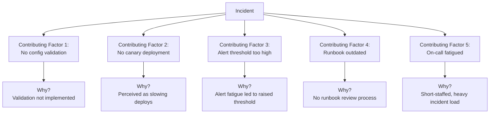
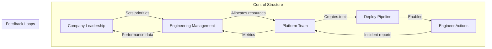
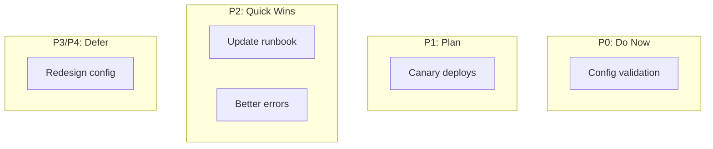

import Callout from '@components/Callout/index.astro'

*[RCA]: Root Cause Analysis
*[MTTR]: Mean Time To Recovery
*[MTTD]: Mean Time To Detection
*[SRE]: Site Reliability Engineering
*[HRO]: High Reliability Organization
*[STAMP]: Systems-Theoretic Accident Model and Processes
*[CAST]: Causal Analysis based on STAMP

An engineer fat-fingers a production config change. The payment service goes down for two hours. Customers are angry, revenue is lost, and everyone wants to know what happened.

The instinctive investigation goes like this: Who made the change? Why weren't they more careful? They need more training. Maybe a written warning. Case closed.

This feels satisfying—we found the problem and addressed it. But three months later, a _different_ engineer makes a _different_ config mistake, and we're back here again. The "solution" didn't prevent anything—it just rotated the blame to someone new.

The blameless investigation asks different questions: Why could a single engineer make that change without review? Why was there no canary deployment? Why didn't monitoring catch the error rate spike before customers did? Why was the config format so easy to break? That investigation finds five systemic improvements instead of one scapegoat.

This isn't about being soft on mistakes. It's about being rigorous enough to find causes that actually prevent recurrence. If you're responsible for incident response, reliability engineering, or leading engineering teams, this guide will help you build postmortem practices that actually improve your systems.

<Callout type="warning">
"Human error" is not a root cause—it's the starting point for investigation. Every incident involves human actions, but the interesting question is: what about the system made that action likely, possible, and undetected?
</Callout>

## The Case Against Blame

### Why Blame Feels Right But Fails

Blame feels right because it provides closure. We have a narrative: someone did something wrong, we identified them, and we've dealt with it. Our brains crave this kind of simple causation. It's cognitively easier than grappling with systemic complexity.

But blame produces terrible outcomes. When people fear punishment for mistakes, they stop reporting near-misses. They hedge their language in postmortems. They cover their tracks. The information you need to prevent future incidents disappears into self-protective silence.

| Blame-Based Approach | Systemic Approach |
|---------------------|-------------------|
| Finds a person to hold accountable | Finds system conditions to improve |
| Investigation stops at human action | Investigation continues to context |
| "Don't do that again" | "Make that harder to do" |
| People hide mistakes | People report near-misses |
| Same incident recurs with different person | Incident class becomes less likely |

Table: Blame-based vs. systemic approaches to incident analysis.

The divergence compounds over time. Blame-focused organizations accumulate hidden risk because they've optimized for concealment. Systems-focused organizations accumulate learning because they've optimized for disclosure.

### The "Bad Apple" Fallacy

There's a comforting belief that most engineers are careful and competent, and incidents happen because a few "bad apples" are careless or incompetent. If we could just identify and remove these people, incidents would stop.

This theory has been tested extensively in aviation, healthcare, and nuclear power. It doesn't hold up. "Careless" people aren't a distinct population you can screen out—everyone makes errors under the right conditions. Fatigue, time pressure, confusing interfaces, incomplete information, and conflicting priorities create errors in even the most skilled practitioners.

> If you believe the problem is a "bad apple," you'll try to remove the bad apple. If you believe the problem is the barrel, you'll redesign the barrel. The evidence from every high-reliability industry is clear: it's always the barrel.
> — Adapted from Sidney Dekker

The bad apple theory feels intuitive but leads nowhere useful. If you fire the engineer who made today's mistake, someone else will make a similar mistake next month—because the conditions that enabled the error are unchanged.

<Callout type="info">
Aviation and healthcare learned this decades ago: blaming individuals for accidents increased secrecy and prevented learning. Only when they shifted to systems thinking did safety actually improve.
</Callout>

### Hindsight Bias and Outcome Bias

After an incident, the "correct" action seems obvious. _Of course_ that config change was risky. _Of course_ they should have tested it more carefully. _Of course_ someone should have noticed the warning signs.

But this clarity is an illusion created by knowing the outcome. At the time of the decision, the person had incomplete information, competing priorities, time pressure, and no way to know this particular action would be the one that failed. The same action had probably succeeded dozens of times before.

Hindsight bias is nearly impossible to eliminate, but you can counteract it with deliberate questions:

- Would I have made the same decision with the same information they had?
- What would have had to be different for this to be a success story instead of an incident?
- How many times has this exact action been taken without incident?

If the answer to the last question is "hundreds of times," then the action itself isn't the problem—something about _this particular instance_ was different, and that's what you need to find.

## Building a Blameless Culture

### What "Blameless" Actually Means

"Blameless" is frequently misunderstood. It doesn't mean no one is accountable. It doesn't mean we ignore mistakes or lower our standards. It means we hold the _right things_ accountable—and in complex systems, that's almost never an individual human making a one-off error.

| What Blameless IS | What Blameless IS NOT |
|-------------------|----------------------|
| Holding systems accountable | Letting individuals off the hook |
| Safe to report errors | Safe to be negligent |
| Learning from mistakes | Ignoring mistakes |
| Improving processes | Accepting poor processes |
| Psychological safety | Lack of standards |

Table: Clarifying what blameless culture actually means.

The distinction matters because different types of accountability call for different responses. An engineer who made an honest mistake while following normal practices needs system improvements. A manager who created deadline pressure that encouraged skipping safety checks needs to change their leadership approach. These are both accountability—just not the "find someone to blame" kind.

### Prerequisites for Blameless Culture

Blameless postmortems don't work in a vacuum. They require organizational conditions that make psychological safety real, not just a stated value. I've seen teams try to adopt blameless practices while the broader organization still punishes mistakes—it doesn't work. People quickly learn that "blameless" is just rhetoric.

__Leadership Behaviors__

- [x] Executives publicly own their role in systemic failures
- [x] No one has been fired or punished for honest mistakes
- [x] Near-miss reporting is celebrated, not penalized
- [x] Postmortems are required, blame is not

__Process Safeguards__

- [x] Postmortem documents cannot be used in performance reviews
- [x] Facilitators are trained to redirect blame language
- [x] Action items focus on systems, not individuals
- [x] "Human error" is banned as a root cause

__Cultural Indicators__

- [x] People openly share mistakes in public channels
- [x] Junior engineers feel safe questioning senior decisions
- [x] "I don't know" is an acceptable answer
- [x] Postmortems are well-attended and engaged

__Counter-Indicators (Red Flags)__

- [x] People hedge language to protect themselves
- [x] Incidents are under-reported
- [x] Postmortems feel like interrogations
- [x] Action items include "retrain the person who did X"

The counter-indicators are the most telling. If you're not sure whether your culture is actually blameless, look at how people write incident reports. Do they use passive voice to obscure who did what? Do they minimize their own involvement? Do they preemptively defend their decisions? That's fear, and fear means the culture isn't safe yet.

<Callout type="danger">
You cannot mandate blameless culture. If people have seen colleagues punished for mistakes, no policy will make them feel safe. Building trust takes consistent behavior over time, especially from leadership.
</Callout>

If you're in an organization that doesn't yet have blameless culture, start small. Run one genuinely blameless postmortem for a low-stakes incident. Demonstrate the value. Get leadership to publicly acknowledge their role in one systemic issue. Each small success builds evidence that this approach works—and makes the next step easier.

### The Just Culture Model

Not all actions are the same, and blameless culture doesn't mean treating them identically. The Just Culture framework, developed in healthcare and aviation, distinguishes between three types of behavior—each calling for a different response.

__Human error__ is inadvertent—the person didn't intend the outcome and didn't consciously take a risk. A typo, a misremembered procedure, a slip of the mouse. The appropriate response is to support the person (they feel bad already) and improve the system so the error is harder to make or causes less damage.

__At-risk behavior__ involves conscious choice, but the person doesn't fully appreciate the risk. An engineer skipping a checklist step because "it's always fine" or deploying without testing because "the change is trivial." The response is coaching and removing the incentives that encouraged the shortcut—often time pressure or inconvenient tools.

__Reckless behavior__ is conscious disregard of a substantial and known risk. This is genuinely rare in professional settings. Someone who intentionally disables safety controls knowing it could cause an outage, not because they misjudged the risk, but because they didn't care. Remedial or punitive action may be appropriate here—but most incidents don't involve reckless behavior.

| Behavior Type | Example | Response |
|---------------|---------|----------|
| Human Error | Typo in command | System improvement |
| At-Risk | Skipping checklist under time pressure | Remove pressure, reinforce process |
| Reckless | Knowingly bypassing safety controls | Remedial action appropriate |

Table: Just Culture behavior categories with appropriate responses.

The Just Culture model gives organizations a principled way to distinguish between behaviors without falling into "blame everyone" or "blame no one." Most incidents involve human error or at-risk behavior—both of which call for system-level responses, not individual punishment.

## The Postmortem Process

### Timeline Construction

The timeline is the foundation of incident analysis. Before you can analyze what went wrong, you need to know what actually happened—in what order, with what information available at each point.

A good timeline captures more than just events. It captures _context_: what people were thinking, what information they had, what other things were happening simultaneously. This context is essential for understanding why decisions that seem wrong in retrospect were reasonable at the time.

```yaml title="timeline-template.yaml"
incident_timeline:
  metadata:
    incident_id: "INC-2024-0142"
    title: "Payment processing outage"
    duration: "2h 15m"
    severity: "SEV1"

  events:
    - time: "2024-03-15T14:23:00Z"
      event: "Config change deployed to production"
      actor: "deployment-bot"
      source: "deployment logs"

    - time: "2024-03-15T14:25:00Z"
      event: "First customer complaints in support queue"
      actor: "customers"
      source: "Zendesk"

    - time: "2024-03-15T14:32:00Z"
      event: "On-call engineer paged"
      actor: "PagerDuty"
      source: "PagerDuty logs"

    - time: "2024-03-15T14:35:00Z"
      event: "Engineer begins investigation"
      actor: "engineer-a"
      source: "Slack"

    - time: "2024-03-15T14:52:00Z"
      event: "Root cause identified (config regression)"
      actor: "engineer-a"
      source: "Slack"

    - time: "2024-03-15T15:10:00Z"
      event: "Fix deployed, monitoring for recovery"
      actor: "engineer-a"
      source: "deployment logs"

    - time: "2024-03-15T16:38:00Z"
      event: "All systems confirmed recovered"
      actor: "engineer-a"
      source: "monitoring dashboards"
```
Code: Timeline template capturing events, actors, and sources.

__Timeline construction tips:__

- Use UTC timestamps consistently
- Include what people were thinking, not just doing
- Capture decision points and why options were chosen
- Note information that was available vs. not available at each point
- Include non-events (alerts that did not fire, people not paged)

<Callout type="info">
For complex incidents with many data sources, [Timesketch](https://timesketch.org/) is an open source collaborative timeline analysis tool. It imports Plaso/log2timeline output, CSV, JSONL, and native formats from tools like Volatility and PCAP analyzers—useful when you're correlating application logs, system events, and network captures into a single investigative timeline.
</Callout>

### Facilitation Techniques

The facilitator makes or breaks a postmortem. A skilled facilitator keeps the discussion focused on systems, redirects blame language in real-time, and creates space for people to share openly without fear. This is a learned skill—don't assume anyone can do it without training.

__Timing matters.__ Hold the postmortem meeting within 24-72 hours of incident resolution—soon enough that details are fresh, but not so soon that people are still exhausted or emotional. For major incidents, a brief "hot wash" immediately after resolution can capture key facts, with the full postmortem following a day or two later.

```markdown title="facilitator-guide.md"
## Before the Meeting
- [ ] Timeline pre-populated and shared
- [ ] Key participants identified and invited
- [ ] Ground rules prepared
- [ ] Private pre-interviews with key actors if needed

## Opening (5 minutes)
- State the goal: learning, not blame
- Review ground rules:
  - No "should have" statements
  - Assume everyone acted rationally given their information
  - Focus on systems, not individuals
  - We are all on the same team

## Timeline Review (20-30 minutes)
- Walk through timeline chronologically
- Ask clarifying questions: "What were you seeing at this point?"
- Fill gaps: "What happened between X and Y?"
- Capture context: "What else was going on that day?"

## Analysis (30-40 minutes)
- Use "Five Whys" sparingly and carefully
- Ask "What" instead of "Why": "What led to that decision?"
- Identify contributing factors, not root causes
- Look for systemic patterns

## Action Items (15-20 minutes)
- Each factor gets at least one action item
- Assign owners and due dates
- Prioritize by impact and effort
- Avoid "be more careful" type actions

## Closing (5 minutes)
- Summarize key learnings
- Thank participants for candor
- Schedule follow-up for action item review
```
Code: Facilitator guide for running effective blameless postmortems.

The pre-interviews matter more than most people realize. If you talk to key participants privately before the meeting, you can understand their perspective without the pressure of a group setting. You'll also know where the sensitive spots are and can navigate around them more skillfully in the meeting.

<Callout type="warning">
The facilitator's most important job is redirecting blame language in real-time. When someone says "they should have known," redirect to "what would have made that clearer?"
</Callout>

### Language Matters: Blame-Free Vocabulary

The words we use shape the investigation. Blame-oriented language ("they should have," "why didn't they," "failed to") closes off inquiry. It implies the answer is already known: someone screwed up. Learning-oriented language ("what would have helped," "what was preventing," "what contributed") opens up inquiry. It assumes there's something to discover.

| Instead of... | Try... |
|---------------|--------|
| "They should have..." | "What would have helped them..." |
| "Why didn't they..." | "What was preventing..." |
| "The mistake was..." | "The contributing factor was..." |
| "Human error" | "The action that triggered..." |
| "Failed to notice" | "The signal was not surfaced..." |
| "Knew better" | "The knowledge was not available at that moment..." |
| "Careless" | "The system did not catch..." |

Table: Translating blame language to learning language.

This isn't just semantics. Language shapes thought. When you ask "why didn't they check?" the answer is almost inevitably about the person. When you ask "what was preventing a check?" the answer is almost inevitably about the system. The reframe opens up different possibilities.

## Contributing Factor Analysis

### Beyond "Root Cause"

The phrase "root cause" implies there's one cause at the bottom of the causal chain—find it, fix it, and the problem is solved. In complex systems, this is almost never true. Incidents arise from the confluence of multiple factors, none of which is _the_ cause. Remove any one of them, and the incident might not have happened—or might have happened differently.


Figure: Multiple contributing factors, each with their own chain of causation.

### The Five Whys and Its Limitations

The Five Whys technique is elegant in its simplicity: keep asking "why" until you reach an actionable cause. Toyota developed it for manufacturing, and it's become a staple of incident analysis. When done well, it peels back layers of causation to reveal systemic issues. When done poorly, it becomes a blame delivery mechanism.

Here's what going wrong looks like:

```text title="five-whys-antipattern.txt"
Five Whys - The Blame Path:

Q: Why did the system go down?
A: Because a config change broke it.

Q: Why did the config change break it?
A: Because the engineer made a mistake.

Q: Why did the engineer make a mistake?
A: Because they were careless.

[Investigation stops at blame—nothing actionable learned]
```
Code: Five Whys antipattern that terminates at human blame.

And here's the same incident investigated properly:

```text title="five-whys-systemic.txt"
Five Whys - The Systems Path:

Q: Why did the system go down?
A: Because a config change disabled authentication.

Q: Why did the config change disable authentication?
A: Because the config schema changed and old values became invalid.

Q: Why did old values become invalid?
A: Because the migration script did not update existing configs.

Q: Why did the migration not update existing configs?
A: Because no one knew configs existed in that format.

Q: Why did no one know?
A: Because the documentation was outdated and there was no config inventory.

[Five actionable systemic issues identified]
```
Code: Five Whys done well, leading to systemic improvements.

The difference is where you choose to stop. If you reach a human attribute—careless, rushed, didn't know—that's a signal you've taken a wrong turn. Human attributes aren't fixable. But every human attribute has a system context: Why was carelessness possible? What created the rush? Why wasn't the knowledge available?

<Callout type="info">
Five Whys works when each "why" leads to a system condition. It fails when it leads to human attributes. If you reach "they were careless," ask instead: "what about the system allowed carelessness to cause an incident?"
</Callout>

There are real limitations to Five Whys even when done well:

- __Linear assumption__: Five Whys assumes a single causal chain, but most incidents have multiple interacting causes. You may need to run multiple chains in parallel.

- __Arbitrary stopping point__: "Five" is arbitrary. Sometimes you need three whys, sometimes eight. Stop when you reach something you can change.

- __Leading questions__: The phrasing of each "why" shapes the answer. "Why didn't they test?" leads to blame. "What prevented testing?" leads to systems.

- __Knowledge limits__: You can only ask "why" about things you know happened. Unknown factors don't get investigated.

For simple incidents with clear causation, Five Whys is often sufficient. For complex incidents with multiple interacting factors, you'll need more sophisticated analysis frameworks.

### STAMP/CAST Analysis for Complex Incidents

Some incidents resist simple causal chains. A cascade failure involving multiple teams, delayed alerts, unclear ownership, and organizational pressure isn't going to yield to "ask why five times." For these, Systems-Theoretic Accident Model and Processes (STAMP) and its investigation method CAST (Causal Analysis based on STAMP) offer a more powerful lens.

In plain terms: STAMP asks "who was supposed to prevent this, and why didn't that control work?" It looks at the entire organizational hierarchy—not just the person who clicked the button.

STAMP treats safety as a control problem. Systems fail not because of component failures (though those happen), but because the _control structure_ that's supposed to prevent accidents has gaps. Every organization has a hierarchy of controllers: executives set policies, managers allocate resources, platform teams create tools, those tools constrain what engineers can do. Accidents happen when this control structure has inadequate constraints or missing feedback loops.


Figure: STAMP model showing the control hierarchy and feedback loops that govern system behavior.

The insight is that the engineer making a config change is just the _lowest level_ of control. If you only investigate at that level, you're ignoring all the levels above that enabled, permitted, or encouraged the action. CAST asks questions at every level:

| Control Level | Key Questions |
|--------------|---------------|
| Governance | What policies or priorities contributed? Were safety incentives misaligned? |
| Management | What resource or schedule pressures existed? Was adequate staffing provided? |
| Platform/Tools | What constraints were missing? What unsafe actions did tools permit? |
| Process | What procedures were inadequate? What checks were bypassed or missing? |
| Operations | What information was unavailable? What feedback was missing or delayed? |

Table: CAST analysis questions across control hierarchy levels.

Let's apply this to our running example—the config change that took down the payment service.

```yaml title="cast-analysis-example.yaml"
# CAST Analysis: Payment Service Config Outage

incident: "Config change disabled authentication, 2h outage"

control_structure_analysis:

  governance_level:
    finding: "Quarterly OKRs emphasized deployment velocity over safety"
    contribution: "Teams felt pressure to ship fast, safety checks seen as friction"
    action: "Add reliability OKR alongside velocity metrics"

  management_level:
    finding: "Platform team understaffed, validation features deprioritized"
    contribution: "Config validation was on backlog for 6 months"
    action: "Staff platform team to deliver safety features"

  platform_level:
    finding: "Deploy pipeline permitted config changes without validation"
    contribution: "Invalid configs could reach production"
    action: "Add mandatory config schema validation"

  process_level:
    finding: "No canary requirement for config changes"
    contribution: "Bad config went to 100% of traffic immediately"
    action: "Require 1% canary for all config changes"

  operational_level:
    finding: "Auth failure alerts had 10-minute delay"
    contribution: "Customer complaints arrived before alerts"
    action: "Add real-time auth success rate monitoring"

feedback_loop_gaps:
  - gap: "No visibility into config change risk at PR review"
    action: "Add config diff impact analysis to PR checks"

  - gap: "Previous near-misses not communicated to leadership"
    action: "Monthly near-miss report to engineering leadership"
```
Code: CAST analysis identifying control failures at multiple organizational levels.

Notice how the analysis distributes findings across the entire control structure. The engineer who made the config change barely appears. That's intentional—not because the engineer is blameless (they are), but because the most powerful interventions are at higher levels. Adding config validation prevents _all_ invalid configs from reaching production, not just this one engineer's mistakes.

<Callout type="warning">
STAMP/CAST is overkill for simple incidents. Use it when: the incident involved multiple teams or systems; there were organizational factors (pressure, understaffing, misaligned incentives); or simpler techniques like Five Whys aren't revealing actionable causes.
</Callout>

The feedback loop analysis is particularly valuable. In most incidents, information existed that could have prevented the failure—it just didn't reach the right people at the right time. Maybe the platform team knew the validation feature was needed but couldn't get it prioritized. Maybe near-misses had happened before but weren't communicated upward. Identifying these broken feedback loops often reveals the highest-leverage fixes.

CAST requires more time and skill than Five Whys, but for complex incidents—especially those with organizational dimensions—it finds causes that simpler techniques miss entirely.

## Remediation and Action Items

### Effective Action Items

The analysis is only as valuable as the actions it produces. I've seen beautifully written postmortems with insightful contributing factor analysis—followed by vague action items like "improve monitoring" that never get done and wouldn't help much if they did. The remediation phase is where learning translates into actual risk reduction.

Good action items share specific characteristics. They're concrete enough that you can tell when they're done. They target system conditions, not human behavior. They prevent a _class_ of incidents, not just an exact repeat. And they're realistic—achievable within the stated timeframe with the stated resources.

| Characteristic | What It Means | Example |
|---------------|---------------|----------|
| Specific | Clear what needs to be built or changed | "Add validation for auth config changes" |
| Measurable | You can tell when it's done | "Deploy canary to 1% before full rollout" |
| Assignable | Single owner, clear responsibility | "Platform team owns, Sarah implements" |
| Realistic | Achievable in stated timeframe | "Can be completed in one sprint" |
| Systemic | Prevents class of incidents, not just this one | "Blocks all invalid configs, not just this format" |

Table: Characteristics of effective action items.

__Good examples:__ "Add pre-deploy hook that validates config schema." "Implement 1% canary with automatic rollback on error spike." "Add config change review requirement to deploy pipeline."

__Bad examples:__ "Be more careful with config changes." "Engineer X needs training." "Review all configs." "Improve monitoring."

The "bad" examples deserve some attention because they're so common. "Be more careful" is worthless—it changes nothing structural and relies on human vigilance, which is exactly what failed. "Engineer X needs training" is blame dressed up as remediation; it implies the problem was the person, not the system. "Review all configs" and "improve monitoring" are well-intentioned but lack the specificity needed to actually get done.

Here's a useful test: if someone else picked up the action item, would they know exactly what to build or change? If the answer is no, the action item needs refinement.

| Action Item Type | Example | Problem |
|-----------------|---------|---------|
| Behavior-focused | "Be more careful" | Relies on vigilance, changes nothing structural |
| Person-focused | "Retrain engineer" | Blame in disguise, doesn't address system |
| Vague | "Improve monitoring" | No clear scope, success criteria, or end state |
| Scoped but incomplete | "Add more alerts" | Doesn't specify what to alert on or thresholds |
| Effective | "Add alert when auth success rate drops below 99% for 60 seconds" | Specific, measurable, implementable |

Table: Progression from ineffective to effective action items.

One more pattern to watch for: action items that address the _specific_ incident but not the _class_ of incidents. If your remediation would prevent an exact repeat but a slight variation would still cause an outage, you haven't really fixed anything. Aim for actions that make entire categories of failure less likely.

### Prioritization Framework

A thorough postmortem often generates more action items than you can realistically complete. I've seen postmortems with fifteen actions, of which two get done and the rest quietly rot in a backlog. That's worse than having three actions and completing all of them—both for actual risk reduction and for team morale around postmortems.

Prioritization requires honest assessment of two dimensions: impact (how much does this reduce risk?) and effort (how long will this take?). The classic quadrant framework works well:

| Priority | Impact | Effort | Timeline | Example |
|----------|--------|--------|----------|---------|
| P0 | High | Low | Days | Add validation to block invalid configs |
| P1 | High | High | Weeks | Implement canary deployment pipeline |
| P2 | Medium | Low | Days | Update runbook with new scenarios |
| P3 | Medium | High | Months | Redesign config management system |
| P4 | Low | Any | Backlog | Nice-to-have improvements |

Table: Prioritization matrix for remediation actions.

P0 items are your quick wins—high impact, low effort. These should be done immediately, often before the postmortem document is even finalized. There's no reason to let easy risk reduction sit in a queue.


Figure: Remediation prioritization quadrants. P0 = high impact, low effort. P1 = high impact, high effort. P2 = medium impact, low effort. P3/P4 = lower priority or high effort.

P1 items are high-impact but require significant work. These need to be scheduled, resourced, and tracked—they won't happen by themselves. If your postmortem keeps generating P1 items that never get staffed, that's a feedback loop problem worth escalating.

P2 and P3 items are medium impact. The difference is effort: P2 quick wins are worth doing because they're cheap; P3 items may not be worth the investment unless you keep seeing the same contributing factor across multiple incidents.

P4 items are low impact regardless of effort. Be willing to say "we're not going to do this" rather than letting these items clutter your backlog indefinitely. It's more honest and keeps focus on what matters.

<Callout type="info">
If you're generating more action items than you can complete, that's signal. Either your postmortems are too thorough (rare), or you're understaffed for reliability work (common). Escalate the pattern rather than letting actions accumulate.
</Callout>

### Tracking and Follow-Through

Here's an uncomfortable truth: the correlation between postmortem quality and incident reduction is weak. The correlation between _action item completion rate_ and incident reduction is strong. The postmortem is a means to an end, and the end is completed remediations.

Tracking requires infrastructure. Each action item needs an owner (a team, not a person—people leave), an assignee (the specific person doing the work), a due date, and a status. Progress updates should be captured so that if the assignee changes, context isn't lost.

```yaml title="action-tracking.yaml"
# Jira, Linear, or similar issue tracker
action_items:
  - id: "INC-2024-0142-AI-001"
    title: "Add config validation to deploy pipeline"
    owner: "platform-team"
    assignee: "@sarah"
    created: "2024-03-18"
    due: "2024-03-25"
    status: "in_progress"
    incident_link: "INC-2024-0142"

    progress:
      - date: "2024-03-19"
        update: "Validation rules designed, PR in review"
      - date: "2024-03-22"
        update: "Merged to staging, testing"

    verification:
      method: "Attempt to deploy invalid config in staging"
      expected: "Deploy blocked with clear error message"

  - id: "INC-2024-0142-AI-002"
    title: "Implement canary deployments for config changes"
    owner: "platform-team"
    assignee: "@mike"
    created: "2024-03-18"
    due: "2024-04-15"
    status: "planned"
    blocked_by: "AI-001"
```
Code: Action item tracking structure with ownership, progress, and verification criteria.

The verification field is often overlooked but critically important. How will you know the remediation actually works? If you added config validation, test it by deliberately trying to deploy an invalid config. If you added alerting, verify the alert fires under the expected conditions. Without verification, you're assuming your fix works rather than proving it.

Follow-through also means closing the loop. Schedule a follow-up meeting 2-4 weeks after the postmortem to review action item status. This creates accountability and surfaces blockers early. If actions are consistently blocked or deprioritized, that's organizational information worth capturing and escalating.

<Callout type="success">
An incident without completed action items is an incident that will recur. Track actions to completion, verify they work, and close the loop in a follow-up meeting.
</Callout>

Some teams integrate action item tracking with their incident tooling—PagerDuty, FireHydrant, or similar platforms can create and track follow-up tasks automatically. Others use their standard project management tools (Jira, Linear, Asana) with a dedicated label or project for postmortem actions. The specific tool matters less than the discipline of using it consistently.

## The Postmortem Document

### Document Template

A good postmortem document serves as both immediate communication and long-term reference. Immediately after an incident, it tells stakeholders what happened and what you're doing about it. Months later, when a similar incident occurs, it helps future investigators understand the context and whether previous remediations were effective.

The template below has evolved from hundreds of postmortems across different organizations. You'll likely adapt it to your context, but these sections cover what most teams need.

```markdown title="postmortem-template.md"
# Postmortem: [Incident Title]

**Incident ID:** INC-YYYY-XXXX
**Date:** YYYY-MM-DD
**Duration:** X hours Y minutes
**Severity:** SEV1/SEV2/SEV3
**Author:** [Name]
**Status:** Draft/Review/Final

## Executive Summary
[2-3 sentences: what happened, impact, key learnings]

## Impact
- **Users affected:** [number/percentage]
- **Revenue impact:** [if applicable]
- **Data impact:** [if applicable]
- **Duration:** [detection to resolution]

## Timeline
[Detailed timeline with timestamps, events, actors]

## Contributing Factors
1. **[Factor 1]:** [Description of how it contributed]
2. **[Factor 2]:** [Description of how it contributed]
3. **[Factor 3]:** [Description of how it contributed]

## What Went Well
- [Things that worked during incident response]
- [Existing safeguards that limited impact]

## What Could Be Improved
- [Gaps in detection/response/recovery]
- [Process or tooling improvements needed]

## Action Items
| ID | Action | Owner | Due Date | Status |
|----|--------|-------|----------|--------|
| 1 | [Action description] | [Owner] | [Date] | [Status] |

## Lessons Learned
[Key takeaways that apply beyond this specific incident]

## Appendix
- Links to dashboards, logs, Slack threads
- Related incidents
- External resources
```
Code: Comprehensive postmortem document template.

A few notes on specific sections:

__Executive Summary__ is the most-read section. Write it last, after you understand the full picture, but put it first. Two to three sentences covering what broke, what the impact was, and the most important learning. Busy stakeholders may read only this.

__What Went Well__ is often skipped but shouldn't be. It's easy to focus entirely on what failed, but understanding what _worked_ is equally important. Maybe your monitoring detected the issue quickly. Maybe your on-call response was fast. Maybe a safeguard limited the blast radius. Acknowledging these reinforces good practices and prevents future "improvements" from accidentally breaking things that were working.

__Lessons Learned__ should transcend the specific incident. "Don't deploy config changes on Friday" is incident-specific. "Config changes need the same safety checks as code changes" is a lesson that applies broadly. Aim for the latter.

<Callout type="info">
Store postmortems in a searchable, centralized location—a wiki, Confluence, Notion, or dedicated incident management tool. When a new incident occurs, searching past postmortems for similar symptoms often surfaces relevant context quickly.
</Callout>

### Writing for Multiple Audiences

A single postmortem document serves readers with very different needs. The executive wants to know business impact in thirty seconds. The on-call engineer wants to know what to do if this recurs at 3 AM. Future investigators want every detail you can provide. Somehow, the document needs to work for all of them.

| Audience | Needs | Section Focus |
|----------|-------|---------------|
| Executives | Quick summary, business impact | Executive Summary, Impact |
| On-call engineers | What to do if it recurs | Timeline, Action Items |
| Future investigators | Full context | Contributing Factors, Appendix |
| Other teams | What they can learn | Lessons Learned |

Table: Different audiences need different sections of the postmortem.

The solution is document structure, not document length. Put the executive summary first so time-pressed readers get what they need immediately. Make the timeline detailed and chronological so on-call engineers can pattern-match against future incidents. Put supporting evidence in appendices so the main document stays readable while full context remains accessible.

Some practical guidance for each audience:

__For executives__: Lead with business impact in concrete terms—users affected, revenue lost, SLA implications. Avoid jargon. The executive summary should be understandable by someone who doesn't know your tech stack.

__For on-call engineers__: The timeline is their reference. Include what symptoms were visible, what commands were run, what worked and what didn't. When they're investigating a similar incident at 3 AM, they'll search for symptoms and want to find your timeline.

__For future investigators__: Nothing is too detailed for the appendix. Raw log snippets, dashboard screenshots, Slack thread links, config diffs—anything that helped you understand the incident might help them understand a related one.

__For other teams__: The lessons learned section is their entry point. Write it as if explaining to a competent engineer who wasn't involved. What would you want them to take away and apply to their own systems?

<Callout type="warning">
Resist the temptation to write separate documents for different audiences. Maintaining multiple versions is unsustainable and they'll inevitably diverge. One document, structured to serve multiple readers, is the sustainable approach.
</Callout>

## Measuring Incident Analysis Effectiveness

### Metrics That Matter

How do you know if your postmortem program is actually working? You need metrics, but the obvious ones can mislead you. Counting postmortems tells you nothing about quality. Counting action items tells you nothing about completion. You need a balanced set of metrics across process, outcomes, and culture.

```yaml title="postmortem-metrics.yaml"
process_metrics:
  postmortem_rate:
    definition: "Incidents with completed postmortems / total incidents"
    target: ">95% for SEV1-2, >80% for SEV3"

  time_to_postmortem:
    definition: "Days from incident to postmortem meeting"
    target: "<5 business days"

  action_completion_rate:
    definition: "Action items completed / total action items"
    target: ">90% within 30 days"

outcome_metrics:
  recurrence_rate:
    definition: "Similar incidents after remediation / incidents with that factor"
    target: "<10%"

  mttr_trend:
    definition: "Change in mean time to recovery over time"
    target: "Decreasing trend"

  near_miss_reports:
    definition: "Near-misses reported voluntarily"
    target: "Increasing trend (indicates psychological safety)"

culture_metrics:
  participation:
    definition: "Unique attendees at postmortems / engineering headcount"
    target: ">50% participate per quarter"

  satisfaction:
    definition: "Survey: 'Postmortems help us improve' (1-5)"
    target: ">4.0 average"
```
Code: Balanced metrics across process, outcomes, and culture.

__Process metrics__ tell you whether postmortems are happening. A low postmortem rate means incidents are slipping through—either under-reported or not analyzed. Long time-to-postmortem means context is being lost (memory fades fast). Low action completion rate means you're doing analysis but not improving anything.

__Outcome metrics__ tell you whether postmortems are working. Recurrence rate is the gold standard: are the same types of incidents happening again after you've supposedly fixed them? If your recurrence rate is high, either your contributing factor analysis is missing the real causes, or your remediations aren't effective. MTTR trend shows whether your incident response is improving—better runbooks, better tooling, and better pattern recognition should drive this down over time.

__Culture metrics__ tell you whether the environment supports learning. Near-miss reports are particularly revealing. In a psychologically safe environment, people report close calls because they want to prevent future incidents. In a blame-heavy environment, people stay quiet because reporting brings scrutiny. An increasing trend in near-miss reports is one of the best indicators that your blameless culture is real, not aspirational.

| Metric Category | What It Tells You | Warning Signs |
|----------------|-------------------|---------------|
| Process | Are postmortems happening? | Low completion rate, long delays |
| Outcome | Are postmortems working? | High recurrence, flat MTTR |
| Culture | Is the environment safe? | Declining near-miss reports, low participation |

Table: What different metric categories reveal about postmortem program health.

<Callout type="info">
The most important metric is recurrence rate—are the same types of incidents happening again? If you can only track one thing, track that. It directly measures whether your remediation efforts are actually working.
</Callout>

Be careful about gaming. If you measure postmortem count, you'll get lots of low-quality postmortems. If you measure action item count, you'll get trivial actions. If you measure time-to-postmortem, you'll get rushed analysis. Any metric you emphasize will be optimized for, sometimes at the expense of actual learning. Balance your metrics and look at them together, not in isolation.

### Review Cadence

Metrics only matter if someone looks at them. Establish a regular cadence of reviews at different time horizons, each serving a different purpose.

__Weekly reviews__ are operational. The reliability team (or whoever owns incident management) checks that postmortems are getting done, action items aren't stuck, and nothing is falling through the cracks. This is maintenance work—review open action items, check for overdue postmortems, spot-check recent postmortems for quality.

__Monthly reviews__ look for patterns. When you see three incidents in a month involving config changes, that's signal. When you see action items consistently blocked by the same team, that's signal. Individual postmortems find individual causes; monthly reviews find systemic themes that span multiple incidents.

__Quarterly reviews__ assess the process itself. Are postmortems actually driving improvement? Is the blameless culture holding? Do facilitators need more training? This is also a good time to share learnings across the organization—a "greatest hits" of recent postmortems can spread lessons to teams who wouldn't otherwise see them.

__Annual reviews__ take the long view. How does your incident rate compare to last year? To industry benchmarks? Are there fundamental process changes worth making? This is where you make bigger bets on improving your incident management maturity.

<Callout type="warning">
Without regular reviews, metrics become vanity metrics—collected but not acted upon. Schedule the reviews, put them on calendars, and treat them as non-negotiable. The review cadence is what turns data into action.
</Callout>

The reviews themselves should be blameless. If metrics are trending poorly, the question isn't "who's failing?" but "what's preventing success?" Maybe postmortems are delayed because facilitators are overloaded. Maybe action items aren't completing because teams are understaffed. The same systems thinking you apply to incidents applies to your incident management process itself.

## Conclusion

Every incident investigation faces a choice: stop at human error, or continue to systemic causes. The first path is easier. It provides closure. It satisfies the instinct to hold someone accountable. But it produces hiding, not learning. The same incidents recur, just with different people taking the blame.

The harder path—blameless investigation—requires discipline. It means asking "what about the system?" when you've already found a person who made a mistake. It means building culture where people report errors instead of concealing them. It means tracking action items to completion instead of declaring victory when the postmortem document is done.

Let's recap the core principles:

__Human error is where investigation begins, not where it ends.__ Every incident involves human actions, but the interesting question is always: what made that action likely, possible, and undetected?

__Blame produces hiding; systems thinking produces learning.__ When people fear punishment, they stop reporting. When they feel safe, they share near-misses that prevent future incidents.

__Incidents have contributing factors, not root causes.__ Complex failures arise from multiple interacting conditions. Fix any one of them and the specific incident might not have happened—but you won't know which ones matter most until you identify them all.

__Effective remediation requires specific, systemic action items tracked to completion.__ Vague actions don't get done. Person-focused actions don't prevent recurrence. Only concrete system improvements, verified and measured, actually reduce risk.

Blameless culture isn't soft. It's more rigorous than blame culture, not less. It demands that we find _all_ the contributing factors, not just the most obvious one. It demands that we implement _real_ fixes, not just "be more careful." It demands that we measure whether our fixes actually work. That's harder than pointing at a person and saying "don't do that again."

The organizations that learn fastest are the ones where people feel safe enough to say "I made a mistake, and here's what we should change so it doesn't happen again." Building that safety—and that rigor—is the work.

<Callout type="success">
The goal of incident analysis is not to find who to blame. It's to find what to change so that the same class of incident becomes less likely. A blameless postmortem that produces no systemic improvements has failed—not because it didn't assign blame, but because it didn't learn.
</Callout>

---