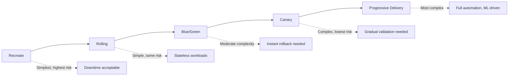
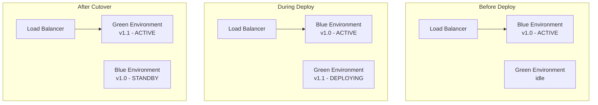
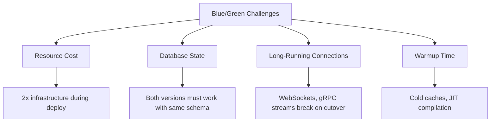
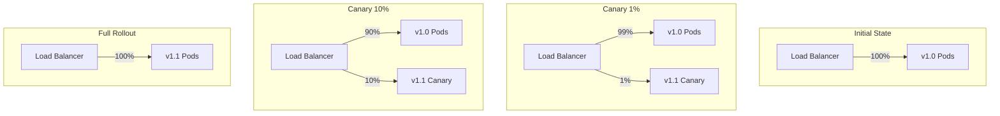
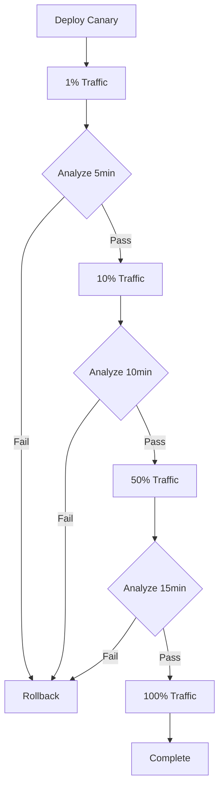
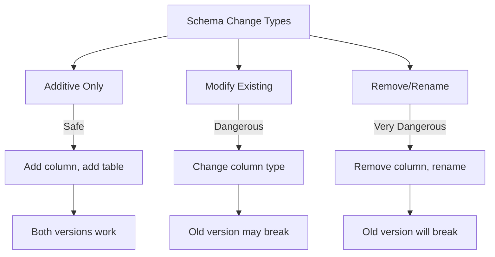
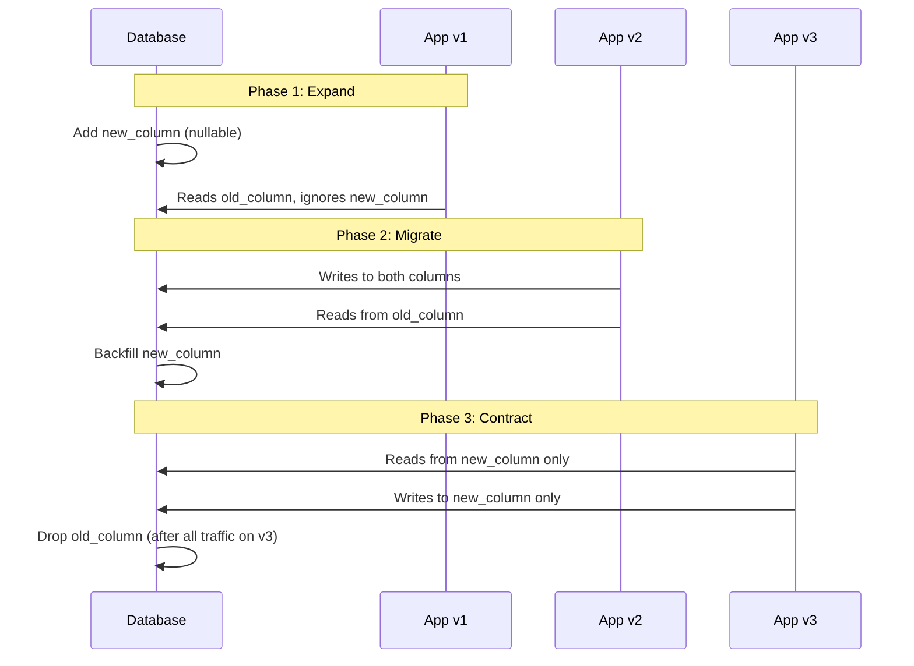
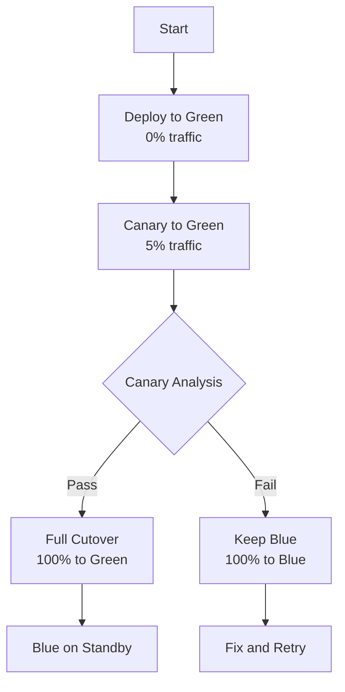
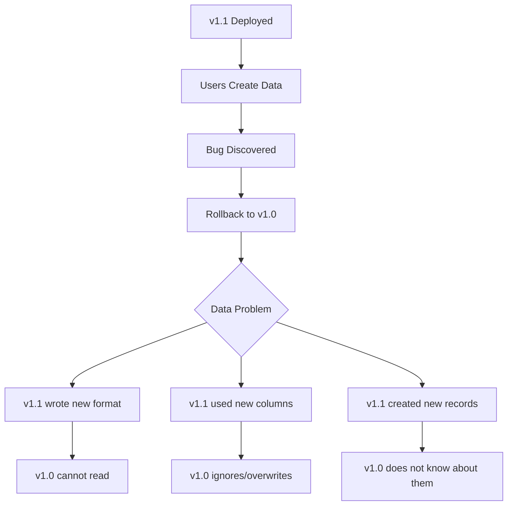

*[B/G]: Blue/Green Deployment
*[CD]: Continuous Deployment
*[LB]: Load Balancer
*[MTTR]: Mean Time To Recovery
*[SLO]: Service Level Objective
*[RTO]: Recovery Time Objective
*[A/B]: A/B Testing

# Blue/Green vs Canary: Choosing Deployment Strategies

## Introduction

Brief overview of the deployment strategy decision: every team eventually asks "should we do blue/green or canary?" but the answer depends on factors rarely discussed—database state handling, traffic management capabilities, rollback requirements, and team operational maturity. This section frames deployment strategies as tradeoffs, not a progression from "basic" to "advanced."

_Include a real-world scenario: a team adopts canary deployments because it sounds sophisticated, but their database schema changes make gradual rollouts nearly impossible. They spend months wrestling with complexity before realizing blue/green with feature flags would have been simpler and safer._

<Callout type="warning">
There is no universally "best" deployment strategy. The right choice depends on your state management, traffic control capabilities, rollback requirements, and operational maturity. Sophisticated is not always better.
</Callout>

## Deployment Strategy Overview

### The Deployment Strategy Spectrum

Introduce the main strategies and where they fit on the risk/complexity spectrum.


Figure: Deployment strategies on the risk/complexity spectrum.

| Strategy | Downtime | Rollback Speed | Resource Cost | Complexity |
|----------|----------|----------------|---------------|------------|
| Recreate | Yes | Minutes | 1x | Minimal |
| Rolling | No* | Minutes | 1x-1.5x | Low |
| Blue/Green | No | Seconds | 2x | Medium |
| Canary | No | Seconds | 1.1x-1.5x | High |
| Progressive | No | Automatic | 1.1x-2x | Very High |

Table: Deployment strategy comparison across key dimensions. *Rolling may have degraded capacity during deploy.

### When Simple Wins

Explain why more sophisticated strategies are not always better.

```yaml title="strategy-selection-guide.yaml"
questions:
  - question: "Can you tolerate 30 seconds of downtime?"
    if_yes: "Recreate might be fine—don't over-engineer"

  - question: "Is your workload stateless?"
    if_yes: "Rolling update is often sufficient"

  - question: "Do you need instant rollback (<5 seconds)?"
    if_yes: "Blue/Green is worth the cost"

  - question: "Do you need to validate with real traffic before full rollout?"
    if_yes: "Canary is appropriate"

  - question: "Do you have the tooling for traffic splitting?"
    if_no: "Blue/Green is more achievable than canary"

  - question: "Are your database changes backward-compatible?"
    if_no: "No strategy will save you—fix this first"
```
Code: Decision tree for deployment strategy selection.

## Blue/Green Deployments

### How Blue/Green Works

Explain the mechanics of blue/green deployment.


Figure: Blue/green deployment lifecycle showing environment swap.

```yaml title="blue-green-kubernetes.yaml"
# Blue deployment (current production)
apiVersion: apps/v1
kind: Deployment
metadata:
  name: myapp-blue
  labels:
    app: myapp
    version: blue
spec:
  replicas: 3
  selector:
    matchLabels:
      app: myapp
      version: blue
  template:
    metadata:
      labels:
        app: myapp
        version: blue
    spec:
      containers:
      - name: myapp
        image: myapp:1.0.0
---
# Green deployment (new version)
apiVersion: apps/v1
kind: Deployment
metadata:
  name: myapp-green
  labels:
    app: myapp
    version: green
spec:
  replicas: 3
  selector:
    matchLabels:
      app: myapp
      version: green
  template:
    metadata:
      labels:
        app: myapp
        version: green
    spec:
      containers:
      - name: myapp
        image: myapp:1.1.0
---
# Service - switch by changing selector
apiVersion: v1
kind: Service
metadata:
  name: myapp
spec:
  selector:
    app: myapp
    version: blue  # Change to 'green' to switch
  ports:
  - port: 80
    targetPort: 8080
```
Code: Kubernetes blue/green deployment using label selectors.

### Blue/Green Advantages

Detail the benefits of blue/green deployment.

| Advantage | Explanation |
|-----------|-------------|
| Instant rollback | Change one selector/DNS record to revert |
| Full environment testing | Test entire green environment before cutover |
| Simple mental model | Two environments, one is live, one is staging |
| No partial states | All traffic sees same version |
| Clean cutover | No mixed-version traffic during transition |

Table: Blue/green deployment advantages.

<Callout type="success">
Blue/green's killer feature is instant rollback. When something goes wrong, reverting is a single configuration change with near-zero latency—no waiting for pods to reschedule or instances to terminate.
</Callout>

### Blue/Green Challenges

Discuss the difficulties and costs of blue/green.


Figure: Key challenges with blue/green deployment strategy.

**Resource Cost Mitigation:**
```yaml title="blue-green-cost-optimization.yaml"
strategies:
  spot_instances:
    description: "Use spot/preemptible for standby environment"
    savings: "60-80% on standby costs"
    risk: "Slightly longer deploy if instances preempted"

  scale_to_zero:
    description: "Scale standby environment to zero between deploys"
    savings: "Nearly 50% overall"
    risk: "Slower deployment, cold start issues"

  shared_infrastructure:
    description: "Share load balancers, databases, caches"
    savings: "Varies by component"
    risk: "Reduced isolation"
```
Code: Strategies for reducing blue/green infrastructure costs.

### Blue/Green Rollback

Detail the rollback mechanics and considerations.

```bash title="blue-green-rollback.sh"
#!/bin/bash
# Blue/green rollback - extremely simple

# Option 1: Kubernetes selector change
kubectl patch service myapp -p '{"spec":{"selector":{"version":"blue"}}}'

# Option 2: Istio VirtualService
kubectl patch virtualservice myapp --type='json' \
  -p='[{"op": "replace", "path": "/spec/http/0/route/0/destination/subset", "value": "blue"}]'

# Option 3: AWS ALB target group
aws elbv2 modify-listener --listener-arn $LISTENER_ARN \
  --default-actions Type=forward,TargetGroupArn=$BLUE_TG_ARN

# Rollback is instant - no pod termination, no deployment
# Old version was running the entire time
```
Code: Blue/green rollback options across different platforms.

## Canary Deployments

### How Canary Works

Explain the mechanics of canary deployment with traffic splitting.


Figure: Canary deployment progression with traffic percentage increase.

```yaml title="canary-istio.yaml"
# Istio VirtualService for canary traffic splitting
apiVersion: networking.istio.io/v1beta1
kind: VirtualService
metadata:
  name: myapp
spec:
  hosts:
  - myapp
  http:
  - match:
    - headers:
        x-canary:
          exact: "true"
    route:
    - destination:
        host: myapp
        subset: canary
  - route:
    - destination:
        host: myapp
        subset: stable
      weight: 95
    - destination:
        host: myapp
        subset: canary
      weight: 5
---
apiVersion: networking.istio.io/v1beta1
kind: DestinationRule
metadata:
  name: myapp
spec:
  host: myapp
  subsets:
  - name: stable
    labels:
      version: stable
  - name: canary
    labels:
      version: canary
```
Code: Istio configuration for canary deployment with header-based override.

### Canary Advantages

Detail the benefits of canary deployment.

| Advantage | Explanation |
|-----------|-------------|
| Gradual risk exposure | Bugs affect small percentage first |
| Real traffic validation | Test with actual user behavior, not synthetic |
| Metric-driven decisions | Observe error rates, latency before proceeding |
| Selective targeting | Route specific users/regions to canary |
| Lower resource cost | Only ~10% extra capacity needed |

Table: Canary deployment advantages.

<Callout type="info">
Canary's value is validation with real traffic. If your monitoring cannot distinguish canary performance from stable, or you cannot act on the data, canary provides little benefit over blue/green.
</Callout>

### Canary Challenges

Discuss the complexities of canary deployment.

```yaml title="canary-challenges.yaml"
challenges:
  traffic_splitting:
    problem: "Need L7 load balancer or service mesh"
    solutions:
      - "Istio, Linkerd, or similar service mesh"
      - "Nginx Ingress with canary annotations"
      - "Cloud provider ALB with weighted target groups"
    complexity: "Medium to High"

  observability:
    problem: "Must distinguish canary metrics from stable"
    requirements:
      - "Version label on all metrics"
      - "Dashboards comparing canary vs stable"
      - "Alerting that understands traffic split"
    complexity: "High"

  stateful_requests:
    problem: "User sessions may hit different versions"
    solutions:
      - "Sticky sessions (reduces canary validity)"
      - "Stateless design (preferred)"
      - "Session storage shared between versions"
    complexity: "Medium"

  database_schema:
    problem: "Both versions must work with same schema"
    solutions:
      - "Expand-contract migrations only"
      - "Feature flags for new schema usage"
      - "Schema versioning (complex)"
    complexity: "Very High"
```
Code: Canary deployment challenges with solutions.

### Canary Analysis and Automation

Explain how to automate canary promotion decisions.

```typescript title="canary-analysis.ts"
interface CanaryMetrics {
  errorRate: number;
  p99Latency: number;
  p50Latency: number;
  successRate: number;
}

interface CanaryAnalysis {
  canary: CanaryMetrics;
  stable: CanaryMetrics;
  trafficPercentage: number;
  duration: number;  // seconds at current percentage
}

interface PromotionDecision {
  action: 'promote' | 'hold' | 'rollback';
  reason: string;
  confidence: number;
}

function analyzeCanary(analysis: CanaryAnalysis): PromotionDecision {
  const { canary, stable } = analysis;

  // Absolute thresholds - immediate rollback
  if (canary.errorRate > 0.05) {  // >5% errors
    return { action: 'rollback', reason: 'Error rate too high', confidence: 1.0 };
  }

  if (canary.p99Latency > 5000) {  // >5s p99
    return { action: 'rollback', reason: 'Latency too high', confidence: 1.0 };
  }

  // Relative thresholds - compare to stable
  const errorRatio = canary.errorRate / Math.max(stable.errorRate, 0.001);
  const latencyRatio = canary.p99Latency / stable.p99Latency;

  if (errorRatio > 1.5) {  // 50% more errors than stable
    return { action: 'rollback', reason: 'Error rate regression', confidence: 0.9 };
  }

  if (latencyRatio > 1.2) {  // 20% slower than stable
    return { action: 'hold', reason: 'Latency regression, needs investigation', confidence: 0.7 };
  }

  // Minimum observation time
  if (analysis.duration < 300) {  // Less than 5 minutes
    return { action: 'hold', reason: 'Insufficient observation time', confidence: 0.5 };
  }

  // All checks passed
  return { action: 'promote', reason: 'Metrics within acceptable range', confidence: 0.85 };
}
```
Code: Canary analysis logic for automated promotion decisions.


Figure: Automated canary progression with analysis gates.

## Comparing Strategies

### Decision Matrix

Provide a comprehensive comparison for decision-making.

| Factor | Blue/Green | Canary |
|--------|------------|--------|
| **Rollback speed** | Instant (<1s) | Fast (10-30s) |
| **Blast radius control** | All or nothing | Gradual |
| **Resource overhead** | 2x during deploy | 1.1x-1.5x |
| **Complexity** | Medium | High |
| **Traffic control needed** | Basic (DNS/LB) | Advanced (L7/mesh) |
| **Observability needed** | Standard | Version-aware |
| **Database handling** | Same for both | Same for both |
| **Validation approach** | Pre-cutover testing | Production traffic |
| **Best for** | Instant rollback priority | Gradual risk reduction |

Table: Blue/green vs. canary comparison across key factors.

### When to Choose Blue/Green

List the conditions that favor blue/green deployment.

```markdown title="blue-green-conditions.md"
## Choose Blue/Green When:

### Operational Conditions
- [ ] Instant rollback is critical (financial, compliance)
- [ ] Traffic splitting is not available or too complex
- [ ] Team is new to advanced deployment strategies
- [ ] Monitoring does not support version-segmented metrics

### Technical Conditions
- [ ] Long-running connections (WebSocket, gRPC streams)
- [ ] Stateful sessions that cannot be shared
- [ ] Pre-deployment testing is sufficient validation
- [ ] Database changes are infrequent

### Business Conditions
- [ ] Can afford 2x resource cost during deployment
- [ ] All-or-nothing rollout is acceptable
- [ ] Compliance requires clear cutover point
```
Code: Conditions favoring blue/green deployment.

### When to Choose Canary

List the conditions that favor canary deployment.

```markdown title="canary-conditions.md"
## Choose Canary When:

### Operational Conditions
- [ ] Team has experience with traffic management
- [ ] Observability platform supports version-aware metrics
- [ ] Automated analysis is available or planned
- [ ] On-call can respond to canary-specific alerts

### Technical Conditions
- [ ] Service mesh or L7 load balancer available
- [ ] Workload is stateless or handles state gracefully
- [ ] Database changes are backward-compatible
- [ ] Sufficient traffic for statistical significance

### Business Conditions
- [ ] Need to minimize blast radius for risky changes
- [ ] Want production validation before full rollout
- [ ] Cannot afford 2x resource cost
- [ ] Gradual rollout is acceptable (not all features need instant availability)
```
Code: Conditions favoring canary deployment.

<Callout type="warning">
Do not choose canary just because it sounds more sophisticated. If you do not have the traffic management and observability to make it work, canary becomes complexity without benefit.
</Callout>

## Database State: The Elephant in the Room

### Why Database State Complicates Everything

Explain how database schema changes affect all deployment strategies.


Figure: Database schema change categories and their deployment impact.

```yaml title="schema-change-impact.yaml"
schema_changes:
  safe_for_all_strategies:
    - "Add new nullable column"
    - "Add new table"
    - "Add new index"
    - "Widen column (e.g., VARCHAR(50) to VARCHAR(100))"

  requires_coordination:
    - "Add new NOT NULL column"  # Must have default or app change first
    - "Add foreign key constraint"  # Must ensure data integrity first
    - "Change column type (compatible)"  # Test thoroughly

  dangerous_without_expand_contract:
    - "Rename column"
    - "Remove column"
    - "Narrow column"
    - "Change column type (incompatible)"

  deployment_strategy_irrelevant:
    - "All strategies require schema compatibility"
    - "Canary does not solve schema incompatibility"
    - "Blue/green does not solve schema incompatibility"
```
Code: Database schema change categories and their deployment implications.

### The Expand-Contract Pattern

Explain how to handle schema changes safely with any deployment strategy.


Figure: Expand-contract pattern for safe schema evolution.

```sql title="expand-contract-example.sql"
-- PHASE 1: Expand (deploy before any app changes)
ALTER TABLE users ADD COLUMN email_verified_at TIMESTAMP NULL;

-- PHASE 2: Migrate (app v2 writes to both, reads old)
-- App code change: write email_verified = true AND email_verified_at = NOW()
-- Backfill existing data:
UPDATE users
SET email_verified_at = created_at
WHERE email_verified = true AND email_verified_at IS NULL;

-- PHASE 3: Contract (only after all traffic on v3+)
-- App code change: read/write only email_verified_at
-- Wait for all old versions to drain
ALTER TABLE users DROP COLUMN email_verified;
```
Code: SQL example of expand-contract migration for column rename.

<Callout type="danger">
Neither blue/green nor canary solves database incompatibility. If your old and new versions cannot both work with the same schema, no deployment strategy will help—you need expand-contract migrations.
</Callout>

## Hybrid Strategies

### Blue/Green with Canary Validation

Describe combining strategies for best-of-both-worlds.


Figure: Hybrid approach using canary validation before blue/green cutover.

```yaml title="hybrid-deployment.yaml"
deployment:
  type: hybrid-blue-green-canary

  stages:
    - name: deploy-green
      action: deploy
      target: green
      traffic: 0%
      validation:
        - smoke_tests
        - health_checks

    - name: canary-validation
      action: shift_traffic
      target: green
      traffic: 5%
      duration: 15m
      analysis:
        error_rate_threshold: 0.01
        latency_p99_threshold: 500ms

    - name: cutover
      action: shift_traffic
      target: green
      traffic: 100%
      condition: canary_passed

    - name: standby
      action: keep_alive
      target: blue
      duration: 30m  # Keep blue ready for instant rollback

    - name: cleanup
      action: scale_down
      target: blue
      condition: green_stable_30m
```
Code: Hybrid deployment configuration combining canary validation with blue/green cutover.

### Feature Flags as an Alternative

Explain when feature flags can reduce deployment strategy complexity.

```typescript title="feature-flag-deployment.ts"
// Instead of complex canary infrastructure,
// deploy the code and control exposure with flags

import { featureFlags } from './feature-service';

async function processOrder(order: Order): Promise<OrderResult> {
  // New algorithm deployed but controlled by flag
  if (await featureFlags.isEnabled('new-pricing-algorithm', {
    userId: order.userId,
    percentage: 5  // 5% canary via flag, not traffic
  })) {
    return newPricingAlgorithm(order);
  }

  return legacyPricingAlgorithm(order);
}

// Benefits:
// - Deploy with standard rolling update
// - Control exposure at feature level, not request level
// - Instant disable without deployment
// - User-level consistency (same user always sees same version)
// - Works with any deployment strategy
```
Code: Feature flags providing canary-like gradual rollout without traffic splitting.

| Approach | Traffic Split | Feature Control | User Consistency |
|----------|--------------|-----------------|------------------|
| Canary | At load balancer | All features together | Random per request |
| Feature Flags | At application | Per feature | Per user |
| Combined | Both | Both | Configurable |

Table: Comparing canary traffic splitting with feature flag control.

## Rollback Considerations

### Rollback Scenarios

Detail what happens during rollback for each strategy.

```yaml title="rollback-scenarios.yaml"
scenarios:
  blue_green_rollback:
    trigger: "Switch traffic back to blue"
    time: "<1 second"
    state: "Blue environment unchanged, no pod restarts"
    user_impact: "Minimal, in-flight requests may fail"
    data_impact: "Data written during green may be orphaned"

  canary_rollback:
    trigger: "Route all traffic to stable"
    time: "5-30 seconds depending on mesh"
    state: "Canary pods still running, stable unchanged"
    user_impact: "Canary users see version change"
    data_impact: "Same as blue/green"

  rolling_rollback:
    trigger: "Rollout new deployment with old image"
    time: "Minutes (depends on pod count)"
    state: "Pods gradually replaced"
    user_impact: "Mixed versions during rollback"
    data_impact: "Same as above"
```
Code: Rollback scenarios comparing strategies.

### Data Consistency During Rollback

Address the often-ignored problem of data written by the new version.


Figure: Data consistency challenges when rolling back after data has been written.

<Callout type="warning">
Rollback is never truly instant for stateful applications. Even with instant traffic shift, data written by the new version may cause problems for the old version. Design for forward compatibility, not just backward.
</Callout>

## Implementation Checklist

### Blue/Green Checklist

```markdown title="blue-green-checklist.md"
## Infrastructure
- [ ] Two identical environments provisioned
- [ ] Load balancer supports quick target switching
- [ ] Database accessible from both environments
- [ ] Shared cache/session storage if needed

## Process
- [ ] Deployment automation for green environment
- [ ] Smoke test suite for pre-cutover validation
- [ ] Cutover runbook documented
- [ ] Rollback runbook documented and tested

## Monitoring
- [ ] Health checks for both environments
- [ ] Alerting on green environment before cutover
- [ ] Traffic monitoring to confirm cutover

## Cost Management
- [ ] Strategy for standby environment cost (spot, scale-down)
- [ ] Cleanup automation for old green after successful deploy
```
Code: Blue/green implementation checklist.

### Canary Checklist

```markdown title="canary-checklist.md"
## Infrastructure
- [ ] Traffic splitting capability (service mesh, ingress)
- [ ] Version-aware routing configured
- [ ] Canary deployment pipeline

## Observability
- [ ] Metrics labeled by version
- [ ] Dashboards comparing canary vs stable
- [ ] Alerting on canary-specific thresholds

## Analysis
- [ ] Promotion criteria defined
- [ ] Analysis automation (Argo Rollouts, Flagger, custom)
- [ ] Rollback triggers defined

## Operations
- [ ] Team trained on canary debugging
- [ ] Manual override process documented
- [ ] Incident response for canary-specific issues
```
Code: Canary deployment implementation checklist.

## Conclusion

Summarize the key principles: choose deployment strategy based on your actual constraints (traffic management capability, observability maturity, database complexity) rather than perceived sophistication; blue/green excels at instant rollback and simplicity, canary excels at gradual risk reduction with production traffic; neither strategy solves database schema incompatibility—that requires expand-contract migrations regardless. Emphasize that the best deployment strategy is the one your team can operate reliably.

<Callout type="success">
The goal is not the most sophisticated deployment strategy—it is reliable deployments with fast recovery. A well-operated blue/green deployment is better than a poorly-operated canary. Choose the strategy you can do well.
</Callout>

---

## Cover Prompt

### Prompt 1: The Two Paths

Create an image showing two distinct deployment paths from a single source. One path (blue/green) shows a clean switchover between two parallel environments. The other path (canary) shows a gradual flow splitting and merging. Both lead to a "Production" destination. Style: clean technical illustration, blue and green on one side, yellow/gold (canary) on the other, 16:9 aspect ratio.

### Prompt 2: The Traffic Controller

Design an image of an air traffic control tower overlooking a runway (representing production). Two planes (blue and green) are on the ground, while small birds (canaries) fly in a test pattern. The controller decides which traffic to route. Style: stylized aviation illustration, clean lines, blue sky background, 16:9 aspect ratio.

### Prompt 3: The Deployment Spectrum

Illustrate a horizontal spectrum/gradient showing deployment strategies from simple (left) to complex (right). Recreate → Rolling → Blue/Green → Canary → Progressive. Each strategy is represented by an abstract icon showing its traffic pattern. Style: infographic art, gradient colors from warm to cool, minimalist icons, 16:9 aspect ratio.

### Prompt 4: The Safety Net Comparison

Create a split-screen image. Left side shows blue/green: a tightrope walker with a complete safety net below (instant rollback). Right side shows canary: a tightrope walker with spotters gradually increasing support (gradual validation). Both are crossing safely but with different safety mechanisms. Style: circus/performance art aesthetic, dramatic lighting, 16:9 aspect ratio.

### Prompt 5: The Decision Tree

Design an image of an elegant decision tree where a path forks based on questions (traffic control available? instant rollback needed? observability mature?). Different paths lead to different deployment strategy icons. The tree grows from "requirements" soil into "strategy" branches. Style: botanical illustration meets flowchart, organic shapes with technical elements, earth and sky tones, 16:9 aspect ratio.
