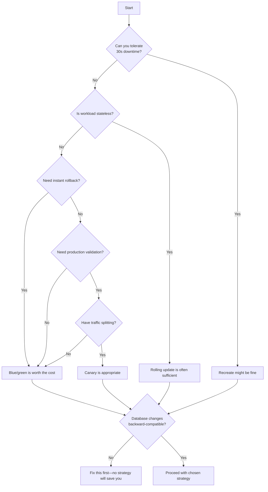
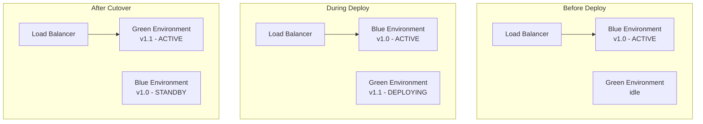
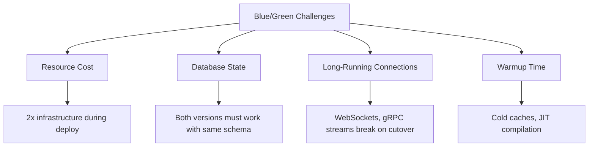
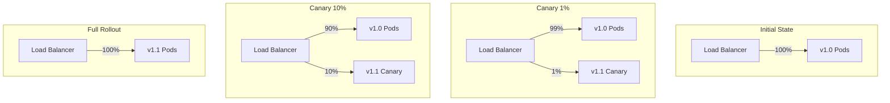
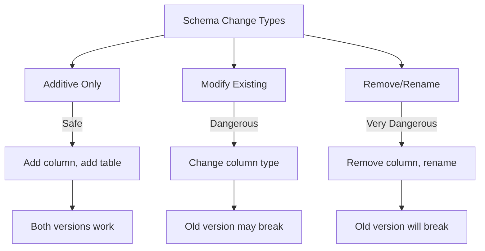
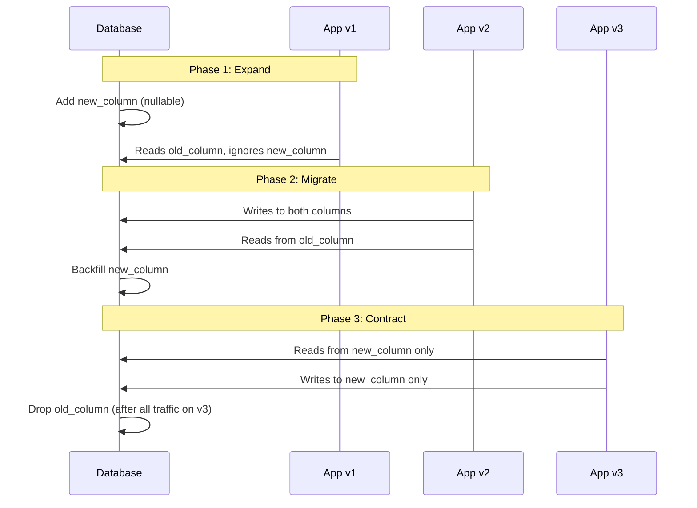
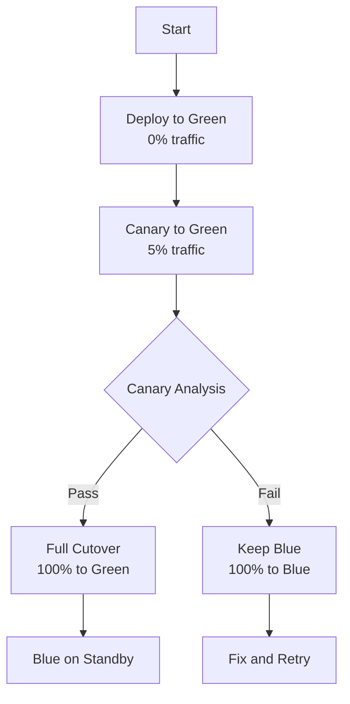
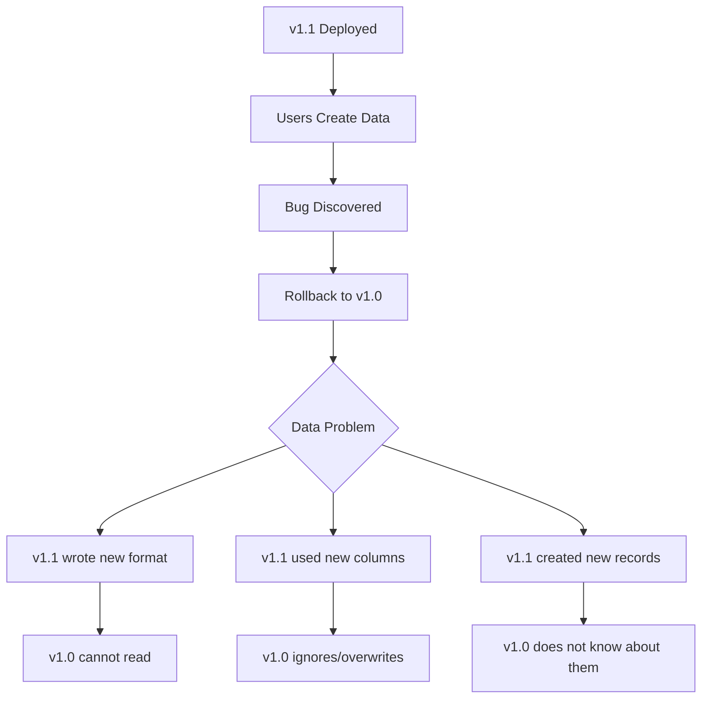

import Callout from '@components/Callout/index.astro'

*[LB]: Load Balancer

Every platform team eventually faces the question: "Should we do blue/green or canary?" The conversation usually starts after a bad deployment, when someone suggests that a more sophisticated strategy would have caught the problem earlier.

<Callout type="info">
_Blue/green_ maintains two identical production environments—deploy to the inactive one, then switch traffic instantly. _Canary_ gradually shifts traffic to the new version (1%, then 10%, then 50%) while monitoring for problems. Both avoid downtime, but they optimize for different things: blue/green for instant rollback, canary for gradual risk exposure.
</Callout>

Here's the uncomfortable truth: the answer depends on factors most teams don't discuss until they're already committed. Database state handling. Traffic management capabilities. Rollback requirements. Operational maturity. These constraints matter more than which strategy sounds more advanced.

I watched a team spend six months implementing canary deployments because it seemed like the mature choice. They built the Istio configuration, the analysis pipelines, the promotion automation. Then they hit their first schema migration. Both versions needed to work with the same database, but the new version required a column rename. Their canary infrastructure couldn't help—they needed expand-contract migrations, which they didn't have. The canary sat at 1% traffic for two weeks while they figured out what to do.

They eventually realized that blue/green with feature flags would have given them everything they actually needed: instant rollback, pre-production validation, and gradual feature exposure. The canary complexity was solving a problem they didn't have while ignoring the problem they did.

This isn't a story about canary being bad. It's about choosing deployment strategies based on your _actual_ constraints rather than perceived sophistication.

<Callout type="warning">
There's no universally "best" deployment strategy. The right choice depends on your state management, traffic control capabilities, rollback requirements, and operational maturity. Sophisticated isn't always better.
</Callout>

## Deployment Strategy Overview

### The Deployment Strategy Spectrum

Before diving into blue/green and canary specifically, it helps to see where they fit among all deployment strategies. This isn't a progression from "beginner" to "advanced"—it's a spectrum of tradeoffs. Each strategy makes different assumptions about what you can afford—downtime, infrastructure cost, operational overhead, and tooling investment.

| Strategy | Downtime | Rollback Speed | Resource Cost | Complexity |
|----------|----------|----------------|---------------|------------|
| Recreate | Yes | Minutes | 1x | Minimal |
| Rolling | No* | Minutes | 1x-1.5x | Low |
| Blue/Green | No | Seconds | 2x | Medium |
| Canary | No | Seconds | 1.1x-1.5x | High |
| Progressive | No | Automatic | 1.1x-2x | Very High |

Table: Deployment strategy comparison across key dimensions. *Rolling may have degraded capacity during deploy.

_Recreate_ is the simplest: stop old version, start new version. If you're running a batch job or an internal tool where 30 seconds of downtime doesn't matter, this is fine. Don't add complexity you don't need.

_Rolling_ updates pods gradually—some run the old version while others run the new. Kubernetes does this by default. It works well for stateless workloads but creates a window where mixed versions handle traffic, and rollback means deploying the old image again (minutes, not seconds).

_Blue/green_ and _canary_ are where most production web services land. We'll spend the rest of this article on these two.

_Progressive delivery_ extends canary with automated analysis, often using machine learning to detect anomalies. Tools like Argo Rollouts and Flagger can automate promotion decisions. This is powerful but requires mature observability and operational investment.

### When Simple Wins

I've seen teams implement canary deployments for services that deploy once a month. The infrastructure sat idle 99% of the time, and when they did deploy, no one remembered how the analysis worked. A rolling update with good smoke tests would have been simpler and just as effective.

The questions that actually matter:


Figure: Decision tree for selecting a deployment strategy.

That last question is the one teams most often ignore. If your schema migration breaks the old version, it doesn't matter whether you're doing blue/green, canary, or rolling—you've got a problem. We'll cover this in detail later.

## Blue/Green Deployments

### How Blue/Green Works

Blue/green deployment maintains two identical production environments. At any time, one is "live" (receiving traffic) and one is "idle" (ready for the next deployment). When you deploy, you update the idle environment, validate it, then switch traffic. The old live environment becomes the new idle—ready for instant rollback if needed.

The mental model is simple: you're always one configuration change away from either the new version or the old one.


Figure: Blue/green deployment lifecycle showing environment swap.

In Kubernetes, the simplest implementation uses label selectors. Both deployments run simultaneously, and the Service routes traffic based on which label it selects.

```yaml title="blue-green-kubernetes.yaml"
# Blue deployment (current production)
apiVersion: apps/v1
kind: Deployment
metadata:
  name: myapp-blue
  labels:
    app: myapp
    version: blue
spec:
  replicas: 3
  selector:
    matchLabels:
      app: myapp
      version: blue
  template:
    metadata:
      labels:
        app: myapp
        version: blue
    spec:
      containers:
      - name: myapp
        image: myapp:1.0.0
---
# Green deployment (new version)
apiVersion: apps/v1
kind: Deployment
metadata:
  name: myapp-green
  labels:
    app: myapp
    version: green
spec:
  replicas: 3
  selector:
    matchLabels:
      app: myapp
      version: green
  template:
    metadata:
      labels:
        app: myapp
        version: green
    spec:
      containers:
      - name: myapp
        image: myapp:1.1.0
---
# Service - switch by changing selector
apiVersion: v1
kind: Service
metadata:
  name: myapp
spec:
  selector:
    app: myapp
    version: blue  # Change to 'green' to switch
  ports:
  - port: 80
    targetPort: 8080
```
Code: Kubernetes blue/green deployment using label selectors.

The cutover is a single `kubectl patch` command. No pods restart, no gradual rollout—traffic shifts immediately. And because the old version keeps running, rollback is equally instant—just point traffic back.

| Advantage | Explanation |
|-----------|-------------|
| Instant rollback | Change one selector/DNS record to revert—old version is already running |
| Full environment testing | Validate the entire green stack before any production traffic |
| Simple mental model | Two environments, one is live, one is staging—no complex states |
| No partial states | All traffic sees the same version, always |
| Clean cutover | No window of mixed-version traffic during transition |

Table: Blue/green deployment advantages.

### Blue/Green Challenges

Blue/green isn't free. The tradeoffs are real, and ignoring them leads to surprises.


Figure: Key challenges with blue/green deployment strategy.

_Resource cost_ is the obvious one: you're running two production environments. During active deployment, that's 2x compute. Even when idle, the standby environment consumes resources unless you scale it down.

_Database state_ affects all deployment strategies, but blue/green makes it explicit. Both environments point at the same database, so both versions must handle the current schema. We'll cover this in detail later—it's important enough to deserve its own section.

_Long-running connections_ break on cutover. If your application uses WebSockets, gRPC streams, or HTTP/2 server push, clients connected to blue will lose their connections when traffic switches to green. You need graceful connection draining or client-side reconnection logic.

Connection draining means telling the old environment to stop accepting new connections while allowing existing requests to complete. In Kubernetes, this is controlled by `terminationGracePeriodSeconds`—when you switch traffic away from blue, give it 30-60 seconds to finish in-flight requests before terminating pods. For WebSockets, you'll also need application-level logic: send a "reconnect" message to connected clients before shutdown, or implement automatic reconnection on the client side.

_Warmup time_ catches teams off guard. The green environment might be "up" but cold—empty caches, uncompiled JIT code, no connection pools. The first requests after cutover hit a system that's technically ready but not warm.

You can mitigate the resource cost:

| Strategy | Approach | Savings | Risk |
|----------|----------|---------|------|
| Spot instances | Use spot/preemptible for standby | 60-80% on standby | Longer deploy if preempted |
| Scale to zero | Scale standby to zero between deploys | ~50% overall | Slower deployment, cold starts |
| Shared infrastructure | Share load balancers, databases, caches | Varies | Reduced isolation |

Table: Cost mitigation strategies for blue/green deployments.

Most teams use a hybrid: scale the standby environment down to minimal capacity between deploys, then scale up when deployment starts. You trade deployment speed for cost savings.

### Blue/Green Rollback

Rollback is where blue/green shines. The old version is already running—you just redirect traffic back to it.

```bash title="blue-green-rollback.sh"
#!/bin/bash
# Blue/green rollback - extremely simple

# Option 1: Kubernetes selector change
kubectl patch service myapp -p '{"spec":{"selector":{"version":"blue"}}}'

# Option 2: Istio VirtualService
kubectl patch virtualservice myapp --type='json' \
  -p='[{"op": "replace", "path": "/spec/http/0/route/0/destination/subset", "value": "blue"}]'

# Option 3: AWS ALB target group
aws elbv2 modify-listener --listener-arn $LISTENER_ARN \
  --default-actions Type=forward,TargetGroupArn=$BLUE_TG_ARN

# Rollback is instant - no pod termination, no deployment
# Old version was running the entire time
```
Code: Blue/green rollback options across different platforms.

Compare this to rolling update rollback, which means deploying the old image again and waiting for pods to cycle. Or canary rollback, which requires reconfiguring traffic weights. Blue/green rollback is a single atomic operation.

## Canary Deployments

### How Canary Works

Canary deployment takes a different approach: instead of switching all traffic at once, you gradually shift it. Deploy the new version alongside the old, send it 1% of traffic, watch the metrics. If things look good, increase to 10%, then 50%, then 100%. If something breaks, you've only affected a small percentage of users—and you roll back before most people notice.

The name comes from coal mining, where canaries detected toxic gases before miners were harmed. Your canary deployment detects production problems before most users are affected.


Figure: Canary deployment progression with traffic percentage increase.

Implementing canary requires traffic splitting at the load balancer or service mesh level. Here's an Istio configuration that routes 5% of traffic to the canary, with an override header for testing:

```yaml title="canary-istio.yaml"
# Istio VirtualService for canary traffic splitting
apiVersion: networking.istio.io/v1beta1
kind: VirtualService
metadata:
  name: myapp
spec:
  hosts:
  - myapp
  http:
  - match:
    - headers:
        x-canary:
          exact: "true"
    route:
    - destination:
        host: myapp
        subset: canary
  - route:
    - destination:
        host: myapp
        subset: stable
      weight: 95
    - destination:
        host: myapp
        subset: canary
      weight: 5
---
apiVersion: networking.istio.io/v1beta1
kind: DestinationRule
metadata:
  name: myapp
spec:
  host: myapp
  subsets:
  - name: stable
    labels:
      version: stable
  - name: canary
    labels:
      version: canary
```
Code: Istio configuration for canary deployment with header-based override.

The header override (`x-canary: true`) is useful for testing—you can force your requests to the canary before opening it to real users.

| Advantage | Explanation |
|-----------|-------------|
| Gradual risk exposure | Bugs affect small percentage first |
| Real traffic validation | Test with actual user behavior, not synthetic |
| Metric-driven decisions | Observe error rates, latency before proceeding |
| Selective targeting | Route specific users/regions to canary |
| Lower resource cost | Only ~10% extra capacity needed |

Table: Canary deployment advantages.

The resource efficiency is worth noting. Unlike blue/green's 2x infrastructure during deployment, canary only needs enough extra capacity for the canary percentage—typically 10-50% more, not double.

<Callout type="info">
Flagger is an open-source progressive delivery operator for Kubernetes that simplifies canary release workflows. It provides sophisticated traffic shifting management and automated health analysis, ensuring that new versions are only promoted once they have proven their stability in production.
</Callout>

### Canary Challenges

Canary's gradual approach comes with significant complexity. You need infrastructure that most teams don't have out of the box.

_Traffic splitting_ requires L7 load balancing or a service mesh. Standard L4 load balancers can't do percentage-based routing. You need Istio, Linkerd, NGINX Ingress with canary annotations, or cloud provider ALBs with weighted target groups. If you don't have this infrastructure, canary isn't an option—blue/green is more achievable.

_Observability_ must be version-aware. Your metrics need to distinguish canary from stable so you can compare error rates and latencies. "Overall error rate is 0.5%" doesn't help—you need "canary error rate is 2%, stable is 0.3%." This means version labels on all metrics, dashboards that compare versions side by side, and alerting that understands the traffic split.

_Stateful requests_ create consistency problems. If a user's session spans multiple requests, they might hit v1.0 for the first request and v1.1 for the second. For stateless APIs this is fine, but for stateful workflows it can cause bugs that only appear in production during canary.

_Database schema_ affects canary exactly as it affects blue/green—both versions must work with the same schema. Canary doesn't solve this problem; it just means both versions run simultaneously for longer.

<Callout type="info">
Canary's value is validation with real traffic. If your monitoring can't distinguish canary performance from stable, or you can't act on the data, canary provides little benefit over blue/green.
</Callout>

### Canary Analysis and Automation

Manual canary promotion is tedious and error-prone. You deploy, watch dashboards for 10 minutes, increase traffic, watch for another 10 minutes, repeat. At 3 AM, someone skips the observation period because they want to go back to sleep.

Automated canary analysis solves this. Define promotion criteria upfront, let the system watch metrics and decide whether to promote, hold, or roll back.

```python title="canary-analysis-lambda.py"
# AWS CodePipeline gate Lambda: evaluate CloudWatch metrics to promote, hold, or roll back canary.
import os

import boto3
from botocore.exceptions import ClientError

cloudWatch = boto3.client('cloudwatch')

# Thresholds - absolute limits that trigger immediate rollback
ABSOLUTE_ERROR_RATE_THRESHOLD = 0.05  # >5% errors is always bad
ABSOLUTE_LATENCY_P99_THRESHOLD = 5000  # >5s p99 is always bad

# Thresholds - relative limits comparing canary to stable
RELATIVE_ERROR_RATE_THRESHOLD = 1.5  # 50% more errors than stable
RELATIVE_LATENCY_THRESHOLD = 1.2  # 20% slower than stable


def getMetricAverage(namespace, metricName, dimensions, minutes=5):
  """Fetch average metric value over the specified time window."""
  response = cloudWatch.get_metric_statistics(
    Namespace=namespace,
    MetricName=metricName,
    Dimensions=dimensions,
    StartTime=datetime.utcnow() - timedelta(minutes=minutes),
    EndTime=datetime.utcnow(),
    Period=60,
    Statistics=['Average']
  )
  datapoints = response.get('Datapoints', [])
  if not datapoints:
    return None
  return sum(d['Average'] for d in datapoints) / len(datapoints)


def lambdaHandler(event, context):
  serviceName = event.get('serviceName')
  namespace = event.get('namespace', 'MyApp')

  # Get canary metrics
  canaryErrorRate = getMetricAverage(
    namespace, 'ErrorRate',
    [{'Name': 'Version', 'Value': 'canary'}, {'Name': 'Service', 'Value': serviceName}]
  )
  canaryLatencyP99 = getMetricAverage(
    namespace, 'LatencyP99',
    [{'Name': 'Version', 'Value': 'canary'}, {'Name': 'Service', 'Value': serviceName}]
  )

  # Get stable metrics for comparison
  stableErrorRate = getMetricAverage(
    namespace, 'ErrorRate',
    [{'Name': 'Version', 'Value': 'stable'}, {'Name': 'Service', 'Value': serviceName}]
  )
  stableLatencyP99 = getMetricAverage(
    namespace, 'LatencyP99',
    [{'Name': 'Version', 'Value': 'stable'}, {'Name': 'Service', 'Value': serviceName}]
  )

  # Check for insufficient data
  if canaryErrorRate is None or stableErrorRate is None:
    return {'action': 'hold', 'reason': 'Insufficient metric data', 'confidence': 0.5}

  # Absolute thresholds - immediate rollback regardless of stable performance
  if canaryErrorRate > ABSOLUTE_ERROR_RATE_THRESHOLD:
    return {'action': 'rollback', 'reason': f'Error rate {canaryErrorRate:.1%} exceeds 5%', 'confidence': 0.95}

  if canaryLatencyP99 and canaryLatencyP99 > ABSOLUTE_LATENCY_P99_THRESHOLD:
    return {'action': 'rollback', 'reason': f'P99 latency {canaryLatencyP99}ms exceeds 5s', 'confidence': 0.95}

  # Relative thresholds - compare canary to stable
  errorRatio = canaryErrorRate / max(stableErrorRate, 0.001)  # Avoid division by zero
  if errorRatio > RELATIVE_ERROR_RATE_THRESHOLD:
    return {'action': 'rollback', 'reason': f'Error rate {errorRatio:.1f}x higher than stable', 'confidence': 0.9}

  if canaryLatencyP99 and stableLatencyP99:
    latencyRatio = canaryLatencyP99 / stableLatencyP99
    if latencyRatio > RELATIVE_LATENCY_THRESHOLD:
      return {'action': 'hold', 'reason': f'Latency {latencyRatio:.1f}x higher than stable', 'confidence': 0.7}

  # Check minimum observation time
  observationSeconds = int(event.get('observationSeconds', 0))
  minObservationSeconds = int(os.getenv('MIN_OBSERVATION_SECONDS', '300'))
  if observationSeconds < minObservationSeconds:
    return {'action': 'hold', 'reason': 'Observation window not long enough', 'confidence': 0.7}

  return {'action': 'promote', 'reason': 'All metrics within acceptable range', 'confidence': 0.9}
```
Code: Canary analysis Lambda with absolute and relative threshold checks.

The key insight is using both absolute thresholds (error rate > 5% is always bad) and relative thresholds (50% more errors than stable is a regression, even if the absolute rate is low). Absolute thresholds catch catastrophic failures regardless of baseline. Relative thresholds catch regressions even when the absolute numbers look acceptable. Tools like Argo Rollouts and Flagger implement this pattern with Prometheus queries. The total deployment time is longer than blue/green (30+ minutes vs. seconds), but you gain confidence that the new version works with real traffic before committing fully.

## Comparing Strategies

### Decision Matrix

With both strategies understood, the choice comes down to your constraints and priorities. This matrix summarizes the trade-offs:

| Factor | Blue/Green | Canary |
|--------|------------|--------|
| **Rollback speed** | Instant (&lt;1s) | Fast (10-30s) |
| **Blast radius control** | All or nothing | Gradual |
| **Resource overhead** | 2x during deploy | 1.1x-1.5x |
| **Complexity** | Medium | High |
| **Traffic control needed** | Basic (DNS/LB) | Advanced (L7/mesh) |
| **Observability needed** | Standard | Version-aware |
| **Database handling** | Same for both | Same for both |
| **Validation approach** | Pre-cutover testing | Production traffic |
| **Best for** | Instant rollback priority | Gradual risk reduction |

Table: Blue/green vs. canary comparison across key factors.

The "database handling" row is intentionally identical—neither strategy solves schema compatibility. That problem is orthogonal to traffic routing.

### When to Choose Blue/Green

Blue/green is the right choice when you value simplicity and instant rollback over gradual validation:

_Instant rollback is non-negotiable._ Financial systems, compliance-heavy environments, or anywhere a bad deployment could cost real money benefit from sub-second rollback. Canary's 10-30 second rollback might be fast enough for most systems, but blue/green's instant cutback is faster.

_You don't have traffic splitting infrastructure._ If your load balancer is L4-only, or you don't have a service mesh, canary isn't practical. Blue/green works with basic DNS or load balancer configuration that every team already has.

_Your team is new to advanced deployments._ Blue/green is conceptually simpler—two environments, switch traffic, done. Canary requires understanding traffic percentages, metric analysis, and promotion criteria. Start with blue/green, graduate to canary when you've outgrown it.

_Your workload has long-running connections._ WebSocket connections, gRPC streams, or persistent TCP connections don't play well with gradual traffic shifts. Blue/green's clean cutover, combined with proper connection draining, handles these better.

_Pre-deployment testing is sufficient._ If your staging environment accurately mirrors production, and you trust your test suite, blue/green's "test then deploy" model works. Canary's value is production validation—if you don't need it, you're paying for complexity you won't use.

### When to Choose Canary

Canary is the right choice when you need production validation and can afford the complexity:

_You've been burned by staging-production differences._ "It worked in staging" is a common refrain. If your production traffic patterns, data volumes, or edge cases differ from staging, canary lets you validate with real traffic before full commitment.

_Blast radius matters more than rollback speed._ For high-traffic services, affecting 1% of users for 5 minutes is better than affecting 100% of users for 10 seconds. Canary catches problems before most users see them.

_You have the infrastructure._ Service mesh (Istio, Linkerd), L7 load balancer with weighted routing (AWS ALB, NGINX), and version-aware observability are prerequisites. If you already have these for other reasons, canary's marginal complexity is lower.

_You have enough traffic for statistical significance._ Canary analysis needs enough requests to distinguish signal from noise. If your service handles 10 requests per minute, you can't meaningfully compare canary vs. stable error rates. Blue/green is more appropriate for low-traffic services.

_Resource cost matters._ Blue/green's 2x infrastructure during deployment adds up. Canary's 10-50% overhead is cheaper, especially for large deployments or frequent releases.

<Callout type="warning">
Don't choose canary because it sounds more sophisticated. If you don't have the traffic management and observability to make it work, canary becomes complexity without benefit.
</Callout>

## Database State: The Elephant in the Room

### Why Database State Complicates Everything

Here's the uncomfortable truth that deployment strategy discussions often gloss over: neither blue/green nor canary solves database schema incompatibility. Both strategies assume your old and new application versions can work with the same database schema simultaneously. When that assumption breaks, no amount of traffic routing sophistication will save you.

Schema changes fall into three categories with very different risk profiles:


Figure: Database schema change categories and their deployment impact.

_Additive changes_ are safe: adding a nullable column, creating a new table, adding an index. The old version ignores what it doesn't know about, the new version uses what it needs. Both versions work.

_Modifying existing structures_ gets dangerous. Changing a column type, adding a NOT NULL constraint, or adding a foreign key can break the old version mid-deployment. Even if the change is "compatible," you're relying on implicit behavior that may vary between database versions.

_Removing or renaming_ is where deployments fail. If v1.1 removes a column that v1.0 still reads, you can't run both versions simultaneously—which means no blue/green warmup period, no canary gradual rollout. You're back to big-bang deployments with their attendant risks.

The deployment strategy you choose doesn't change this calculus. Canary doesn't let you "test" a breaking schema change on 5% of traffic—the schema change affects 100% of the database the moment you run the migration.

### The Expand-Contract Pattern

The solution is decoupling schema changes from application deployments through expand-contract migrations. Instead of one deployment that changes both schema and code, you do three:


Figure: Expand-contract pattern for safe schema evolution.

Here's a concrete example—renaming `email_verified` (boolean) to `email_verified_at` (timestamp):

```sql title="expand-contract-example.sql"
-- PHASE 1: Expand (deploy before any app changes)
ALTER TABLE users ADD COLUMN email_verified_at TIMESTAMP NULL;

-- PHASE 2: Migrate (app v2 writes to both, reads old)
-- App code change: write email_verified = true AND email_verified_at = NOW()
-- Backfill existing data:
UPDATE users
SET email_verified_at = created_at
WHERE email_verified = true AND email_verified_at IS NULL;

-- PHASE 3: Contract (only after all traffic on v3+)
-- App code change: read/write only email_verified_at
-- Wait for all old versions to drain
ALTER TABLE users DROP COLUMN email_verified;
```
Code: SQL example of expand-contract migration for column rename.

This is slower than a single migration, but it's safe with any deployment strategy. Each phase is independently deployable, rollbackable, and testable. The schema and application changes are decoupled.

## Hybrid Strategies

### Blue/Green with Canary Validation

The best teams don't treat blue/green and canary as mutually exclusive—they combine them. Deploy to the green environment with zero traffic (blue/green), then shift 5% of traffic to green for validation (canary), then cut over fully if metrics look good (blue/green again).

This hybrid gives you canary's production validation _and_ blue/green's instant rollback. The green environment is fully deployed and warmed up before it sees any traffic, and the blue environment stays ready for instant fallback throughout.


Figure: Hybrid approach using canary validation before blue/green cutover.

The key difference from pure canary: you're not gradually ramping from 5% to 10% to 50%. You validate at a low percentage, then cut over completely. This simplifies the analysis—you only need to answer "is green healthy enough?" not "should we increase the percentage?"

Argo Rollouts supports this pattern natively with its `BlueGreen` strategy and `prePromotionAnalysis`:

```yaml title="argo-rollout-hybrid.yaml"
apiVersion: argoproj.io/v1alpha1
kind: Rollout
metadata:
  name: myapp
spec:
  strategy:
    blueGreen:
      activeService: myapp-active
      previewService: myapp-preview
      prePromotionAnalysis:
        templates:
        - templateName: canary-analysis
        args:
        - name: service-name
          value: myapp-preview
      autoPromotionEnabled: false  # Require manual approval after analysis
      scaleDownDelaySeconds: 1800  # Keep old version for 30min after cutover
```
Code: Argo Rollouts configuration for blue/green with canary validation.

### Feature Flags as an Alternative

Sometimes the right answer isn't a sophisticated deployment strategy—it's feature flags. Instead of routing traffic at the load balancer level, you deploy the code to everyone and control exposure at the application level.

```typescript title="feature-flag-deployment.ts"
// Instead of complex canary infrastructure,
// deploy the code and control exposure with flags
import { featureFlags } from './feature-service';

async function processOrder(order: Order): Promise<OrderResult> {
  // New algorithm deployed but controlled by flag
  if (await featureFlags.isEnabled('new-pricing-algorithm', {
    userId: order.userId,
    percentage: 5  // 5% canary via flag, not traffic
  })) {
    return newPricingAlgorithm(order);
  }

  return legacyPricingAlgorithm(order);
}
```
Code: Feature flags providing canary-like gradual rollout without traffic splitting.

This approach has real advantages over infrastructure-level canary:

_User consistency._ With traffic-based canary, the same user might hit v1.0 on one request and v1.1 on the next. With feature flags, you can ensure the same user always sees the same version—important for stateful workflows or when you're measuring user behavior.

_Feature-level granularity._ Canary routes all traffic for all features together. Feature flags let you canary individual features independently. Your new pricing algorithm can be at 5% while your new checkout flow is at 50%.

_Simpler infrastructure._ You don't need a service mesh or L7 load balancer. A standard rolling deployment works fine—the flag service controls exposure, not the traffic routing.

_Instant disable._ If something breaks, you flip the flag. No deployment needed, no traffic routing to reconfigure. The problematic code path is disabled in seconds.

| Approach | Traffic Split | Feature Control | User Consistency |
|----------|--------------|-----------------|------------------|
| Canary | At load balancer | All features together | Random per request |
| Feature Flags | At application | Per feature | Per user |
| Combined | Both | Both | Configurable |

Table: Comparing canary traffic splitting with feature flag control.

The trade-off: feature flags add complexity to your application code. Every flag is a branch that needs testing, and flags that live too long become technical debt. But for many teams, this complexity is easier to manage than service mesh configuration.

<Callout type="info">
Feature flags and deployment strategies aren't mutually exclusive. Many teams use blue/green for infrastructure safety (instant rollback if the deployment itself fails) and feature flags for business safety (gradual rollout of new functionality).
</Callout>

## Rollback Considerations

### Rollback Scenarios

Rollback speed is often the deciding factor between deployment strategies. Here's what actually happens when you need to roll back:

_Blue/green rollback_ is the fastest. The old version is already running, warmed up, with established connection pools. You change a selector or DNS record, and traffic shifts in under a second. No pods terminate, no images pull, no health checks wait. The only users affected are those with in-flight requests at the moment of cutover—and proper connection draining handles most of those.

_Canary rollback_ is nearly as fast but involves more moving parts. You reconfigure traffic weights to send 100% to stable, which takes 5-30 seconds depending on your service mesh's propagation time. The canary pods keep running (useful for debugging), and stable was never affected. Users who were hitting the canary see a version change, but that's usually a small percentage.

_Rolling update rollback_ is the slowest because it's actually a new deployment. You're telling Kubernetes "deploy the old image," which triggers the same gradual pod replacement. During rollback, you have mixed versions—some pods running the bad new version, some running the old version you're rolling back to. This can take minutes for large deployments.

| Strategy | Rollback Trigger | Time | User Impact |
|----------|-----------------|------|-------------|
| Blue/Green | Change selector/DNS |&lt;1 second | In-flight requests may fail |
| Canary | Route 100% to stable | 5-30 seconds | Canary users see version change |
| Rolling | Deploy old image | Minutes | Mixed versions during rollback |

Table: Rollback characteristics by deployment strategy.

### Data Consistency During Rollback

Here's the problem nobody wants to talk about: rollback isn't truly instant for stateful applications. Even if you shift traffic in under a second, what about the data the new version already wrote?


Figure: Data consistency challenges when rolling back after data has been written.

Consider a scenario: v1.1 adds a `preferences_json` column and starts writing user preferences there instead of the old `preferences` blob. You deploy, 100 users update their preferences, then you discover a bug and roll back. Now v1.0 is running, but those 100 users have preferences in a column v1.0 doesn't read. Their preferences appear to be gone.

The solutions are all variations of "design for this upfront":

_Forward compatibility_ means the old version can handle data written by the new version. If v1.0 ignores `preferences_json` but doesn't break when it exists, and v1.1 writes to both columns during the transition period, rollback is safe. This is the expand-contract pattern applied to application code, not just schema.

_Idempotent writes_ mean the same operation can be applied multiple times without changing the result. If v1.1 wrote data and you roll back to v1.0, v1.0's writes should produce correct results even if v1.1's writes are still in the database.

_Compensating transactions_ mean you have a way to "undo" what v1.1 did. This is complex and often impractical, but for some operations (financial transactions, inventory changes) it's necessary.

<Callout type="warning">
Rollback is never truly instant for stateful applications. Even with instant traffic shift, data written by the new version may cause problems for the old version. Design for forward compatibility, not just backward.
</Callout>

## Implementation Checklist

Before implementing either strategy, audit your current capabilities. These checklists help identify gaps before they become production incidents.

### Blue/Green Checklist

**Infrastructure readiness:**

- Two identical environments that can run simultaneously. "Identical" means same instance types, same configuration, same network topology. Drift between blue and green causes subtle bugs that only appear after cutover.
- Load balancer or DNS that supports quick target switching. Kubernetes Services work. AWS ALB target groups work. If your only option is DNS with a 5-minute TTL, blue/green's "instant rollback" becomes "5-minute rollback."
- Database accessible from both environments with the same credentials and connection strings. This sounds obvious until you discover your connection pool is hard-coded to the blue environment's internal hostname.
- Shared session storage if your application is stateful. Users shouldn't lose their session when traffic switches. Redis, Memcached, or database-backed sessions work; in-memory sessions don't.

**Process readiness:**

- Automated deployment to the green environment. If deploying to green requires manual steps, someone will forget one at 2 AM.
- Smoke test suite that runs against green before cutover. At minimum: health check passes, critical endpoints return 200, database connectivity works.
- Documented cutover runbook. Who approves? What's the command? What do you check immediately after?
- Documented and _tested_ rollback runbook. Untested rollback procedures fail when you need them most. Run a rollback drill at least quarterly.

**Observability readiness:**

- Health checks on both environments, not just the active one. You need to know if blue degrades while green is live.
- Alerting that distinguishes between environments. "Error rate high" doesn't help if you don't know which environment.
- Traffic monitoring that confirms cutover actually happened. DNS caching and load balancer propagation delays can make cutover slower than expected.

### Canary Checklist

**Infrastructure readiness:**

- Traffic splitting capability at L7. Service mesh (Istio, Linkerd), ingress controller with canary support (NGINX, Traefik), or cloud ALB with weighted target groups. If you don't have this, stop here—canary requires it.
- Version-aware routing configured and tested. Deploy a canary with 0% traffic and verify it receives no requests. Then set 100% and verify it receives all requests. Misconfigurations here are subtle and dangerous.
- Canary deployment pipeline that handles the full lifecycle: deploy canary, configure traffic split, run analysis, promote or rollback, cleanup.

**Observability readiness:**

- All metrics labeled by version. Error rates, latencies, throughput—every metric you'll use for promotion decisions must distinguish canary from stable. This usually means adding a `version` label to your metrics library configuration.
- Dashboards that compare canary vs. stable side-by-side. You should be able to answer "is canary worse than stable?" at a glance.
- Alerting on canary-specific thresholds. "Canary error rate > 2x stable error rate" is more useful than "error rate > 1%."

**Analysis readiness:**

- Promotion criteria defined _before_ the first canary. What error rate is acceptable? What latency regression? What's the minimum observation time? Write these down; don't decide during the deployment.
- Analysis automation configured. Argo Rollouts, Flagger, or custom scripts that query your metrics and make promote/hold/rollback decisions. Manual analysis works for learning but doesn't scale.
- Rollback triggers defined. At what point does the system automatically roll back without waiting for human approval?

**Operational readiness:**

- Team trained on canary-specific debugging. When the canary shows elevated errors, how do you determine if it's a real problem or statistical noise? How do you get logs from just the canary pods?
- Manual override process documented. Sometimes you need to force-promote or force-rollback despite what the analysis says. Make sure the team knows how.
- Incident response updated for canary scenarios. Your runbooks should cover "canary is failing but won't auto-rollback" and "canary promoted but problems appeared after."

## Conclusion

Deployment strategy selection isn't about choosing the most sophisticated option—it's about matching your strategy to your actual constraints.

Blue/green excels when you need instant rollback and can afford the infrastructure cost. It's simpler to understand, simpler to operate, and works with basic load balancing that every team already has. If your staging environment accurately mirrors production and your database changes are backward-compatible, blue/green gives you everything you need without the complexity of traffic splitting.

Canary excels when you need production validation before full commitment. It catches bugs that only manifest under real traffic patterns, limits blast radius for risky changes, and costs less in infrastructure than running two full environments. But it requires L7 traffic management, version-aware observability, and operational maturity to interpret the analysis results.

Neither strategy solves database schema incompatibility. If your new version requires schema changes that break the old version, you need expand-contract migrations regardless of which deployment strategy you use. This is the constraint that most teams underestimate.

The hybrid approach—blue/green infrastructure with canary validation before cutover—gives you the best of both worlds if you have the operational capacity to manage it. Feature flags provide another layer of control, letting you separate deployment (putting code in production) from release (exposing features to users).

Start simple. If you're currently doing manual deployments with downtime, rolling updates are a meaningful improvement. If rolling updates work well but you want faster rollback, blue/green is the next step. If blue/green works well but you've been burned by staging-production differences, then consider canary.

The best deployment strategy is the one your team can operate reliably at 3 AM when something goes wrong.

<Callout type="success">
The goal isn't the most sophisticated deployment strategy—it's reliable deployments with fast recovery. A well-operated blue/green deployment is better than a poorly-operated canary. Choose the strategy you can do well.
</Callout>
