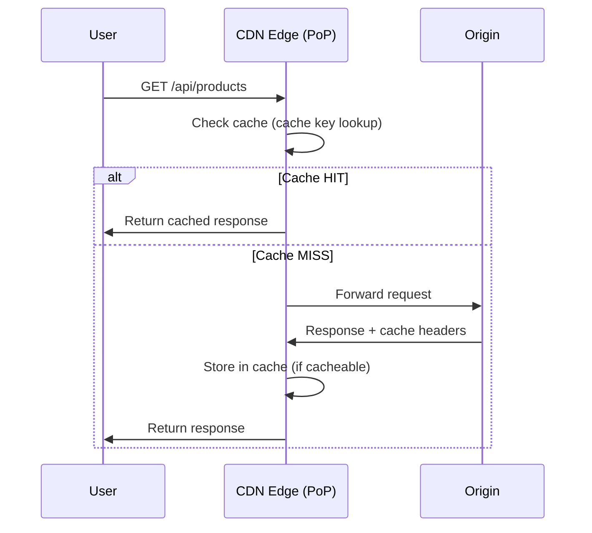
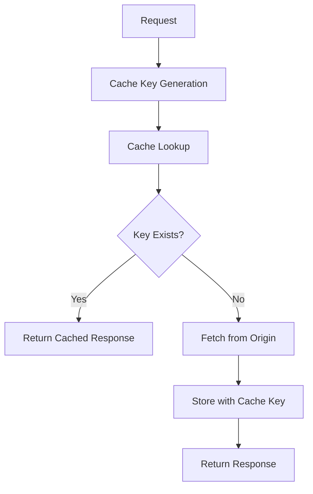
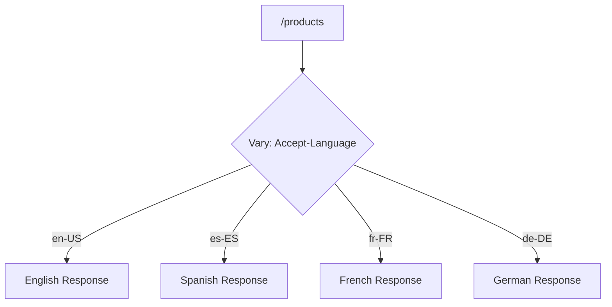
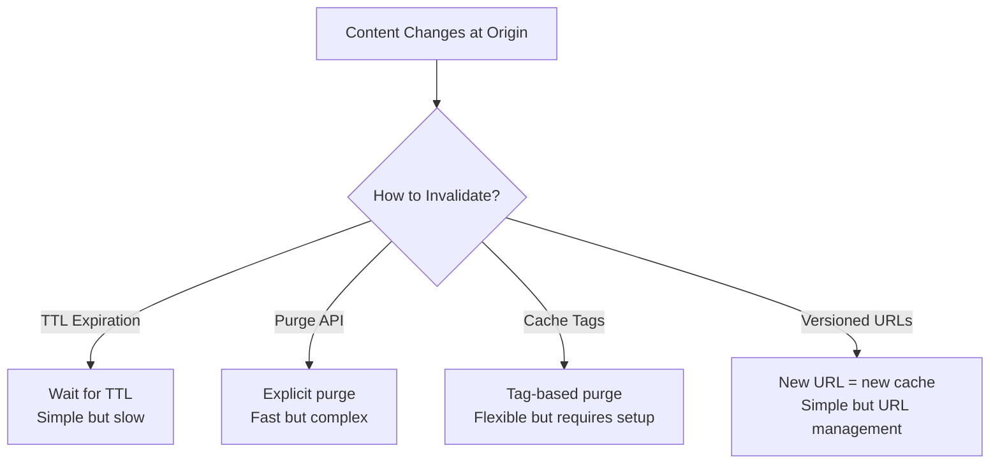
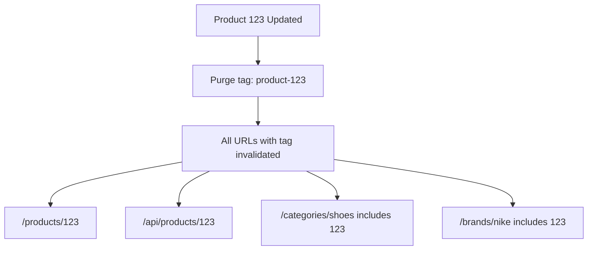
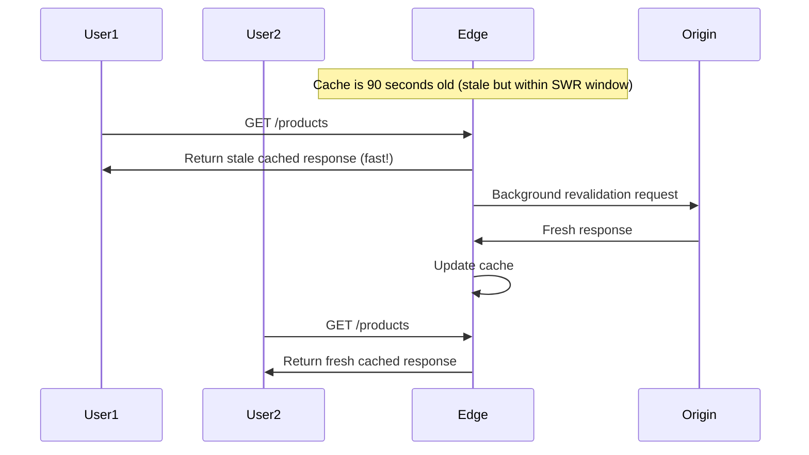

*[CDN]: Content Delivery Network
*[TTL]: Time To Live
*[PoP]: Point of Presence
*[HIT]: Cache Hit
*[MISS]: Cache Miss
*[CHR]: Cache Hit Ratio
*[SWR]: Stale-While-Revalidate
*[CORS]: Cross-Origin Resource Sharing

# Edge Caching: Cache Keys, Vary Headers, Correctness

## Introduction

Brief overview of the fundamental tension in edge caching: aggressive caching dramatically improves performance and reduces origin load, but incorrect cache configuration serves wrong content to users—sometimes catastrophically. This section frames edge caching as a correctness problem first, performance problem second.

_Include a real-world scenario: a CDN misconfiguration causes User A's personalized dashboard to be cached and served to User B, exposing private data to thousands of users before anyone notices. The cache hit ratio looked great._

<Callout type="danger">
A cache that serves incorrect content is worse than no cache at all. Before optimizing cache hit ratios, ensure your cache configuration cannot serve one user's content to another user.
</Callout>

## How Edge Caching Works

### The Request Flow

Explain what happens when a request hits the CDN edge.


Figure: CDN edge request flow showing cache hit and miss paths.

### What Makes a Response Cacheable

Detail the conditions that determine cacheability.

| Factor | Cacheable | Not Cacheable |
|--------|-----------|---------------|
| HTTP Method | GET, HEAD | POST, PUT, DELETE, PATCH |
| Status Code | 200, 301, 404 (configurable) | 500, 503 |
| Cache-Control | public, max-age>0 | private, no-store, no-cache |
| Authorization | Without header (usually) | With header (by default) |
| Set-Cookie | Without header | With header (by default) |
| Vary | Manageable variations | Vary: * |

Table: Factors determining response cacheability at the edge.

```http title="cacheable-response.http"
HTTP/1.1 200 OK
Content-Type: application/json
Cache-Control: public, max-age=3600, s-maxage=86400
ETag: "abc123"
Vary: Accept-Encoding

{"products": [...]}
```
Code: Response headers indicating an edge-cacheable response.

```http title="not-cacheable-response.http"
HTTP/1.1 200 OK
Content-Type: application/json
Cache-Control: private, no-store
Set-Cookie: session=xyz; HttpOnly

{"user": {"name": "Alice", "email": "alice@example.com"}}
```
Code: Response headers preventing edge caching (personalized content).

<Callout type="info">
`s-maxage` controls shared cache (CDN) TTL separately from `max-age` which controls browser cache. This lets you cache aggressively at the edge while keeping browser caches short for faster updates.
</Callout>

## Cache Keys: The Foundation of Correctness

### What Is a Cache Key

Explain cache keys as the identifier that determines cache lookup and storage.

```text
Default cache key (simplified):
  SCHEME + HOST + PATH + QUERY_STRING

Example:
  https://example.com/api/products?category=shoes

Cache key:
  "https://example.com/api/products?category=shoes"
```


Figure: Cache key role in the caching lifecycle.

### Cache Key Components

Detail what typically goes into a cache key and what does not.

```yaml title="cache-key-components.yaml"
default_components:
  always_included:
    - scheme: "https"
    - host: "api.example.com"
    - path: "/v1/products"
    - query_string: "?category=shoes&sort=price"

  usually_excluded:
    - headers: "Most headers ignored"
    - cookies: "Ignored by default"
    - client_ip: "Not included"
    - request_body: "Never included (GET has no body)"

customizable:
  query_params:
    include: ["category", "sort", "page"]
    exclude: ["utm_source", "fbclid", "tracking_id"]

  headers:
    include: ["Accept-Language", "X-Device-Type"]

  cookies:
    include: ["country_preference"]
```
Code: Cache key component configuration showing inclusions and exclusions.

### The Query String Problem

Explain how query parameters affect caching and cache pollution.

```text
Problem: Query parameter order

These are the same request but different cache keys:
  /products?color=red&size=large
  /products?size=large&color=red

Result: Two cache entries for identical content (cache pollution)

Solution: Normalize query parameters
  - Sort alphabetically
  - Remove empty values
  - Remove tracking parameters
```

```typescript title="query-normalization.ts"
function normalizeQueryString(url: string): string {
  const urlObj = new URL(url);
  const params = new URLSearchParams(urlObj.search);

  // Remove tracking parameters
  const trackingParams = ['utm_source', 'utm_medium', 'utm_campaign', 'fbclid', 'gclid'];
  trackingParams.forEach(param => params.delete(param));

  // Sort remaining parameters
  const sorted = new URLSearchParams([...params.entries()].sort());

  urlObj.search = sorted.toString();
  return urlObj.toString();
}

// Before: /products?utm_source=google&color=red&size=large
// After:  /products?color=red&size=large
```
Code: Query string normalization for consistent cache keys.

<Callout type="warning">
Query parameter pollution is one of the most common causes of poor cache hit ratios. Analytics and tracking parameters create millions of unique cache keys for identical content.
</Callout>

## The Vary Header

### What Vary Does

Explain how the Vary header creates cache key variants.

```http title="vary-header-example.http"
HTTP/1.1 200 OK
Content-Type: text/html
Cache-Control: public, max-age=3600
Vary: Accept-Encoding, Accept-Language

<!DOCTYPE html>...
```

```text
Vary: Accept-Encoding, Accept-Language

Creates cache variants:
  Cache key + Accept-Encoding: gzip + Accept-Language: en-US
  Cache key + Accept-Encoding: gzip + Accept-Language: es-ES
  Cache key + Accept-Encoding: br + Accept-Language: en-US
  Cache key + Accept-Encoding: br + Accept-Language: es-ES
  Cache key + Accept-Encoding: identity + Accept-Language: en-US
  ...

Each unique combination = separate cache entry
```


Figure: Vary header creating separate cache entries per language.

### Vary Header Best Practices

Provide guidance on using Vary correctly.

| Vary On | Good Idea? | Reason |
|---------|------------|--------|
| Accept-Encoding | Yes | Limited values (gzip, br, identity) |
| Accept-Language | Maybe | Can explode if not normalized |
| User-Agent | No | Thousands of unique values |
| Cookie | No | Unique per user, kills caching |
| Authorization | No | Unique per user, kills caching |
| X-Custom-Header | Depends | Control the values carefully |

Table: Vary header guidance for common headers.

```yaml title="vary-configuration.yaml"
caching:
  vary_handling:
    # Good: Limited, known values
    accept_encoding:
      normalize: true
      allowed: ["gzip", "br", "identity"]

    accept_language:
      normalize: true
      # Normalize "en-US, en;q=0.9" to just "en"
      extract_primary: true
      allowed: ["en", "es", "fr", "de", "zh"]
      default: "en"

    # Bad: Do not vary on these
    never_vary_on:
      - User-Agent
      - Cookie
      - Authorization
      - X-Forwarded-For
```
Code: Vary header configuration with normalization.

<Callout type="danger">
`Vary: *` means "this response is unique to every request"—it effectively disables caching. Never use `Vary: *` unless you truly intend to make the response noncacheable.
</Callout>

### The Cookie Vary Trap

Explain why Vary: Cookie destroys cache effectiveness.

```text
Problem: Vary: Cookie

Request 1: Cookie: session=abc123; preferences=dark
Request 2: Cookie: session=xyz789; preferences=dark
Request 3: Cookie: session=def456; preferences=light

With Vary: Cookie, each request creates a separate cache entry
even if the response content is identical.

Result: Cache hit ratio approaches 0%
```

```typescript title="cookie-vary-solution.ts"
// Instead of Vary: Cookie, use selective cookie handling

// BAD: Origin returns Vary: Cookie
// Every user gets their own cache entry

// GOOD: Strip session cookies, vary only on relevant cookies
function processCookieForCaching(cookies: string): string {
  const parsed = parseCookies(cookies);

  // Only keep cookies that affect response content
  const cacheRelevant = {
    country: parsed.country,
    currency: parsed.currency,
    // Do NOT include: session, auth tokens, tracking IDs
  };

  // Create normalized cache key component
  return Object.entries(cacheRelevant)
    .filter(([_, v]) => v)
    .sort(([a], [b]) => a.localeCompare(b))
    .map(([k, v]) => `${k}=${v}`)
    .join('&');
}

// Result: Cache entries per country/currency combination
// not per individual user
```
Code: Selective cookie handling for effective caching.

## Cache Invalidation

### The Hardest Problem

Explain why cache invalidation is notoriously difficult.

> There are only two hard things in Computer Science: cache invalidation and naming things.
> — Phil Karlton


Figure: Cache invalidation strategies with tradeoffs.

### TTL-Based Invalidation

Detail the simplest approach and its limitations.

```http title="ttl-invalidation.http"
# Short TTL - fresh content, more origin load
Cache-Control: public, max-age=60, s-maxage=300

# Long TTL - stale content, less origin load
Cache-Control: public, max-age=86400, s-maxage=604800
```

```yaml title="ttl-strategy.yaml"
ttl_by_content_type:
  # Immutable assets (hashed filenames)
  static_assets:
    pattern: "*.js, *.css, *.woff2"
    condition: "filename contains hash"
    ttl: "1 year"
    example: "app.a1b2c3d4.js"

  # Slowly changing content
  product_images:
    pattern: "/images/products/*"
    ttl: "7 days"

  # Frequently changing content
  api_responses:
    pattern: "/api/*"
    ttl: "5 minutes"

  # Real-time content
  stock_prices:
    pattern: "/api/stocks/*"
    ttl: "0 (no-cache or very short)"
```
Code: TTL strategy by content type.

### Purge-Based Invalidation

Explain explicit cache purging and its challenges.

```typescript title="cache-purge.ts"
interface PurgeRequest {
  type: 'url' | 'prefix' | 'tag' | 'all';
  value: string;
}

async function purgeCache(request: PurgeRequest): Promise<void> {
  // Cloudflare example
  const response = await fetch(
    `https://api.cloudflare.com/client/v4/zones/${ZONE_ID}/purge_cache`,
    {
      method: 'POST',
      headers: {
        'Authorization': `Bearer ${API_TOKEN}`,
        'Content-Type': 'application/json',
      },
      body: JSON.stringify(buildPurgeBody(request)),
    }
  );

  if (!response.ok) {
    throw new Error(`Purge failed: ${response.status}`);
  }
}

function buildPurgeBody(request: PurgeRequest): object {
  switch (request.type) {
    case 'url':
      return { files: [request.value] };
    case 'prefix':
      return { prefixes: [request.value] };
    case 'tag':
      return { tags: [request.value] };
    case 'all':
      return { purge_everything: true };
  }
}

// Usage
await purgeCache({ type: 'url', value: 'https://example.com/products/123' });
await purgeCache({ type: 'tag', value: 'product-123' });
```
Code: Cache purge implementation for Cloudflare.

<Callout type="warning">
Purge operations are not instant. CDN purges typically take 1-30 seconds to propagate globally. Do not assume purge completion means all edges have the new content.
</Callout>

### Cache Tags (Surrogate Keys)

Explain the most flexible invalidation approach.

```http title="cache-tags-response.http"
HTTP/1.1 200 OK
Content-Type: application/json
Cache-Control: public, s-maxage=86400
Cache-Tag: product-123, category-shoes, brand-nike
Surrogate-Key: product-123 category-shoes brand-nike

{"product": {...}}
```


Figure: Tag-based purging invalidating all related content.

```yaml title="cache-tag-strategy.yaml"
tagging_strategy:
  product_page:
    url: "/products/{id}"
    tags:
      - "product-{id}"
      - "category-{category}"
      - "brand-{brand}"
      - "all-products"

  category_page:
    url: "/categories/{slug}"
    tags:
      - "category-{slug}"
      - "all-categories"

  # When product 123 (Nike shoe) changes:
  # Purge "product-123" invalidates:
  #   - /products/123
  #   - Any page embedding product 123
  #
  # Purge "brand-nike" invalidates:
  #   - All Nike product pages
  #   - All pages listing Nike products
```
Code: Cache tag strategy for content relationships.

### Stale-While-Revalidate

Explain SWR as a way to balance freshness and performance.

```http title="swr-headers.http"
Cache-Control: public, max-age=60, stale-while-revalidate=300

# Meaning:
# - For 60 seconds: serve from cache (fresh)
# - From 60-360 seconds: serve from cache AND revalidate in background (stale)
# - After 360 seconds: must revalidate before serving
```


Figure: Stale-while-revalidate serving stale content while refreshing in background.

<Callout type="success">
Stale-while-revalidate gives you the best of both worlds: users always get fast cached responses, while the cache stays fresh through background updates. Use it liberally.
</Callout>

## Common Correctness Bugs

### Caching Personalized Content

The most dangerous cache bug—serving one user's content to another.

```yaml title="personalization-bugs.yaml"
dangerous_patterns:
  - pattern: "Vary on session cookie"
    problem: "Creates entry per user, still risks cross-contamination"
    solution: "Do not cache personalized content at edge"

  - pattern: "Cache without checking auth header"
    problem: "Unauthenticated cache serves to authenticated users"
    solution: "Different cache keys or no caching for auth content"

  - pattern: "Origin returns Cache-Control for personalized API"
    problem: "CDN caches response, serves to wrong user"
    solution: "Always return private, no-store for personalized responses"

safe_patterns:
  - pattern: "Edge-side includes for personalization"
    benefit: "Cache page shell, personalize at edge"

  - pattern: "Client-side personalization"
    benefit: "Cache generic content, personalize in browser"

  - pattern: "Separate cacheable and non-cacheable endpoints"
    benefit: "Clear separation of concerns"
```
Code: Dangerous and safe patterns for personalized content caching.

```typescript title="personalization-check.ts"
// Middleware to prevent accidental caching of personalized content

function cacheabilityCheck(req: Request, res: Response, next: NextFunction) {
  const originalSend = res.send;

  res.send = function(body: any) {
    // Check for personalization indicators
    const hasPersonalization =
      res.getHeader('Set-Cookie') ||
      res.getHeader('X-User-Id') ||
      (typeof body === 'string' && body.includes('"userId"'));

    const hasCacheHeader =
      res.getHeader('Cache-Control')?.toString().includes('public');

    if (hasPersonalization && hasCacheHeader) {
      console.error('DANGER: Personalized response with public cache header!');
      console.error('URL:', req.url);
      // In production, override to prevent caching
      res.setHeader('Cache-Control', 'private, no-store');
    }

    return originalSend.call(this, body);
  };

  next();
}
```
Code: Middleware to detect and prevent dangerous cache configurations.

### Cache Poisoning

Explain how attackers can exploit cache misconfiguration.

```text
Cache Poisoning Attack:

1. Attacker sends request with malicious header:
   GET /page HTTP/1.1
   Host: example.com
   X-Forwarded-Host: evil.com

2. Vulnerable origin reflects header in response:
   <script src="//evil.com/malicious.js"></script>

3. Response is cached (X-Forwarded-Host not in cache key)

4. Legitimate users get poisoned cached response

Prevention:
- Include attack vectors in cache key, OR
- Normalize/validate headers at edge before forwarding
- Do not reflect untrusted headers in responses
```

```yaml title="cache-poisoning-prevention.yaml"
edge_rules:
  # Normalize headers before forwarding to origin
  normalize_headers:
    - name: X-Forwarded-Host
      action: set_to_host_header
    - name: X-Forwarded-Proto
      action: set_to_scheme

  # Include in cache key if origin uses them
  cache_key_headers:
    - X-Device-Type  # If you use it, key on it
    - Accept-Language

  # Strip dangerous headers
  strip_headers:
    - X-Original-URL
    - X-Rewrite-URL
    - X-Custom-IP-Authorization
```
Code: Edge configuration to prevent cache poisoning.

<Callout type="danger">
Cache poisoning can turn your CDN into an attack vector against your own users. Audit which headers your origin reflects in responses and either strip them at the edge or include them in cache keys.
</Callout>

### Geographic/Currency Mismatches

Explain location-based caching issues.

```text
Problem:
User A in Germany requests /products
Response shows prices in EUR
Response is cached

User B in USA requests /products
Gets cached response with EUR prices
Conversion or checkout fails

Root cause: No geographic variation in cache key
```

```yaml title="geo-caching.yaml"
solutions:
  option_1_vary_on_country:
    vary_header: "CF-IPCountry"
    cache_key_includes: "country"
    pros: "Automatic, per-country caching"
    cons: "Many cache variants, cold caches per region"

  option_2_separate_endpoints:
    pattern: "/api/products?country=DE"
    cache_key: "URL includes country"
    pros: "Explicit, cacheable"
    cons: "Client must know country"

  option_3_client_side_localization:
    pattern: "Return prices in all currencies"
    localization: "JavaScript selects appropriate currency"
    pros: "Single cache entry, highly cacheable"
    cons: "Larger response, client complexity"

  option_4_edge_compute:
    pattern: "Edge function modifies cached response"
    localization: "Insert country-specific content at edge"
    pros: "Best of both worlds"
    cons: "Complexity, edge compute costs"
```
Code: Solutions for geographic and currency caching challenges.

## Performance Optimization

### Maximizing Cache Hit Ratio

Strategies for improving CHR.

```yaml title="chr-optimization.yaml"
strategies:
  query_string_normalization:
    impact: "High"
    effort: "Low"
    actions:
      - "Sort query parameters alphabetically"
      - "Remove tracking parameters (utm_*, fbclid, gclid)"
      - "Remove empty parameters"

  cache_key_simplification:
    impact: "High"
    effort: "Medium"
    actions:
      - "Audit current cache key components"
      - "Remove unnecessary headers from key"
      - "Normalize Vary header values"

  content_negotiation_reduction:
    impact: "Medium"
    effort: "Medium"
    actions:
      - "Reduce language variants"
      - "Use Accept-Encoding with limited values"
      - "Avoid User-Agent based variations"

  ttl_extension:
    impact: "High"
    effort: "Low"
    actions:
      - "Use immutable for versioned assets"
      - "Extend TTL with stale-while-revalidate"
      - "Implement proper invalidation for long TTLs"
```
Code: Cache hit ratio optimization strategies.

### Monitoring Cache Performance

Key metrics and what they indicate.

| Metric | Good | Warning | Action If Poor |
|--------|------|---------|----------------|
| Cache Hit Ratio | >90% | 70-90% | Analyze cache keys, extend TTL |
| Origin Load | Low, stable | Spiky | Check for cache misses, warming |
| TTFB (cached) | &lt50ms | 50-200ms | Check PoP coverage, edge compute |
| Purge Latency | &lt5s | 5-30s | Consider cache tags |
| Cache Fill Rate | Low | High | Check TTL, invalidation frequency |

Table: Cache performance metrics and targets.

```yaml title="cache-monitoring.yaml"
dashboards:
  cache_overview:
    panels:
      - name: "Cache Hit Ratio (Global)"
        query: "sum(cache_hits) / sum(cache_requests)"
        alert: "< 80% for 5 minutes"

      - name: "Cache Hit Ratio by PoP"
        query: "group by edge_location"
        purpose: "Identify cold or misconfigured PoPs"

      - name: "Origin Request Rate"
        query: "rate(origin_requests[5m])"
        alert: "Sudden increase indicates cache problem"

      - name: "Response Time by Cache Status"
        query: "histogram by cache_status (HIT, MISS, EXPIRED)"
        purpose: "Verify cache is providing speed benefit"

  cache_debugging:
    panels:
      - name: "Cache Key Cardinality"
        purpose: "High cardinality = poor hit ratio"

      - name: "Vary Header Distribution"
        purpose: "Identify problematic Vary values"

      - name: "TTL Distribution"
        purpose: "Are TTLs appropriate for content type?"
```
Code: Cache monitoring dashboard configuration.

<Callout type="info">
A cache hit ratio below 70% often indicates a configuration problem, not a traffic problem. Before adding more edge capacity, audit your cache keys and Vary headers.
</Callout>

## Implementation Checklist

### CDN Configuration Checklist

```markdown title="cdn-checklist.md"
## Cache Key Configuration
- [ ] Query string normalization enabled
- [ ] Tracking parameters excluded from key
- [ ] Only necessary headers included in key
- [ ] Cookie handling configured (usually exclude)

## Cache-Control Headers
- [ ] Static assets: long TTL + immutable
- [ ] API responses: appropriate TTL + SWR
- [ ] Personalized content: private, no-store
- [ ] Origin returns consistent headers

## Vary Header
- [ ] Only vary on headers with limited values
- [ ] Accept-Encoding normalized
- [ ] Accept-Language normalized (if used)
- [ ] No Vary: Cookie or Vary: User-Agent

## Invalidation
- [ ] Purge API integrated with deploy pipeline
- [ ] Cache tags implemented for content relationships
- [ ] Purge tested and documented
- [ ] SWR configured for graceful updates

## Security
- [ ] No caching of authenticated responses
- [ ] No caching of Set-Cookie responses
- [ ] Dangerous headers stripped or normalized
- [ ] Cache poisoning vectors addressed

## Monitoring
- [ ] Cache hit ratio tracked
- [ ] Origin load monitored
- [ ] Cache status in response headers
- [ ] Alerts on ratio drops
```
Code: Comprehensive CDN configuration checklist.

## Conclusion

Summarize the key principles: cache keys determine correctness—get them wrong and you serve wrong content; Vary headers are powerful but dangerous—use only for limited value sets; cache invalidation requires explicit strategy—relying on TTL expiration is often insufficient; and always prioritize correctness over hit ratio. A correctly-configured cache with 70% hit ratio beats an incorrectly-configured cache with 95% hit ratio.

<Callout type="success">
Edge caching is one of the highest-leverage performance optimizations available, but only when configured correctly. Invest time in cache key design, Vary header normalization, and monitoring—the performance gains are dramatic and the correctness risks are real.
</Callout>

---

## Cover Prompt

### Prompt 1: The Edge Network Globe

Create an image of a stylized globe with glowing edge nodes (PoPs) distributed across continents. Lines connect users to their nearest edge, with some paths showing "HIT" indicators (fast, glowing) and others showing "MISS" indicators (path continues to central origin). Style: technical network visualization, dark background with neon highlights, blue and cyan color scheme, 16:9 aspect ratio.

### Prompt 2: The Cache Key Anatomy

Design a visualization of a cache key being constructed from its components. Show URL parts (scheme, host, path, query) assembling like puzzle pieces, with some components (cookies, user-agent) being filtered out. The assembled key unlocks a cache vault. Style: technical diagram meets lock/key metaphor, clean lines, warm metal tones for key, cool tones for components, 16:9 aspect ratio.

### Prompt 3: The Vary Header Explosion

Illustrate the combinatorial explosion of cache variants. A single cached response at the top branches into multiple variants based on Accept-Encoding × Accept-Language × Device-Type, showing exponential growth. Some branches are pruned (good), others grow wild (bad). Style: tree/branching diagram, organic growth pattern, green (good) vs red (problematic) branches, 16:9 aspect ratio.

### Prompt 4: The Invalidation Wave

Create an image showing a "purge wave" propagating across a network of edge nodes. The origin sends a signal that ripples outward, each edge node updating as the wave passes. Some nodes update immediately, others lag slightly. Style: ripple effect visualization, concentric circles emanating from center, gradient from fresh (bright) to stale (dim), 16:9 aspect ratio.

### Prompt 5: The Correctness vs Performance Balance

Design a balance scale where one side holds "Performance" (represented by speed/lightning icons, high CHR numbers) and the other holds "Correctness" (represented by checkmarks, security shields). The scale is balanced but precarious. Below the scale, "cache misconfiguration" tips it dangerously toward performance. Style: classical balance scale with modern tech iconography, warning colors where imbalanced, 16:9 aspect ratio.
