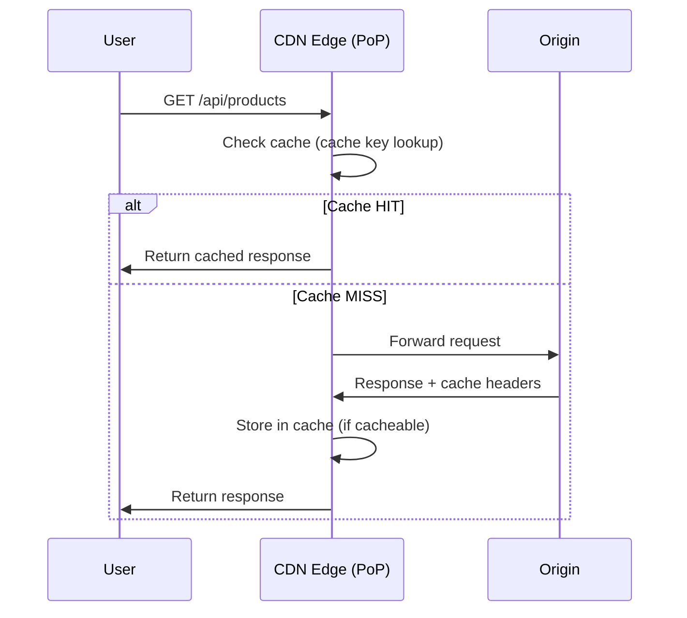
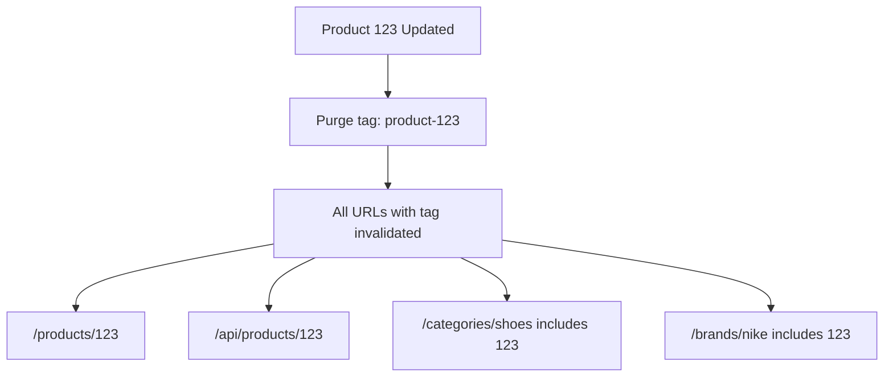
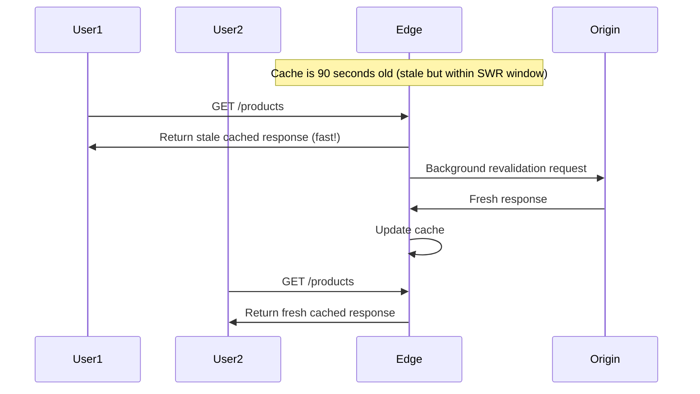

*[CDN]: Content Delivery Network
*[TTL]: Time To Live
*[PoP]: Point of Presence
*[HIT]: Cache Hit
*[MISS]: Cache Miss
*[CHR]: Cache Hit Ratio
*[SWR]: Stale-While-Revalidate
*[CORS]: Cross-Origin Resource Sharing

A CDN misconfiguration once cost a client three days of incident response and an uncomfortable conversation with their legal team. The setup was straightforward: an API endpoint returning user dashboard data, fronted by CloudFront. Someone had enabled caching on the endpoint without realizing it returned personalized content. User A's dashboard—complete with their name, email, and recent transactions—got cached and served to User B, then User C, then a few thousand more users before anyone noticed.

The cache hit ratio looked fantastic. 94% of requests served from edge. Response times dropped from 200ms to 15ms. Everyone was thrilled until support tickets started arriving.

This is the fundamental tension in edge caching. Aggressive caching dramatically improves performance and reduces origin load, but incorrect configuration serves wrong content to users—sometimes catastrophically. Edge caching is a _correctness_ problem first, performance problem second.

The techniques in this article address that tension: how to design cache keys that prevent content cross-contamination, how to use Vary headers without destroying hit ratios, and how to invalidate content without leaving stale data at the edge. Get the correctness right, and you can cache aggressively. Get it wrong, and your CDN becomes a liability.

<Callout type="danger" title="Correctness Before Performance">
A cache that serves incorrect content is worse than no cache at all. Before optimizing cache hit ratios, ensure your cache configuration cannot serve one user's content to another.
</Callout>

## How Edge Caching Works

### The Request Flow

When a user requests a resource, the request first hits the nearest CDN edge location—a Point of Presence (PoP). The edge server generates a cache key from the request—typically the URL—and checks if a valid cached response exists. If it does, the edge returns the cached response immediately without contacting your origin. If not, the edge forwards the request to your origin, receives the response, decides whether to cache it based on the response headers, and returns it to the user.



Figure: CDN edge request flow showing cache hit and miss paths.

The performance difference is dramatic. A cache hit typically returns in 10-50ms regardless of where your origin is located. A cache miss adds the full round-trip to your origin plus processing time—often 200-500ms or more. At scale, improving your cache hit ratio from 70% to 90% can reduce origin load by two-thirds.

### What Makes a Response Cacheable

Not every response can be cached, and CDNs apply conservative defaults. Understanding what triggers caching—and what prevents it—is essential for both maximizing hit ratios and avoiding correctness bugs.

| Factor | Cacheable | Not Cacheable |
|--------|-----------|---------------|
| HTTP Method | GET, HEAD | POST, PUT, DELETE, PATCH |
| Status Code | 200, 301, 404 (configurable) | 500, 503 |
| Cache-Control | public, max-age>0 | private, no-store, no-cache |
| Authorization | Without header (usually) | With header (by default) |
| Set-Cookie | Without header | With header (by default) |
| Vary | Manageable variations | Vary: * |

Table: Factors determining response cacheability at the edge.

CDNs also support conditional requests using `If-None-Match` (with `ETag`) and `If-Modified-Since` (with `Last-Modified`) headers. When a cached response is stale, the edge can send a conditional request to the origin. If the content hasn't changed, the origin responds with `304 Not Modified` and the edge refreshes the TTL without transferring the full response body—saving bandwidth and origin processing time.

The `Cache-Control` header is your primary tool for controlling edge behavior. Here's a response that signals "cache this aggressively at the edge":

```http title="cacheable-response.http"
HTTP/1.1 200 OK
Content-Type: application/json
Cache-Control: public, max-age=3600, s-maxage=86400
ETag: "abc123"
Vary: Accept-Encoding

{"products": [...]}
```

And here's a response that explicitly prevents edge caching—exactly what you want for personalized content:

```http title="not-cacheable-response.http"
HTTP/1.1 200 OK
Content-Type: application/json
Cache-Control: private, no-store
Set-Cookie: session=xyz; HttpOnly

{"user": {"name": "Alice", "email": "alice@example.com"}}
```

<Callout type="info" title="s-maxage vs max-age">
`s-maxage` controls shared cache (CDN) TTL separately from `max-age` which controls browser cache. This lets you cache aggressively at the edge (24 hours) while keeping browser caches short (1 hour) for faster updates when you purge.
</Callout>

## Cache Keys: The Foundation of Correctness

### What Is a Cache Key

A cache key is the identifier the CDN uses to store and retrieve cached responses. When a request arrives, the edge generates a cache key from the request attributes and looks for a matching entry. If found, it returns the cached response. If not, it fetches from origin and stores the response under that key.

By default, most CDNs use a simplified version of the URL as the cache key:

```text
Default cache key (simplified):
  SCHEME + HOST + PATH + QUERY_STRING

Example:
  https://example.com/api/products?category=shoes

Cache key:
  "https://example.com/api/products?category=shoes"
```

This seems straightforward, but the details matter enormously. Two requests that should return identical content but generate different cache keys create duplicate cache entries—wasting storage and reducing hit ratios. Two requests that should return different content but generate the same cache key serve wrong content to users—the correctness bug we're trying to avoid.

### Cache Key Components

Understanding what goes into a cache key—and what doesn't—is critical for both performance and correctness. Here's a typical breakdown:

```yaml title="cloudfront-cache-key-policy.yaml"
# AWS CloudFront cache key policy example
default_components:
  always_included:
    - scheme: "https"
    - host: "api.example.com"
    - path: "/v1/products"
    - query_string: "?category=shoes&sort=price"

  usually_excluded:
    - headers: "Most headers ignored"
    - cookies: "Ignored by default"
    - client_ip: "Not included"
    - request_body: "Never included (GET has no body)"

customizable:
  query_params:
    include: ["category", "sort", "page"]
    exclude: ["utm_source", "fbclid", "tracking_id"]

  headers:
    include: ["Accept-Language", "X-Device-Type"]

  cookies:
    include: ["country_preference"]
```

The defaults are conservative: most request attributes are excluded from the cache key. This maximizes cache sharing but can cause correctness issues if your response actually varies based on excluded attributes. The example above shows a customized policy that includes `Accept-Language` in the cache key—without that customization, users would get whatever language happened to be cached first.

### The Query String Problem

Query parameters are the most common source of cache key problems. Consider these two URLs:

```text
Problem: Query parameter order

These are the same request but different cache keys:
  /products?color=red&size=large
  /products?size=large&color=red

Result: Two cache entries for identical content (cache pollution)
```

Different parameter order, different cache keys, same content—you're now storing two copies and reducing your hit ratio. Marketing teams compound this by adding tracking parameters to URLs. Every `utm_source`, `fbclid`, and `gclid` creates a unique cache key for content that's identical regardless of how the user arrived.

The solution is query string normalization at the edge:

```typescript title="query-normalization.ts"
// Lambda for AWS CloudFront: normalize query string at the edge
function handler(event: any): any {
  const request = event.request;
  const params = request.querystring || {};
  const trackingParams = ['utm_source', 'utm_medium', 'utm_campaign', 'fbclid', 'gclid'];

  // Remove tracking parameters
  trackingParams.forEach((param) => {
    delete params[param];
  });

  // Sort remaining parameters
  const sortedKeys = Object.keys(params).sort();
  const normalized: Record<string, any> = {};

  sortedKeys.forEach((key) => {
    normalized[key] = params[key];
  });

  request.querystring = normalized;
  return request;
}

// Before: /products?utm_source=google&color=red&size=large
// After:  /products?color=red&size=large
```

Most CDNs support this natively. CloudFront lets you specify which query parameters to include in the cache key (allow-list approach). Cloudflare and Fastly support query string sorting and parameter stripping. Enable these features—they're high-impact, low-effort wins.

<Callout type="warning" title="Cache Key Pollution">
Query parameter pollution is one of the most common causes of poor cache hit ratios. Analytics and tracking parameters create millions of unique cache keys for identical content. Audit your cache key cardinality regularly.
</Callout>

## The Vary Header

### What Vary Does

The `Vary` header tells caches "this response differs based on these request headers." It's the origin's way of saying "I returned different content to different clients based on header X, so you need to store separate cached versions."

When a CDN sees `Vary: Accept-Language`, it doesn't just store one cached response per URL—it stores one per URL _per unique Accept-Language value_. The cache key effectively becomes URL + the values of all headers listed in Vary.

```http title="vary-header-example.http"
HTTP/1.1 200 OK
Content-Type: text/html
Cache-Control: public, max-age=3600
Vary: Accept-Encoding, Accept-Language

<!DOCTYPE html>...
```

With two headers in Vary, you get a combinatorial explosion of cache variants:

```text
Vary: Accept-Encoding, Accept-Language

Creates cache variants:
  Cache key + Accept-Encoding: gzip + Accept-Language: en-US
  Cache key + Accept-Encoding: gzip + Accept-Language: es-ES
  Cache key + Accept-Encoding: br + Accept-Language: en-US
  Cache key + Accept-Encoding: br + Accept-Language: es-ES
  Cache key + Accept-Encoding: identity + Accept-Language: en-US
  ...

Each unique combination = separate cache entry
```

This is powerful—it lets you cache content that legitimately varies by request attributes. But it's also dangerous, because Vary headers with high-cardinality values can destroy your cache effectiveness entirely.

### Vary Header Best Practices

The rule is simple: only vary on headers with a small, known set of values. The more unique values a header can have, the more cache entries you create and the lower your hit ratio drops.

| Vary On | Good Idea? | Reason |
|---------|------------|--------|
| Accept-Encoding | Yes | Limited values (gzip, br, identity) |
| Accept-Language | Maybe | Can explode if not normalized |
| User-Agent | No | Thousands of unique values |
| Cookie | No | Unique per user, kills caching |
| Authorization | No | Unique per user, kills caching |
| X-Custom-Header | Depends | Control the values carefully |

Table: Vary header guidance for common headers.

`Accept-Encoding` is safe because there are only a few compression algorithms. `Accept-Language` is risky because browsers send values like `en-US, en;q=0.9, de;q=0.8`—technically unique per user's language preferences. If you vary on it, normalize the header first to extract just the primary language.

```yaml title="cloudfront-vary-normalization.yaml"
# CloudFront cache policy with header normalization
caching:
  vary_handling:
    # Good: Limited, known values
    accept_encoding:
      normalize: true
      allowed: ["gzip", "br", "identity"]

    accept_language:
      normalize: true
      # Normalize "en-US, en;q=0.9" to just "en"
      extract_primary: true
      allowed: ["en", "es", "fr", "de", "zh"]
      default: "en"

    # Bad: Do not vary on these
    never_vary_on:
      - User-Agent
      - Cookie
      - Authorization
      - X-Forwarded-For
```

<Callout type="danger" title="Vary: * Disables Caching">
`Vary: *` means "this response is unique to every request"—it effectively disables caching. Never use it unless you truly intend to make the response uncacheable. Some frameworks add this by default for dynamic pages; check your response headers.
</Callout>

### The Cookie Vary Trap

The most common Vary mistake is `Vary: Cookie`. It seems logical—if your response depends on cookies, tell the cache to vary on them. But cookies include session IDs, authentication tokens, and tracking identifiers that are unique per user. Even when the actual content-affecting cookie (`preferences=dark`) is the same, the unique session IDs create separate cache entries. Your cache becomes per-user, which defeats the entire purpose of edge caching.

The solution is to handle cookies at the edge _before_ they reach your origin or affect the cache key:

```typescript title="cookie-vary-solution.ts"
// Lambda for AWS CloudFront: normalize cookies for cache key

// Helper to parse cookie string into key-value object
function parseCookies(cookieString: string): Record<string, string> {
  return cookieString.split(';').reduce(
    (acc, pair) => {
      const [key, value] = pair.trim().split('=');
      if (key) acc[key] = value || '';
      return acc;
    },
    {} as Record<string, string>
  );
}

function handler(event: any): any {
  const request = event.request;
  const headers = request.headers || {};
  const cookieHeader = headers.cookie?.value || '';

  // BAD: Origin returns Vary: Cookie
  // Every user gets their own cache entry

  // GOOD: Strip session cookies, vary only on relevant cookies
  const parsed = parseCookies(cookieHeader);
  const cacheRelevant = {
    country: parsed.country,
    currency: parsed.currency,
    // Do NOT include: session, auth tokens, tracking IDs
  };

  const normalized = Object.entries(cacheRelevant)
    .filter(([_, v]) => v)
    .sort(([a], [b]) => a.localeCompare(b))
    .map(([k, v]) => `${k}=${v}`)
    .join('; ');

  if (normalized) {
    headers.cookie = { value: normalized };
  } else {
    delete headers.cookie;
  }

  request.headers = headers;
  return request;
}

// Result: Cache entries per country/currency combination
// not per individual user
```

With this approach, you strip the high-cardinality cookie values at the edge and create a normalized cache key component from just the cookies that actually affect content. Users with the same country and currency preferences share cache entries, regardless of their session IDs.

## Cache Invalidation

### The Hardest Problem

> There are only two hard things in Computer Science: cache invalidation and naming things.
> — Phil Karlton

The quote is famous for a reason. Caching is easy; knowing when to stop caching is hard. Content changes at your origin, but the CDN doesn't know about it—edges around the world continue serving stale data until something tells them to stop.

You have four main options, each with different tradeoffs:

Table: Cache invalidation strategies with tradeoffs.

| Strategy | How it works | Tradeoff |
| --- | --- | --- |
| TTL Expiration | Wait for cached content to expire naturally. | Simple, but can serve stale content until TTL passes. |
| Purge API | Explicitly remove cached entries when content changes. | Fast, but operationally complex and easy to miss URLs. |
| Cache Tags | Tag responses and purge by tag instead of URL. | Flexible, but requires tagging infrastructure. |
| Versioned URLs | Change the URL when content changes. | Simple, but requires URL management and propagation. |

### Time-To-Live Based Invalidation

The simplest approach: set a TTL and let content expire naturally. When the TTL passes, the edge fetches fresh content from your origin on the next request.

```http title="ttl-invalidation.http"
# Short TTL - fresh content, more origin load
Cache-Control: public, max-age=60, s-maxage=300

# Long TTL - stale content, less origin load
Cache-Control: public, max-age=86400, s-maxage=604800
```

The tradeoff is staleness vs. origin load. Short TTLs mean fresher content but more origin traffic. Long TTLs reduce origin load but serve stale content longer after updates. The right TTL depends on how often content changes and how much staleness your users can tolerate:

```yaml [g1:YAML]
# Pseudocode CDN cache policy
ttl_by_content_type:
  # Immutable assets (hashed filenames)
  static_assets:
    pattern: "*.js, *.css, *.woff2"
    condition: "filename contains hash"
    ttl: "1 year"
    example: "app.a1b2c3d4.js"

  # Slowly changing content
  product_images:
    pattern: "/images/products/*"
    ttl: "7 days"

  # Frequently changing content
  api_responses:
    pattern: "/api/*"
    ttl: "5 minutes"

  # Real-time content
  stock_prices:
    pattern: "/api/stocks/*"
    ttl: "0 (no-cache or very short)"
```
```yaml [g1:AWS CloudFront]
# AWS CloudFront distribution cache behaviors with per-path TTLs
Resources:
  AppDistribution:
    Type: AWS::CloudFront::Distribution
    Properties:
      DistributionConfig:
        Enabled: true
        Origins:
          - Id: AppOrigin
            DomainName: api.example.com
            CustomOriginConfig:
              OriginProtocolPolicy: https-only
        DefaultCacheBehavior:
          TargetOriginId: AppOrigin
          ViewerProtocolPolicy: redirect-to-https
          CachePolicyId: !Ref DefaultCachePolicy
        CacheBehaviors:
          - PathPattern: "/assets/*"
            TargetOriginId: AppOrigin
            ViewerProtocolPolicy: redirect-to-https
            CachePolicyId: !Ref StaticAssetsCachePolicy
          - PathPattern: "/images/products/*"
            TargetOriginId: AppOrigin
            ViewerProtocolPolicy: redirect-to-https
            CachePolicyId: !Ref ProductImagesCachePolicy
          - PathPattern: "/api/*"
            TargetOriginId: AppOrigin
            ViewerProtocolPolicy: redirect-to-https
            CachePolicyId: !Ref ApiCachePolicy
          - PathPattern: "/api/stocks/*"
            TargetOriginId: AppOrigin
            ViewerProtocolPolicy: redirect-to-https
            CachePolicyId: !Ref StockPricesCachePolicy

  StaticAssetsCachePolicy:
    Type: AWS::CloudFront::CachePolicy
    Properties:
      CachePolicyConfig:
        Name: static-assets-immutable
        DefaultTTL: 31536000
        MaxTTL: 31536000
        MinTTL: 31536000

  ProductImagesCachePolicy:
    Type: AWS::CloudFront::CachePolicy
    Properties:
      CachePolicyConfig:
        Name: product-images-7d
        DefaultTTL: 604800
        MaxTTL: 604800
        MinTTL: 60

  ApiCachePolicy:
    Type: AWS::CloudFront::CachePolicy
    Properties:
      CachePolicyConfig:
        Name: api-5m
        DefaultTTL: 300
        MaxTTL: 300
        MinTTL: 0

  StockPricesCachePolicy:
    Type: AWS::CloudFront::CachePolicy
    Properties:
      CachePolicyConfig:
        Name: stock-prices-no-cache
        DefaultTTL: 0
        MaxTTL: 0
        MinTTL: 0
```

TTL-only invalidation works well for content that changes on predictable schedules or where brief staleness is acceptable. For content that must update immediately when changed—product prices, inventory counts, breaking news—you need explicit invalidation.

### Purge-Based Invalidation

When content changes, call the CDN's purge API to remove it from cache immediately. The next request triggers a fresh fetch from origin.

```typescript title="cloudflare-cache-purge.ts"
// Cache purge implementation for Cloudflare
interface PurgeRequest {
  type: 'url' | 'prefix' | 'tag' | 'all';
  value: string;
}

async function purgeCache(request: PurgeRequest): Promise<void> {
  const response = await fetch(
    `https://api.cloudflare.com/client/v4/zones/${ZONE_ID}/purge_cache`,
    {
      method: 'POST',
      headers: {
        'Authorization': `Bearer ${API_TOKEN}`,
        'Content-Type': 'application/json',
      },
      body: JSON.stringify(buildPurgeBody(request)),
    }
  );

  if (!response.ok) {
    throw new Error(`Purge failed: ${response.status}`);
  }
}

function buildPurgeBody(request: PurgeRequest): object {
  switch (request.type) {
    case 'url':
      return { files: [request.value] };
    case 'prefix':
      return { prefixes: [request.value] };
    case 'tag':
      return { tags: [request.value] };
    case 'all':
      return { purge_everything: true };
    default:
      // Exhaustive check: TypeScript will error if a case is missing
      const _exhaustive: never = request.type;
      throw new Error(`Unknown purge type: ${_exhaustive}`);
  }
}

// Usage
await purgeCache({ type: 'url', value: 'https://example.com/products/123' });
await purgeCache({ type: 'tag', value: 'product-123' });
```

The challenge with URL-based purging is knowing _which_ URLs to purge. If product 123 appears on `/products/123`, `/api/products/123`, `/categories/shoes`, and `/brands/nike`, you need to purge all four. Miss one and users see inconsistent data.

<Callout type="warning" title="Purge Propagation Delay">
Purge operations are not instant. CDN purges typically take 1-30 seconds to propagate globally. Don't assume purge completion means all edges have the new content—some users may still see stale data briefly.
</Callout>

### Cache Warming

After a purge or deployment, your cache is cold—every request hits the origin until the cache repopulates. For high-traffic sites, this creates a "thundering herd" problem: thousands of simultaneous origin requests when cached content expires or gets purged.

Cache warming proactively populates the cache before users need it:

```typescript title="cache-warming.ts"
// Warm cache after deployment or purge
async function warmCache(urls: string[], edgeLocations: string[]): Promise<void> {
  for (const url of urls) {
    // Request through each edge location to populate caches
    await Promise.all(
      edgeLocations.map((edge) =>
        fetch(url, {
          headers: {
            // Some CDNs support edge location hints
            'X-Edge-Location': edge,
            // Bypass any browser cache
            'Cache-Control': 'no-cache',
          },
        })
      )
    );
  }
}

// Run after deploy
await warmCache(
  ['/api/products', '/api/categories', '/'],
  ['us-east-1', 'eu-west-1', 'ap-southeast-1']
);
```

Integrate cache warming into your deployment pipeline: after purging stale content, immediately request the new content through your most important edge locations. This ensures the first real users get cache hits rather than origin requests.

### Cache Tags (Surrogate Keys)

Cache tags solve the "which URLs to purge" problem. Instead of purging specific URLs, you tag responses with semantic identifiers and purge by tag.

```http title="cache-tags-response.http"
HTTP/1.1 200 OK
Content-Type: application/json
Cache-Control: public, s-maxage=86400
Cache-Tag: product-123, category-shoes, brand-nike
Surrogate-Key: product-123 category-shoes brand-nike

{"product": {...}}
```

Now when product 123 changes, you purge the tag `product-123` and _every_ cached response with that tag gets invalidated—regardless of URL:



Figure: Tag-based purging invalidating all related content.

Design your tagging strategy around your data relationships:

```yaml title="cache-tag-strategy.yaml"
# Implement in app code
tagging_strategy:
  product_page:
    url: "/products/{id}"
    tags:
      - "product-{id}"
      - "category-{category}"
      - "brand-{brand}"
      - "all-products"

  category_page:
    url: "/categories/{slug}"
    tags:
      - "category-{slug}"
      - "all-categories"

  # When product 123 (Nike shoe) changes:
  # Purge "product-123" invalidates:
  #   - /products/123
  #   - Any page embedding product 123
  #
  # Purge "brand-nike" invalidates:
  #   - All Nike product pages
  #   - All pages listing Nike products
```

Cache tags require more setup—your origin must add the tag headers, and you need infrastructure to track which entities map to which tags. But they're dramatically more maintainable than URL-based purging for complex sites.

### Stale-While-Revalidate

While TTL expiration, purge APIs, and cache tags all address _when_ to invalidate, stale-while-revalidate addresses _how_ to handle the transition between stale and fresh content without sacrificing performance.

Stale-while-revalidate (SWR) is a Cache-Control directive that lets you serve stale content _while_ fetching fresh content in the background. Users always get fast cached responses; the cache stays fresh through background updates.

```http title="swr-headers.http"
Cache-Control: public, max-age=60, stale-while-revalidate=300

# Meaning:
# - 0-60 seconds after caching: serve from cache (fresh period)
# - 60-360 seconds after caching: serve stale AND revalidate in background
#   (360 = max-age + stale-while-revalidate = 60 + 300)
# - After 360 seconds: must revalidate before serving (fully expired)
```

Here's what happens when a request arrives during the SWR window:



Figure: Stale-while-revalidate serving stale content while refreshing in background.

SWR is particularly valuable for content that changes unpredictably but where brief staleness is acceptable. You get the performance of long TTLs with the freshness of short TTLs—the best of both worlds.

<Callout type="success" title="Use SWR Liberally">
Stale-while-revalidate gives you the best of both worlds: users always get fast cached responses, while the cache stays fresh through background updates. Unless you have strict freshness requirements, add SWR to your Cache-Control headers.
</Callout>

## Common Correctness Bugs

### Caching Personalized Content

The most dangerous cache bug—serving one user's content to another.

| Pattern | Category | Risk or Benefit | Recommended Action |
| --- | --- | --- | --- |
| Vary on session cookie | Dangerous | Creates entry per user, still risks cross-contamination | Do not cache personalized content at edge |
| Cache without checking auth header | Dangerous | Unauthenticated cache serves to authenticated users | Different cache keys or no caching for auth content |
| Origin returns Cache-Control for personalized API | Dangerous | CDN caches response, serves to wrong user | Always return `private, no-store` for personalized responses |
| Edge-side includes for personalization | Safe | Cache page shell, personalize at edge | Use ESI or edge compute for fragments |
| Client-side personalization | Safe | Cache generic content, personalize in browser | Keep personalized data out of edge cache |
| Separate cacheable and non-cacheable endpoints | Safe | Clear separation of concerns | Split endpoints by cacheability |

Table: Dangerous and safe patterns for personalized content caching.

```typescript [g2:Express Middleware]
// Middleware to prevent accidental caching of personalized content

function cacheabilityCheck(req: Request, res: Response, next: NextFunction) {
  const originalSend = res.send;

  res.send = function(body: any) {
    // Check for personalization indicators
    const hasPersonalization =
      res.getHeader('Set-Cookie') ||
      res.getHeader('X-User-Id') ||
      (typeof body === 'string' && body.includes('"userId"'));

    const hasCacheHeader =
      res.getHeader('Cache-Control')?.toString().includes('public');

    if (hasPersonalization && hasCacheHeader) {
      console.error('DANGER: Personalized response with public cache header!');
      console.error('URL:', req.url);
      // In production, override to prevent caching
      res.setHeader('Cache-Control', 'private, no-store');
    }

    return originalSend.call(this, body);
  };

  next();
}
```
```php [g2:Laravel Middleware]
<?php

namespace App\Http\Middleware;

use Closure;
use Illuminate\Http\Request;
use Symfony\Component\HttpFoundation\Response;

class PreventPersonalizedCaching
{
  public function handle(Request $request, Closure $next): Response
  {
    $response = $next($request);

    $hasPersonalization = $response->headers->has('Set-Cookie')
      || $response->headers->has('X-User-Id')
      || $this->responseContainsUserId($response);

    $cacheControl = (string) $response->headers->get('Cache-Control');
    $hasPublicCacheHeader = str_contains($cacheControl, 'public');

    if ($hasPersonalization && $hasPublicCacheHeader) {
      logger()->error('DANGER: Personalized response with public cache header!', [
        'url' => $request->fullUrl(),
      ]);

      $response->headers->set('Cache-Control', 'private, no-store');
    }

    return $response;
  }

  private function responseContainsUserId(Response $response): bool
  {
    $content = $response->getContent();

    if (!is_string($content)) {
      return false;
    }

    return str_contains($content, '"userId"');
  }
}
```
Code: Middleware to detect and prevent dangerous cache configurations.

### Cache Poisoning

Cache poisoning exploits the gap between what's in the cache key and what affects the response. If your origin reflects a header value in the response but that header isn't part of the cache key, an attacker can inject malicious content that gets cached and served to everyone.

The attack is straightforward: send a request with a poisoned header, trick the origin into reflecting it, and let the CDN cache the result. The classic vector is `X-Forwarded-Host`—many applications trust this header to generate absolute URLs, and many CDNs don't include it in the cache key by default.

This vulnerability is common because web frameworks often trust proxy headers by default. Laravel uses `X-Forwarded-Host` for `url()` helpers. Django reads `HTTP_X_FORWARDED_HOST` when `USE_X_FORWARDED_HOST=True`. Express apps using `trust proxy` will use `X-Forwarded-*` headers. These frameworks assume you've configured your reverse proxy to set these headers correctly—but CDNs often pass through whatever the client sends.

Cache Poisoning Attack:

1. Attacker sends request with malicious header:

```http
GET /page HTTP/1.1
Host: example.com
X-Forwarded-Host: evil.com
```

2. Vulnerable origin reflects header in response:

```html
<script src="//evil.com/malicious.js"></script>
```

3. Response is cached (`X-Forwarded-Host` not in cache key)

4. Legitimate users get poisoned cached response

Prevention:

- Include attack vectors in cache key, OR
- Normalize/validate headers at edge before forwarding
- Do not reflect untrusted headers in responses

```yaml [g3:Pseudocode]
# Pseudocode CDN cache poisoning prevention policy
edge_rules:
  # Normalize headers before forwarding to origin
  normalize_headers:
    - name: X-Forwarded-Host
      action: set_to_host_header
    - name: X-Forwarded-Proto
      action: set_to_scheme

  # Include in cache key if origin uses them
  cache_key_headers:
    - X-Device-Type  # If you use it, key on it
    - Accept-Language

  # Strip dangerous headers
  strip_headers:
    - X-Original-URL
    - X-Rewrite-URL
    - X-Custom-IP-Authorization
```
```yaml [g3:AWS Cloudfront]
# AWS CloudFront: normalize headers and constrain cache key
Resources:
  CachePoisoningFunction:
    Type: AWS::CloudFront::Function
    Properties:
      Name: cache-poisoning-normalize
      AutoPublish: true
      FunctionConfig:
        Comment: Normalize headers to prevent cache poisoning
        Runtime: cloudfront-js-2.0
      FunctionCode: |
        function handler(event) {
          var request = event.request;
          var headers = request.headers;

          // Normalize forwarded headers to trusted values
          headers['x-forwarded-host'] = headers.host;
          headers['x-forwarded-proto'] = headers['cloudfront-forwarded-proto'] || { value: 'https' };

          // Strip dangerous headers
          delete headers['x-original-url'];
          delete headers['x-rewrite-url'];
          delete headers['x-custom-ip-authorization'];

          return request;
        }

  CachePoisoningCachePolicy:
    Type: AWS::CloudFront::CachePolicy
    Properties:
      CachePolicyConfig:
        Name: cache-poisoning-allowlist
        DefaultTTL: 300
        MaxTTL: 300
        MinTTL: 0
        ParametersInCacheKeyAndForwardedToOrigin:
          HeadersConfig:
            HeaderBehavior: whitelist
            Headers:
              - Accept-Language
              - X-Device-Type
          CookiesConfig:
            CookieBehavior: none
          QueryStringsConfig:
            QueryStringBehavior: all
          EnableAcceptEncodingGzip: true
          EnableAcceptEncodingBrotli: true

  AppDistribution:
    Type: AWS::CloudFront::Distribution
    Properties:
      DistributionConfig:
        DefaultCacheBehavior:
          CachePolicyId: !Ref CachePoisoningCachePolicy
          FunctionAssociations:
            - EventType: viewer-request
              FunctionARN: !GetAtt CachePoisoningFunction.FunctionARN
```
Code: Edge configuration to prevent cache poisoning.

<Callout type="danger">
Cache poisoning can turn your CDN into an attack vector against your own users. Audit which headers your origin reflects in responses and either strip them at the edge or include them in cache keys.
</Callout>

### Geographic/Currency Mismatches

E-commerce sites often return different content based on the user's location—different prices, currencies, shipping options, or even product availability. If your cache key doesn't account for these variations, users get the wrong content.

This bug is insidious because it often goes unnoticed during development. Your test users are all in the same country, so everyone sees correct content. The first German user to hit a cached US response discovers the problem—usually at checkout when the currency doesn't match.

| Step | User A (Germany) | User B (USA) |
| --- | --- | --- |
| 1. Request | `GET /products` | `GET /products` |
| 2. Cache status | MISS | HIT (User A's response) |
| 3. Response | Prices in EUR ✓ | Prices in EUR ✗ |
| 4. Outcome | Correct experience | Checkout fails—wrong currency |

Table: Geographic cache mismatch scenario.

<Callout type="warning" title="Root Cause">
No geographic variation in cache key. Both users hit the same cache entry despite needing different content.
</Callout>

| Solution | How It Works | Pros | Cons |
| --- | --- | --- | --- |
| Vary on country header | Add `CF-IPCountry` (or equivalent) to cache key | Automatic, per-country caching | Many cache variants, cold caches per region |
| Separate endpoints | Use explicit country param: `/api/products?country=DE` | Explicit, highly cacheable | Client must know country |
| Client-side localization | Return all currencies, JavaScript selects | Single cache entry, maximum cacheability | Larger response, client complexity |
| Edge compute | Edge function transforms cached response per-country | Best of both worlds | Complexity, edge compute costs |

Table: Solutions for geographic and currency caching challenges.

The edge compute approach deserves elaboration since it offers the best balance of cacheability and correctness. Instead of caching multiple country-specific variants, you cache a single response containing all variants (or a template), then transform it at the edge based on the user's location:

```typescript title="edge-transform-pricing.ts"
// CloudFront Function or Lambda@Edge: transform cached response
const exchangeRates: Record<string, number> = { USD: 1, EUR: 0.92, GBP: 0.79 };
const currencySymbols: Record<string, string> = { USD: '$', EUR: '€', GBP: '£' };

function handler(event: any): any {
  const response = event.response;
  const country = event.request.headers['cloudfront-viewer-country']?.value || 'US';
  const currency = countryToCurrency(country); // US->USD, DE->EUR, etc.

  // Transform price placeholders in cached response
  let body = response.body;
  body = body.replace(/\{\{CURRENCY_SYMBOL\}\}/g, currencySymbols[currency]);
  body = body.replace(/\{\{PRICE:(\d+\.\d+)\}\}/g, (_: string, usd: string) => {
    const converted = (parseFloat(usd) * exchangeRates[currency]).toFixed(2);
    return `${currencySymbols[currency]}${converted}`;
  });

  response.body = body;
  return response;
}
```

This pattern caches one response globally but personalizes it per-user at the edge—maximum cache efficiency with correct localized content.

## Performance Optimization

### Maximizing Cache Hit Ratio

Cache hit ratio is the percentage of requests served from cache versus total requests. A higher CHR means better performance and lower origin load. Most CDN misconfigurations manifest as unexpectedly low hit ratios.

The strategies below are ordered by impact-to-effort ratio. Query string normalization and cache key simplification typically yield the largest improvements with the least work. Content negotiation and TTL tuning require more analysis but can push hit ratios from good to excellent.

| Strategy | Impact | Effort | Actions |
| --- | --- | --- | --- |
| Query string normalization | High | Low | Sort query parameters; remove tracking params (utm_*, fbclid, gclid); remove empty parameters |
| Cache key simplification | High | Medium | Audit cache key components; remove unnecessary headers; normalize Vary values |
| Content negotiation reduction | Medium | Medium | Reduce language variants; limit Accept-Encoding values; avoid User-Agent variations |
| TTL extension | High | Low | Use immutable for versioned assets; extend TTL with stale-while-revalidate; implement proper invalidation |

Table: Strategies to improve Cache Hit Ratio (CHR) with estimated impact and effort.

### Monitoring Cache Performance

You can't optimize what you don't measure. These metrics tell you whether your cache is working correctly and where to focus optimization efforts. Most CDNs expose these through dashboards and APIs—set up monitoring before you need to debug a production issue.

| Metric | Good | Warning | Action If Poor |
|--------|------|---------|----------------|
| Cache Hit Ratio | >90% | 70-90% | Analyze cache keys, extend TTL |
| Origin Load | Low, stable | Spiky | Check for cache misses, warming |
| TTFB (cached) | &lt50ms | 50-200ms | Check PoP coverage, edge compute |
| Purge Latency | &lt5s | 5-30s | Consider cache tags |
| Cache Fill Rate | Low | High | Check TTL, invalidation frequency |

Table: Cache performance metrics and targets.

**Interpreting these metrics in context:**

- **Hit ratio varies by content type.** Static assets should exceed 95%. API responses might reasonably be 70-80% depending on query parameter diversity. Personalized endpoints will be 0% (correctly).
- **Sudden hit ratio drops** usually indicate a configuration change, new URL patterns, or cache key pollution from marketing campaigns adding tracking parameters.
- **High origin load with good hit ratio** suggests your cache is working but TTLs are too short, causing frequent revalidation.
- **Per-PoP analysis** reveals geographic patterns. A single PoP with poor performance might indicate regional traffic spikes overwhelming that edge's cache capacity.

```json title="cache-monitoring.json"
{
  "_comment": "Datadog config example",
  "title": "CDN Cache Monitoring",
  "description": "Cache hit ratio, origin load, and cache efficiency",
  "widgets": [
    {
      "type": "timeseries",
      "title": "Cache Hit Ratio (Global)",
      "query": "(sum:cdn.cache.hits{*}.as_count() / sum:cdn.cache.requests{*}.as_count()) * 100",
      "alert": "< 80 for 5 minutes"
    },
    {
      "type": "timeseries",
      "title": "Cache Hit Ratio by PoP",
      "query": "sum:cdn.cache.hits{*} by {edge_location}.as_count() / sum:cdn.cache.requests{*} by {edge_location}.as_count()"
    },
    {
      "type": "timeseries",
      "title": "Origin Request Rate",
      "query": "rate:cdn.origin.requests{*}",
      "alert": "sudden increase indicates cache problem"
    },
    {
      "type": "timeseries",
      "title": "Response Time by Cache Status",
      "query": "p95:cdn.ttfb{cache_status:hit} , p95:cdn.ttfb{cache_status:miss} , p95:cdn.ttfb{cache_status:expired}"
    },
    {
      "type": "table",
      "title": "Cache Key Cardinality",
      "query": "top(avg:cdn.cache.key_cardinality{*} by {service}, 10, 'mean', 'desc')"
    },
    {
      "type": "table",
      "title": "Vary Header Distribution",
      "query": "top(sum:cdn.response.count{*} by {vary_header}, 10, 'sum', 'desc')"
    },
    {
      "type": "timeseries",
      "title": "TTL Distribution",
      "query": "histogram:cdn.cache.ttl_seconds{*}"
    }
  ]
}
```
Code: Cache monitoring dashboard configuration.

<Callout type="info">
A cache hit ratio below 70% often indicates a configuration problem, not a traffic problem. Before adding more edge capacity, audit your cache keys and Vary headers.
</Callout>

## Implementation Checklist

This checklist consolidates the key configuration points covered throughout the article. Use it to audit your CDN setup and identify gaps.

### CDN Configuration Checklist

```markdown title="cdn-checklist.md"
## Cache Key Configuration
# See: "Cache Keys: The Foundation of Correctness"
- [ ] Query string normalization enabled
- [ ] Tracking parameters excluded from key
- [ ] Only necessary headers included in key
- [ ] Cookie handling configured (usually exclude)

## Cache-Control Headers
# See: "What Makes a Response Cacheable" and "Time-To-Live Based Invalidation"
- [ ] Static assets: long TTL + immutable
- [ ] API responses: appropriate TTL + SWR
- [ ] Personalized content: private, no-store
- [ ] Origin returns consistent headers

## Vary Header
# See: "The Vary Header" and "The Cookie Vary Trap"
- [ ] Only vary on headers with limited values
- [ ] Accept-Encoding normalized
- [ ] Accept-Language normalized (if used)
- [ ] No Vary: Cookie or Vary: User-Agent

## Invalidation
# See: "Cache Invalidation" section
- [ ] Purge API integrated with deploy pipeline
- [ ] Cache tags implemented for content relationships
- [ ] Purge tested and documented
- [ ] Cache warming configured for critical paths
- [ ] SWR configured for graceful updates

## Security
# See: "Caching Personalized Content" and "Cache Poisoning"
- [ ] No caching of authenticated responses
- [ ] No caching of Set-Cookie responses
- [ ] Dangerous headers stripped or normalized
- [ ] Cache poisoning vectors addressed

## Monitoring
# See: "Monitoring Cache Performance"
- [ ] Cache hit ratio tracked
- [ ] Origin load monitored
- [ ] Cache status in response headers
- [ ] Alerts on ratio drops
```
Code: Comprehensive CDN configuration checklist.

## Further Reading

- [RFC 9111: HTTP Caching](https://www.rfc-editor.org/rfc/rfc9111.html) — The authoritative specification for HTTP caching semantics, including Cache-Control directives and Vary header behavior.
- [AWS CloudFront Developer Guide: Caching](https://docs.aws.amazon.com/AmazonCloudFront/latest/DeveloperGuide/cache-key-understand-cache-policy.html) — CloudFront-specific cache key policies and configuration options.
- [Cloudflare Cache Documentation](https://developers.cloudflare.com/cache/) — Cloudflare's caching features, including cache tags (Surrogate-Key), purge APIs, and edge compute with Workers.
- [Fastly VCL Reference](https://developer.fastly.com/reference/vcl/) — Fastly's Varnish Configuration Language for fine-grained cache control.
- [Web Caching Explained by Ryan Prior](https://web-caching.readthedocs.io/) — A comprehensive guide to HTTP caching concepts and best practices.

## Conclusion

Edge caching is a correctness problem disguised as a performance optimization. The techniques in this article all serve one goal: ensuring the right content reaches the right user while maximizing cache efficiency.

The key principles to remember:

- **Cache keys determine correctness.** Every attribute that affects your response must be in the cache key. Miss one, and users get wrong content. Include unnecessary attributes, and your hit ratio suffers.
- **Vary headers are powerful but dangerous.** They let you cache content that legitimately varies, but high-cardinality Vary values destroy cache effectiveness. Normalize headers at the edge before they reach your origin.
- **Cache invalidation requires explicit strategy.** TTL expiration alone is rarely sufficient. Implement cache tags for complex content relationships, use stale-while-revalidate for graceful updates, and integrate purging into your deployment pipeline.
- **Prioritize correctness over hit ratio.** A correctly-configured cache with 70% hit ratio beats an incorrectly-configured cache with 95% hit ratio. The latter is serving wrong content to 95% of users.

Start with the implementation checklist above. Audit your current configuration against each item. Fix correctness issues first, then optimize for performance. Monitor continuously—cache problems often appear as gradual hit ratio degradation rather than sudden failures.

<Callout type="success">
Edge caching is one of the highest-leverage performance optimizations available, but only when configured correctly. Invest time in cache key design, Vary header normalization, and monitoring—the performance gains are dramatic and the correctness risks are real.
</Callout>
