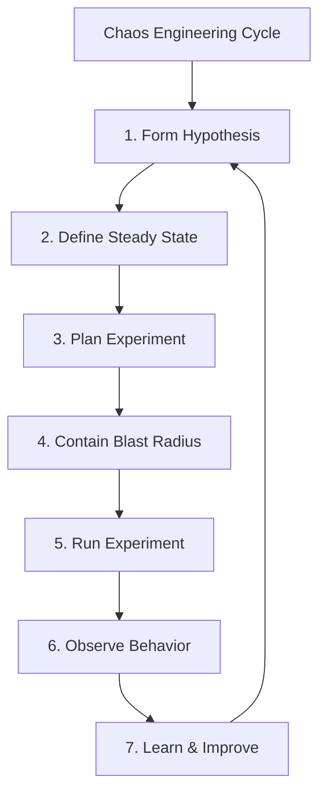
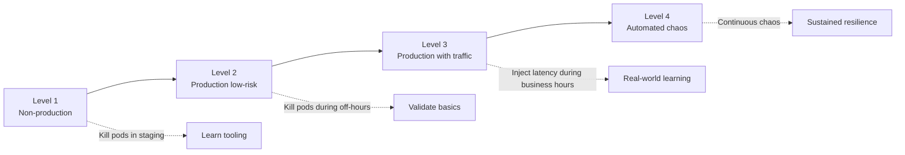
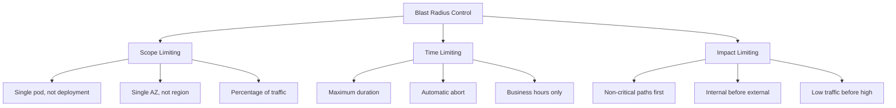
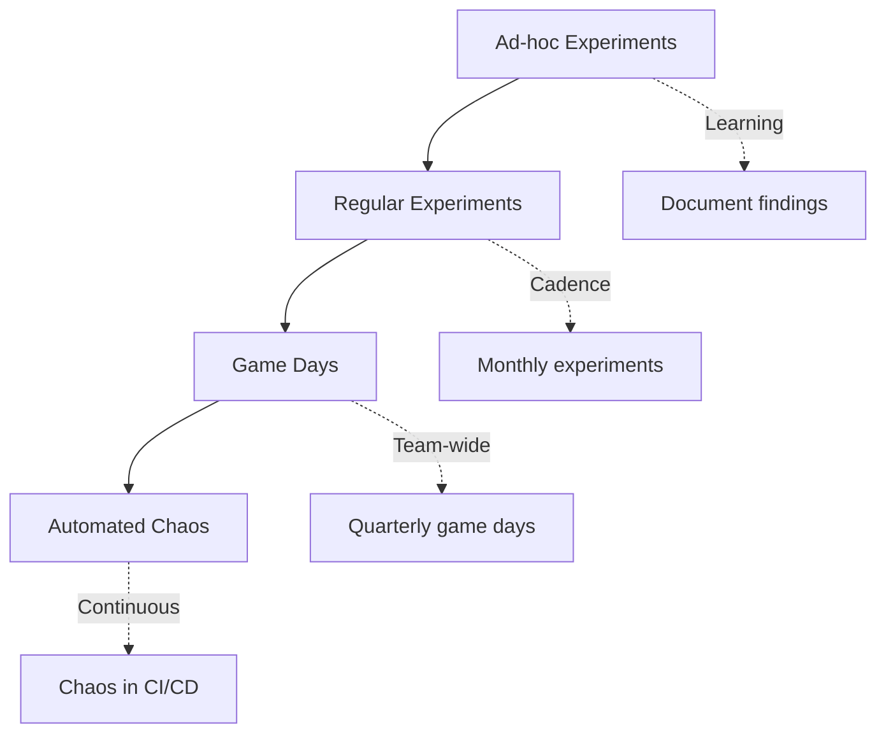

*[SRE]: Site Reliability Engineering
*[MTTR]: Mean Time To Recovery
*[MTTD]: Mean Time To Detection
*[RTO]: Recovery Time Objective
*[RPO]: Recovery Point Objective
*[AZ]: Availability Zone
*[SLO]: Service Level Objective

# Chaos Engineering on a Budget

## Introduction

Brief overview of why chaos engineering does not require expensive platforms or dedicated teams: the core practice is simply "break things on purpose to learn how they fail." This section frames chaos engineering as a spectrum from simple experiments anyone can run to sophisticated automated programs, emphasizing that value comes from learning, not from tooling sophistication.

_Include a real-world scenario: a team spends months evaluating enterprise chaos platforms, negotiating budgets, and planning elaborate experiments—only to have a simple power outage reveal that their basic service dependencies fail ungracefully. A 15-minute experiment killing a single pod would have found the same bug._

<Callout type="info">
Chaos engineering is not about expensive tools—it is about deliberately introducing failures to discover weaknesses before they cause outages. You can start today with nothing more than `kubectl delete pod`.
</Callout>

## The Principles of Chaos Engineering

### What Chaos Engineering Is (and Is Not)

Clarify the scientific method behind chaos engineering.

| Chaos Engineering IS | Chaos Engineering IS NOT |
|---------------------|-------------------------|
| Hypothesis-driven experimentation | Random destruction |
| Controlled failure injection | Breaking things for fun |
| Learning about system behavior | Proving you can cause outages |
| Building confidence | Testing in production blindly |
| Proactive resilience work | Reactive incident response |

Table: Distinguishing real chaos engineering from breaking things randomly.


Figure: The scientific cycle of chaos engineering.

### The Hypothesis-First Approach

Explain why every experiment needs a hypothesis.

```yaml title="chaos-hypothesis-template.yaml"
experiment:
  name: "Database failover under load"

  hypothesis:
    statement: >
      When the primary database becomes unavailable during normal load,
      the application will failover to the replica within 30 seconds
      and users will experience at most 5 seconds of errors.

    steady_state:
      - metric: "request_success_rate"
        expected: ">= 99.9%"
      - metric: "p99_latency"
        expected: "<= 500ms"
      - metric: "error_rate"
        expected: "<= 0.1%"

    expected_during_experiment:
      - metric: "request_success_rate"
        expected: ">= 99.0%"  # Allow brief degradation
      - metric: "p99_latency"
        expected: "<= 2000ms"  # Allow latency spike
      - metric: "failover_time"
        expected: "<= 30s"
```
Code: Hypothesis template with steady state definition and expected outcomes.

<Callout type="warning">
Without a hypothesis, you are just breaking things. The hypothesis transforms destruction into learning by telling you what to measure and what success looks like.
</Callout>

### Start Small, Learn, Expand

Explain the progressive approach to chaos experiments.


Figure: Progressive chaos engineering maturity levels.

## Low-Cost Chaos Tools

### The kubectl Chaos Toolkit

Your simplest chaos tool is already installed.

```bash title="kubectl-chaos.sh"
#!/bin/bash
# Simple pod kill - the most basic chaos experiment

# Kill a random pod from a deployment
kubectl delete pod -l app=myservice --field-selector=status.phase=Running \
  | head -1

# Kill all pods (more aggressive)
kubectl delete pods -l app=myservice

# Kill pod and watch recovery
kubectl delete pod myservice-abc123 && \
  kubectl get pods -l app=myservice -w

# Drain a node (simulates node failure)
kubectl drain node-1 --ignore-daemonsets --delete-emptydir-data

# Cordon a node (prevent new scheduling, gentler)
kubectl cordon node-1
```
Code: Basic kubectl commands for chaos experiments.

```bash title="kubectl-network-chaos.sh"
#!/bin/bash
# Network partition simulation using network policies

# Create a network policy that blocks all egress
cat <<EOF | kubectl apply -f -
apiVersion: networking.k8s.io/v1
kind: NetworkPolicy
metadata:
  name: chaos-block-egress
  namespace: default
spec:
  podSelector:
    matchLabels:
      app: myservice
  policyTypes:
  - Egress
  egress: []  # Empty = block all
EOF

# Wait, observe, then remove
sleep 30
kubectl delete networkpolicy chaos-block-egress
```
Code: Network chaos using Kubernetes NetworkPolicies.

### tc and toxiproxy for Latency Injection

Introduce simple latency injection without expensive tools.

```bash title="tc-latency-injection.sh"
#!/bin/bash
# Add latency using tc (traffic control) - run inside container or node

# Add 200ms latency with 50ms jitter to all outgoing traffic
tc qdisc add dev eth0 root netem delay 200ms 50ms

# Add latency only to specific destination (database)
tc qdisc add dev eth0 root handle 1: prio
tc qdisc add dev eth0 parent 1:3 handle 30: netem delay 200ms
tc filter add dev eth0 protocol ip parent 1:0 prio 3 u32 \
  match ip dst 10.0.1.50 flowid 1:3

# Remove latency
tc qdisc del dev eth0 root

# Add packet loss (5%)
tc qdisc add dev eth0 root netem loss 5%
```
Code: Traffic control commands for latency and packet loss injection.

```yaml title="toxiproxy-setup.yaml"
# Toxiproxy - programmable proxy for failure injection
# Run as sidecar or separate service

# toxiproxy-config.json
proxies:
  - name: "database"
    listen: "0.0.0.0:5432"
    upstream: "real-database:5432"
    enabled: true

  - name: "redis"
    listen: "0.0.0.0:6379"
    upstream: "real-redis:6379"
    enabled: true
---
# Add latency via API
# POST /proxies/database/toxics
toxic:
  name: "latency_downstream"
  type: "latency"
  attributes:
    latency: 1000
    jitter: 200
```
Code: Toxiproxy configuration for injectable failures.

### Chaos Toolkit (Open Source)

Introduce the free, extensible chaos framework.

```yaml title="chaos-toolkit-experiment.yaml"
# Chaos Toolkit experiment definition
version: 1.0.0
title: "Verify service resilience to pod failure"
description: "Kill a pod and verify the service recovers automatically"

steady-state-hypothesis:
  title: "Service is healthy"
  probes:
    - type: probe
      name: "service-responds"
      tolerance: 200
      provider:
        type: http
        url: "http://myservice/health"
        method: GET
        timeout: 3

method:
  - type: action
    name: "kill-pod"
    provider:
      type: python
      module: chaosk8s.pod.actions
      func: terminate_pods
      arguments:
        label_selector: "app=myservice"
        qty: 1
        ns: "default"
    pauses:
      after: 30  # Wait 30s for recovery

rollbacks:
  - type: action
    name: "scale-up-if-needed"
    provider:
      type: python
      module: chaosk8s.deployment.actions
      func: scale_deployment
      arguments:
        name: "myservice"
        replicas: 3
        ns: "default"
```
Code: Chaos Toolkit experiment definition with hypothesis and rollback.

```bash title="chaos-toolkit-run.sh"
#!/bin/bash
# Install and run Chaos Toolkit

# Install
pip install chaostoolkit chaostoolkit-kubernetes

# Run experiment
chaos run experiment.yaml

# Run with journal output
chaos run experiment.yaml --journal-path results.json

# Verify steady state only (dry run)
chaos run experiment.yaml --dry-run
```
Code: Running Chaos Toolkit experiments.

<Callout type="success">
Chaos Toolkit is free, open source, and extensible. It provides structure without cost—experiment definitions, steady state verification, and automatic rollbacks.
</Callout>

### LitmusChaos for Kubernetes

Introduce the CNCF chaos engineering project.

```yaml title="litmus-pod-delete.yaml"
# LitmusChaos ChaosEngine for pod deletion
apiVersion: litmuschaos.io/v1alpha1
kind: ChaosEngine
metadata:
  name: myservice-chaos
  namespace: default
spec:
  appinfo:
    appns: 'default'
    applabel: 'app=myservice'
    appkind: 'deployment'
  chaosServiceAccount: litmus-admin
  experiments:
    - name: pod-delete
      spec:
        components:
          env:
            - name: TOTAL_CHAOS_DURATION
              value: '30'
            - name: CHAOS_INTERVAL
              value: '10'
            - name: FORCE
              value: 'false'
            - name: PODS_AFFECTED_PERC
              value: '50'
```
Code: LitmusChaos experiment for pod deletion.

```yaml title="litmus-network-chaos.yaml"
# Network latency injection
apiVersion: litmuschaos.io/v1alpha1
kind: ChaosEngine
metadata:
  name: network-chaos
spec:
  appinfo:
    appns: 'default'
    applabel: 'app=myservice'
    appkind: 'deployment'
  chaosServiceAccount: litmus-admin
  experiments:
    - name: pod-network-latency
      spec:
        components:
          env:
            - name: NETWORK_INTERFACE
              value: 'eth0'
            - name: NETWORK_LATENCY
              value: '300'  # 300ms
            - name: TOTAL_CHAOS_DURATION
              value: '60'
            - name: CONTAINER_RUNTIME
              value: 'containerd'
```
Code: LitmusChaos network latency experiment.

## Designing Safe Experiments

### Blast Radius Control

Explain how to limit the impact of chaos experiments.


Figure: Three dimensions of blast radius control.

```yaml title="blast-radius-controls.yaml"
experiment:
  name: "Database latency injection"

  blast_radius:
    scope:
      target: "single pod"
      namespace: "default"
      max_pods_affected: 1
      percentage_affected: 10

    time:
      max_duration: "5m"
      business_hours_only: true
      excluded_dates: ["2024-12-25", "2024-01-01"]

    impact:
      critical_paths_excluded: true
      traffic_threshold: "< 1000 rps"
      error_budget_check: true

  abort_conditions:
    - metric: "error_rate"
      threshold: "> 5%"
      action: "immediate_rollback"
    - metric: "p99_latency"
      threshold: "> 5s"
      action: "immediate_rollback"
    - metric: "customer_complaints"
      threshold: "> 0"
      action: "immediate_rollback"
```
Code: Comprehensive blast radius control configuration.

<Callout type="danger">
Never run chaos experiments without abort conditions. Define the thresholds that trigger automatic rollback before you start, not after things go wrong.
</Callout>

### The Experiment Runbook

Provide a template for documenting experiments.

```markdown title="experiment-runbook-template.md"
# Chaos Experiment: [Name]

## Overview
- **Hypothesis:** [What we expect to happen]
- **Target:** [System/service being tested]
- **Date:** [When this will run]
- **Owner:** [Who is responsible]

## Prerequisites
- [ ] Steady state metrics baseline captured
- [ ] Monitoring dashboards open
- [ ] On-call aware experiment is happening
- [ ] Rollback procedure tested
- [ ] Abort conditions defined

## Experiment Details
- **Type:** [Pod kill / Latency / Network partition / etc.]
- **Scope:** [What exactly will be affected]
- **Duration:** [How long]
- **Blast radius:** [What is the maximum impact]

## Abort Conditions
| Metric | Threshold | Action |
|--------|-----------|--------|
| Error rate | > X% | Abort |
| Latency P99 | > Yms | Abort |
| Manual | N/A | Abort |

## Execution Steps
1. Announce experiment in #incidents channel
2. Verify steady state
3. Execute experiment
4. Monitor for [duration]
5. Verify recovery
6. Document results

## Rollback Procedure
1. [Step to stop experiment]
2. [Step to restore normal state]
3. [Verification that rollback succeeded]

## Results
- **Outcome:** [Hypothesis confirmed/disproved]
- **Observations:** [What we saw]
- **Action items:** [What we learned to fix]
```
Code: Experiment runbook template ensuring safe execution.

### Communicating with Stakeholders

Explain how to get buy-in for chaos experiments.

```yaml title="stakeholder-communication.yaml"
before_experiment:
  announce:
    channels: ["#engineering", "#incidents", "#on-call"]
    message: |
      🧪 Chaos Experiment Scheduled

      What: Killing 1 pod of payment-service
      When: Today 2pm-2:15pm EST
      Why: Verify automatic recovery and alerting

      Expected impact: None if resilience works correctly
      Abort conditions: Any customer-visible errors

      Questions? Reply here or DM @chaos-team

  notify:
    - on_call_engineer
    - service_owner
    - relevant_product_manager

during_experiment:
  updates:
    frequency: "every 2 minutes"
    include: ["current status", "metrics observed", "any anomalies"]

after_experiment:
  summary:
    include:
      - hypothesis_result
      - key_observations
      - action_items
      - link_to_full_report
```
Code: Stakeholder communication plan for chaos experiments.

## Starter Experiments

### Experiment 1: Pod Termination

The simplest and most valuable first experiment.

```yaml title="experiment-pod-kill.yaml"
experiment:
  name: "Pod termination recovery"
  difficulty: "Beginner"

  hypothesis: |
    When a single pod is terminated, Kubernetes will automatically
    restart it and the service will continue handling requests
    with no more than 30 seconds of degraded availability.

  prerequisites:
    - "Deployment has replicas > 1"
    - "Health checks configured"
    - "Monitoring in place"

  steps:
    - action: "Record baseline metrics"
      duration: "5 minutes"

    - action: "Delete one pod"
      command: "kubectl delete pod <pod-name>"

    - action: "Observe recovery"
      watch_for:
        - "New pod scheduling"
        - "Health check passing"
        - "Traffic resuming"
      duration: "5 minutes"

    - action: "Compare metrics to baseline"

  success_criteria:
    - "New pod running within 60 seconds"
    - "No 5xx errors during recovery"
    - "Latency returned to baseline within 2 minutes"

  common_findings:
    - "Slow container startup delays recovery"
    - "Missing readiness probes cause traffic to unhealthy pods"
    - "No alerts fired despite degradation"
```
Code: Pod termination experiment for beginners.

### Experiment 2: Dependency Latency

Test how your service handles slow dependencies.

```yaml title="experiment-latency.yaml"
experiment:
  name: "Dependency latency tolerance"
  difficulty: "Intermediate"

  hypothesis: |
    When the database responds with 500ms latency instead of 10ms,
    the service will maintain response times under 2 seconds by
    using timeouts and not queuing unlimited requests.

  setup:
    tool: "toxiproxy"
    target: "database proxy"

  steps:
    - action: "Record baseline"
      metrics: ["p50", "p99", "throughput", "error_rate"]
      duration: "5 minutes"

    - action: "Inject 500ms latency"
      command: |
        curl -X POST http://toxiproxy:8474/proxies/db/toxics \
          -d '{"name":"latency","type":"latency","attributes":{"latency":500}}'

    - action: "Observe under latency"
      watch_for:
        - "Client timeout handling"
        - "Connection pool behavior"
        - "Request queuing"
        - "Circuit breaker activation"
      duration: "5 minutes"

    - action: "Remove latency"
    - action: "Observe recovery"
      duration: "2 minutes"

  success_criteria:
    - "Service remains responsive (p99 < 3s)"
    - "No cascading failures to other services"
    - "Graceful degradation (partial responses OK)"

  common_findings:
    - "Missing timeouts cause request pileup"
    - "Connection pool exhaustion under latency"
    - "No circuit breaker, failures cascade"
```
Code: Dependency latency experiment.

### Experiment 3: Network Partition

Test resilience to network failures.

```yaml title="experiment-network-partition.yaml"
experiment:
  name: "Network partition resilience"
  difficulty: "Intermediate"

  hypothesis: |
    When the service cannot reach the cache, it will fall back
    to the database and continue serving requests with degraded
    performance but no errors.

  setup:
    tool: "NetworkPolicy or iptables"
    target: "Redis cache"

  steps:
    - action: "Record baseline"
      duration: "5 minutes"

    - action: "Block traffic to cache"
      command: |
        kubectl apply -f - <<EOF
        apiVersion: networking.k8s.io/v1
        kind: NetworkPolicy
        metadata:
          name: chaos-block-redis
        spec:
          podSelector:
            matchLabels:
              app: myservice
          policyTypes:
          - Egress
          egress:
          - to:
            - podSelector:
                matchLabels:
                  app: redis
            ports: []  # Block Redis port
        EOF

    - action: "Observe behavior"
      watch_for:
        - "Cache miss rate spike"
        - "Database load increase"
        - "Response time degradation"
        - "Error rates"
      duration: "5 minutes"

    - action: "Remove network policy"
    - action: "Verify recovery"
      duration: "2 minutes"

  success_criteria:
    - "Service continues responding"
    - "Fallback to database works"
    - "No data inconsistency"

  common_findings:
    - "Hard dependency on cache, no fallback"
    - "Timeouts too long, requests queue"
    - "Cache reconnection logic buggy"
```
Code: Network partition experiment for cache failure.

<Callout type="info">
These three experiments—pod kill, latency injection, and network partition—cover the vast majority of real-world failures. Master them before moving to more exotic scenarios.
</Callout>

### Experiment 4: Resource Exhaustion

Test behavior under resource pressure.

```yaml title="experiment-resource-exhaustion.yaml"
experiment:
  name: "Memory pressure resilience"
  difficulty: "Advanced"

  hypothesis: |
    When memory usage approaches the pod limit, the application
    will shed load gracefully rather than being OOM-killed,
    and will recover without intervention when pressure reduces.

  setup:
    tool: "stress-ng or custom load generator"
    target: "Application pods"

  steps:
    - action: "Record baseline memory and performance"
      duration: "5 minutes"

    - action: "Inject memory pressure"
      method: "Deploy memory-consuming sidecar or use stress-ng"
      command: |
        kubectl exec -it myservice-pod -- \
          stress-ng --vm 1 --vm-bytes 80% --timeout 300s

    - action: "Observe under pressure"
      watch_for:
        - "Memory metrics approaching limit"
        - "GC behavior"
        - "Response times"
        - "OOM events"
        - "Load shedding activation"
      duration: "5 minutes"

    - action: "Stop stress test"
    - action: "Observe recovery"
      duration: "5 minutes"

  success_criteria:
    - "No OOM kills"
    - "Graceful degradation (shed load)"
    - "Recovery without restart"

  common_findings:
    - "No memory limits set, noisy neighbor"
    - "OOM kill with no graceful handling"
    - "Memory leaks exposed under pressure"
```
Code: Resource exhaustion experiment.

## Building a Chaos Practice

### From Experiments to Program

Explain how to build sustainable chaos engineering practice.


Figure: Evolution from ad-hoc experiments to mature chaos practice.

```yaml title="chaos-program-roadmap.yaml"
quarters:
  q1:
    goal: "Establish basics"
    activities:
      - "Run first pod-kill experiment"
      - "Document findings and fixes"
      - "Train team on experiment design"
    success: "3 experiments completed, 5 bugs found and fixed"

  q2:
    goal: "Expand coverage"
    activities:
      - "Experiment with latency injection"
      - "Experiment with network partitions"
      - "Create experiment library"
    success: "All critical services tested, runbooks updated"

  q3:
    goal: "Team capability"
    activities:
      - "Host first game day"
      - "Multiple teams running experiments"
      - "Share learnings cross-org"
    success: "Game day completed, 3 teams practicing chaos"

  q4:
    goal: "Automation foundation"
    activities:
      - "Integrate basic chaos into CI/CD"
      - "Automated steady-state verification"
      - "Chaos experiment scheduling"
    success: "Experiments run automatically weekly"
```
Code: Four-quarter roadmap for building chaos practice.

### Game Days

Explain how to run effective chaos game days.

```markdown title="game-day-guide.md"
# Chaos Game Day Guide

## What is a Game Day?
A scheduled event where the team intentionally causes failures
and practices incident response in a controlled environment.

## Preparation (1-2 weeks before)
- [ ] Define scenarios to test
- [ ] Brief all participants on their roles
- [ ] Prepare monitoring dashboards
- [ ] Test rollback procedures
- [ ] Schedule with stakeholder awareness

## Roles
- **Game Master:** Controls experiment execution
- **Observers:** Watch systems and document behavior
- **Responders:** Practice incident response
- **Facilitator:** Keeps event on track, manages time

## Agenda (Half-day example)
| Time | Activity |
|------|----------|
| 9:00 | Kickoff, review scenarios, check readiness |
| 9:30 | Scenario 1: Pod failures |
| 10:30 | Debrief scenario 1 |
| 11:00 | Scenario 2: Database failover |
| 12:00 | Debrief scenario 2 |
| 12:30 | Wrap-up, action items, retrospective |

## Post Game Day
- Document all findings
- Create tickets for improvements
- Share learnings with broader org
- Plan next game day
```
Code: Game day planning and execution guide.

<Callout type="success">
Game days build team muscle memory for incident response. The goal is not to find bugs (though you will)—it is to practice responding to failures as a team.
</Callout>

### Metrics for Chaos Practice

Define how to measure chaos engineering effectiveness.

| Metric | What It Measures | Target |
|--------|------------------|--------|
| Experiments/month | Practice frequency | 4+ |
| Findings/experiment | Learning rate | 2+ actionable |
| Fix completion rate | Follow-through | >80% in 30 days |
| MTTR improvement | Business impact | Decreasing trend |
| Incident prevention | Proactive value | Findings before prod incidents |

Table: Metrics for measuring chaos engineering practice effectiveness.

```yaml title="chaos-metrics.yaml"
tracking:
  experiments:
    total_run: 45
    by_type:
      pod_kill: 20
      latency: 15
      network: 8
      resource: 2

  findings:
    total: 78
    severity:
      critical: 5
      high: 18
      medium: 35
      low: 20
    fix_rate: "82%"

  impact:
    incidents_prevented: 3
    mttr_improvement: "-15%"
    confidence_score: 7.2  # Team survey 1-10
```
Code: Chaos engineering metrics tracking.

## Common Pitfalls

### Pitfall 1: No Hypothesis

```text
BAD:
  "Let's see what happens when we kill the database"

GOOD:
  "Hypothesis: When the primary database fails, the application
  will failover to the replica within 30 seconds with no more
  than 5 seconds of errors visible to users"

The hypothesis tells you:
  - What to measure
  - What success looks like
  - Whether you learned anything
```

### Pitfall 2: No Abort Conditions

```text
BAD:
  Run experiment, watch, manually stop if things look bad

GOOD:
  Automated abort when:
  - Error rate > 5%
  - P99 latency > 5s
  - Any customer complaint

Automated abort prevents:
  - Delayed reaction
  - Bigger blast radius than intended
  - Actual incidents from experiments
```

### Pitfall 3: Not Following Through

```text
BAD:
  Find bugs → Document → Move on

GOOD:
  Find bugs → Document → Create tickets → Fix → Re-run experiment

Chaos without fixes is just expensive documentation.
Track fix completion rate as a key metric.
```

<Callout type="warning">
The value of chaos engineering is not in finding problems—it is in fixing them. An experiment without follow-through is worse than no experiment because it creates false confidence.
</Callout>

## Conclusion

Summarize the key principles: chaos engineering is about learning, not about tools; start with simple experiments (pod kill, latency, network partition) before exotic scenarios; always have a hypothesis and abort conditions; follow through on findings by actually fixing issues; and build toward a sustainable practice through game days and eventual automation. Emphasize that you can start today with just kubectl.

<Callout type="success">
You do not need an enterprise chaos platform to start chaos engineering. You need a hypothesis, a safe experiment, monitoring to observe the results, and the discipline to fix what you find. Start small, learn, and expand.
</Callout>

---

## Cover Prompt

### Prompt 1: The Controlled Demolition

Create an image of a controlled building demolition where specific structural elements are being strategically removed while engineers observe from a safe distance with monitoring equipment. The building remains standing but reveals its structure. Style: architectural illustration, dramatic but controlled, dust and debris contained, blue safety barriers visible, 16:9 aspect ratio.

### Prompt 2: The Lab Experiment

Design an image of a scientific laboratory where engineers in lab coats are conducting controlled experiments on miniature server infrastructure. Beakers and test tubes are replaced with small server racks and network diagrams. Safety goggles, controlled environment, careful observation. Style: scientific illustration meets tech infrastructure, clean lab aesthetic, blue and white colors, 16:9 aspect ratio.

### Prompt 3: The Stress Test

Illustrate a system (represented as interconnected glowing nodes) being deliberately stressed in one area while monitors display the ripple effects. The stress point is contained (visible barrier) while the rest of the system continues operating. Data flows around the stress point. Style: abstract network visualization, glowing connections, red stress point with blue healthy areas, 16:9 aspect ratio.

### Prompt 4: The Fire Drill

Create an image of a modern office building during a fire drill—orderly evacuation, clear signage, safety equipment visible—as a metaphor for chaos engineering. People are calm because they practiced. The "fire" is controlled (small flames in a training area). Style: architectural cutaway showing organized response, warm safety colors against cool building tones, 16:9 aspect ratio.

### Prompt 5: The Vaccine Metaphor

Design an illustration showing a small, controlled "virus" (representing failure) being introduced to a system that develops "antibodies" (resilience improvements) in response. The system becomes stronger after exposure. Scientific/medical aesthetic applied to infrastructure. Style: biological illustration meets system architecture, microscope view aesthetic, greens and blues, 16:9 aspect ratio.
