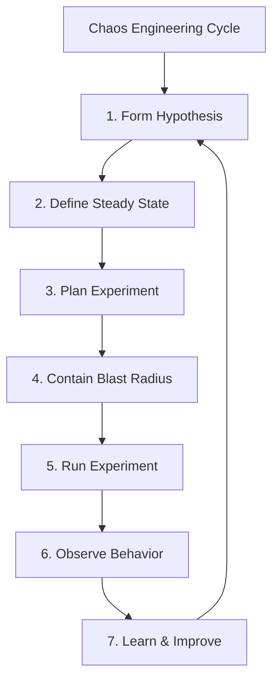
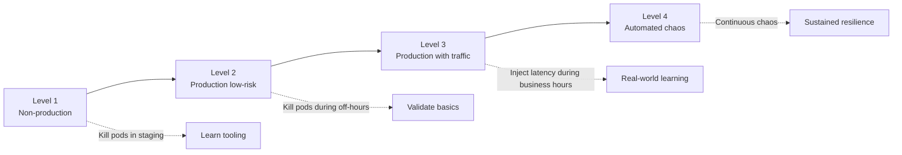
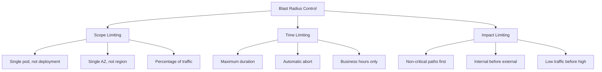
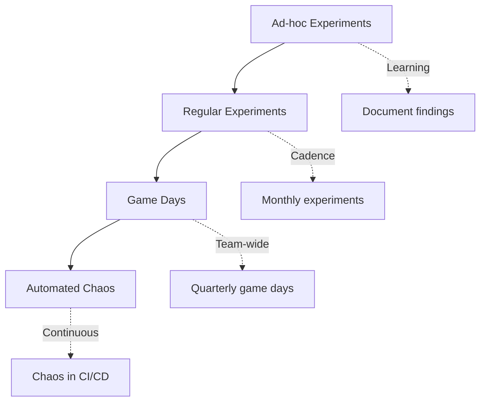

*[SRE]: Site Reliability Engineering
*[MTTR]: Mean Time To Recovery
*[RTO]: Recovery Time Objective
*[RPO]: Recovery Point Objective
*[AZ]: Availability Zone
*[SLO]: Service Level Objective
*[PDU]: Power Distribution Unit

## Introduction

I once watched a team spend four months evaluating enterprise chaos platforms. They built elaborate ROI presentations, negotiated enterprise licenses, and planned a sophisticated experiment program. Two weeks before their first scheduled experiment, a routine power test at the data center knocked out a PDU—and revealed that three services had hard dependencies on a fourth service that failed to restart automatically. The outage lasted six hours.

A fifteen-minute experiment killing a single pod would have found that bug.

Chaos engineering doesn't require expensive platforms or dedicated teams. The core practice is simply "break things on purpose to learn how they fail." That's it. You can run meaningful experiments today with nothing more than `kubectl delete pod` and a hypothesis about what should happen when you press enter.

What separates chaos engineering from just breaking things is the _learning_. You form a hypothesis, run a controlled experiment, observe what actually happens, and then—critically—you fix what you find. The value comes from the insights and the fixes, not from sophisticated tooling. A team running monthly experiments with kubectl will learn more than a team that spends a year evaluating platforms.

This guide covers the full spectrum: from your first pod-kill experiment to building a sustainable chaos practice with game days and automation. I'll walk through four concrete experiments you can run this week, compare the free tools available (tc, toxiproxy, Chaos Toolkit, and LitmusChaos), and give you templates for safe experiment execution. By the end, you'll have everything you need to build a chaos engineering program without enterprise platform costs.

<Callout type="info">
Chaos engineering is not about expensive tools—it's about deliberately introducing failures to discover weaknesses before they cause outages. You can start today with nothing more than `kubectl delete pod`.
</Callout>

## The Principles of Chaos Engineering

### What Chaos Engineering Is (and Is Not)

The term "chaos engineering" sounds destructive, which leads to a common misconception: that it's about randomly breaking things to see what happens. That's not chaos engineering—that's just chaos.

Real chaos engineering follows the scientific method. You form a hypothesis about how your system should behave under specific failure conditions, design a controlled experiment to test that hypothesis, and observe whether reality matches your expectations. The goal isn't to cause outages; it's to build confidence that your system handles failures gracefully—or to learn exactly how it doesn't.

| Chaos Engineering IS | Chaos Engineering IS NOT |
|---------------------|-------------------------|
| Hypothesis-driven experimentation | Random destruction |
| Controlled failure injection | Breaking things for fun |
| Learning about system behavior | Proving you can cause outages |
| Building confidence | Testing in production blindly |
| Proactive resilience work | Reactive incident response |

_Table: The distinction that separates real chaos engineering from breaking things randomly._

The scientific cycle looks like this: form a hypothesis about expected behavior, define what "steady state" looks like in your metrics, plan the experiment with clear scope and abort conditions, contain the blast radius so you don't turn an experiment into an incident, run the experiment, observe what actually happens, and then learn and improve based on the results. That last step—actually fixing what you find—is where most teams fall short.



_Figure: The scientific cycle of chaos engineering._

### The Hypothesis-First Approach

Without a hypothesis, you're just breaking things. If you kill a pod and the service degrades, what did you learn? Was that expected? Was it acceptable? Without a clear statement of what _should_ happen, you can't answer those questions. You can't distinguish expected behavior from bugs, and you won't know if your system got better or worse.

A good hypothesis has three components: a specific action you'll take, the expected system response, and measurable success criteria. "Let's see what happens when we kill the database" is not a hypothesis. "When the primary database becomes unavailable during normal load, the application will failover to the replica within 30 seconds and users will experience at most 5 seconds of errors" is a hypothesis.

The steady state definition is equally important. Before you inject any failure, you need to know what "normal" looks like. What's your baseline error rate? What's typical P99 latency? What throughput do you expect? Without this baseline, you can't measure the impact of your experiment.

```yaml title="chaos-hypothesis-template.yaml"
# Hypothesis template for Chaos Toolkit or manual experiments
experiment:
  name: "Database failover under load"

  hypothesis:
    statement: >
      When the primary database becomes unavailable during normal load,
      the application will failover to the replica within 30 seconds
      and users will experience at most 5 seconds of errors.

    steady_state:
      - metric: "request_success_rate"
        expected: ">= 99.9%"
      - metric: "p99_latency"
        expected: "<= 500ms"
      - metric: "error_rate"
        expected: "<= 0.1%"

    expected_during_experiment:
      - metric: "request_success_rate"
        expected: ">= 99.0%"  # Allow brief degradation
      - metric: "p99_latency"
        expected: "<= 2000ms"  # Allow latency spike
      - metric: "failover_time"
        expected: "<= 30s"
```

_Code: Hypothesis template with steady state definition and expected outcomes._

<Callout type="warning">
Without a hypothesis, you're just breaking things. The hypothesis transforms destruction into learning by telling you what to measure and what success looks like.
</Callout>

### Start Small, Learn, Expand

Chaos engineering is a practice you grow into, not a switch you flip. Teams that try to start with sophisticated automated chaos in production usually end up causing incidents that set back their chaos program by months. The better path is progressive maturity.

Start in non-production environments. Your first experiments should be in staging or a dedicated chaos environment where the blast radius is contained by design. Kill pods, inject latency, block network traffic—but do it where customer impact is impossible. The goal at this stage is learning the tooling and building confidence in your experiment design.

Once you're comfortable with the mechanics, move to production during low-risk windows. Run your pod-kill experiments at 3 AM on a Sunday when traffic is minimal. This validates that your resilience mechanisms work in the real environment without risking peak traffic. You'll often find that production behaves differently than staging—different traffic patterns, different data volumes, different failure modes.

From there, you can progress to experiments during business hours with real traffic, and eventually to automated chaos that runs continuously. But that progression takes months or years, not weeks. Each level builds on the confidence earned at the previous level.



_Figure: Progressive chaos engineering maturity levels._

## Low-Cost Chaos Tools

You don't need to spend $50,000 on an enterprise chaos platform. The tools you need are either already installed or free to deploy. I'll walk through four options that cover the full spectrum from ad-hoc experiments to structured chaos programs, with a comparison table at the end to help you choose.

### The kubectl Chaos Toolkit

Your simplest chaos tool is already installed. If you're running Kubernetes, `kubectl` can kill pods, drain nodes, and apply network policies that simulate partitions. For your first experiments, this is all you need.

The most basic experiment is killing a pod and watching Kubernetes recover it. This validates that your replica count, health checks, and service routing all work as expected. You'd be surprised how often this simple test reveals misconfigured readiness probes or deployments running with `replicas: 1`.

```bash title="kubectl-chaos-basics.sh"
#!/bin/bash
# Basic kubectl chaos commands - no additional tools required

# Kill a random pod from a deployment and watch recovery
kubectl delete pod -l app=myservice --field-selector=status.phase=Running | head -1
kubectl get pods -l app=myservice -w

# Drain a node (simulates node failure, respects PodDisruptionBudgets)
kubectl drain node-1 --ignore-daemonsets --delete-emptydir-data

# Cordon a node (prevent new scheduling without evicting existing pods)
kubectl cordon node-1
```

_Code: Basic kubectl commands for chaos experiments._

For network chaos, Kubernetes NetworkPolicies let you simulate partitions without any additional tooling. You can block egress to specific services, simulating what happens when your cache or database becomes unreachable. The key is remembering to delete the policy when you're done—I recommend setting a timer.

```bash title="kubectl-network-partition.sh"
#!/bin/bash
# Network partition simulation using Kubernetes NetworkPolicies

# Create a policy that blocks all egress from your service
cat <<EOF | kubectl apply -f -
apiVersion: networking.k8s.io/v1
kind: NetworkPolicy
metadata:
  name: chaos-block-egress
  namespace: default
spec:
  podSelector:
    matchLabels:
      app: myservice
  policyTypes:
  - Egress
  egress: []  # Empty list = block all egress
EOF

# Run your experiment, then clean up
sleep 60
kubectl delete networkpolicy chaos-block-egress
```

_Code: Network partition using Kubernetes NetworkPolicies._

The limitation of kubectl-based chaos is that it's manual and unstructured. There's no built-in hypothesis validation, no automatic abort conditions, and no experiment history. That's fine for getting started, but as your practice matures, you'll want more structure.

### tc and toxiproxy for Latency Injection

Killing pods tests crash recovery, but most production incidents aren't clean crashes—they're slowdowns. A database that responds in 30 seconds instead of 30 milliseconds is technically "up," but it might as well be down. Latency injection reveals whether your timeouts, circuit breakers, and connection pools are configured correctly.

The `tc` (traffic control) command is built into Linux and can add latency, packet loss, and bandwidth constraints to any network interface. The catch is that it operates at the node or container level, so you need to exec into the container or run it on the node itself.

```bash title="tc-latency-injection.sh"
#!/bin/bash
# Traffic control for latency injection - run inside container or on node

# Add 200ms latency with 50ms jitter to all outgoing traffic
tc qdisc add dev eth0 root netem delay 200ms 50ms

# Add 5% packet loss (simulates flaky network)
tc qdisc add dev eth0 root netem loss 5%

# Remove all tc rules (important - don't forget this!)
tc qdisc del dev eth0 root
```

_Code: Traffic control commands for latency and packet loss injection._

For more surgical latency injection, toxiproxy is the better choice. It's a programmable proxy that sits between your application and its dependencies, letting you inject failures via API calls. You deploy toxiproxy as a sidecar or separate service, point your application at it instead of the real dependency, and then control failures through the toxiproxy API.

```yaml title="toxiproxy-config.json"
# Toxiproxy configuration - deploy as sidecar or standalone service
# Application connects to toxiproxy ports, which forward to real services
{
  "proxies": [
    {
      "name": "database",
      "listen": "0.0.0.0:5432",
      "upstream": "real-database:5432",
      "enabled": true
    },
    {
      "name": "redis",
      "listen": "0.0.0.0:6379",
      "upstream": "real-redis:6379",
      "enabled": true
    }
  ]
}
```

_Code: Toxiproxy configuration for database and cache proxying._

Once toxiproxy is running, you inject failures by adding "toxics" via the API. This can be scripted into your experiment runbooks.

```bash title="toxiproxy-inject-latency.sh"
#!/bin/bash
# Inject 1 second latency on database connections via toxiproxy API

curl -X POST http://toxiproxy:8474/proxies/database/toxics \
  -H "Content-Type: application/json" \
  -d '{"name":"latency","type":"latency","attributes":{"latency":1000,"jitter":200}}'

# Run experiment, then remove the toxic
sleep 300
curl -X DELETE http://toxiproxy:8474/proxies/database/toxics/latency
```

_Code: Injecting and removing latency via toxiproxy API._

### Chaos Toolkit (Open Source)

When you're ready to move beyond ad-hoc experiments, Chaos Toolkit provides structure without cost. It's an open-source framework that formalizes the scientific method: you define a hypothesis with steady-state conditions, specify the experimental actions, and Chaos Toolkit validates the hypothesis before, during, and after the experiment.

The key benefit is repeatability. Instead of a bash script that might work differently each time someone runs it, you get a declarative experiment definition that anyone on the team can execute consistently. Chaos Toolkit also handles the steady-state verification automatically—it checks your hypothesis before injecting chaos and again after recovery.

The `pauses.after` value in the experiment below deserves attention. Thirty seconds gives Kubernetes time to detect the pod failure, schedule a replacement, pull the container image (if not cached), run startup probes, and pass readiness checks. If your service takes longer to become ready—JVM warmup, cache priming, database connection pooling—increase this value accordingly. Too short a pause and you'll get false negatives; too long and you're wasting time.

```yaml title="chaos-toolkit-pod-kill.yaml"
# Chaos Toolkit experiment definition
version: 1.0.0
title: "Verify service resilience to pod failure"
description: "Kill a pod and verify the service recovers automatically"

steady-state-hypothesis:
  title: "Service is healthy"
  probes:
    - type: probe
      name: "service-responds"
      tolerance: 200
      provider:
        type: http
        url: "http://myservice/health"
        method: GET
        timeout: 3

method:
  - type: action
    name: "kill-pod"
    provider:
      type: python
      module: chaosk8s.pod.actions
      func: terminate_pods
      arguments:
        label_selector: "app=myservice"
        qty: 1
        ns: "default"
    pauses:
      after: 30  # Wait 30s for recovery before checking hypothesis

rollbacks:
  - type: action
    name: "scale-up-if-needed"
    provider:
      type: python
      module: chaosk8s.deployment.actions
      func: scale_deployment
      arguments:
        name: "myservice"
        replicas: 3
        ns: "default"
```

_Code: Chaos Toolkit experiment definition with hypothesis, action, and rollback._

Running an experiment is straightforward once you've installed the toolkit and the Kubernetes extension:

```bash title="chaos-toolkit-run.sh"
#!/bin/bash
# Install and run Chaos Toolkit

pip install chaostoolkit chaostoolkit-kubernetes

# Run experiment with journal output for later analysis
chaos run experiment.yaml --journal-path results.json

# Verify steady state only (dry run, doesn't inject chaos)
chaos run experiment.yaml --dry-run
```

_Code: Running Chaos Toolkit experiments._

<Callout type="success">
Chaos Toolkit is free, open source, and extensible. It provides structure without cost—experiment definitions, steady state verification, and automatic rollbacks.
</Callout>

### LitmusChaos for Kubernetes

LitmusChaos is a CNCF project that takes a Kubernetes-native approach to chaos engineering. Instead of running experiments from the command line, you define ChaosEngine resources that Kubernetes operators execute. This makes LitmusChaos a good fit if you want chaos experiments to live alongside your other Kubernetes manifests and be managed through GitOps workflows.

LitmusChaos comes with a library of pre-built experiments—pod deletion, network latency, CPU stress, disk fill, and dozens more. You don't have to write the chaos injection logic yourself; you just configure which experiment to run against which workload.

```yaml title="litmus-pod-delete.yaml"
# LitmusChaos ChaosEngine for pod deletion
apiVersion: litmuschaos.io/v1alpha1
kind: ChaosEngine
metadata:
  name: myservice-chaos
  namespace: default
spec:
  appinfo:
    appns: 'default'
    applabel: 'app=myservice'
    appkind: 'deployment'
  chaosServiceAccount: litmus-admin
  experiments:
    - name: pod-delete
      spec:
        components:
          env:
            - name: TOTAL_CHAOS_DURATION
              value: '30'
            - name: CHAOS_INTERVAL
              value: '10'
            - name: FORCE
              value: 'false'
            - name: PODS_AFFECTED_PERC
              value: '50'
```

_Code: LitmusChaos experiment for pod deletion._

Network experiments are similarly declarative. This example injects 300ms of latency on the target pods' network interface:

```yaml title="litmus-network-latency.yaml"
# LitmusChaos network latency injection
apiVersion: litmuschaos.io/v1alpha1
kind: ChaosEngine
metadata:
  name: network-chaos
  namespace: default
spec:
  appinfo:
    appns: 'default'
    applabel: 'app=myservice'
    appkind: 'deployment'
  chaosServiceAccount: litmus-admin
  experiments:
    - name: pod-network-latency
      spec:
        components:
          env:
            - name: NETWORK_INTERFACE
              value: 'eth0'
            - name: NETWORK_LATENCY
              value: '300'
            - name: TOTAL_CHAOS_DURATION
              value: '60'
            - name: CONTAINER_RUNTIME
              value: 'containerd'
```

_Code: LitmusChaos network latency experiment._

The tradeoff with LitmusChaos is complexity. You need to install the LitmusChaos operator, set up service accounts with appropriate permissions, and understand the CRD-based workflow. For teams already deep in Kubernetes and GitOps, this feels natural. For teams just starting with chaos engineering, Chaos Toolkit's simpler CLI-based approach might be easier to adopt.

| Tool | Best For | Complexity | Kubernetes Required |
|------|----------|------------|---------------------|
| kubectl | First experiments, simple pod/node chaos | Low | Yes |
| tc/iptables | Network latency and packet loss | Medium | No (Linux only) |
| toxiproxy | Surgical dependency failure injection | Medium | No |
| Chaos Toolkit | Structured experiments with hypothesis validation | Medium | No (has K8s extension) |
| LitmusChaos | GitOps-managed, Kubernetes-native chaos | High | Yes |

_Table: Comparison of free chaos engineering tools._

## Designing Safe Experiments

The difference between a chaos experiment and an outage is control. Every experiment needs clearly defined boundaries: what you're affecting, for how long, and what conditions will make you stop immediately. Without these controls, you're not running experiments—you're just causing incidents.

### Blast Radius Control

Blast radius is the maximum possible impact of your experiment. Controlling it means thinking along three dimensions: scope (what gets affected), time (how long the effect lasts), and impact (what customer-facing consequences are acceptable).

For scope, start narrow and expand only when you've built confidence. Your first experiments should target a single pod, not an entire deployment. A single availability zone, not a region. A small percentage of traffic, not all of it. As you learn how your systems respond and build confidence in your abort mechanisms, you can gradually increase scope.

Time limits provide a safety net when other controls fail. Set a maximum duration for every experiment—even if you plan to run it for only 5 minutes, have an automatic cutoff at 10. This prevents runaway experiments when someone forgets to clean up or when the abort mechanism doesn't trigger as expected.

Impact limits define what customer-facing consequences you're willing to accept. For early experiments, that might be "zero customer-visible errors." As you mature, you might accept brief degradation ("P99 latency can spike to 2s for up to 30 seconds"). The key is deciding _before_ you start, not while you're watching dashboards and trying to decide if things are bad enough to stop.



_Figure: Three dimensions of blast radius control._

Abort conditions are the most critical control. These are the thresholds that, when breached, trigger immediate experiment termination—ideally automatically, but at minimum manually with a pre-defined trigger. "Error rate exceeds 5%" or "P99 latency exceeds 5 seconds" or "any customer complaint received" are all reasonable abort conditions depending on your risk tolerance.

The configuration below shows what comprehensive blast radius controls look like. You won't implement all of this for your first experiment, but it illustrates the thinking:

```yaml title="blast-radius-controls.yaml"
# Blast radius control configuration template
experiment:
  name: "Database latency injection"

  blast_radius:
    scope:
      target: "single pod"
      namespace: "default"
      max_pods_affected: 1
      percentage_affected: 10

    time:
      max_duration: "5m"
      business_hours_only: true
      excluded_dates: ["2024-12-25", "2024-01-01"]

    impact:
      critical_paths_excluded: true
      traffic_threshold: "< 1000 rps"
      error_budget_check: true

  abort_conditions:
    - metric: "error_rate"
      threshold: "> 5%"
      action: "immediate_rollback"
    - metric: "p99_latency"
      threshold: "> 5s"
      action: "immediate_rollback"
    - metric: "customer_complaints"
      threshold: "> 0"
      action: "immediate_rollback"
```

_Code: Comprehensive blast radius control configuration._

<Callout type="danger">
Never run chaos experiments without abort conditions. Define the thresholds that trigger automatic rollback before you start, not after things go wrong.
</Callout>

### The Experiment Runbook

Every experiment should have a runbook—a document that captures the hypothesis, prerequisites, execution steps, and rollback procedure. This isn't bureaucracy; it's how you ensure experiments are repeatable, that anyone on the team can run them safely, and that you have documentation for post-experiment analysis.

The runbook also forces you to think through the experiment before running it. Writing down "rollback procedure: delete the network policy" makes you realize you need to test that the deletion actually restores connectivity. Writing down "on-call aware experiment is happening" reminds you to actually notify them.

```markdown title="experiment-runbook-template.md"
# Chaos Experiment: [Name]

## Overview

- **Hypothesis:** [What we expect to happen]
- **Target:** [System/service being tested]
- **Date:** [When this will run]
- **Owner:** [Who is responsible]

## Prerequisites

- [ ] Steady state metrics baseline captured
- [ ] Monitoring dashboards open
- [ ] On-call aware experiment is happening
- [ ] Rollback procedure tested
- [ ] Abort conditions defined

## Experiment Details

- **Type:** [Pod kill / Latency / Network partition / etc.]
- **Scope:** [What exactly will be affected]
- **Duration:** [How long]
- **Blast radius:** [What is the maximum impact]

## Abort Conditions

| Metric | Threshold | Action |
|--------|-----------|--------|
| Error rate | > X% | Abort |
| Latency P99 | > Yms | Abort |
| Manual | N/A | Abort |

## Execution Steps

1. Announce experiment in #incidents channel
2. Verify steady state
3. Execute experiment
4. Monitor for [duration]
5. Verify recovery
6. Document results

## Rollback Procedure

1. [Step to stop experiment]
2. [Step to restore normal state]
3. [Verification that rollback succeeded]

## Results

- **Outcome:** [Hypothesis confirmed/disproved]
- **Observations:** [What we saw]
- **Action items:** [What we learned to fix]
```

_Code: Experiment runbook template ensuring safe, repeatable execution._

### Communicating with Stakeholders

Chaos experiments can look alarming to people who don't know they're happening. An SRE sees error rate spike and starts incident response. A product manager sees degraded performance and escalates to engineering leadership. A customer success rep gets a complaint and panics.

The solution is proactive communication. Before every experiment, announce what you're doing, when you're doing it, and what impact to expect. During the experiment, provide brief status updates. After the experiment, share what you learned.

This communication serves multiple purposes. It prevents false alarms and wasted incident response effort. It builds organizational awareness of chaos engineering as a practice. And it creates accountability—if you have to announce that you're going to break something on purpose, you're more likely to think carefully about whether you should.

```yaml title="stakeholder-communication.yaml"
# Communication plan template for chaos experiments
before_experiment:
  announce:
    channels: ["#engineering", "#incidents", "#on-call"]
    message: |
      🧪 Chaos Experiment Scheduled

      What: Killing 1 pod of payment-service
      When: Today 2pm-2:15pm EST
      Why: Verify automatic recovery and alerting

      Expected impact: None if resilience works correctly
      Abort conditions: Any customer-visible errors

      Questions? Reply here or DM @chaos-team

  notify:
    - on_call_engineer
    - service_owner
    - relevant_product_manager

during_experiment:
  updates:
    frequency: "every 2 minutes"
    include: ["current status", "metrics observed", "any anomalies"]

after_experiment:
  summary:
    include:
      - hypothesis_result
      - key_observations
      - action_items
      - link_to_full_report
```

_Code: Stakeholder communication plan for chaos experiments._

## Starter Experiments

Now let's put theory into practice. These four experiments form a progression from basic to advanced, covering the failure modes you'll encounter most often in production. Each builds on skills from the previous one.

### Experiment 1: Pod Termination

This is the simplest and most valuable first experiment. If you've never run a chaos experiment before, start here—you can do it this week with tools you already have.

The hypothesis is straightforward: when a single pod is terminated, Kubernetes will automatically restart it and the service will continue handling requests with minimal degradation. You'd think this would "just work," but you'd be surprised how often it doesn't.

Before you start, verify three prerequisites. First, your deployment has replicas greater than 1—if you're running a single pod, killing it _will_ cause an outage (and that's useful to know, but probably not how you want to learn it). Second, health checks are configured—liveness and readiness probes tell Kubernetes when the pod is ready to receive traffic. Third, you have monitoring in place to observe the experiment.

```bash title="pod-kill-experiment.sh"
#!/bin/bash
# Pod termination experiment - the simplest chaos experiment

# Get the name of one running pod
POD=$(kubectl get pods -l app=myservice -o jsonpath='{.items[0].metadata.name}')

# Record baseline (manually check dashboards for 5 minutes)
echo "Recording baseline metrics..."

# Delete pod and immediately watch recovery
kubectl delete pod $POD && kubectl get pods -l app=myservice -w
```

_Code: Simple pod termination experiment with recovery observation._

Watch for the new pod scheduling, the health check passing, and traffic resuming to the recovered pod. Your success criteria: new pod running within 60 seconds, no 5xx errors during recovery, and latency returned to baseline within 2 minutes.

What teams commonly discover from this experiment:

- _Slow container startup delays recovery._ If your container takes 45 seconds to start, that's 45 seconds of degraded capacity. Consider optimizing image size, adding startup probes, or adjusting replica counts.
- _Missing readiness probes cause traffic to unhealthy pods._ Without a readiness probe, Kubernetes sends traffic to pods that aren't ready, causing errors during startup.
- _No alerts fired despite degradation._ This is the "aha" moment—your monitoring gap was invisible until you tested it.

### Experiment 2: Dependency Latency

Most production incidents aren't clean crashes—they're slowdowns. A database that responds in 500ms instead of 10ms is technically "up," but your service might as well be down if it can't handle the latency gracefully. This experiment reveals whether your timeouts, circuit breakers, and connection pools are configured correctly.

The hypothesis: when the database responds with 500ms latency instead of 10ms, the service will maintain response times under 2 seconds by using timeouts and not queuing unlimited requests.

For this experiment, you'll use toxiproxy to inject latency between your service and its database. The setup requires toxiproxy running as a proxy in front of your database (as described in the tools section earlier).

```bash title="latency-injection-experiment.sh"
#!/bin/bash
# Dependency latency experiment using toxiproxy

# Record baseline metrics for 5 minutes first

# Inject 500ms latency on database connections
curl -X POST http://toxiproxy:8474/proxies/database/toxics \
  -H "Content-Type: application/json" \
  -d '{"name":"latency","type":"latency","attributes":{"latency":500,"jitter":100}}'

# Observe for 5 minutes, watching:
# - Client timeout handling
# - Connection pool behavior
# - Request queuing depth
# - Circuit breaker activation

# Remove latency and observe recovery
curl -X DELETE http://toxiproxy:8474/proxies/database/toxics/latency
```

_Code: Latency injection experiment using toxiproxy._

Success looks like: service remains responsive (P99 under 3 seconds), no cascading failures to other services, and graceful degradation where partial responses are acceptable.

What teams commonly discover:

- _Missing timeouts cause request pileup._ Without timeouts, requests queue indefinitely waiting for the slow database, exhausting threads and memory.
- _Connection pool exhaustion._ Under latency, connections are held longer, and the pool runs dry before requests complete.
- _No circuit breaker means failures cascade._ Without a circuit breaker, every request tries the slow path, and the latency spreads to callers of your service.

### Experiment 3: Network Partition

Network partitions are trickier than latency because they test your fallback logic. What happens when your cache is completely unreachable? Does your service fail, or does it fall back to the database? This experiment reveals hard dependencies you didn't know you had.

The hypothesis: when the service cannot reach the cache, it will fall back to the database and continue serving requests with degraded performance but no errors.

You can simulate network partitions using Kubernetes NetworkPolicies without any additional tooling. The policy below blocks egress traffic from your service to Redis by allowing traffic to everything _except_ pods labeled `app=redis`. The `NotIn` operator with a single value effectively creates an exclusion rule—the policy permits egress to any pod whose `app` label is not `redis`, which means Redis becomes unreachable while everything else remains accessible.

```yaml title="network-partition-experiment.yaml"
# Kubernetes NetworkPolicy to simulate cache partition
apiVersion: networking.k8s.io/v1
kind: NetworkPolicy
metadata:
  name: chaos-block-redis
  namespace: default
spec:
  podSelector:
    matchLabels:
      app: myservice
  policyTypes:
  - Egress
  egress:
  - to:
    - podSelector:
        matchExpressions:
        - key: app
          operator: NotIn
          values: ["redis"]  # Allow all egress EXCEPT to redis
```

_Code: NetworkPolicy to block cache access for partition experiment._

Apply the policy, observe for 5 minutes watching cache miss rate, database load, response times, and error rates. Then delete the policy and verify recovery.

Success criteria: service continues responding (even if slowly), fallback to database works correctly, and no data inconsistency results from the partition.

What teams commonly discover:

- _Hard dependency on cache, no fallback._ The code assumes cache is always available and throws exceptions on connection failure instead of falling back.
- _Timeouts too long, requests queue._ Connection timeouts of 30 seconds mean requests pile up waiting for a cache that will never respond.
- _Cache reconnection logic is buggy._ After the partition heals, the service doesn't reconnect properly and continues failing.

<Callout type="info">
These three experiments—pod kill, latency injection, and network partition—cover the vast majority of real-world failures. Master them before moving to more exotic scenarios.
</Callout>

### Experiment 4: Resource Exhaustion

This is an advanced experiment that tests what happens when your application runs low on memory or CPU. The failure mode is different from the previous experiments: instead of external dependencies failing, your own application is under pressure.

The hypothesis: when memory usage approaches the pod limit, the application will shed load gracefully rather than being OOM-killed, and will recover without intervention when pressure reduces.

Resource exhaustion is harder to simulate safely because you're directly stressing the application rather than its dependencies. The blast radius is harder to control—memory pressure on one pod can affect others through noisy neighbor effects if limits aren't set correctly.

```bash title="resource-exhaustion-experiment.sh"
#!/bin/bash
# Memory pressure experiment using stress-ng
# WARNING: Advanced experiment - ensure memory limits are set on target pods

# Record baseline memory and performance for 5 minutes

# Inject memory pressure (80% of available memory for 5 minutes)
kubectl exec -it myservice-pod -- \
  stress-ng --vm 1 --vm-bytes 80% --timeout 300s

# Watch for:
# - Memory metrics approaching pod limit
# - Garbage collection behavior (for JVM/Go apps)
# - Response time degradation
# - OOM kill events
# - Load shedding activation (rejecting new requests when overloaded)

# stress-ng exits after timeout, observe recovery for 5 minutes
```

_Code: Memory pressure experiment using stress-ng._

Success looks like: no OOM kills, graceful degradation where the service sheds excess load, and recovery without manual intervention when pressure reduces.

What teams commonly discover:

- _No memory limits set._ Without limits, one pod's memory pressure affects the entire node—the classic noisy neighbor problem.
- _OOM kill with no graceful handling._ The application gets killed abruptly with no opportunity to drain connections or save state.
- _Memory leaks exposed under pressure._ Baseline memory usage creeps up over time, and the stress test just accelerates the inevitable OOM.

## Building a Chaos Practice

Running a few experiments is useful. Building a sustainable chaos engineering practice is transformative. The difference is the difference between occasionally testing your smoke detectors and having a comprehensive fire safety program.

### From Experiments to Program

Most teams start with ad-hoc experiments—someone reads about chaos engineering, runs a pod-kill experiment, finds an interesting bug, and then... nothing. The experiment was valuable, but there's no follow-through, no cadence, no progression. Six months later, someone else reads about chaos engineering and repeats the cycle.

A mature chaos practice looks different. Experiments run on a regular cadence—weekly or monthly depending on team capacity. Findings get tracked and fixed. The scope expands progressively from simple pod kills to complex multi-service scenarios. Eventually, chaos runs automatically as part of CI/CD or on a schedule.



_Figure: Evolution from ad-hoc experiments to mature chaos practice._

The progression takes time—typically a year or more to go from first experiment to automated chaos. Trying to skip stages usually backfires. Teams that jump straight to automated chaos without building the foundational skills end up causing incidents that set back the entire practice.

Here's a realistic four-quarter roadmap for building a chaos engineering practice from scratch:

| Quarter | Focus | Activities | Success Criteria |
|---------|-------|------------|------------------|
| Q1 | Establish basics | Run first pod-kill experiments, document and fix findings, train team on experiment design (hypothesis, abort conditions, stakeholder communication) | 3+ experiments completed, 5+ bugs fixed |
| Q2 | Expand coverage | Move to latency injection and network partitions, create reusable experiment library, test all critical services | Comprehensive critical path coverage, updated runbooks |
| Q3 | Build team capability | Host first game day, enable multiple teams to run experiments independently, share learnings org-wide | Successful game day, 3+ teams practicing chaos |
| Q4 | Automate foundations | Integrate chaos into CI/CD for staging deployments, automate steady-state verification, schedule recurring experiments | Weekly automated experiments without manual intervention |

_Table: Four-quarter roadmap for building a chaos engineering practice._

### Game Days

Game days are scheduled events where the team intentionally causes failures and practices incident response in a controlled environment. They're different from regular experiments in two important ways: they're team-wide events rather than individual activities, and the primary goal is practicing response rather than finding bugs.

Think of a game day like a fire drill. You might discover that the emergency exit is blocked—that's a valuable finding. But the main value is practicing the evacuation itself: everyone learns the routes, the assembly points, the communication protocols. When a real fire happens, the team responds from muscle memory rather than scrambling to figure out what to do.

A game day requires preparation. One to two weeks before, define the scenarios you'll test, brief all participants on their roles, prepare monitoring dashboards, test rollback procedures, and notify stakeholders. During the event, you need clear roles: a game master who controls experiment execution, observers who watch systems and document behavior, responders who practice incident response as if it were real, and a facilitator who keeps the event on track.

```markdown title="game-day-playbook.md"
# Chaos Game Day Playbook

## Preparation (1-2 weeks before)

- [ ] Define scenarios to test
- [ ] Brief all participants on their roles
- [ ] Prepare monitoring dashboards
- [ ] Test rollback procedures
- [ ] Schedule with stakeholder awareness

## Roles

- **Game Master:** Controls experiment execution
- **Observers:** Watch systems and document behavior
- **Responders:** Practice incident response
- **Facilitator:** Keeps event on track, manages time

## Sample Agenda (Half-day)

| Time | Activity |
|------|----------|
| 9:00 | Kickoff, review scenarios, check readiness |
| 9:30 | Scenario 1: Pod failures |
| 10:30 | Debrief scenario 1 |
| 11:00 | Scenario 2: Database failover |
| 12:00 | Debrief scenario 2 |
| 12:30 | Wrap-up, action items, retrospective |

## Post Game Day

- Document all findings
- Create tickets for improvements
- Share learnings with broader org
- Plan next game day
```

_Code: Game day planning and execution playbook._

<Callout type="success">
Game days build team muscle memory for incident response. The goal isn't to find bugs (though you will)—it's to practice responding to failures as a team.
</Callout>

### Metrics for Chaos Practice

How do you know if your chaos practice is working? You need metrics that measure both activity (are you actually running experiments?) and impact (are you finding and fixing problems?).

| Metric | What It Measures | Target |
|--------|------------------|--------|
| Experiments/month | Practice frequency | 4+ |
| Findings/experiment | Learning rate | 2+ actionable |
| Fix completion rate | Follow-through | >80% in 30 days |
| MTTR improvement | Business impact | Decreasing trend |
| Incident prevention | Proactive value | Findings before prod incidents |

_Table: Metrics for measuring chaos engineering practice effectiveness._

The most important metric is fix completion rate. Finding bugs is useless if you don't fix them. Track how many findings get resolved within 30 days, and treat low fix rates as a practice problem—you're generating work faster than you can complete it, which means you should slow down the experiment cadence until you catch up.

The hardest metric to measure is incident prevention—bugs you found through chaos that would have caused production incidents. You can approximate this by tracking bugs that match patterns from past incidents, or by noting when chaos findings would have prevented a real incident that happened elsewhere in the organization.

## Common Pitfalls

I've seen teams adopt chaos engineering successfully and unsuccessfully. The same mistakes come up repeatedly. Avoid these three pitfalls and you'll be ahead of most.

### Pitfall 1: No Hypothesis

The most common mistake: "Let's see what happens when we kill the database." That's not an experiment—without a hypothesis, you don't know what to measure or what success looks like.

The fix is simple: write down your expectation before you start. "When the primary database fails, the application will failover to the replica within 30 seconds with no more than 5 seconds of errors visible to users." Now you have measurable criteria and can determine whether reality matched expectations.

### Pitfall 2: No Abort Conditions

Running an experiment with the plan "watch and manually stop if things look bad" is how experiments become incidents. Humans are slow to react, especially when they're not sure if what they're seeing is expected behavior or a problem. By the time you decide things are bad enough to stop, you've already caused an outage.

Define abort conditions before you start: error rate exceeds 5%, P99 latency exceeds 5 seconds, any customer complaint. Ideally these trigger automatic rollback. At minimum, write them down so you know when to pull the plug without debating it in the moment.

### Pitfall 3: Not Following Through

The worst pattern I've seen: find bugs, document them, move on. Six months later, someone finds the document and asks why none of the bugs were fixed. The team has false confidence because they "did chaos engineering," but none of the findings were addressed.

Chaos without fixes is just expensive documentation. The workflow must be: find bugs → document → create tickets → fix → re-run experiment to verify the fix. If you're finding bugs faster than you can fix them, slow down the experiments until you catch up. Track fix completion rate as a key metric.

<Callout type="warning">
The value of chaos engineering is not in finding problems—it's in fixing them. An experiment without follow-through is worse than no experiment because it creates false confidence.
</Callout>

## Conclusion

Chaos engineering doesn't require expensive platforms or dedicated teams. You can start today with `kubectl delete pod` and a hypothesis about what should happen when you press enter.

The principles are simple: form a hypothesis before you break anything, define abort conditions so experiments don't become incidents, control the blast radius so you're learning rather than causing outages, and follow through on findings by actually fixing them.

Once you've mastered the four experiments in this guide, the path forward opens up. You can explore zone and region failures to test geographic redundancy. You can inject clock skew to find time-sensitive bugs. You can simulate certificate expiration, DNS failures, or cloud provider API throttling. Each new experiment type reveals a different class of bugs—and each one can be done with free tools.

The barrier to starting isn't tooling or budget. It's deciding to run that first experiment. Pick a service. Form a hypothesis. Open your monitoring dashboard. Kill a pod. Watch what happens.

<Callout type="success">
You don't need an enterprise chaos platform to start chaos engineering. You need a hypothesis, a safe experiment, monitoring to observe the results, and the discipline to fix what you find. Start small, learn, and expand.
</Callout>
