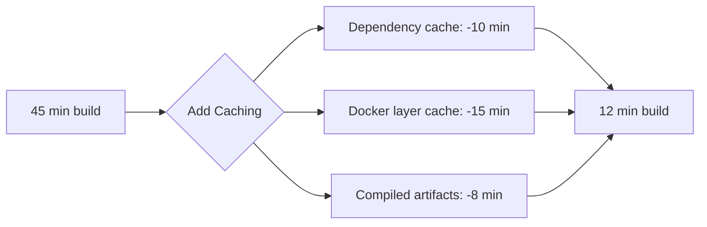
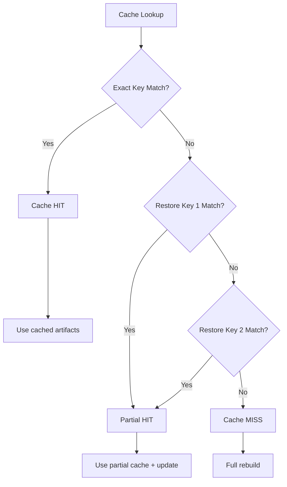
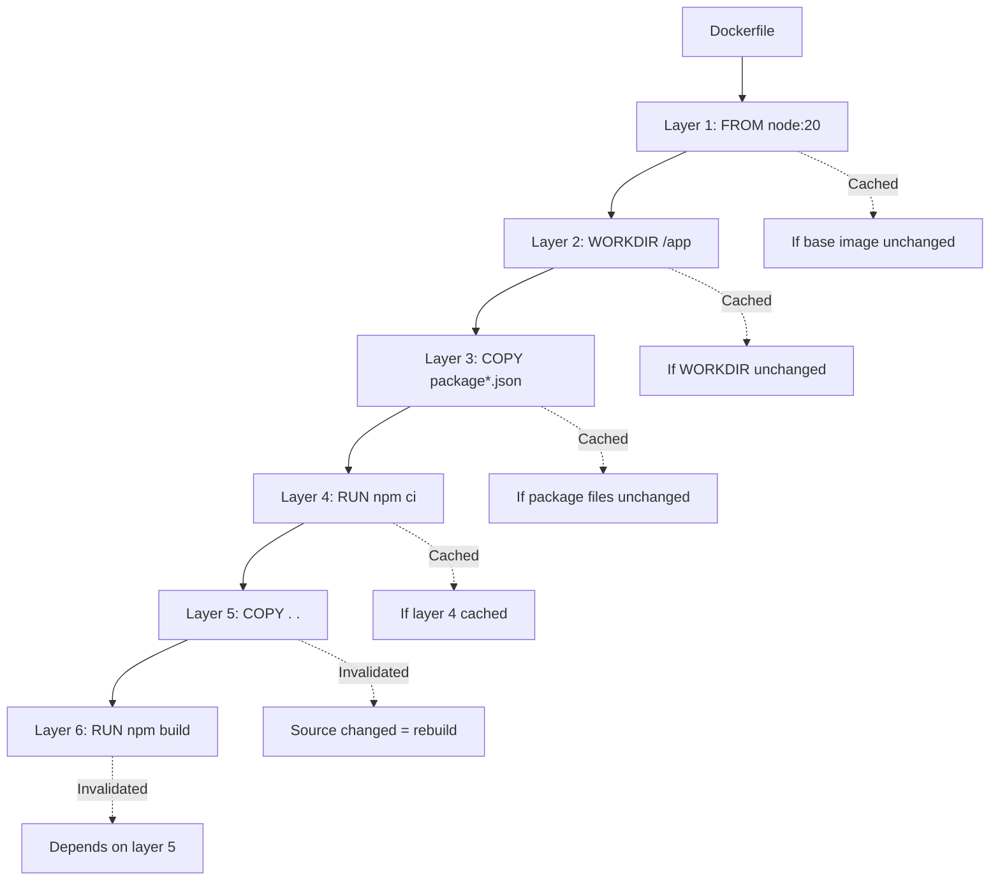
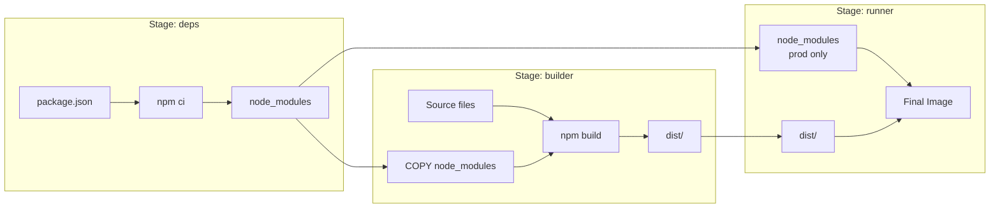
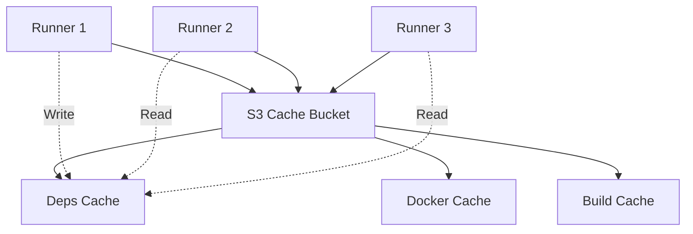

*[CI]: Continuous Integration
*[CD]: Continuous Deployment
*[CHR]: Cache Hit Ratio
*[TTL]: Time To Live
*[OCI]: Open Container Initiative
*[COPY]: Dockerfile COPY instruction
*[RUN]: Dockerfile RUN instruction

# CI Pipeline Caching: Strategies That Actually Work

## Introduction

Brief overview of why CI caching is both critical and treacherous: build times directly impact developer productivity and deployment frequency, but incorrect caching produces builds that pass CI but fail in production. This section frames CI caching as an optimization that requires correctness guarantees.

_Include a real-world scenario: a team's 45-minute builds drop to 8 minutes with aggressive caching, but three weeks later they discover the cache was serving stale dependencies and a security patch never made it into their production images. The rollback takes longer than all the time they saved._

<Callout type="warning">
A fast build that produces incorrect artifacts is worse than a slow build. Before optimizing cache hit ratio, ensure your cache keys capture everything that affects build output.
</Callout>

## The Fundamentals of CI Caching

### Why CI Builds Are Slow

Identify the primary time sinks in typical CI pipelines.

| Phase | Typical Time | Why It's Slow | Caching Opportunity |
|-------|--------------|---------------|---------------------|
| Checkout | 1-5 min | Large repos, shallow clone helps | Git LFS cache |
| Dependency install | 2-15 min | Network latency, extraction | High |
| Docker build | 5-30 min | Layer rebuilds, no cache | Very high |
| Compile | 2-20 min | Full rebuild every time | High |
| Test | 5-60 min | Sequential, no parallelization | Medium (test splitting) |
| Artifact upload | 1-5 min | Large files, slow storage | Low |

Table: CI pipeline phases with caching potential.


Figure: Typical build time reduction from proper caching.

### Cache Keys: The Foundation

Explain how cache keys work and why they matter.

```yaml title="cache-key-anatomy.yaml"
# Cache key components
cache_key:
  # Static prefix for namespacing
  prefix: "v1-deps"

  # Dynamic components that affect cache validity
  components:
    - os: "${{ runner.os }}"  # linux, macos, windows
    - lockfile_hash: "${{ hashFiles('**/package-lock.json') }}"
    - node_version: "${{ matrix.node }}"

  # Resulting key
  result: "v1-deps-linux-abc123def456-18"

  # Restore keys (fallback hierarchy)
  restore_keys:
    - "v1-deps-linux-abc123def456-"  # Exact lockfile, any node
    - "v1-deps-linux-"                # Same OS, any lockfile
    - "v1-deps-"                      # Any OS (usually not useful)
```
Code: Anatomy of a cache key with components and fallback hierarchy.


Figure: Cache lookup flow with restore key fallbacks.

<Callout type="info">
Restore keys provide fallback options when the exact cache key does not match. They enable partial cache hits—using a slightly stale cache is usually faster than rebuilding from scratch.
</Callout>

### Cache Correctness Principles

Define the rules that ensure caches never serve incorrect content.

```yaml title="cache-correctness-rules.yaml"
principles:
  completeness:
    rule: "Cache key must include everything that affects output"
    examples:
      - "Lockfile hash for dependencies"
      - "Compiler version for compiled artifacts"
      - "Source file hashes for incremental builds"
    violation: "Stale cached artifact used for new source"

  determinism:
    rule: "Same inputs must produce same outputs"
    examples:
      - "Pin dependency versions exactly"
      - "Use specific compiler versions"
      - "Avoid timestamps in artifacts"
    violation: "Cache hit but artifact differs from fresh build"

  isolation:
    rule: "Caches must not leak between unrelated builds"
    examples:
      - "Include branch/PR in key when needed"
      - "Separate caches per workflow"
      - "Clean shared state before caching"
    violation: "PR build pollutes main branch cache"
```
Code: Cache correctness principles with examples.

## Dependency Caching

### Node.js / npm / yarn / pnpm

Detailed patterns for JavaScript ecosystem caching.

```yaml title="github-actions-node-cache.yaml"
# GitHub Actions - npm caching
- name: Setup Node.js
  uses: actions/setup-node@v4
  with:
    node-version: '20'
    cache: 'npm'  # Built-in caching

# Manual cache for more control
- name: Cache node_modules
  uses: actions/cache@v4
  id: npm-cache
  with:
    path: node_modules
    key: ${{ runner.os }}-node-${{ hashFiles('**/package-lock.json') }}
    restore-keys: |
      ${{ runner.os }}-node-

- name: Install dependencies
  if: steps.npm-cache.outputs.cache-hit != 'true'
  run: npm ci
```
Code: GitHub Actions npm caching with conditional install.

```yaml title="gitlab-ci-node-cache.yaml"
# GitLab CI - npm caching
variables:
  npm_config_cache: "$CI_PROJECT_DIR/.npm"

cache:
  key:
    files:
      - package-lock.json
    prefix: $CI_JOB_NAME
  paths:
    - .npm/
    - node_modules/
  policy: pull-push

install:
  script:
    - npm ci --cache .npm --prefer-offline
```
Code: GitLab CI npm caching configuration.

```yaml title="pnpm-cache.yaml"
# pnpm caching - cache the store, not node_modules
- name: Setup pnpm
  uses: pnpm/action-setup@v2
  with:
    version: 8

- name: Get pnpm store directory
  id: pnpm-cache
  shell: bash
  run: |
    echo "STORE_PATH=$(pnpm store path)" >> $GITHUB_OUTPUT

- name: Cache pnpm store
  uses: actions/cache@v4
  with:
    path: ${{ steps.pnpm-cache.outputs.STORE_PATH }}
    key: ${{ runner.os }}-pnpm-${{ hashFiles('**/pnpm-lock.yaml') }}
    restore-keys: |
      ${{ runner.os }}-pnpm-

- name: Install dependencies
  run: pnpm install --frozen-lockfile
```
Code: pnpm store caching for efficient installs.

<Callout type="success">
pnpm's content-addressable store makes it particularly cache-friendly. Cache the store directory, not node_modules—pnpm will hardlink from the store instantly.
</Callout>

### Python / pip / Poetry

Python dependency caching patterns.

```yaml title="python-cache.yaml"
# pip caching
- name: Cache pip
  uses: actions/cache@v4
  with:
    path: ~/.cache/pip
    key: ${{ runner.os }}-pip-${{ hashFiles('**/requirements*.txt') }}
    restore-keys: |
      ${{ runner.os }}-pip-

# Poetry caching
- name: Cache Poetry virtualenv
  uses: actions/cache@v4
  with:
    path: |
      ~/.cache/pypoetry
      .venv
    key: ${{ runner.os }}-poetry-${{ hashFiles('**/poetry.lock') }}
    restore-keys: |
      ${{ runner.os }}-poetry-

- name: Install dependencies
  run: |
    poetry config virtualenvs.in-project true
    poetry install --no-interaction
```
Code: Python pip and Poetry caching configurations.

### Go Modules

Go module caching patterns.

```yaml title="go-cache.yaml"
- name: Cache Go modules
  uses: actions/cache@v4
  with:
    path: |
      ~/go/pkg/mod
      ~/.cache/go-build
    key: ${{ runner.os }}-go-${{ hashFiles('**/go.sum') }}
    restore-keys: |
      ${{ runner.os }}-go-

# Alternative: use setup-go built-in cache
- name: Setup Go
  uses: actions/setup-go@v5
  with:
    go-version: '1.22'
    cache: true  # Caches go mod and build cache
```
Code: Go module and build cache configuration.

### Rust / Cargo

Rust-specific caching for large compile times.

```yaml title="rust-cache.yaml"
# Rust has multiple cache locations
- name: Cache Cargo
  uses: actions/cache@v4
  with:
    path: |
      ~/.cargo/bin/
      ~/.cargo/registry/index/
      ~/.cargo/registry/cache/
      ~/.cargo/git/db/
      target/
    key: ${{ runner.os }}-cargo-${{ hashFiles('**/Cargo.lock') }}
    restore-keys: |
      ${{ runner.os }}-cargo-

# Or use the dedicated action
- name: Cache Rust
  uses: Swatinem/rust-cache@v2
  with:
    shared-key: "build"  # Share cache across jobs
```
Code: Rust/Cargo caching including target directory.

<Callout type="warning">
Rust's `target/` directory can grow very large. Consider using `sccache` for distributed compilation caching if your builds are still slow after basic caching.
</Callout>

## Docker Layer Caching

### How Docker Layer Caching Works

Explain Docker's layer caching mechanism.


Figure: Docker layer cache invalidation cascade.

```dockerfile title="Dockerfile-bad"
# BAD: Inefficient layer ordering
FROM node:20-alpine

WORKDIR /app

# COPY everything first = any change invalidates npm ci
COPY . .

RUN npm ci
RUN npm run build
```
Code: Inefficient Dockerfile that invalidates dependency cache on any source change.

```dockerfile title="Dockerfile-good"
# GOOD: Optimized layer ordering
FROM node:20-alpine

WORKDIR /app

# Copy dependency files first
COPY package.json package-lock.json ./

# Install dependencies (cached unless package files change)
RUN npm ci

# Copy source after dependencies
COPY . .

# Build (must rebuild when source changes)
RUN npm run build
```
Code: Optimized Dockerfile with dependency layer before source copy.

### Multi-Stage Build Caching

Explain caching in multi-stage builds.

```dockerfile title="Dockerfile-multistage"
# Stage 1: Dependencies (highly cacheable)
FROM node:20-alpine AS deps
WORKDIR /app
COPY package.json package-lock.json ./
RUN npm ci

# Stage 2: Build (depends on source)
FROM node:20-alpine AS builder
WORKDIR /app
COPY --from=deps /app/node_modules ./node_modules
COPY . .
RUN npm run build

# Stage 3: Production (minimal image)
FROM node:20-alpine AS runner
WORKDIR /app
ENV NODE_ENV=production

# Copy only production dependencies
COPY --from=deps /app/node_modules ./node_modules
COPY --from=builder /app/dist ./dist
COPY package.json ./

CMD ["node", "dist/index.js"]
```
Code: Multi-stage Dockerfile optimized for layer caching.


Figure: Multi-stage build data flow showing what gets cached.

### BuildKit Cache Mounts

Leverage BuildKit's advanced caching features.

```dockerfile title="Dockerfile-buildkit"
# syntax=docker/dockerfile:1.4

FROM node:20-alpine

WORKDIR /app

COPY package.json package-lock.json ./

# Use cache mount for npm cache directory
RUN --mount=type=cache,target=/root/.npm \
    npm ci

COPY . .

# Use cache mount for build cache
RUN --mount=type=cache,target=/app/.next/cache \
    npm run build
```
Code: BuildKit cache mounts for persistent caching across builds.

```yaml title="buildkit-cache-types.yaml"
buildkit_cache_mounts:
  - type: cache
    description: "Persistent cache across builds"
    use_case: "npm/pip/cargo caches"
    example: "--mount=type=cache,target=/root/.npm"

  - type: bind
    description: "Mount host file into build"
    use_case: "Config files, secrets"
    example: "--mount=type=bind,source=./config,target=/config"

  - type: secret
    description: "Secure secret mount"
    use_case: "API keys, credentials"
    example: "--mount=type=secret,id=npmrc,target=/root/.npmrc"

  - type: ssh
    description: "SSH agent forwarding"
    use_case: "Private git repos"
    example: "--mount=type=ssh"
```
Code: BuildKit mount types and their use cases.

<Callout type="info">
BuildKit cache mounts persist across builds even when the layer is invalidated. This means your npm/pip cache survives source code changes, unlike traditional layer caching.
</Callout>

### Remote Docker Cache

Configure remote caching for Docker builds.

```yaml title="github-docker-cache.yaml"
# GitHub Actions with BuildKit remote cache
- name: Set up Docker Buildx
  uses: docker/setup-buildx-action@v3

- name: Login to Registry
  uses: docker/login-action@v3
  with:
    registry: ghcr.io
    username: ${{ github.actor }}
    password: ${{ secrets.GITHUB_TOKEN }}

- name: Build and push
  uses: docker/build-push-action@v5
  with:
    context: .
    push: true
    tags: ghcr.io/myorg/myapp:${{ github.sha }}
    cache-from: type=registry,ref=ghcr.io/myorg/myapp:buildcache
    cache-to: type=registry,ref=ghcr.io/myorg/myapp:buildcache,mode=max
```
Code: GitHub Actions Docker build with registry-based caching.

```yaml title="docker-cache-backends.yaml"
cache_backends:
  registry:
    cache-from: "type=registry,ref=myregistry/myapp:cache"
    cache-to: "type=registry,ref=myregistry/myapp:cache,mode=max"
    pros: "Works anywhere, no special setup"
    cons: "Network latency, storage costs"

  gha:  # GitHub Actions cache
    cache-from: "type=gha"
    cache-to: "type=gha,mode=max"
    pros: "Integrated with GHA, no extra setup"
    cons: "GitHub-specific, 10GB limit"

  local:
    cache-from: "type=local,src=/tmp/.buildx-cache"
    cache-to: "type=local,dest=/tmp/.buildx-cache-new,mode=max"
    pros: "Fast, no network"
    cons: "Not shared across runners"

  s3:
    cache-from: "type=s3,region=us-east-1,bucket=my-cache"
    cache-to: "type=s3,region=us-east-1,bucket=my-cache,mode=max"
    pros: "Scalable, shared"
    cons: "Requires S3 setup, costs"
```
Code: Docker BuildKit cache backend options with tradeoffs.

## Common Caching Pitfalls

### Pitfall 1: Over-Caching

```yaml title="pitfall-over-caching.yaml"
# BAD: Cache key too broad
cache:
  key: "deps-v1"  # Never changes!
  paths:
    - node_modules/

# Dependencies change, but cache key doesn't
# Result: Stale dependencies forever

# GOOD: Cache key includes lockfile
cache:
  key: "deps-${{ hashFiles('package-lock.json') }}"
  paths:
    - node_modules/
```
Code: Over-caching pitfall where cache key does not capture changes.

### Pitfall 2: Under-Caching

```yaml title="pitfall-under-caching.yaml"
# BAD: Cache key too specific
cache:
  key: "deps-${{ github.sha }}"  # Different every commit!
  paths:
    - node_modules/

# Every build is a cache miss
# Result: No caching benefit at all

# GOOD: Cache key based on what matters
cache:
  key: "deps-${{ hashFiles('package-lock.json') }}"
```
Code: Under-caching pitfall where cache key changes too frequently.

### Pitfall 3: Cache Pollution

```yaml title="pitfall-cache-pollution.yaml"
# BAD: PR builds pollute main branch cache
cache:
  key: "deps-${{ hashFiles('package-lock.json') }}"
  # No branch isolation!

# PR adds experimental dependency
# Merges cache to shared key
# Main branch builds get polluted cache

# GOOD: Isolate PR caches from main
cache:
  key: "deps-${{ github.ref }}-${{ hashFiles('package-lock.json') }}"
  restore-keys: |
    deps-refs/heads/main-  # PRs can restore from main
    deps-                   # But won't write to main's cache
```
Code: Cache pollution pitfall and branch isolation solution.

<Callout type="danger">
Cache pollution is insidious—builds pass but artifacts are incorrect. Always consider whether PR/branch caches should be isolated from the main branch cache.
</Callout>

### Pitfall 4: Non-Deterministic Builds

```yaml title="pitfall-non-deterministic.yaml"
problems:
  floating_versions:
    bad: "npm install"  # Gets latest matching versions
    good: "npm ci"      # Uses exact lockfile versions

  timestamp_embedding:
    bad: "Build embeds current timestamp in artifact"
    good: "Use SOURCE_DATE_EPOCH for reproducible builds"

  parallel_race_conditions:
    bad: "Parallel jobs write to same cache"
    good: "Use job-specific cache keys or read-only caches"

  network_fetches:
    bad: "Build downloads 'latest' version of tool"
    good: "Pin tool versions, cache downloads"
```
Code: Common non-determinism sources that break caching.

## Advanced Caching Patterns

### Cache Warming

Proactively populate caches for faster builds.

```yaml title="cache-warming.yaml"
# Scheduled job to warm caches before business hours
name: Cache Warming

on:
  schedule:
    - cron: '0 6 * * 1-5'  # 6 AM weekdays
  workflow_dispatch:

jobs:
  warm-caches:
    runs-on: ubuntu-latest
    steps:
      - uses: actions/checkout@v4

      - name: Setup Node
        uses: actions/setup-node@v4
        with:
          node-version: '20'

      - name: Install and cache dependencies
        run: npm ci

      - name: Pre-build Docker layers
        run: |
          docker build --target deps -t myapp:deps .
          docker build --target builder -t myapp:builder .
```
Code: Scheduled cache warming workflow.

### Distributed Caching

Share caches across self-hosted runners.

```yaml title="distributed-cache.yaml"
# Using S3 as distributed cache backend
cache_config:
  backend: s3
  bucket: "ci-cache-bucket"
  region: "us-east-1"

  # Cache organization
  structure:
    prefix: "ci-cache/"
    key_format: "{workflow}/{job}/{cache_key}"

  # Lifecycle rules
  lifecycle:
    expiration_days: 30
    intelligent_tiering: true

  # Access control
  iam_role: "arn:aws:iam::123456789:role/ci-cache-role"
```
Code: S3-based distributed cache configuration.


Figure: Distributed caching architecture with S3 backend.

### Incremental Build Caching

Cache intermediate build artifacts for incremental compilation.

```yaml title="incremental-build-cache.yaml"
# TypeScript incremental build caching
- name: Cache TypeScript build info
  uses: actions/cache@v4
  with:
    path: |
      .tsbuildinfo
      dist/
    key: tsc-${{ runner.os }}-${{ hashFiles('src/**/*.ts', 'tsconfig.json') }}
    restore-keys: |
      tsc-${{ runner.os }}-

# Next.js build caching
- name: Cache Next.js build
  uses: actions/cache@v4
  with:
    path: |
      .next/cache
    key: nextjs-${{ runner.os }}-${{ hashFiles('**/package-lock.json') }}-${{ hashFiles('**/*.js', '**/*.jsx', '**/*.ts', '**/*.tsx') }}
    restore-keys: |
      nextjs-${{ runner.os }}-${{ hashFiles('**/package-lock.json') }}-
      nextjs-${{ runner.os }}-
```
Code: Incremental build caching for TypeScript and Next.js.

<Callout type="success">
Next.js, Webpack, and TypeScript all support incremental builds. Caching their intermediate outputs (`.next/cache`, `.tsbuildinfo`) dramatically speeds up rebuilds when only a few files change.
</Callout>

## Measuring Cache Effectiveness

### Key Metrics

```yaml title="cache-metrics.yaml"
metrics:
  cache_hit_ratio:
    formula: "cache_hits / (cache_hits + cache_misses)"
    target: ">80%"
    alert: "<50% for 24 hours"

  time_saved:
    formula: "sum(cache_hit_time_saved)"
    tracking: "Per workflow, per job"

  cache_size:
    current: "Track bytes stored"
    growth: "Track rate of growth"
    alert: "Approaching storage limits"

  build_time_p50:
    with_cache: "Target < 5 minutes"
    without_cache: "Baseline measurement"
    improvement: "(baseline - current) / baseline"
```
Code: Cache effectiveness metrics to track.

### Debugging Cache Misses

```yaml title="debug-cache-misses.yaml"
debugging_checklist:
  - check: "Is the cache key what you expect?"
    action: "Print cache key in logs"
    command: "echo 'Cache key: ${{ steps.cache.outputs.cache-primary-key }}'"

  - check: "Did any input files change?"
    action: "Compare hashFiles output"
    command: "echo ${{ hashFiles('**/package-lock.json') }}"

  - check: "Is restore key matching?"
    action: "Check cache-hit output"
    command: "echo ${{ steps.cache.outputs.cache-hit }}"

  - check: "Is cache being written?"
    action: "Check post-job logs"
    look_for: "Cache saved successfully"

  - check: "Is cache size within limits?"
    action: "Check cache storage usage"
    github: "Settings > Actions > Caches"
```
Code: Cache miss debugging checklist.

```bash title="cache-debug-script.sh"
#!/bin/bash
# Script to analyze cache effectiveness

echo "=== Cache Analysis ==="

# List recent workflow runs with cache usage
gh run list --limit 20 --json databaseId,conclusion,createdAt \
  | jq -r '.[] | "\(.databaseId) \(.conclusion) \(.createdAt)"'

# Get cache usage for repo
gh api repos/{owner}/{repo}/actions/cache/usage \
  | jq '.active_caches_size_in_bytes / 1024 / 1024 | "Cache size: \(.) MB"'

# List caches with details
gh api repos/{owner}/{repo}/actions/caches \
  | jq '.actions_caches[] | "\(.key): \(.size_in_bytes / 1024 / 1024 | floor)MB, last used: \(.last_accessed_at)"'
```
Code: Script to analyze cache usage on GitHub Actions.

## Platform-Specific Guides

### GitHub Actions

```yaml title="github-actions-complete.yaml"
name: Build with Optimal Caching

on: [push, pull_request]

jobs:
  build:
    runs-on: ubuntu-latest

    steps:
      - uses: actions/checkout@v4

      # Node.js with caching
      - uses: actions/setup-node@v4
        with:
          node-version: '20'
          cache: 'npm'

      - run: npm ci

      # Additional build cache
      - uses: actions/cache@v4
        with:
          path: |
            .next/cache
            ~/.cache/puppeteer
          key: build-${{ runner.os }}-${{ hashFiles('package-lock.json') }}-${{ hashFiles('src/**') }}
          restore-keys: |
            build-${{ runner.os }}-${{ hashFiles('package-lock.json') }}-
            build-${{ runner.os }}-

      - run: npm run build
      - run: npm test

      # Docker with GHA cache
      - uses: docker/setup-buildx-action@v3

      - uses: docker/build-push-action@v5
        with:
          context: .
          cache-from: type=gha
          cache-to: type=gha,mode=max
          push: false
```
Code: Complete GitHub Actions workflow with optimal caching.

### GitLab CI

```yaml title="gitlab-ci-complete.yaml"
stages:
  - install
  - build
  - test

variables:
  npm_config_cache: "$CI_PROJECT_DIR/.npm"

# Global cache configuration
cache: &global_cache
  key:
    files:
      - package-lock.json
  paths:
    - .npm/
    - node_modules/
  policy: pull

install:
  stage: install
  cache:
    <<: *global_cache
    policy: pull-push  # This job writes the cache
  script:
    - npm ci --cache .npm --prefer-offline
  artifacts:
    paths:
      - node_modules/
    expire_in: 1 hour

build:
  stage: build
  cache:
    <<: *global_cache
  script:
    - npm run build
  artifacts:
    paths:
      - dist/

test:
  stage: test
  cache:
    <<: *global_cache
  script:
    - npm test
```
Code: Complete GitLab CI configuration with caching.

## Conclusion

Summarize the key principles: cache keys must capture everything that affects build output (completeness), builds must be deterministic for caching to be safe, Docker layer ordering is critical for effective image caching, and always measure cache hit ratio to ensure caching is actually working. Emphasize that the goal is fast AND correct builds—a cache that serves stale artifacts is worse than no cache.

<Callout type="success">
Effective CI caching can reduce build times by 70-90%, but only if done correctly. Invest in proper cache key design, measure your cache hit ratio, and debug misses systematically. Fast builds that produce correct artifacts accelerate everything downstream.
</Callout>

---

## Cover Prompt

### Prompt 1: The Layer Cake

Create an image of a stylized layer cake where each layer represents a Docker/build layer. Some layers are highlighted as "cached" (stable, perhaps crystallized or frozen), while the top layers show activity (being built). A speedometer or timer shows time saved. Style: technical illustration meets culinary art, cool blues for cached layers, warm colors for active build, 16:9 aspect ratio.

### Prompt 2: The Warehouse of Artifacts

Design an image of a vast automated warehouse with organized shelves of cached artifacts. Robotic arms retrieve items (cache hits) instantly while some items are being newly stored (cache misses). Efficiency and organization emphasized. Style: futuristic logistics illustration, clean industrial aesthetic, blue and white color scheme, 16:9 aspect ratio.

### Prompt 3: The Key and Lock System

Illustrate a sophisticated lock system where carefully crafted keys (cache keys) open specific vaults (cache storage). Some keys fit perfectly (exact match), others fit partially (restore keys). Wrong keys are rejected. Emphasis on precision and correctness. Style: steampunk meets modern tech, intricate key details, golden keys on dark background, 16:9 aspect ratio.

### Prompt 4: The Pipeline Speedway

Create an image of a CI pipeline as a racing track where builds are cars. Cached sections of the track are "fast lanes" with blur effects showing speed. Uncached sections show slower movement. Finish line shows dramatically reduced build times. Style: dynamic racing illustration, motion blur, green fast lanes vs. orange slow lanes, 16:9 aspect ratio.

### Prompt 5: The Domino Effect (Invalidation)

Design an image showing a line of dominoes where one change (a single modified file) triggers a cascade of cache invalidations down the line. Some dominoes are protected by barriers (good layer ordering), showing how proper structure prevents unnecessary rebuilds. Style: dramatic domino visualization, cause-and-effect clear, red for invalidation cascade, blue for protected sections, 16:9 aspect ratio.
