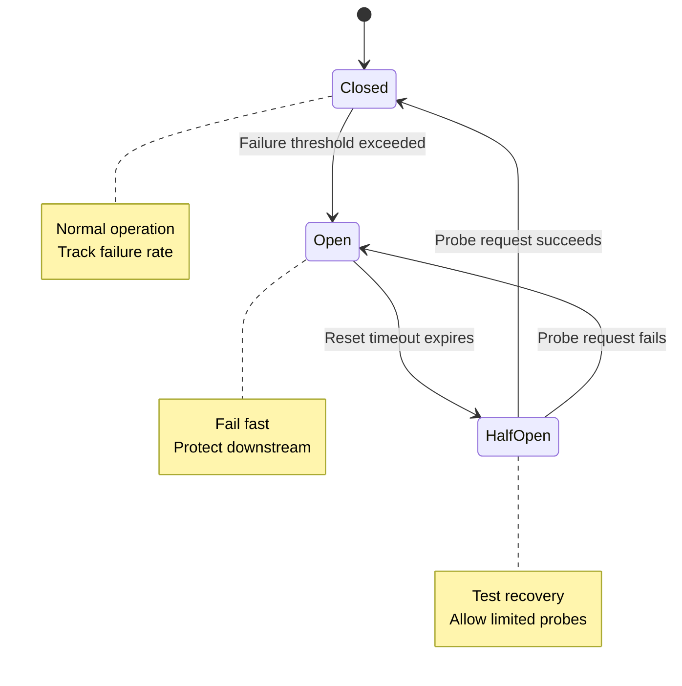

*[SRE]: Site Reliability Engineering
*[P99]: 99th Percentile
*[RPS]: Requests Per Second
*[QPS]: Queries Per Second

When a downstream service fails in a distributed system, the natural instinct is to retry.

That instinct will destroy your infrastructure.

I've seen this scenario play out more than once: a payment service starts responding slowly due to database connection pool exhaustion. Response times climb from 50ms to 2 seconds. Every upstream service has a 1-second timeout configured, so requests start timing out. Each caller retries 3 times. The payment service, already struggling with connection issues, now receives 4x the normal traffic. Its request queue grows to thousands. Response times climb to 30 seconds. The database, overwhelmed by connections that never close cleanly, starts rejecting all queries. What started as a 30-second database blip becomes a 2-hour cascading outage across the entire platform.

The root cause wasn't the database. It was the retry behavior.

Circuit breakers and retry budgets exist to break this cycle. A circuit breaker monitors failure rates and "opens" when a downstream service is unhealthy, failing requests immediately instead of adding load to a struggling service. A retry budget limits the total number of retries across all requests, preventing the exponential amplification that turns a minor issue into a major outage.

<Callout type="warning">
Retries without limits are a distributed denial-of-service attack against your own infrastructure. Every retry multiplies load on an already struggling service.
</Callout>

## The Cascade Failure Pattern

Understanding the mechanics of cascade failures requires tracing the path from initial symptom to system-wide collapse. The pattern is predictable, which means it's also preventable.

Consider a typical service chain: an API gateway calls a checkout service, which calls an inventory service, which queries a database. Each layer has timeouts and retry logic configured independently. Nobody coordinated these settings because each team was responsible for their own service.

The failure starts at the bottom. A database experiences momentary slowness—maybe a long-running query, maybe garbage collection, maybe a network hiccup. What happens next follows a predictable sequence:

```text
Timeline of a cascade failure:

T+0:    Database slow (100ms → 2s response time)
T+10s:  Service C queues grow, some requests timeout
T+20s:  Service B sees C timeouts, starts retrying
T+30s:  Service A sees B timeouts, starts retrying
T+45s:  All services at maximum queue depth
T+60s:  Database recovers, but services cannot—queues too deep
T+2min: Manual intervention required
T+5min: Services restarted, queues cleared
T+10min: Full recovery

Root cause: 30 second database slowdown
Actual outage: 10 minutes
Amplification factor: 20x
```
Figure: Timeline showing how a brief database slowdown cascades into a 10-minute outage.

The database recovered at T+60s, but the cascade continued for another 9 minutes. By the time the database was healthy, each upstream service had thousands of requests queued. Those queued requests kept hammering downstream services, preventing recovery. The system needed manual intervention—draining queues, restarting services—to return to normal operation.

### Retry Amplification

The math behind retry amplification is straightforward, and terrifying. Each service layer multiplies the load on the layer below it. If Service A retries 3 times, it sends 4 total requests (1 original + 3 retries) to Service B. If Service B also retries 3 times per request, each of those 4 requests generates 4 requests to Service C. The multiplication cascades down the stack.

The formula is simple: $(r + 1)^n$ where $r$ is retries per service and $n$ is the number of services in the chain. With 3 services each retrying 3 times, that's $4^3 = 64x$ load amplification.

| Services in Chain | Retries Each | Load Amplification |
|-------------------|--------------|-------------------|
| 2 | 3 | 16x |
| 3 | 3 | 64x |
| 4 | 3 | 256x |
| 3 | 5 | 216x |
| 4 | 5 | 1,296x |

Table: Load amplification from retries across service chains.

A database that can handle 10,000 QPS under normal operation suddenly receives 640,000 QPS during a cascade failure with 3 services and 3 retries each. No amount of scaling can absorb that. The only solution is to prevent the amplification from happening in the first place.

## Circuit Breakers

The circuit breaker pattern borrows its name from electrical engineering. When current exceeds safe levels, a breaker trips to protect the wiring. In software, when a downstream service starts failing, the circuit breaker "opens" to protect both the downstream service and your own application.

A circuit breaker has three states. In the _closed_ state, requests flow normally while the breaker monitors failure rates. When failures exceed a threshold, the breaker transitions to _open_. In the open state, all requests fail immediately without attempting to reach the downstream service—this is the "fail fast" behavior that prevents cascade failures. After a timeout, the breaker moves to _half-open_, where it allows a limited number of probe requests through. If those probes succeed, the circuit closes and normal operation resumes. If they fail, the circuit reopens.


Figure: Circuit breaker state machine with three states.

<Callout type="info">
The terminology is counterintuitive at first. "Closed" means requests flow through (the circuit is complete). "Open" means requests are blocked (the circuit is broken). This matches electrical terminology but feels backwards to most developers on first encounter.
</Callout>

## Implementation

There are three popular options for implementing circuit breakers, each with different tradeoffs. _Service meshes_ like Istio handle circuit breaking at the infrastructure layer—your application code stays simple while Envoy sidecars handle failure detection, but you lose per-endpoint granularity. _Application libraries_ like opossum (Node.js), resilience4j (Java), or gobreaker (Go) give you fine-grained control per endpoint, though you'll need to instrument each call site. _API gateways_ can implement basic circuit breaking at the edge, which works well for external traffic but doesn't help with service-to-service calls.

For most teams, I recommend starting with an application library for critical service calls. Here's a practical example using opossum:

```typescript title="paymentCircuitBreaker.ts"
import CircuitBreaker from 'opossum';

const fetchPayment = async (paymentId: string) => {
  const response = await fetch(`https://payments.internal/v1/${paymentId}`);
  if (!response.ok) throw new Error(`Payment service error: ${response.status}`);
  return response.json();
};

const paymentBreaker = new CircuitBreaker(fetchPayment, {
  timeout: 3000,                  // Fail if call takes longer than 3s
  errorThresholdPercentage: 50,   // Open if 50% of requests fail
  resetTimeout: 30000,            // Try again after 30s
  volumeThreshold: 10,            // Need 10 requests before evaluating
});

// Event handlers for observability
paymentBreaker.on('open', () => console.log('Payment circuit opened'));
paymentBreaker.on('halfOpen', () => console.log('Payment circuit half-open'));
paymentBreaker.on('close', () => console.log('Payment circuit closed'));

// Fallback when circuit is open
paymentBreaker.fallback(() => ({ status: 'unavailable', cached: true }));

// Usage
const payment = await paymentBreaker.fire('pay_12345');
```
Code: Circuit breaker implementation using opossum with fallback and observability hooks.

The `volumeThreshold` parameter prevents the circuit from opening on the first few failures. Without it, a service restart that fails its first request would immediately open the circuit.

An open circuit needs a fallback strategy. For read operations, serving cached data maintains a functional user experience. For optional features like recommendations, returning an empty response is better than breaking the entire page. For operations where hiding the failure would cause worse problems—like payment processing—fail fast and let the user know.

## Retry Budgets

Circuit breakers protect against sustained failures, but they don't address the retry amplification problem directly. A service can still overwhelm a downstream dependency with retries _before_ the circuit opens. Retry budgets solve this by limiting the total number of retries across all requests, not just per-request.

The concept is simple: instead of allowing every request to retry N times, you allow retries only up to a percentage of your recent successful requests. If you've had 1,000 successful requests and your budget is 10%, you can retry up to 100 times total. Once that budget is exhausted, new retries are rejected until more successes replenish the pool.

This creates a natural throttle. During normal operation when most requests succeed, the budget stays full and retries work as expected. During a failure, the budget depletes quickly because there are few successes to replenish it. The system automatically backs off without requiring manual intervention.

<Callout type="success">
Retry budgets are self-regulating: when failures increase, the budget depletes and retries stop; when the system recovers, successful requests replenish the budget. No manual intervention needed.
</Callout>

Here's a minimal implementation that tracks successes and limits retries accordingly:

```typescript title="retryBudget.ts"
class RetryBudget {
  private successes = 0;
  private retries = 0;
  private readonly budgetRatio: number;
  private readonly minRetriesPerSecond: number;

  constructor(budgetRatio = 0.1, minRetriesPerSecond = 10) {
    this.budgetRatio = budgetRatio;
    this.minRetriesPerSecond = minRetriesPerSecond;
  }

  recordSuccess(): void {
    this.successes++;
  }

  canRetry(): boolean {
    const budget = Math.max(
      this.successes * this.budgetRatio,
      this.minRetriesPerSecond
    );
    return this.retries < budget;
  }

  recordRetry(): void {
    this.retries++;
  }
}
```
Code: Retry budget implementation tracking successes and limiting retries to a percentage.

## Combining Circuit Breakers and Retry Budgets

Circuit breakers and retry budgets complement each other. The circuit breaker detects when a service is unhealthy and stops calling it entirely. The retry budget prevents overwhelming a service _before_ the circuit opens. Together, they provide layered protection.

The interaction works like this: requests first pass through the retry budget check, then through the circuit breaker. If the circuit is open, the request fails immediately. If the circuit is closed but the retry budget is exhausted, retries are blocked but the initial request still goes through. This ensures you don't completely stop calling a service just because you've used up your retry allowance.

<Callout type="tip">
Start with conservative settings: a 50% error threshold for circuit breakers and a 10% retry budget. You can always loosen these once you've observed real traffic patterns.
</Callout>

## What's Next

How do you tune circuit breaker thresholds without disrupting production? What observability do you need to debug circuit breaker behavior during an incident? How do service meshes like Istio and Linkerd handle these patterns differently? And what about the anti-patterns that can make your resilience mechanisms backfire—like retrying through an open circuit or setting identical timeouts across your service chain?

The real complexity isn't in understanding the patterns. It's in operating them at scale, coordinating settings across teams, and building the muscle memory to interpret circuit breaker telemetry during a 3 AM page.

---

**Ready to Master Cascade Failure Prevention?**

This article covered the essentials of circuit breakers and retry budgets, but there's much more to learn. Download our comprehensive guide for deep dives into fallback strategy implementation, Prometheus alerting configurations, service mesh integration patterns, anti-pattern avoidance, and real-world debugging checklists. Whether you're implementing these patterns for the first time or tuning an existing deployment, the extended guide provides the operational detail you need to build systems that fail gracefully under pressure.
