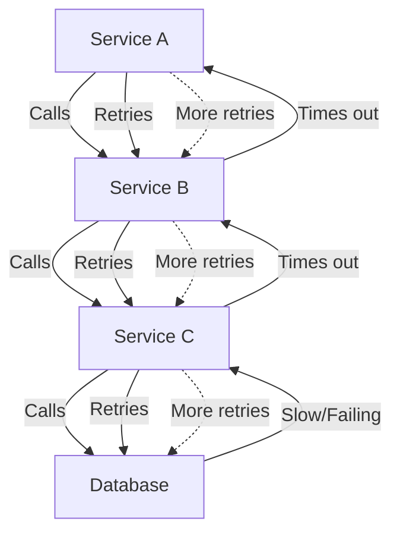
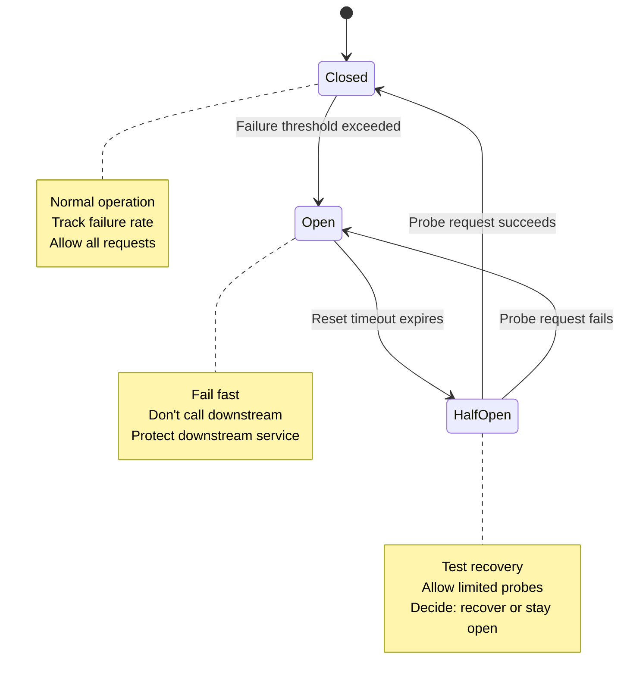
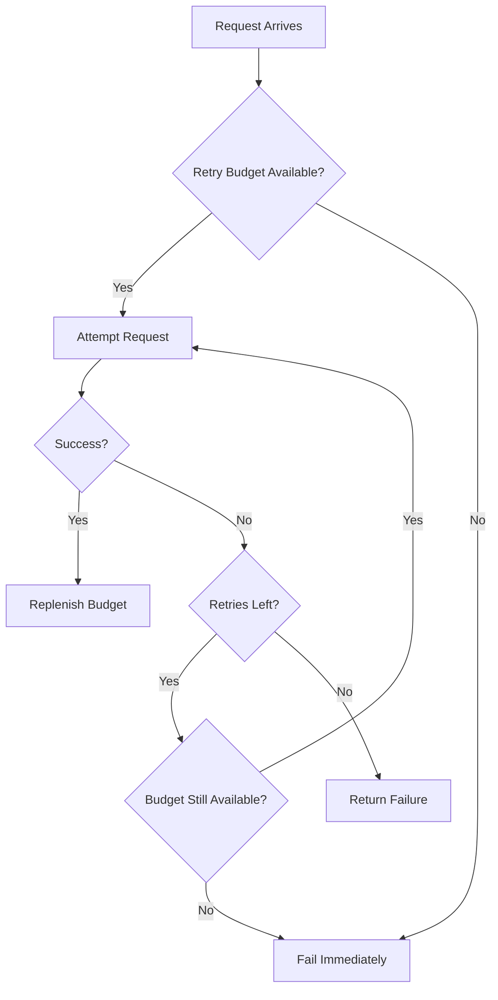
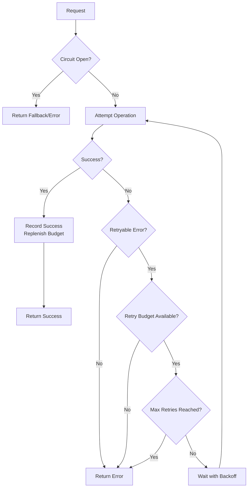

*[SRE]: Site Reliability Engineering
*[P99]: 99th Percentile Latency
*[RPS]: Requests Per Second
*[MTTR]: Mean Time To Recovery
*[QPS]: Queries Per Second

# Circuit Breakers and Retry Budgets in Practice

## Introduction

Brief overview of why distributed systems need protection mechanisms: when a downstream service fails, naive retry behavior amplifies the problem—every caller retries, creating a thundering herd that prevents recovery. This section frames circuit breakers and retry budgets as protection for both the caller and the callee.

_Include a real-world scenario: a payment service starts responding slowly due to database issues. Without circuit breakers, every upstream service retries aggressively, the payment service's request queue grows to thousands, response times climb to minutes, and a 30-second database blip becomes a 2-hour cascading outage._

<Callout type="warning">
Retries without limits are a distributed denial-of-service attack against your own infrastructure. Every retry multiplies load on an already struggling service.
</Callout>

## The Cascade Failure Pattern

### How Failures Cascade

Explain the mechanics of cascade failures in distributed systems.


Figure: Cascade failure pattern where retries amplify downstream problems.

```text
Timeline of a cascade failure:

T+0:    Database slow (100ms → 2s response time)
T+10s:  Service C queues grow, some requests timeout
T+20s:  Service B sees C timeouts, starts retrying
T+30s:  Service A sees B timeouts, starts retrying
T+45s:  All services at maximum queue depth
T+60s:  Database recovers, but services cannot—queues too deep
T+2min: Manual intervention required
T+5min: Services restarted, queues cleared
T+10min: Full recovery

Root cause: 30 second database slowdown
Actual outage: 10 minutes
Amplification factor: 20x
```

### The Retry Amplification Problem

Quantify how retries multiply load.

```typescript title="retry-amplification.ts"
interface RetryConfig {
  maxRetries: number;
  retryOn: string[];
}

function calculateAmplification(
  services: number,
  retriesPerService: number
): number {
  // Each service retries, creating exponential load
  // Service A retries 3 times to B
  // Each B request retries 3 times to C
  // Each C request retries 3 times to D

  return Math.pow(retriesPerService + 1, services);
}

// Example: 3 services, each retries 3 times
const amplification = calculateAmplification(3, 3);
// Result: 4^3 = 64x load amplification!

// With 5 retries per service:
const worseAmplification = calculateAmplification(3, 5);
// Result: 6^3 = 216x load amplification!
```
Code: Calculating retry amplification across service layers.

| Services in Chain | Retries Each | Load Amplification |
|-------------------|--------------|-------------------|
| 2 | 3 | 16x |
| 3 | 3 | 64x |
| 4 | 3 | 256x |
| 3 | 5 | 216x |
| 4 | 5 | 1,296x |

Table: Load amplification from retries across service chains.

<Callout type="danger">
A service chain with 4 hops and 5 retries each can amplify a single failure into 1,296 requests to the downstream service. This is why retry limits and circuit breakers are not optional—they are survival mechanisms.
</Callout>

## Circuit Breakers

### The Circuit Breaker Pattern

Explain the fundamental circuit breaker state machine.


Figure: Circuit breaker state machine with three states.

### Configuration Parameters

Detail the key configuration options and their effects.

```yaml title="circuit-breaker-config.yaml"
circuit_breaker:
  # When to open the circuit
  failure_threshold:
    type: "percentage"
    value: 50  # Open if >50% of requests fail
    window: "10s"  # In the last 10 seconds
    minimum_requests: 20  # Need at least 20 requests to evaluate

  # What counts as failure
  failure_conditions:
    - status_code: [500, 502, 503, 504]
    - timeout: true
    - exception_types: ["ConnectionError", "TimeoutError"]

  # How long to stay open
  open_duration: "30s"

  # Half-open behavior
  half_open:
    max_probes: 3  # Allow 3 test requests
    success_threshold: 2  # Need 2 successes to close

  # Optional: different settings per endpoint
  per_endpoint:
    "/api/critical":
      failure_threshold: 30  # More sensitive
      open_duration: "60s"  # Stay open longer
```
Code: Comprehensive circuit breaker configuration.

### Implementation

Provide a practical circuit breaker implementation.

```typescript title="circuit-breaker.ts"
enum CircuitState {
  CLOSED = 'closed',
  OPEN = 'open',
  HALF_OPEN = 'half_open',
}

interface CircuitBreakerConfig {
  failureThreshold: number;      // Percentage (0-100)
  minimumRequests: number;       // Min requests before evaluating
  windowDuration: number;        // Milliseconds
  openDuration: number;          // How long to stay open
  halfOpenMaxProbes: number;     // Probes allowed in half-open
  halfOpenSuccessThreshold: number;
}

interface RequestResult {
  timestamp: number;
  success: boolean;
}

class CircuitBreaker {
  private state: CircuitState = CircuitState.CLOSED;
  private results: RequestResult[] = [];
  private openedAt: number = 0;
  private halfOpenSuccesses: number = 0;
  private halfOpenFailures: number = 0;
  private halfOpenProbes: number = 0;

  constructor(
    private name: string,
    private config: CircuitBreakerConfig,
  ) {}

  async execute<T>(
    operation: () => Promise<T>,
    fallback?: () => T,
  ): Promise<T> {
    // Check if we should transition from open to half-open
    if (this.state === CircuitState.OPEN) {
      if (Date.now() - this.openedAt > this.config.openDuration) {
        this.transitionTo(CircuitState.HALF_OPEN);
      } else {
        return this.handleOpenCircuit(fallback);
      }
    }

    // In half-open, limit probes
    if (this.state === CircuitState.HALF_OPEN) {
      if (this.halfOpenProbes >= this.config.halfOpenMaxProbes) {
        return this.handleOpenCircuit(fallback);
      }
      this.halfOpenProbes++;
    }

    // Execute the operation
    try {
      const result = await operation();
      this.recordSuccess();
      return result;
    } catch (error) {
      this.recordFailure();
      throw error;
    }
  }

  private recordSuccess(): void {
    this.results.push({ timestamp: Date.now(), success: true });
    this.pruneOldResults();

    if (this.state === CircuitState.HALF_OPEN) {
      this.halfOpenSuccesses++;
      if (this.halfOpenSuccesses >= this.config.halfOpenSuccessThreshold) {
        this.transitionTo(CircuitState.CLOSED);
      }
    }
  }

  private recordFailure(): void {
    this.results.push({ timestamp: Date.now(), success: false });
    this.pruneOldResults();

    if (this.state === CircuitState.HALF_OPEN) {
      this.halfOpenFailures++;
      this.transitionTo(CircuitState.OPEN);
    } else if (this.state === CircuitState.CLOSED) {
      this.evaluateThreshold();
    }
  }

  private evaluateThreshold(): void {
    if (this.results.length < this.config.minimumRequests) {
      return; // Not enough data
    }

    const failures = this.results.filter(r => !r.success).length;
    const failureRate = (failures / this.results.length) * 100;

    if (failureRate > this.config.failureThreshold) {
      this.transitionTo(CircuitState.OPEN);
    }
  }

  private transitionTo(newState: CircuitState): void {
    console.log(`Circuit ${this.name}: ${this.state} → ${newState}`);
    this.state = newState;

    if (newState === CircuitState.OPEN) {
      this.openedAt = Date.now();
    } else if (newState === CircuitState.HALF_OPEN) {
      this.halfOpenSuccesses = 0;
      this.halfOpenFailures = 0;
      this.halfOpenProbes = 0;
    } else if (newState === CircuitState.CLOSED) {
      this.results = [];
    }
  }

  private handleOpenCircuit<T>(fallback?: () => T): T {
    if (fallback) {
      return fallback();
    }
    throw new CircuitOpenError(`Circuit ${this.name} is open`);
  }

  private pruneOldResults(): void {
    const cutoff = Date.now() - this.config.windowDuration;
    this.results = this.results.filter(r => r.timestamp > cutoff);
  }

  getState(): CircuitState {
    return this.state;
  }

  getMetrics(): object {
    const failures = this.results.filter(r => !r.success).length;
    return {
      state: this.state,
      totalRequests: this.results.length,
      failures,
      failureRate: this.results.length > 0
        ? (failures / this.results.length) * 100
        : 0,
    };
  }
}

class CircuitOpenError extends Error {
  constructor(message: string) {
    super(message);
    this.name = 'CircuitOpenError';
  }
}
```
Code: Complete circuit breaker implementation with all three states.

<Callout type="info">
The `minimumRequests` parameter prevents the circuit from opening on the first few failures. Without it, a service restart that fails its first request would immediately open the circuit.
</Callout>

### Fallback Strategies

Detail options for what to do when the circuit is open.

```typescript title="fallback-strategies.ts"
type FallbackStrategy<T> = () => T | Promise<T>;

const fallbackStrategies = {
  // Return cached data (stale but available)
  cachedResponse: <T>(cache: Map<string, T>, key: string): FallbackStrategy<T> => {
    return () => {
      const cached = cache.get(key);
      if (cached) return cached;
      throw new Error('No cached response available');
    };
  },

  // Return a default/empty response
  defaultResponse: <T>(defaultValue: T): FallbackStrategy<T> => {
    return () => defaultValue;
  },

  // Return degraded response with partial data
  degradedResponse: <T>(degradedFn: () => T): FallbackStrategy<T> => {
    return degradedFn;
  },

  // Fail fast with a clear error
  failFast: <T>(errorMessage: string): FallbackStrategy<T> => {
    return () => {
      throw new ServiceUnavailableError(errorMessage);
    };
  },

  // Queue for later processing
  queueForRetry: <T>(queue: Queue, request: any): FallbackStrategy<T> => {
    return async () => {
      await queue.add(request);
      return { queued: true } as unknown as T;
    };
  },
};

// Usage examples
const productCircuit = new CircuitBreaker('product-service', config);

// With cached fallback
const product = await productCircuit.execute(
  () => fetchProduct(id),
  fallbackStrategies.cachedResponse(productCache, id)
);

// With default fallback
const recommendations = await productCircuit.execute(
  () => fetchRecommendations(userId),
  fallbackStrategies.defaultResponse([])  // Empty array if unavailable
);
```
Code: Fallback strategy implementations for circuit breakers.

| Strategy | Use When | Tradeoff |
|----------|----------|----------|
| Cached response | Data can be stale | May serve outdated info |
| Default response | Feature is optional | Degraded user experience |
| Degraded response | Partial data is useful | Complex to implement |
| Fail fast | Failure must be visible | Poor user experience |
| Queue for retry | Operation can be async | Delayed processing |

Table: Fallback strategies with appropriate use cases.

## Retry Budgets

### What Is a Retry Budget

Explain retry budgets as a mechanism to limit retry amplification.

```text
Traditional Retries:
  Each request can retry up to N times
  Problem: Under failure, ALL requests retry
  Result: N+1 times the load

Retry Budget:
  Total retries limited to X% of successful requests
  Example: 10% retry budget
  If 1000 successful requests, allow 100 retries total

  Under failure: Budget depletes quickly
  Result: System stabilizes instead of amplifying
```


Figure: Retry budget decision flow.

### Implementing Retry Budgets

Provide a practical retry budget implementation.

```typescript title="retry-budget.ts"
interface RetryBudgetConfig {
  budgetPercentage: number;  // e.g., 10 = 10% of successes
  windowDuration: number;    // Time window in ms
  minBudget: number;         // Minimum retries always allowed
  maxBudget: number;         // Cap on total budget
}

class RetryBudget {
  private successes: number = 0;
  private retriesUsed: number = 0;
  private windowStart: number = Date.now();

  constructor(private config: RetryBudgetConfig) {}

  canRetry(): boolean {
    this.maybeResetWindow();
    return this.retriesUsed < this.calculateBudget();
  }

  useRetry(): boolean {
    if (!this.canRetry()) {
      return false;
    }
    this.retriesUsed++;
    return true;
  }

  recordSuccess(): void {
    this.maybeResetWindow();
    this.successes++;
  }

  private calculateBudget(): number {
    const calculatedBudget = Math.floor(
      this.successes * (this.config.budgetPercentage / 100)
    );

    return Math.min(
      this.config.maxBudget,
      Math.max(this.config.minBudget, calculatedBudget)
    );
  }

  private maybeResetWindow(): void {
    if (Date.now() - this.windowStart > this.config.windowDuration) {
      this.successes = 0;
      this.retriesUsed = 0;
      this.windowStart = Date.now();
    }
  }

  getMetrics(): object {
    return {
      successes: this.successes,
      retriesUsed: this.retriesUsed,
      budgetRemaining: this.calculateBudget() - this.retriesUsed,
      budgetPercentUsed: this.calculateBudget() > 0
        ? (this.retriesUsed / this.calculateBudget()) * 100
        : 0,
    };
  }
}
```
Code: Retry budget implementation with configurable percentage.

```yaml title="retry-budget-config.yaml"
retry_budget:
  # Budget as percentage of successful requests
  budget_percentage: 20  # Allow retries up to 20% of successes

  # Time window for calculating budget
  window_duration: "10s"

  # Always allow at least this many retries
  # (prevents budget starvation during startup)
  min_budget: 10

  # Never allow more than this many retries
  max_budget: 100

  # Per-service budgets
  services:
    payment_service:
      budget_percentage: 10  # More conservative for critical path
    recommendation_service:
      budget_percentage: 30  # More lenient for non-critical
```
Code: Retry budget configuration with per-service overrides.

<Callout type="success">
Retry budgets are self-regulating: when failures increase, the budget depletes and retries stop; when the system recovers, successful requests replenish the budget. No manual intervention needed.
</Callout>

### Combining Circuit Breakers and Retry Budgets

Show how to use both mechanisms together.

```typescript title="combined-protection.ts"
class ResilientClient {
  private circuitBreaker: CircuitBreaker;
  private retryBudget: RetryBudget;

  constructor(
    private serviceName: string,
    circuitConfig: CircuitBreakerConfig,
    budgetConfig: RetryBudgetConfig,
  ) {
    this.circuitBreaker = new CircuitBreaker(serviceName, circuitConfig);
    this.retryBudget = new RetryBudget(budgetConfig);
  }

  async call<T>(
    operation: () => Promise<T>,
    options: {
      maxRetries?: number;
      fallback?: () => T;
      retryableErrors?: string[];
    } = {}
  ): Promise<T> {
    const { maxRetries = 3, fallback, retryableErrors = [] } = options;

    let lastError: Error | null = null;
    let attempts = 0;

    while (attempts <= maxRetries) {
      // Check if retry is allowed (first attempt always allowed)
      if (attempts > 0) {
        if (!this.retryBudget.useRetry()) {
          console.log(`Retry budget exhausted for ${this.serviceName}`);
          break;
        }
      }

      attempts++;

      try {
        // Execute through circuit breaker
        const result = await this.circuitBreaker.execute(operation);
        this.retryBudget.recordSuccess();
        return result;
      } catch (error) {
        lastError = error as Error;

        // Don't retry circuit open errors
        if (error instanceof CircuitOpenError) {
          break;
        }

        // Check if error is retryable
        if (!this.isRetryable(error, retryableErrors)) {
          break;
        }

        // Add backoff between retries
        if (attempts <= maxRetries) {
          await this.backoff(attempts);
        }
      }
    }

    // All retries exhausted
    if (fallback) {
      return fallback();
    }

    throw lastError || new Error('Unknown error');
  }

  private isRetryable(error: any, retryableErrors: string[]): boolean {
    // Timeout errors are usually retryable
    if (error.code === 'ETIMEDOUT' || error.code === 'ECONNRESET') {
      return true;
    }

    // Check against configured retryable errors
    return retryableErrors.some(e => error.message.includes(e));
  }

  private async backoff(attempt: number): Promise<void> {
    const baseDelay = 100;
    const maxDelay = 5000;
    const jitter = Math.random() * 100;

    const delay = Math.min(
      maxDelay,
      baseDelay * Math.pow(2, attempt - 1) + jitter
    );

    await new Promise(resolve => setTimeout(resolve, delay));
  }
}
```
Code: Combined circuit breaker and retry budget client.


Figure: Combined circuit breaker and retry budget flow.

## Observability

### Essential Metrics

Define the metrics needed to understand circuit breaker behavior.

```yaml title="circuit-metrics.yaml"
metrics:
  # Circuit state
  circuit_state:
    type: gauge
    labels: [service, circuit_name]
    values: {closed: 0, half_open: 1, open: 2}

  # Request outcomes
  circuit_requests_total:
    type: counter
    labels: [service, circuit_name, result]
    # result: success, failure, rejected (circuit open)

  # State transitions
  circuit_state_changes_total:
    type: counter
    labels: [service, circuit_name, from_state, to_state]

  # Time in each state
  circuit_state_duration_seconds:
    type: histogram
    labels: [service, circuit_name, state]

  # Retry budget
  retry_budget_remaining:
    type: gauge
    labels: [service]

  retry_budget_exhausted_total:
    type: counter
    labels: [service]
```
Code: Essential circuit breaker and retry budget metrics.

### Dashboard Design

Describe how to visualize circuit breaker health.

```text
Circuit Breaker Dashboard Layout:

+------------------------------------------+
| CIRCUIT STATES                           |
| [Service A: CLOSED] [Service B: OPEN]    |
| [Service C: HALF_OPEN] [Service D: CLOSED]|
+------------------------------------------+
| STATE TRANSITIONS (24h)                  |
| Timeline showing open/closed transitions |
+------------------------------------------+
| FAILURE RATES BY SERVICE                 |
| Service A: 0.1%  ████░░░░░░              |
| Service B: 45%   ████████████████████░░  |
| Service C: 12%   ████████░░░░░░░░░░░░░░  |
+------------------------------------------+
| RETRY BUDGET UTILIZATION                 |
| Service A: 5%    ██░░░░░░░░░░            |
| Service B: 100%  ████████████████████████ |
| Service C: 35%   ██████████░░░░░░░░░░░░░ |
+------------------------------------------+
| REQUESTS REJECTED (Circuit Open)         |
| [Graph showing rejected requests/min]    |
+------------------------------------------+
```

```yaml title="alerting-rules.yaml"
alerts:
  - name: CircuitOpen
    condition: "circuit_state == 2"
    duration: "1m"
    severity: warning
    message: "Circuit {{ $labels.circuit_name }} is open"

  - name: CircuitFlapping
    condition: "increase(circuit_state_changes_total[5m]) > 10"
    severity: warning
    message: "Circuit {{ $labels.circuit_name }} is flapping"

  - name: RetryBudgetExhausted
    condition: "retry_budget_remaining == 0"
    duration: "1m"
    severity: warning
    message: "Retry budget exhausted for {{ $labels.service }}"

  - name: HighRejectionRate
    condition: >
      rate(circuit_requests_total{result="rejected"}[5m]) /
      rate(circuit_requests_total[5m]) > 0.1
    severity: critical
    message: "More than 10% of requests rejected by circuit breaker"
```
Code: Alerting rules for circuit breaker monitoring.

<Callout type="warning">
A circuit breaker that stays open for more than a few minutes indicates a real problem with the downstream service. Don't just alert on circuit open—investigate why recovery isn't happening.
</Callout>

### Debugging Circuit Issues

Provide guidance for troubleshooting circuit breaker problems.

```yaml title="debugging-checklist.yaml"
circuit_open_unexpectedly:
  checks:
    - question: "Is the threshold too sensitive?"
      action: "Review failure_threshold and minimum_requests"
    - question: "Are timeouts causing false failures?"
      action: "Check timeout settings vs actual response times"
    - question: "Is the window too short?"
      action: "Increase window_duration for bursty traffic"

circuit_not_opening:
  checks:
    - question: "Are failures being counted?"
      action: "Check failure_conditions configuration"
    - question: "Is minimum_requests too high?"
      action: "Lower minimum_requests for low-traffic services"
    - question: "Is the window too long?"
      action: "Decrease window_duration to detect failures faster"

circuit_not_closing:
  checks:
    - question: "Is downstream actually recovered?"
      action: "Check downstream service health directly"
    - question: "Are probe requests failing?"
      action: "Review half-open probe behavior"
    - question: "Is success_threshold too high?"
      action: "Reduce half_open.success_threshold"
```
Code: Circuit breaker debugging checklist.

## Common Patterns and Anti-Patterns

### Pattern: Per-Operation Circuits

Use separate circuits for different operation types.

```typescript title="per-operation-circuits.ts"
class UserServiceClient {
  private circuits: Map<string, CircuitBreaker> = new Map();

  constructor() {
    // Separate circuits for different operations
    this.circuits.set('getUser', new CircuitBreaker('user-service:getUser', {
      failureThreshold: 50,
      minimumRequests: 10,
      windowDuration: 10000,
      openDuration: 30000,
      halfOpenMaxProbes: 3,
      halfOpenSuccessThreshold: 2,
    }));

    this.circuits.set('updateUser', new CircuitBreaker('user-service:updateUser', {
      failureThreshold: 30,  // More sensitive for writes
      minimumRequests: 5,
      windowDuration: 10000,
      openDuration: 60000,   // Stay open longer for writes
      halfOpenMaxProbes: 2,
      halfOpenSuccessThreshold: 2,
    }));
  }

  async getUser(id: string): Promise<User> {
    return this.circuits.get('getUser')!.execute(
      () => this.fetchUser(id),
      () => this.getCachedUser(id)  // Fallback for reads
    );
  }

  async updateUser(id: string, data: Partial<User>): Promise<User> {
    return this.circuits.get('updateUser')!.execute(
      () => this.putUser(id, data)
      // No fallback for writes - fail explicitly
    );
  }
}
```
Code: Per-operation circuit breakers with different configurations.

### Anti-Pattern: Single Global Circuit

```yaml title="anti-pattern-global.yaml"
# BAD: Single circuit for entire service
circuit_breaker:
  name: "payment-service"  # Too broad!
  # Problem: One failing endpoint opens circuit for ALL endpoints
  # Healthy endpoints become unavailable too

# GOOD: Circuit per endpoint or operation type
circuit_breakers:
  - name: "payment-service:charge"
    # Charge operation has its own failure tracking
  - name: "payment-service:refund"
    # Refund can fail independently
  - name: "payment-service:status"
    # Read-only status checks isolated
```
Code: Anti-pattern of single global circuit vs. per-operation circuits.

### Pattern: Circuit Breaker with Bulkhead

Combine circuit breakers with bulkhead isolation.

```typescript title="circuit-with-bulkhead.ts"
interface BulkheadConfig {
  maxConcurrent: number;
  maxWaiting: number;
}

class BulkheadedCircuitBreaker {
  private circuitBreaker: CircuitBreaker;
  private semaphore: Semaphore;

  constructor(
    name: string,
    circuitConfig: CircuitBreakerConfig,
    bulkheadConfig: BulkheadConfig,
  ) {
    this.circuitBreaker = new CircuitBreaker(name, circuitConfig);
    this.semaphore = new Semaphore(
      bulkheadConfig.maxConcurrent,
      bulkheadConfig.maxWaiting
    );
  }

  async execute<T>(
    operation: () => Promise<T>,
    fallback?: () => T,
  ): Promise<T> {
    // First, try to acquire bulkhead permit
    const permit = await this.semaphore.acquire();

    if (!permit) {
      // Bulkhead full - fail fast
      if (fallback) return fallback();
      throw new BulkheadFullError();
    }

    try {
      // Then, execute through circuit breaker
      return await this.circuitBreaker.execute(operation, fallback);
    } finally {
      this.semaphore.release();
    }
  }
}
```
Code: Circuit breaker combined with bulkhead pattern.

<Callout type="success">
Combining circuit breakers with bulkheads provides defense in depth: the bulkhead limits concurrent requests to prevent resource exhaustion, while the circuit breaker stops requests when the downstream is failing.
</Callout>

## Library and Framework Support

### Popular Libraries

```yaml title="circuit-breaker-libraries.yaml"
libraries:
  javascript_typescript:
    - name: "opossum"
      url: "https://github.com/nodeshift/opossum"
      features: ["Circuit breaker", "Prometheus metrics", "Events"]

    - name: "cockatiel"
      url: "https://github.com/connor4312/cockatiel"
      features: ["Circuit breaker", "Retry", "Timeout", "Bulkhead"]

  java:
    - name: "resilience4j"
      url: "https://github.com/resilience4j/resilience4j"
      features: ["Circuit breaker", "Retry", "Rate limiter", "Bulkhead"]

  go:
    - name: "gobreaker"
      url: "https://github.com/sony/gobreaker"
      features: ["Simple circuit breaker"]

    - name: "hystrix-go"
      url: "https://github.com/afex/hystrix-go"
      features: ["Netflix Hystrix port"]

  service_mesh:
    - name: "Istio"
      features: ["Outlier detection (circuit breaking)", "Retry policies"]

    - name: "Linkerd"
      features: ["Circuit breaking", "Retry budgets"]
```
Code: Popular circuit breaker libraries across languages.

### Service Mesh Integration

```yaml title="istio-circuit-breaker.yaml"
# Istio DestinationRule for circuit breaking
apiVersion: networking.istio.io/v1beta1
kind: DestinationRule
metadata:
  name: payment-service
spec:
  host: payment-service
  trafficPolicy:
    connectionPool:
      tcp:
        maxConnections: 100
      http:
        h2UpgradePolicy: UPGRADE
        http1MaxPendingRequests: 100
        http2MaxRequests: 1000
        maxRequestsPerConnection: 10
        maxRetries: 3
    outlierDetection:
      consecutive5xxErrors: 5
      interval: 10s
      baseEjectionTime: 30s
      maxEjectionPercent: 50
      minHealthPercent: 30
```
Code: Istio circuit breaking with outlier detection.

## Conclusion

Summarize the key principles: circuit breakers protect both caller and callee from cascade failures; retry budgets prevent retry amplification; these mechanisms work together to maintain system stability; and observability is essential—a circuit breaker without monitoring is just a silent failure mode. Emphasize that the goal is graceful degradation, not perfect availability.

<Callout type="success">
Circuit breakers and retry budgets are not optional in distributed systems—they are survival mechanisms. A system without these protections will eventually experience cascade failure. Implement them early, monitor them closely, and tune them based on observed behavior.
</Callout>

---

## Cover Prompt

### Prompt 1: The Electrical Circuit Breaker

Create an image of a large industrial electrical circuit breaker panel with multiple breakers, some in the "ON" (closed) position, some tripped to "OFF" (open), and one in a middle testing position (half-open). LED indicators show system status. Style: industrial electrical equipment, clean technical illustration, blue and orange status lights, 16:9 aspect ratio.

### Prompt 2: The Cascading Dominoes Stopped

Design an image showing a line of dominoes where the first few have fallen (cascade failure), but a protective barrier (circuit breaker) has stopped the cascade, leaving the remaining dominoes standing. The stopped section glows with protection. Style: dramatic domino visualization, clear cause-and-effect, red fallen dominoes, blue protected dominoes, 16:9 aspect ratio.

### Prompt 3: The Traffic Control System

Illustrate a highway interchange with smart traffic signals. Some routes are open (green), some are closed due to congestion (red), and some are in testing mode (yellow). Traffic flows smoothly around the closed routes. Style: aerial view traffic management, clean lines, green/yellow/red indicators, modern city aesthetic, 16:9 aspect ratio.

### Prompt 4: The Budget Meter

Create an image of a stylized fuel gauge or budget meter labeled "Retry Budget." The needle shows partial depletion. As the meter empties, requests are diverted away. A replenishment pipe (successful requests) feeds back into the meter. Style: dashboard gauge aesthetic, analog meets digital, green full zone to red empty zone, 16:9 aspect ratio.

### Prompt 5: The Firebreak

Design an image showing a forest fire (cascade failure) being stopped by a firebreak (circuit breaker). The protected side of the forest is lush and healthy, while the contained fire burns on the other side. Firefighters monitor the break. Style: dramatic landscape illustration, warm fire colors contrasting with cool greens, 16:9 aspect ratio.
