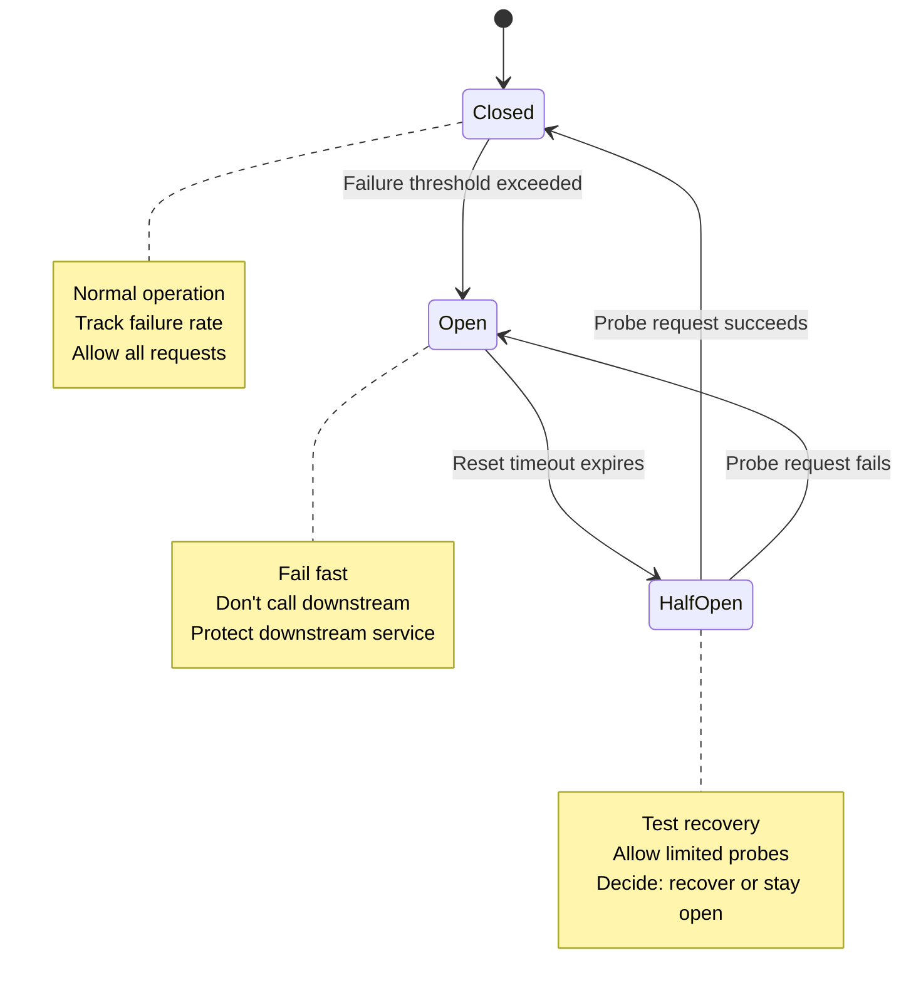

*[SRE]: Site Reliability Engineering
*[P99]: 99th Percentile
*[RPS]: Requests Per Second
*[MTTR]: Mean Time To Recovery
*[QPS]: Queries Per Second

## Introduction

When a downstream service fails in a distributed system, the natural instinct is to retry. And that instinct will destroy your infrastructure.

Here's a scenario I've seen play out more than once: a payment service starts responding slowly due to database connection pool exhaustion. Response times climb from 50ms to 2 seconds. Every upstream service has a 1-second timeout configured, so requests start timing out. Each caller retries 3 times. The payment service, already struggling with connection issues, now receives 4x the normal traffic. Its request queue grows to thousands. Response times climb to 30 seconds. The database, overwhelmed by connections that never close cleanly, starts rejecting all queries. What started as a 30-second database blip becomes a 2-hour cascading outage across the entire platform.

The root cause wasn't the database. It was the retry behavior.

Circuit breakers and retry budgets exist to break this cycle. A circuit breaker monitors failure rates and "opens" when a downstream service is unhealthy, failing requests immediately instead of adding load to a struggling service. A retry budget limits the total number of retries across all requests, preventing the exponential amplification that turns a minor issue into a major outage.

These aren't nice-to-have resilience patterns. They're survival mechanisms for any system with service dependencies.

<Callout type="warning">
Retries without limits are a distributed denial-of-service attack against your own infrastructure. Every retry multiplies load on an already struggling service.
</Callout>

## The Cascade Failure Pattern

### How Failures Cascade

Understanding the mechanics of cascade failures requires tracing the path from initial symptom to system-wide collapse. The pattern is predictable, which means it's also preventable.

Consider a typical service chain: an API gateway calls a checkout service, which calls an inventory service, which queries a database. Each layer has timeouts and retry logic configured independently. Nobody coordinated these settings because each team was responsible for their own service.

The failure starts at the bottom. A database experiences momentary slowness—maybe a long-running query, maybe garbage collection, maybe a network hiccup. What happens next follows a depressingly predictable sequence:

```text
Timeline of a cascade failure:

T+0:    Database slow (100ms → 2s response time)
T+10s:  Service C queues grow, some requests timeout
T+20s:  Service B sees C timeouts, starts retrying
T+30s:  Service A sees B timeouts, starts retrying
T+45s:  All services at maximum queue depth
T+60s:  Database recovers, but services cannot—queues too deep
T+2min: Manual intervention required
T+5min: Services restarted, queues cleared
T+10min: Full recovery

Root cause: 30 second database slowdown
Actual outage: 10 minutes
Amplification factor: 20x
```

The database recovered at T+60s, but the cascade continued for another 9 minutes. By the time the database was healthy, each upstream service had thousands of requests queued. Those queued requests kept hammering downstream services, preventing recovery. The system needed manual intervention—draining queues, restarting services—to return to normal operation.

### The Retry Amplification Problem

The math behind retry amplification is straightforward, and terrifying. Each service layer multiplies the load on the layer below it. If Service A retries 3 times, it sends 4 total requests (1 original + 3 retries) to Service B. If Service B also retries 3 times per request, each of those 4 requests generates 4 requests to Service C. The multiplication cascades down the stack.

The formula is simple: $(r + 1)^n$ where $r$ is retries per service and $n$ is the number of services in the chain. With 3 services each retrying 3 times, that's $4^3 = 64x$ load amplification. Bump the retries to 5 and you get $6^3 = 216x$.

The table below shows how quickly this gets out of hand. These numbers assume every request at every layer fails and triggers full retries—a worst case, but exactly what happens during a cascade failure:

| Services in Chain | Retries Each | Load Amplification |
|-------------------|--------------|-------------------|
| 2 | 3 | 16x |
| 3 | 3 | 64x |
| 4 | 3 | 256x |
| 3 | 5 | 216x |
| 4 | 5 | 1,296x |

Table: Load amplification from retries across service chains.

A database that can handle 10,000 QPS under normal operation suddenly receives 640,000 QPS during a cascade failure with 3 services and 3 retries each (64x amplification). No amount of scaling can absorb that. The only solution is to prevent the amplification from happening in the first place.

<Callout type="danger">
A service chain with 4 hops and 5 retries each can amplify a single failure into 1,296 requests to the downstream service. This is why retry limits and circuit breakers are not optional—they are survival mechanisms.
</Callout>

## Circuit Breakers

### The Circuit Breaker Pattern

The circuit breaker pattern borrows its name from electrical engineering. When current exceeds safe levels, a breaker trips to protect the wiring. In software, when a downstream service starts failing, the circuit breaker "opens" to protect both the downstream service and your own application.

A circuit breaker has three states. In the _closed_ state, requests flow normally while the breaker monitors failure rates. When failures exceed a threshold, the breaker transitions to _open_. In the open state, all requests fail immediately without attempting to reach the downstream service—this is the "fail fast" behavior that prevents cascade failures. After a timeout, the breaker moves to _half-open_, where it allows a limited number of probe requests through. If those probes succeed, the circuit closes and normal operation resumes. If they fail, the circuit reopens.


Figure: Circuit breaker state machine with three states.

The terminology is counterintuitive at first. "Closed" means requests flow through (the circuit is complete). "Open" means requests are blocked (the circuit is broken). This matches electrical terminology but feels backwards to most developers on first encounter.

### Configuration Parameters

Getting circuit breaker configuration right requires understanding your service's normal behavior. Set thresholds too low and you'll trip on normal variance. Set them too high and the breaker won't protect you when you need it. In a service mesh, this typically lives in an Istio `DestinationRule` that configures Envoy's outlier detection and connection pool limits.

```yaml title="istio-destinationrule-circuit-breaker.yaml"
# Istio `DestinationRule` using Envoy outlier detection
apiVersion: networking.istio.io/v1beta1
kind: DestinationRule
metadata:
  name: payments-circuit-breaker
spec:
  host: payments.default.svc.cluster.local
  trafficPolicy:
    outlierDetection:
      consecutive5xxErrors: 5
      interval: 10s
      baseEjectionTime: 30s
      maxEjectionPercent: 50
    connectionPool:
      tcp:
        maxConnections: 100
      http:
        http1MaxPendingRequests: 100
        maxRequestsPerConnection: 1000
```
Code: Comprehensive circuit breaker configuration

`outlierDetection` is the closest mesh analogue to a circuit breaker. `consecutive5xxErrors` and `interval` define the failure threshold window; when the threshold is exceeded, Envoy ejects unhealthy endpoints for `baseEjectionTime`. `maxEjectionPercent` keeps you from ejecting every instance at once.

`connectionPool` settings act as a second guardrail by preventing unbounded concurrency and queue growth. In practice, you tune these two sections together: outlier detection prevents bad instances from taking traffic, while connection limits prevent good instances from being flooded.

### Implementation

There are three popular options for implementing circuit breakers, each with different tradeoffs.

1. __Service mesh__ (like the Istio `DestinationRule` above) handles circuit breaking at the infrastructure layer. Your application code stays simple—it just makes HTTP calls—while Envoy sidecars handle failure detection and traffic shifting. The downside is complexity: you need a mesh deployed, and debugging "why didn't my request go through" now involves understanding Envoy configs and mesh telemetry. Service meshes work best when you want consistent resilience policies across many services without modifying application code.

2. __Application libraries__ like opossum (Node.js), resilience4j (Java), or gobreaker (Go) give you fine-grained control. You can configure different thresholds per endpoint, implement custom fallback logic, and emit metrics that tie directly to your application's business logic. The tradeoff is that every service needs to implement and configure the library correctly—there's no centralized policy enforcement.

3. __API gateways__ and load balancers (AWS ALB, Kong, NGINX) can implement basic circuit breaking at the edge. This protects your backend from external traffic surges but doesn't help with service-to-service calls within your infrastructure.

For most teams, I recommend starting with an application library for critical service calls, then layering in mesh-level circuit breaking as your infrastructure matures. Here's a practical example using opossum:

```typescript title="opossum-circuit-breaker.ts"
import CircuitBreaker from 'opossum';

const fetchPayment = async (paymentId: string) => {
  const response = await fetch(`https://payments.internal/v1/${paymentId}`);
  if (!response.ok) throw new Error(`Payment service error: ${response.status}`);
  return response.json();
};

const paymentBreaker = new CircuitBreaker(fetchPayment, {
  timeout: 3000,           // Fail if call takes longer than 3s
  errorThresholdPercentage: 50,  // Open if 50% of requests fail
  resetTimeout: 30000,     // Try again after 30s
  volumeThreshold: 10,     // Need 10 requests before evaluating
});

// Event handlers for observability
paymentBreaker.on('open', () => console.log('Payment circuit opened'));
paymentBreaker.on('halfOpen', () => console.log('Payment circuit half-open'));
paymentBreaker.on('close', () => console.log('Payment circuit closed'));

// Fallback when circuit is open
paymentBreaker.fallback(() => ({ status: 'unavailable', cached: true }));

// Usage
const payment = await paymentBreaker.fire('pay_12345');
```
Code: Circuit breaker implementation using opossum with fallback and observability hooks.

<Callout type="info">
The `volumeThreshold` parameter prevents the circuit from opening on the first few failures. Without it, a service restart that fails its first request would immediately open the circuit. Similarly, opossum's `rollingCountBuckets` controls how many probe requests are allowed in half-open state before deciding whether to close the circuit.
</Callout>

### Fallback Strategies

An open circuit needs to do _something_ with incoming requests. The right fallback strategy depends on what the downstream service provides and how critical it is to your user experience.

```typescript title="fallback-strategies.ts"
type FallbackStrategy<T> = () => T | Promise<T>;
interface FallbackStrategies {
  cachedResponse<T>(cache: Map<string, T>, key: string): FallbackStrategy<T>;
  defaultResponse<T>(defaultValue: T): FallbackStrategy<T>;
  degradedResponse<T>(degradedFn: () => T): FallbackStrategy<T>;
  failFast<T>(errorMessage: string): FallbackStrategy<T>;
  queueForRetry<T>(queue: Queue, request: unknown): FallbackStrategy<T>;
}

// Usage example (implementation omitted)
const productCircuit = new CircuitBreaker('product-service', config);
const fallbackStrategies: FallbackStrategies = fallbackImplementations;

const product = await productCircuit.execute(
  () => fetchProduct(id),
  fallbackStrategies.cachedResponse(productCache, id)
);

const recommendations = await productCircuit.execute(
  () => fetchRecommendations(userId),
  fallbackStrategies.defaultResponse([])
);
```
Code: Fallback strategy implementations for circuit breakers.

| Strategy | Use When | Tradeoff |
|----------|----------|----------|
| Cached response | Data can be stale | May serve outdated info |
| Default response | Feature is optional | Degraded user experience |
| Degraded response | Partial data is useful | Complex to implement |
| Fail fast | Failure must be visible | Poor user experience |
| Queue for retry | Operation can be async | Delayed processing |

Table: Fallback strategies with appropriate use cases.

The cached response strategy is usually the best choice for read operations—users would rather see slightly stale data than an error page. For recommendations, product listings, or user profiles, serving cached data during an outage maintains a functional user experience.

Default responses work well for optional features. If your recommendation engine is down, showing an empty "Recommended for you" section is better than breaking the entire page. The user might not even notice.

Fail fast is appropriate when hiding the failure would cause worse problems downstream. Payment processing is the classic example: you don't want to tell a user their payment succeeded when you actually couldn't reach the payment service.

## Retry Budgets

### What Is a Retry Budget

Circuit breakers protect against sustained failures, but they don't address the retry amplification problem directly. A service can still overwhelm a downstream dependency with retries before the circuit opens. Retry budgets solve this by limiting the _total_ number of retries across all requests, not just per-request.

The concept is simple: instead of allowing every request to retry N times, you allow retries only up to a percentage of your recent successful requests. If you've had 1,000 successful requests and your budget is 10%, you can retry up to 100 times total. Once that budget is exhausted, new retries are rejected until more successes replenish the pool.

__Traditional Retries:__

- Each request can retry up to N times
- Problem: Under failure, ALL requests retry
- Result: N+1 times the load

__Retry Budget:__

- Total retries limited to X% of successful requests
- Example: 10% retry budget
- If 1000 successful requests, allow 100 retries total

__Under failure:__

- Budget depletes quickly
- Result: System stabilizes instead of amplifying

This creates a natural throttle. During normal operation when most requests succeed, the budget stays full and retries work as expected. During a failure, the budget depletes quickly because there are few successes to replenish it. The system automatically backs off without requiring manual intervention.

### Implementing Retry Budgets

Retry budgets aren't as widely supported by libraries as circuit breakers, so you may need to implement one. The core logic tracks successes and retries over a rolling time window:

```typescript title="retry-budget.ts"
type RetryBudget = {
  canRetry: () => boolean;
  useRetry: () => boolean;
  recordSuccess: () => void;
};

const createRetryBudget = (
  budgetPercentage: number,
  windowDurationMs: number,
  minBudget: number,
  maxBudget: number,
): RetryBudget => {
  let successes = 0;
  let retriesUsed = 0;
  let windowStart = Date.now();

  const resetWindowIfNeeded = () => {
    if (Date.now() - windowStart > windowDurationMs) {
      successes = 0;
      retriesUsed = 0;
      windowStart = Date.now();
    }
  };

  const calculateBudget = () => {
    const calculated = Math.floor(successes * (budgetPercentage / 100));
    return Math.min(maxBudget, Math.max(minBudget, calculated));
  };

  return {
    canRetry: () => {
      resetWindowIfNeeded();
      return retriesUsed < calculateBudget();
    },
    useRetry: () => {
      resetWindowIfNeeded();
      if (retriesUsed >= calculateBudget()) return false;
      retriesUsed += 1;
      return true;
    },
    recordSuccess: () => {
      resetWindowIfNeeded();
      successes += 1;
    },
  };
};
```
Code: Lightweight retry budget helper for application code.

The `minBudget` parameter is important: it ensures you always have _some_ retry capacity, even during startup when you haven't accumulated successes yet. Without it, a cold service would have zero retry budget until it starts succeeding.

<Callout type="success">
Retry budgets are self-regulating: when failures increase, the budget depletes and retries stop; when the system recovers, successful requests replenish the budget. No manual intervention needed.
</Callout>

### Combining Circuit Breakers and Retry Budgets

Circuit breakers and retry budgets complement each other. The circuit breaker detects when a service is unhealthy and stops calling it entirely. The retry budget prevents overwhelming a service _before_ the circuit opens. Together, they provide layered protection.

The interaction works like this: requests first pass through the retry budget check, then through the circuit breaker. If the circuit is open, the request fails immediately. If the circuit is closed but the retry budget is exhausted, retries are blocked but the initial request still goes through. This ensures you don't completely stop calling a service just because you've used up your retry allowance.

```typescript title="combined-protection.ts"
import CircuitBreaker from 'opossum';

const retryBudget = createRetryBudget(10, 10_000, 5, 100);

const fetchInventory = async (sku: string) => {
  const response = await fetch(`https://inventory.internal/v1/${sku}`);
  if (!response.ok) throw new Error(`Inventory error: ${response.status}`);
  return response.json();
};

const inventoryBreaker = new CircuitBreaker(fetchInventory, {
  timeout: 2000,
  errorThresholdPercentage: 50,
  resetTimeout: 30_000,
  volumeThreshold: 10,
});

const callWithBudget = async (sku: string, maxRetries = 2) => {
  let attempts = 0;

  while (attempts <= maxRetries) {
    if (attempts > 0 && !retryBudget.useRetry()) break;
    attempts += 1;

    try {
      const result = await inventoryBreaker.fire(sku);
      retryBudget.recordSuccess();
      return result;
    } catch (error) {
      if (inventoryBreaker.opened) break;
      if (attempts > maxRetries) throw error;
      // Exponential backoff with jitter to prevent thundering herd
      const backoff = 100 * Math.pow(2, attempts);
      const jitter = Math.random() * backoff * 0.5;
      await new Promise(resolve => setTimeout(resolve, backoff + jitter));
    }
  }

  throw new Error('Retry budget exhausted');
};
```
Code: opossum circuit breaker with a retry budget gate.

## Observability

### Essential Metrics

A circuit breaker without metrics is a black box. You won't know it's saving your system until you look at the logs after an incident—and by then you've lost the opportunity to learn from real-time behavior. Instrument these metrics from day one.

```typescript title="circuit-metrics.ts"
// Prometheus metrics for circuit breaker observability (using prom-client)
import { Counter, Gauge, Histogram } from 'prom-client';

// Circuit state: 0 = closed, 1 = half_open, 2 = open
const circuitState = new Gauge({
  name: 'circuit_state',
  help: 'Current circuit breaker state',
  labelNames: ['service', 'circuit_name'],
});

// Request outcomes by result type
const circuitRequests = new Counter({
  name: 'circuit_requests_total',
  help: 'Total requests through circuit breaker',
  labelNames: ['service', 'circuit_name', 'result'],  // success, failure, rejected
});

// State transitions for flap detection
const stateChanges = new Counter({
  name: 'circuit_state_changes_total',
  help: 'Circuit breaker state transitions',
  labelNames: ['service', 'circuit_name', 'from_state', 'to_state'],
});

// Retry budget tracking
const retryBudgetRemaining = new Gauge({
  name: 'retry_budget_remaining',
  help: 'Remaining retry budget',
  labelNames: ['service'],
});
```
Code: Prometheus metrics for circuit breaker observability using prom-client.

The `circuit_state` gauge tells you at a glance which circuits are open. The `circuit_requests_total` counter with the `result` label lets you calculate rejection rates. State transition counters help you spot _flapping_ circuits. A flapping circuit opens and closes repeatedly in rapid succession—usually indicating a threshold that's too sensitive or a downstream service hovering at the edge of failure. If you see more than a few state transitions per minute, investigate before it becomes a real outage.

### Dashboard Design

Your circuit breaker dashboard should answer three questions at a glance: which circuits are open, why did they open, and how much traffic is being rejected?

```text
+------------------------------------------+
| CIRCUIT STATES                           |
| [Service A: CLOSED] [Service B: OPEN]    |
| [Service C: HALF_OPEN] [Service D: CLOSED]|
+------------------------------------------+
| STATE TRANSITIONS (24h)                  |
| Timeline showing open/closed transitions |
+------------------------------------------+
| FAILURE RATES BY SERVICE                 |
| Service A: 0.1%  ████░░░░░░              |
| Service B: 45%   ████████████████████░░  |
| Service C: 12%   ████████░░░░░░░░░░░░░░  |
+------------------------------------------+
| RETRY BUDGET UTILIZATION                 |
| Service A: 5%    ██░░░░░░░░░░            |
| Service B: 100%  ████████████████████████ |
| Service C: 35%   ██████████░░░░░░░░░░░░░ |
+------------------------------------------+
| REQUESTS REJECTED (Circuit Open)         |
| [Graph showing rejected requests/min]    |
+------------------------------------------+
```
Code: Circuit Breaker Dashboard Layout

The state transition timeline is particularly useful for post-incident analysis. You can correlate circuit opens with deployment events, traffic spikes, or downstream service issues. A circuit that opened 30 seconds after a deploy is telling you something different than one that opened during peak traffic.

Alert on circuit state changes, not just open circuits. A circuit that flaps repeatedly indicates a misconfigured threshold or a service hovering at the edge of failure—both worth investigating before they cause real problems.

```yaml title="circuit-alerts.yaml"
# Prometheus alerting rule for circuit breaker state
groups:
  - name: circuit_breaker_alerts
    rules:
      - alert: CircuitBreakerOpen
        expr: circuit_state == 2
        for: 1m
        labels:
          severity: warning
        annotations:
          summary: "Circuit {{ $labels.circuit_name }} is open"
          description: "Circuit breaker for {{ $labels.service }} has been open for more than 1 minute."
```
Code: Prometheus alerting rule that fires when a circuit stays open.

The Alertmanager config below routes these alerts to the appropriate receivers:

```yaml title="alertmanager-config.yaml"
global:
  resolve_timeout: 5m

route:
  group_by: [service, circuit_name]
  group_wait: 30s
  group_interval: 5m
  repeat_interval: 2h
  receiver: oncall
  routes:
    - matchers:
        - severity="critical"
      receiver: pager
    - matchers:
        - severity="warning"
      receiver: oncall

receivers:
  - name: oncall
    slack_configs:
      - channel: "#sre-alerts"
        send_resolved: true
        title: "{{ .CommonLabels.alertname }}"
        text: "{{ .CommonAnnotations.summary }}"

  - name: pager
    pagerduty_configs:
      - routing_key: "${PAGERDUTY_ROUTING_KEY}"
        severity: "critical"

inhibit_rules:
  - source_matchers:
      - alertname="CircuitOpen"
      - severity="critical"
    target_matchers:
      - alertname="HighRejectionRate"
    equal: [service, circuit_name]
```
Code: Alertmanager configuration for circuit breaker alerts.

<Callout type="warning">
A circuit breaker that stays open for more than a few minutes indicates a real problem with the downstream service. Don't just alert on circuit open—investigate why recovery isn't happening.
</Callout>

### Debugging Circuit Issues

When a circuit isn't behaving as expected, the problem usually falls into one of three categories: opening too easily, not opening when it should, or not closing after the downstream recovers.

__Circuit opens unexpectedly:__

| Cause | Remediation |
|-------|-------------|
| Threshold too sensitive | Review `failure_threshold` and `minimum_requests` |
| Timeouts causing false failures | Compare timeout settings to actual P99 response times |
| Window too short | Increase `window_duration` for bursty traffic patterns |

__Circuit not opening:__

| Cause | Remediation |
|-------|-------------|
| Failures not counted | Verify `failure_conditions` includes the error types you expect |
| `minimum_requests` too high | Lower it for low-traffic services |
| Window too long | Decrease `window_duration` to detect failures faster |

__Circuit not closing:__

| Cause | Remediation |
|-------|-------------|
| Downstream not actually recovered | Verify downstream health directly, outside the breaker |
| Probe requests failing | Review half-open probe behavior and endpoint health |
| `success_threshold` too high | Reduce `half_open.success_threshold` |

The most common issue I see is timeouts configured lower than actual P99 latency. The service responds successfully, but the circuit breaker counts it as a failure because the response arrived after the timeout. Check your latency histograms before setting timeout thresholds.

## Common Patterns and Anti-Patterns

### Pattern: Per-Operation Circuits

A single circuit breaker per service is rarely the right granularity. Different operations have different failure modes, different latency profiles, and different criticality. A service's health check endpoint shouldn't share a circuit with its payment processing endpoint—if health checks start timing out, you don't want to stop processing payments that are working fine.

```typescript title="per-operation-circuits.ts"
const readBreaker = new CircuitBreaker(fetchUser, {
  timeout: 2000,
  errorThresholdPercentage: 50,
  resetTimeout: 30_000,
  volumeThreshold: 20,
});
readBreaker.fallback(() => cache.get(userId));

const writeBreaker = new CircuitBreaker(updateUser, {
  timeout: 5000,
  errorThresholdPercentage: 25,  // More sensitive
  resetTimeout: 60_000,          // Stay open longer
  volumeThreshold: 10,
});
// No fallback for writes—fail explicitly
```
Code: Separate circuits for reads and writes with different thresholds.

Per-operation circuits let you tune thresholds appropriately. Read operations can tolerate higher failure rates because you can serve cached data. Write operations need tighter thresholds because there's no safe fallback—you can't pretend a payment succeeded. Status endpoints might need very aggressive timeouts since they're typically fast, while batch operations might need longer windows.

The tradeoff is complexity. More circuits mean more configuration to maintain, more metrics to monitor, and more dashboards to watch. For a service with dozens of endpoints, per-operation circuits become unwieldy. The sweet spot is usually per-operation-type: one circuit for reads, one for writes, one for batch jobs, and maybe separate circuits for particularly critical or problematic endpoints.

### Anti-Pattern: Retrying Through an Open Circuit

A common mistake is wrapping a circuit breaker call in retry logic without checking circuit state first. When the circuit is open, every retry attempt fails immediately—which is the intended behavior—but you're still burning CPU cycles and cluttering logs with failures you know will happen.

```typescript title="retry-with-circuit-check.ts"
const callWithRetry = async (fn: () => Promise<unknown>, maxRetries = 3) => {
  for (let attempt = 0; attempt < maxRetries; attempt++) {
    // Don't retry if circuit is open
    if (paymentBreaker.opened) {
      return paymentFallback();
    }

    try {
      return await paymentBreaker.fire(fn);
    } catch (error) {
      if (attempt === maxRetries - 1) throw error;
      // Exponential backoff with jitter
      const backoff = 100 * Math.pow(2, attempt);
      const jitter = Math.random() * backoff * 0.5;
      await new Promise(r => setTimeout(r, backoff + jitter));
    }
  }
};
```
Code: Check circuit state before retrying to avoid wasted attempts.

Check circuit state before retrying. If the circuit is open, fail immediately or invoke your fallback. Only retry when the circuit is closed or half-open.

### Pattern: Circuit Breaker with Bulkhead

The term _bulkhead_ comes from shipbuilding. Ships are divided into watertight compartments so that a hull breach in one section doesn't flood the entire vessel. In software, a bulkhead isolates failures by limiting how many concurrent requests can flow to a particular dependency.

Circuit breakers and bulkheads solve different problems. A circuit breaker detects when a downstream service is failing and stops sending requests. A bulkhead limits how many requests you send in the first place, preventing a slow dependency from consuming all your threads or connections. Without a bulkhead, a service that starts responding slowly can exhaust your connection pool—every request waits for a timeout, and eventually you have no capacity left for anything else.

Combining them provides defense in depth. The bulkhead prevents resource exhaustion during slowdowns. The circuit breaker stops traffic entirely during outages. Together, they handle both "slow" and "down" failure modes.

```typescript title="bulkhead-example.ts"
// Limit concurrent calls to inventory service
const inventoryBulkhead = new Semaphore(50);  // Max 50 concurrent

const fetchInventory = async (sku: string) => {
  const permit = await inventoryBulkhead.tryAcquire(100);  // 100ms wait max
  if (!permit) {
    throw new BulkheadFullError('Inventory service overwhelmed');
  }

  try {
    return await inventoryBreaker.fire(() => inventoryClient.get(sku));
  } finally {
    inventoryBulkhead.release();
  }
};
```
Code: Bulkhead limiting concurrent requests before circuit breaker evaluation.

In practice, bulkheads are often implemented at the connection pool level. If your HTTP client limits connections per host, that's a bulkhead. The explicit semaphore pattern above is useful when you need finer control—different limits for different operation types, or limits that don't map cleanly to connection pools.

### Anti-Pattern: Identical Timeouts Across Layers

When every service in a call chain uses the same timeout value, you get cascading timeouts that amplify failures. Service A calls B with a 5-second timeout. B calls C with a 5-second timeout. If C takes 4 seconds, B's call succeeds—but A might have already timed out at 5 seconds total, even though the underlying operation eventually completed.

Timeouts should decrease as you go down the call stack. If A has a 10-second timeout, B should use 5 seconds, and C should use 2 seconds. This gives each layer time to handle failures gracefully rather than racing against the clock.

```text
// BAD: Identical timeouts
A (timeout: 5s) → B (timeout: 5s) → C (timeout: 5s)
// C takes 4s, B returns at 4s, but A times out at 5s total

// GOOD: Decreasing timeouts
A (timeout: 10s) → B (timeout: 5s) → C (timeout: 2s)
// Each layer has headroom for retries and error handling
```

<Callout type="warning">
Coordinate timeout budgets across your service chain. If you don't control all services in the chain, at minimum ensure your timeout is longer than the timeout of services you call. In gRPC systems, consider propagating deadlines via metadata headers so downstream services know how much time remains and can fail fast if the budget is already exhausted.
</Callout>

## Library and Framework Support

### Popular Libraries

Most languages have mature circuit breaker implementations. The choice usually comes down to whether you want a focused library that does one thing well, or a comprehensive resilience toolkit.

__JavaScript/TypeScript:__ _opossum_ is the most popular choice for Node.js. It provides a straightforward circuit breaker with built-in Prometheus metrics, event hooks for observability, and a clean promise-based API. The examples in this article use opossum. For more comprehensive needs, _cockatiel_ bundles circuit breakers with retries, timeouts, bulkheads, and fallbacks in a single package with good TypeScript support.

__Java:__ _resilience4j_ is the successor to Netflix Hystrix (now in maintenance mode). It's designed for Java 8+ with functional programming patterns and integrates well with Spring Boot. Beyond circuit breakers, it includes rate limiters, bulkheads, retries, and time limiters—all composable. If you're on the JVM and need resilience patterns, resilience4j is the default choice.

__Go:__ _gobreaker_ from Sony is minimal and focused—just a circuit breaker, nothing else. It's easy to understand and integrate. If you need more features, _hystrix-go_ ports Netflix's Hystrix patterns to Go, though it's less actively maintained than gobreaker.

__Python:__ _pybreaker_ provides a simple circuit breaker implementation. For async Python, _aiobreaker_ offers the same patterns for asyncio-based applications.

### Service Mesh Integration

Service meshes like Istio and Linkerd implement circuit breaking at the infrastructure layer, outside your application code. The mesh's sidecar proxy (Envoy in Istio's case) intercepts all network traffic and applies resilience policies transparently.

The appeal is consistency without code changes. You define circuit breaker policies in configuration, and they apply uniformly across all services in the mesh—regardless of language or framework. Teams don't need to remember to add circuit breaker libraries, configure them correctly, or keep versions aligned.

Linkerd takes a different approach than Istio. Rather than Envoy's outlier detection (which ejects unhealthy endpoints), Linkerd uses _failure accrual_—tracking consecutive failures per endpoint and temporarily marking endpoints as dead. Linkerd also has native retry budget support, making it a natural fit for the patterns in this article.

```yaml title="linkerd-service-profile.yaml"
# Linkerd ServiceProfile with retry budget
apiVersion: linkerd.io/v1alpha2
kind: ServiceProfile
metadata:
  name: payment-service.default.svc.cluster.local
  namespace: default
spec:
  routes:
    - name: POST /v1/payments
      condition:
        method: POST
        pathRegex: /v1/payments
      isRetryable: true
      timeout: 5s
  retryBudget:
    retryRatio: 0.2          # Allow retries up to 20% of successful requests
    minRetriesPerSecond: 10  # Always allow at least 10 retries/sec
    ttl: 10s                 # Window for tracking retry ratio
```
Code: Linkerd ServiceProfile with built-in retry budget support.

The tradeoff is operational complexity. Debugging "why didn't my request go through" now requires understanding mesh configuration, Envoy's outlier detection semantics, and mesh-level telemetry. Circuit breaker behavior is less visible in application logs because it happens in the sidecar. And mesh-level circuit breakers operate on connection and request metrics, not application-level semantics—they can't distinguish between a failed payment and a successful refund if both return HTTP 200.

For most teams, I recommend starting with application-level circuit breakers for critical paths where you need fine-grained control and custom fallbacks. Layer in mesh-level policies for baseline protection across all services, especially for newer or less critical services where implementing library-based circuit breakers isn't yet justified.

## Conclusion

Circuit breakers and retry budgets address two sides of the same problem. Circuit breakers detect when a downstream service is unhealthy and stop sending it traffic—protecting both the downstream from additional load and your own service from wasting resources on requests that will fail. Retry budgets prevent the amplification effect that turns a minor issue into a catastrophic one by limiting total retries across all requests, not just per-request.

These mechanisms work together. The retry budget prevents overwhelming a service _before_ the circuit opens. The circuit breaker stops traffic _after_ sustained failures are detected. Neither alone is sufficient: circuit breakers without retry budgets still allow amplification during the detection window, and retry budgets without circuit breakers still send initial requests to a service that's clearly down.

The goal isn't perfect availability—it's graceful degradation. When a dependency fails, your service should continue operating in a reduced capacity rather than collapsing entirely. Cached responses, default values, and degraded experiences are all preferable to error pages or timeouts that propagate up the stack.

Observability makes the difference between "it worked" and "I understand how it worked." A circuit breaker that opens silently is better than none, but a circuit breaker with metrics, dashboards, and alerts lets you tune thresholds, correlate failures with deployments, and catch problems before users notice. Instrument from day one.

<Callout type="success">
Start with your most critical downstream dependency. Add a circuit breaker with opossum or resilience4j this week. Instrument the metrics. Watch how it behaves under normal load. Then expand to other dependencies. The best time to implement these patterns is before your first cascade failure, not after.
</Callout>
