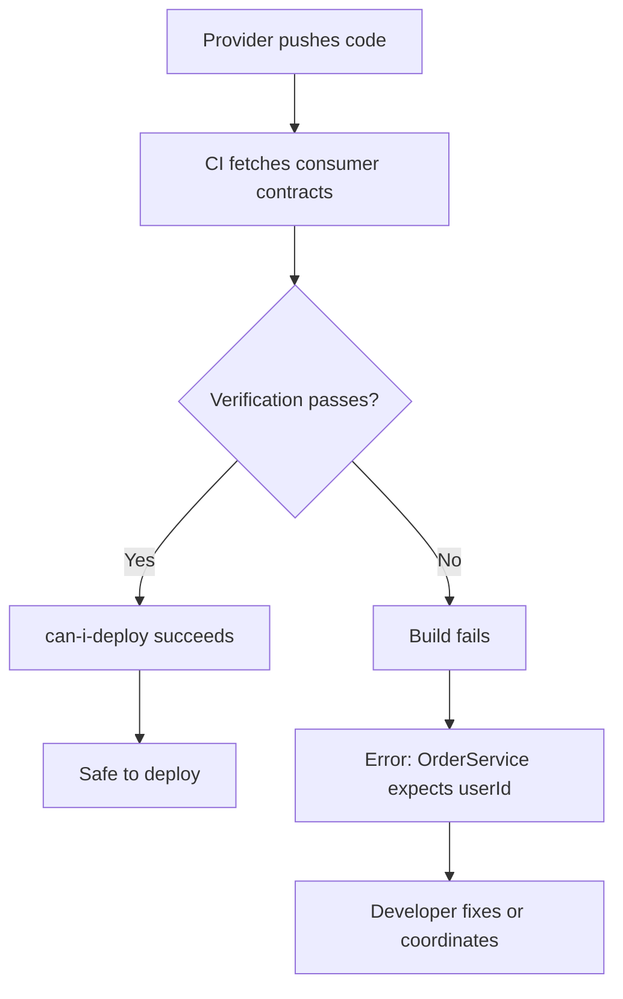

A User Service team ships what they consider a minor change: renaming `userId` to `user_id` in their response payload to match their new coding standards. They updated their OpenAPI spec. They ran their own tests. Everything passed.

Three services broke in production that Friday.

The Order Service, Shipping Service, and Analytics Service all consumed that field. Nobody had checked with them. The deployment happened on a Friday afternoon. The on-call engineer spent the weekend coordinating rollbacks and emergency patches.

This scenario plays out constantly in microservice architectures. The instinctive response is to add more integration tests. If Service A calling Service B fails in production, write a test that spins up both services and verifies the call works.

That instinct is wrong. Integration tests won't save you here. Consumer-driven contracts will.

## The Integration Test Trap

Integration tests require _all_ services to be running simultaneously. For a simple three-service chain, that means coordinating databases, message queues, and network connectivity across all three. Add a fourth service, and the coordination overhead grows. By the time you have 20 services, the "integration test environment" has become a full-time job for someone on the platform team.

The problems compound quickly. Shared test databases accumulate garbage data from previous runs, causing tests to fail for reasons unrelated to the code change. Port conflicts appear when two developers run tests simultaneously. Network timeouts introduce flakiness that erodes trust in the test suite. Developers stop running integration tests locally because they take too long, pushing the feedback loop to CI where it's even slower.

When an integration test fails, debugging becomes archaeology. A failure in Service X might be caused by a change in Service Y, but the stack trace only shows where the exception was thrown, not where the problem originated. Reproducing the failure locally requires spinning up the entire environment, which often behaves differently than CI.

| Testing Approach | Speed | Reliability | Isolation | Catches Breaking Changes |
|------------------|-------|-------------|-----------|-------------------------|
| Unit tests | Fast | High | Complete | No (mocks hide reality) |
| Integration tests | Slow | Low | None | Yes (in staging/prod) |
| E2E tests | Very slow | Very low | None | Yes (in production-like) |
| Contract tests | Fast | High | Complete | Yes (at PR time) |

Table: Comparison of testing approaches for API compatibility.

The fundamental problem is that integration tests conflate two concerns: verifying that your code works correctly, and verifying that your code is compatible with its dependencies. Unit tests verify correctness. Contract tests verify compatibility. Neither requires spinning up the entire world.

Teams often try to solve the compatibility problem with documentation instead. "We'll maintain an OpenAPI spec, and consumers will code against it." This works for about three months. The spec was written when the API was first built. Six months later, someone refactored the response format. They updated the code, ran the tests, and shipped. The OpenAPI spec stayed frozen because updating it was "on the backlog."

<Callout type="warning">
Documentation without enforcement is fiction. Schemas describe intent; contract tests verify reality.
</Callout>

## How Consumer-Driven Contracts Work

Traditional API testing puts the provider in charge. The provider defines a schema, publishes documentation, and consumers build against it. If the provider changes the API, consumers find out when their code breaks—often in production.

Consumer-driven contracts invert this model. The _consumer_ defines what it needs from the provider and encodes those expectations in a contract. The provider then verifies it can satisfy that contract. Both sides test against the same artifact, so compatibility is verified before either side deploys.

<Callout type="info">
Pact is the most widely-used contract testing framework, with libraries for JavaScript, Java, Python, Go, and more. The Pact Broker is a separate service that stores contracts and tracks verification results across all your services.
</Callout>

```mermaid
sequenceDiagram
    participant C as Consumer
    participant B as Pact Broker
    participant P as Provider

    C->>C: Write consumer test
    C->>C: Test generates contract
    C->>B: Publish contract
    P->>B: Fetch contracts
    P->>P: Replay against real API
    P->>B: Publish verification results
    B->>B: Track compatibility matrix
Figure: Contract testing workflow showing consumer-first approach.

Here's what this looks like in practice. A consumer test defines the expected request and response for an API call:

```typescript title="user-api.pact.spec.ts"
import { PactV3, MatchersV3 } from '@pact-foundation/pact';
tags: ["apis-and-gateways", "docker", "kubernetes", "typescript", "python", "go", "ruby", "dotnet"]
// like() matches type/structure, not exact values—keeps contracts flexible

const provider = new PactV3({
  consumer: 'OrderService',
  provider: 'UserService',
});

describe('User API Contract', () => {
  it('returns user details for valid ID', async () => {
    await provider
      .given('user 123 exists')
      .uponReceiving('a request for user 123')
      .withRequest({
        method: 'GET',
        path: '/users/123',
      })
      .willRespondWith({
        status: 200,
        body: {
          userId: like('123'),
          email: like('user@example.com'),
        },
      })
      // Pact spins up a mock server; consumer tests run against it
      .executeTest(async (mockServer) => {
        const client = new UserApiClient(mockServer.url);
        const user = await client.getUser('123');
        expect(user.userId).toBeDefined();
      });
  });
});
```
Code: Consumer contract test defining expected API behavior.

Notice the `like()` matcher wrapping values. The contract tests _structure_, not exact values. The consumer expects a `userId` field containing a string, but doesn't care if it's "123" or "abc-456". This loose matching keeps contracts maintainable—they verify the shape of responses without becoming brittle assertions on test data.

When this test runs, Pact spins up a mock server that returns the expected response. The consumer's actual API client code runs against this mock, validating that the client correctly handles the response format. Pact then generates a JSON contract file capturing the interaction.

That contract gets published to a Pact Broker, where the provider fetches it and replays the requests against its real implementation. If the provider's response doesn't match the expected structure, the provider's build fails—before deployment, before it reaches any consumer.

The contract becomes a living artifact that both sides test against. Consumers can't expect something they haven't declared. Providers can't break something they've verified they support.

## The Deployment Safety Net

Contracts alone don't prevent bad deployments. The real power comes from tracking which versions are compatible and blocking deployments that would break compatibility.

The Pact Broker maintains a matrix of every consumer version, every provider version, and whether they've been verified as compatible. The `can-i-deploy` command queries this matrix before any deployment:

```bash
# Before deploying UserService v2.3.1 to production
pact-broker can-i-deploy \
  --pacticipant UserService \
  --version 2.3.1 \
  --to-environment production
```

This command answers: "If I deploy UserService v2.3.1 to production, will it break any consumer that's currently deployed there?" Not "probably," not "I think so"—a definitive yes or no based on actual verification results.

When a provider makes an incompatible change, they discover it immediately. The provider's CI runs verification against all consumer contracts, and any contract violation fails the build with a clear message identifying which consumer would break and why.


Figure: Contract violation detected at PR time, not production.

This is the fundamental shift: from discovering API incompatibilities in staging (or worse, production) to catching them at PR time. The provider team doesn't need to manually coordinate with every consumer team. They don't need to check a wiki or ask in Slack. The contracts encode what consumers actually use, and CI enforces compatibility automatically.

The deployment safety isn't theoretical. When the UserService team tries to rename `userId` to `user_id`, their build fails immediately. The error message tells them exactly which services would break: OrderService, ShippingService, and AnalyticsService all expect `userId`. They can make an informed decision—coordinate with those teams, version the API, or reconsider the change entirely—before any code reaches production.

<Callout type="info">
The `can-i-deploy` command moves deployment decisions from "hope and pray" to "verified compatibility." Your CI pipeline becomes the enforcement mechanism, not late-night Slack messages.
</Callout>

## Where to Go From Here

Contract testing fills the gap between fast unit tests and slow integration tests. It catches the specific category of bugs that matter most in distributed systems: API incompatibilities between services that only manifest when deployed together.

The approach requires some organizational shift. Consumer teams must write contracts that capture their actual dependencies. Provider teams must run verification as part of their CI pipeline. Both sides must publish results to a shared broker. But the payoff is substantial: confident deployments without coordinating across every team, without maintaining heavyweight test environments, and without discovering breaks in production.

The `userId` incident that opened this article? With contract testing in place, it becomes a failed PR instead of a weekend incident. The build breaks, the developer sees which consumers would be affected, and they make an informed choice about how to proceed. That's the difference between integration tests and contracts: one tells you something broke, the other tells you before you break it.

---

**Go Deeper: The Complete Guide to Contract Testing**

This article covers the core concepts, but implementing contract testing across your organization involves more decisions: setting up the Pact Broker, writing effective matchers, managing provider states, integrating with CI/CD pipelines, and scaling across dozens of services. Our comprehensive guide walks through each step with production-ready examples, including Docker Compose configurations, GitHub Actions workflows, and strategies for handling the edge cases that trip up most teams. Download the full guide to get your contract testing implementation right the first time.
