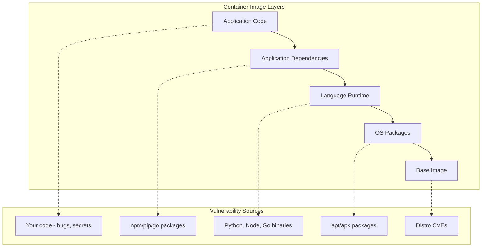
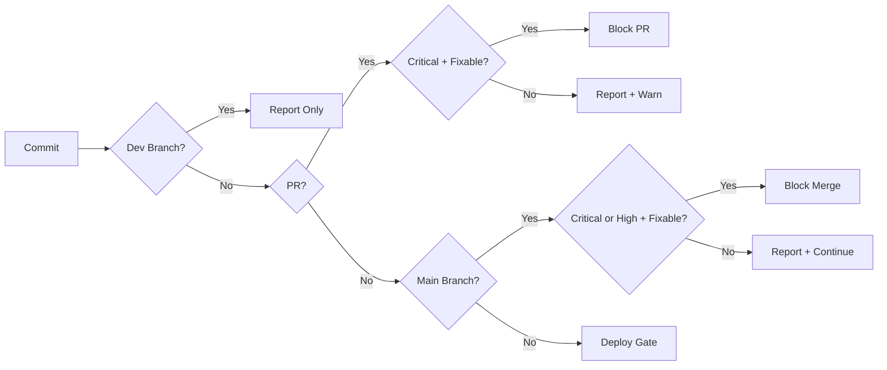
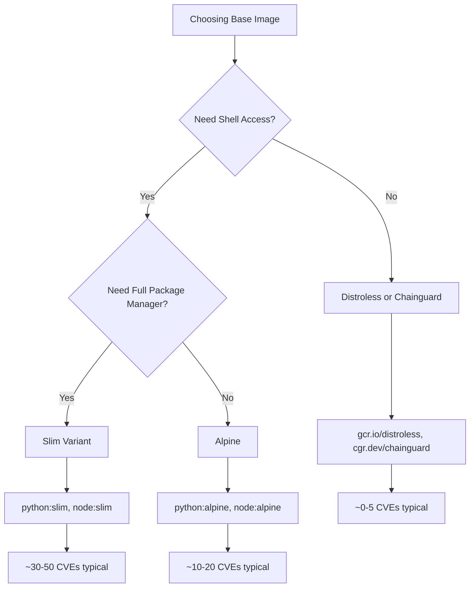
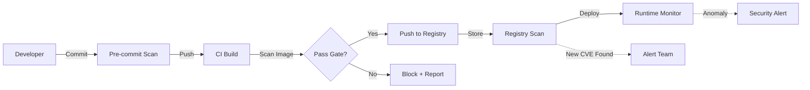
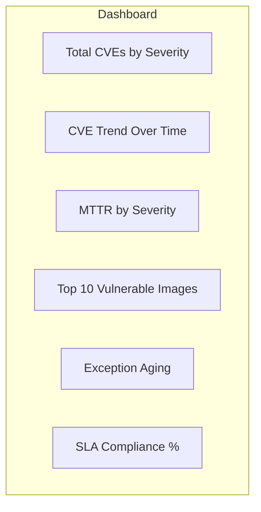

*[CVE]: Common Vulnerabilities and Exposures
*[CVSS]: Common Vulnerability Scoring System
*[SBOM]: Software Bill of Materials
*[CI]: Continuous Integration
*[CD]: Continuous Deployment
*[OCI]: Open Container Initiative
*[NVD]: National Vulnerability Database
*[SCA]: Software Composition Analysis

# Shift-Left Security: Container Scanning in CI

## Introduction

Brief overview of the shift-left security philosophy: finding vulnerabilities early in development costs less to fix than finding them in production. This section frames container scanning as a critical gate in CI pipelines, but acknowledges the practical challenge—scanners that block every build become noise that developers ignore or bypass.

_Include a real scenario: a team enables container scanning and immediately faces 47 critical vulnerabilities. Half are in base image packages the application never uses, a quarter have no available fix, and the rest require major version bumps. The team disables scanning "temporarily" and never re-enables it._

<Callout type="warning">
The goal isn't zero vulnerabilities—it's actionable findings. A scanner that reports 200 unfixable CVEs teaches developers to ignore all security alerts.
</Callout>

## Understanding Container Vulnerabilities

### Where Vulnerabilities Hide

Explain the layers of a container image and where vulnerabilities can exist.


Figure: Container image layers and corresponding vulnerability sources.

```text
Vulnerability Distribution (typical Node.js app):

Layer                  | % of CVEs | Fixable by Developer
-----------------------|-----------|---------------------
Application code       | 5%        | Yes
npm dependencies       | 35%       | Partially (transitive)
Node.js runtime        | 10%       | Base image choice
OS packages (apt)      | 40%       | Base image choice
Base image (Debian)    | 10%       | Base image choice

Key insight: 60% of vulnerabilities are in layers
developers don't directly control.
```

### CVE Scoring and Severity

Explain CVSS scores and why they're insufficient for prioritization.

```yaml title="cvss-scores.yaml"
cvss_severity_levels:
  critical:
    score_range: "9.0 - 10.0"
    example: "Remote code execution, no auth required"

  high:
    score_range: "7.0 - 8.9"
    example: "Privilege escalation, auth required"

  medium:
    score_range: "4.0 - 6.9"
    example: "Information disclosure, specific conditions"

  low:
    score_range: "0.1 - 3.9"
    example: "Minor info leak, local access required"

why_cvss_is_insufficient:
  - "Doesn't consider your specific context"
  - "A critical CVE in unused code is not critical for you"
  - "Network exposure matters - internal vs public"
  - "Exploit availability changes risk profile"
  - "Some criticals have been critical for years with no exploits"
```
Code: CVSS severity levels and their limitations.

| CVSS Score | NVD Severity | Your Priority | Reason |
|------------|--------------|---------------|--------|
| 9.8 | Critical | Maybe High | Is the vulnerable function called? |
| 9.5 | Critical | Low | Package not used at runtime |
| 7.2 | High | Critical | Actively exploited in the wild |
| 6.5 | Medium | High | Exposed on public internet |
| 4.0 | Medium | None | Internal tool, no network access |

Table: CVSS scores vs contextual priority.

<Callout type="info">
CVSS measures theoretical severity; your priority should consider exploitability, exposure, and whether the vulnerable code path is reachable in your application.
</Callout>

### Types of Findings

Categorize what scanners detect.

```yaml title="finding-types.yaml"
finding_categories:
  os_package_vulnerabilities:
    source: "apt, apk, yum packages in base image"
    example: "CVE-2023-1234 in libssl"
    fix: "Update base image or specific package"

  language_dependency_vulnerabilities:
    source: "npm, pip, go modules, Maven"
    example: "CVE-2023-5678 in lodash@4.17.20"
    fix: "Update dependency in package.json/requirements.txt"

  configuration_issues:
    source: "Dockerfile best practices"
    example: "Running as root, exposed secrets"
    fix: "Modify Dockerfile"

  secrets_and_credentials:
    source: "Hardcoded passwords, API keys, certificates"
    example: "AWS_SECRET_ACCESS_KEY in environment"
    fix: "Use secrets management"

  malware_and_backdoors:
    source: "Compromised packages, supply chain attacks"
    example: "event-stream incident"
    fix: "Remove malicious package, audit dependencies"
```
Code: Categories of security findings in container scans.

## Scanner Selection

### Popular Scanner Comparison

Compare major container scanning tools.

```yaml title="scanner-comparison.yaml"
open_source:
  trivy:
    vendor: "Aqua Security"
    strengths:
      - "Fast, single binary"
      - "OS + language deps + secrets + IaC"
      - "Excellent CI integration"
      - "SBOM generation"
    weaknesses:
      - "Can be noisy without tuning"
    license: "Apache 2.0"

  grype:
    vendor: "Anchore"
    strengths:
      - "Fast, focused on container images"
      - "Pairs with Syft for SBOM"
      - "Good accuracy"
    weaknesses:
      - "Less feature-rich than Trivy"
    license: "Apache 2.0"

  clair:
    vendor: "Red Hat/Quay"
    strengths:
      - "Battle-tested in Quay registry"
      - "Static analysis focus"
    weaknesses:
      - "Complex setup"
      - "Slower than alternatives"
    license: "Apache 2.0"

commercial:
  snyk:
    strengths:
      - "Excellent developer experience"
      - "Fix PRs and prioritization"
      - "IDE integration"
    weaknesses:
      - "Cost at scale"

  aqua:
    strengths:
      - "Runtime protection"
      - "Policy engine"
      - "Enterprise features"
    weaknesses:
      - "Enterprise pricing"
```
Code: Container scanner comparison.

| Scanner | Speed | Coverage | CI Integration | Cost |
|---------|-------|----------|----------------|------|
| Trivy | Fast | OS, Lang, Secrets, IaC | Excellent | Free |
| Grype | Fast | OS, Lang | Good | Free |
| Clair | Moderate | OS | Moderate | Free |
| Snyk | Moderate | OS, Lang, Code | Excellent | Paid |
| Aqua | Moderate | Full stack | Excellent | Paid |

Table: Scanner comparison by key criteria.

<Callout type="success">
Trivy has become the de facto open-source choice for CI/CD scanning due to its speed, breadth of coverage, and zero-config startup. Start there unless you have specific requirements.
</Callout>

### Running Trivy in CI

Provide practical Trivy integration examples.

```yaml title="trivy-github-actions.yaml"
# .github/workflows/security-scan.yaml
name: Security Scan

on:
  push:
    branches: [main]
  pull_request:

jobs:
  trivy-scan:
    runs-on: ubuntu-latest
    steps:
      - uses: actions/checkout@v4

      - name: Build image
        run: docker build -t myapp:${{ github.sha }} .

      - name: Run Trivy vulnerability scanner
        uses: aquasecurity/trivy-action@master
        with:
          image-ref: 'myapp:${{ github.sha }}'
          format: 'sarif'
          output: 'trivy-results.sarif'
          severity: 'CRITICAL,HIGH'
          # Don't fail on vulnerabilities yet - we'll gate separately
          exit-code: '0'

      - name: Upload Trivy scan results
        uses: github/codeql-action/upload-sarif@v3
        with:
          sarif_file: 'trivy-results.sarif'

      - name: Trivy gate check
        uses: aquasecurity/trivy-action@master
        with:
          image-ref: 'myapp:${{ github.sha }}'
          severity: 'CRITICAL'
          ignore-unfixed: true
          # Only fail on fixable critical vulnerabilities
          exit-code: '1'
```
Code: GitHub Actions workflow with Trivy scanning.

```yaml title="trivy-gitlab-ci.yaml"
# .gitlab-ci.yml
stages:
  - build
  - security
  - deploy

build:
  stage: build
  script:
    - docker build -t $CI_REGISTRY_IMAGE:$CI_COMMIT_SHA .
    - docker push $CI_REGISTRY_IMAGE:$CI_COMMIT_SHA

container_scan:
  stage: security
  image:
    name: aquasec/trivy:latest
    entrypoint: [""]
  script:
    - trivy image
        --exit-code 0
        --severity CRITICAL,HIGH
        --format json
        --output trivy-report.json
        $CI_REGISTRY_IMAGE:$CI_COMMIT_SHA
    # Separate gate check
    - trivy image
        --exit-code 1
        --severity CRITICAL
        --ignore-unfixed
        $CI_REGISTRY_IMAGE:$CI_COMMIT_SHA
  artifacts:
    reports:
      container_scanning: trivy-report.json
    paths:
      - trivy-report.json
```
Code: GitLab CI pipeline with Trivy scanning.

## Policy Configuration

### Defining Security Gates

Explain how to configure policies that balance security and velocity.

```yaml title="trivy-policy.yaml"
# .trivy.yaml - Trivy configuration
severity:
  - CRITICAL
  - HIGH

# Ignore unfixed vulnerabilities - nothing developer can do
ignore-unfixed: true

# Skip specific vulnerability types
skip-dirs:
  - test/
  - docs/

# Custom ignore file for acknowledged risks
ignorefile: .trivyignore

# Timeout for slow scans
timeout: 10m

# Output format for CI
format: table

# Exit codes
exit-code: 1  # Fail on findings
```
Code: Trivy configuration file for CI.

```text title=".trivyignore"
# .trivyignore - Vulnerabilities to skip

# CVE in test dependency, not shipped to production
CVE-2023-12345

# Disputed CVE, vendor says not exploitable in our context
CVE-2023-67890

# No fix available, risk accepted until Q2 2024
# Ticket: SEC-123
# Expires: 2024-06-30
CVE-2023-11111

# False positive - we don't use the affected function
CVE-2023-22222
```
Code: Trivy ignore file with documented exceptions.

<Callout type="warning">
Every ignore entry should have a comment explaining why it's ignored and a ticket tracking the exception. Undocumented ignores become permanent blind spots.
</Callout>

### Tiered Severity Gates

Implement different policies for different environments.

```yaml title="tiered-gates.yaml"
# Different policies for different contexts

development:
  # Permissive - don't block developer iteration
  fail_on: []  # Never fail
  report: [CRITICAL, HIGH, MEDIUM]

pull_request:
  # Moderate - catch new issues
  fail_on: [CRITICAL]
  ignore_unfixed: true
  report: [CRITICAL, HIGH]

main_branch:
  # Strict - gate to production
  fail_on: [CRITICAL, HIGH]
  ignore_unfixed: true
  report: [CRITICAL, HIGH, MEDIUM]

production_deploy:
  # Strictest - additional checks
  fail_on: [CRITICAL, HIGH]
  ignore_unfixed: true
  require_sbom: true
  check_known_exploits: true
```
Code: Tiered security policies by pipeline stage.


Figure: Tiered security gate decision flow.

### Exception Workflows

Design a process for handling legitimate exceptions.

```yaml title="exception-workflow.yaml"
exception_process:
  1_developer_request:
    action: "Developer adds to .trivyignore with comment"
    required_info:
      - cve_id
      - reason: "Why this CVE doesn't apply or can't be fixed"
      - ticket: "Tracking ticket number"
      - expiration: "Date to re-evaluate"

  2_security_review:
    action: "Security team reviews exception request"
    considerations:
      - "Is the vulnerable code path reachable?"
      - "Is there a workaround or mitigation?"
      - "What's the actual risk in our context?"
      - "Is a fix expected soon?"

  3_approval_and_tracking:
    action: "Approve or deny with documentation"
    tracking:
      - "Add to exceptions database"
      - "Set calendar reminder for expiration"
      - "Link to relevant tickets"

  4_periodic_review:
    action: "Monthly review of all exceptions"
    questions:
      - "Is a fix now available?"
      - "Has the risk profile changed?"
      - "Should we extend or close?"
```
Code: Exception workflow process.

```typescript title="exception-tracking.ts"
interface SecurityException {
  cveId: string;
  package: string;
  reason: ExceptionReason;
  justification: string;
  requestedBy: string;
  approvedBy: string | null;
  ticketUrl: string;
  expiresAt: Date;
  createdAt: Date;
  status: 'pending' | 'approved' | 'denied' | 'expired';
}

type ExceptionReason =
  | 'not_exploitable'      // Vulnerable code path not reachable
  | 'no_fix_available'     // Waiting for upstream fix
  | 'false_positive'       // Scanner error
  | 'mitigated'            // Other controls in place
  | 'risk_accepted';       // Business decision to accept risk

// Example exception
const exception: SecurityException = {
  cveId: 'CVE-2023-12345',
  package: 'lodash@4.17.20',
  reason: 'not_exploitable',
  justification: 'We only use lodash.get(), not the affected merge function',
  requestedBy: 'developer@company.com',
  approvedBy: 'security@company.com',
  ticketUrl: 'https://jira.company.com/SEC-456',
  expiresAt: new Date('2024-06-30'),
  createdAt: new Date('2024-01-15'),
  status: 'approved',
};
```
Code: Exception tracking data model.

<Callout type="info">
Exceptions should expire. A CVE ignored six months ago might have a fix now, or the risk landscape might have changed. Default to 90-day expiration with required re-review.
</Callout>

## SBOM Generation

### What Is an SBOM

Explain Software Bill of Materials and why it matters.

```text
SBOM: Software Bill of Materials

Like an ingredients list for software:
- What packages are included?
- What versions?
- What licenses?
- Where did they come from?

Why it matters:
1. Incident Response
   - "Are we affected by log4shell?"
   - Search SBOM instead of scanning every image

2. Compliance
   - License compliance (GPL, Apache, MIT)
   - Export control
   - Customer security questionnaires

3. Supply Chain Security
   - Track provenance of components
   - Detect unexpected changes
```

### Generating SBOMs with Trivy

```bash title="sbom-generation.sh"
# Generate SBOM in SPDX format
trivy image --format spdx-json --output sbom.spdx.json myapp:latest

# Generate SBOM in CycloneDX format
trivy image --format cyclonedx --output sbom.cdx.json myapp:latest

# Generate SBOM from filesystem (without building image)
trivy fs --format cyclonedx --output sbom.cdx.json .

# Scan an existing SBOM for vulnerabilities
trivy sbom sbom.cdx.json
```
Code: SBOM generation and scanning commands.

```yaml title="sbom-ci-integration.yaml"
# Generate and store SBOM alongside image
sbom:
  stage: security
  script:
    # Generate SBOM
    - trivy image
        --format cyclonedx
        --output sbom-${CI_COMMIT_SHA}.json
        $CI_REGISTRY_IMAGE:$CI_COMMIT_SHA

    # Attach SBOM to container image as attestation
    - cosign attest
        --predicate sbom-${CI_COMMIT_SHA}.json
        --type cyclonedx
        $CI_REGISTRY_IMAGE:$CI_COMMIT_SHA

  artifacts:
    paths:
      - sbom-${CI_COMMIT_SHA}.json
```
Code: CI pipeline generating SBOM attestation.

| SBOM Format | Use Case | Tool Support |
|-------------|----------|--------------|
| SPDX | License compliance, legal | Broad |
| CycloneDX | Security focus, VEX | Growing |
| Syft JSON | Anchore ecosystem | Anchore tools |

Table: SBOM format comparison.

## Base Image Strategy

### Choosing Secure Base Images

Guide selection of base images that minimize vulnerability surface.

```dockerfile title="base-image-comparison.dockerfile"
# ❌ BAD: Full OS image - hundreds of packages
FROM ubuntu:22.04
# CVEs: ~50-100 typically
# Size: ~77MB compressed

# ⚠️ BETTER: Slim variant - fewer packages
FROM python:3.11-slim
# CVEs: ~20-50 typically
# Size: ~45MB compressed

# ✅ GOOD: Alpine - minimal packages
FROM python:3.11-alpine
# CVEs: ~5-15 typically
# Size: ~17MB compressed
# Caveat: musl libc compatibility issues

# ✅ BEST: Distroless - no shell, minimal
FROM gcr.io/distroless/python3
# CVEs: ~0-5 typically
# Size: ~15MB compressed
# Caveat: No shell for debugging

# ✅ ALTERNATIVE: Chainguard images
FROM cgr.dev/chainguard/python:latest
# CVEs: Usually 0
# Size: ~25MB compressed
# Caveat: Paid for older versions
```
Code: Base image options by security profile.


Figure: Base image selection decision tree.

<Callout type="success">
Distroless images contain only your application and its runtime dependencies—no shell, no package manager, no unnecessary utilities. This dramatically reduces attack surface and CVE count.
</Callout>

### Multi-Stage Builds for Security

```dockerfile title="multi-stage-secure.dockerfile"
# Stage 1: Build with full toolchain
FROM node:20 AS builder
WORKDIR /app
COPY package*.json ./
RUN npm ci
COPY . .
RUN npm run build

# Stage 2: Production with minimal image
FROM gcr.io/distroless/nodejs20-debian12
WORKDIR /app
# Only copy what's needed for runtime
COPY --from=builder /app/dist ./dist
COPY --from=builder /app/node_modules ./node_modules
COPY --from=builder /app/package.json ./

# No shell, no package manager, no dev dependencies
CMD ["dist/index.js"]
```
Code: Multi-stage build separating build-time and runtime dependencies.

```text
Vulnerability Comparison:

Single-stage (node:20):
  - OS packages: 45 CVEs
  - Node.js: 3 CVEs
  - Dev dependencies: 12 CVEs
  - Total: 60 CVEs

Multi-stage (distroless):
  - OS packages: 2 CVEs
  - Node.js: 3 CVEs
  - Dev dependencies: 0 (not included)
  - Total: 5 CVEs

Reduction: 92% fewer CVEs
```

## Runtime vs Build-Time Scanning

### Scanning Strategy

Explain when to scan at different stages.

```yaml title="scanning-stages.yaml"
scanning_stages:
  pre_commit:
    what: "Dependency files (package.json, requirements.txt)"
    tools: ["npm audit", "pip-audit", "trivy fs"]
    purpose: "Catch issues before commit"

  ci_build:
    what: "Built container image"
    tools: ["trivy image", "grype"]
    purpose: "Gate before merge/deploy"

  registry:
    what: "Images in container registry"
    tools: ["Harbor scanner", "ECR scanning", "GCR scanning"]
    purpose: "Continuous monitoring of stored images"

  runtime:
    what: "Running containers"
    tools: ["Falco", "Aqua", "Sysdig"]
    purpose: "Detect runtime attacks and drift"
```
Code: Scanning stages and their purposes.


Figure: Scanning across the container lifecycle.

### Continuous Registry Scanning

```yaml title="registry-scanning.yaml"
# Harbor registry with Trivy scanner
harbor:
  scanner:
    type: trivy
    scan_on_push: true
    scan_schedule: "0 */6 * * *"  # Every 6 hours

  vulnerability_policy:
    # Block pulls of images with critical CVEs
    prevent_vulnerable_images_from_pulling: true
    severity_threshold: critical

# AWS ECR scanning
ecr:
  scanning_configuration:
    scan_type: ENHANCED  # Uses Amazon Inspector
    scan_frequency: CONTINUOUS

  # Event rule for new findings
  eventbridge_rule:
    pattern:
      source: ["aws.inspector2"]
      detail-type: ["Inspector2 Finding"]
    target: "security-alerts-sns-topic"
```
Code: Registry scanning configuration for Harbor and ECR.

<Callout type="warning">
New CVEs are published daily. An image that was clean yesterday might have critical vulnerabilities today. Continuous registry scanning catches these without requiring rebuilds.
</Callout>

## Handling Common Scenarios

### The "Can't Fix" Situation

```yaml title="unfixable-cves.yaml"
unfixable_scenarios:
  no_patch_available:
    situation: "CVE exists, but upstream hasn't released a fix"
    options:
      - "Wait (track issue)"
      - "Switch to alternative package"
      - "Implement workaround/mitigation"
      - "Accept risk with documentation"
    example: "CVE in zlib, fix in progress for 3 months"

  fix_requires_breaking_change:
    situation: "Fix exists but requires major version bump"
    options:
      - "Upgrade and handle breaking changes"
      - "Backport security fix (if simple)"
      - "Accept risk temporarily, schedule upgrade"
    example: "CVE fixed in React 18, app on React 16"

  transitive_dependency:
    situation: "Vulnerability in dependency of a dependency"
    options:
      - "Update direct dependency (may pull fix)"
      - "Use package manager overrides"
      - "Fork and patch"
      - "Accept risk if not exploitable"
    example: "CVE in nth-check, pulled by css-select, pulled by cheerio"
```
Code: Handling unfixable CVE scenarios.

```json title="package-overrides.json"
{
  "name": "myapp",
  "overrides": {
    "nth-check": "2.1.1",
    "semver": "7.5.4"
  },
  "resolutions": {
    "nth-check": "2.1.1",
    "semver": "7.5.4"
  }
}
```
Code: Using npm overrides or yarn resolutions for transitive dependencies.

### False Positives

```yaml title="false-positive-handling.yaml"
false_positive_types:
  wrong_package:
    description: "Scanner matches wrong package with same name"
    example: "CVE for Ruby 'json' matched against npm 'json'"
    solution: "Report to scanner vendor, add to ignore"

  not_exploitable:
    description: "Vulnerable code path not reachable"
    example: "CVE in XML parser, but we only parse JSON"
    solution: "Document and add to ignore with justification"

  already_mitigated:
    description: "Other controls prevent exploitation"
    example: "SQL injection CVE, but we use prepared statements"
    solution: "Document mitigation, consider ignoring"

  scanner_bug:
    description: "Scanner incorrectly identifies vulnerability"
    example: "Misparse of version string"
    solution: "Report bug, update scanner, add to ignore"
```
Code: Types of false positives and handling strategies.

<Callout type="info">
Track false positive rates by scanner. If a scanner consistently produces false positives for certain package types, you can tune its configuration or supplement with a more accurate scanner for those cases.
</Callout>

## Metrics and Reporting

### Security Posture Metrics

```yaml title="security-metrics.yaml"
vulnerability_metrics:
  # Point-in-time counts
  total_vulnerabilities:
    description: "Count by severity across all images"
    dimensions: [severity, fixable, repository]

  # Trend metrics
  mean_time_to_remediate:
    description: "Average days from CVE publish to fix deployed"
    target: "< 14 days for critical, < 30 days for high"

  # Process metrics
  exception_count:
    description: "Number of active vulnerability exceptions"
    alert_threshold: 50  # Too many exceptions = systemic problem

  # Coverage metrics
  scan_coverage:
    description: "Percentage of deployments with scans"
    target: "100%"

  # SLA metrics
  sla_compliance:
    critical: "Fix within 7 days"
    high: "Fix within 30 days"
    medium: "Fix within 90 days"
```
Code: Security posture metrics to track.


Figure: Security dashboard components.

### Reporting to Stakeholders

```yaml title="stakeholder-reports.yaml"
reports:
  developer_view:
    frequency: "Per PR"
    content:
      - "New vulnerabilities introduced"
      - "Actionable fixes"
      - "Commands to remediate"
    format: "PR comment or check annotation"

  team_lead_view:
    frequency: "Weekly"
    content:
      - "Vulnerability trends"
      - "MTTR metrics"
      - "Blocked deployments"
    format: "Dashboard or Slack summary"

  security_team_view:
    frequency: "Daily"
    content:
      - "New critical findings"
      - "Exception requests"
      - "Scanner health"
    format: "Detailed report + alerts"

  executive_view:
    frequency: "Monthly"
    content:
      - "Overall posture trend"
      - "SLA compliance"
      - "Risk exceptions summary"
    format: "High-level dashboard"
```
Code: Reporting cadence by stakeholder.

## Integration Patterns

### GitHub Security Tab Integration

```yaml title="github-security-integration.yaml"
# Upload findings to GitHub Security tab
- name: Upload to GitHub Security
  uses: github/codeql-action/upload-sarif@v3
  with:
    sarif_file: 'trivy-results.sarif'

# Findings appear in:
# - Security tab → Code scanning alerts
# - PR checks
# - Dependabot-like interface
```
Code: GitHub Security tab integration.

### Slack Notifications

```yaml title="slack-notifications.yaml"
# Notify on critical findings
- name: Notify Slack on Critical CVEs
  if: failure()
  uses: slackapi/slack-github-action@v1
  with:
    payload: |
      {
        "blocks": [
          {
            "type": "section",
            "text": {
              "type": "mrkdwn",
              "text": "🚨 *Security Scan Failed*\n*Repository:* ${{ github.repository }}\n*Branch:* ${{ github.ref_name }}\n*Commit:* ${{ github.sha }}"
            }
          },
          {
            "type": "actions",
            "elements": [
              {
                "type": "button",
                "text": {"type": "plain_text", "text": "View Results"},
                "url": "${{ github.server_url }}/${{ github.repository }}/security/code-scanning"
              }
            ]
          }
        ]
      }
  env:
    SLACK_WEBHOOK_URL: ${{ secrets.SLACK_SECURITY_WEBHOOK }}
```
Code: Slack notification on scan failure.

## Conclusion

Summarize the key principles: shift-left security catches vulnerabilities early when they're cheapest to fix; the goal is actionable findings, not zero findings; policy tuning and exception workflows are critical to developer adoption; and SBOMs enable rapid incident response. Emphasize that security gates must balance protection with velocity—gates that block everything get bypassed.

<Callout type="success">
Effective container security isn't about blocking every CVE—it's about catching the exploitable ones early, tracking the unfixable ones explicitly, and maintaining developer velocity. A scanner that developers trust and use is infinitely better than a strict scanner that gets disabled.
</Callout>

---

## Cover Prompt

### Prompt 1: The Security Checkpoint

Create an image of a modern airport-style security checkpoint, but for containers. Digital containers pass through a scanner showing X-ray views with green checkmarks and red warning icons for detected issues. Clean, professional security aesthetic. Style: futuristic security technology, blue and white with red alert highlights, 16:9 aspect ratio.

### Prompt 2: The Shield Builder

Design an image of a developer at a workstation building a protective shield layer by layer around a container. Each layer represents a security check (vulnerability scan, SBOM, policy gate). The shield glows with protective energy. Style: developer empowerment theme, warm and cool color contrast, clean geometric design, 16:9 aspect ratio.

### Prompt 3: The Early Warning System

Illustrate a radar or early warning display showing incoming threats (CVEs) being detected far from a protected city (production). Some threats are intercepted early (shift-left), while a few slip through requiring runtime detection. Style: military radar aesthetic, green phosphor screen, concentric circles, 16:9 aspect ratio.

### Prompt 4: The Quality Gate

Create an image of a medieval castle gate with a modern twist—digital scanners integrated into the ancient stone. Containers line up to pass through, some getting green approval stamps, others being turned away with red rejection marks. Style: medieval meets modern, stone and digital fusion, dramatic lighting, 16:9 aspect ratio.

### Prompt 5: The Microscope View

Design an image showing a container image under a microscope, with its layers visible like geological strata. A security researcher examines the layers, highlighting vulnerable packages in red and safe packages in green. Style: scientific examination aesthetic, laboratory visualization, clean and precise, 16:9 aspect ratio.
