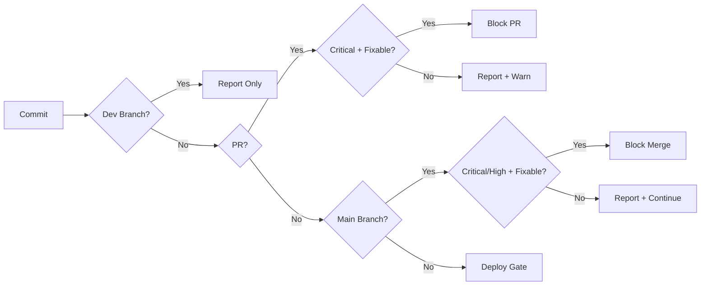

*[CVE]: Common Vulnerabilities and Exposures
*[CVSS]: Common Vulnerability Scoring System
*[CI]: Continuous Integration
*[RCE]: Remote Code Execution

A team ships a container with a known RCE vulnerability. Not because they missed it—they saw the scanner output. They just couldn't tell which of the 47 critical findings actually mattered. The scanner had cried wolf so many times that developers learned to click past the warnings. Security theater: the checkbox is checked, the audit is passed, and the vulnerability ships to production.

This is what compliance-driven security looks like. Scanning tools get enabled because policy requires them. Nobody configures the policies because the default "fail on everything" setting satisfies the auditor. Developers face a wall of unfixable CVEs and learn that security alerts are noise to bypass, not signals to act on. The scanner that was supposed to prevent vulnerabilities has created learned helplessness instead.

<Callout type="warning">
The fix isn't better scanners—it's abandoning compliance theater for actual security outcomes. A scanner that reports 200 unfixable CVEs trains developers to ignore all alerts. A scanner configured to report 3 fixable criticals with clear remediation steps gets those vulnerabilities fixed the same day.
</Callout>

The difference between scanning that works and scanning that gets disabled comes down to three things: policy configuration that produces actionable findings, base image choices that eliminate CVEs at the source, and documented processes for the vulnerabilities you genuinely can't fix yet. This article uses Trivy as the reference implementation—it's become the de facto open-source choice for CI scanning due to its speed and breadth of coverage.

## Policy Configuration

The scanner itself is just a tool. The policy—what you do with the findings—determines whether scanning improves security or becomes noise.

The single most important configuration option is `--ignore-unfixed`. Without it, you'll fail builds on CVEs that have no available patch—frustrating developers with problems they can't solve. When a vulnerability exists in an upstream package and the maintainers haven't released a fix, blocking your deployment doesn't make anyone more secure. It just teaches developers that security alerts are obstacles to route around.

Trivy supports a configuration file that centralizes these decisions:

```yaml title=".trivy.yaml"
severity:
  - CRITICAL
  - HIGH

ignore-unfixed: true

skip-dirs:
  - test/
  - docs/

ignorefile: .trivyignore
timeout: 10m
exit-code: 1
```
Code: Trivy configuration file for CI.

### Tiered Severity Gates

Not every pipeline stage needs the same policy. Teams that apply the same strict rules everywhere see predictable results: 40% of PRs fail on inherited CVEs that developers didn't introduce and can't fix. Half of those failures get bypassed with `--no-verify` flags or pipeline workarounds. The scanner becomes an obstacle to route around rather than a tool to use.

Tiered gates fix this by matching strictness to context:

_Development branches_: Report only, never fail. Developers see findings but aren't blocked. This builds awareness without creating friction—and developers who see useful findings early are more likely to pay attention when the PR gate catches something real.

_Pull requests_: Fail on fixable critical vulnerabilities only. This catches new problems the developer introduced without blocking them on pre-existing issues.

_Main branch_: Fail on fixable critical and high vulnerabilities. This is the gate to production—stricter than PRs but still ignoring unfixable issues.


Figure: Tiered security gate decision flow.

The key insight is that you're not lowering security by being permissive on dev branches—you're increasing adoption. A scanner that developers trust and use beats a strict scanner that gets disabled. Teams that implement tiered gates typically see bypass rates drop from 50%+ to under 5%—and median remediation time for real vulnerabilities drops from "never" to under two weeks.

### Exception Workflows

Some vulnerabilities can't be fixed immediately. You need a process for handling these legitimately rather than pretending they don't exist. The workflow has four steps:

1. _Developer request_: Add the CVE to `.trivyignore` with a comment explaining why, a ticket reference, and an expiration date.

2. _Security review_: Is the vulnerable code path reachable? Is there a workaround? What's the actual risk in your context?

3. _Approval and tracking_: Document the exception centrally with calendar reminders for the expiration date.

4. _Periodic review_: Monthly check whether fixes are now available or risk profiles have changed.

```text title=".trivyignore"
# CVE in test dependency, not shipped to production
CVE-2023-12345

# No fix available, risk accepted until Q2 2024
# Ticket: SEC-123
# Expires: 2024-06-30
CVE-2023-11111
```
Code: Trivy ignore file with documented exceptions.

Every ignore entry should have a comment explaining why it's ignored and a ticket tracking the exception. Undocumented ignores become permanent blind spots.

## Base Image Strategy

Policy configuration determines what you do with findings. Base image selection determines how many findings you have to deal with in the first place. Teams that invest hours tuning scanner policies while running `ubuntu:22.04` are optimizing the wrong thing—they're bailing water instead of patching the hole.

The spectrum runs from full OS images with 50-100 CVEs down to specialized minimal images with zero. Ubuntu and Debian give you everything including the kitchen sink. Slim variants trim unused packages to reduce the count by half. Alpine uses musl libc instead of glibc and ships with minimal packages, but can have compatibility issues. Distroless images contain only your application and runtime dependencies—no shell, no package manager. Chainguard images are designed from the ground up for zero CVEs, though pinning specific versions (important for reproducible builds) requires a paid subscription.

```dockerfile title="base-image-comparison.dockerfile"
# ❌ BAD: Full OS image - hundreds of packages
FROM ubuntu:22.04
# CVEs: ~50-100 typically
# Size: ~77MB compressed

# ⚠️ BETTER: Slim variant - fewer packages
FROM python:3.11-slim
# CVEs: ~20-50 typically
# Size: ~45MB compressed

# ✅ GOOD: Alpine - minimal packages
FROM python:3.11-alpine
# CVEs: ~5-15 typically
# Size: ~17MB compressed
# Caveat: musl libc compatibility issues

# ✅ BEST: Distroless - no shell, minimal
FROM gcr.io/distroless/python3
# CVEs: ~0-5 typically
# Size: ~15MB compressed
# Caveat: No shell for debugging

# ✅ ALTERNATIVE: Chainguard images
FROM cgr.dev/chainguard/python:latest
# CVEs: Usually 0
# Size: ~25MB compressed
# Caveat: Free for :latest only; pinned versions require subscription
```
Code: Base image options by security profile.

<Callout type="success">
Distroless images contain only your application and its runtime dependencies—no shell, no package manager, no unnecessary utilities. This dramatically reduces attack surface and CVE count.
</Callout>

### Multi-Stage Builds

Multi-stage builds let you use a full toolchain for building while shipping a minimal image to production. The build stage has compilers, package managers, and dev dependencies. The production stage has only what's needed to run.

```dockerfile title="Dockerfile"
# Build with full toolchain
FROM node:20 AS builder
WORKDIR /app
COPY package*.json ./
RUN npm ci
COPY . .
RUN npm run build

# Production with minimal image
FROM gcr.io/distroless/nodejs20-debian12
WORKDIR /app
COPY --from=builder /app/dist ./dist
COPY --from=builder /app/node_modules ./node_modules
COPY --from=builder /app/package.json ./
CMD ["dist/index.js"]
```
Code: Multi-stage build separating build-time and runtime dependencies.

The vulnerability reduction is dramatic. A single-stage build using `node:20` might have 60 CVEs. The multi-stage build using distroless drops to 5—a 92% reduction from a Dockerfile change.

The tradeoff is debuggability. With no shell in the production image, you can't `docker exec` into a running container. For most production workloads, that's actually a feature—if you need to debug, you should be looking at logs and metrics, not SSH'ing into containers.

## When You Can't Fix It

Not every CVE can be fixed immediately. Here are the scenarios you'll encounter:

_No patch available_: The CVE exists, but upstream hasn't released a fix. CVEs in core libraries like zlib can sit unfixed for months. Your options are waiting, switching to an alternative package, or accepting the risk with documentation.

_Fix requires breaking changes_: A patch exists but requires a major version bump. If you're on React 16 and the fix is in React 18, you're looking at a significant upgrade project. Sometimes accepting temporary risk while scheduling the upgrade is the pragmatic choice.

_Transitive dependency_: The vulnerability is in a dependency of a dependency—something you've never directly imported. Your direct dependency might not have updated yet. Package managers offer override mechanisms: npm uses `overrides`, yarn uses `resolutions`, Go uses `replace` directives.

The key principle for all these scenarios: document and track, don't pretend they don't exist. An acknowledged risk with compensating controls is better than an ignored vulnerability that nobody's watching.

The goal isn't zero CVEs or passing audits—it's reducing actual risk. A team with 15 documented exceptions and a 10-day remediation SLA has better security posture than a team with 200 ignored findings and a scanner that "passes" because nobody runs it. Measure what matters: time-to-remediation, bypass rates, and trend direction. The checkbox is irrelevant if the vulnerabilities ship anyway.

---

__CTA Title:__ Go Deeper: The Complete Guide to Container Security in CI

__CTA Body:__ This article covers the essentials of making container scanning work. The complete guide includes SBOM generation for rapid incident response, continuous registry scanning configuration, security metrics and stakeholder reporting, and CI integration patterns for GitHub and GitLab. Download the PDF to get the full implementation details.
