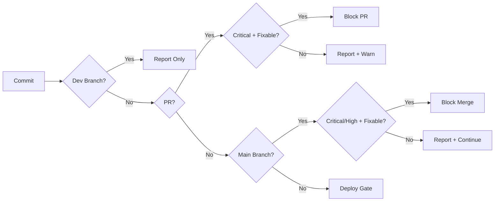
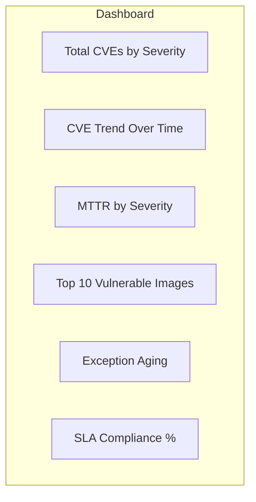

*[CVE]: Common Vulnerabilities and Exposures
*[CVSS]: Common Vulnerability Scoring System
*[SBOM]: Software Bill of Materials
*[CI]: Continuous Integration
*[CD]: Continuous Deployment
*[OCI]: Open Container Initiative
*[NVD]: National Vulnerability Database
*[SCA]: Software Composition Analysis

The appeal of shift-left security is obvious: finding vulnerabilities early in development costs less to fix than finding them in production. Container scanning belongs in your CI pipeline, not as an afterthought in staging.

The practical challenge is equally obvious. Teams enable container scanning and immediately face 47 critical vulnerabilities. Half are in base image packages the application never uses. A quarter have no available fix. The rest require major version bumps that would take weeks to properly test. The team disables scanning "temporarily" and never re-enables it.

This pattern repeats constantly. The scanner becomes noise that developers ignore or bypass. Security metrics look terrible because nobody's actually scanning. The tool that was supposed to improve security has made it worse by creating learned helplessness.

<Callout type="warning">
The fix isn't better scanners — it's better policies that lead to actionable findings. A scanner that reports 200 unfixable CVEs teaches developers to ignore all security alerts. A scanner that reports 3 fixable criticals with clear remediation steps gets those vulnerabilities fixed the same day.
</Callout>

This article covers how to integrate container scanning that developers will actually use: scanner selection, policy configuration that balances security and velocity, exception workflows for the inevitable unfixable CVEs, and metrics that tell you whether your security posture is actually improving.

## Understanding Container Vulnerabilities

### Where Vulnerabilities Hide

Container images are layered, and vulnerabilities can exist at every layer. Understanding where they come from helps you prioritize what to fix and what to accept.

Here's the uncomfortable reality for a typical Node.js application: about 60% of vulnerabilities are in layers developers don't directly control.

| Layer | % of CVEs | Fixable by Developer |
|-------|-----------|----------------------|
| Application code | 5% | Yes |
| npm dependencies | 35% | Partially (transitive deps are tricky) |
| Node.js runtime | 10% | Base image choice |
| OS packages (apt) | 40% | Base image choice |
| Base image (Debian) | 10% | Base image choice |

Table: Vulnerability distribution in a typical Node.js container.

Your application code—the part you write and fully control—accounts for roughly 5% of CVEs. The npm packages you directly depend on add another 35%, but many of those are transitive dependencies you've never heard of. The remaining 60% comes from the OS packages and base image, which most developers treat as a black box.

This distribution explains why "just fix all the CVEs" is impractical. You can't fix a vulnerability in Debian's libssl by editing your code. You need to update your base image, hope the distro has patched it, or accept the risk.

### CVE Scoring and Severity

CVSS scores tell you how bad a vulnerability _could_ be in the worst case. They don't tell you how bad it is _for you_.

| Severity | CVSS Range | Typical Example |
|----------|------------|-----------------|
| Critical | 9.0 - 10.0 | Remote code execution, no auth required |
| High | 7.0 - 8.9 | Privilege escalation, auth required |
| Medium | 4.0 - 6.9 | Information disclosure, specific conditions |
| Low | 0.0 - 3.9 | Minor info leak, local access required |

Table: CVSS severity levels.

The problem is context. A CVSS 9.8 critical in an XML parser doesn't matter if your application only parses JSON. A CVSS 6.5 medium in your authentication library matters a lot if you're running a public-facing API.

| CVSS Score | NVD Severity | Your Priority | Reason |
|------------|--------------|---------------|--------|
| 9.8 | Critical | Maybe High | Is the vulnerable function called? |
| 9.5 | Critical | Low | Package not used at runtime |
| 7.2 | High | Critical | Actively exploited in the wild |
| 6.5 | Medium | High | Exposed on public internet |
| 4.0 | Medium | None | Internal tool, no network access |

Table: CVSS scores vs contextual priority.

<Callout type="info">
CVSS measures theoretical severity; your priority should consider exploitability, exposure, and whether the vulnerable code path is reachable in your application.
</Callout>

Some CVEs have been rated critical for years with no known exploits. Others get weaponized within days of disclosure. The CVSS score alone doesn't capture this—you need to check whether there's an active exploit in the wild (CISA's [Known Exploited Vulnerabilities catalog](https://www.cisa.gov/known-exploited-vulnerabilities-catalog) is useful here) and whether the vulnerability applies to your deployment context.

### Types of Findings

Scanners detect different categories of issues, and each requires a different response.

_OS package vulnerabilities_ come from apt, apk, or yum packages in your base image. These are the bulk of findings and often the hardest to fix directly. Your remediation is usually updating the base image or switching to a slimmer alternative.

_Language dependency vulnerabilities_ come from npm, pip, go modules, or Maven packages. These are more actionable—you can often fix them by updating a version in your manifest file. The complication is transitive dependencies: a vulnerability in `nth-check` that you've never heard of, pulled in by `css-select`, which is pulled in by `cheerio`, which you actually use.

_Configuration issues_ are Dockerfile problems: running as root, including secrets in the image, using `latest` tags. These are fully within your control and should be fixed immediately.

_Secrets and credentials_ are hardcoded passwords, API keys, or certificates baked into the image. These should fail builds unconditionally—there's no legitimate exception for shipping credentials in container images.

_Malware and supply chain attacks_ are rare but catastrophic. The `event-stream` incident showed how a compromised maintainer can inject malicious code into popular packages. Scanners increasingly check for known malicious packages.

## Scanner Selection

### Popular Scanner Comparison

The container scanning landscape has consolidated around a few tools. Here's how they compare:

_Trivy_ (Aqua Security) has become the de facto open-source choice. It's fast, ships as a single binary, and scans OS packages, language dependencies, secrets, and IaC configurations. The breadth of coverage and zero-config startup make it ideal for CI pipelines. The main downside is noise—without tuning, you'll see a lot of findings.

_Grype_ (Anchore) is focused and fast. It pairs with Syft for SBOM generation and has good accuracy. It's less feature-rich than Trivy but might be preferable if you want a scanner that does one thing well.

_Clair_ (Red Hat/Quay) is battle-tested in the Quay registry but shows its age. Setup is more complex than newer alternatives, and it's slower. Unless you're already invested in the Red Hat ecosystem, there's little reason to choose it for new projects.

On the commercial side, _Snyk_ offers excellent developer experience with fix PRs, prioritization, and IDE integration. _Aqua_ (the company behind Trivy) offers runtime protection, policy engines, and enterprise features. Both come with enterprise pricing.

| Scanner | Speed | Coverage | CI Integration | Cost |
|---------|-------|----------|----------------|------|
| Trivy | Fast | OS, Lang, Secrets, IaC | Excellent | Free |
| Grype | Fast | OS, Lang | Good | Free |
| Clair | Moderate | OS | Moderate | Free |
| Snyk | Moderate | OS, Lang, Code | Excellent | Paid |
| Aqua | Moderate | Full stack | Excellent | Paid |

Table: Scanner comparison by key criteria.

<Callout type="success">
Trivy has become the de facto open-source choice for CI/CD scanning due to its speed, breadth of coverage, and zero-config startup. Start there unless you have specific requirements.
</Callout>

### Running Trivy in CI

Trivy's GitHub Action makes integration straightforward. Here's a pattern that works well: run the scan twice. The first pass reports all findings to GitHub's Security tab without failing the build. The second pass is the actual gate, configured to fail only on fixable critical vulnerabilities. For GitLab CI, the pattern is similar.

```yaml [g1:".github/workflows/security-scan.yaml"]
name: Security Scan

on:
  push:
    branches: [main]
  pull_request:

jobs:
  trivy-scan:
    runs-on: ubuntu-latest
    steps:
      - uses: actions/checkout@v4

      - name: Build image
        run: docker build -t myapp:${{ github.sha }} .

      - name: Run Trivy vulnerability scanner
        uses: aquasecurity/trivy-action@master
        with:
          image-ref: 'myapp:${{ github.sha }}'
          format: 'sarif'
          output: 'trivy-results.sarif'
          severity: 'CRITICAL,HIGH'
          exit-code: '0'  # Report only, don't fail

      - name: Upload Trivy scan results
        uses: github/codeql-action/upload-sarif@v3
        with:
          sarif_file: 'trivy-results.sarif'

      - name: Trivy gate check
        uses: aquasecurity/trivy-action@master
        with:
          image-ref: 'myapp:${{ github.sha }}'
          severity: 'CRITICAL'
          ignore-unfixed: true
          exit-code: '1'  # Fail on fixable criticals
```
```yaml [g1:".gitlab-ci.yml"]
stages:
  - build
  - security
  - deploy

build:
  stage: build
  script:
    - docker build -t $CI_REGISTRY_IMAGE:$CI_COMMIT_SHA .
    - docker push $CI_REGISTRY_IMAGE:$CI_COMMIT_SHA

container_scan:
  stage: security
  image:
    name: aquasec/trivy:latest
    entrypoint: [""]
  script:
    # Report all findings
    - trivy image
        --exit-code 0
        --severity CRITICAL,HIGH
        --format json
        --output trivy-report.json
        $CI_REGISTRY_IMAGE:$CI_COMMIT_SHA
    # Gate on fixable criticals only
    - trivy image
        --exit-code 1
        --severity CRITICAL
        --ignore-unfixed
        $CI_REGISTRY_IMAGE:$CI_COMMIT_SHA
  artifacts:
    reports:
      container_scanning: trivy-report.json
    paths:
      - trivy-report.json
```
Code: CI pipeline with Trivy scanning.

The `ignore-unfixed: true` (GH Action) option and `--ignore-unfixed` flag (GitLab CI) are crucial. Without it, you'll fail builds on CVEs that have no available patch—frustrating developers with problems they can't solve.

## Policy Configuration

### Defining Security Gates

The scanner itself is just a tool. The policy—what you do with the findings—determines whether scanning improves security or becomes noise.

Trivy supports a configuration file that centralizes policy decisions:

```yaml title=".trivy.yaml"
severity:
  - CRITICAL
  - HIGH

# Don't fail on unfixable vulnerabilities
ignore-unfixed: true

# Skip directories that don't ship to production
skip-dirs:
  - test/
  - docs/

# Custom ignore file for acknowledged risks
ignorefile: .trivyignore

timeout: 10m
format: table
exit-code: 1
```
Code: Trivy configuration file for CI.

The ignore file is where you document exceptions. Every entry should explain _why_ it's ignored:

```text title=".trivyignore"
# CVE in test dependency, not shipped to production
CVE-2023-12345

# Disputed CVE, vendor confirms not exploitable in our context
CVE-2023-67890

# No fix available, risk accepted until Q2 2024
# Ticket: SEC-123
# Expires: 2024-06-30
CVE-2023-11111

# False positive - we don't use the affected function
CVE-2023-22222
```
Code: Trivy ignore file with documented exceptions.

<Callout type="warning">
Every ignore entry should have a comment explaining why it's ignored and a ticket tracking the exception. Undocumented ignores become permanent blind spots.
</Callout>

### Tiered Severity Gates

Not every pipeline stage needs the same policy. Development branches should be permissive—you don't want to block a developer from iterating on a feature because of a CVE in the base image. Production deployments should be strict.

Here's a tiered approach that balances security and velocity:

_Development branches_: Report only, never fail. Developers see findings but aren't blocked. This builds awareness without creating friction.

_Pull requests_: Fail on fixable critical vulnerabilities only. This catches new problems the developer introduced without blocking them on pre-existing issues.

_Main branch_: Fail on fixable critical and high vulnerabilities. This is the gate to production—stricter than PRs but still ignoring unfixable issues.

_Production deployment_: Strictest gate. Same as main branch, plus SBOM generation and checks against known exploit databases.


Figure: Tiered security gate decision flow.

The key insight is that you're not lowering security by being permissive on dev branches—you're increasing adoption. A scanner that developers trust and use beats a strict scanner that gets disabled.

### Exception Workflows

Some vulnerabilities can't be fixed immediately. Maybe there's no patch. Maybe the fix requires a breaking change that needs a full release cycle. You need a process for handling these legitimately rather than pretending they don't exist.

The workflow should have four steps:

1. _Developer request_: The developer adds the CVE to `.trivyignore` with a comment explaining why, a ticket tracking the exception, and an expiration date.

2. _Security review_: Someone on the security team reviews the request. Is the vulnerable code path reachable? Is there a workaround? What's the actual risk in your context? Is a fix expected soon?

3. _Approval and tracking_: If approved, the exception is documented in a central location with calendar reminders for the expiration date.

4. _Periodic review_: Monthly review of all active exceptions. Is a fix now available? Has the risk profile changed? Should we extend or close the exception?

The exception reasons I see most often:

- _Not exploitable_: The vulnerable code path isn't reachable in your application
- _No fix available_: Waiting for upstream to release a patch
- _False positive_: Scanner incorrectly identified the vulnerability
- _Mitigated_: Other controls prevent exploitation (WAF rules, network segmentation)
- _Risk accepted_: Business decision to accept the risk with compensating controls

<Callout type="info">
Exceptions should expire. A CVE ignored six months ago might have a fix now, or the risk landscape might have changed. Default to 90-day expiration with required re-review.
</Callout>

## SBOM Generation

### What Is an SBOM

A Software Bill of Materials is an ingredients list for your software. It answers: what packages are included, what versions, what licenses, and where did they come from?

Three scenarios make SBOMs worth the effort:

_Incident response_: When log4shell dropped, teams scrambled to figure out which services were affected. With SBOMs, you can answer "are we running log4j?" by searching a database instead of scanning every image in your registry. The difference between a 30-minute response and a 3-day audit.

_Compliance_: Enterprise customers ask for SBOMs in security questionnaires. License compliance (GPL, Apache, MIT) requires knowing what's in your software. Export control regulations may apply to certain cryptographic libraries. Having SBOMs ready turns these from multi-week projects into quick lookups.

_Supply chain security_: SBOMs let you track the provenance of components and detect unexpected changes. If a package suddenly appears that wasn't there before, you want to know about it.

### Generating SBOMs with Trivy

Trivy can generate SBOMs in multiple formats:

```bash title="sbom-commands.sh"
# SPDX format (common for license compliance)
trivy image --format spdx-json --output sbom.spdx.json myapp:latest

# CycloneDX format (common for security)
trivy image --format cyclonedx --output sbom.cdx.json myapp:latest

# Generate from filesystem without building image
trivy fs --format cyclonedx --output sbom.cdx.json .

# Scan an existing SBOM for vulnerabilities
trivy sbom sbom.cdx.json
```
Code: SBOM generation and scanning commands.

The last command is particularly useful. Instead of scanning images repeatedly, you can scan the SBOM—which is much faster since it's just a JSON file. When a new CVE drops, scan all your SBOMs to find affected services in seconds.

For CI integration, generate the SBOM alongside your image and attach it as an attestation using cosign:

```yaml title=".gitlab-ci.yml"
sbom:
  stage: security
  script:
    - trivy image
        --format cyclonedx
        --output sbom-${CI_COMMIT_SHA}.json
        $CI_REGISTRY_IMAGE:$CI_COMMIT_SHA

    # Attach SBOM to container image as attestation
    - cosign attest
        --predicate sbom-${CI_COMMIT_SHA}.json
        --type cyclonedx
        $CI_REGISTRY_IMAGE:$CI_COMMIT_SHA

  artifacts:
    paths:
      - sbom-${CI_COMMIT_SHA}.json
```
Code: CI pipeline generating SBOM attestation.

<Callout type="info">
Cosign (from the Sigstore project) cryptographically signs your SBOM and attaches it to your container image in your OCI registry. It uses keyless signing via your CI provider's OIDC identity, so there are no keys to manage. The signed attestation (stored with a `.att` extension) proves the SBOM came from your pipeline and hasn't been tampered with.
</Callout>

| SBOM Format | Use Case | Tool Support |
|-------------|----------|--------------|
| SPDX | License compliance, legal | Broad |
| CycloneDX | Security focus, VEX | Growing |
| Syft JSON | Anchore ecosystem | Anchore tools |

Table: SBOM format comparison.

For most teams, CycloneDX is the right choice. It's designed with security in mind and supports VEX (Vulnerability Exploitability eXchange) documents for communicating which vulnerabilities actually affect your deployment. VEX lets you publish statements like "CVE-2023-12345 does not affect us because we don't use the vulnerable XML parsing feature"—turning your `.trivyignore` decisions into a machine-readable format that downstream consumers can use.

## Base Image Strategy

### Choosing Secure Base Images

The single biggest factor in your CVE count is your base image choice. A full Ubuntu image ships with hundreds of packages you'll never use—and each one is a potential vulnerability.

```dockerfile title="base-image-comparison.dockerfile"
# ❌ BAD: Full OS image - hundreds of packages
FROM ubuntu:22.04
# CVEs: ~50-100 typically
# Size: ~77MB compressed

# ⚠️ BETTER: Slim variant - fewer packages
FROM python:3.11-slim
# CVEs: ~20-50 typically
# Size: ~45MB compressed

# ✅ GOOD: Alpine - minimal packages
FROM python:3.11-alpine
# CVEs: ~5-15 typically
# Size: ~17MB compressed
# Caveat: musl libc compatibility issues

# ✅ BEST: Distroless - no shell, minimal
FROM gcr.io/distroless/python3
# CVEs: ~0-5 typically
# Size: ~15MB compressed
# Caveat: No shell for debugging

# ✅ ALTERNATIVE: Chainguard images
FROM cgr.dev/chainguard/python:latest
# CVEs: Usually 0
# Size: ~25MB compressed
# Caveat: Free for :latest only; pinned versions require subscription
```
Code: Base image options by security profile.

<Callout type="success">
Distroless images contain only your application and its runtime dependencies—no shell, no package manager, no unnecessary utilities. This dramatically reduces attack surface and CVE count.
</Callout>

### Multi-Stage Builds for Security

Multi-stage builds let you use a full toolchain for building while shipping a minimal image to production. The build stage has compilers, package managers, and dev dependencies. The production stage has only what's needed to run.

```dockerfile title="Dockerfile"
# Stage 1: Build with full toolchain
FROM node:20 AS builder
WORKDIR /app
COPY package*.json ./
RUN npm ci
COPY . .
RUN npm run build

# Stage 2: Production with minimal image
FROM gcr.io/distroless/nodejs20-debian12
WORKDIR /app
COPY --from=builder /app/dist ./dist
COPY --from=builder /app/node_modules ./node_modules
COPY --from=builder /app/package.json ./

CMD ["dist/index.js"]
```
Code: Multi-stage build separating build-time and runtime dependencies.

The vulnerability reduction is dramatic. A single-stage build using `node:20` might have 60 CVEs: 45 in OS packages, 3 in Node.js, and 12 in dev dependencies. The multi-stage build using distroless drops to 5 CVEs: 2 in the minimal OS layer, 3 in Node.js, and zero in dev dependencies (because they're not included). That's a 92% reduction from a Dockerfile change.

The tradeoff is debuggability. With no shell in the production image, you can't `docker exec` into a running container to poke around. For most production workloads, that's actually a feature—if you need to debug, you should be looking at logs and metrics, not SSH'ing into containers.

## Runtime vs Build-Time Scanning

### Scanning Strategy

Container scanning can happen at multiple points in the lifecycle. Each stage catches different problems and has different tradeoffs.

- __Pre-commit scanning__ runs against dependency files (package.json, requirements.txt) before code is even committed. Tools like `npm audit`, `pip-audit`, or `trivy fs` catch issues early. This is the fastest feedback loop but only sees declared dependencies, not the full container.

- __CI build scanning__ runs against the built container image. This is where Trivy shines—you see the complete picture including OS packages, runtime, and application dependencies. This is your primary gate before merge or deploy.

- __Registry scanning__ runs continuously against images stored in your container registry. Harbor, ECR, and GCR all support this. The key value is catching _new_ CVEs in existing images. An image that was clean when you built it might have critical vulnerabilities discovered a week later.

- __Runtime scanning__ watches running containers for anomalies—processes that shouldn't be running, network connections that shouldn't exist, files being modified that should be immutable. This catches attacks that static scanning can't see, but it's a separate discipline from the build-time scanning we're focused on here.

### Continuous Registry Scanning

New CVEs are published daily. An image that was clean yesterday might have critical vulnerabilities today. Continuous registry scanning catches these without requiring rebuilds.

Most container registries support this natively. Here's how to configure ECR enhanced scanning with Terraform:

```hcl title="ecr-scanning.tf"
# Enable enhanced scanning with Amazon Inspector
resource "aws_ecr_registry_scanning_configuration" "main" {
  scan_type = "ENHANCED"

  rule {
    scan_frequency = "CONTINUOUS_SCAN"
    repository_filter {
      filter      = "*"
      filter_type = "WILDCARD"
    }
  }
}

# Alert on new findings via EventBridge
resource "aws_cloudwatch_event_rule" "inspector_findings" {
  name        = "inspector-vulnerability-findings"
  description = "Capture Inspector2 vulnerability findings"

  event_pattern = jsonencode({
    source      = ["aws.inspector2"]
    detail-type = ["Inspector2 Finding"]
  })
}

resource "aws_cloudwatch_event_target" "sns" {
  rule      = aws_cloudwatch_event_rule.inspector_findings.name
  target_id = "security-alerts"
  arn       = aws_sns_topic.security_alerts.arn
}
```
Code: AWS ECR enhanced scanning with Terraform.

For Harbor, you can configure Trivy scanning and pull prevention policies through the Harbor Helm chart or API. The key capability is blocking pulls of vulnerable images—if someone tries to deploy an image with critical CVEs, the registry refuses to serve it. This hard stop prevents vulnerable code from reaching production even if CI gates were bypassed.

## Handling Common Scenarios

### The "Can't Fix" Situation

Not every CVE can be fixed immediately. Here are the scenarios you'll encounter and how to handle them:

- __No patch available:__ The CVE exists, but upstream hasn't released a fix. Your options are waiting (track the upstream issue), switching to an alternative package, implementing a workaround, or accepting the risk with documentation. CVEs in core libraries like zlib can sit unfixed for months.

- __Fix requires breaking changes:__ A patch exists but requires a major version bump. If you're on React 16 and the fix is in React 18, you're looking at a significant upgrade project. Options include doing the upgrade, backporting the security fix if it's simple enough, or accepting the risk temporarily while scheduling the upgrade.

- __Transitive dependency:__ The vulnerability is in a dependency of a dependency—something you've never directly imported. A CVE in `nth-check` that you've never heard of, pulled in by `css-select`, pulled in by `cheerio`, which you actually use. Your direct dependency might not have updated yet.

For transitive dependencies, package managers offer override mechanisms:

```json [g2:"package.json (npm)"]
{
  "name": "myapp",
  "overrides": {
    "nth-check": "2.1.1",
    "semver": "7.5.4"
  }
}
```
```text [g2:"go.mod (Go)"]
module myapp

go 1.21

require (
    github.com/example/lib v1.2.3
)

// Force specific version of transitive dependency
replace golang.org/x/crypto => golang.org/x/crypto v0.17.0
replace golang.org/x/net => golang.org/x/net v0.19.0
```
```text [g2:"requirements.txt (pip)"]
# For pip: pin vulnerable transitive dependencies explicitly
# These take precedence over what other packages request
cryptography==41.0.7
certifi==2023.11.17
urllib3==2.1.0

# Or use pip-compile with constraints file:
# pip-compile --constraint constraints.txt requirements.in
```
```ruby [g2:"Gemfile (Ruby)"]
source "https://rubygems.org"

gem "rails", "~> 7.0"

# Force specific versions of transitive dependencies
gem "nokogiri", ">= 1.15.4"  # CVE-2023-XXXXX
gem "puma", ">= 6.4.0"       # Security fix
```
Code: Overriding transitive dependency versions across package managers.

Each ecosystem handles this differently. npm uses `overrides` (yarn uses `resolutions`), Go uses `replace` directives, pip relies on explicit pinning or constraints files, and Ruby lets you declare gems directly even if they're transitive. Use with caution—you're overriding what the package author tested against.

With common scenarios handled, the remaining challenge is proving your security posture is actually improving.

## Metrics and Reporting

### Security Posture Metrics

Tracking the right metrics tells you whether your security posture is actually improving or just generating noise. Here are the categories that matter:

__Point-in-time counts__ show your current state: total vulnerabilities by severity across all images, broken down by fixable vs unfixable. This is your baseline.

__Trend metrics__ show direction: mean time to remediate (MTTR) measures the average days from CVE publication to fix deployed. Target less than 14 days for critical vulnerabilities and less than 30 days for high severity. If MTTR is increasing, your process has a bottleneck.

__Process metrics__ reveal systemic issues: the number of active vulnerability exceptions should stay manageable. If you have 50+ exceptions, something is wrong—either your policies are too strict, your base images are too old, or teams are gaming the system.

__Coverage metrics__ ensure nothing slips through: percentage of deployments with scans should be 100%. Any gap means vulnerable code could reach production undetected.

__SLA metrics__ drive accountability: define fix windows by severity (7 days for critical, 30 days for high, 90 days for medium) and track compliance. This turns abstract security goals into measurable commitments.


Figure: Security dashboard components.

### Reporting to Stakeholders

Different audiences need different views of the same data:

_Developers_ need actionable information per PR: what new vulnerabilities did this change introduce, what's fixable, and what commands will remediate them. Deliver this as PR comments or check annotations—immediate feedback in their workflow.

_Team leads_ need weekly trends: are vulnerabilities going up or down, what's the MTTR, how many deployments were blocked. A dashboard or Slack summary works well here.

_Security teams_ need daily operational data: new critical findings, pending exception requests, scanner health metrics. They need detailed reports plus alerts for anything requiring immediate attention.

_Executives_ need monthly strategic views: overall posture trend (are we getting better?), SLA compliance percentage, summary of risk exceptions. Keep it high-level—one dashboard, no raw CVE lists.

<Callout type="info">
The goal of reporting isn't to impress stakeholders with CVE counts—it's to drive behavior. Developers need to know what to fix. Executives need to know if the investment in security tooling is paying off.
</Callout>

## Integration Patterns

### GitHub Security Tab Integration

GitHub's Security tab provides a centralized view of vulnerabilities across your repositories. Trivy can upload findings in SARIF format, which GitHub parses and displays alongside Dependabot alerts and CodeQL results.

```yaml title=".github/workflows/security-scan.yaml"
# Upload findings to GitHub Security tab
- name: Upload to GitHub Security
  uses: github/codeql-action/upload-sarif@v3
  with:
    sarif_file: 'trivy-results.sarif'
```
Code: GitHub Security tab integration.

Once uploaded, findings appear in the Security tab under Code scanning alerts. Developers see them in PR checks with inline annotations. The interface is similar to Dependabot—familiar to anyone who's dealt with dependency updates.

### Slack Notifications

For teams that live in Slack, immediate notification on scan failures keeps security visible without requiring developers to check dashboards:

```yaml title=".github/workflows/security-scan.yaml"
- name: Notify Slack on Critical CVEs
  if: failure()
  uses: slackapi/slack-github-action@v1
  with:
    payload: |
      {
        "blocks": [
          {
            "type": "section",
            "text": {
              "type": "mrkdwn",
              "text": "🚨 *Security Scan Failed*\n*Repository:* ${{ github.repository }}\n*Branch:* ${{ github.ref_name }}"
            }
          },
          {
            "type": "actions",
            "elements": [
              {
                "type": "button",
                "text": {"type": "plain_text", "text": "View Results"},
                "url": "${{ github.server_url }}/${{ github.repository }}/security/code-scanning"
              }
            ]
          }
        ]
      }
  env:
    SLACK_WEBHOOK_URL: ${{ secrets.SLACK_SECURITY_WEBHOOK }}
```
Code: GitHub Action for Slack notification on scan failure.

The `if: failure()` condition means this only fires when the security gate fails—not on every scan. Nobody wants notification fatigue for successful builds.

## Conclusion

Shift-left security catches vulnerabilities early when they're cheapest to fix—in the developer's IDE or PR, not in production after a breach. But the goal isn't zero findings; it's actionable findings that developers can actually resolve.

The patterns that make container scanning successful:

- __Tune policies aggressively.__ Report everything, but only fail builds on fixable critical and high vulnerabilities. Unfixable CVEs in the base image shouldn't block feature development.

- __Document every exception.__ When you can't fix something, record why in your ignore file with a ticket and expiration date. Undocumented ignores become permanent blind spots.

- __Choose minimal base images.__ The single biggest factor in your CVE count is your base image. Distroless or Chainguard images can reduce vulnerabilities by 90% compared to full OS images.

- __Generate SBOMs for incident response.__ When the next log4shell drops, you want to answer "are we affected?" in minutes, not days.

- __Track trends, not just counts.__ Mean time to remediate and SLA compliance tell you if your security posture is improving. Raw CVE counts just create noise.

Security gates must balance protection with velocity. Gates that block everything get disabled. Gates that developers trust and use—even if they're more permissive—deliver better security outcomes than strict gates that nobody runs.

<Callout type="success">
Effective container security isn't about blocking every CVE—it's about catching the exploitable ones early, tracking the unfixable ones explicitly, and maintaining developer velocity. A scanner that developers trust and use is infinitely better than a strict scanner that gets disabled.
</Callout>
