*[CDC]: Consumer-Driven Contracts
*[API]: Application Programming Interface
*[CI]: Continuous Integration
*[CD]: Continuous Deployment
*[REST]: Representational State Transfer
*[gRPC]: Google Remote Procedure Call
*[SUT]: System Under Test

# Contract Testing: Catching Breaks Before Deploy

## Introduction

Brief overview of the breaking change problem: in a microservices architecture, a "minor" change to one service's API can cascade into production incidents across multiple consumers. Integration tests are too slow and flaky to catch these at PR time; manual coordination doesn't scale. This section introduces contract testing as the solution—a testing approach that verifies API compatibility without requiring services to run together.

_Include a real scenario: a provider team renames a JSON field from `createdDate` to `created_at` for consistency. Their unit tests pass, their integration tests pass (because they updated the mock), but three consumer services break in production because they expected the old field name. Contract tests would have caught this at PR time._

<Callout type="info">
Contract tests answer a simple question: "If I deploy this version of my service, will it break any of my consumers?" They answer it in seconds, not the hours that integration environments take.
</Callout>

## What Is a Breaking Change?

### Defining Breaking Changes

Categorize API changes by their compatibility impact.

```yaml title="breaking-change-taxonomy.yaml"
breaking_changes:
  definitely_breaking:
    - "Removing a field from responses"
    - "Renaming a field"
    - "Changing a field's type (string → number)"
    - "Removing an endpoint"
    - "Adding a required request field"
    - "Changing authentication requirements"
    - "Changing HTTP method"

  might_be_breaking:
    - "Changing field nullability"
    - "Changing enum values"
    - "Changing validation rules"
    - "Changing error response format"
    - "Adding rate limits"

  usually_safe:
    - "Adding a new optional field to responses"
    - "Adding a new endpoint"
    - "Adding optional query parameters"
    - "Relaxing validation rules"
    - "Increasing rate limits"
```
Code: Breaking change taxonomy by compatibility impact.

```mermaid
graph TD
    A[API Change] --> B{Removes Something?}
    B -->|Yes| C[🔴 Breaking]
    B -->|No| D{Modifies Existing?}

    D -->|Yes| E{Stricter or Different?}
    D -->|No| F{Adds Required?}

    E -->|Stricter| C
    E -->|More Lenient| G[🟢 Usually Safe]

    F -->|Yes| C
    F -->|No| G
```


Figure: Decision tree for identifying breaking changes.

### The Consumer Perspective

Explain why the consumer's view matters more than the provider's intent.

```typescript title="consumer-expectations.ts"
// What the consumer code expects
interface UserResponse {
  userId: string;
  email: string;
  createdDate: string;  // Consumer depends on this name
}

async function getUser(id: string): Promise<UserResponse> {
  const response = await fetch(`/api/users/${id}`);
  const data = await response.json();

  // Consumer code uses the field name directly
  console.log(`User created on: ${data.createdDate}`);
  //                                    ^^^^^^^^^^^
  // If provider renames to created_at, this breaks silently
  // No compile error, no runtime error - just undefined

  return data;
}
```
Code: Consumer code with implicit field name dependency.

```text
Provider's View vs Consumer's Reality:

Provider thinks:
  "I renamed createdDate to created_at"
  "It's just a naming convention change"
  "My tests all pass"
  "Ship it!"

Consumer experiences:
  "TypeError: Cannot read property 'toISOString' of undefined"
  "Why is user.createdDate suddenly undefined?"
  "Production is broken at 3 AM"
  "Who changed the User API?!"

The provider's intent doesn't matter.
The consumer's expectations are the contract.
```

<Callout type="warning">
A change is breaking if any consumer breaks, regardless of whether the provider considers it "minor." The provider doesn't know how consumers use their API.
</Callout>

## Consumer-Driven Contracts

### The Core Concept

Explain how CDC inverts the traditional API testing model.


Figure: Traditional provider-defined API vs consumer-driven contracts.

```text
Why "Consumer-Driven"?

Traditional Model:
  - Provider defines what they offer
  - Consumer adapts to provider
  - Provider changes freely
  - Consumers discover breaks in production

Consumer-Driven Model:
  - Consumer defines what they need
  - Provider verifies they can deliver
  - Provider sees who depends on what
  - Breaking changes caught before merge

Key insight: The contract is what consumers actually use,
not what the provider thinks they should use.
```

### Contract Anatomy

Define what goes into a contract.

```json title="contract-example.json"
{
  "consumer": { "name": "OrderService" },
  "provider": { "name": "UserService" },
  "interactions": [
    {
      "description": "a request for an existing user",
      "providerState": "user 123 exists",
      "request": {
        "method": "GET",
        "path": "/users/123",
        "headers": {
          "Accept": "application/json",
          "Authorization": "Bearer token"
        }
      },
      "response": {
        "status": 200,
        "headers": {
          "Content-Type": "application/json"
        },
        "body": {
          "userId": "123",
          "email": "user@example.com",
          "createdDate": "2024-01-15T10:30:00Z"
        },
        "matchingRules": {
          "body": {
            "$.userId": { "match": "type" },
            "$.email": { "match": "regex", "regex": "^.+@.+$" },
            "$.createdDate": { "match": "type" }
          }
        }
      }
    }
  ]
}
```
Code: Contract structure showing interaction, request, response, and matchers.

| Contract Element | Purpose | Example |
|-----------------|---------|---------|
| Consumer name | Identifies who depends on this | "OrderService" |
| Provider name | Identifies the API owner | "UserService" |
| Provider state | Test data precondition | "user 123 exists" |
| Request | What consumer sends | `GET /users/123` |
| Response | What consumer expects | `{ userId, email, ... }` |
| Matching rules | Flexible verification | Type, regex, presence |

Table: Contract elements and their purposes.

<Callout type="info">
Contracts test structure, not specific values. The contract says "there's a userId field that's a string" not "userId equals '123'". This keeps contracts stable across environments.
</Callout>

## Writing Consumer Tests

### Setting Up Pact

Provide practical setup for consumer-side testing.

```typescript title="pact-consumer-setup.ts"
import { PactV3, MatchersV3 } from '@pact-foundation/pact';
import { resolve } from 'path';

const { like, eachLike, regex, datetime, integer } = MatchersV3;

// Create provider mock
const provider = new PactV3({
  consumer: 'OrderService',
  provider: 'UserService',
  dir: resolve(__dirname, '../pacts'),
  logLevel: 'warn',
});

export { provider, like, eachLike, regex, datetime, integer };
```
Code: Pact consumer setup with matchers.

### Writing Interaction Tests

```typescript title="user-contract-test.ts"
import { provider, like, regex, datetime, eachLike } from './pact-setup';
import { UserClient } from '../src/clients/user-client';

describe('UserService Contract', () => {
  describe('GET /users/:id', () => {
    it('returns user details when user exists', async () => {
      // Arrange: Define the expected interaction
      await provider
        .given('user with ID 123 exists')
        .uponReceiving('a request for user 123')
        .withRequest({
          method: 'GET',
          path: '/users/123',
          headers: {
            Accept: 'application/json',
            Authorization: like('Bearer valid-token'),
          },
        })
        .willRespondWith({
          status: 200,
          headers: {
            'Content-Type': 'application/json',
          },
          body: {
            userId: like('123'),
            email: regex(/^[\w.-]+@[\w.-]+\.\w+$/, 'user@example.com'),
            name: like('John Doe'),
            createdDate: datetime("yyyy-MM-dd'T'HH:mm:ss'Z'"),
            roles: eachLike('admin'),
          },
        });

      // Act & Assert: Run the consumer code against the mock
      await provider.executeTest(async (mockServer) => {
        const client = new UserClient(mockServer.url);
        const user = await client.getUser('123');

        expect(user.userId).toBeDefined();
        expect(user.email).toContain('@');
        expect(user.roles).toBeInstanceOf(Array);
      });
    });

    it('returns 404 when user does not exist', async () => {
      await provider
        .given('no user with ID 999 exists')
        .uponReceiving('a request for non-existent user')
        .withRequest({
          method: 'GET',
          path: '/users/999',
          headers: {
            Accept: 'application/json',
            Authorization: like('Bearer valid-token'),
          },
        })
        .willRespondWith({
          status: 404,
          body: {
            error: like('User not found'),
            code: like('USER_NOT_FOUND'),
          },
        });

      await provider.executeTest(async (mockServer) => {
        const client = new UserClient(mockServer.url);
        await expect(client.getUser('999')).rejects.toThrow('User not found');
      });
    });
  });
});
```
Code: Consumer contract tests for happy path and error case.

### Matcher Deep Dive

Explain matchers that make contracts flexible.

```typescript title="pact-matchers-guide.ts"
import { MatchersV3 } from '@pact-foundation/pact';

const {
  like,       // Type matching - same type as example
  eachLike,   // Array where each item matches type
  regex,      // Pattern matching
  datetime,   // DateTime format
  integer,    // Integer number
  decimal,    // Decimal number
  boolean,    // Boolean value
  string,     // Non-empty string
  uuid,       // UUID format
  email,      // Email format
  includes,   // String contains substring
  nullValue,  // Explicit null
} = MatchersV3;

// Examples with explanations
const matcherExamples = {
  // like(): "Must be same type as example"
  // Example used for mock, type used for verification
  userId: like('abc-123'),
  // ✅ Matches: "xyz-789", "user-1"
  // ❌ Fails: 123, null, undefined

  // eachLike(): "Array of items matching this type"
  items: eachLike({
    id: like('item-1'),
    price: decimal(19.99),
  }),
  // Mock returns array with 1 item
  // Verification checks each array item matches structure

  // regex(): "Must match this pattern"
  status: regex(/^(pending|approved|rejected)$/, 'pending'),
  // ✅ Matches: "pending", "approved", "rejected"
  // ❌ Fails: "Pending", "APPROVED", "cancelled"

  // Combining matchers for complex structures
  pagination: {
    page: integer(1),
    perPage: integer(20),
    total: integer(100),
    hasMore: boolean(true),
  },
};
```
Code: Pact matcher guide with examples.

| Matcher | Use Case | Contract Meaning |
|---------|----------|------------------|
| `like(x)` | Most fields | Same type as x |
| `eachLike(x)` | Arrays | Array with items matching x |
| `regex(p, x)` | Enums, formats | Matches pattern p |
| `datetime(f)` | Timestamps | Valid datetime in format f |
| `integer(x)` | Counts, IDs | Integer number |
| `decimal(x)` | Prices, rates | Decimal number |
| `uuid()` | Identifiers | Valid UUID |

Table: Common matchers and when to use them.

<Callout type="success">
Use `like()` for most fields—it verifies structure without coupling to specific values. Reserve exact matches for constants like status codes and error codes.
</Callout>

## Provider Verification

### Setting Up Verification

Show how providers verify contracts.

```typescript title="provider-verification.ts"
import { Verifier } from '@pact-foundation/pact';
import { app } from '../src/app';

describe('UserService Provider Verification', () => {
  let server: Server;

  beforeAll(async () => {
    // Start the real provider service
    server = app.listen(3001);
  });

  afterAll(async () => {
    server.close();
  });

  it('verifies contracts from all consumers', async () => {
    const verifier = new Verifier({
      provider: 'UserService',
      providerBaseUrl: 'http://localhost:3001',

      // Fetch contracts from Pact Broker
      pactBrokerUrl: process.env.PACT_BROKER_URL,
      pactBrokerToken: process.env.PACT_BROKER_TOKEN,

      // Or use local files for development
      // pactUrls: ['./pacts/orderservice-userservice.json'],

      // Provider state setup
      stateHandlers: {
        'user with ID 123 exists': async () => {
          await testDb.users.create({
            id: '123',
            email: 'user@example.com',
            name: 'John Doe',
          });
        },
        'no user with ID 999 exists': async () => {
          await testDb.users.deleteMany({ id: '999' });
        },
      },

      // Publish results back to broker
      publishVerificationResult: true,
      providerVersion: process.env.GIT_SHA,
      providerVersionBranch: process.env.GIT_BRANCH,
    });

    await verifier.verifyProvider();
  });
});
```
Code: Provider verification setup with state handlers.

### Provider States

Explain how to handle test data preconditions.

```typescript title="provider-states.ts"
// Provider states create the preconditions for each interaction
// They should be minimal - just enough to satisfy the contract

const stateHandlers: StateHandlers = {
  // Simple state
  'user exists': async () => {
    await db.users.create({
      id: 'test-user',
      email: 'test@example.com',
      name: 'Test User',
    });
  },

  // Parameterized state
  'user with ID {id} exists': async (params) => {
    await db.users.create({
      id: params.id,
      email: `user-${params.id}@example.com`,
      name: `User ${params.id}`,
    });
  },

  // State with specific data
  'user with email {email} exists': async (params) => {
    await db.users.create({
      id: 'specific-user',
      email: params.email,
      name: 'Specific User',
    });
  },

  // State for error cases
  'authentication is invalid': async () => {
    // No setup needed - just don't create valid auth
  },

  // Cleanup state
  'no users exist': async () => {
    await db.users.deleteMany({});
  },
};
```
Code: Provider state handlers for various scenarios.

<Callout type="warning">
Provider states should create minimal test data. Don't replicate your entire database schema—just create what the contract needs to succeed.
</Callout>

## CI/CD Integration

### The Pact Broker

Explain centralized contract management.

```mermaid
sequenceDiagram
    participant C as Consumer CI
    participant PB as Pact Broker
    participant P as Provider CI
    participant Prod as Production

    C->>C: Run contract tests
    C->>PB: Publish contracts
    C->>PB: Can I deploy?
    PB->>C: ✅ Yes (provider verified)

    P->>PB: Fetch contracts
    P->>P: Verify against implementation
    P->>PB: Publish verification results
    P->>PB: Can I deploy?
    PB->>P: ✅ Yes (all consumers compatible)

    C->>Prod: Deploy consumer
    C->>PB: Record deployment
    P->>Prod: Deploy provider
    P->>PB: Record deployment
```


Figure: Pact Broker workflow in CI/CD.

### Consumer Pipeline

```yaml title="consumer-ci.yaml"
name: Consumer CI

on: [push, pull_request]

jobs:
  test:
    runs-on: ubuntu-latest
    steps:
      - uses: actions/checkout@v4

      - name: Install dependencies
        run: npm ci

      - name: Run unit tests
        run: npm test

      - name: Run contract tests
        run: npm run test:contract
        env:
          PACT_BROKER_URL: ${{ secrets.PACT_BROKER_URL }}
          PACT_BROKER_TOKEN: ${{ secrets.PACT_BROKER_TOKEN }}

      - name: Publish contracts
        if: github.ref == 'refs/heads/main' || github.event_name == 'pull_request'
        run: |
          npx pact-broker publish ./pacts \
            --consumer-app-version=${{ github.sha }} \
            --branch=${{ github.ref_name }} \
            --broker-base-url=${{ secrets.PACT_BROKER_URL }} \
            --broker-token=${{ secrets.PACT_BROKER_TOKEN }}

      - name: Can I deploy?
        run: |
          npx pact-broker can-i-deploy \
            --pacticipant=OrderService \
            --version=${{ github.sha }} \
            --to-environment=production \
            --broker-base-url=${{ secrets.PACT_BROKER_URL }} \
            --broker-token=${{ secrets.PACT_BROKER_TOKEN }}
```
Code: Consumer CI pipeline with contract publishing.

### Provider Pipeline

```yaml title="provider-ci.yaml"
name: Provider CI

on:
  push:
  pull_request:
  repository_dispatch:
    types: [pact-contract-published]

jobs:
  verify:
    runs-on: ubuntu-latest
    steps:
      - uses: actions/checkout@v4

      - name: Install dependencies
        run: npm ci

      - name: Run unit tests
        run: npm test

      - name: Verify consumer contracts
        run: npm run test:contract:verify
        env:
          PACT_BROKER_URL: ${{ secrets.PACT_BROKER_URL }}
          PACT_BROKER_TOKEN: ${{ secrets.PACT_BROKER_TOKEN }}
          GIT_SHA: ${{ github.sha }}
          GIT_BRANCH: ${{ github.ref_name }}

      - name: Can I deploy?
        run: |
          npx pact-broker can-i-deploy \
            --pacticipant=UserService \
            --version=${{ github.sha }} \
            --to-environment=production \
            --broker-base-url=${{ secrets.PACT_BROKER_URL }} \
            --broker-token=${{ secrets.PACT_BROKER_TOKEN }}
```
Code: Provider CI pipeline with verification.

### The Can-I-Deploy Check

```bash title="can-i-deploy-examples.sh"
# Check if consumer can deploy to production
npx pact-broker can-i-deploy \
  --pacticipant=OrderService \
  --version=abc123 \
  --to-environment=production

# Output on success:
# Computer says yes \o/
#
# CONSUMER        | C.VERSION | PROVIDER        | P.VERSION | SUCCESS?
# ----------------|-----------|-----------------|-----------|----------
# OrderService    | abc123    | UserService     | def456    | true
# OrderService    | abc123    | PaymentService  | ghi789    | true

# Output on failure:
# Computer says no ¯\_(ツ)_/¯
#
# CONSUMER        | C.VERSION | PROVIDER        | P.VERSION | SUCCESS?
# ----------------|-----------|-----------------|-----------|----------
# OrderService    | abc123    | UserService     | def456    | false
#
# The verification between OrderService (abc123) and UserService (def456)
# failed. See https://pact-broker.example.com/... for details.
```
Code: Can-I-Deploy command examples.

<Callout type="success">
The `can-i-deploy` check is the key to safe deployments. It answers "will this version work with what's currently in production?" in seconds—no integration environment required.
</Callout>

## Handling Breaking Changes

### When a Contract Fails

Walk through the breaking change detection flow.

```mermaid
graph TD
    A[Provider changes API] --> B[Provider CI runs]
    B --> C[Verify consumer contracts]
    C --> D{Verification passes?}

    D -->|Yes| E[✅ Safe to deploy]
    D -->|No| F[❌ Breaking change detected]

    F --> G{Intentional?}
    G -->|No| H[Fix provider code]
    G -->|Yes| I[Coordinate with consumers]

    I --> J[Consumer updates contract]
    J --> K[Consumer deploys first]
    K --> L[Provider deploys after]

    H --> B
```


Figure: Breaking change detection and resolution flow.

### Coordinated Breaking Changes

```yaml title="breaking-change-workflow.yaml"
# When you must make a breaking change:

step_1_communicate:
  action: "Notify all consumers"
  how:
    - "Check Pact Broker for dependent consumers"
    - "Open issues/PRs in consumer repos"
    - "Announce in team channels"

step_2_deprecate:
  action: "Add deprecated field alongside new field"
  example: |
    {
      "createdDate": "2024-01-15T10:00:00Z",  // Old (deprecated)
      "created_at": "2024-01-15T10:00:00Z"    // New
    }
  duration: "2-4 weeks depending on consumer count"

step_3_consumer_migration:
  action: "Consumers update their code and contracts"
  sequence:
    - "Consumer updates to use new field"
    - "Consumer runs contract tests (generates new contract)"
    - "Consumer publishes new contract"
    - "Provider verifies (should pass for both old and new)"
    - "Consumer deploys"

step_4_remove_deprecated:
  action: "Remove old field once all consumers migrated"
  verification: |
    npx pact-broker can-i-deploy \
      --pacticipant=UserService \
      --version=$NEW_VERSION \
      --to-environment=production
  # Will fail if any consumer still expects old field
```
Code: Coordinated breaking change workflow.

### Expand-Contract Pattern

```typescript title="expand-contract-example.ts"
// Phase 1: EXPAND - Add new field, keep old
interface UserResponseV1 {
  userId: string;
  email: string;
  createdDate: string;  // Old
  created_at: string;   // New (added)
}

// Phase 2: MIGRATE - Consumers switch to new field
// Consumers update their contracts to expect created_at
// Old consumers still work with createdDate

// Phase 3: CONTRACT - Remove old field
interface UserResponseV2 {
  userId: string;
  email: string;
  created_at: string;   // New (only)
}

// Provider code during expand phase:
function serializeUser(user: User): UserResponseV1 {
  const timestamp = user.createdAt.toISOString();
  return {
    userId: user.id,
    email: user.email,
    createdDate: timestamp,  // Deprecated, still included
    created_at: timestamp,   // New preferred field
  };
}
```
Code: Expand-contract pattern for field renaming.

<Callout type="info">
The expand-contract pattern makes breaking changes safe: add the new field first, wait for consumers to migrate, then remove the old field. Contract tests verify when it's safe to proceed to each phase.
</Callout>

## Test Organization

### File Structure

```text
project/
├── src/
│   └── clients/
│       ├── user-client.ts       # Client code
│       └── payment-client.ts
├── test/
│   ├── unit/
│   │   └── ...
│   └── contract/
│       ├── setup.ts             # Shared Pact config
│       ├── user-service.pact.ts # UserService contracts
│       └── payment-service.pact.ts
├── pacts/                       # Generated contracts (gitignored)
│   ├── orderservice-userservice.json
│   └── orderservice-paymentservice.json
└── package.json
```

```typescript title="contract-test-setup.ts"
// test/contract/setup.ts
import { PactV3 } from '@pact-foundation/pact';
import { resolve } from 'path';

export function createProvider(providerName: string): PactV3 {
  return new PactV3({
    consumer: process.env.PACT_CONSUMER || 'OrderService',
    provider: providerName,
    dir: resolve(__dirname, '../../pacts'),
    logLevel: (process.env.PACT_LOG_LEVEL as any) || 'warn',
  });
}

// Reusable matchers
export const matchers = {
  uuid: () => regex(
    /^[0-9a-f]{8}-[0-9a-f]{4}-[0-9a-f]{4}-[0-9a-f]{4}-[0-9a-f]{12}$/i,
    '550e8400-e29b-41d4-a716-446655440000'
  ),
  isoDate: () => datetime("yyyy-MM-dd'T'HH:mm:ss.SSS'Z'"),
  email: () => regex(/^[\w.-]+@[\w.-]+\.\w+$/, 'user@example.com'),
  currency: () => regex(/^[A-Z]{3}$/, 'USD'),
};
```
Code: Shared contract test setup with reusable matchers.

### Keeping Contracts Maintainable

```yaml title="maintainability-guidelines.yaml"
guidelines:
  one_interaction_per_behavior:
    description: "Test one consumer behavior per interaction"
    example: "GET user, POST user, GET user list are separate"
    reason: "Easier to debug, clearer what broke"

  use_matchers_liberally:
    description: "Avoid exact value matching"
    example: "like('123') not '123'"
    reason: "Contracts survive data changes"

  test_your_client_code:
    description: "Contract tests should exercise real client code"
    example: "userClient.getUser(id) not raw fetch()"
    reason: "Verifies actual consumer behavior"

  document_provider_states:
    description: "Clear naming for provider states"
    example: "'user 123 exists' not 'setup1'"
    reason: "Provider team understands what to set up"

  version_contracts:
    description: "Contracts live with consumer code"
    example: "Same PR that changes client updates contract"
    reason: "Changes stay synchronized"
```
Code: Guidelines for maintainable contract tests.

<Callout type="warning">
Contract tests that test too much become brittle. Test the API shape consumers depend on, not every possible field or edge case.
</Callout>

## Common Pitfalls

### Over-Specification

```typescript title="over-specification-examples.ts"
// ❌ BAD: Over-specified - brittle contract
await provider
  .uponReceiving('get user')
  .withRequest({
    method: 'GET',
    path: '/users/123',  // Exact ID
  })
  .willRespondWith({
    status: 200,
    body: {
      userId: '123',                      // Exact value
      email: 'john.doe@example.com',      // Exact email
      name: 'John Doe',                   // Exact name
      createdDate: '2024-01-15T10:30:00Z' // Exact timestamp
    },
  });
// This breaks if any test data changes

// ✅ GOOD: Properly specified - flexible contract
await provider
  .uponReceiving('get user')
  .withRequest({
    method: 'GET',
    path: regex(/^\/users\/\d+$/, '/users/123'),
  })
  .willRespondWith({
    status: 200,
    body: {
      userId: like('123'),
      email: regex(/^[\w.-]+@[\w.-]+\.\w+$/, 'john.doe@example.com'),
      name: like('John Doe'),
      createdDate: datetime("yyyy-MM-dd'T'HH:mm:ss'Z'"),
    },
  });
// This verifies structure, survives data changes
```
Code: Over-specified vs properly specified contracts.

### Missing Error Cases

```typescript title="error-case-testing.ts"
// Don't just test happy paths!
// Consumers depend on error response shapes too

describe('Error contracts', () => {
  it('handles validation errors', async () => {
    await provider
      .given('invalid request')
      .uponReceiving('create user with invalid email')
      .withRequest({
        method: 'POST',
        path: '/users',
        body: { email: 'not-an-email', name: 'Test' },
      })
      .willRespondWith({
        status: 400,
        body: {
          error: like('Validation failed'),
          details: eachLike({
            field: like('email'),
            message: like('Invalid email format'),
          }),
        },
      });
  });

  it('handles authentication errors', async () => {
    await provider
      .given('invalid token')
      .uponReceiving('request with expired token')
      .withRequest({
        method: 'GET',
        path: '/users/123',
        headers: { Authorization: 'Bearer expired-token' },
      })
      .willRespondWith({
        status: 401,
        body: {
          error: like('Token expired'),
          code: like('TOKEN_EXPIRED'),
        },
      });
  });
});
```
Code: Contract tests for error responses.

### Forgetting Provider States

```yaml title="provider-state-pitfalls.yaml"
pitfalls:
  missing_state:
    problem: "Test assumes data exists without state"
    symptom: "Works locally, fails in CI"
    fix: "Always specify provider state for data dependencies"

  overly_complex_state:
    problem: "State sets up entire database"
    symptom: "Slow tests, brittle to schema changes"
    fix: "Minimal state - only what contract needs"

  stateful_states:
    problem: "States depend on execution order"
    symptom: "Random test failures"
    fix: "Each state should be independent"
```
Code: Provider state pitfalls and solutions.

## Beyond HTTP

### gRPC Contract Testing

```protobuf title="user-service.proto"
syntax = "proto3";

service UserService {
  rpc GetUser(GetUserRequest) returns (UserResponse);
  rpc CreateUser(CreateUserRequest) returns (UserResponse);
}

message GetUserRequest {
  string user_id = 1;
}

message UserResponse {
  string user_id = 1;
  string email = 2;
  string name = 3;
  google.protobuf.Timestamp created_at = 4;
}
```
Code: gRPC service definition.

```typescript title="grpc-contract-test.ts"
// Pact supports gRPC via the pact-protobuf plugin
import { PactV4 } from '@pact-foundation/pact';

const provider = new PactV4({
  consumer: 'OrderService',
  provider: 'UserService',
  pluginDir: './pact-plugins',
});

describe('UserService gRPC Contract', () => {
  it('returns user for GetUser', async () => {
    await provider
      .usingPlugin('protobuf')
      .given('user 123 exists')
      .uponReceiving('GetUser request')
      .withPluginContents({
        'pact:proto': './protos/user_service.proto',
        'pact:content-type': 'application/grpc',
        request: {
          user_id: matching(type, '123'),
        },
        response: {
          user_id: matching(type, '123'),
          email: matching(regex, /^.+@.+$/, 'user@example.com'),
          name: matching(type, 'John Doe'),
        },
      })
      .executeTest(async (mockServer) => {
        const client = new UserServiceClient(mockServer.url);
        const user = await client.getUser('123');
        expect(user.email).toContain('@');
      });
  });
});
```
Code: gRPC contract testing with Pact V4.

### Event-Driven Contracts

```typescript title="message-contract-test.ts"
import { MessageConsumerPact, synchronousBodyHandler } from '@pact-foundation/pact';

const messagePact = new MessageConsumerPact({
  consumer: 'OrderService',
  provider: 'UserService',
  dir: './pacts',
});

describe('User Created Event Contract', () => {
  it('handles user.created event', async () => {
    await messagePact
      .given('a new user is created')
      .expectsToReceive('a user.created event')
      .withContent({
        eventType: 'user.created',
        data: {
          userId: like('123'),
          email: like('new@example.com'),
          timestamp: datetime("yyyy-MM-dd'T'HH:mm:ss'Z'"),
        },
      })
      .verify(synchronousBodyHandler(async (message) => {
        // Test your message handler
        const handler = new UserCreatedHandler();
        await handler.handle(message);
        // Assert side effects
      }));
  });
});
```
Code: Asynchronous message contract testing.

## Conclusion

Summarize the key points: contract tests catch breaking API changes at PR time, not in production; consumer-driven contracts invert the traditional model by letting consumers define their needs; the `can-i-deploy` check enables safe independent deployment; and the expand-contract pattern makes breaking changes safe. Emphasize that contract tests are not a replacement for all testing, but they fill the critical gap between unit tests (too isolated) and integration tests (too slow and flaky).

<Callout type="success">
Contract tests give you the confidence of integration tests with the speed of unit tests. They answer "will my change break anyone?" in seconds, enabling true continuous deployment in microservices architectures.
</Callout>

---

## Cover Prompt

### Prompt 1: The Handshake Agreement

Create an image of two robotic hands completing a handshake, with a glowing digital contract document materializing between them. The contract shows checkmarks for verified clauses. Binary code streams in the background. Style: futuristic technology agreement, blue and silver tones, clean professional aesthetic, 16:9 aspect ratio.

### Prompt 2: The Breaking Chain Caught

Design an image of a chain of connected services represented as glowing nodes. One link is cracking/breaking, but a testing shield catches and highlights the break before it propagates. Red warning at the break point, green safety indicators elsewhere. Style: network visualization, dramatic moment of detection, dark background with vibrant highlights, 16:9 aspect ratio.

### Prompt 3: The Two-Way Mirror

Illustrate a consumer service and provider service facing each other through a two-way mirror made of API contract specifications. Both sides can see exactly what the other expects. The mirror glows where expectations match. Style: symmetric composition, consumer/provider duality, purple and blue gradient, 16:9 aspect ratio.

### Prompt 4: The Safety Net

Create an image of microservices as trapeze artists, with a safety net below made of interwoven contract documents. One service is mid-leap (deployment), confident in the net below. The net catches any falling/breaking connections. Style: circus/acrobat metaphor, dramatic lighting, action moment, 16:9 aspect ratio.

### Prompt 5: The Lock and Key

Design an image showing a provider API as a lock mechanism and consumer expectations as a key. The key perfectly fits the lock, with green verification indicators. A mismatched key (breaking change) sits rejected nearby with red indicators. Style: mechanical precision aesthetic, close-up technical detail, gold and steel colors, 16:9 aspect ratio.
