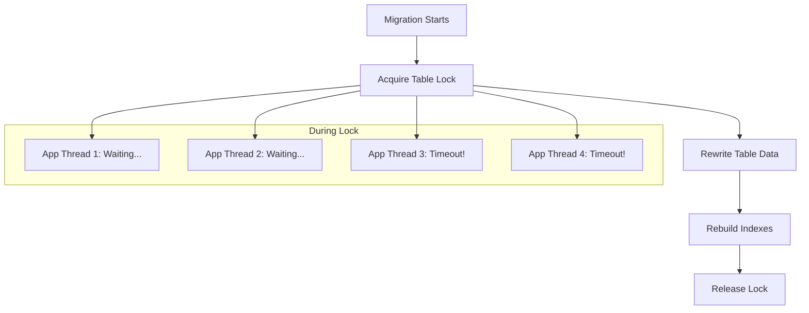
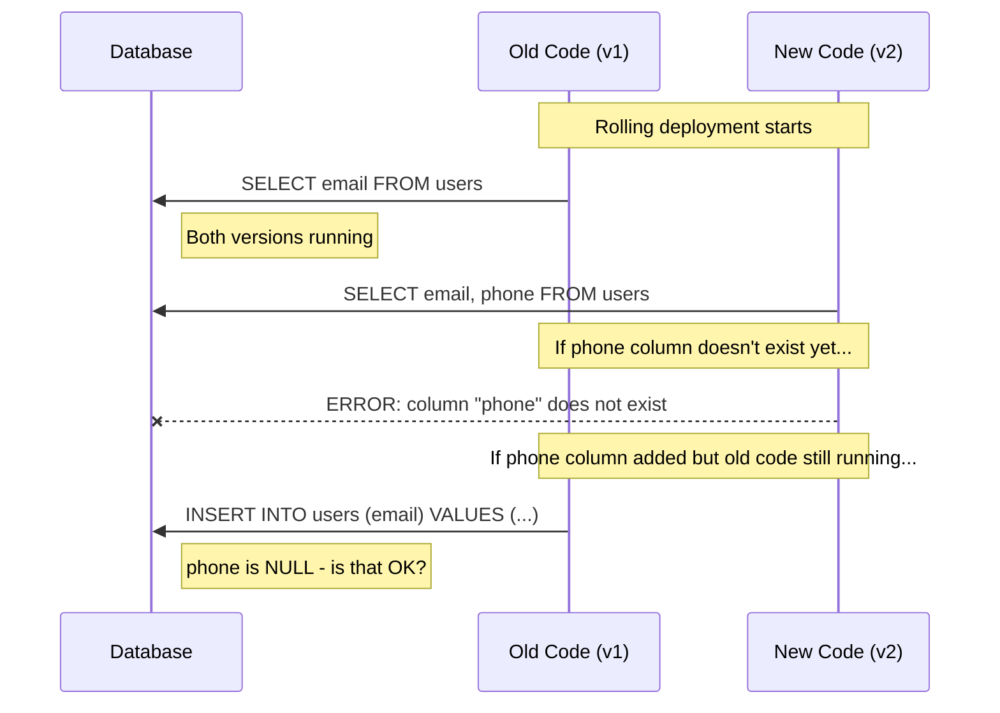
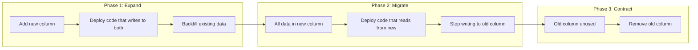
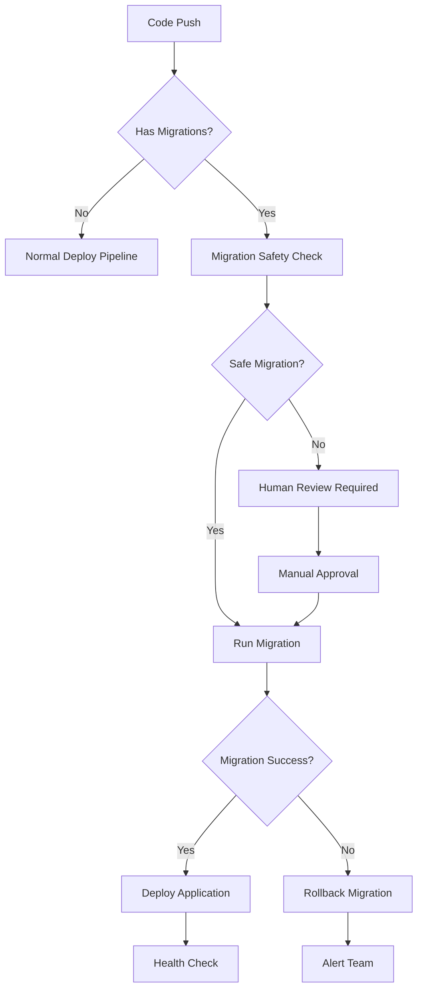

*[DDL]: Data Definition Language
*[CD]: Continuous Deployment
*[CI]: Continuous Integration
*[ORM]: Object-Relational Mapping
*[RDBMS]: Relational Database Management System
*[FK]: Foreign Key
*[PK]: Primary Key

# Database Migrations in CD Pipelines

## Introduction

Brief overview of why database migrations are the hardest part of continuous deployment: application code can roll back in seconds, but schema changes can take hours to reverse. This section frames the core tension—databases are stateful and shared, while CD assumes stateless and independent deployments. A migration that works in development can lock tables for minutes in production.

_Include a real scenario: a team adds a NOT NULL column to a 50-million row table during a deployment. The migration takes 4 minutes while holding a lock. During that window, all writes to the table queue up, timeouts cascade through the application, and users see errors. The team debates: do we wait it out, or do we roll back and make things worse?_

<Callout type="warning">
The biggest database migration failures happen when teams treat schema changes like application code. Schema changes need their own deployment strategy, rollback plan, and monitoring.
</Callout>

## Why Migrations Break Deployments

### The Lock Problem

Explain how database locks during DDL operations cause downtime.

```text
What happens during ALTER TABLE:

PostgreSQL (before version 11):
  ALTER TABLE users ADD COLUMN status VARCHAR(20);

  1. Acquire ACCESS EXCLUSIVE lock on table
  2. Rewrite entire table (50M rows = minutes)
  3. Release lock

  During steps 1-3:
  - All SELECTs block
  - All INSERTs block
  - All UPDATEs block
  - Application threads pile up
  - Connection pool exhausted
  - Cascading timeouts

MySQL (without pt-online-schema-change):
  Similar behavior - table locked during ALTER

Modern PostgreSQL (11+):
  Some ALTERs are fast (add nullable column)
  Others still require full table rewrite
```


Figure: Table lock during migration blocks all application threads.

### The Compatibility Window Problem

Explain the period during rolling deployments where old and new code run simultaneously.


Figure: Compatibility window during rolling deployment.

```text
The Compatibility Window:

Time 0:00 - Migration runs, adds 'phone' column
Time 0:01 - First new pod deployed, expects 'phone'
Time 0:02 - New pod queries successfully
Time 0:05 - Old pods still running (50% of traffic)
Time 0:10 - More new pods come up
Time 0:15 - Last old pod terminates
Time 0:15 - Rolling deployment complete

Problem: For 15 minutes, both old and new code run together.
- If you add column AFTER deploying new code: new code errors
- If you add column BEFORE old code is gone: old code might break
- If you remove column while old code still runs: old code errors

Solution: Schema must be compatible with BOTH versions
throughout the entire deployment window.
```

<Callout type="info">
During a rolling deployment, your database schema must be compatible with both the old and new versions of your application. This compatibility window can last from seconds to hours depending on your deployment strategy.
</Callout>

### Common Migration Failures

Catalog the ways migrations go wrong.

| Failure Mode | Cause | Symptom | Prevention |
|--------------|-------|---------|------------|
| Table lock timeout | Long-running ALTER | Application errors spike | Use online schema change tools |
| Column not found | Code deployed before migration | 500 errors on new pods | Deploy migration first |
| NOT NULL violation | Old code doesn't provide new column | Insert failures | Add column as nullable first |
| Foreign key violation | Data exists that violates new constraint | Migration fails | Clean data before constraint |
| Index creation timeout | Creating index on large table | Lock timeout | CREATE INDEX CONCURRENTLY |
| Rollback impossible | Destructive migration ran | Can't undo | Always write reversible migrations |

Table: Common migration failures and their prevention.

## The Expand-Contract Pattern

### Pattern Overview

Explain the fundamental pattern for safe schema changes.


Figure: Expand-contract pattern phases.

```text
Expand-Contract Example: Renaming 'email' to 'email_address'

Phase 1: EXPAND (Week 1)
  Migration: ADD COLUMN email_address VARCHAR(255)
  Code: Write to both email AND email_address
  Result: New column exists, data starts flowing in

Phase 2: MIGRATE (Week 1-2)
  Migration: UPDATE users SET email_address = email WHERE email_address IS NULL
  Code: Read from email_address, write to both
  Result: All rows have email_address populated

Phase 3: CONTRACT (Week 3)
  Code: Read and write only email_address
  Migration: DROP COLUMN email
  Result: Clean schema, no downtime at any point

Total time: 2-3 weeks for a "simple" rename
This is why you think carefully before renaming columns.
```

### Implementation Example

Provide concrete migration code for expand-contract.

```sql title="expand-phase-migration.sql"
-- Migration 001: Expand - Add new column
-- Safe: Adding nullable column is instant in PostgreSQL 11+

ALTER TABLE users ADD COLUMN email_address VARCHAR(255);

-- Create index concurrently (doesn't lock table)
CREATE INDEX CONCURRENTLY idx_users_email_address ON users(email_address);
```
Code: Phase 1 migration adding the new column.

```typescript title="expand-phase-code.ts"
// Application code during expand phase
// Writes to BOTH columns, reads from OLD column

class UserRepository {
  async createUser(data: CreateUserInput): Promise<User> {
    const result = await db.query(`
      INSERT INTO users (name, email, email_address)
      VALUES ($1, $2, $2)
      RETURNING *
    `, [data.name, data.email]);

    return this.mapToUser(result.rows[0]);
  }

  async updateEmail(userId: string, newEmail: string): Promise<void> {
    // Write to both columns
    await db.query(`
      UPDATE users
      SET email = $1, email_address = $1
      WHERE id = $2
    `, [newEmail, userId]);
  }

  async getUser(userId: string): Promise<User> {
    // Still read from old column during expand
    const result = await db.query(`
      SELECT id, name, email FROM users WHERE id = $1
    `, [userId]);

    return this.mapToUser(result.rows[0]);
  }
}
```
Code: Application code during expand phase—dual writes.

```sql title="migrate-phase-backfill.sql"
-- Migration 002: Backfill existing data
-- Run as background job, not blocking migration

-- For small tables:
UPDATE users SET email_address = email WHERE email_address IS NULL;

-- For large tables (millions of rows), batch it:
DO $$
DECLARE
  batch_size INT := 10000;
  rows_updated INT;
BEGIN
  LOOP
    UPDATE users
    SET email_address = email
    WHERE id IN (
      SELECT id FROM users
      WHERE email_address IS NULL
      LIMIT batch_size
    );

    GET DIAGNOSTICS rows_updated = ROW_COUNT;
    EXIT WHEN rows_updated = 0;

    -- Small sleep to reduce load
    PERFORM pg_sleep(0.1);

    RAISE NOTICE 'Updated % rows', rows_updated;
  END LOOP;
END $$;
```
Code: Backfill migration for large tables using batches.

```sql title="contract-phase-migration.sql"
-- Migration 003: Contract - Remove old column
-- Only run AFTER all application code uses email_address

-- First, verify no code uses old column (monitoring/logs)
-- Then drop:
ALTER TABLE users DROP COLUMN email;
```
Code: Phase 3 migration removing the old column.

<Callout type="success">
The expand-contract pattern is slower than a direct rename, but it guarantees zero downtime. Each phase can be deployed independently and rolled back without data loss.
</Callout>

## Safe Migration Patterns

### Adding Columns

```sql title="adding-columns-safely.sql"
-- ✅ SAFE: Adding nullable column (PostgreSQL 11+)
ALTER TABLE users ADD COLUMN phone VARCHAR(20);
-- Instant, no table rewrite

-- ✅ SAFE: Adding column with default (PostgreSQL 11+)
ALTER TABLE users ADD COLUMN status VARCHAR(20) DEFAULT 'active';
-- Instant, default stored in catalog not data

-- ❌ DANGEROUS: Adding NOT NULL without default
ALTER TABLE users ADD COLUMN phone VARCHAR(20) NOT NULL;
-- Fails if table has data, or requires table rewrite

-- ✅ SAFE: Add nullable first, then add constraint
ALTER TABLE users ADD COLUMN phone VARCHAR(20);
UPDATE users SET phone = 'unknown' WHERE phone IS NULL;
ALTER TABLE users ALTER COLUMN phone SET NOT NULL;
```
Code: Safe patterns for adding columns.

### Removing Columns

```sql title="removing-columns-safely.sql"
-- ❌ DANGEROUS: Direct drop while code might use it
ALTER TABLE users DROP COLUMN legacy_field;

-- ✅ SAFE: Expand-contract removal

-- Step 1: Stop code from using the column (code deploy)
-- Step 2: Wait for all old pods to terminate
-- Step 3: Verify column is unused (query logs)
-- Step 4: Drop column
ALTER TABLE users DROP COLUMN legacy_field;
```
Code: Safe pattern for removing columns.

### Renaming Columns

```sql title="renaming-columns-safely.sql"
-- ❌ DANGEROUS: Direct rename
ALTER TABLE users RENAME COLUMN email TO email_address;
-- Breaks all code instantly

-- ✅ SAFE: Expand-contract rename (3 deployments)

-- Deploy 1: Add new column
ALTER TABLE users ADD COLUMN email_address VARCHAR(255);

-- Deploy 2: Application writes to both, reads from old
-- Backfill: UPDATE users SET email_address = email WHERE email_address IS NULL;

-- Deploy 3: Application reads from new
-- After verification: ALTER TABLE users DROP COLUMN email;
```
Code: Safe pattern for renaming columns.

### Changing Column Types

```sql title="changing-types-safely.sql"
-- ❌ DANGEROUS: Direct type change
ALTER TABLE orders ALTER COLUMN amount TYPE DECIMAL(10,2);
-- May require table rewrite, blocks writes

-- ✅ SAFE: Expand-contract type change

-- Step 1: Add new column with new type
ALTER TABLE orders ADD COLUMN amount_decimal DECIMAL(10,2);

-- Step 2: Dual-write in application
-- Step 3: Backfill with conversion
UPDATE orders SET amount_decimal = amount::DECIMAL(10,2) WHERE amount_decimal IS NULL;

-- Step 4: Switch reads to new column
-- Step 5: Drop old column
ALTER TABLE orders DROP COLUMN amount;
ALTER TABLE orders RENAME COLUMN amount_decimal TO amount;
```
Code: Safe pattern for changing column types.

<Callout type="warning">
Column type changes are among the riskiest migrations. They often require table rewrites, can fail on data that doesn't convert cleanly, and affect indexes and foreign keys. Always use expand-contract.
</Callout>

### Adding Indexes

```sql title="adding-indexes-safely.sql"
-- ❌ DANGEROUS: Standard index creation
CREATE INDEX idx_users_email ON users(email);
-- Locks table for writes during creation

-- ✅ SAFE: Concurrent index creation (PostgreSQL)
CREATE INDEX CONCURRENTLY idx_users_email ON users(email);
-- Doesn't lock table, but takes longer
-- Note: Can't run inside a transaction

-- MySQL: Use pt-online-schema-change or gh-ost
-- pt-online-schema-change --alter "ADD INDEX idx_email (email)" D=mydb,t=users

-- Check index creation progress (PostgreSQL)
SELECT
  phase,
  round(100.0 * blocks_done / nullif(blocks_total, 0), 1) AS "% done",
  round(tuples_done / 1000000.0, 1) AS "millions of tuples done"
FROM pg_stat_progress_create_index;
```
Code: Safe index creation patterns.

### Adding Constraints

```sql title="adding-constraints-safely.sql"
-- ❌ DANGEROUS: Adding constraint that might fail
ALTER TABLE orders ADD CONSTRAINT fk_user
  FOREIGN KEY (user_id) REFERENCES users(id);
-- Fails if orphan data exists, locks both tables

-- ✅ SAFE: Validate data first, add constraint with NOVALIDATE

-- Step 1: Find violations
SELECT o.id, o.user_id
FROM orders o
LEFT JOIN users u ON o.user_id = u.id
WHERE u.id IS NULL;

-- Step 2: Fix or delete violations
DELETE FROM orders WHERE user_id NOT IN (SELECT id FROM users);

-- Step 3: Add constraint without validation (instant)
ALTER TABLE orders ADD CONSTRAINT fk_user
  FOREIGN KEY (user_id) REFERENCES users(id) NOT VALID;

-- Step 4: Validate constraint separately (can be slow but doesn't block)
ALTER TABLE orders VALIDATE CONSTRAINT fk_user;
```
Code: Safe pattern for adding foreign key constraints.

## Online Schema Change Tools

### Tool Comparison

Compare tools for non-blocking schema changes.

```yaml title="schema-change-tools.yaml"
postgresql:
  native:
    features:
      - "ADD COLUMN (nullable/default) - instant in 11+"
      - "CREATE INDEX CONCURRENTLY"
      - "ADD CONSTRAINT ... NOT VALID"
    limitations:
      - "Some ALTERs still require ACCESS EXCLUSIVE lock"
      - "No tool for general online DDL"

  pgroll:
    vendor: "Xata"
    approach: "Expand-contract automation"
    features:
      - "Automatic dual-write triggers"
      - "Progressive rollout"
      - "CLI-driven migrations"
    limitations:
      - "Newer tool, smaller community"

mysql:
  pt_online_schema_change:
    vendor: "Percona"
    approach: "Shadow table + triggers"
    features:
      - "Battle-tested"
      - "Works with replication"
    limitations:
      - "Requires disk space for shadow table"
      - "Triggers add overhead"

  gh_ost:
    vendor: "GitHub"
    approach: "Shadow table + binlog streaming"
    features:
      - "No triggers (less overhead)"
      - "Pausable/resumable"
      - "Production-safe"
    limitations:
      - "Requires binlog access"
      - "More complex setup"
```
Code: Online schema change tools by database.

### Using gh-ost

```bash title="gh-ost-example.sh"
# Add column to large MySQL table without locking

gh-ost \
  --host=mysql-primary.example.com \
  --database=myapp \
  --table=users \
  --alter="ADD COLUMN phone VARCHAR(20)" \
  --allow-on-master \
  --chunk-size=1000 \
  --max-load=Threads_running=25 \
  --critical-load=Threads_running=100 \
  --execute

# Options explained:
# --chunk-size: Rows to copy per iteration
# --max-load: Pause if this load threshold exceeded
# --critical-load: Abort if this load threshold exceeded
# --execute: Actually run (vs --dry-run)

# Monitor progress:
# gh-ost creates a socket file for control
echo "status" | nc -U /tmp/gh-ost.myapp.users.sock
```
Code: gh-ost example for online MySQL schema change.

<Callout type="info">
gh-ost and pt-online-schema-change work by creating a shadow table, copying data in chunks, applying changes via triggers or binlog, then swapping tables atomically. This is slower but doesn't lock.
</Callout>

## CI/CD Pipeline Integration

### Migration Pipeline Design


Figure: Migration-aware deployment pipeline.

### Separating Migration and Application Deploys

```yaml title="migration-pipeline.yaml"
# .github/workflows/deploy.yaml
name: Deploy

on:
  push:
    branches: [main]

jobs:
  detect-changes:
    runs-on: ubuntu-latest
    outputs:
      has_migrations: ${{ steps.changes.outputs.migrations }}
      has_code: ${{ steps.changes.outputs.code }}
    steps:
      - uses: actions/checkout@v4
      - uses: dorny/paths-filter@v2
        id: changes
        with:
          filters: |
            migrations:
              - 'migrations/**'
            code:
              - 'src/**'
              - 'package.json'

  run-migrations:
    needs: detect-changes
    if: needs.detect-changes.outputs.has_migrations == 'true'
    runs-on: ubuntu-latest
    steps:
      - uses: actions/checkout@v4

      - name: Safety check migrations
        run: ./scripts/check-migration-safety.sh

      - name: Run migrations
        run: npm run migrate
        env:
          DATABASE_URL: ${{ secrets.DATABASE_URL }}

      - name: Verify migration
        run: npm run migrate:verify

  deploy-application:
    needs: [detect-changes, run-migrations]
    if: |
      always() &&
      needs.detect-changes.outputs.has_code == 'true' &&
      (needs.run-migrations.result == 'success' || needs.run-migrations.result == 'skipped')
    runs-on: ubuntu-latest
    steps:
      - name: Deploy to Kubernetes
        run: kubectl apply -f k8s/
```
Code: Separate migration and application deployment jobs.

### Migration Safety Checks

```bash title="check-migration-safety.sh"
#!/bin/bash
# check-migration-safety.sh - Automated migration safety analysis

set -e

MIGRATION_DIR="./migrations"
UNSAFE_PATTERNS=(
  "DROP COLUMN"
  "DROP TABLE"
  "RENAME COLUMN"
  "ALTER.*TYPE"
  "NOT NULL"
  "DROP INDEX"
  "TRUNCATE"
)

NEEDS_REVIEW=false

for pattern in "${UNSAFE_PATTERNS[@]}"; do
  if grep -r -i "$pattern" "$MIGRATION_DIR"/*.sql 2>/dev/null; then
    echo "⚠️  Found potentially unsafe pattern: $pattern"
    NEEDS_REVIEW=true
  fi
done

if [ "$NEEDS_REVIEW" = true ]; then
  echo ""
  echo "❌ Migration requires human review before deployment"
  echo "Please ensure expand-contract pattern is followed"
  exit 1
else
  echo "✅ Migration passes automated safety checks"
fi
```
Code: Automated migration safety check script.

<Callout type="warning">
Automated checks catch obvious issues, but they can't understand context. A DROP COLUMN might be the final step of a well-planned expand-contract migration, or it might be a disaster. Human review is still essential for destructive operations.
</Callout>

### Rollback Strategy

```yaml title="rollback-strategy.yaml"
migration_rollback:
  reversible_migrations:
    description: "Migrations that can be automatically reversed"
    examples:
      - "ADD COLUMN → DROP COLUMN"
      - "CREATE INDEX → DROP INDEX"
      - "ADD CONSTRAINT → DROP CONSTRAINT"
    implementation: |
      # Most migration tools support down migrations
      npm run migrate:rollback

  irreversible_migrations:
    description: "Migrations that cannot be automatically reversed"
    examples:
      - "DROP COLUMN (data lost)"
      - "DROP TABLE (data lost)"
      - "Data backfill (no inverse)"
    strategy:
      - "Take backup before migration"
      - "Document manual rollback steps"
      - "Test rollback in staging"

  forward_fix:
    description: "When rollback isn't possible, fix forward"
    when:
      - "Migration already ran in production"
      - "Rollback would lose data"
      - "Rollback would take too long"
    approach:
      - "Deploy code fix that handles both states"
      - "Run corrective migration"
```
Code: Migration rollback strategies.

## Migration Framework Configuration

### Prisma Migrations

```typescript title="prisma-migration-config.ts"
// prisma/schema.prisma
generator client {
  provider = "prisma-client-js"
}

datasource db {
  provider = "postgresql"
  url      = env("DATABASE_URL")
}

model User {
  id           String   @id @default(uuid())
  email        String   @unique
  emailAddress String?  @map("email_address") // Expand phase
  name         String
  createdAt    DateTime @default(now()) @map("created_at")
  updatedAt    DateTime @updatedAt @map("updated_at")

  @@map("users")
}
```
Code: Prisma schema during expand-contract migration.

```bash title="prisma-commands.sh"
# Generate migration from schema changes
npx prisma migrate dev --name add_email_address

# Apply migrations in production
npx prisma migrate deploy

# Check migration status
npx prisma migrate status

# Reset database (development only!)
npx prisma migrate reset
```
Code: Prisma migration commands.

### TypeORM Migrations

```typescript title="typeorm-migration.ts"
// migrations/1705312000000-AddEmailAddress.ts
import { MigrationInterface, QueryRunner } from 'typeorm';

export class AddEmailAddress1705312000000 implements MigrationInterface {
  name = 'AddEmailAddress1705312000000';

  public async up(queryRunner: QueryRunner): Promise<void> {
    // Expand phase: Add new column
    await queryRunner.query(`
      ALTER TABLE "users" ADD COLUMN "email_address" VARCHAR(255)
    `);

    // Create index concurrently (PostgreSQL specific)
    await queryRunner.query(`
      CREATE INDEX CONCURRENTLY "idx_users_email_address" ON "users"("email_address")
    `);
  }

  public async down(queryRunner: QueryRunner): Promise<void> {
    await queryRunner.query(`DROP INDEX "idx_users_email_address"`);
    await queryRunner.query(`ALTER TABLE "users" DROP COLUMN "email_address"`);
  }
}
```
Code: TypeORM migration with expand pattern.

### Flyway Migrations

```sql title="flyway-migration.sql"
-- V1.2__add_email_address.sql
-- Flyway migration for expand phase

-- Add nullable column (safe)
ALTER TABLE users ADD COLUMN email_address VARCHAR(255);

-- Create index concurrently
CREATE INDEX CONCURRENTLY idx_users_email_address ON users(email_address);

-- Note: Flyway doesn't support undo by default
-- For rollback, create a separate migration:
-- U1.2__add_email_address.sql (if using Flyway Teams)
```
Code: Flyway SQL migration file.

<Callout type="info">
Most ORM migration tools generate migrations from schema diffs. These generated migrations often need manual review and adjustment to follow safe migration patterns like expand-contract.
</Callout>

## Monitoring Migrations

### Migration Metrics

```yaml title="migration-metrics.yaml"
metrics_to_track:
  migration_duration:
    description: "How long each migration takes"
    alert_threshold: "> 60 seconds for any single migration"

  lock_wait_time:
    description: "Time queries spend waiting for migration locks"
    query: |
      SELECT
        pid,
        now() - pg_stat_activity.query_start AS duration,
        query
      FROM pg_stat_activity
      WHERE wait_event_type = 'Lock'
    alert_threshold: "> 5 seconds"

  blocked_queries:
    description: "Number of queries blocked during migration"
    alert_threshold: "> 10 queries blocked"

  application_errors:
    description: "Error rate during/after migration"
    alert_threshold: "> baseline + 5%"

  replication_lag:
    description: "If using read replicas, monitor lag"
    alert_threshold: "> 30 seconds"
```
Code: Migration monitoring metrics.

### Pre-Migration Checklist

```yaml title="pre-migration-checklist.yaml"
before_production_migration:
  verify_staging:
    - "Migration ran successfully in staging"
    - "Application works with new schema"
    - "Rollback tested in staging"

  check_database_state:
    - "No long-running transactions"
    - "Replication lag is minimal"
    - "Sufficient disk space"
    - "Recent backup exists"

  check_timing:
    - "Not during peak traffic"
    - "Team available to monitor"
    - "No other deployments in progress"

  prepare_rollback:
    - "Rollback script tested"
    - "Rollback estimated time known"
    - "Decision criteria for rollback defined"
```
Code: Pre-migration checklist for production deployments.

## Conclusion

Summarize the key principles: database migrations require their own deployment strategy separate from application code; the expand-contract pattern enables zero-downtime changes by maintaining backward compatibility; online schema change tools prevent lock-related downtime; and monitoring and rollback planning are essential. Emphasize that the goal is to make schema changes as safe and routine as application deployments, even though they require more planning.

<Callout type="success">
Zero-downtime migrations aren't about clever tricks—they're about patience. The expand-contract pattern works because it decomposes one risky change into multiple safe changes. Accept that a "simple rename" takes three deployments and you'll never have a migration-induced outage.
</Callout>

---

## Cover Prompt

### Prompt 1: The Gradual Transform

Create an image of a database table transforming like a caterpillar into a butterfly, but in stages. Each stage is visible—cocoon phases representing expand, migrate, contract. The transformation happens without disrupting the data particles flowing through it. Style: metamorphosis visualization, organic meets digital, warm transformation colors, 16:9 aspect ratio.

### Prompt 2: The Bridge Construction

Design an image of workers building a new bridge lane next to an existing one while traffic continues flowing. The old lane is labeled "old schema," the new lane "new schema." Traffic (data) flows uninterrupted. Style: engineering blueprint aesthetic, infrastructure metaphor, clean lines, blue and orange highlights, 16:9 aspect ratio.

### Prompt 3: The Surgical Precision

Illustrate a surgical operation on a beating heart (database), with surgeons (migration tools) carefully making changes while monitors show stable vital signs (uptime metrics). The heart continues beating throughout. Style: medical precision imagery, dramatic operating room lighting, blue surgical tones, 16:9 aspect ratio.

### Prompt 4: The Train Track Switch

Create an image of a train track switching mechanism, smoothly redirecting traffic from old tracks to new tracks without stopping the trains. Some trains are on old tracks, some on new, during the transition. Signals show green. Style: railway infrastructure, mechanical precision, motion blur on trains, 16:9 aspect ratio.

### Prompt 5: The Locksmith's Patience

Design an image of a master locksmith carefully replacing the lock on a door while the door remains functional. Old lock components sit neatly organized, new components being installed. A sign shows "Open During Renovation." Style: craftsman precision, detailed mechanical work, warm workshop lighting, 16:9 aspect ratio.
