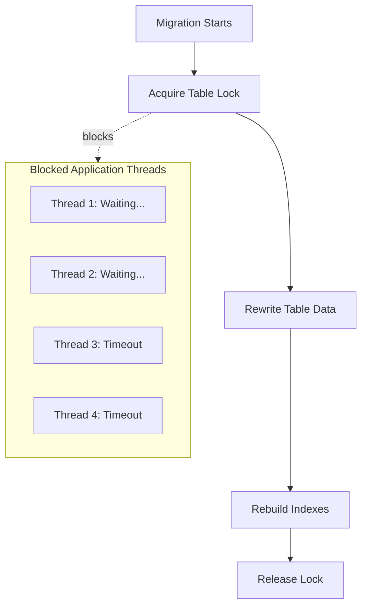
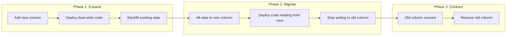

*[DDL]: Data Definition Language
*[CD]: Continuous Deployment
*[ORM]: Object-Relational Mapping

Application code can roll back in seconds. Schema changes can take hours to reverse—if they're reversible at all. That asymmetry makes database migrations the hardest part of continuous deployment.

The core tension: CD assumes stateless, independent deployments. Databases are stateful and shared. Your application runs across multiple pods that can be replaced atomically, but every instance talks to the same database. A migration that takes 200ms on your development dataset can lock tables for four minutes against 50 million production rows. During that window, writes queue up, connection pools exhaust, timeouts cascade, and users see errors.

I've watched teams debate mid-incident: do we wait out the lock, or roll back and make things worse? Neither option is good once you're in that situation. The answer is to never get there—to treat migrations as a distinct deployment concern with their own safety patterns.

## Why Migrations Break Deployments

### The Lock Problem

Most DDL operations acquire exclusive locks. While you hold that lock, every other query on that table waits—reads, writes, everything. On a small table, nobody notices. On a table with tens of millions of rows, the lock can persist for minutes while the database rewrites data or rebuilds indexes.

Here's what happens when you run `ALTER TABLE users ADD COLUMN status VARCHAR(20) DEFAULT 'active'` on older PostgreSQL (pre-11): the database acquires an ACCESS EXCLUSIVE lock, rewrites the entire table to add the column with the default value, rebuilds indexes, then finally releases the lock. During that rewrite, every application thread trying to touch that table blocks. Connection pools fill up with waiting queries. Those queries eventually timeout. The timeouts cascade through your application as dependent operations fail.

Modern PostgreSQL (11+) made some operations instant—adding a nullable column or a column with a default no longer rewrites the table. But plenty of operations still require rewrites: changing column types, adding NOT NULL constraints to existing columns, certain index operations. Here's how that blocking cascade looks:


Figure: Table lock during migration blocks all application threads.

### The Compatibility Window Problem

Rolling deployments mean old and new code run simultaneously. During a typical Kubernetes deployment, you might have 15 minutes where half your pods run v1 and half run v2. Your schema needs to work with both versions throughout that window.

The timing creates a catch-22. Add a column _after_ deploying new code and the new code errors because the column doesn't exist. Add a column _before_ old code terminates and the old code might fail if it doesn't expect the column. Remove a column while old code still runs and the old code errors immediately.

The solution is that every schema change must be backward-compatible. The schema after your migration must work with both the old application version and the new one. This constraint drives the patterns in this article.

### Common Migration Failures

These failure modes appear repeatedly across teams:

| Failure Mode | Cause | Prevention |
|--------------|-------|------------|
| Table lock timeout | Long-running ALTER | Non-locking DDL or live schema tools |
| Column not found | Code deployed before migration | Deploy migration first |
| NOT NULL violation | Old code doesn't provide new column | Add column as nullable first |
| Foreign key violation | Data violates new constraint | Clean data before constraint |
| Rollback impossible | Destructive migration ran | Always write reversible migrations |

Table: Common migration failures and their prevention.

The theme across all of these: migrations fail when they assume atomic, instantaneous changes in a system that's actually gradual and concurrent. The fix is always some form of phased rollout.

## The Expand-Contract Pattern

The expand-contract pattern (sometimes called parallel change) is the fundamental technique for zero-downtime schema changes. Instead of making one risky change, you decompose it into multiple safe changes that maintain backward compatibility at every step.

The pattern has three phases:

1. _Expand_: Add the new structure alongside the old. Both exist simultaneously. Deploy application code that writes to both structures but still reads from the old one.

2. _Migrate_: Backfill existing data into the new structure. Once complete, deploy code that reads from the new structure (still writing to both for safety).

3. _Contract_: Remove the old structure. Deploy code that only uses the new structure, then drop the old column or table.


Figure: Expand-contract pattern phases.

### A Concrete Example

Let's trace through renaming a column from `email` to `email_address`. A direct `ALTER TABLE RENAME COLUMN` would break every query referencing the old name instantly. Here's the expand-contract approach:

_Week 1 (Expand)_: Run a migration to add the `email_address` column. Deploy code that writes to both columns on every insert and update, but still reads from `email`. At this point, new rows have both columns populated; old rows only have `email`.

_Week 2 (Migrate)_: Run a backfill job to copy `email` values to `email_address` for existing rows. Once complete, deploy code that reads from `email_address` instead of `email`. Keep writing to both columns—old pods might still be running.

_Week 3 (Contract)_: After all old pods are gone and you've verified nothing reads `email`, deploy code that only uses `email_address`. Then run a migration to drop the `email` column.

Total time: 2-3 weeks for a "simple" rename. This is why you think carefully before renaming columns in production.

Here's the application code during the expand phase—the dual-write pattern:

```ruby title="expand-phase-dual-write.rb"
# app/services/users/repository.rb
# Writes to BOTH columns, reads from OLD column

class Users::Repository
  def create_user(params)
    User.create!(
      name: params[:name],
      email: params[:email],
      email_address: params[:email]
    )
  end

  def update_email(user, new_email)
    user.update!(email: new_email, email_address: new_email)
  end

  def fetch_user(id)
    # Still read from old column during expand phase
    User.select(:id, :name, :email).find(id)
  end
end
```
Code: Dual-write pattern during the expand phase.

<Callout type="success">
The expand-contract pattern is slower than a direct rename, but it guarantees zero downtime. Each phase can be deployed independently and rolled back without data loss.
</Callout>

## Quick Reference for Common Operations

Now that you understand the fundamental pattern, here's a quick reference for common schema changes. Each follows expand-contract principles, though some operations have database-specific shortcuts that let you skip phases safely.

### Adding Columns

Modern PostgreSQL (11+) makes this easy. Adding a nullable column or a column with a default is instant—the default is stored in the catalog, not written to every row. The danger is adding NOT NULL without a default, which requires a table scan.

Safe approach: add nullable first, backfill values, then add the NOT NULL constraint.

### Removing Columns

This is where teams most often skip safety steps. The column seems unused, so why not just drop it? Because "seems unused" and "is unused" are different things. I've seen teams drop columns still referenced by scheduled jobs, reporting queries, or microservices nobody remembered existed.

Safe approach: stop code from using the column, wait for all old pods to terminate, verify the column is unused via query logs, _then_ drop it.

### Renaming Columns

There's no safe way to rename a column in one step. The moment the name changes, every query using the old name fails. The expand-contract approach is the only option: add the new column, dual-write, backfill, switch reads, drop the old column.

Yes, this means a "simple" rename takes three separate deployments spread over days or weeks. Factor this into your planning when naming columns—getting it right the first time saves significant effort later.

### Adding Indexes

Index creation on large tables can lock writes for minutes or hours. PostgreSQL's `CREATE INDEX CONCURRENTLY` option avoids this—it doesn't lock the table but takes longer because it handles concurrent writes during the build. MySQL lacks a native non-locking option, so you'll need external tools like gh-ost or pt-online-schema-change to add indexes without blocking writes.

### Adding Constraints

Foreign key constraints are particularly tricky because they lock _both_ tables and require scanning all existing data. PostgreSQL's NOT VALID approach separates these concerns: add the constraint without validating existing data (instant), then validate as a separate non-blocking operation.

<Callout type="warning">
The biggest migration failures happen when teams treat schema changes like application code. A code deploy that fails just rolls back. A migration that fails might leave your database in a state that neither the old code nor the new code can handle.
</Callout>

## Conclusion

Database migrations don't have to be the scariest part of your deployment pipeline. The expand-contract pattern transforms risky schema changes into routine operations by decomposing one dangerous change into multiple safe ones.

The core principles: give migrations their own safety gates separate from application code. Maintain backward compatibility so old and new code can coexist during rolling deployments. Use non-blocking DDL operations wherever possible. Always have a rollback plan. And accept that a "simple rename" taking three deployments is the cost of never having a migration-induced outage.

---

CTA_TITLE: Want the Complete Implementation Guide?

CTA_BODY: This article covers the fundamentals of zero-downtime migrations. The full guide goes deeper with CI/CD pipeline integration patterns, automated safety checks that gate dangerous migrations for human review, live schema change tools like gh-ost and pt-online-schema-change for MySQL, framework-specific configuration across Rails, Django, Laravel, and .NET, plus production monitoring strategies and pre-migration checklists. Download the complete PDF to get the full implementation playbook.
