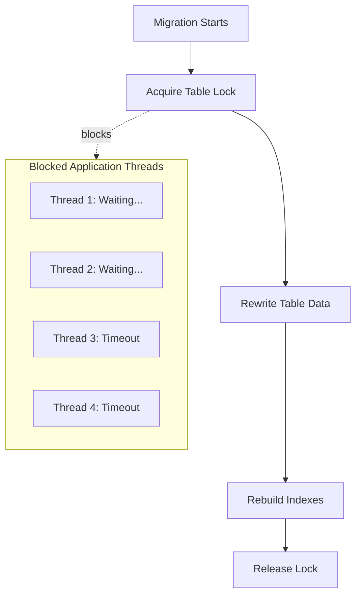
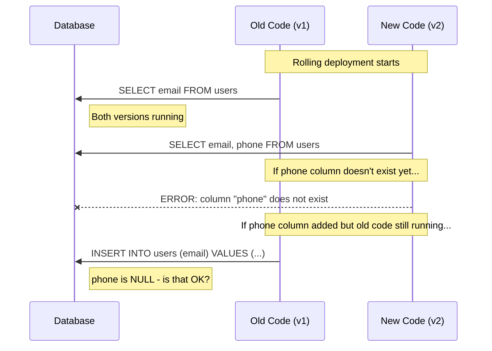
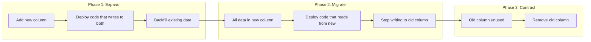
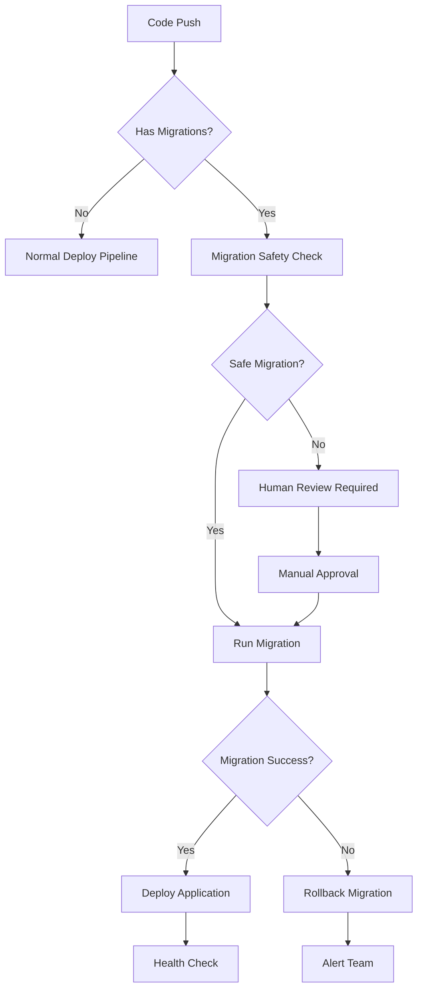

*[DDL]: Data Definition Language
*[CD]: Continuous Deployment
*[CI]: Continuous Integration
*[ORM]: Object-Relational Mapping
*[RDBMS]: Relational Database Management System
*[FK]: Foreign Key
*[PK]: Primary Key

Application code can roll back in seconds. Schema changes can take hours to reverse—if they're reversible at all. That asymmetry makes database migrations the hardest part of continuous deployment.

The core tension: CD assumes stateless, independent deployments. Databases are stateful and shared. Your application runs across multiple pods that can be replaced atomically, but every instance talks to the same database. A migration that takes 200ms on your development dataset can lock tables for four minutes against 50 million production rows. During that window, writes queue up, connection pools exhaust, timeouts cascade, and users see errors.

I've watched teams debate mid-incident: do we wait out the lock, or roll back and make things worse? Neither option is good once you're in that situation. The answer is to never get there—to treat migrations as a distinct deployment concern with their own safety patterns, rollback strategies, and monitoring.

This article covers why migrations fail, how to decompose risky changes into safe ones, and how to build pipelines that make zero-downtime the default.

<Callout type="warning">
The biggest migration failures happen when teams treat schema changes like application code. A code deploy that fails just rolls back to the previous version. A migration that fails might leave your database in a state that neither the old code nor the new code can handle.
</Callout>

## Why Migrations Break Deployments

### The Lock Problem

Most DDL operations acquire exclusive locks. While you hold that lock, every other query on that table waits—reads, writes, everything. On a small table, nobody notices. On a table with tens of millions of rows, the lock can persist for minutes while the database rewrites data or rebuilds indexes.

Here's what happens when you run `ALTER TABLE users ADD COLUMN status VARCHAR(20) DEFAULT 'active'` on older PostgreSQL (pre-11):

1. Database acquires ACCESS EXCLUSIVE lock on `users`
2. Database rewrites entire table to add the column with default value
3. Database rebuilds indexes
4. Lock releases

During steps 1-3, every application thread trying to touch that table blocks. Connection pools fill up with waiting queries. Those queries eventually timeout. The timeouts cascade through your application as dependent operations fail. Users see errors.

Modern PostgreSQL (11+) made some operations instant—adding a nullable column or a column with a default no longer rewrites the table. But plenty of operations still require rewrites: changing column types, adding NOT NULL constraints to existing columns, certain index operations. MySQL has similar behavior without online schema change tools.


Figure: Table lock during migration blocks all application threads.

### The Compatibility Window Problem

Rolling deployments mean old and new code run simultaneously. During a typical Kubernetes deployment, you might have 15 minutes where half your pods run v1 and half run v2. Your schema needs to work with both versions throughout that window.


Figure: Compatibility window during rolling deployment.

The timing creates a catch-22:

- Add column _after_ deploying new code: new code errors because column doesn't exist
- Add column _before_ old code terminates: old code might fail if it doesn't expect the column
- Remove column while old code still runs: old code errors immediately

The solution is that every schema change must be backward-compatible. The schema after your migration must work with both the old application version and the new one. This constraint drives most of the patterns in this article.

<Callout type="info">
The compatibility window can last from seconds (blue-green deployments with instant cutover) to hours (canary deployments with gradual traffic shift). Design your migrations for the longest window you might encounter.
</Callout>

### Common Migration Failures

These are the failure modes I see repeatedly:

| Failure Mode | Cause | Symptom | Prevention |
|--------------|-------|---------|------------|
| Table lock timeout | Long-running ALTER | Application errors spike | Non-locking DDL tools (gh-ost, pt-osc) |
| Column not found | Code deployed before migration | 500 errors on new pods | Deploy migration first |
| NOT NULL violation | Old code doesn't provide new column | Insert failures | Add column as nullable first |
| Foreign key violation | Data exists that violates new constraint | Migration fails | Clean data before constraint |
| Index creation timeout | Creating index on large table | Lock timeout | CREATE INDEX CONCURRENTLY |
| Rollback impossible | Destructive migration ran | Can't undo | Always write reversible migrations |

Table: Common migration failures and their prevention.

The theme across all of these: migrations fail when they assume atomic, instantaneous changes in a system that's actually gradual and concurrent. The fix is always some form of phased rollout—expand first, then contract.

## The Expand-Contract Pattern

### Pattern Overview

The expand-contract pattern (sometimes called parallel change) is the fundamental technique for zero-downtime schema changes. Instead of making one risky change, you decompose it into multiple safe changes that maintain backward compatibility at every step.

The pattern has three phases:

1. _Expand_: Add the new structure alongside the old. Both exist simultaneously. Deploy application code that writes to both structures but still reads from the old one.

2. _Migrate_: Backfill existing data into the new structure. Once complete, deploy code that reads from the new structure (still writing to both for safety).

3. _Contract_: Remove the old structure. Deploy code that only uses the new structure, then drop the old column/table.


Figure: Expand-contract pattern phases.

Let's trace through a concrete example: renaming a column from `email` to `email_address`. A direct `ALTER TABLE RENAME COLUMN` would break every query referencing the old name instantly. Here's the expand-contract approach:

_Week 1 (Expand)_: Run migration to add `email_address` column. Deploy code that writes to both columns on every insert and update, but still reads from `email`. At this point, new rows have both columns populated; old rows only have `email`.

_Week 1-2 (Migrate)_: Run backfill job to copy `email` values to `email_address` for existing rows. Once complete, deploy code that reads from `email_address` instead of `email`. Keep writing to both columns—old pods might still be running.

_Week 3 (Contract)_: After all old pods are gone and you've verified nothing reads `email`, deploy code that only uses `email_address`. Then run migration to drop the `email` column.

Total time: 2-3 weeks for a "simple" rename. This is why you think carefully before renaming columns in production.

### Implementation Example

Here's the concrete code for each phase. First, the expand migration:

```sql title="expand-phase-migration.sql"
-- Migration 001: Expand - Add new column
-- Safe: Adding nullable column is instant in PostgreSQL 11+

ALTER TABLE users ADD COLUMN email_address VARCHAR(255);

-- Create index concurrently (doesn't lock table)
CREATE INDEX CONCURRENTLY idx_users_email_address ON users(email_address);
```
Code: Phase 1 migration adding the new column.

```typescript title="expand-phase-code.ts"
// Application code during expand phase
// Writes to BOTH columns, reads from OLD column

class UserRepository {
  async createUser(data: CreateUserInput): Promise<User> {
    const result = await db.query(`
      INSERT INTO users (name, email, email_address)
      VALUES ($1, $2, $2)
      RETURNING *
    `, [data.name, data.email]);

    return this.mapToUser(result.rows[0]);
  }

  async updateEmail(userId: string, newEmail: string): Promise<void> {
    // Write to both columns
    await db.query(`
      UPDATE users
      SET email = $1, email_address = $1
      WHERE id = $2
    `, [newEmail, userId]);
  }

  async getUser(userId: string): Promise<User> {
    // Still read from old column during expand
    const result = await db.query(`
      SELECT id, name, email FROM users WHERE id = $1
    `, [userId]);

    return this.mapToUser(result.rows[0]);
  }
}
```
Code: Application code during expand phase—dual writes.

```sql title="migrate-phase-backfill.sql"
-- Migration 002: Backfill existing data
-- Run as background job, not blocking migration

-- For small tables:
UPDATE users SET email_address = email WHERE email_address IS NULL;

-- For large tables (millions of rows), batch it:
DO $$
DECLARE
  batch_size INT := 10000;
  rows_updated INT;
BEGIN
  LOOP
    UPDATE users
    SET email_address = email
    WHERE id IN (
      SELECT id FROM users
      WHERE email_address IS NULL
      LIMIT batch_size
    );

    GET DIAGNOSTICS rows_updated = ROW_COUNT;
    EXIT WHEN rows_updated = 0;

    -- Small sleep to reduce load
    PERFORM pg_sleep(0.1);

    RAISE NOTICE 'Updated % rows', rows_updated;
  END LOOP;
END $$;
```
Code: Backfill migration for large tables using batches.

```sql title="contract-phase-migration.sql"
-- Migration 003: Contract - Remove old column
-- Only run AFTER all application code uses email_address

-- First, verify no code uses old column (monitoring/logs)
-- Then drop:
ALTER TABLE users DROP COLUMN email;
```
Code: Phase 3 migration removing the old column.

<Callout type="success">
The expand-contract pattern is slower than a direct rename, but it guarantees zero downtime. Each phase can be deployed independently and rolled back without data loss.
</Callout>

Some teams use database views as an additional compatibility layer during migrations. A view can expose the old column name while the underlying table uses the new name, letting legacy code work without modification. Feature flags at the application layer can also control which schema path code takes, though this adds complexity and should be cleaned up once the migration completes.

## Safe Migration Patterns

Now that we've covered the fundamental pattern, here's a quick reference for common schema changes. Each pattern follows expand-contract principles, but some operations have database-specific shortcuts that are safe to use directly.

### Adding Columns

Adding columns is the most common migration, and modern databases have made the safe path easy:

```sql title="adding-columns-safely.sql"
-- ✅ SAFE: Adding nullable column (PostgreSQL 11+)
ALTER TABLE users ADD COLUMN phone VARCHAR(20);
-- Instant, no table rewrite

-- ✅ SAFE: Adding column with default (PostgreSQL 11+)
ALTER TABLE users ADD COLUMN status VARCHAR(20) DEFAULT 'active';
-- Instant, default stored in catalog not data

-- ❌ DANGEROUS: Adding NOT NULL without default
ALTER TABLE users ADD COLUMN phone VARCHAR(20) NOT NULL;
-- Fails if table has data, or requires table rewrite

-- ✅ SAFE: Add nullable first, then add constraint
ALTER TABLE users ADD COLUMN phone VARCHAR(20);
UPDATE users SET phone = 'unknown' WHERE phone IS NULL;
ALTER TABLE users ALTER COLUMN phone SET NOT NULL;
```
Code: Safe patterns for adding columns.

The key insight: PostgreSQL 11+ and recent MySQL versions store defaults in the catalog rather than rewriting every row. Adding a nullable column or a column with a default is now instant regardless of table size. But adding NOT NULL without a default still requires a table scan.

### Removing Columns

Removal is where teams most often skip the safety steps. The column seems unused, so why not just drop it?

```sql title="removing-columns-safely.sql"
-- ❌ DANGEROUS: Direct drop while code might use it
ALTER TABLE users DROP COLUMN legacy_field;

-- ✅ SAFE: Expand-contract removal

-- Step 1: Stop code from using the column (code deploy)
-- Step 2: Wait for all old pods to terminate
-- Step 3: Verify column is unused (query logs)
-- Step 4: Drop column
ALTER TABLE users DROP COLUMN legacy_field;
```
Code: Safe pattern for removing columns.

The "verify column is unused" step is critical. I've seen teams drop columns that were still referenced by scheduled jobs, reporting queries, or that one microservice nobody remembered existed. Query your database logs or enable query sampling before the drop.

### Renaming Columns

There's no safe way to rename a column in one step. The moment the name changes, every query using the old name fails.

```sql title="renaming-columns-safely.sql"
-- ❌ DANGEROUS: Direct rename
ALTER TABLE users RENAME COLUMN email TO email_address;
-- Breaks all code instantly

-- ✅ SAFE: Expand-contract rename (3 deployments)

-- Deploy 1: Add new column
ALTER TABLE users ADD COLUMN email_address VARCHAR(255);

-- Deploy 2: Application writes to both, reads from old
-- Backfill: UPDATE users SET email_address = email WHERE email_address IS NULL;

-- Deploy 3: Application reads from new
-- After verification: ALTER TABLE users DROP COLUMN email;
```
Code: Safe pattern for renaming columns.

Yes, this means a "simple" rename takes three separate deployments spread over days or weeks. That's the cost of zero-downtime schema changes. Factor this into your planning when naming columns—getting it right the first time saves significant effort later.

### Changing Column Types

Type changes combine the risks of renames (code compatibility) with the risks of rewrites (locking). They're the highest-risk common migration.

```sql title="changing-types-safely.sql"
-- ❌ DANGEROUS: Direct type change
ALTER TABLE orders ALTER COLUMN amount TYPE DECIMAL(10,2);
-- May require table rewrite, blocks writes

-- ✅ SAFE: Expand-contract type change

-- Step 1: Add new column with new type
ALTER TABLE orders ADD COLUMN amount_decimal DECIMAL(10,2);

-- Step 2: Dual-write in application
-- Step 3: Backfill with conversion
UPDATE orders SET amount_decimal = amount::DECIMAL(10,2) WHERE amount_decimal IS NULL;

-- Step 4: Switch reads to new column
-- Step 5: Drop old column
ALTER TABLE orders DROP COLUMN amount;
ALTER TABLE orders RENAME COLUMN amount_decimal TO amount;
```
Code: Safe pattern for changing column types.

<Callout type="warning">
The backfill step can fail if data doesn't convert cleanly. Test the conversion query against production data (or a recent copy) before running the migration. A failed conversion mid-backfill leaves you with partially migrated data.
</Callout>

### Adding Indexes

Index creation on large tables can lock writes for minutes or hours. Every database has a way to avoid this:

```sql title="adding-indexes-safely.sql"
-- ❌ DANGEROUS: Standard index creation
CREATE INDEX idx_users_email ON users(email);
-- Locks table for writes during creation

-- ✅ SAFE: Concurrent index creation (PostgreSQL)
CREATE INDEX CONCURRENTLY idx_users_email ON users(email);
-- Doesn't lock table, but takes longer
-- Note: Can't run inside a transaction

-- MySQL: Use pt-online-schema-change or gh-ost
-- pt-online-schema-change --alter "ADD INDEX idx_email (email)" D=mydb,t=users

-- Check index creation progress (PostgreSQL)
SELECT
  phase,
  round(100.0 * blocks_done / nullif(blocks_total, 0), 1) AS "% done",
  round(tuples_done / 1000000.0, 1) AS "millions of tuples done"
FROM pg_stat_progress_create_index;
```
Code: Safe index creation patterns.

The tradeoff with concurrent index creation: it takes longer and uses more resources because it has to handle concurrent writes during the build. On a busy table, expect it to take 2-3x longer than a locking index creation.

### Adding Constraints

Foreign key constraints are particularly tricky because they lock _both_ tables and require scanning all existing data. The NOT VALID approach separates these concerns:

```sql title="adding-constraints-safely.sql"
-- ❌ DANGEROUS: Adding constraint that might fail
ALTER TABLE orders ADD CONSTRAINT fk_user
  FOREIGN KEY (user_id) REFERENCES users(id);
-- Fails if orphan data exists, locks both tables

-- ✅ SAFE: Validate data first, add constraint with NOT VALID

-- Step 1: Find violations
SELECT o.id, o.user_id
FROM orders o
LEFT JOIN users u ON o.user_id = u.id
WHERE u.id IS NULL;

-- Step 2: Fix or delete violations
DELETE FROM orders WHERE user_id NOT IN (SELECT id FROM users);

-- Step 3: Add constraint without validation (instant)
ALTER TABLE orders ADD CONSTRAINT fk_user
  FOREIGN KEY (user_id) REFERENCES users(id) NOT VALID;

-- Step 4: Validate constraint separately (can be slow but doesn't block)
ALTER TABLE orders VALIDATE CONSTRAINT fk_user;
```
Code: Safe pattern for adding foreign key constraints.

The NOT VALID constraint enforces referential integrity for new rows immediately while allowing you to validate existing data as a separate, non-blocking operation.

## Live Schema Change Tools

When native database features aren't enough—particularly for MySQL or complex PostgreSQL alterations—dedicated schema migration tools let you modify large tables without locking. These tools work by creating a shadow copy of your table, applying the schema change to the copy, then atomically swapping the tables once the copy catches up with production writes.

### PostgreSQL Tools

PostgreSQL has made significant progress with native non-blocking DDL support. Most common operations no longer require external tools:

| Operation | PostgreSQL 11+ Behavior | External Tool Needed? |
|-----------|------------------------|----------------------|
| Add nullable column | Instant (metadata only) | No |
| Add column with default | Instant (default in catalog) | No |
| Create index | `CONCURRENTLY` option available | No |
| Add foreign key | `NOT VALID` then `VALIDATE` | No |
| Change column type | Requires table rewrite | Sometimes |
| Add NOT NULL to existing column | Requires scan | Sometimes |

For operations that still require ACCESS EXCLUSIVE locks, _pgroll_ from Xata automates the expand-contract pattern. It creates triggers to dual-write during migrations and provides CLI commands for progressive rollout. The tradeoff: it's a newer tool with a smaller community than the MySQL alternatives.

### MySQL Tools

MySQL's native DDL support is more limited than PostgreSQL's, making external tools essential for large tables. Two tools dominate:

| Tool | Vendor | Approach | Key Advantage | Key Limitation |
|------|--------|----------|---------------|----------------|
| pt-online-schema-change | Percona | Shadow table + triggers | Battle-tested, works with replication | Triggers add write overhead |
| gh-ost | GitHub | Shadow table + binlog streaming | No triggers, pausable/resumable | Requires binlog access |

Both tools follow the same general strategy:

1. Create an empty shadow table with the new schema
2. Copy existing rows in chunks (throttled to avoid overloading the database)
3. Capture ongoing writes (via triggers or binlog) and replay them to the shadow table
4. Once caught up, atomically rename tables to swap old and new

The difference is in step 3: pt-online-schema-change uses database triggers to capture writes, while gh-ost streams from the MySQL binlog. The binlog approach has less overhead but requires more infrastructure access.

### Using gh-ost

GitHub developed gh-ost (GitHub Online Schema Transmogrifier) after running into limitations with pt-online-schema-change at scale. The tool has become the de facto standard for MySQL schema changes at companies running large databases—it's battle-tested against tables with billions of rows.

What makes gh-ost particularly useful in production: you can pause and resume migrations, throttle based on replica lag or server load, and even test the migration without actually cutting over. The `--dry-run` and `--test-on-replica` modes let you validate that a migration will complete successfully before touching your primary.

Here's a typical gh-ost invocation for adding a column:

```bash title="gh-ost-example.sh"
# Add column to large MySQL table without locking

gh-ost \
  --host=mysql-primary.example.com \
  --database=myapp \
  --table=users \
  --alter="ADD COLUMN phone VARCHAR(20)" \
  --allow-on-master \
  --chunk-size=1000 \
  --max-load=Threads_running=25 \
  --critical-load=Threads_running=100 \
  --execute

# Options explained:
# --chunk-size: Rows to copy per iteration
# --max-load: Pause if this load threshold exceeded
# --critical-load: Abort if this load threshold exceeded
# --execute: Actually run (vs --dry-run)

# Monitor progress:
# gh-ost creates a socket file for control
echo "status" | nc -U /tmp/gh-ost.myapp.users.sock
```
Code: gh-ost example for adding a column to a large MySQL table.

The `--max-load` and `--critical-load` flags are where gh-ost shines. If your database starts struggling (threads piling up, replica lag increasing), gh-ost automatically backs off. If things get critical, it aborts entirely rather than making the situation worse. This self-throttling behavior is what makes it safe to run during business hours on production databases.

## CI/CD Pipeline Integration

The patterns we've discussed work manually, but the real value comes from encoding them into your deployment pipeline. A well-designed pipeline makes safe migrations the default path and forces dangerous ones through review gates.

### Migration Pipeline Design

The key insight is that migrations and application deploys are _different operations_ with different risk profiles and rollback characteristics. Your pipeline should treat them that way.


Figure: Migration-aware deployment pipeline.

The flow handles three scenarios: code-only changes skip migration steps entirely, safe migrations run automatically before application deployment, and potentially dangerous migrations pause for human review. This balances velocity (most deploys are code-only) with safety (risky changes get scrutiny).

### Separating Migration and Application Deploys

In GitHub Actions, you can detect whether a PR includes migrations and route accordingly. The `dorny/paths-filter` action watches for changes in your migrations directory and sets output variables that control which jobs run.

```yaml title=".github/workflows/deploy.yaml"
name: Deploy

on:
  push:
    branches: [main]

jobs:
  detect-changes:
    runs-on: ubuntu-latest
    outputs:
      has_migrations: ${{ steps.changes.outputs.migrations }}
      has_code: ${{ steps.changes.outputs.code }}
    steps:
      - uses: actions/checkout@v4
      - uses: dorny/paths-filter@v2
        id: changes
        with:
          filters: |
            migrations:
              - 'migrations/**'
            code:
              - 'src/**'
              - 'package.json'

  run-migrations:
    needs: detect-changes
    if: needs.detect-changes.outputs.has_migrations == 'true'
    runs-on: ubuntu-latest
    steps:
      - uses: actions/checkout@v4
      - name: Safety check migrations
        run: python ./scripts/check-migration-safety.py
      - name: Run migrations
        run: npm run migrate
        env:
          DATABASE_URL: ${{ secrets.DATABASE_URL }}
      - name: Verify migration
        run: npm run migrate:verify

  deploy-application:
    needs: [detect-changes, run-migrations]
    if: |
      always() &&
      needs.detect-changes.outputs.has_code == 'true' &&
      (needs.run-migrations.result == 'success' || needs.run-migrations.result == 'skipped')
    runs-on: ubuntu-latest
    steps:
      - name: Deploy to Kubernetes
        run: kubectl apply -f k8s/
```
Code: GitHub Actions workflow that separates migration and application deploys.

The `deploy-application` job's conditional is the interesting part: it runs if there's code to deploy _and_ either migrations succeeded or there weren't any migrations to run. This ensures we never deploy application code if a migration failed.

### Migration Safety Checks

Automated safety checks can catch the most common mistakes before they reach production. This script scans migration files for patterns that typically require the expand-contract pattern:

```python title="check-migration-safety.py"
#!/usr/bin/env python3
# Use this in CI to gate migrations that need human review.
from __future__ import annotations

from pathlib import Path
import re
import sys

MIGRATION_DIR = Path("./migrations")
UNSAFE_PATTERNS = [
  r"DROP\s+COLUMN",
  r"DROP\s+TABLE",
  r"RENAME\s+COLUMN",
  r"ALTER\s+.*TYPE",
  r"NOT\s+NULL",
  r"DROP\s+INDEX",
  r"TRUNCATE",
]

def find_sql_files(directory: Path) -> list[Path]:
  return [path for path in directory.rglob("*.sql") if path.is_file()]

def file_has_pattern(path: Path, pattern: re.Pattern[str]) -> bool:
  try:
    content = path.read_text(encoding="utf-8", errors="ignore")
  except OSError:
    return False
  return bool(pattern.search(content))

def main() -> int:
  sql_files = find_sql_files(MIGRATION_DIR)
  if not sql_files:
    print("✅ No migration files found")
    return 0

  needs_review = False
  for raw_pattern in UNSAFE_PATTERNS:
    pattern = re.compile(raw_pattern, re.IGNORECASE)
    for sql_file in sql_files:
      if file_has_pattern(sql_file, pattern):
        print(f"⚠️  Found potentially unsafe pattern: {raw_pattern} in {sql_file}")
        needs_review = True
        break

  if needs_review:
    print("❌ Migration requires human review before deployment")
    return 1

  print("✅ Migration passes automated safety checks")
  return 0

if __name__ == "__main__":
  sys.exit(main())
```
Code: Python script to flag potentially dangerous migration patterns.

The script isn't trying to be smart—it just flags keywords that warrant a second look. A `DROP COLUMN` might be the final step of a well-executed expand-contract migration, completely safe and intentional. Or it might be someone who didn't realize the column was still in use. The script can't tell the difference, but it can force the conversation.

<Callout type="warning">
Automated checks catch obvious issues, but they can't understand context. Human review remains essential for destructive operations—the script's job is to ensure that review happens.
</Callout>

### Rollback Strategy

Not all migrations can be rolled back, and knowing the difference ahead of time determines your incident response options.

- __Reversible migrations__ have straightforward inverses: `ADD COLUMN` reverses with `DROP COLUMN`, `CREATE INDEX` reverses with `DROP INDEX`, and `ADD CONSTRAINT` reverses with `DROP CONSTRAINT`. Most migration frameworks generate these down migrations automatically. When something goes wrong, you run a rollback command with the project's CLI tool and you're back to the previous state.

- __Irreversible migrations__ are the dangerous ones. Once you `DROP COLUMN`, that data is gone. Once you `TRUNCATE`, there's no undo. For these operations, your safety net is backups—take one immediately before the migration, verify it's restorable, and document the restoration steps. If you're running a backfill that transforms data, keep the original data until you've verified the migration succeeded.

- __Forward fixes__ are your last resort when rollback isn't an option. Maybe the migration already ran in production. Maybe rolling back would lose data you can't afford to lose. Maybe the rollback would take longer than fixing the problem. In these cases, you deploy code that handles both the old and new schema states, then run a corrective migration to get to a clean state. It's messy, but sometimes it's the only path forward.

## Migration Framework Configuration

Most full-stack frameworks and ORMs include migration tooling out of the box. They all solve the same fundamental problem—tracking which schema changes have been applied to which environments—but they approach it differently.

### Two Paradigms

__Schema-diff tools__ (Prisma, Entity Framework, Django) compare your model definitions against the current database state and generate migrations automatically. This is convenient for rapid development but requires careful review: the generated SQL might not follow safe migration patterns. A model change that looks like a rename might generate a destructive `DROP COLUMN` followed by `ADD COLUMN` instead of the expand-contract approach.

__SQL-first tools__ (Flyway, Knex, raw migration files) put you in control of the exact SQL that runs. You write the migration manually, which means more work but also more predictability. There's no magic diff algorithm making decisions about your production database.

Most tools share a common CLI pattern: a command to generate a new migration file, a command to apply pending migrations, a command to check status, and optionally a command to rollback. The table below shows how this looks across popular frameworks.

| Framework | Generate | Apply | Rollback | Notes |
|-----------|----------|-------|----------|-------|
| Rails | `$ rails generate migration AddPhone` | `$ rails db:migrate` | `$ rails db:rollback` | Wraps each migration in transaction, auto-rollback |
| Django | `$ python manage.py makemigrations` | `$ python manage.py migrate` | `$ python manage.py migrate app 0001` | Atomic by default, good dependency tracking |
| Laravel | `$ php artisan make:migration add_phone` | `$ php artisan migrate` | `$ php artisan migrate:rollback` | Transaction per migration, clean rollback |
| .NET EF Core | `PS> Add-Migration AddPhone` | `PS> Update-Database` | `PS> Update-Database PreviousMigration` | No transaction by default, manual control |
| RedwoodJS | `$ yarn rw prisma migrate dev` | `$ yarn rw prisma migrate deploy` | Manual | Uses Prisma; no auto-rollback generation |
| Knex.js | `$ npx knex migrate:make add_phone` | `$ npx knex migrate:latest` | `$ npx knex migrate:rollback` | Transaction optional, SQL-first control |

Table: Common migration CLI patterns across frameworks.

When evaluating migration tooling, look for _idempotency_ (can you safely run the same migration twice?), _dry-run support_ (can you preview what SQL will execute?), _transaction wrapping_ (does a failed migration leave your database in a broken state?), and _rollback generation_ (does the tool create down migrations automatically, or do you write them manually?).

<Callout type="info">
Schema-diff tools are convenient but can generate unsafe migrations. Always review generated SQL before running against production, especially for operations that look like renames or type changes.
</Callout>

### Greenfield Projects

If you're building an application without a full-stack framework—maybe a microservice, a CLI tool with persistent state, or an API built on a minimal framework—adding migration tooling early pays dividends. It's tempting to just run `ALTER TABLE` manually during early development, but that approach doesn't survive the first production deployment.

The investment is small: Flyway, Liquibase, or a language-specific tool like Knex takes an hour to set up. What you get back is a repeatable deployment process, a history of every schema change, and the ability to spin up fresh environments that match production. The alternative—a wiki page of SQL commands to run in order, or worse, tribal knowledge about what the schema "should" look like—becomes technical debt that compounds with every team member and every environment.

## Monitoring Migrations

Migrations that work perfectly in staging can still cause problems in production. The difference is scale: a backfill that takes 2 seconds against 10,000 rows might take 20 minutes against 10 million. Monitoring tells you when a migration is taking longer than expected, when it's impacting application performance, or when you need to abort.

### What to Watch During Migrations

_Migration duration_ is your primary metric. Establish baselines in staging and alert if production takes significantly longer. A migration that usually completes in 30 seconds but is still running after 5 minutes deserves investigation.

_Lock wait time_ reveals contention. In PostgreSQL, you can query `pg_stat_activity` to see queries waiting on locks:

```sql title="check-lock-waits.sql"
SELECT pid, now() - query_start AS duration, query
FROM pg_stat_activity
WHERE wait_event_type = 'Lock';
```
Code: PostgreSQL query to identify queries waiting on locks.

If you see application queries piling up with multi-second waits, your migration is blocking production traffic. This is exactly the situation you're trying to avoid with the patterns in this article.

_Application error rate_ should be part of your deployment dashboard regardless, but pay special attention during migrations. A spike in 500 errors or database connection timeouts immediately after a migration starts is a strong signal to abort.

_Replication lag_ matters if you're running read replicas. Large migrations can cause replicas to fall behind, which means your application might read stale data or—worse—data that doesn't match the schema your code expects.

### Pre-Migration Checklist

Before running any migration in production, verify the basics:

**Staging verification**: The migration ran successfully in staging with production-like data volumes. The application works with the new schema. You've tested the rollback path.

**Database health**: No long-running transactions that might conflict with your migration. Replication lag is minimal. Sufficient disk space exists (shadow-table tools like gh-ost temporarily double table size). A recent backup exists and you've verified it's restorable.

**Timing and staffing**: You're not deploying during peak traffic. Team members are available to monitor the migration and respond to problems. No other deployments are in progress that might confuse incident response.

**Rollback readiness**: The rollback script is tested. You know how long rollback will take. You've defined clear criteria for when to rollback versus wait it out.

<Callout type="warning">
The checklist feels bureaucratic until it saves you. Migrations fail most often when someone skips a step because they're "just adding a column" or "it's a small table." The checklist exists precisely for those moments.
</Callout>

## Conclusion

Database migrations don't have to be the scariest part of your deployment pipeline. The patterns here—expand-contract changes, live schema change tools, separated migration jobs, automated safety checks—transform migrations from high-risk events into routine operations.

The core principles: treat migrations as a distinct deployment concern with their own safety gates. Maintain backward compatibility so old and new code can coexist during rolling deployments. Use non-blocking DDL operations wherever possible. Always have a rollback plan, even if that plan is "restore from backup." And test migrations against production-like data volumes before they reach production—a migration that works on 10,000 rows can behave very differently against 10 million.

<Callout type="success">
Zero-downtime migrations aren't about clever tricks—they're about patience. The expand-contract pattern works because it decomposes one risky change into multiple safe changes. Accept that a "simple rename" takes three deployments and you'll never have a migration-induced outage.
</Callout>
