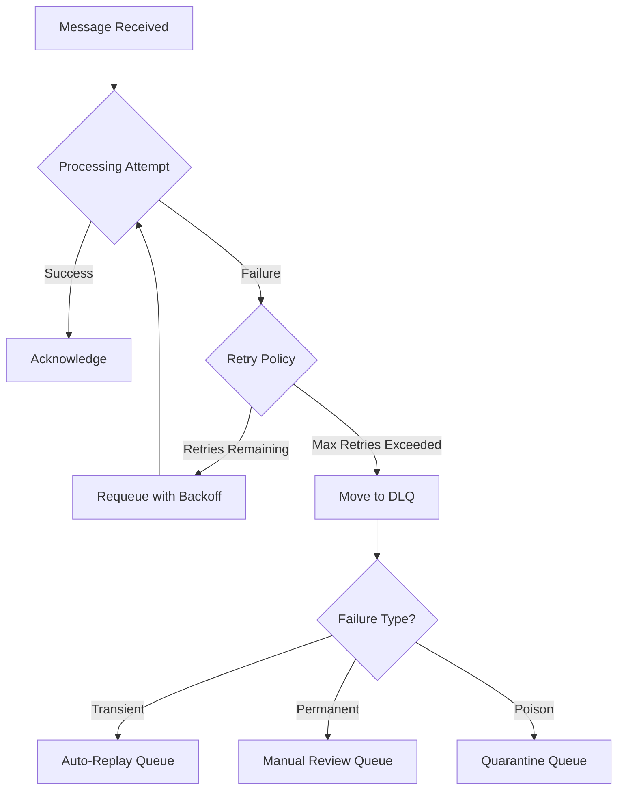
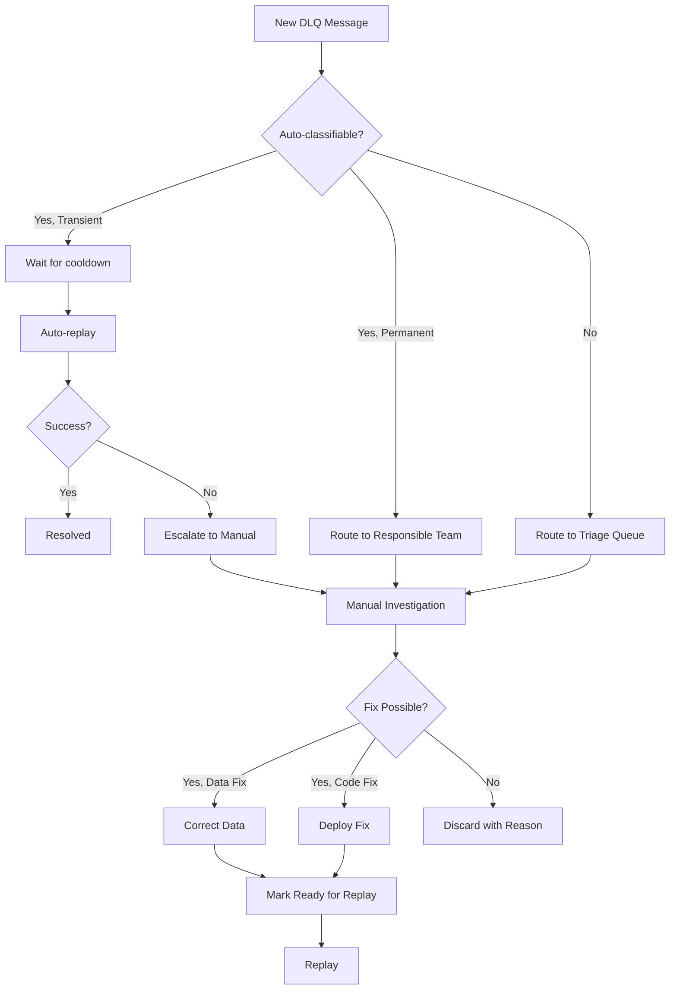

*[DLQ]: Dead Letter Queue
*[SQS]: Simple Queue Service
*[SNS]: Simple Notification Service
*[TTL]: Time To Live
*[FIFO]: First In First Out
*[JSON]: JavaScript Object Notation

# Dead Letter Queues You Can Actually Drain

## Introduction

Brief overview of the dead letter queue problem: every message queue needs a place for messages that can't be processed. But most DLQs become graveyards—messages go in, nothing comes out, and eventually someone deletes them because "they're probably stale anyway." This section frames the DLQ not as a failure bin but as a critical operational tool that enables debugging and recovery.

_Include a real scenario: a payment processing queue accumulates 50,000 messages in its DLQ over three months. Nobody knows why they failed—the original errors weren't captured. Nobody knows if they're safe to replay—some might cause duplicate charges. The team deletes them all and hopes no customers notice._

<Callout type="warning">
A DLQ that you can't debug and can't replay isn't a safety mechanism—it's a data loss mechanism with extra steps. Design for drain, not for dump.
</Callout>

## Why Messages End Up in DLQs

### Common Failure Modes

Categorize the reasons messages fail processing.

```yaml title="dlq-failure-modes.yaml"
transient_failures:
  description: "Temporary issues that resolve themselves"
  examples:
    - "Database connection timeout"
    - "Downstream service unavailable"
    - "Rate limit exceeded"
    - "Lock contention"
  behavior: "Should succeed on retry"
  dlq_strategy: "Automatic replay after delay"

permanent_failures:
  description: "Issues that won't resolve without intervention"
  examples:
    - "Invalid message format"
    - "Referenced entity doesn't exist"
    - "Business rule violation"
    - "Schema version mismatch"
  behavior: "Will never succeed without fix"
  dlq_strategy: "Manual review and data correction"

poison_messages:
  description: "Messages that crash the consumer"
  examples:
    - "Null pointer in message field"
    - "Infinite loop triggered by data"
    - "Memory exhaustion from large payload"
    - "Unhandled exception type"
  behavior: "Consumer dies on every attempt"
  dlq_strategy: "Isolate, fix consumer, then replay"

ordering_failures:
  description: "Messages that fail due to sequence issues"
  examples:
    - "Update before create"
    - "Delete of non-existent record"
    - "Duplicate message ID"
  behavior: "May succeed if replayed in correct order"
  dlq_strategy: "Reorder and replay"
```
Code: DLQ failure mode taxonomy.


Figure: Message processing flow with DLQ routing by failure type.

### The Information Loss Problem

Explain why traditional DLQs fail at their job.

```text
What Most DLQs Capture:
  - Original message payload
  - Timestamp when DLQ'd
  - Maybe: number of retries

What You Actually Need:
  - Original message payload
  - ALL error messages from ALL attempts
  - Stack traces
  - Consumer version that failed
  - Correlation IDs for tracing
  - Original queue name
  - Processing duration per attempt
  - Environment/host that processed it
  - Related messages (if part of saga)
```

```typescript title="typical-dlq-message.ts"
// ❌ What you typically get in a DLQ
interface TypicalDLQMessage {
  body: string;  // Original payload, no context
  timestamp: number;
  // That's it. Good luck debugging.
}

// ✅ What you need for actual debugging
interface DebugableDLQMessage {
  // Original message
  originalPayload: unknown;
  originalQueue: string;
  originalMessageId: string;

  // Processing context
  correlationId: string;
  traceId: string;

  // Failure information
  attempts: Array<{
    timestamp: Date;
    consumerVersion: string;
    consumerHost: string;
    durationMs: number;
    errorType: string;
    errorMessage: string;
    stackTrace: string;
  }>;

  // Classification
  failureType: 'transient' | 'permanent' | 'poison';
  isReplayable: boolean;

  // Metadata
  firstFailedAt: Date;
  lastFailedAt: Date;
  totalAttempts: number;
}
```
Code: Typical DLQ message vs debuggable DLQ message.

<Callout type="info">
The difference between a useless DLQ and a useful one is metadata. Capture everything at failure time—you can't go back and get it later.
</Callout>

## DLQ Schema Design

### Message Envelope

Design a comprehensive DLQ message structure.

```typescript title="dlq-envelope.ts"
interface DLQEnvelope<T = unknown> {
  // Identity
  dlqMessageId: string;          // Unique ID in DLQ
  originalMessageId: string;     // ID from source queue

  // Routing
  sourceQueue: string;           // Where it came from
  sourceSystem: string;          // Which service published
  destinationQueue: string;      // Where it was being processed

  // Payload
  payload: T;                    // Original message body
  payloadType: string;           // Schema type/version
  payloadEncoding: 'json' | 'protobuf' | 'avro';

  // Timing
  originalTimestamp: Date;       // When originally published
  firstProcessingAttempt: Date;  // When first picked up
  dlqTimestamp: Date;            // When moved to DLQ
  expiresAt: Date | null;        // When to auto-delete (if set)

  // Tracing
  correlationId: string;
  traceId: string;
  spanId: string;

  // Failure context
  failureClassification: FailureClassification;
  processingAttempts: ProcessingAttempt[];

  // Operational
  status: DLQMessageStatus;
  assignedTo: string | null;     // For manual review tracking
  notes: string[];               // Operator notes
  tags: string[];                // For filtering
}

interface ProcessingAttempt {
  attemptNumber: number;
  timestamp: Date;
  durationMs: number;

  consumer: {
    service: string;
    version: string;
    host: string;
    instanceId: string;
  };

  error: {
    type: string;              // Exception class name
    message: string;           // Error message
    stackTrace: string;        // Full stack trace
    code: string | null;       // Error code if applicable
  };

  context: Record<string, unknown>;  // Additional context
}

type FailureClassification =
  | 'transient_infrastructure'   // DB down, network issue
  | 'transient_rate_limit'       // Rate limited
  | 'permanent_validation'       // Bad data format
  | 'permanent_business_rule'    // Business logic rejection
  | 'permanent_missing_entity'   // Referenced thing doesn't exist
  | 'poison_consumer_crash'      // Crashes consumer
  | 'unknown';                   // Not yet classified

type DLQMessageStatus =
  | 'new'                        // Just arrived
  | 'investigating'              // Someone looking at it
  | 'ready_for_replay'           // Fix applied, ready to retry
  | 'replayed'                   // Sent back to processing
  | 'resolved_manually'          // Fixed without replay
  | 'discarded';                 // Intentionally dropped
```
Code: Comprehensive DLQ message envelope schema.

### Storage Options

Compare storage approaches for DLQs.

| Storage Type | Pros | Cons | Best For |
|--------------|------|------|----------|
| Same queue system (SQS, RabbitMQ) | Simple setup, native tooling | Limited querying, no analytics | Small volume, simple workflows |
| Database (PostgreSQL) | Full querying, transactions | Need to build tooling | Complex workflows, audit requirements |
| Document store (MongoDB) | Flexible schema, good querying | Another system to manage | High volume, varied message types |
| Time-series (Elasticsearch) | Great analytics, dashboards | Overkill for small volumes | Large scale, need trends |

Table: DLQ storage options comparison.

```sql title="dlq-postgres-schema.sql"
-- PostgreSQL schema for DLQ with full querying capability

CREATE TYPE failure_classification AS ENUM (
  'transient_infrastructure',
  'transient_rate_limit',
  'permanent_validation',
  'permanent_business_rule',
  'permanent_missing_entity',
  'poison_consumer_crash',
  'unknown'
);

CREATE TYPE dlq_status AS ENUM (
  'new',
  'investigating',
  'ready_for_replay',
  'replayed',
  'resolved_manually',
  'discarded'
);

CREATE TABLE dlq_messages (
  id UUID PRIMARY KEY DEFAULT gen_random_uuid(),
  original_message_id VARCHAR(255) NOT NULL,

  -- Routing
  source_queue VARCHAR(255) NOT NULL,
  source_system VARCHAR(255) NOT NULL,

  -- Payload (stored as JSONB for querying)
  payload JSONB NOT NULL,
  payload_type VARCHAR(255),

  -- Timing
  original_timestamp TIMESTAMPTZ NOT NULL,
  dlq_timestamp TIMESTAMPTZ NOT NULL DEFAULT NOW(),
  expires_at TIMESTAMPTZ,

  -- Tracing
  correlation_id VARCHAR(255),
  trace_id VARCHAR(255),

  -- Failure
  failure_classification failure_classification DEFAULT 'unknown',
  total_attempts INT NOT NULL DEFAULT 1,
  last_error_message TEXT,
  last_error_type VARCHAR(255),

  -- Status
  status dlq_status NOT NULL DEFAULT 'new',
  assigned_to VARCHAR(255),
  notes TEXT[],
  tags TEXT[],

  -- Timestamps
  created_at TIMESTAMPTZ NOT NULL DEFAULT NOW(),
  updated_at TIMESTAMPTZ NOT NULL DEFAULT NOW()
);

-- Processing attempts stored separately for history
CREATE TABLE dlq_processing_attempts (
  id UUID PRIMARY KEY DEFAULT gen_random_uuid(),
  dlq_message_id UUID NOT NULL REFERENCES dlq_messages(id),
  attempt_number INT NOT NULL,
  timestamp TIMESTAMPTZ NOT NULL,
  duration_ms INT,

  consumer_service VARCHAR(255),
  consumer_version VARCHAR(50),
  consumer_host VARCHAR(255),

  error_type VARCHAR(255),
  error_message TEXT,
  stack_trace TEXT,
  error_code VARCHAR(50),

  context JSONB,

  UNIQUE(dlq_message_id, attempt_number)
);

-- Indexes for common queries
CREATE INDEX idx_dlq_status ON dlq_messages(status);
CREATE INDEX idx_dlq_source_queue ON dlq_messages(source_queue);
CREATE INDEX idx_dlq_failure_class ON dlq_messages(failure_classification);
CREATE INDEX idx_dlq_timestamp ON dlq_messages(dlq_timestamp);
CREATE INDEX idx_dlq_correlation ON dlq_messages(correlation_id);
CREATE INDEX idx_dlq_payload ON dlq_messages USING GIN (payload);
```
Code: PostgreSQL schema for queryable DLQ storage.

<Callout type="success">
Using a database for DLQ storage trades simplicity for capability. You lose native queue features but gain SQL queries, joins, aggregations, and the ability to build sophisticated operational tooling.
</Callout>

## Capturing Failure Context

### Enriching Messages on Failure

Show how to capture context when moving to DLQ.

```typescript title="dlq-enrichment.ts"
class DLQEnricher {
  constructor(
    private dlqStorage: DLQStorage,
    private config: DLQConfig,
  ) {}

  async moveToDeadLetter(
    message: QueueMessage,
    error: Error,
    context: ProcessingContext,
  ): Promise<void> {
    // Classify the failure
    const classification = this.classifyFailure(error);

    // Build the enriched envelope
    const envelope: DLQEnvelope = {
      dlqMessageId: uuid(),
      originalMessageId: message.messageId,

      sourceQueue: context.sourceQueue,
      sourceSystem: message.attributes?.sourceSystem || 'unknown',
      destinationQueue: context.destinationQueue,

      payload: message.body,
      payloadType: message.attributes?.type || 'unknown',
      payloadEncoding: 'json',

      originalTimestamp: new Date(message.attributes?.timestamp || Date.now()),
      firstProcessingAttempt: context.firstAttemptAt,
      dlqTimestamp: new Date(),
      expiresAt: this.calculateExpiry(classification),

      correlationId: context.correlationId,
      traceId: context.traceId,
      spanId: context.spanId,

      failureClassification: classification,
      processingAttempts: [
        ...context.previousAttempts,
        this.buildAttempt(error, context),
      ],

      status: 'new',
      assignedTo: null,
      notes: [],
      tags: this.generateTags(message, error),
    };

    await this.dlqStorage.store(envelope);

    // Emit metrics
    this.emitMetrics(envelope);
  }

  private classifyFailure(error: Error): FailureClassification {
    // Classification logic based on error type
    if (error instanceof ValidationError) {
      return 'permanent_validation';
    }
    if (error instanceof EntityNotFoundError) {
      return 'permanent_missing_entity';
    }
    if (error instanceof RateLimitError) {
      return 'transient_rate_limit';
    }
    if (error instanceof ConnectionError || error instanceof TimeoutError) {
      return 'transient_infrastructure';
    }
    if (error instanceof BusinessRuleError) {
      return 'permanent_business_rule';
    }

    // Check for patterns that indicate poison messages
    if (this.looksLikePoison(error)) {
      return 'poison_consumer_crash';
    }

    return 'unknown';
  }

  private buildAttempt(error: Error, context: ProcessingContext): ProcessingAttempt {
    return {
      attemptNumber: context.attemptNumber,
      timestamp: new Date(),
      durationMs: Date.now() - context.attemptStartedAt,

      consumer: {
        service: process.env.SERVICE_NAME || 'unknown',
        version: process.env.SERVICE_VERSION || 'unknown',
        host: os.hostname(),
        instanceId: context.instanceId,
      },

      error: {
        type: error.constructor.name,
        message: error.message,
        stackTrace: error.stack || '',
        code: (error as any).code || null,
      },

      context: {
        memoryUsage: process.memoryUsage(),
        uptime: process.uptime(),
        ...context.additionalContext,
      },
    };
  }

  private generateTags(message: QueueMessage, error: Error): string[] {
    const tags: string[] = [];

    // Add error-based tags
    tags.push(`error:${error.constructor.name}`);

    // Add message-based tags
    if (message.attributes?.type) {
      tags.push(`type:${message.attributes.type}`);
    }

    // Add environment tags
    tags.push(`env:${process.env.NODE_ENV}`);

    return tags;
  }
}
```
Code: DLQ enrichment service capturing full failure context.

### Consumer Integration

```typescript title="consumer-with-dlq.ts"
class MessageConsumer {
  constructor(
    private queue: Queue,
    private handler: MessageHandler,
    private dlqEnricher: DLQEnricher,
    private config: ConsumerConfig,
  ) {}

  async processMessage(message: QueueMessage): Promise<void> {
    const context: ProcessingContext = {
      sourceQueue: this.queue.name,
      destinationQueue: this.queue.name,
      correlationId: message.attributes?.correlationId || uuid(),
      traceId: message.attributes?.traceId || uuid(),
      spanId: uuid(),
      attemptNumber: message.attributes?.approximateReceiveCount || 1,
      attemptStartedAt: Date.now(),
      firstAttemptAt: message.attributes?.firstReceiveTimestamp
        ? new Date(message.attributes.firstReceiveTimestamp)
        : new Date(),
      previousAttempts: [],
      instanceId: this.config.instanceId,
      additionalContext: {},
    };

    try {
      await this.handler.handle(message, context);
      await this.queue.ack(message);
    } catch (error) {
      if (this.shouldRetry(message, error)) {
        // Let the queue handle retry
        await this.queue.nack(message);
      } else {
        // Max retries exceeded or non-retryable error
        await this.dlqEnricher.moveToDeadLetter(message, error, context);
        await this.queue.ack(message);  // Ack to remove from main queue
      }
    }
  }

  private shouldRetry(message: QueueMessage, error: Error): boolean {
    const attempts = message.attributes?.approximateReceiveCount || 1;

    // Don't retry permanent failures
    if (error instanceof ValidationError ||
        error instanceof BusinessRuleError ||
        error instanceof EntityNotFoundError) {
      return false;
    }

    // Don't retry if max attempts reached
    if (attempts >= this.config.maxRetries) {
      return false;
    }

    return true;
  }
}
```
Code: Consumer with integrated DLQ enrichment.

<Callout type="warning">
Capture context at failure time, not later. Once the message is in the DLQ, you've lost the processing context, trace spans, and in-memory state. Enrich before writing.
</Callout>

## Replay Tooling

### Replay Service Design

Design a service for safely replaying DLQ messages.

```typescript title="replay-service.ts"
class DLQReplayService {
  constructor(
    private dlqStorage: DLQStorage,
    private queueClient: QueueClient,
    private config: ReplayConfig,
  ) {}

  async replaySingle(
    dlqMessageId: string,
    options: ReplayOptions = {},
  ): Promise<ReplayResult> {
    const envelope = await this.dlqStorage.get(dlqMessageId);

    if (!envelope) {
      throw new NotFoundError(`DLQ message ${dlqMessageId} not found`);
    }

    // Pre-replay validations
    await this.validateReplay(envelope, options);

    // Update status
    await this.dlqStorage.updateStatus(dlqMessageId, 'replayed');

    try {
      // Publish back to original queue (or override queue)
      const targetQueue = options.targetQueue || envelope.sourceQueue;

      await this.queueClient.publish(targetQueue, {
        body: envelope.payload,
        attributes: {
          ...this.buildReplayAttributes(envelope),
          ...options.attributeOverrides,
        },
      });

      return {
        success: true,
        dlqMessageId,
        targetQueue,
        replayedAt: new Date(),
      };
    } catch (error) {
      // Revert status on failure
      await this.dlqStorage.updateStatus(dlqMessageId, 'ready_for_replay');
      throw error;
    }
  }

  async replayBatch(
    filter: DLQFilter,
    options: BatchReplayOptions = {},
  ): Promise<BatchReplayResult> {
    const messages = await this.dlqStorage.query(filter);

    if (messages.length > options.maxBatchSize) {
      throw new Error(
        `Batch size ${messages.length} exceeds max ${options.maxBatchSize}. ` +
        `Add more filters or increase maxBatchSize.`
      );
    }

    // Require confirmation for large batches
    if (messages.length > 100 && !options.confirmed) {
      return {
        success: false,
        requiresConfirmation: true,
        messageCount: messages.length,
        preview: messages.slice(0, 10),
      };
    }

    const results: ReplayResult[] = [];
    const errors: ReplayError[] = [];

    // Replay with rate limiting
    for (const envelope of messages) {
      try {
        const result = await this.replaySingle(envelope.dlqMessageId, options);
        results.push(result);

        // Rate limit to avoid overwhelming downstream
        if (options.delayMs) {
          await sleep(options.delayMs);
        }
      } catch (error) {
        errors.push({
          dlqMessageId: envelope.dlqMessageId,
          error: error.message,
        });

        if (options.stopOnError) {
          break;
        }
      }
    }

    return {
      success: errors.length === 0,
      replayed: results.length,
      failed: errors.length,
      errors,
    };
  }

  private async validateReplay(
    envelope: DLQEnvelope,
    options: ReplayOptions,
  ): Promise<void> {
    // Check if already replayed
    if (envelope.status === 'replayed' && !options.allowReReplay) {
      throw new Error('Message already replayed. Set allowReReplay to retry.');
    }

    // Check if discarded
    if (envelope.status === 'discarded') {
      throw new Error('Message was discarded and cannot be replayed.');
    }

    // Check expiry
    if (envelope.expiresAt && envelope.expiresAt < new Date()) {
      throw new Error('Message has expired and cannot be replayed.');
    }

    // Check payload age
    const ageHours = (Date.now() - envelope.originalTimestamp.getTime()) / 3600000;
    if (ageHours > this.config.maxReplayAgeHours && !options.allowStale) {
      throw new Error(
        `Message is ${ageHours.toFixed(1)} hours old. ` +
        `Set allowStale to replay old messages.`
      );
    }
  }

  private buildReplayAttributes(envelope: DLQEnvelope): Record<string, string> {
    return {
      correlationId: envelope.correlationId,
      originalMessageId: envelope.originalMessageId,
      dlqMessageId: envelope.dlqMessageId,
      replayedAt: new Date().toISOString(),
      replayedFrom: 'dlq',
      originalTimestamp: envelope.originalTimestamp.toISOString(),
      previousAttempts: String(envelope.totalAttempts),
    };
  }
}

interface ReplayOptions {
  targetQueue?: string;
  attributeOverrides?: Record<string, string>;
  allowReReplay?: boolean;
  allowStale?: boolean;
}

interface BatchReplayOptions extends ReplayOptions {
  maxBatchSize?: number;
  confirmed?: boolean;
  delayMs?: number;
  stopOnError?: boolean;
}
```
Code: DLQ replay service with safety checks.

### CLI Tool

```typescript title="dlq-cli.ts"
#!/usr/bin/env node
import { program } from 'commander';
import { DLQReplayService } from './replay-service';
import { DLQStorage } from './storage';

program
  .name('dlq')
  .description('Dead Letter Queue management CLI');

program
  .command('list')
  .description('List DLQ messages')
  .option('-q, --queue <queue>', 'Filter by source queue')
  .option('-s, --status <status>', 'Filter by status')
  .option('-c, --classification <class>', 'Filter by failure classification')
  .option('-l, --limit <n>', 'Limit results', '20')
  .option('--since <date>', 'Messages since date')
  .action(async (options) => {
    const storage = new DLQStorage();
    const messages = await storage.query({
      sourceQueue: options.queue,
      status: options.status,
      failureClassification: options.classification,
      limit: parseInt(options.limit),
      since: options.since ? new Date(options.since) : undefined,
    });

    console.table(messages.map(m => ({
      id: m.dlqMessageId.slice(0, 8),
      queue: m.sourceQueue,
      status: m.status,
      classification: m.failureClassification,
      error: m.processingAttempts.at(-1)?.error.message.slice(0, 50),
      age: formatAge(m.dlqTimestamp),
    })));
  });

program
  .command('inspect <id>')
  .description('Show full details of a DLQ message')
  .action(async (id) => {
    const storage = new DLQStorage();
    const message = await storage.get(id);

    if (!message) {
      console.error(`Message ${id} not found`);
      process.exit(1);
    }

    console.log(JSON.stringify(message, null, 2));
  });

program
  .command('replay <id>')
  .description('Replay a single message')
  .option('-t, --target <queue>', 'Override target queue')
  .option('--allow-stale', 'Allow replaying old messages')
  .action(async (id, options) => {
    const service = new DLQReplayService();

    const result = await service.replaySingle(id, {
      targetQueue: options.target,
      allowStale: options.allowStale,
    });

    console.log(`✅ Replayed message ${id} to ${result.targetQueue}`);
  });

program
  .command('replay-batch')
  .description('Replay multiple messages')
  .option('-q, --queue <queue>', 'Filter by source queue')
  .option('-c, --classification <class>', 'Filter by failure classification')
  .option('--status <status>', 'Filter by status', 'ready_for_replay')
  .option('--dry-run', 'Show what would be replayed')
  .option('--confirm', 'Confirm batch replay')
  .option('--delay <ms>', 'Delay between replays', '100')
  .action(async (options) => {
    const service = new DLQReplayService();

    const filter = {
      sourceQueue: options.queue,
      failureClassification: options.classification,
      status: options.status,
    };

    if (options.dryRun) {
      const storage = new DLQStorage();
      const messages = await storage.query(filter);
      console.log(`Would replay ${messages.length} messages`);
      console.table(messages.slice(0, 10).map(m => ({
        id: m.dlqMessageId.slice(0, 8),
        queue: m.sourceQueue,
        error: m.processingAttempts.at(-1)?.error.message.slice(0, 40),
      })));
      return;
    }

    const result = await service.replayBatch(filter, {
      confirmed: options.confirm,
      delayMs: parseInt(options.delay),
    });

    if (result.requiresConfirmation) {
      console.log(`Found ${result.messageCount} messages to replay.`);
      console.log('Run with --confirm to proceed.');
      return;
    }

    console.log(`✅ Replayed: ${result.replayed}, Failed: ${result.failed}`);
  });

program
  .command('discard <id>')
  .description('Mark a message as discarded')
  .option('-r, --reason <reason>', 'Reason for discarding')
  .action(async (id, options) => {
    const storage = new DLQStorage();
    await storage.updateStatus(id, 'discarded');
    await storage.addNote(id, `Discarded: ${options.reason || 'No reason given'}`);
    console.log(`✅ Discarded message ${id}`);
  });

program.parse();
```
Code: CLI tool for DLQ operations.

<Callout type="info">
A CLI tool makes DLQ operations accessible to on-call engineers without requiring database access or custom scripts. Invest in good tooling—you'll use it at 3 AM.
</Callout>

## Operational Workflows

### Triage Workflow


Figure: DLQ triage workflow.

### Runbook for On-Call

```yaml title="dlq-runbook.yaml"
dlq_alert_response:
  initial_assessment:
    - step: "Check DLQ depth trend"
      command: "dlq stats --queue <queue>"
      action: "If spike, check for recent deployments or downstream outages"

    - step: "Sample recent failures"
      command: "dlq list --queue <queue> --limit 10"
      action: "Look for common patterns in error messages"

    - step: "Check failure classification"
      command: "dlq stats --by classification"
      action: "Transient = wait, Permanent = investigate"

  transient_failures:
    - step: "Verify downstream is healthy"
      action: "Check dashboards, ping dependencies"

    - step: "Wait for auto-recovery"
      action: "Transient failures should auto-replay after cooldown"

    - step: "Manual replay if needed"
      command: "dlq replay-batch --classification transient --confirm"

  permanent_failures:
    - step: "Identify root cause"
      command: "dlq inspect <id>"
      action: "Review error message, stack trace, payload"

    - step: "Determine fix approach"
      options:
        - "Data correction: Fix the payload, re-publish"
        - "Code fix: Deploy fix, then replay"
        - "Cannot fix: Discard with documentation"

    - step: "Document and track"
      action: "Create ticket, link to DLQ messages"

  escalation:
    - condition: "DLQ depth > 1000 messages"
      action: "Page responsible team"

    - condition: "Poison messages detected"
      action: "Page on-call engineer immediately"

    - condition: "Messages older than 24h without action"
      action: "Escalate to team lead"
```
Code: On-call runbook for DLQ alerts.

### Metrics and Alerting

```yaml title="dlq-metrics.yaml"
metrics:
  dlq_depth:
    description: "Number of messages in DLQ"
    labels: [queue, classification, status]
    alert:
      warning: "> 100 for 10 minutes"
      critical: "> 1000 for 5 minutes"

  dlq_inflow_rate:
    description: "Messages entering DLQ per minute"
    labels: [queue, classification]
    alert:
      warning: "> 10/min sustained for 5 minutes"
      critical: "> 100/min"

  dlq_age_max:
    description: "Age of oldest message in DLQ"
    labels: [queue]
    alert:
      warning: "> 1 hour"
      critical: "> 24 hours"

  dlq_replay_success_rate:
    description: "Percentage of replays that succeed"
    labels: [queue]
    alert:
      warning: "< 90%"
      critical: "< 50%"

  dlq_time_to_resolution:
    description: "Time from DLQ entry to resolution"
    labels: [queue, classification]
    target: "< 4 hours for transient, < 24 hours for permanent"
```
Code: DLQ metrics and alerting thresholds.

<Callout type="warning">
Alert on rate of change, not just depth. A DLQ that grows by 10 messages per day is normal maintenance; a DLQ that grows by 1000 messages per minute is an incident.
</Callout>

## Platform-Specific Implementation

### AWS SQS DLQ

```typescript title="sqs-dlq-implementation.ts"
import { SQS } from '@aws-sdk/client-sqs';

class SQSDLQManager {
  private sqs: SQS;

  constructor() {
    this.sqs = new SQS({});
  }

  async configureDeadLetterQueue(
    mainQueueUrl: string,
    dlqArn: string,
    maxReceiveCount: number = 3,
  ): Promise<void> {
    // Set redrive policy on main queue
    await this.sqs.setQueueAttributes({
      QueueUrl: mainQueueUrl,
      Attributes: {
        RedrivePolicy: JSON.stringify({
          deadLetterTargetArn: dlqArn,
          maxReceiveCount,
        }),
      },
    });
  }

  async replayFromSQSDLQ(
    dlqUrl: string,
    targetQueueUrl: string,
    batchSize: number = 10,
  ): Promise<{ replayed: number; failed: number }> {
    let replayed = 0;
    let failed = 0;

    while (true) {
      // Receive messages from DLQ
      const response = await this.sqs.receiveMessage({
        QueueUrl: dlqUrl,
        MaxNumberOfMessages: batchSize,
        MessageAttributeNames: ['All'],
        AttributeNames: ['All'],
      });

      if (!response.Messages || response.Messages.length === 0) {
        break;
      }

      for (const message of response.Messages) {
        try {
          // Send to target queue
          await this.sqs.sendMessage({
            QueueUrl: targetQueueUrl,
            MessageBody: message.Body!,
            MessageAttributes: {
              ...message.MessageAttributes,
              ReplayedFromDLQ: {
                DataType: 'String',
                StringValue: 'true',
              },
              OriginalMessageId: {
                DataType: 'String',
                StringValue: message.MessageId!,
              },
            },
          });

          // Delete from DLQ
          await this.sqs.deleteMessage({
            QueueUrl: dlqUrl,
            ReceiptHandle: message.ReceiptHandle!,
          });

          replayed++;
        } catch (error) {
          failed++;
          console.error(`Failed to replay message ${message.MessageId}:`, error);
        }
      }
    }

    return { replayed, failed };
  }
}
```
Code: AWS SQS DLQ management.

### RabbitMQ DLQ

```typescript title="rabbitmq-dlq-implementation.ts"
import amqp from 'amqplib';

class RabbitMQDLQManager {
  private connection: amqp.Connection;
  private channel: amqp.Channel;

  async setupDeadLetterExchange(
    mainQueue: string,
    dlqExchange: string = 'dlx',
    dlqQueue: string = `${mainQueue}.dlq`,
  ): Promise<void> {
    // Create dead letter exchange
    await this.channel.assertExchange(dlqExchange, 'direct', { durable: true });

    // Create DLQ
    await this.channel.assertQueue(dlqQueue, {
      durable: true,
      arguments: {
        'x-message-ttl': 7 * 24 * 60 * 60 * 1000, // 7 days
      },
    });

    // Bind DLQ to DLX
    await this.channel.bindQueue(dlqQueue, dlqExchange, mainQueue);

    // Configure main queue with DLX
    await this.channel.assertQueue(mainQueue, {
      durable: true,
      arguments: {
        'x-dead-letter-exchange': dlqExchange,
        'x-dead-letter-routing-key': mainQueue,
      },
    });
  }

  async consumeDLQWithEnrichment(
    dlqQueue: string,
    enricher: DLQEnricher,
  ): Promise<void> {
    await this.channel.consume(dlqQueue, async (msg) => {
      if (!msg) return;

      // Extract death information from headers
      const deaths = msg.properties.headers?.['x-death'] || [];
      const firstDeath = deaths[0] || {};

      const enrichedMessage = {
        payload: JSON.parse(msg.content.toString()),
        originalQueue: firstDeath.queue,
        reason: firstDeath.reason,
        deathCount: firstDeath.count,
        firstDeathTime: firstDeath.time,
        originalExchange: firstDeath.exchange,
        originalRoutingKey: firstDeath['routing-keys']?.[0],
      };

      // Store in our queryable DLQ storage
      await enricher.store(enrichedMessage);

      this.channel.ack(msg);
    });
  }
}
```
Code: RabbitMQ DLQ with dead letter exchange.

## Conclusion

Summarize the key principles: DLQs should be operational tools, not graveyards; capture full context at failure time because you can't reconstruct it later; build replay tooling from day one; and establish workflows for triage and resolution. Emphasize that the investment in DLQ infrastructure pays off during incidents when you need to recover from message processing failures without data loss.

<Callout type="success">
The measure of a good DLQ system isn't how few messages end up there—it's how quickly you can understand why they failed and how confidently you can replay them. Design for debugging and recovery, not just storage.
</Callout>

---

## Cover Prompt

### Prompt 1: The Hospital Recovery Ward

Create an image of a hospital recovery ward for data messages. Injured messages (with bandages and casts) rest in beds while nurse-bots attend to them. Monitors show vital signs and recovery progress. Some messages are being discharged (replayed) healthy. Style: medical care meets data visualization, warm healing colors, clean and professional, 16:9 aspect ratio.

### Prompt 2: The Forensic Laboratory

Design an image of a forensic science laboratory where failed messages are being analyzed. Microscopes examine error details, evidence boards show failure patterns, and investigators piece together what went wrong. X-ray light boxes show message internals. Style: detective investigation aesthetic, blue forensic lighting, analytical atmosphere, 16:9 aspect ratio.

### Prompt 3: The Message Rehabilitation Center

Illustrate a rehabilitation gym where failed messages work to get healthy again. Some are on treadmills (retry queues), some are working with physical therapists (debugging tools), and some are graduating (being replayed). A scoreboard shows recovery statistics. Style: athletic rehabilitation imagery, motivational poster aesthetic, bright and optimistic, 16:9 aspect ratio.

### Prompt 4: The Rescue Operation

Create an image of a mountain rescue scene where messages that fell (failed) are being rescued from a crevasse (DLQ). Rescue teams with detailed equipment (metadata capture) carefully extract and stabilize each message before airlifting (replaying) them. Style: dramatic rescue photography, action and care combined, mountain rescue aesthetic, 16:9 aspect ratio.

### Prompt 5: The Evidence Archive

Design an image of an organized evidence archive room where each failed message is carefully cataloged in labeled boxes on shelves. Investigators can easily find and retrieve any case. A retrieval robot helps locate specific messages. Digital terminals allow searching. Style: organized archive aesthetic, library meets evidence room, systematic and accessible, 16:9 aspect ratio.
