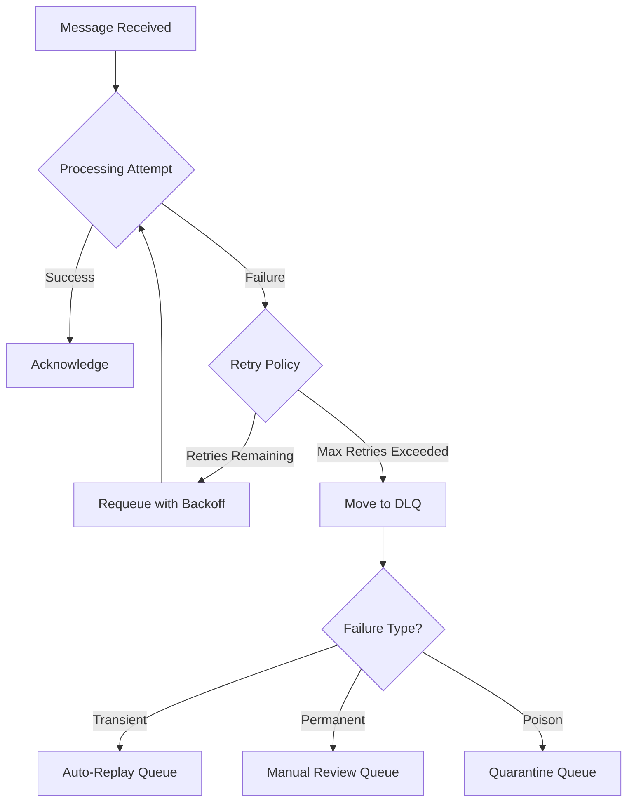

*[DLQ]: Dead Letter Queue
*[DLQs]: Dead Letter Queue
*[DLX]: Dead Letter Exchange
*[SQS]: Simple Queue Service
*[SNS]: Simple Notification Service
*[TTL]: Time To Live
*[FIFO]: First In First Out
*[JSON]: JavaScript Object Notation

Every message queue needs a place for messages that can't be processed. Most DLQs become graveyards—messages go in, nothing comes out, and eventually someone deletes them because "they're probably stale anyway."

I've seen this pattern repeatedly. A payment processing queue accumulates 50,000 messages in its DLQ over three months. Nobody knows why they failed—the original errors weren't captured, just a generic "processing failed" status. Nobody knows if they're safe to replay—some might cause duplicate charges, some might reference customers who no longer exist. The team debates for a week, then deletes them all and hopes no customers notice.

That's not a safety mechanism. That's data loss with extra steps.

The problem isn't the DLQ concept—it's the implementation. Most teams treat DLQs as a failure bin when they should be treating them as a critical operational tool. A well-designed DLQ captures enough context to debug failures, classifies messages by failure type, and provides tooling to replay them safely. The goal isn't to minimize DLQ depth (though that's nice). The goal is to make every message in the DLQ actionable.

<Callout type="warning">
A DLQ that you can't debug and can't replay isn't a safety mechanism—it's a data loss mechanism with extra steps. Design for drain, not for dump.
</Callout>

## Why Messages End Up in DLQs

### Common Failure Modes

Messages fail for different reasons, and those reasons determine how you should handle them. Understanding the failure taxonomy is the first step toward building a DLQ you can actually drain.

_Transient failures_ are temporary issues that resolve themselves: database connection timeouts, downstream service unavailability, rate limit errors, lock contention. These should succeed on retry. The DLQ strategy is automatic replay after a cooldown period—no human intervention required if your retry policy is sound.

_Permanent failures_ won't resolve without intervention: invalid message format, referenced entity doesn't exist, business rule violation, schema version mismatch. These will never succeed without a fix. The DLQ strategy is manual review and data correction. Someone needs to look at the payload, understand what's wrong, and either fix the data or discard the message.

_Poison messages_ crash the consumer: null pointer in a required field, infinite loop triggered by specific data, memory exhaustion from an oversized payload, unhandled exception type. The consumer dies on every attempt. The DLQ strategy is to isolate the message, fix the consumer code, then replay. These are the most dangerous because they can take down your processing capacity.

_Ordering failures_ fail due to sequence issues: an update arriving before the create, a delete for a non-existent record, duplicate message IDs. These may succeed if replayed in correct order. The DLQ strategy is to reorder and replay, though this often requires understanding the business context.


Figure: Message processing flow with DLQ routing by failure type.

### The Information Loss Problem

Traditional DLQs fail at their job because they don't capture enough context. Most DLQs give you the original message payload, a timestamp when the message was DLQ'd, and maybe the number of retries. That's it.

What you actually need: the original message payload, all error messages from all attempts (not just the last one), full stack traces, the consumer version that failed, correlation IDs for distributed tracing, the original queue name, processing duration per attempt, the environment and host that processed it, and related messages if it's part of a saga or workflow.

The gap between what you get and what you need is the difference between "I can debug this" and "I have no idea what happened."

```protobuf title="dlq-message.proto"
syntax = "proto3";
package dlq;

// What you typically get in a DLQ - good luck debugging
message TypicalDLQMessage {
  bytes body = 1;      // Original payload, no context
  int64 timestamp = 2; // When it was DLQ'd
  // That's it.
}

// What you need for actual debugging
message DebugableDLQMessage {
  // Original message identity
  bytes original_payload = 1;
  string original_queue = 2;
  string original_message_id = 3;

  // Distributed tracing context
  string correlation_id = 4;
  string trace_id = 5;

  // Failure information - every attempt, not just the last
  repeated ProcessingAttempt attempts = 6;

  // Classification for routing and automation
  FailureType failure_type = 7;
  bool is_replayable = 8;

  // Timing metadata
  google.protobuf.Timestamp first_failed_at = 9;
  google.protobuf.Timestamp last_failed_at = 10;
  int32 total_attempts = 11;
}

message ProcessingAttempt {
  google.protobuf.Timestamp timestamp = 1;
  string consumer_version = 2;
  string consumer_host = 3;
  int32 duration_ms = 4;
  string error_type = 5;
  string error_message = 6;
  string stack_trace = 7;
}

enum FailureType {
  FAILURE_TYPE_UNKNOWN = 0;
  FAILURE_TYPE_TRANSIENT = 1;
  FAILURE_TYPE_PERMANENT = 2;
  FAILURE_TYPE_POISON = 3;
}
```
Code: Typical DLQ message vs debuggable DLQ message.

<Callout type="info">
The difference between a useless DLQ and a useful one is metadata. Capture everything at failure time—you can't go back and get it later.
</Callout>

## DLQ Schema Design

The schema you choose for your DLQ messages determines what you can do with them later. Get it wrong and you're back to "I have no idea what happened." Get it right and debugging becomes straightforward.

### Design Principles

_Preserve the original message exactly._ Store the raw payload as bytes, not as a parsed and re-serialized structure. If you transform the message, you might introduce bugs that mask the original problem. You also want to replay exactly what was sent, not your interpretation of it.

_Capture context at write time._ The moment you move a message to the DLQ is your last chance to capture processing context: trace IDs, the consumer version, memory state, the specific error. Once the message is written to the DLQ, that context is gone. Don't rely on being able to reconstruct it later.

_Make failure classification explicit._ A status field that says "failed" tells you nothing. Classify failures into categories that drive different handling: transient failures can auto-retry, permanent failures need human review, poison messages need code fixes before replay. The classification should influence routing and alerting.

_Track operational state._ Messages in your DLQ have a lifecycle: new, under investigation, ready for replay, replayed, discarded. Track that state. Track who's looking at what. Add notes. Without this, you'll have multiple engineers investigating the same message or messages that sit untouched for weeks.

_Store every attempt, not just the last one._ A message might fail three times for three different reasons—connection timeout, rate limit, then validation error. If you only store the last error, you miss the pattern. The full history often reveals the root cause.

### Message Envelope

The envelope wraps the original message with everything you need for debugging and replay. Instead of a schema dump, here's a
background worker that builds and writes an envelope whenever a consumer gives up on retries:

```python title="dlq_worker.py"
import json
import os
import time
import uuid
from datetime import datetime, timezone
from typing import Any, Dict, List

import requests


def buildDlqEnvelope(message: Dict[str, Any], failure: Dict[str, Any], context: Dict[str, Any]) -> Dict[str, Any]:
    # Build a complete DLQ envelope for debugging and replay.
    now = datetime.now(timezone.utc).isoformat()

    return {
        "dlqMessageId": str(uuid.uuid4()),
        "originalMessageId": message.get("messageId", "unknown"),
        "sourceQueue": context.get("sourceQueue", "unknown"),
        "sourceSystem": message.get("attributes", {}).get("sourceSystem", "unknown"),
        "destinationQueue": context.get("destinationQueue", "unknown"),
        "payload": message.get("body", b""),
        "payloadType": message.get("attributes", {}).get("type", "unknown"),
        "payloadEncoding": message.get("attributes", {}).get("encoding", "json"),
        "originalTimestamp": message.get("attributes", {}).get("timestamp", now),
        "firstProcessingAttempt": context.get("firstAttemptAt", now),
        "dlqTimestamp": now,
        "expiresAt": context.get("expiresAt"),
        "correlationId": context.get("correlationId"),
        "traceId": context.get("traceId"),
        "spanId": context.get("spanId"),
        "failureClassification": failure.get("classification", "failure_unknown"),
        "attempts": context.get("attempts", []),
        "status": "status_new",
        "assignedTo": None,
        "notes": [],
        "tags": context.get("tags", []),
        "error": {
            "type": failure.get("type"),
            "message": failure.get("message"),
            "stackTrace": failure.get("stackTrace"),
            "code": failure.get("code"),
        },
    }


def storeDlqEnvelope(envelope: Dict[str, Any]) -> None:
    # Persist the envelope to your DLQ store via an API call.
    apiUrl = os.environ.get("DLQ_STORE_URL")
    apiKey = os.environ.get("DLQ_STORE_API_KEY")

    if not apiUrl or not apiKey:
        raise RuntimeError("Missing DLQ_STORE_URL or DLQ_STORE_API_KEY")

    try:
        response = requests.post(
            apiUrl,
            json=envelope,
            headers={"Authorization": f"Bearer {apiKey}"},
            timeout=10,
        )
        response.raise_for_status()
    except requests.RequestException as error:
        raise RuntimeError(f"Failed to store DLQ envelope: {error}") from error


def pollFailures() -> List[Dict[str, Any]]:
    # Fetch failed messages from your consumer or failure buffer.
    return []


def runWorker() -> None:
    while True:
        failures = pollFailures()

        for item in failures:
            envelope = buildDlqEnvelope(item["message"], item["failure"], item["context"])
            storeDlqEnvelope(envelope)

        time.sleep(5)


if __name__ == "__main__":
    runWorker()
```
Code: Background worker that writes DLQ envelopes.

### Storage Options

Where you store your DLQ messages affects what operations you can perform on them:

| Storage Type | Pros | Cons | Best For |
|--------------|------|------|----------|
| Same queue system (SQS, RabbitMQ) | Simple setup, native tooling | Limited querying, no analytics | Small volume, simple workflows |
| Database (PostgreSQL) | Full querying, transactions | Need to build tooling | Complex workflows, audit requirements |
| Document store (MongoDB) | Flexible schema, good querying | Another system to manage | High volume, varied message types |
| Time-series (Elasticsearch) | Great analytics, dashboards | Overkill for small volumes | Large scale, need trends |

Table: DLQ storage options comparison.

For most teams, I'd recommend starting with a relational database. The querying capability is worth the tooling investment. You can answer questions like "show me all validation failures from the orders queue in the last hour" with a simple SQL query. Try doing that with messages sitting in an SQS queue.

<Callout type="success">
Using a database for DLQ storage trades simplicity for capability. You lose native queue features but gain SQL queries, joins, aggregations, and the ability to build sophisticated operational tooling.
</Callout>

### Capturing Context at Failure Time

The schema only matters if you populate it correctly, and the window for capturing context is narrow. Once a message moves to the DLQ, the processing context—trace spans, in-memory state, the specific consumer instance—is gone. You can't reconstruct it later. This means the DLQ write path needs to be a core part of your consumer implementation, not an afterthought.

_Enrich synchronously, not asynchronously._ When a message fails its final retry, capture the context and write to the DLQ in the same call stack. If you push enrichment to a background job or separate service, you'll lose the error object, the stack trace, and any request-scoped context. The consumer that experienced the failure is the only place that has all the information.

_Classify failures programmatically._ Your consumer knows why it failed—use that knowledge. Map exception types to failure classifications: `ValidationError` becomes `permanent_validation`, `ConnectionError` becomes `transient_infrastructure`, `RateLimitError` becomes `transient_rate_limit`. Don't rely on humans to classify failures after the fact. The classification drives routing and automation, so getting it right at write time saves manual triage later.

_Preserve the processing context object._ Most consumers already track context for logging and tracing: correlation IDs, trace IDs, attempt counts, timing information. Pass this context to your DLQ enrichment logic rather than reconstructing it. If your consumer has a `ProcessingContext` object flowing through the handler chain, that same object should populate the DLQ envelope.

_Accumulate attempts across retries._ If your queue system handles retries (like SQS with visibility timeout), previous attempt information might not be available. Consider storing partial attempt data in message attributes during retries so the final DLQ write has the complete history. Alternatively, accept that you'll only have the final attempt's details and design your triage workflow accordingly.

The consumer's error handling path typically follows this logic: catch the exception, check if retries remain and the error is retryable, and either nack (let the queue retry) or enrich and write to DLQ. The key decision is _when_ to give up on retries. Permanent failures (validation errors, missing entities, business rule violations) should skip retries entirely and go straight to the DLQ—there's no point waiting for a validation error to magically resolve itself.

## DLQ Management Tooling

The tooling landscape for DLQ management splits into three categories: broker-native tools that work with your existing message infrastructure, database-backed solutions that trade broker features for query power, and custom redrive services that handle enrichment and validation. Your choice depends on where you store failed messages and how much automation you need.

### Broker-Native Tools

If you're keeping dead letters in the broker itself (SQS DLQs, RabbitMQ dead letter exchanges, Kafka error topics), several tools provide inspection and redrive capabilities without additional infrastructure.

_Kafka ecosystems_ have the most mature tooling. Kpow and Conduktor are enterprise UIs that support browsing messages, filtering by Protobuf schemas, and manually re-injecting messages to source topics. DLQMan is a dedicated open-source tool specifically for Kafka DLQ management—it uses flexible matchers and custom strategies to simplify error analysis and reprocessing. For teams already invested in Kafka, these tools get you message inspection and manual redrive without writing code.

_RabbitMQ_ includes the Management Plugin by default, which provides a web interface for viewing dead letter exchanges and moving messages back to primary queues. It's basic but functional for low-volume DLQs where you're doing occasional manual intervention.

_AWS SQS_ has the AWS Console for basic DLQ inspection, but the Console experience is poor for anything beyond viewing a handful of messages. Most teams end up writing Lambda functions or CLI scripts to poll, inspect, and redrive. AWS added "DLQ redrive" as a native feature in 2023, but it's a blunt instrument—it moves all messages without inspection or filtering.

The limitation of broker-native tools is query capability. You can't easily answer "show me all validation failures from the orders queue in the last hour" when messages are sitting in a queue. You have to receive them to inspect them, and receiving affects visibility timeout and delivery counts.

### Database-Backed Solutions

Moving failed messages to a database unlocks SQL queries, which changes the operational model entirely. Several libraries make this straightforward.

_pg-boss_ is a Node.js job queue backed by PostgreSQL that includes built-in retry policies and dead-lettering. Failed jobs stay in Postgres tables where you can query them directly, join against your application data, and build dashboards. If you're already in the Node.js ecosystem and use Postgres, pg-boss gives you a DLQ that's also a queryable audit log.

_pgmq_ is a lightweight message queue native to Postgres that supports high-performance queuing with DLQ management built in. It's lower-level than pg-boss—more of a queue primitive than a job framework—but useful if you want queue semantics without leaving your database.

_River_ is a Go library that uses Postgres for message persistence with sophisticated redrive policies. It's designed for high throughput and includes DLQ handling as a first-class concern. The Go ecosystem has historically been weaker on job queue tooling than Node.js or Python, so River fills an important gap.

_Wolverine_ provides .NET teams with PostgreSQL-backed message persistence and integrated DLQ handling. It's part of a larger messaging library, so you get DLQ capabilities alongside pub/sub, request/reply, and saga support.

For MongoDB, Atlas Stream Processing provides native tools to monitor DLQ collections, set alerts, and use Database Triggers to automate re-injection. The document model works well for variable message schemas, though you lose the join capabilities of relational storage.

### Schema-Aware Tooling

When your messages use structured schemas (Protobuf, Avro, JSON Schema), inspecting and replaying DLQ messages gets more complicated. Raw bytes don't help when you're trying to understand why a message failed validation. You need tooling that can deserialize messages according to your schema registry, display them in a human-readable format, and validate fixes before replay.

The challenge is that most DLQ tooling treats messages as opaque blobs. You can see the bytes, but understanding what they mean requires external knowledge of your schema versions. For teams with strict schema evolution policies, this becomes a significant operational burden—you might have messages in the DLQ that were written against three different schema versions, and each requires different handling.

_Conduktor_ and _Kpow_ (mentioned earlier for Kafka) both support schema registry integration, letting you browse DLQ messages with Protobuf or Avro decoding. This transforms debugging from "what are these bytes" to "this field is null when it shouldn't be."

_Spring Cloud Stream_ provides schema-aware DLQ handling for Kafka bindings if you're in the Spring ecosystem. It integrates with Confluent Schema Registry and handles serialization/deserialization automatically during replay.

For teams doing message transformation during redrive—enriching a failed message with data from another service, or migrating messages to a newer schema version before replaying—you'll likely need custom tooling. The validation step is critical: replay a message that doesn't conform to the current schema and you've just created a new DLQ entry.

### Custom Redrive Services

For complex needs—schema validation, enrichment from external services, conditional routing based on failure type—most teams end up building a dedicated DLQ service. The pattern is straightforward: a consumer reads from the DLQ storage (Postgres, MongoDB, or the broker's DLQ), applies enrichment or fixes, validates against your schema, and republishes to the primary queue.

This is where the Python worker from the schema design section fits in. That script runs as a Lambda function triggered by new DLQ entries, or as a containerized worker polling your database. The deployment model depends on volume and latency requirements:

_Serverless_ (AWS Lambda, Azure Functions) works well for low-to-medium volume DLQs where you can tolerate cold start latency. The function triggers on new DLQ messages, processes them, and terminates. You pay only for execution time, and the platform handles scaling.

_Containerized workers_ (Docker on ECS, Kubernetes) make sense for high-volume DLQs or when you need long-running connections to databases or brokers. The worker polls continuously, processes in batches, and maintains connection pools. Higher operational overhead but better performance characteristics.

_Cron jobs_ work for DLQs that don't need real-time processing. A scheduled job runs every few minutes, processes whatever's accumulated, and exits. Simple to operate but introduces latency between failure and redrive attempt.

<Callout type="info">
Start with the simplest deployment model that meets your latency requirements. A cron job that runs every 5 minutes is easier to operate than a Kubernetes deployment, and for most DLQs, 5-minute latency is acceptable.
</Callout>

### Build vs Buy

The decision tree is relatively simple. If you're using Kafka at scale, Kpow or Conduktor are worth evaluating—they'll save you weeks of tooling work. If you're using Postgres and a supported language (Node.js, Go, .NET), the database-backed libraries (pg-boss, River, Wolverine) give you DLQ management essentially for free.

If your needs include custom enrichment, schema validation before replay, or conditional routing based on failure classification, you'll end up building something. The good news is that a DLQ service is a straightforward piece of infrastructure: read from storage, transform, validate, publish. The Python worker pattern from earlier is the skeleton—you're just filling in the enrichment and validation logic for your domain.

## Operational Workflows

### Triage Workflow

When a message lands in your DLQ, the first question is whether it needs human attention at all. A well-designed system handles most DLQ traffic automatically—transient failures get auto-replayed after a cooldown, and only permanent failures and poison messages require someone to look at them.

The triage process starts with classification. If your consumer classified the failure at write time (as it should), the routing is automatic: transient failures go to an auto-replay queue with a delay, permanent failures get routed to the team that owns the affected domain, and poison messages trigger an immediate alert because they indicate a consumer bug.

For messages that weren't classified—either because the consumer didn't capture enough context or because the failure mode was unexpected—you need a manual triage step. Someone looks at the error message, checks the payload, and decides: is this fixable, and if so, how?

| Classification | Auto-Handling | Human Action Required |
|----------------|---------------|----------------------|
| Transient (infra) | Replay after 5-minute cooldown | Only if replay fails twice |
| Transient (rate limit) | Replay after backoff period | Check if rate limits are misconfigured |
| Permanent (validation) | None | Fix payload data, then replay |
| Permanent (missing entity) | None | Create entity or discard message |
| Permanent (business rule) | None | Review rule, fix data or discard |
| Ordering (sequence) | Hold for reordering | Replay in correct order, may need business context |
| Poison (consumer crash) | Quarantine immediately | Fix consumer code, then replay all |
| Unknown | Route to triage queue | Classify manually, then handle |

Table: DLQ triage routing by failure classification.

Once a message is under investigation, track that state. Nothing wastes more time than two engineers independently debugging the same failure. Mark messages as "investigating" with an assignee, add notes as you learn things, and update the status when you've determined the fix approach.

The fix itself falls into three categories. _Data fixes_ mean correcting the payload—maybe a required field was null, or an ID referenced a deleted entity. You edit the message, mark it ready for replay, and let the system re-process it. _Code fixes_ mean the consumer has a bug. You deploy the fix first, then replay the affected messages. _Discards_ are messages that can't be fixed and shouldn't be replayed—maybe the business operation is no longer valid, or replaying would cause duplicate side effects. Always document why you discarded a message; "I don't know what this is" isn't a valid reason.

### Responding to DLQ Alerts

When you get paged for a DLQ alert, resist the urge to immediately start replaying messages. The first few minutes should be assessment, not action.

1. __Check the trend, not just the number.__ A DLQ with 500 messages that's been stable for a week is different from a DLQ that jumped from 10 to 500 in the last hour. The spike tells you something changed—a deployment, a downstream outage, a data migration gone wrong. The stable backlog tells you someone hasn't been doing their job, but it's not an emergency.

2. __Sample before you act.__ Pull 10-20 recent failures and look for patterns. Are they all the same error? Same source queue? Same time window? If 90% of your DLQ is `ConnectionTimeout` errors from the payments queue, you're dealing with a downstream outage, not a data problem. If you see a mix of validation errors across different queues, you might have a schema version mismatch after a deployment.

3. __Let transient failures resolve themselves.__ If you've got a proper auto-replay mechanism for transient failures, give it time to work. Check that downstream services are healthy, verify the auto-replay is actually running, and wait for the cooldown period. Manual intervention on transient failures usually just adds noise.

For permanent failures, the investigation follows a predictable pattern. Inspect the message payload to understand what data was being processed. Read the error message and stack trace to understand why it failed. Check if the failure is isolated (one bad message) or systemic (many messages failing the same way). Then decide: can you fix the data, do you need to fix code, or should you discard?

The escalation triggers should be automatic, not judgment calls. Page the responsible team when DLQ depth exceeds your threshold (1000 messages is a reasonable starting point). Page immediately for poison messages—they indicate a consumer bug that could be affecting production throughput. Escalate to management when messages sit untouched for 24 hours, because that means your process is broken.

### Metrics and Alerting

The metrics you track should answer operational questions, not just populate dashboards. Every metric should have an associated action: if this number goes up (or down), what do I do?

- __DLQ depth by classification__ is your primary operational metric. Track it per queue and per failure type, because "500 messages in the DLQ" means different things depending on composition. 500 transient failures after a brief outage will auto-resolve. 500 validation failures means something is generating bad data upstream. Alert when depth exceeds thresholds, but set different thresholds for different classifications—transient failures can accumulate briefly without concern, but poison messages should alert immediately.

- __Inflow rate__ catches problems faster than depth. If messages are entering the DLQ at 100/minute, you have an active incident even if the total depth is still low. Alert on sustained inflow rates, not just spikes—a 5-minute sustained rate of 10/minute is more concerning than a single burst of 50 messages.

- __Message age__ tells you about process health. The oldest message in your DLQ represents your worst-case resolution time. If you have messages older than 24 hours, either your triage process isn't working or you have genuinely unfixable failures that should be discarded. Either way, it needs attention.

- __Replay success rate__ measures whether your fixes actually work. If you're replaying messages and they're failing again, you haven't fixed the underlying problem. A success rate below 90% means you're wasting effort on ineffective fixes.

| Metric | Warning Threshold | Critical Threshold | Response |
|--------|-------------------|-------------------|----------|
| DLQ depth | > 100 for 10 min | > 1000 for 5 min | Check inflow rate, sample failures |
| Inflow rate | > 10/min for 5 min | > 100/min | Active incident, check deployments |
| Max message age | > 1 hour | > 24 hours | Triage process failure |
| Replay success rate | < 90% | < 50% | Fixes aren't working |

Table: DLQ alerting thresholds and responses.

<Callout type="warning">
Alert on rate of change, not just depth. A DLQ that grows by 10 messages per day is normal maintenance; a DLQ that grows by 1000 messages per minute is an incident.
</Callout>

## Platform-Specific Considerations

Each message broker handles dead letters differently, and understanding the native behavior helps you decide how much custom infrastructure to build.

### AWS SQS

SQS has native DLQ support through redrive policies. You configure a source queue to automatically move messages to a DLQ after a specified number of receive attempts (the `maxReceiveCount`). The DLQ is just another SQS queue, so you can poll it, inspect messages, and delete them using standard SQS operations.

The limitation is context. SQS DLQ messages include the original body and some metadata (approximate receive count, sent timestamp), but you don't get error messages, stack traces, or failure classification. If you need that context, you have to capture it yourself before the message hits the DLQ—either by catching failures in your consumer and writing to a database, or by using a Lambda function to intercept DLQ messages and enrich them.

AWS added a "redrive to source queue" feature that lets you move messages from the DLQ back to the original queue through the Console or API. It's useful for bulk replay after fixing a downstream issue, but it's all-or-nothing—you can't filter which messages to replay. For selective replay or replay with modifications, you'll need custom tooling.

### RabbitMQ

RabbitMQ uses dead letter exchanges (DLX) rather than dedicated DLQ queues. When a message is rejected, expires, or exceeds its delivery limit, RabbitMQ routes it to the configured DLX with additional headers (`x-death`) containing failure information: the original queue, the reason for dead-lettering, the death count, and the timestamp.

This header information is more useful than what SQS provides natively—you can see why the message was rejected and how many times it's been dead-lettered. However, you still don't get application-level error messages or stack traces. Those have to be captured by your consumer before rejection.

The DLX pattern is flexible. You can route different failure types to different queues based on routing keys, implement retry delays by combining DLX with message TTL, or cascade through multiple dead letter exchanges for escalating retry policies. The tradeoff is complexity—RabbitMQ gives you building blocks, not a complete solution.

### Apache Kafka

Kafka doesn't have native DLQ support. Instead, teams typically implement DLQs by publishing failed messages to a separate "error" or "dlq" topic. This gives you complete control over what context to include, but it means building the entire DLQ infrastructure yourself.

The advantage is that Kafka's log-based architecture makes DLQ messages durable and replayable by default. You can consume from any offset, replay specific messages, or reprocess the entire DLQ topic. Consumer groups give you exactly-once processing semantics for replay operations.

The ecosystem tooling (Kpow, Conduktor, DLQMan) mentioned earlier fills the gap between Kafka's primitives and operational needs. If you're running Kafka at scale, these tools are worth evaluating—they provide the inspection, filtering, and replay capabilities that SQS and RabbitMQ offer natively.

## Conclusion

The difference between a DLQ that works and one that doesn't comes down to a single question: when a message fails, can you understand why and safely replay it? If the answer is no, your DLQ is just a slower path to data loss.

The investment required isn't enormous. Enrich messages at failure time with the context you'll need later—error details, trace IDs, failure classification, attempt history. Store them somewhere queryable so you can filter and search instead of manually inspecting messages one by one. Build simple tooling for inspection and replay, even if it's just a CLI wrapper around your storage queries. Establish a triage process so messages don't sit ignored for weeks.

Most of this work is one-time infrastructure that pays dividends every time something goes wrong. The alternative—deleting 50,000 messages because nobody knows what they are or whether they're safe to replay—is a data loss event dressed up as operational hygiene.

Start with the basics: capture full context at write time, classify failures so transient issues auto-resolve, and give your team tools to investigate permanent failures. You can add sophistication later—multi-tier DLQs, automated enrichment, schema validation on replay—but the fundamentals matter more than the advanced features.

<Callout type="success">
The measure of a good DLQ system isn't how few messages end up there—it's how quickly you can understand why they failed and how confidently you can replay them. Design for debugging and recovery, not just storage.
</Callout>
