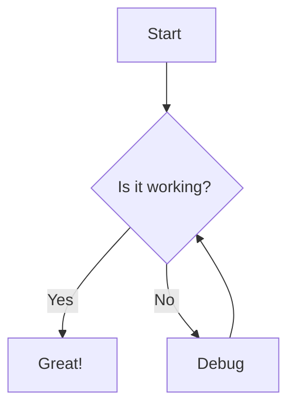

import Demo from '@components/Test/Demo.mdx'

Includes from [other Markdown]('/articles/demo') files.

```markdown
import Demo from '@components/Test/Demo.mdx'

<Demo />
```

<Demo />

## Basic Markdown Formatting

Subscript and superscript text is from `remark-supersub`.

| Style | Syntax | Keyboard shortcut | Example | Output |
| --- | --- | --- | --- | --- |
| Bold | `** **` | Command+B (Mac) or Ctrl+B (Windows/Linux) | `**This is bold text**` | **This is bold text** |
| Italic | `_ _` | Command+I (Mac) or Ctrl+B (Windows/Linux) | `_This text is italicized_` | _This text is italicized_ |
| Strikethrough | `~~ ~~` | None | `~~This was mistaken text~~` | ~~This was mistaken text~~ |
| Bold and nested italic | `** **` and `_ _` | None | `**This text is _extremely_ important**` | **This text is \*extremely\* important** |
| All bold and italic | `*** ***` | None | `**_All this text is important_**` | **_All this text is important_** |
| Subscript | `~subscript~` | None | `This is a ~subscript~ text` | This is a ~subscript~ |
| Superscript | `^superscript^` | None | `This is a ^superscript^ text` | This is a ^superscript^ text |
| Underline | Avoid | None | Avoid underlining text | Avoid underlining text |

## Abbreviations

Provided by the `remark-abbreviations` plugin.

```markdown
*[MDAST]: Markdown Abstract Syntax Tree.
*[AST]: Abstract syntax tree
```

*[MDAST]: Markdown Abstract Syntax Tree.
*[AST]: Abstract syntax tree

Should compile to the following HTML:

```html
<p>This plugin works on <abbr title="Markdown Abstract Syntax Tree.">MDAST</abbr>, a Markdown <abbr title="Abstract syntax tree">AST</abbr>
implemented by <a href="https://github.com/remarkjs/remark">remark</a></p>
```
## Align

This custom plugin parses custom Markdown syntax to center- or right-align elements. Alignment is done by wrapping something in shortcode-style tags, applying Tailwind `text-right` or `text-center` classes. Provided by the `remark-align` plugin.

```markdown
[center]paragraph[/center]
```

[center]A centered paragraph[/center]

```markdown
[right]paragraph[/right]
```

[right]A right-aligned paragraph[/right]

```markdown
[center]

> My blockquote

[/center]
```

[center]

> My blockquote

[/center]

```markdown
[center]

- a
- b

[/center]
```

[center]

- a
- b

[/center]

```markdown
[right]

> My blockquote

[/right]
```

[right]

> My blockquote

[/right]

```markdown
[right]

- a
- b

[/right]
```

[right]

- a
- b

[/right]

## Attributes

Add HTML attributes to supported Markdown elements using an MDX-safe doubled-square-bracket postfix syntax. Provided by the `remark-attributes` plugin.

```markdown
 [[width=300 .centered]]

[Link](/articles/demo) [[color=pink target=_blank .centered]]
```

 [[width=300 .centered]]
[Link Example](/articles/demo) [[.btn target=_blank]]

## Avatars

```markdown
<Avatar name="User Name" />
```

Display author or user avatars:

<Avatar name="Kevin Brown" />

Avatar fallback if no image found:

<Avatar name="Kevin Thomas" />

## Blockquotes

Quotation marks are added by CSS, so should not be included on the blockquote text.

> This is a blockquote. Use it for quotes, citations, or to highlight important statements from external sources.

Nested blockquotes:

```markdown
> Dorothy followed her through many of the beautiful rooms in her castle.
>
>> The Witch bade her clean the pots and kettles and sweep the floor and keep the fire fed with wood.
```

> Dorothy followed her through many of the beautiful rooms in her castle.
>
>> The Witch bade her clean the pots and kettles and sweep the floor and keep the fire fed with wood.

__Blockquotes with attribution__

The pluginwill provide an attribution for a quotation if it is prefixed with an em dash. To include a date, put them in trailing parentheses:

```markdown
> That's one small step for [a] man, one giant leap for mankind.
> — Neil Armstrong (1969, July 21)
```

> That's one small step for [a] man, one giant leap for mankind.
> — Neil Armstrong (1969, July 21)

```markdown
> That's one small step for [a] man, one giant leap for mankind.
> — Neil Armstrong
```

> Nothing inspires forgiveness quite like revenge.
> — Scott Adams

Compiles to the following HTML:

```html
<figure class="blockquote">
  <blockquote>
    <p>
      That's one small step for [a] man, one giant leap for mankind.
    </p>
  </blockquote>
  <figcaption class="blockquote-attribution">
    Neil Armstrong (1969, July 21)
  </figcaption>
</figure>
```

__Blockquotes with captions__

For blockquotes, captions are handled by the internal `remark-blockquote` plugin so they can be combined with an attribution.

**Blockquote caption**

```markdown
> Some blockquote text that will have a caption
> Source: The caption text that will appear under the blockquote
```

> Some blockquote text that will have a caption
> Source: The caption text that will appear under the blockquote

Compiles to the following HTML (ignoring styles):

```html
<figure class="blockquote-figure">
  <blockquote>
    <p>
      Some blockquote text that will have a caption
    </p>
  </blockquote>
  <figcaption class="blockquote-caption">
    The caption text that will appear under the blockquote
  </figcaption>
</figure>
```

__Blockquotes with both attribution and caption__

```markdown
> That's one small step for [a] man, one giant leap for mankind.
> — Neil Armstrong (1969, July 21)
> Source: The caption text that will appear under the blockquote
```

> That's one small step for [a] man, one giant leap for mankind.
> — Neil Armstrong (1969, July 21)
> Source: The caption text that will appear under the blockquote

Should compile to the following HTML:

```html
<figure class="blockquote-figure">
  <blockquote>
    <p>
      That's one small step for [a] man, one giant leap for mankind.
    </p>
  </blockquote>
  <div class="blockquote-attribution">
    Neil Armstrong (1969, July 21)
  </div>
  <figcaption class="blockquote-caption">
    The caption text that will appear under the blockquote
  </figcaption>
</figure>
```

## Bold and Nested Strikethrough

```markdown
**This text is _extremely_ important**
```

**This text is _extremely_ important**

## Calendar

import Calendar from '@components/Calendar/index.astro'

```markdown
<Calendar />
```

<Calendar />

## Callouts

The Callout component highlights important information.

```markdown
<Callout type="info">
This is an informational callout. Use it to draw attention to helpful tips or additional context.
</Callout>
```

Text to show spacing from paragraph element to callout:

<Callout type="info">
This is an informational callout. Use it to draw attention to helpful tips or additional context.
</Callout>

```markdown
<Callout type="warning">
This is a warning callout. Use it to highlight potential pitfalls or important considerations.
</Callout>
```

<Callout type="warning">
This is a warning callout. Use it to highlight potential pitfalls or important considerations.
</Callout>

```markdown
<Callout type="success">
This is a success callout. Perfect for highlighting achievements or positive outcomes.
</Callout>
```

<Callout type="success">
This is a success callout. Perfect for highlighting achievements or positive outcomes.
</Callout>

```markdown
<Callout type="danger">
This is a danger callout. Use it for critical warnings or errors that need immediate attention.
</Callout>
```

<Callout type="danger">
This is a danger callout. Use it for critical warnings or errors that need immediate attention.
</Callout>

```markdown
<Callout type="note">
This is a note callout.
</Callout>
```

<Callout type="note">
This is a note callout.
</Callout>

## Captions

By default it wraps the elements code, image, and table in a `<figure>` element, and adds a `<figcaption>` block as the last child. You can configure it to work on other elements by changing the keywords. Provided by teh `remark-captions` plugin.

**Code caption**

The caption line is prefixed with `Code:` and added below the code block with no blank line:

```ts
export const answer = 42
```
Code: This caption appears under the code block

**Table caption**

Note: a blank line is required before tje `Table:` prefixed line so it parses as a paragraph after the table.

```markdown
| a | b |
| - | - |
| 1 | 2 |

Table: This caption appears under the table
```

| a | b |
| - | - |
| 1 | 2 |

Table: This caption appears under the table

**Image caption**

Note: the `Figure:` prefixed line must be in the same paragraph as the image (no blank line).

```markdown

Figure: This caption appears under the image
```


Figure: This caption appears under the image

## Carousels

Showcase related articles using the production carousel component:

```markdown
<Carousel
  title="My Title"
  titleHref="/articles"
  type="articles"
  variant="suggested"
  currentSlug="demo/index"
  limit={6}
/>
```

<Carousel
  title="With Title Link"
  titleHref="/articles"
  type="articles"
  variant="suggested"
  currentSlug="demo/index"
  limit={6}
/>

<Carousel
  title="Without Title Link and in Bounded Mode"
  type="articles"
  variant="suggested"
  currentSlug="demo/index"
  limit={6}
  navigationMode="bounded"
/>

## Code

The project contains the full bundle of Shiki languages. They are dynamically loaded individually. Some common languages: `asm` for Assembly, `astro`, `awk`, `blade`, `clojure`, `cmake`, `cpp` for C++, `csharp` for C#, `css`, `diff`, `docker` for Dockerfiles, `dotenv`, `erlang`, `go`, `graphql`, `haskell`, `html`, `http`, `ini`, `java`, `javascript` / `js`, `json`, `json5`, `jsx`, `kotlin`, `log`, `lua`, `make`, `markdown`, `mdx`, `php`, `powershell`, `puppet`, `python`, `r`, `regexp`, `ruby`, `rust`, `scala`, `scss`, `sql`, `svelte`, `swift`, `systemd`, `terraform`, `toml`, `tsx`, `typescript` / `ts`, `vue`, `xml`, `yaml`. `promql` is aliased to `go` for now.

This `console.log("hello, world!")` statement is inline code.

```typescript
  console.log("hello, world!")
```

```bash [g8:BASH]
#!/bin/bash

LOG_DIR="/var/log/myapp"

# This is a super long line to make sure that text wrapping works, and doesn't result in a new numbered line. Rather, when a super long line is wider than the available area in a code block, the next line number should be pushed down and the super long line should should wrap onto an un-numbered line below the numbered line that it is originally on.
cleanup_old_files() {
    local target_dir=$1
    local days=$2

    if [[ ! -d "$target_dir" ]]; then
        log_error "Directory not found: $target_dir"
        return 1
    fi

    log_info "Starting cleanup in: $target_dir (keeping files less than $days days old)"

    find "$target_dir" -type f -mtime +$days -print0 | while IFS= read -r -d '' file; do
        if $DRY_RUN; then
            echo "[DRY RUN] Would delete: $file"
        else
            echo "[DELETING] $file"
            rm "$file"
            if [[ $? -ne 0 ]]; then # Check the exit status of the last command
                log_error "Failed to delete $file"
            fi
        fi
    done

    log_info "Cleanup finished for $target_dir"
    return 0
}
```

```text
A text code block
```

### Grouped Code Tabs

The following examples substitute apostrophes for backticks so that they're not rendered to code blocks.

There can only be white space between two code blocks. Syntax for the language block on the first line of the code block is `language [group:tabName]`. Display name is set by `tabName` and can only contain characters in `[A-Za-z0-9_]`.

```javascript [g1:Javascript]
function fetchUserData(userId) {
  return new Promise((resolve, reject) => {
    setTimeout(() => {
      if (userId === 123) {
        resolve({ id: 123, name: 'John Doe', postId: 456 })
      } else {
        reject(new Error('User not found'))
      }
    }, 500) // Simulate network delay
  })
}

```
```typescript [g1:Typescript]
class TypedEventEmitter<T extends Record<keyof T, any>> implements EventEmitter<T> {
  // Use a Mapped Type to create a structure for handlers
  private handlers: {
    [K in keyof T]?: Array<(payload: T[K]) => void>;
  } = {};

  subscribe<K extends keyof T>(eventName: K, handler: (payload: T[K]) => void): () => void {
    if (!this.handlers[eventName]) {
      this.handlers[eventName] = [];
    }
    // Type safety is maintained within the array
    this.handlers[eventName]!.push(handler);

    // Return an unsubscribe function (cleanup)
    return () => {
      const index = this.handlers[eventName]!.indexOf(handler);
      if (index > -1) {
        this.handlers[eventName]!.splice(index, 1);
      }
    };
  }
}
```

```ruby [g2:Ruby]
class Tree
  def initialize(*d)
    @d = d[0] # The current node's data
  end

  # A custom string representation of the tree
  def to_s
    @l || @r ? "< #{@d},<#{@l}>,<#{@r}>>" : @d
  end

  # Recursively calculates the total sum of all numeric nodes
  def total
    # Add current node if numeric, otherwise 0
    (@d.is_a?(Numeric) ? @d : 0) +
    # Recursively call total on left and right children if they exist
    (@l ? @l.total : 0) +
    (@r ? @r.total : 0)
  end
end
```
```python [g2:Python]
import functools
from typing import Generator, Optional

class UniqueIDGenerator:
    """A generator for creating unique, hashed identifiers."""

    def __init__(self, salt: str = "default_salt"):
        self.salt = salt
        self._generated_ids = set() # Store generated IDs to check for uniqueness

    @staticmethod
    def _hash_data(data: str) -> str:
        """Static method to create an MD5 hash."""
        return hashlib.md5(data.encode('utf-8')).hexdigest()
```
```go [g2:Go]
package main

import (
  "fmt"
  "sync"
  "time"
)

// Job represents the work to be done.
type Job struct {
  ID      int
  Payload string
}

// Worker processes jobs from a channel and sends results to another channel.
func Worker(id int, jobs <-chan Job, results chan<- string, wg *sync.WaitGroup) {
  defer wg.Done() // Signal the WaitGroup that this worker is done when the function returns
  for job := range jobs {
    fmt.Printf("Worker %d starting job %d\n", id, job.ID)
    // Simulate a time-consuming task
    time.Sleep(time.Millisecond * 500)
    result := fmt.Sprintf("Worker %d finished job %d with payload: %s", id, job.ID, job.Payload)
    fmt.Println(result)
    results <- result // Send the result to the results channel
  }
}
```

```markdown [g3:Markdown]
# Complex Markdown Example

This is a paragraph with **bold text**, *italic text*, and ~~strikethrough text~~. You can also use `inline code` for small snippets.

---

## Unordered List of Features

*   **Headers:** Use `#` symbols.
*   **Lists:** Both ordered and unordered are simple to create.
*   **Links & Images:** Embed web content easily.
    *   [Visit Google](https://www.google.com) for more information.

## Ordered List (Checklist)

1.  [x] Complete basic formatting.
2.  [ ] Add a table.
3.  [x] Include a code block.
```
```yaml [g3:Yaml]
app_name: "OrderProcessingService"

# --- Microservice Features & Settings ---
features:
  - name: "PaymentGateway"
    enabled: true
    config:
      provider: "Stripe"
      api_key_secret: "stripe-prod-key"
  - name: "InventoryCheck"
    enabled: true
    config:
      redis_host: "cache.prod.example.com"
      timeout_ms: 500
  - name: "EmailNotifications"
    enabled: false # Disabled feature
```
```json [g3:JSON]
{
  "organization_details": {
    "name": "TechCorp Solutions Inc.",
    "industry": "Software Development",
    "established_year": 2005,
    "ceo": null,
    "is_publicly_traded": false,
    "address": {
      "street": "456 Innovation Drive",
      "city": "Menlo Park",
      "state": "CA",
      "postalCode": "94025",
      "country": "USA"
    },
    "contacts": {
      "email": "info@techcorp.com",
      "phone": "+1-555-1234",
      "support_url": "techcorp.com"
    }
  }
}
```
```html [g3:HTML]
<!DOCTYPE html>
<html lang="en">
<head>
  <meta charset="UTF-8">
</head>
<body style="margin: 0 auto; max-width: 520px;">
  <h1>Hi there!</h1>
  <div>I'm your cool new webpage! Use the toggle in the <dark-mode style="border: 2px solid blue"></dark-mode> 👈  button to switch my theme.</div>
  Github: <a href="https://github.com/jaywcjlove/dark-mode.git" target="__blank">@jaywcjlove/dark-mode</a>
  <script>
    const toggle = document.querySelector('dark-mode');
    const button = document.createElement('button');
    button.textContent = 'Change Theme';
    button.style = 'line-height: 16px';
    button.onclick = () => {
      const theme = document.documentElement.dataset.colorMode;
      toggle.mode = theme === 'light' ? 'dark' : 'light';
      // document.documentElement.setAttribute('data-color-mode', theme === 'light' ? 'dark' : 'light');
    }
    document.body.appendChild(button);
    document.addEventListener('colorschemechange', (e) => {
      console.log(`colorschemechange: Color scheme changed to "${e.detail.colorScheme}" or .`);
      button.textContent = toggle.mode === 'dark' ? 'Change Theme 🌞' : 'Change Theme 🌒';
    });
    document.addEventListener('permanentcolorscheme', (e) => {
      console.log(`~permanentcolorscheme: Color scheme changed to "${e.detail.colorScheme}" or .`);
    });
    const removePermanent = () => document.querySelectorAll('dark-mode').forEach((item) => item.removeAttribute('permanent'));
  </script>
</body>
</html>
```

### Code Block Filenames

You can add a filename to the code block by using it for the name in the group block like `[g7:/src/script.js]`. It replaces the language name on the assumption that the file extension makes it clear what the language is.

```js [g7:/src/script.js]
  console.log('Hello World')
```

Note: the `title` prop is optional. If you don't add it, the code block will not have a title.

### Code Block Highlight lines

You can highlight lines in the code block by adding a prop to the code blocks as a list of comma separated numbers in curly brackets like `js {1,3,5}`.

`{1}` will highlight line 1

`{1,3}` will highlight lines 1 and 3

`{2-5, 7}` will highlight lines 1 to 5(not included) and 7

```js {1,3,5}
  console.log('Hello World')
  console.log('Hello World')
  console.log('Hello World')
  console.log('Hello World')
  console.log('Hello World')
```

### Code Block Error highlights

Use `warning={5,6}` and `error={3,4}` to mark a line with an error and warning levels.

```ts error={3,4} warning={5,6}
  # Using NPM
  npx astro add @thewebforge/astro-code-blocks
  # Using Yarn
  yarn astro add @thewebforge/astro-code-blocks
  # Using PNPM
  pnpm astro add @thewebforge/astro-code-blocks
```

### Code Block Highlight strings

You can highlight strings in the code block by adding a prop to the code blocks as a regular expression. The following example will highlight all occurrences of "astro" using a language string like `sh /astro/`:

`/astro/` will highlight all occurrences of "astro"
`/\w*$/` will highlight the last word of each line

```sh /astro/
  # Using NPM
  npx astro add @thewebforge/astro-code-blocks
  # Using Yarn
  yarn astro add @thewebforge/astro-code-blocks
  # Using PNPM
  pnpm astro add @thewebforge/astro-code-blocks
```

### Code Block Insertions and Deletions

You can highlight insertions and deletions in the code block by adding `ins` and / or `del` props to the code blocks as a list of lines in curly brackets with a language string like `sh ins={3,4} del={5,6}`:

```sh ins={3,4} del={5,6}
  # Using NPM
  npx astro add @thewebforge/astro-code-blocks
  # Using Yarn
  yarn astro add @thewebforge/astro-code-blocks
  # Using PNPM
  pnpm astro add @thewebforge/astro-code-blocks
```

### Code Block Language Aliases

We have the following aliases. They should have special handling of the language name.

- js: 'javascript',
- ts: 'typescript',
- md: 'markdown',
- promql: 'go',

```promql
some promql code
```

## Comments

Comments are not available, because it requires using Astro layout syntax (jsdoc-style comment inside squiggly brackets), which triggers Markdownlint rule requiring no spaces inside emphasis markers like asterisk.

## Colors

In single backtick code markers, applies a GitHub-like color dot:

```markdown
The background color is `#ffffff` for light mode and `#000000` for dark mode.

In RGB `rgb(9, 105, 218)`, RGBA `rgba(255, 99, 71, 0.5)` in HSL `hsl(212, 92%, 45%)`, and in HSLA `hsla(240, 100%, 50%, 0.7)`.
```

The background color is `#ffffff` for light mode and `#000000` for dark mode.

In RGB `rgb(9, 105, 218)`, RGBA `rgba(255, 99, 71, 0.5)` in HSL `hsl(212, 92%, 45%)`, and in HSLA `hsla(240, 100%, 50%, 0.7)`.

## Copy To Clipboard Component

### Attribute

```markdown
<Copy value="src/index.js">Copy</Copy>
```

<Copy value="src/index.js">Copy</Copy>

### Attribute - Float mode

```markdown
<Copy value="src/index.js" mode="float">Copy</Copy>
```

<Copy value="src/index.js" mode="float">Copy</Copy>

### Element content

```markdown
<Copy for="blob-path"><div id="blob-path">Copy</div></Copy>
```

<Copy for="blob-path"><div id="blob-path">Copy</div></Copy>

### Element content - Float mode

```markdown
<Copy for="blob-path" mode="float"><div id="blob-path">Copy</div></Copy>
```

<Copy for="blob-path" mode="float"><div id="blob-path">Copy</div></Copy>

### Form input

```markdown
<Copy for="blob-path"><input id="blob-path" value="src/index.js" /></Copy>
```

<Copy for="blob-path"><input id="blob-path" value="src/index.js" /></Copy>

### Form input - Float mode

```markdown
<Copy for="blob-path" mode="float"><input id="blob-path" value="src/index.js" /></Copy>
```

<Copy for="blob-path" mode="float"><input id="blob-path" value="src/index.js" /></Copy>

### Hyperlink href

```markdown
<Copy for="blob-path"><a id="blob-path" href="/path/to#my-blob">Link text will not be copied</a></Copy>
```

<Copy for="blob-path"><a id="blob-path" href="/path/to#my-blob">Link text will not be copied</a></Copy>

### Hyperlink href - Float mode

```markdown
<Copy for="blob-path" mode="float"><a id="blob-path" href="/path/to#my-blob">Link text will not be copied</a></Copy>
```

<Copy for="blob-path" mode="float"><a id="blob-path" href="/path/to#my-blob">Link text will not be copied</a></Copy>

## Definition Lists

Definitions under definition header, stringified as `dl`, `dt`, and `dd`. Provided by the `remark-deflist` plugin.

```markdown
Term 1

: Definition 1
```

Term 1

: Definition 1

## Detail and Summary

```markdown
<details>
  <summary>Details</summary>
  Something small enough to escape casual notice.
</details>
```

<details>
  <summary>Details</summary>
  Something small enough to escape casual notice.
</details>

The `remark-custom-blocks` plugin parses custom Markdown syntax to create new custom blocks. It takes a config object with a name for the block, CSS classes to apply to it, and whether a title is required, optional, or the block does not have a title. An initial block is defined for HTML `<details>` and `<summary>` elements.

```markdown
[[details | My summary for a `<details>` and `<summary>` block]]
| Some content for the detail
```

[[details | My summary for a `<details>` and `<summary>` block]]
| Some content for the detail

## Emojis

There is a doc listing all available emojis in the /docs directory. Provided by the `rehype-accessible-emojis` plugin.

```markdown
:rocket:
```

:rocket:

## Escape Markup

Unified uses the backslash character to treat special Markdown symbols as literal text, preventing them from being interpreted as formatting instructions.

```text
\\ (backslash): To display a literal backslash
\* (asterisk): Used for emphasis (italics or bold) or lists
\_ (underscore): Also used for emphasis
\# (hash symbol): Used for headings
\[ and \] (square brackets): Used for links
\( and \) (parentheses): Used in links or for other extensions like superscripts
\+, \-, \. (plus, minus, period): Used for lists
\! (exclamation mark): Used for images ()
\` (backtick): Used for inline code blocks
\> (greater-than sign): Used for blockquotes
\| (pipe): Used for tables in extended Markdown syntax
```

## Footnote

```markdown
Here is a simple footnote[^1].
A footnote can also have multiple lines[^2].
It could also be [^named].
```

Here is a simple footnote[^1].
A footnote can also have multiple lines[^2].
It could also be [^named].

Footnote backref links should include a `title` attribute for accessibility.

The references can be anywhere in the document, before or after their use:

```markdown
[^1]: My reference.

[^2]: To add line breaks within a footnote, add 2 spaces to the end of a line.
  This is a second line.

[^named]: My reference.
```

[^1]: My reference.

[^2]: To add line breaks within a footnote, add 2 spaces to the end of a line.
  This is a second line.

[^named]: My reference.

## Heading ID links

Generated by Astro internally.

```markdown
I can link internally to [Markdown Features](#unified-plugins) on the same page when writing Markdown.
```

I can link internally to [Markdown Features](#unified-plugins) on the same page when writing Markdown.

## Highlighter Component

```text
A shareable text <Highlighter ariaLabel="Share this insight">highlighter component</Highlighter> for MDX that displays a hover dialog with social sharing options. The custom label is optional.
```

A shareable text <Highlighter ariaLabel="Share this insight">highlighter component</Highlighter> for MDX that displays a hover dialog with social sharing options. The custom label is optional.

## Horizontal Rules

Asterisks (`***`):

***

Dashes (`---`):

---

Underscores ()`___`):

_________________

## Icon Component

Use SVG sprites for icons throughout your content:

```markdown
<Icon icon="check" size={36} classes="text-success" />
<Icon icon="warning" size={36} classes="text-warning" />
<Icon icon="info" size={36} classes="text-info" />
```

<Icon icon="check" size={36} classes="text-success" />
<Icon icon="warning" size={36} classes="text-warning" />
<Icon icon="info" size={36} classes="text-info" />

## Images

Use a relative path from the folder if the image is in src/assets (e.g. `../../../assets/images/typescript-downloadable-icon.png`) and will be optimized in the build. Images in the public folder are not optimized and can be referenced with an absolute path like `shiprock.svg` below.

```markdown

```


Linked image:

```markdown
[](/contact)
```

[](/contact)

## `kbd`

This is a default HTML markup, just adding it here to not forget to use it when needed:

```markdown
<p>
  You can also create a new document by pressing the
  <kbd><kbd>Ctrl</kbd>+<kbd>N</kbd></kbd> shortcut.
</p>
```

<p>
  You can also create a new document by pressing the
  <kbd><kbd>Ctrl</kbd>+<kbd>N</kbd></kbd> shortcut.
</p>

## Links

```markdown
My favorite search engine is [Duck Duck Go](https://duckduckgo.com).

Visit our [homepage](/) or read more [articles](/articles) to explore additional content.
```

My favorite search engine is [Duck Duck Go](https://duckduckgo.com).

Visit our [homepage](/) or read more [articles](/articles) to explore additional content.

## Lists

Unordered lists:

```markdown
- First item
- Second item
- Third item with **bold text**
- Fourth item with *italic text*
```

- First item
- Second item
- Third item with **bold text**
- Fourth item with _italic text_

Ordered lists:

```markdown
1. First step
2. Second step
3. Third step
```

1. First step
2. Second step
3. Third step

Nested lists:

```markdown
1. First list item
   - First nested list item
     - Second nested list item
1. Second list item
   - First nested list item
     - Second nested list item
```

1. First list item
   - First nested list item
     - Second nested list item
1. Second list item
   - First nested list item
     - Second nested list item

## List Component Layouts

### Accent Border Left List

```markdown
<div class="grid grid-cols-1 md:grid-cols-2 gap-4">
  <div class="text-content-active bg-page-offset rounded-xl px-8 pt-8 pb-4 shadow-md">
    <List
      variant="accent-border-left-list"
      classes={{
        li: "text-content-offset",
        em: "text-content-active",
      }}
      items={[
        {
          lead: "Is the gateway healthy?",
          text: "Request rate, error rate, and latency percentiles answer this instantly.",
          color: "border-blue-500",
        },
        {
          lead: "Is a specific backend unhealthy?",
          text: "Per-upstream metrics and circuit breaker state tell you.",
          color: "border-purple-500",
        },
        {
          lead: "Is a specific consumer affected?",
          text: "Consumer-specific labels let you slice the data.",
          color: "border-green-500",
        },
        {
          lead: "What happened to this specific request?",
          text: "Trace ID and request ID correlation connect all the pieces.",
          color: "border-orange-500",
        },
      ]}
    />
  </div>
</div>
```

<div class="grid grid-cols-1 md:grid-cols-2 gap-4">
  <div class="text-content-active bg-page-offset rounded-xl px-8 pt-8 pb-4 shadow-md">
    <List
      variant="accent-border-left-list"
      classes={{
        li: "text-content-offset",
        em: "text-content-active",
      }}
      items={[
        {
          lead: "Is the gateway healthy?",
          text: "Request rate, error rate, and latency percentiles answer this instantly.",
          color: "border-blue-500",
        },
        {
          lead: "Is a specific backend unhealthy?",
          text: "Per-upstream metrics and circuit breaker state tell you.",
          color: "border-purple-500",
        },
        {
          lead: "Is a specific consumer affected?",
          text: "Consumer-specific labels let you slice the data.",
          color: "border-green-500",
        },
        {
          lead: "What happened to this specific request?",
          text: "Trace ID and request ID correlation connect all the pieces.",
          color: "border-orange-500",
        },
      ]}
    />
  </div>
</div>

<br />

### Badge List


```markdown
<List
  variant="badge-list"
  items={[
    {
      title: "Query",
      lead: "Is the gateway healthy?",
      text: "Request rate, error rate, and latency percentiles answer this instantly.",
    },
    {
      title: "Query",
      lead: "Is a specific backend unhealthy?",
      text: "Per-upstream metrics and circuit breaker state tell you.",
    },
    {
      title: "Query",
      lead: "Is a specific consumer affected?",
      text: "Consumer-specific labels let you slice the data.",
    },
    {
      title: "Query",
      lead: "What happened to this specific request?",
      text: "Trace ID and request ID correlation connect all the pieces.",
    },
  ]}
/>
```

<List
  variant="badge-list"
  items={[
    {
      title: "Query",
      lead: "Is the gateway healthy?",
      text: "Request rate, error rate, and latency percentiles answer this instantly.",
    },
    {
      title: "Query",
      lead: "Is a specific backend unhealthy?",
      text: "Per-upstream metrics and circuit breaker state tell you.",
    },
    {
      title: "Query",
      lead: "Is a specific consumer affected?",
      text: "Consumer-specific labels let you slice the data.",
    },
    {
      title: "Query",
      lead: "What happened to this specific request?",
      text: "Trace ID and request ID correlation connect all the pieces.",
    },
  ]}
/>

<br />

### Card Grid List

```markdown
<List
  variant="card-grid-list"
  items={[
    {
      lead: "Is the gateway healthy?",
      text: "Request rate, error rate, and latency percentiles answer this instantly.",
    },
    {
      lead: "Is a specific backend unhealthy?",
      text: "Per-upstream metrics and circuit breaker state tell you.",
    },
    {
      lead: "Is a specific consumer affected?",
      text: "Consumer-specific labels let you slice the data.",
    },
    {
      lead: "What happened to this specific request?",
      text: "Trace ID and request ID correlation connect all the pieces.",
    },
  ]}
/>
```

<List
  variant="card-grid-list"
  items={[
    {
      lead: "Is the gateway healthy?",
      text: "Request rate, error rate, and latency percentiles answer this instantly.",
    },
    {
      lead: "Is a specific backend unhealthy?",
      text: "Per-upstream metrics and circuit breaker state tell you.",
    },
    {
      lead: "Is a specific consumer affected?",
      text: "Consumer-specific labels let you slice the data.",
    },
    {
      lead: "What happened to this specific request?",
      text: "Trace ID and request ID correlation connect all the pieces.",
    },
  ]}
/>

<br />

### Check Icons List

```markdown
<List
  variant="check-icons-list"
  items={[
    {
      lead: "Is the gateway healthy?",
      text: "Request rate, error rate, and latency percentiles answer this instantly.",
    },
    {
      lead: "Is a specific backend unhealthy?",
      text: "Per-upstream metrics and circuit breaker state tell you.",
    },
    {
      lead: "Is a specific consumer affected?",
      text: "Consumer-specific labels let you slice the data.",
    },
    {
      lead: "What happened to this specific request?",
      text: "Trace ID and request ID correlation connect all the pieces.",
    },
  ]}
/>
```

<List
  variant="check-icons-list"
  items={[
    {
      lead: "Is the gateway healthy?",
      text: "Request rate, error rate, and latency percentiles answer this instantly.",
    },
    {
      lead: "Is a specific backend unhealthy?",
      text: "Per-upstream metrics and circuit breaker state tell you.",
    },
    {
      lead: "Is a specific consumer affected?",
      text: "Consumer-specific labels let you slice the data.",
    },
    {
      lead: "What happened to this specific request?",
      text: "Trace ID and request ID correlation connect all the pieces.",
    },
  ]}
/>

<br />

### Chevron List

```markdown
<div class="grid grid-cols-1 md:grid-cols-2 gap-4">
  <div class="text-content-active bg-page-offset rounded-xl px-8 pt-8 pb-4 shadow-md">
      <List
        variant="chevron-list"
        items={[
          {
            lead: "Is the gateway healthy?",
            text: "Request rate, error rate, and latency percentiles answer this instantly.",
          },
          {
            lead: "Is a specific backend unhealthy?",
            text: "Per-upstream metrics and circuit breaker state tell you.",
          },
          {
            lead: "Is a specific consumer affected?",
            text: "Consumer-specific labels let you slice the data.",
          },
          {
            lead: "What happened to this specific request?",
            text: "Trace ID and request ID correlation connect all the pieces.",
          },
        ]}
      />
  </div>
</div>
```

<br />

<div class="grid grid-cols-1 md:grid-cols-2 gap-4">
  <div class="text-content-active bg-page-offset rounded-xl px-8 pt-8 pb-4 shadow-md">
    <List
      variant="chevron-list"
      items={[
        {
          lead: "Is the gateway healthy?",
          text: "Request rate, error rate, and latency percentiles answer this instantly.",
        },
        {
          lead: "Is a specific backend unhealthy?",
          text: "Per-upstream metrics and circuit breaker state tell you.",
        },
        {
          lead: "Is a specific consumer affected?",
          text: "Consumer-specific labels let you slice the data.",
        },
        {
          lead: "What happened to this specific request?",
          text: "Trace ID and request ID correlation connect all the pieces.",
        },
      ]}
    />
  </div>
</div>

### Colored Marker List

<br />

```markdown
<div class="grid grid-cols-1 md:grid-cols-2 gap-4">
  <div class="text-content-active bg-page-offset rounded-xl px-8 pt-8 pb-4 shadow-md">
      <List
        variant="colored-marker-list"
        items={[
          {
            text: "With trusted service providers who assist in operating our website",
            color: "bg-blue-600 dark:bg-blue-400",
          },
          {
            text: "When required by law or to protect our legal rights",
            color: "bg-green-600 dark:bg-green-400",
          },
          {
            text: "In connection with a business transfer or merger",
            color: "bg-purple-600 dark:bg-purple-400",
          },
          {
            text: "With your explicit consent",
            color: "bg-orange-500 dark:bg-orange-400",
          },
        ]}
      />
  </div>
</div>
```

<div class="grid grid-cols-1 md:grid-cols-2 gap-4">
  <div class="text-content-active bg-page-offset rounded-xl px-8 pt-8 pb-4 shadow-md">
      <List
        variant="colored-marker-list"
        items={[
          {
            text: "With trusted service providers who assist in operating our website",
            color: "bg-blue-600 dark:bg-blue-400",
          },
          {
            text: "When required by law or to protect our legal rights",
            color: "bg-green-600 dark:bg-green-400",
          },
          {
            text: "In connection with a business transfer or merger",
            color: "bg-purple-600 dark:bg-purple-400",
          },
          {
            text: "With your explicit consent",
            color: "bg-orange-500 dark:bg-orange-400",
          },
        ]}
      />
  </div>
</div>

<br />

### Numbered With Background List

```markdown
<List
  variant="numbered-with-background-list"
  items={[
    {
      lead: "Is the gateway healthy?",
      text: "Request rate, error rate, and latency percentiles answer this instantly.",
    },
    {
      lead: "Is a specific backend unhealthy?",
      text: "Per-upstream metrics and circuit breaker state tell you.",
    },
    {
      lead: "Is a specific consumer affected?",
      text: "Consumer-specific labels let you slice the data.",
    },
    {
      lead: "What happened to this specific request?",
      text: "Trace ID and request ID correlation connect all the pieces.",
    },
  ]}
/>
```

<br />

<List
  variant="numbered-with-background-list"
  items={[
    {
      lead: "Is the gateway healthy?",
      text: "Request rate, error rate, and latency percentiles answer this instantly.",
    },
    {
      lead: "Is a specific backend unhealthy?",
      text: "Per-upstream metrics and circuit breaker state tell you.",
    },
    {
      lead: "Is a specific consumer affected?",
      text: "Consumer-specific labels let you slice the data.",
    },
    {
      lead: "What happened to this specific request?",
      text: "Trace ID and request ID correlation connect all the pieces.",
    },
  ]}
/>

<br />

### Plain Icon List

```markdown
<div class="grid grid-cols-1 md:grid-cols-2 gap-4">
  <div class="text-content-active bg-page-offset rounded-xl px-8 pt-8 pb-4 shadow-md">
      <List
        variant="plain-icon-list"
        items={[
          {
            text: "Your name and email address",
            icon: "avatar",
            color: "text-blue-600",
          },
          {
            text: "Company name and contact information",
            icon: "company",
            color: "text-purple-600",
          },
          {
            text: "Project details and requirements you share with us",
            icon: "clipboard",
            color: "text-green-600",
          },
          {
            text: "Any files or documents you upload through our contact form",
            icon: "download",
            color: "text-secondary",
          },
        ]}
      />
  </div>
</div>
```

<div class="grid grid-cols-1 md:grid-cols-2 gap-4">
  <div class="text-content-active bg-page-offset rounded-xl px-8 pt-8 pb-4 shadow-md">
    <List
      variant="plain-icon-list"
      items={[
        {
          text: "Your name and email address",
          icon: "avatar",
          color: "text-blue-600",
        },
        {
          text: "Company name and contact information",
          icon: "company",
          color: "text-purple-600",
        },
        {
          text: "Project details and requirements you share with us",
          icon: "clipboard",
          color: "text-green-600",
        },
        {
          text: "Any files or documents you upload through our contact form",
          icon: "download",
          color: "text-secondary",
        },
      ]}
    />
  </div>
</div>

### Side By Side List

```markdown
<List
  variant="side-by-side-list"
  items={[
    {
      lead: "Is the gateway healthy?",
      text: "Request rate, error rate, and latency percentiles answer this instantly.",
    },
    {
      lead: "Is a specific backend unhealthy?",
      text: "Per-upstream metrics and circuit breaker state tell you.",
    },
    {
      lead: "Is a specific consumer affected?",
      text: "Consumer-specific labels let you slice the data.",
    },
    {
      lead: "What happened to this specific request?",
      text: "Trace ID and request ID correlation connect all the pieces.",
    },
  ]}
/>
```

<br />

<List
  variant="side-by-side-list"
  items={[
    {
      lead: "Is the gateway healthy?",
      text: "Request rate, error rate, and latency percentiles answer this instantly.",
    },
    {
      lead: "Is a specific backend unhealthy?",
      text: "Per-upstream metrics and circuit breaker state tell you.",
    },
    {
      lead: "Is a specific consumer affected?",
      text: "Consumer-specific labels let you slice the data.",
    },
    {
      lead: "What happened to this specific request?",
      text: "Trace ID and request ID correlation connect all the pieces.",
    },
  ]}
/>

<br />

### Timeline List

```markdown
<List
  variant="timeline-list"
  items={[
    {
      lead: "Is the gateway healthy?",
      text: "Request rate, error rate, and latency percentiles answer this instantly.",
    },
    {
      lead: "Is a specific backend unhealthy?",
      text: "Per-upstream metrics and circuit breaker state tell you.",
    },
    {
      lead: "Is a specific consumer affected?",
      text: "Consumer-specific labels let you slice the data.",
    },
    {
      lead: "What happened to this specific request?",
      text: "Trace ID and request ID correlation connect all the pieces.",
    },
  ]}
/>
```

<br />

<List
  variant="timeline-list"
  items={[
    {
      lead: "Is the gateway healthy?",
      text: "Request rate, error rate, and latency percentiles answer this instantly.",
    },
    {
      lead: "Is a specific backend unhealthy?",
      text: "Per-upstream metrics and circuit breaker state tell you.",
    },
    {
      lead: "Is a specific consumer affected?",
      text: "Consumer-specific labels let you slice the data.",
    },
    {
      lead: "What happened to this specific request?",
      text: "Trace ID and request ID correlation connect all the pieces.",
    },
  ]}
/>

<br />

### Two Column Check Icons List

```markdown
<List
  variant="two-column-check-icons-list"
  items={[
    {
      text: "Actionable strategy framework",
    },
    {
      text: "Expert implementation guidance",
    },
    {
      text: "Checklist and practical next steps",
    },
    {
      text: "Download-ready reference material",
    },
  ]}
/>
```

<br />

<List
  variant="two-column-check-icons-list"
  items={[
    {
      text: "Actionable strategy framework",
    },
    {
      text: "Expert implementation guidance",
    },
    {
      text: "Checklist and practical next steps",
    },
    {
      text: "Download-ready reference material",
    },
  ]}
/>

<br />

### Zebra List

```markdown
<List
  variant="zebra-list"
  items={[
    {
      lead: "Is the gateway healthy?",
      text: "Request rate, error rate, and latency percentiles answer this instantly.",
    },
    {
      lead: "Is a specific backend unhealthy?",
      text: "Per-upstream metrics and circuit breaker state tell you.",
    },
    {
      lead: "Is a specific consumer affected?",
      text: "Consumer-specific labels let you slice the data.",
    },
    {
      lead: "What happened to this specific request?",
      text: "Trace ID and request ID correlation connect all the pieces.",
    },
  ]}
/>
```

<br />

<List
  variant="zebra-list"
  items={[
    {
      lead: "Is the gateway healthy?",
      text: "Request rate, error rate, and latency percentiles answer this instantly.",
    },
    {
      lead: "Is a specific backend unhealthy?",
      text: "Per-upstream metrics and circuit breaker state tell you.",
    },
    {
      lead: "Is a specific consumer affected?",
      text: "Consumer-specific labels let you slice the data.",
    },
    {
      lead: "What happened to this specific request?",
      text: "Trace ID and request ID correlation connect all the pieces.",
    },
  ]}
/>

<br />

## Marks

Inserts indicated text in a pair of `<mark>` elements. Provided by the `remark-mark-plus` plugin.

```markdown
my ==marked== text
```

my ==marked== text

## Math

Provided by the `rehype-mathjax` and `remark-math` plugins.

```markdown
Lift($$L$$) can be determined by Lift Coefficient ($$C_L$$) like the following
equation.
```

Lift($$L$$) can be determined by Lift Coefficient ($$C_L$$) like the following
equation.

The string `L = \frac{1}{2} \rho v^2 S C_L` within a fenced code black set to language `math`:

```math
L = \frac{1}{2} \rho v^2 S C_L
```

## Mermaid

With Mermaid markup like this in a code block with "mermaid" set as the language. Provided by the `rehype-mermaid` plugin.

```text
graph TD
    A[Start&nbsp;] --> B{Is it working?&nbsp;}
    B -->|Yes&nbsp;| C[Great!]
    B -->|No&nbsp;| D[Debug&nbsp;]
    D --> B
```



## Social Embeds

### YouTube Embed

```markdown
<Embed
  type="youtube"
  url="https://www.youtube.com/watch?v=lSk-DWAJPbA"
/>
```

<Embed
  type="youtube"
  url="https://www.youtube.com/watch?v=lSk-DWAJPbA"
/>

### X (Twitter) Embed

```markdown
<Embed
  type="x"
  url="https://x.com/WebstackDev/status/1717481221549445419"
/>
```

<Embed
  type="x"
  url="https://x.com/WebstackDev/status/1717481221549445419"
/>

### GitHub Gist Embed

```markdown
<Embed
  type="gist"
  url="https://gist.github.com/webstackdev/455fb0b4e0d2332a8aaa02309563fb54"
/>
```

<Embed
  type="gist"
  url="https://gist.github.com/webstackdev/455fb0b4e0d2332a8aaa02309563fb54"
/>

### Codepen Embed

```markdown
<Embed
  type="codepen"
  url="https://codepen.io/webstackdev/pen/JaEgxM"
/>
```

<Embed
  type="codepen"
  url="https://codepen.io/webstackdev/pen/JaEgxM"
/>

## Social Shares

Add social sharing buttons for the article. The social image is auto-generated, and can be passed as an optional param to override the generated version.

```markdown
<Shares
  title="Demo Page"
  description="This is just a demo page to show how things work on the site"
  url="/articles/demo"
/>
```

<Shares
  title="Demo Page"
  description="This is just a demo page to show how things work on the site"
  url="/articles/demo"
/>

## Table

```markdown
| a | b  |  c |  d  |
| - | :- | -: | :-: |

| Feature | Supported | Notes |
| ------- | --------- | ----- |
| Callouts | ✅ | Multiple types available |
| Avatars | ✅ | Configurable sizes |
| Carousels | ✅ | Auto-play optional |
| Embeds | ✅ | Multiple platforms |
```

| a | b  |  c |  d  |
| - | :- | -: | :-: |

| Feature | Supported | Notes |
| ------- | --------- | ----- |
| Callouts | ✅ | Multiple types available |
| Avatars | ✅ | Configurable sizes |
| Carousels | ✅ | Auto-play optional |
| Embeds | ✅ | Multiple platforms |

__Grid (Adobe) table__

```markdown
+-------------------+------+
| Table Headings    | Here |
+--------+----------+------+
| Sub    | Headings | Too  |
+========+=================+
| cell   | column spanning |
| spans  +---------:+------+
| rows   |   normal | cell |
+---v----+:---------------:+
| multi  | cells can be    |
| line   | _formatted_     |
|        | **paragraphs**  |
| cells  | blocks          |
+========+=========:+======+
| footer |    cells |      |
+--------+----------+------+
```

+-------------------+------+
| Table Headings    | Here |
+--------+----------+------+
| Sub    | Headings | Too  |
+========+=================+
| cell   | column spanning |
| spans  +---------:+------+
| rows   |   normal | cell |
+---v----+:---------------:+
| multi  | cells can be    |
| line   | _formatted_     |
|        | **paragraphs**  |
| cells  | blocks          |
+========+=========:+======+
| footer |    cells |      |
+--------+----------+------+

## Tasklist

```markdown
* [ ] to do
* [x] done
```

* [ ] to do
* [x] done

## Time Component

```markdown
Let's go to the disco <Time datetime="2026-01-01T00:00:00.000Z" />.
```

Let's go to the disco <Time datetime="2026-01-01T00:00:00.000Z" />.

```markdown
This demonstrates `format="datetime"` explicitly (same as the default): <Time format="datetime" datetime="2026-01-01T00:00:00.000Z" />.
```

This demonstrates `format="datetime"` explicitly (same as the default): <Time format="datetime" datetime="2026-01-01T00:00:00.000Z" />.

```markdown
This demonstrates `formatStyle="short"` for a compact date: <Time format="datetime" formatStyle="short" datetime="2026-01-01T00:00:00.000Z" />.
```

This demonstrates `formatStyle="short"` for a compact date: <Time format="datetime" formatStyle="short" datetime="2026-01-01T00:00:00.000Z" />.

```markdown
This demonstrates showing a time and time zone name: <Time format="datetime" hour="2-digit" minute="2-digit" datetime="2026-01-01T00:00:00.000Z" />.
```

This demostrates showing a time that should adjust to user's local timezone: <Time format="datetime" hour="2-digit" minute="2-digit" datetime="2026-01-01T00:00:00.000Z" />.

```markdown
This demonstrates showing a time and time zone name: <Time format="datetime" hour="2-digit" minute="2-digit" timeZoneName="short" datetime="2026-01-01T00:00:00.000Z" />.
```

This demostrates showing a time and time zone name: <Time format="datetime" hour="2-digit" minute="2-digit" timeZoneName="short" datetime="2026-01-01T00:00:00.000Z" />.

```markdown
This demonstrates `format="relative"` with `tense="past"` and `precision="day"`: <Time format="relative" tense="past" precision="day" datetime="2020-01-01T00:00:00Z" />.
```

This demonstrates `format="relative"` with `tense="past"` and `precision="day"`: <Time format="relative" tense="past" precision="day" datetime="2020-01-01T00:00:00Z" />.

```markdown
This demonstrates `now` (uses the current time at render): <Time format="datetime" now />.
```

This demonstrates `now` (uses the current time at render): <Time format="datetime" now />.

## Video

Embed videos in HTML5 markup that are in the `/public` folder. Provided by the `remark-video` plugin.

```markdown
:::video
/videos/sample-video-1.mp4
:::
```

:::video
/videos/sample-video-1.mp4
:::
## Call To Action Components

There is an integration that verifies that each CTA component is used at most one time on a page, and also that each content page (articles, case studies, and services) has at least one CTA component.

### Contact Callout CTA Component

Invite readers to get in touch.

```markdown
<Contact />
```

<Contact />

### Download Component

Download PDF files

```markdown
<Download
  resource="lakehouse-analytics-guide"
  title="Master Lakehouse Analytics"
  description="Learn how to build modern data architectures that combine the best of data lakes and warehouses."
  listItems={[
    {
      text: "Actionable strategy framework",
    },
    {
      text: "Expert implementation guidance",
    },
    {
      text: "Checklist and practical next steps",
    },
    {
      text: "Download-ready reference material",
    },
  ]}
/>
```

<Download
  resource="lakehouse-analytics-guide"
  title="Master Lakehouse Analytics"
  description="Learn how to build modern data architectures that combine the best of data lakes and warehouses."
  listItems={[
    {
      text: "Actionable strategy framework",
    },
    {
      text: "Expert implementation guidance",
    },
    {
      text: "Checklist and practical next steps",
    },
    {
      text: "Download-ready reference material",
    },
  ]}
/>

### Newsletter Signup Component

Encourage readers to subscribe to the newsletter.

```markdown
<Newsletter />
```

<Newsletter />

### Testimonials Component

Display customer feedback and testimonials:

```markdown
<Testimonials count={3} />
```

<Testimonials count={3} />

## Footnotes

Footnotes are automatically added to the bottom of the page.
