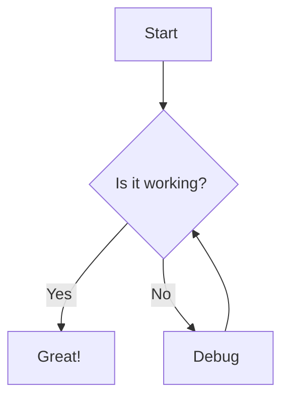

import Demo from '@components/Test/Demo.mdx'

## Components

### Includes from other Markdown files

```markdown
import Demo from '@components/Test/Demo.mdx'

<Demo />
```

<Demo />

### Search

import SearchBar from '@components/Search/SearchBar/index.astro'

<SearchBar />

### Avatar Component

```markdown
<Avatar name="User Name" />
```

Display author or user avatars:

<Avatar name="Kevin Brown" />

Avatar fallback if no image found:

<Avatar name="Kevin Thomas" />

### Callout Component

The Callout component highlights important information:

```markdown
<Callout type="info">
This is an informational callout. Use it to draw attention to helpful tips or additional context.
</Callout>
```

<Callout type="info">
This is an informational callout. Use it to draw attention to helpful tips or additional context.
</Callout>

```markdown
<Callout type="warning">
This is a warning callout. Use it to highlight potential pitfalls or important considerations.
</Callout>
```

<Callout type="warning">
This is a warning callout. Use it to highlight potential pitfalls or important considerations.
</Callout>

```markdown
<Callout type="success">
This is a success callout. Perfect for highlighting achievements or positive outcomes.
</Callout>
```

<Callout type="success">
This is a success callout. Perfect for highlighting achievements or positive outcomes.
</Callout>

```markdown
<Callout type="danger">
This is a danger callout. Use it for critical warnings or errors that need immediate attention.
</Callout>
```

<Callout type="danger">
This is a danger callout. Use it for critical warnings or errors that need immediate attention.
</Callout>

### Carousel Component

Showcase related articles using the production carousel component:

```markdown
<Carousel
  title="Featured articles"
  type="articles"
  variant="suggested"
  currentSlug="demo/index"
  limit={3}
/>
```

<Carousel
  title="Featured articles"
  type="articles"
  variant="suggested"
  currentSlug="demo/index"
  limit={3}
/>

### CodeTabs Component

```typescript
  console.log("hello, world!")
```

#### Grouped Code Tabs

The following examples substitute apostrophes for backticks so that they're not rendered to code blocks.

There can only be white space between two code blocks. Display name is set by `tabName` and can only contain characters in `[A-Za-z0-9_]`. Syntax for the language block on the first line of the code block is `language [group:tabName]`

```javascript [g1:Javascript]
  console.log('Hello World')
```
```typescript [g1:Typescript]
  type myType = "hello, world!"
```

#### Add a title to the code block

You can add a title to the code block by adding a `title` prop to the code block like `js title="script.js"`:

```js title="script.js"
  console.log('Hello World')
```

Note: the `title` prop is optional. If you don't add it, the code block will not have a title.

#### Highlight lines

You can highlight lines in the code block by adding a prop to the code blocks as a list of comma separated numbers in curly brackets like `js {1,3,5}`:

`{1}` will highlight line 1

`{1,3}` will highlight lines 1 and 3

`{2-5, 7}` will highlight lines 1 to 5(not included) and 7

```js {1,3,5}
  console.log('Hello World')
  console.log('Hello World')
  console.log('Hello World')
  console.log('Hello World')
  console.log('Hello World')
```

#### Highlight strings

You can highlight strings in the code block by adding a prop to the code blocks as a regular expression. The following example will highlight all occurrences of "astro" using a language string like `sh /astro/`:

`/astro/` will highlight all occurrences of "astro"
`/\w*$/` will highlight the last word of each line

```sh /astro/
  # Using NPM
  npx astro add @thewebforge/astro-code-blocks
  # Using Yarn
  yarn astro add @thewebforge/astro-code-blocks
  # Using PNPM
  pnpm astro add @thewebforge/astro-code-blocks
```

#### Insertions and Deletions

You can highlight insertions and deletions in the code block by adding `ins` and / or `del` props to the code blocks as a list of lines in curly brackets with a language string like `sh ins={3,4} del={5,6}`:

```sh ins={3,4} del={5,6}
  # Using NPM
  npx astro add @thewebforge/astro-code-blocks
  # Using Yarn
  yarn astro add @thewebforge/astro-code-blocks
  # Using PNPM
  pnpm astro add @thewebforge/astro-code-blocks
```

### Contact Callout Component

Invite readers to get in touch:

<Contact />

### Copy To Clipboard Component

#### Attribute

```markdown
<Copy value="src/index.js">Copy</Copy>
```

<Copy value="src/index.js">Copy</Copy>

Float mode:

```markdown
<Copy value="src/index.js" mode="float">Copy</Copy>
```

<Copy value="src/index.js" mode="float">Copy</Copy>

#### Element content

```markdown
<Copy for="blob-path"><div id="blob-path">Copy</div></Copy>
```

<Copy for="blob-path"><div id="blob-path">Copy</div></Copy>

Float mode:

```markdown
<Copy for="blob-path" mode="float"><div id="blob-path">Copy</div></Copy>
```

<Copy for="blob-path" mode="float"><div id="blob-path">Copy</div></Copy>

#### Form input

```markdown
<Copy for="blob-path"><input id="blob-path" value="src/index.js" /></Copy>
```

<Copy for="blob-path"><input id="blob-path" value="src/index.js" /></Copy>

Float mode:

```markdown
<Copy for="blob-path" mode="float"><input id="blob-path" value="src/index.js" /></Copy>
```

<Copy for="blob-path" mode="float"><input id="blob-path" value="src/index.js" /></Copy>

#### Hyperlink href

```markdown
<Copy for="blob-path"><a id="blob-path" href="/path/to#my-blob">Link text will not be copied</a></Copy>
```

<Copy for="blob-path"><a id="blob-path" href="/path/to#my-blob">Link text will not be copied</a></Copy>

Float mode:

```markdown
<Copy for="blob-path" mode="float"><a id="blob-path" href="/path/to#my-blob">Link text will not be copied</a></Copy>
```

<Copy for="blob-path" mode="float"><a id="blob-path" href="/path/to#my-blob">Link text will not be copied</a></Copy>

### Featured Content Component

Highlight featured articles or services:

<Featured
  title="Featured Content"
  description="Discover more articles and resources."
  link={{ href: "/articles", text: "Browse Articles" }}
/>

### Highlighter Component

The Highlighter component allows you to <Highlighter>emphasize specific text</Highlighter> wit

### Icon Component

Use SVG sprites for icons throughout your content:

```markdown
<Icon name="check" class="w-6 h-6 text-success" />
<Icon name="warning" class="w-6 h-6 text-warning" />
<Icon name="info" class="w-6 h-6 text-info" />
```

<Icon name="check" class="w-6 h-6 text-success" />
<Icon name="warning" class="w-6 h-6 text-warning" />
<Icon name="info" class="w-6 h-6 text-info" />

### Social Embeds Component

#### YouTube Embed

```markdown
<Embed
  type="youtube"
  url="https://www.youtube.com/watch?v=lSk-DWAJPbA"
/>
```

<Embed
  type="youtube"
  url="https://www.youtube.com/watch?v=lSk-DWAJPbA"
/>

#### X (Twitter) Embed

```markdown
<Embed
  type="x"
  url="https://x.com/WebstackDev/status/1717481221549445419"
/>
```

<Embed
  type="x"
  url="https://x.com/WebstackDev/status/1717481221549445419"
/>

#### GitHub Gist Embed

```markdown
<Embed
  type="gist"
  url="https://gist.github.com/webstackdev/455fb0b4e0d2332a8aaa02309563fb54"
/>
```

<Embed
  type="gist"
  url="https://gist.github.com/webstackdev/455fb0b4e0d2332a8aaa02309563fb54"
/>

### Newsletter Signup Component

Encourage readers to subscribe to your newsletter:

<Newsletter />

### Social Sharing Component

Add social sharing buttons for the article:

```markdown
<Shares />
```

<Shares />

### Testimonials Component

Display customer feedback and testimonials:

```markdown
<Testimonials count={3} />
```

<Testimonials count={3} />

### Time Component

```markdown
Let's go to the disco <Time datetime="2026-01-01T00:00:00.000Z" />.
```

Let's go to the disco <Time datetime="2026-01-01T00:00:00.000Z" />.

## GFM

### Footnote

```markdown
Here is a simple footnote[^1].
A footnote can also have multiple lines[^2].
It could also be [^named].
```

Here is a simple footnote[^1].
A footnote can also have multiple lines[^2].
It could also be [^named].

Footnote backref links should include a `title` attribute for accessibility.

The references can be anywhere in the document, before or after their use:

```markdown
[^1]: My reference.

[^2]: To add line breaks within a footnote, add 2 spaces to the end of a line.
  This is a second line.

[^named]: My reference.
```

[^1]: My reference.

[^2]: To add line breaks within a footnote, add 2 spaces to the end of a line.
  This is a second line.

[^named]: My reference.

### Strikethrough

`~one~` or `~~two~~` tildes: ~one~ ~~two~~

### Table

```markdown
| a | b  |  c |  d  |
| - | :- | -: | :-: |

| Feature | Supported | Notes |
|---------|-----------|-------|
| Callouts | ✅ | Multiple types available |
| Avatars | ✅ | Configurable sizes |
| Carousels | ✅ | Auto-play optional |
| Embeds | ✅ | Multiple platforms |
```

| a | b  |  c |  d  |
| - | :- | -: | :-: |

| Feature | Supported | Notes |
|---------|-----------|-------|
| Callouts | ✅ | Multiple types available |
| Avatars | ✅ | Configurable sizes |
| Carousels | ✅ | Auto-play optional |
| Embeds | ✅ | Multiple platforms |

### Grid (Adobe) table

```markdown
+-------------------+------+
| Table Headings    | Here |
+--------+----------+------+
| Sub    | Headings | Too  |
+========+=================+
| cell   | column spanning |
| spans  +---------:+------+
| rows   |   normal | cell |
+---v----+:---------------:+
|        | cells can be    |
|        | *formatted*     |
|        | **paragraphs**  |
|        | ```             |
| multi  | and             |
| line   | `contain`       |
| cells  | blocks          |
+========+=========:+======+
| footer |    cells |      |
+--------+----------+------+
```

+-------------------+------+
| Table Headings    | Here |
+--------+----------+------+
| Sub    | Headings | Too  |
+========+=================+
| cell   | column spanning |
| spans  +---------:+------+
| rows   |   normal | cell |
+---v----+:---------------:+
|        | cells can be    |
|        | _formatted_     |
|        | **paragraphs**  |
|        | ```             |
| multi  | and             |
| line   | `contain`       |
| cells  | blocks          |
+========+=========:+======+
| footer |    cells |      |
+--------+----------+------+

### Tasklist

```markdown
* [ ] to do
* [x] done
```

* [ ] to do
* [x] done

## Core Markdown

| Style                  | Syntax             | Keyboard shortcut                         | Example                                  | Output                                   |
| ---------------------- | ------------------ | ----------------------------------------- | ---------------------------------------- | ---------------------------------------- |
| Bold                   | `** **`       | Command+B (Mac) or Ctrl+B (Windows/Linux) | `**This is bold text**`                  | **This is bold text**                    |
| Italic                 | `_ _`         | Command+I (Mac) or Ctrl+I (Windows/Linux) | `_This text is italicized_`              | _This text is italicized_                |
| Strikethrough          | `~~ ~~` or `~ ~`   | None                                      | `~~This was mistaken text~~`             | ~~This was mistaken text~~               |
| Bold and nested italic | `** **` and `_ _`  | None                                      | `**This text is _extremely_ important**` | **This text is \*extremely\* important** |
| All bold and italic    | `*** ***`          | None                                      | `**_All this text is important_**`       | **_All this text is important_**         |
| Subscript              | `<sub> </sub>`     | None                                      | `This is a <sub>subscript</sub> text`    | This is a <sub>subscript</sub>           |
| Superscript            | `<sup> </sup>`     | None                                      | `This is a <sup>superscript</sup> text`  | This is a <sup>superscript</sup> text    |
| Underline              | `<ins> </ins>`     | None                                      | `This is an <ins>underlined</ins> text`  | This is an <ins>underlined</ins> text    |

### Blockquotes

> This is a blockquote. Use it for quotes, citations, or to highlight important statements from external sources.

Nested blockquotes:

```markdown
> Dorothy followed her through many of the beautiful rooms in her castle.
>
>> The Witch bade her clean the pots and kettles and sweep the floor and keep the fire fed with wood.
```

> Dorothy followed her through many of the beautiful rooms in her castle.
>
>> The Witch bade her clean the pots and kettles and sweep the floor and keep the fire fed with wood.

### Horizontal Rules

Asterisks (`***`):

***

Dashes (`---`):

---

Underscores ()`___`):

_________________

### Images

```markdown

```


Linked image:

[](https://www.flickr.com/photos/beaurogers/31833779864/in/photolist-Qv3rFw-34mt9F-a9Cmfy-5Ha3Zi-9msKdv-o3hgjr-hWpUte-4WMsJ1-KUQ8N-deshUb-vssBD-6CQci6-8AFCiD-zsJWT-nNfsgB-dPDwZJ-bn9JGn-5HtSXY-6CUhAL-a4UTXB-ugPum-KUPSo-fBLNm-6CUmpy-4WMsc9-8a7D3T-83KJev-6CQ2bK-nNusHJ-a78rQH-nw3NvT-7aq2qf-8wwBso-3nNceh-ugSKP-4mh4kh-bbeeqH-a7biME-q3PtTf-brFpgb-cg38zw-bXMZc-nJPELD-f58Lmo-bXMYG-bz8AAi-bxNtNT-bXMYi-bXMY6-bXMYv)

### `kbd`

This is a default HTML markup, just adding it here to not forget to use it when needed:

```markdown
<p>
  You can also create a new document by pressing the
  <kbd><kbd>Ctrl</kbd>+<kbd>N</kbd></kbd> shortcut.
</p>
```

<p>
  You can also create a new document by pressing the
  <kbd><kbd>Ctrl</kbd>+<kbd>N</kbd></kbd> shortcut.
</p>

### Links

```markdown
My favorite search engine is [Duck Duck Go](https://duckduckgo.com).

Visit our [homepage](/) or read more [articles](/articles) to explore additional content.
```

My favorite search engine is [Duck Duck Go](https://duckduckgo.com).

Visit our [homepage](/) or read more [articles](/articles) to explore additional content.

### Lists

Unordered lists:

```markdown
- First item
- Second item
- Third item with **bold text**
- Fourth item with *italic text*
```

- First item
- Second item
- Third item with **bold text**
- Fourth item with _italic text_

Ordered lists:

```markdown
1. First step
2. Second step
3. Third step
```

1. First step
2. Second step
3. Third step

Nested lists:

```markdown
1. First list item
   - First nested list item
     - Second nested list item
1. Second list item
   - First nested list item
     - Second nested list item
```

1. First list item
   - First nested list item
     - Second nested list item
1. Second list item
   - First nested list item
     - Second nested list item

### Bold and Nested Strikethrough

```markdown
**This text is _extremely_ important**
```

**This text is _extremely_ important**

### Escape Markup

Unified uses the backslash character to treat special Markdown symbols as literal text, preventing them from being interpreted as formatting instructions.

\\ (backslash): To display a literal backslash
\* (asterisk): Used for emphasis (italics or bold) or lists
\_ (underscore): Also used for emphasis
\# (hash symbol): Used for headings
\[ and \] (square brackets): Used for links
\( and \) (parentheses): Used in links or for other extensions like superscripts
\+, \-, \. (plus, minus, period): Used for lists
\! (exclamation mark): Used for images ()
\` (backtick): Used for inline code blocks
\> (greater-than sign): Used for blockquotes
\| (pipe): Used for tables in extended Markdown syntax

## Comments

Comments are not available, because it requires using Astro layout syntax (jsdoc-style comment inside squiggly brackets), which triggers Markdownlint rule requiring no spaces inside emphasis markers like asterisk.

## Colors

In single backtick code markers, applies a GitHub-like color dot:

```markdown
The background color is `#ffffff` for light mode and `#000000` for dark mode. In RGB `rgb(9, 105, 218)`, RGBA `rgba(255, 99, 71, 0.5)` in HSL `hsl(212, 92%, 45%)`, and in HSLA `hsla(240, 100%, 50%, 0.7)`.
```

The background color is `#ffffff` for light mode and `#000000` for dark mode. In RGB `rgb(9, 105, 218)`, RGBA `rgba(255, 99, 71, 0.5)` in HSL `hsl(212, 92%, 45%)`, and in HSLA `hsla(240, 100%, 50%, 0.7)`.

## Astro-generated heading ID links

```markdown
I can link internally to [Markdown Features](#unified-plugins) on the same page when writing Markdown.
```

I can link internally to [Markdown Features](#unified-plugins) on the same page when writing Markdown.

## Unified Plugins

### remark-abbreviations

```markdown
*[MDAST]: Markdown Abstract Syntax Tree.
*[AST]: Abstract syntax tree
```

*[MDAST]: Markdown Abstract Syntax Tree.
*[AST]: Abstract syntax tree

Should compile to the following HTML:

```html
<p>This plugin works on <abbr title="Markdown Abstract Syntax Tree.">MDAST</abbr>, a Markdown <abbr title="Abstract syntax tree">AST</abbr>
implemented by <a href="https://github.com/remarkjs/remark">remark</a></p>
```

### rehype-accessible-emojis

There is a doc listing all available emojis in the /docs directory.

```markdown
:rocket:
```

:rocket:

### rehype-mermaid

With Mermaid markup like this in a code block with "mermaid" set as the language:

```text
graph TD
    A[Start&nbsp;] --> B{Is it working?&nbsp;}
    B -->|Yes&nbsp;| C[Great!]
    B -->|No&nbsp;| D[Debug&nbsp;]
    D --> B
```



### remark-align

This custom plugin parses custom Markdown syntax to center- or right-align elements. Alignment is done by wrapping something in shortcode-style tags, applying Tailwind `text-right` or `text-center` classes:

```markdown
[center]paragraph[/center]

[right]paragraph[/right]
```

[center]A centered paragraph[/center]

[right]A right-aligned paragraph[/right]

Block elements can be wrapped with their own tags to apply `flex flex-col items-end` or `flex flex-col items-center` classes:

```markdown
[center]
> My blockquote
[/center]
```

[center]

> My blockquote

- a
- b

[/center]

[right]

> My blockquote

- a
- b

[/right]

### remark-attributes

Add HTML attributes to supported Markdown elements using a MDX-safe doubled-square-bracket postfix syntax:

```markdown
### Heading [[.my-class #my-id]]
 [[width=300 .centered]]
[Link](url) [[.btn target=_blank]]
```

 [[width=300 .centered]]
[Link Example](/testing/markdown) [[.btn target=_blank]]

### remark-attribution

The plugin allows to provide an attribution for a quotation:

```markdown
> That's one small step for [a] man, one giant leap for mankind.
> — Neil Armstrong (1969, July 21)
```

> That's one small step for [a] man, one giant leap for mankind.
> — Neil Armstrong (1969, July 21)

Should compile to the following HTML:

```html
The generated markup is not only accessible for screen readers but allows you to style the attribution line however you like:

<figure class="c-blockquote">
  <blockquote>
    <p>
      That's one small step for [a] man, one giant leap for mankind.
    </p>
  </blockquote>
  <figcaption class="c-blockquote__attribution">
    Neil Armstrong (1969, July 21)
  </figcaption>
</figure>
```

### remark-captions

By default it wraps the elements code, image, table and blockquote in a `<figure>` element, and adds a `<figcaption>` block as the last child. You can configure it to work on other elements by changing the keywords.

**Blockquote caption**

```markdown
> Some blockquote text that will have a caption
> Source: The caption text that will appear under the blockquote
```

> Some blockquote text that will have a caption
> Source: The caption text that will appear under the blockquote

**Code caption**

```ts
export const answer = 42
```
Code: This caption appears under the code block

**Table caption**

Note: a blank line is required before `Table:` so it parses as a paragraph after the table.

```markdown
| a | b |
| - | - |
| 1 | 2 |

Table: This caption appears under the table
```

| a | b |
| - | - |
| 1 | 2 |

Table: This caption appears under the table

**Image caption**

Note: the `Figure:` caption must be in the same paragraph as the image (no blank line).

```markdown

Figure: This caption appears under the image
```


Figure: This caption appears under the image

### remark-custom-blocks

This plugin parses custom Markdown syntax to create new custom blocks. It takes a config object with a name for the block, CSS classes to apply to it, and whether a title is required, optional, or the block does not have a title. An initial block is defined for HTML `<details>` and `<summary>` elements.

```markdown
[[details | My summary for a `<details>` and `<summary>` block]]
| Some content for the detail
```

[[details | My summary]]
| Some content for the detail

### remark-deflist

Definitions under definition header, stringified as `dl`, `dt`, and `dd`

```markdown
Term 1

: Definition 1
```

Term 1

: Definition 1

### remark-mark-plus

Inserts indicated text in a pair of `<mark>` elements

```markdown
my ==marked== text
```

my ==marked== text

### rehype-mathjax and remark-math

- `rehype-katex` is alternative but lacks accessibility

```markdown
Lift($$L$$) can be determined by Lift Coefficient ($$C_L$$) like the following
equation.
```

Lift($$L$$) can be determined by Lift Coefficient ($$C_L$$) like the following
equation.

The string `L = \frac{1}{2} \rho v^2 S C_L` within a fenced code black set to language `math`:

```math
L = \frac{1}{2} \rho v^2 S C_L
```

### remark-supersub

Subscript and superscript text

```markdown
~subscript~, e.g. a~i~

^superscript^, e.g. e^x^
```

Subscript: a~i~

Superscript: e^x^

### remark-video

Embed videos in HTML5 markup that are in the `/public` folder

```markdown
:::video
/videos/sample-video-1.mp4
:::
```

:::video
/videos/sample-video-1.mp4
:::

### remark-youtube

```markdown
[Example Video 1](https://youtu.be/enTFE2c68FQ)

[Example Video 2](https://www.youtube.com/watch?v=enTFE2c68FQ)
```

[Example Video 1](https://youtu.be/enTFE2c68FQ)

[Example Video 2](https://www.youtube.com/watch?v=enTFE2c68FQ)
