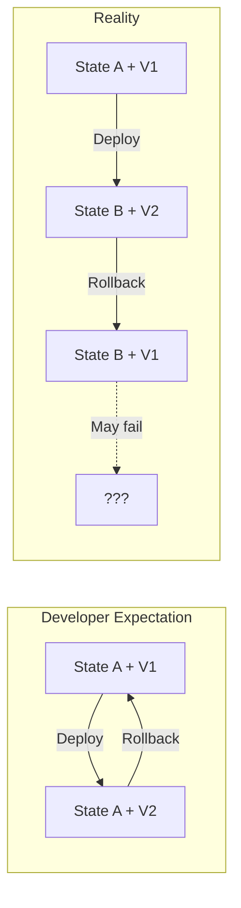
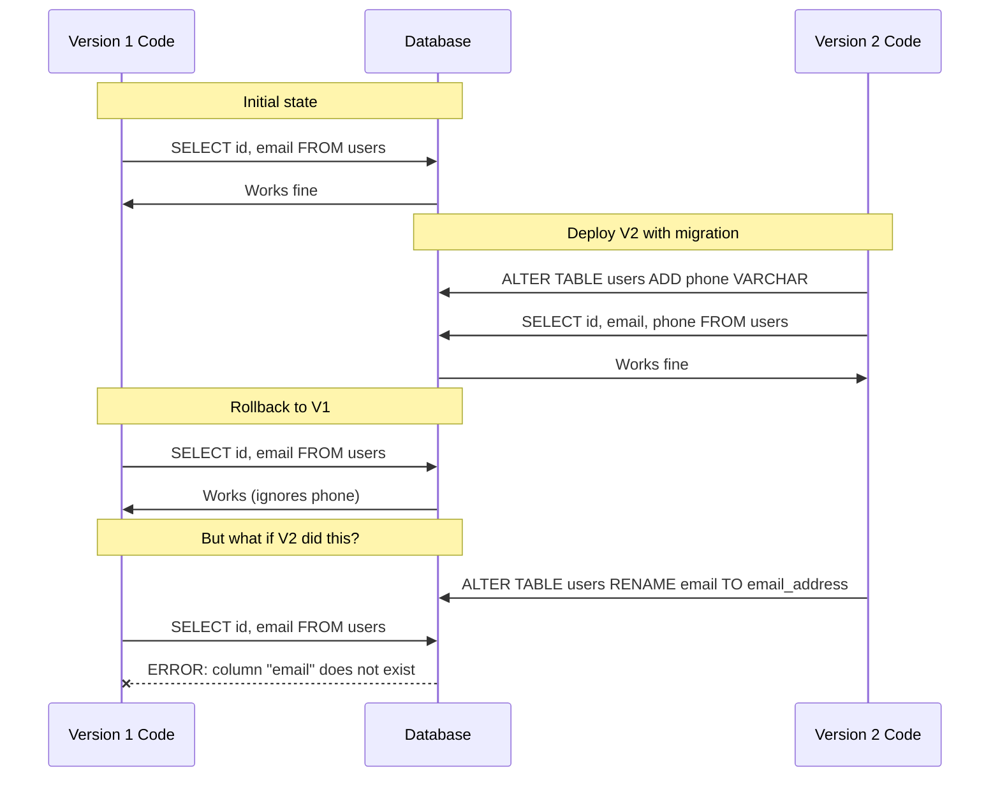
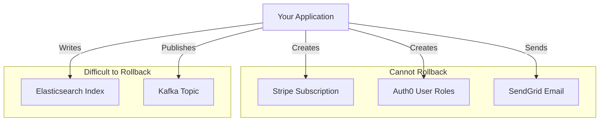
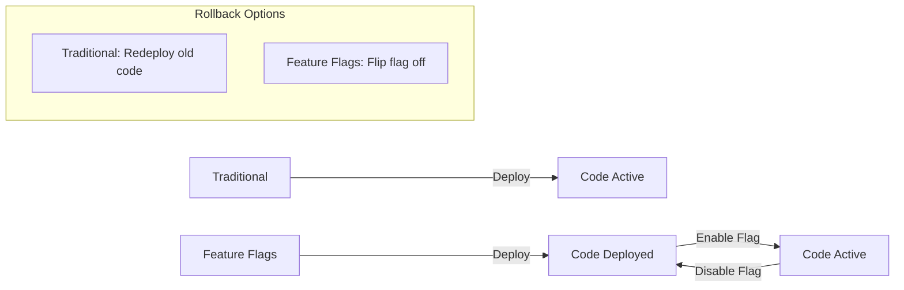
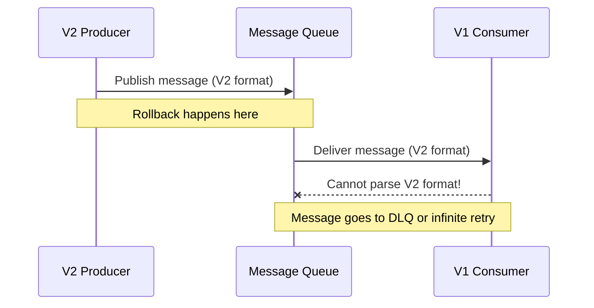
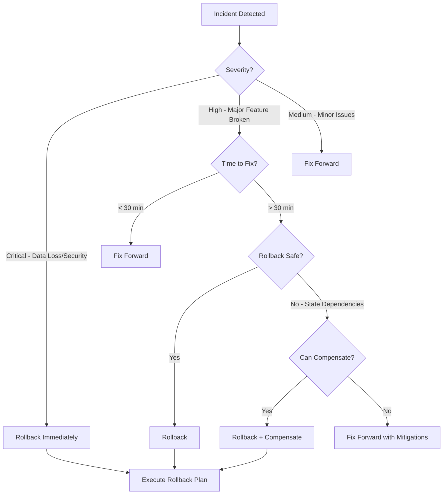

*[MTTR]: Mean Time To Recovery
*[CD]: Continuous Deployment
*[CI]: Continuous Integration
*[DB]: Database
*[API]: Application Programming Interface
*[SLA]: Service Level Agreement

# Why Rollback Fails: Semantics and State

## Introduction

Brief overview of the rollback illusion: teams assume rollback is the ultimate safety net—if something goes wrong, just deploy the previous version. But rollback often fails because it's based on a false premise: that deploying old code restores old behavior. This section frames the fundamental problem—applications have state, and state doesn't roll back with code.

_Include a real scenario: a team deploys a new version that introduces a database column. They notice a bug and trigger rollback. The old code starts up, immediately fails because it doesn't recognize the new column, and now both forward deployment AND rollback are broken. The team is stuck at 2 AM with no working version._

<Callout type="warning">
Rollback is not time travel. It's a forward deployment of old code into a world that has changed. Understanding this distinction is the difference between reliable recovery and cascading failures.
</Callout>

## The Rollback Mental Model

### What Rollback Actually Does

Explain the gap between expectation and reality.

```text
What Developers Think Rollback Does:
  Time T:    System in state A, running version V1
  Time T+1:  Deploy version V2
  Time T+2:  Something breaks
  Time T+3:  Rollback → System returns to state A with V1

What Rollback Actually Does:
  Time T:    System in state A, running version V1
  Time T+1:  Deploy version V2
  Time T+2:  Something breaks, state is now B
  Time T+3:  Rollback → Deploy V1 into state B

The system is now running V1 against state B.
If V1 is incompatible with state B, rollback makes things worse.
```


Figure: Expected rollback vs actual rollback behavior.

### State That Doesn't Roll Back

Catalog the types of state that persist through rollback.

| State Type | Example | Rollback Behavior |
|------------|---------|-------------------|
| Database schema | New columns, tables | Stays changed |
| Database data | Migrated records, new formats | Stays changed |
| External service state | Stripe subscriptions, Auth0 users | Cannot rollback |
| User-generated content | Posts, comments with new fields | Stays in new format |
| Cache state | New cache keys, invalidated entries | Partially stale |
| Queue messages | Messages in new format | Old code can't process |
| Feature flag state | Flags enabled for users | May need manual reset |
| API contracts | Consumers using new endpoints | Old version doesn't have them |

Table: State types and their rollback behavior.

<Callout type="info">
Every deployment creates artifacts that outlive the deployment itself. Schema changes, data migrations, and external state changes are the most common rollback blockers.
</Callout>

## Schema Dependencies

### The Schema Rollback Problem

Explain why schema changes break rollback.


Figure: Schema changes that break rollback.

### Safe vs Unsafe Schema Changes

```yaml title="schema-rollback-safety.yaml"
safe_for_rollback:
  - operation: "ADD COLUMN (nullable)"
    reason: "Old code ignores new columns"

  - operation: "ADD INDEX"
    reason: "Old code doesn't know about indexes"

  - operation: "ADD TABLE"
    reason: "Old code doesn't reference new tables"

unsafe_for_rollback:
  - operation: "DROP COLUMN"
    reason: "Old code may reference it"
    rollback_strategy: "Restore column before rollback"

  - operation: "RENAME COLUMN"
    reason: "Old code uses old name"
    rollback_strategy: "Use expand-contract pattern"

  - operation: "CHANGE COLUMN TYPE"
    reason: "Old code expects old type"
    rollback_strategy: "Dual columns during transition"

  - operation: "ADD NOT NULL CONSTRAINT"
    reason: "Old code may not provide value"
    rollback_strategy: "Add as nullable first"

  - operation: "DROP TABLE"
    reason: "Old code may reference it"
    rollback_strategy: "Never drop until fully deprecated"
```
Code: Schema change rollback safety classification.

### Designing for Rollback-Safe Migrations

```sql title="rollback-safe-migration.sql"
-- ❌ UNSAFE: Direct rename breaks rollback
ALTER TABLE users RENAME COLUMN email TO email_address;

-- ✅ SAFE: Expand-contract allows rollback at any point

-- Phase 1: Add new column (V1 and V2 both work)
ALTER TABLE users ADD COLUMN email_address VARCHAR(255);

-- Phase 2: Dual-write in V2, V1 still works (ignores new column)
-- Application code writes to both columns

-- Phase 3: Backfill (V1 and V2 both work)
UPDATE users SET email_address = email WHERE email_address IS NULL;

-- Phase 4: V2 reads from new column, V1 still works

-- Phase 5: Stop writing to old column (V1 no longer deployed)

-- Phase 6: Drop old column (only after rollback window expires)
ALTER TABLE users DROP COLUMN email;
```
Code: Rollback-safe migration using expand-contract.

<Callout type="success">
The expand-contract pattern keeps rollback possible at every step. You can roll back to V1 at any point during phases 1-4 without breaking functionality.
</Callout>

## Data Migration Dependencies

### When Data Changes Format

```typescript title="data-format-migration.ts"
// Version 1: Address stored as single string
interface UserV1 {
  id: string;
  address: string;  // "123 Main St, City, ST 12345"
}

// Version 2: Address stored as structured object
interface UserV2 {
  id: string;
  address: {
    street: string;
    city: string;
    state: string;
    zip: string;
  };
}

// Migration converts string → object
// But rollback requires object → string
// Information may be lost (what if street had commas?)
```
Code: Data format change that complicates rollback.

```yaml title="data-migration-rollback-strategies.yaml"
strategies:
  keep_both_formats:
    description: "Store data in both formats during transition"
    implementation: |
      // V2 writes to both columns
      user.address_string = formatAddressString(user.address);
      user.address_json = user.address;
    rollback_impact: "V1 reads address_string, works fine"

  reversible_transformation:
    description: "Ensure transformation is reversible"
    implementation: |
      // Store original format alongside new
      user.address_json = {
        ...parsedAddress,
        _original: user.address_string
      };
    rollback_impact: "Can restore original exactly"

  version_field:
    description: "Track which version created the record"
    implementation: |
      user.address_version = 2;
      user.address = structuredAddress;
    rollback_impact: "V1 knows to skip V2-format records or use fallback"
```
Code: Strategies for rollback-safe data migrations.

### Handling In-Flight Data

```text
The In-Flight Problem:

T+0:   Deploy V2
T+1:   User creates record in V2 format
T+2:   Problem detected, begin rollback
T+3:   V1 starts up
T+4:   V1 tries to read V2-format record → Error

The record created at T+1 is "in flight" - it was created
by V2 but must be readable by V1 after rollback.

Solutions:
1. Backward-compatible formats (V1 can read V2 data)
2. Data migration script as part of rollback
3. Accept that some records may be inaccessible
```

<Callout type="warning">
Data created by version N must be readable by version N-1 if you want reliable rollback. This is a design constraint, not an operational afterthought.
</Callout>

## External Service Dependencies

### State You Don't Control


Figure: External state created during deployment.

### Compensating Actions

```typescript title="external-state-compensation.ts"
class DeploymentRollbackManager {
  async rollbackWithCompensation(
    deployment: Deployment,
    options: RollbackOptions,
  ): Promise<RollbackResult> {
    const compensations: CompensatingAction[] = [];

    // Identify external changes made by this deployment
    const externalChanges = await this.identifyExternalChanges(deployment);

    for (const change of externalChanges) {
      switch (change.type) {
        case 'stripe_subscription_created':
          compensations.push({
            action: 'cancel_subscription',
            target: change.subscriptionId,
            // Don't auto-execute - needs human review
            requiresApproval: true,
            reason: 'Created by deployment being rolled back',
          });
          break;

        case 'feature_flag_enabled':
          compensations.push({
            action: 'disable_feature_flag',
            target: change.flagKey,
            requiresApproval: false,
            autoExecute: true,
          });
          break;

        case 'email_sent':
          compensations.push({
            action: 'send_correction_email',
            target: change.recipients,
            requiresApproval: true,
            reason: 'May need to notify users of issue',
          });
          break;

        case 'webhook_registered':
          compensations.push({
            action: 'unregister_webhook',
            target: change.webhookUrl,
            autoExecute: true,
          });
          break;
      }
    }

    // Execute auto-safe compensations
    const autoCompensations = compensations.filter(c => c.autoExecute);
    for (const comp of autoCompensations) {
      await this.executeCompensation(comp);
    }

    // Return list of compensations needing human review
    return {
      codeRolledBack: true,
      autoCompensated: autoCompensations,
      pendingCompensations: compensations.filter(c => c.requiresApproval),
    };
  }
}
```
Code: Compensation management for external state.

```yaml title="external-state-runbook.yaml"
rollback_external_state:
  stripe:
    subscriptions_created:
      - "List subscriptions created since deployment"
      - "Determine if they should be cancelled or modified"
      - "Communicate with affected customers if needed"
      - "Execute cancellations/modifications"

  auth0:
    roles_changed:
      - "Export current role assignments"
      - "Compare to pre-deployment snapshot"
      - "Revert role changes if needed"

  elasticsearch:
    index_schema_changed:
      - "Check if old code can query new schema"
      - "If not, reindex with old schema"
      - "May require index alias swap"

  kafka:
    messages_published:
      - "Messages cannot be unpublished"
      - "Consumers must handle both formats"
      - "May need to publish correction messages"
```
Code: Runbook for external state rollback.

<Callout type="info">
External state changes often can't be "rolled back"—they require compensating actions. Design your deployment process to track what external changes were made so you know what to compensate.
</Callout>

## Feature Flags as Rollback Primitive

### Decoupling Deploy from Release


Figure: Feature flags separate deployment from activation.

```typescript title="feature-flag-release.ts"
// Code is deployed but gated behind feature flag
class PaymentService {
  async processPayment(order: Order): Promise<PaymentResult> {
    // Feature flag controls which implementation runs
    if (await this.featureFlags.isEnabled('new-payment-flow', order.userId)) {
      return this.processPaymentV2(order);
    } else {
      return this.processPaymentV1(order);
    }
  }

  // Old implementation - always works
  private async processPaymentV1(order: Order): Promise<PaymentResult> {
    // ... existing implementation
  }

  // New implementation - may have issues
  private async processPaymentV2(order: Order): Promise<PaymentResult> {
    // ... new implementation with new features
  }
}

// "Rollback" is just disabling the flag
// No deployment needed, instant effect
await featureFlags.disable('new-payment-flow');
```
Code: Feature flag enabling instant rollback without deployment.

### Progressive Rollout and Rollback

```yaml title="progressive-rollout.yaml"
feature_flag_rollout:
  flag_name: "new-checkout-flow"

  stages:
    - name: "Internal testing"
      percentage: 0
      targeting:
        - rule: "email ends with @company.com"
          variation: true
      duration: "3 days"
      success_criteria:
        - "No errors in logs"
        - "Conversion rate stable"

    - name: "Beta users"
      percentage: 0
      targeting:
        - rule: "user.beta_tester = true"
          variation: true
      duration: "1 week"
      success_criteria:
        - "No increase in support tickets"
        - "Positive feedback"

    - name: "1% rollout"
      percentage: 1
      duration: "1 day"
      success_criteria:
        - "Error rate < 0.1%"
        - "Latency p99 < 500ms"

    - name: "10% rollout"
      percentage: 10
      duration: "3 days"
      rollback_trigger:
        - "Error rate > 1%"
        - "Latency p99 > 1000ms"

    - name: "50% rollout"
      percentage: 50
      duration: "1 week"

    - name: "Full rollout"
      percentage: 100

  rollback_procedure:
    automatic:
      - trigger: "Error rate > 5%"
        action: "Reduce to previous percentage"
      - trigger: "Error rate > 10%"
        action: "Disable flag entirely"
    manual:
      - "Disable flag in LaunchDarkly/Split/etc"
      - "Takes effect within 30 seconds"
      - "No deployment required"
```
Code: Progressive feature flag rollout with automatic rollback.

### Coordinating Multiple Flags

```typescript title="flag-coordination.ts"
// When features depend on each other, coordinate flag changes

interface FeatureDependency {
  flag: string;
  requires: string[];
  conflictsWith: string[];
}

const dependencies: FeatureDependency[] = [
  {
    flag: 'new-checkout-ui',
    requires: ['new-payment-api'],  // UI needs new API
    conflictsWith: [],
  },
  {
    flag: 'new-payment-api',
    requires: [],
    conflictsWith: ['legacy-payment-fallback'],
  },
];

class FlagCoordinator {
  async enableFlag(flagName: string): Promise<void> {
    const dep = this.getDependency(flagName);

    // Check that required flags are enabled
    for (const required of dep.requires) {
      if (!await this.isEnabled(required)) {
        throw new Error(
          `Cannot enable ${flagName}: requires ${required} to be enabled first`
        );
      }
    }

    // Check for conflicts
    for (const conflict of dep.conflictsWith) {
      if (await this.isEnabled(conflict)) {
        throw new Error(
          `Cannot enable ${flagName}: conflicts with ${conflict}`
        );
      }
    }

    await this.featureFlags.enable(flagName);
  }

  async rollbackFeature(flagName: string): Promise<void> {
    // Find flags that depend on this one
    const dependents = this.getDependents(flagName);

    // Disable dependents first
    for (const dependent of dependents) {
      if (await this.isEnabled(dependent)) {
        console.log(`Disabling dependent flag: ${dependent}`);
        await this.disableFlag(dependent);
      }
    }

    // Then disable the target flag
    await this.disableFlag(flagName);
  }
}
```
Code: Feature flag dependency coordination.

<Callout type="success">
Feature flags turn rollback from a deployment operation (minutes) into a configuration change (seconds). The trade-off is code complexity—you're maintaining two code paths until the flag is fully rolled out and cleaned up.
</Callout>

## Queue and Event Dependencies

### Messages in Flight During Rollback


Figure: V2 messages stranded after rollback to V1.

### Designing Rollback-Safe Message Formats

```typescript title="versioned-messages.ts"
// Always version your message schemas
interface MessageEnvelope<T> {
  version: number;
  schemaType: string;
  payload: T;
  producerVersion: string;
  timestamp: Date;
}

// Consumer handles multiple versions
class OrderEventConsumer {
  async handleMessage(envelope: MessageEnvelope<unknown>): Promise<void> {
    switch (envelope.schemaType) {
      case 'OrderCreated':
        return this.handleOrderCreated(envelope);
      default:
        // Unknown message type - log and skip
        console.warn(`Unknown message type: ${envelope.schemaType}`);
        return;
    }
  }

  private async handleOrderCreated(
    envelope: MessageEnvelope<unknown>
  ): Promise<void> {
    switch (envelope.version) {
      case 1:
        return this.handleOrderCreatedV1(envelope.payload as OrderCreatedV1);
      case 2:
        return this.handleOrderCreatedV2(envelope.payload as OrderCreatedV2);
      default:
        // Future version - try to handle as latest known version
        // or skip if incompatible
        if (envelope.version > 2) {
          console.warn(`Unknown version ${envelope.version}, attempting V2 handler`);
          return this.handleOrderCreatedV2(envelope.payload as OrderCreatedV2);
        }
        throw new Error(`Cannot handle OrderCreated version ${envelope.version}`);
    }
  }
}
```
Code: Version-aware message handling for rollback compatibility.

### Queue Draining Strategy

```yaml title="queue-rollback-strategy.yaml"
pre_rollback:
  - action: "Pause message production"
    reason: "Stop V2 messages from being created"

  - action: "Drain existing V2 messages"
    options:
      - "Let current V2 consumers process them"
      - "Move V2 messages to parking queue"
      - "Accept some messages will go to DLQ"

  - action: "Verify queue is empty or V1-compatible"

post_rollback:
  - action: "Resume message production"
    note: "V1 now producing V1 messages"

  - action: "Process DLQ for V2 messages"
    options:
      - "Re-publish as V1 format (if convertible)"
      - "Manual processing"
      - "Discard if acceptable"
```
Code: Queue management during rollback.

<Callout type="warning">
Messages are persistent state. A rollback that ignores in-flight messages will either lose data (if discarded) or cause errors (if V1 can't process V2 format). Plan for this explicitly.
</Callout>

## Rollback Testing

### Testing Rollback as Part of CI/CD

```yaml title="rollback-test-pipeline.yaml"
# .github/workflows/rollback-test.yaml
name: Rollback Test

on:
  push:
    branches: [main]

jobs:
  deploy-and-rollback:
    runs-on: ubuntu-latest
    steps:
      - uses: actions/checkout@v4

      - name: Get previous version
        id: prev-version
        run: |
          echo "version=$(git rev-parse HEAD~1)" >> $GITHUB_OUTPUT

      - name: Deploy current version to test env
        run: |
          ./deploy.sh test ${{ github.sha }}

      - name: Run smoke tests
        run: |
          ./smoke-tests.sh test

      - name: Simulate rollback
        run: |
          ./deploy.sh test ${{ steps.prev-version.outputs.version }}

      - name: Run rollback verification
        run: |
          # Verify previous version works with current state
          ./smoke-tests.sh test

          # Verify no data corruption
          ./data-integrity-check.sh test

      - name: Restore current version
        run: |
          ./deploy.sh test ${{ github.sha }}
```
Code: CI pipeline that tests rollback capability.

### Rollback Drills

```yaml title="rollback-drill-runbook.yaml"
quarterly_rollback_drill:
  preparation:
    - "Schedule drill during low-traffic period"
    - "Notify stakeholders"
    - "Ensure previous version is available"
    - "Take database snapshot"

  execution:
    - step: "Trigger rollback"
      command: "./rollback.sh production"
      expected_duration: "< 5 minutes"

    - step: "Verify service health"
      checks:
        - "All health endpoints return 200"
        - "Error rate returns to baseline"
        - "No data corruption"

    - step: "Verify rollback artifacts"
      checks:
        - "Previous version code is running"
        - "Feature flags reverted (if applicable)"
        - "External state documented"

  post_drill:
    - "Roll forward to current version"
    - "Document any issues found"
    - "Update rollback runbook if needed"
    - "Share findings with team"

  success_criteria:
    - "Rollback completes in < 10 minutes"
    - "No customer-visible errors during drill"
    - "All critical functionality works post-rollback"
```
Code: Quarterly rollback drill runbook.

<Callout type="info">
Practice rollback before you need it. A rollback procedure that's never been tested is a rollback procedure that will fail at 3 AM when you need it most.
</Callout>

## Rollback Decision Framework

### When to Roll Back vs Fix Forward


Figure: Rollback decision tree.

### Rollback Readiness Checklist

```yaml title="rollback-readiness-checklist.yaml"
pre_deployment_checklist:
  schema_changes:
    - "[ ] All migrations are backward compatible"
    - "[ ] Rollback scripts tested"
    - "[ ] No destructive schema changes"

  data_changes:
    - "[ ] Data format changes are reversible"
    - "[ ] Old code can read new data format"
    - "[ ] Backfill scripts have reverse scripts"

  external_services:
    - "[ ] External state changes documented"
    - "[ ] Compensation actions identified"
    - "[ ] Rollback doesn't break external integrations"

  feature_flags:
    - "[ ] New features behind flags"
    - "[ ] Flag disable procedure documented"
    - "[ ] Flag dependencies mapped"

  queue_messages:
    - "[ ] Message format changes are backward compatible"
    - "[ ] Consumers handle multiple versions"
    - "[ ] DLQ handling procedure documented"

  artifacts:
    - "[ ] Previous version artifacts available"
    - "[ ] Deployment scripts support rollback"
    - "[ ] Rollback runbook updated"
```
Code: Pre-deployment rollback readiness checklist.

## Conclusion

Summarize the key principles: rollback is a forward deployment of old code into changed state, not time travel; schema and data changes must be designed for backward compatibility; feature flags provide instant rollback capability; external state requires compensation, not rollback; and testing rollback is as important as testing deployment. Emphasize that reliable rollback is a design constraint that affects how you write migrations, structure features, and plan deployments.

<Callout type="success">
The goal isn't to make rollback unnecessary—incidents happen. The goal is to make rollback reliable when you need it. Design every deployment with the question: "If I need to roll back in an hour, what state will block me?"
</Callout>

---

## Cover Prompt

### Prompt 1: The Time Machine That Doesn't Work

Create an image of a broken time machine control panel with warning lights. The "ROLLBACK" lever is pulled, but instead of going backward, the timeline shows the machine moving forward into an altered state. Cracks appear where past and present don't align. Style: retro sci-fi control panel, warning red lights, broken mechanism aesthetic, 16:9 aspect ratio.

### Prompt 2: The Tangled Threads

Design an image of threads representing code and state. The code thread can be pulled back (rolled back), but it's tangled with database, external service, and message queue threads that resist. The more you pull, the more tangled it becomes. Style: abstract thread visualization, tension and resistance, warm and cool color contrast, 16:9 aspect ratio.

### Prompt 3: The Feature Flag Control Room

Illustrate a mission control room where operators can flip large switches (feature flags) to instantly enable or disable features. Multiple screens show rollout percentages. One operator confidently flips a switch labeled "ROLLBACK" with immediate effect shown on monitors. Style: NASA mission control aesthetic, dramatic lighting, professional and powerful, 16:9 aspect ratio.

### Prompt 4: The Two Trains Problem

Create an image of two trains on parallel tracks representing old and new code. Between them, a complex switching yard of shared tracks represents state (database, queues, external services). Rolling back means running the old train on tracks that have been modified for the new one. Style: railway engineering diagram, bird's eye view, technical blueprint aesthetic, 16:9 aspect ratio.

### Prompt 5: The Safety Net with Holes

Design an image of a trapeze artist (deployment) with a safety net (rollback) below. But the net has holes where database changes, external state, and message queues have burned through. The artist must be aware of where the holes are before jumping. Style: circus safety metaphor, dramatic lighting, visible gaps in net, 16:9 aspect ratio.
