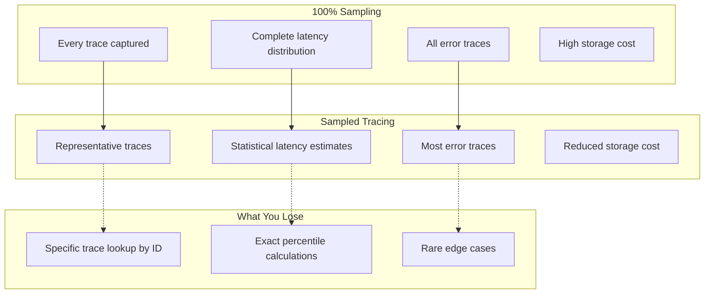
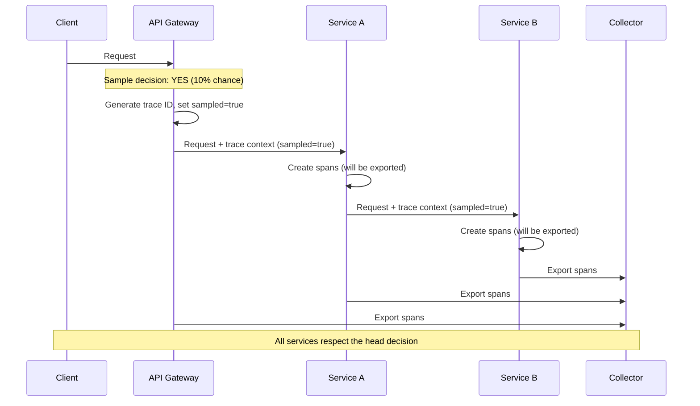
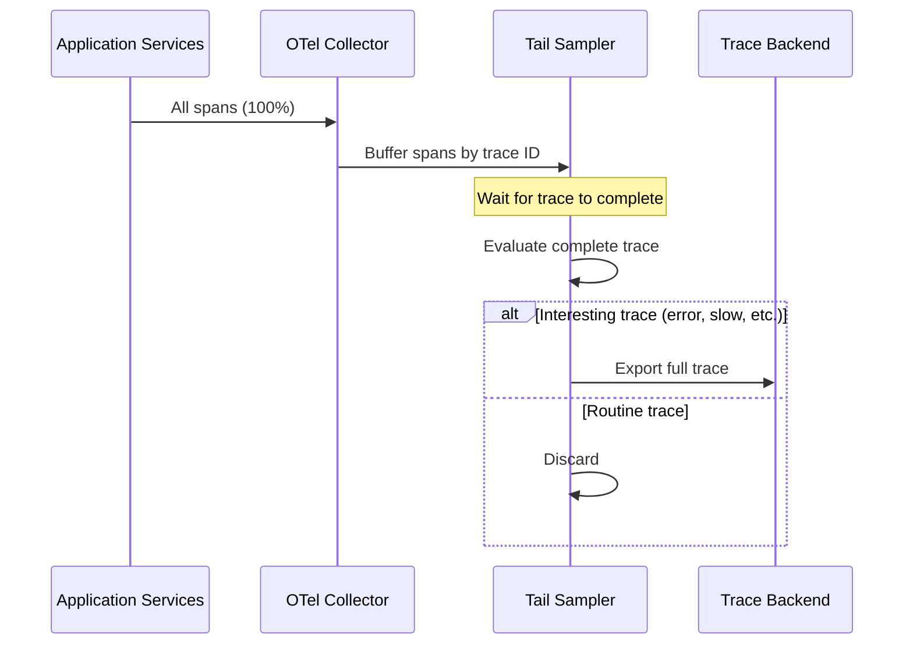
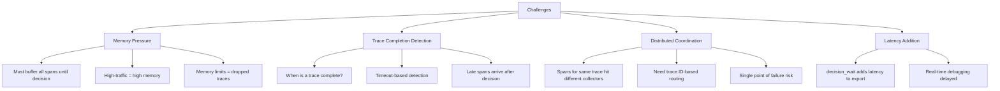
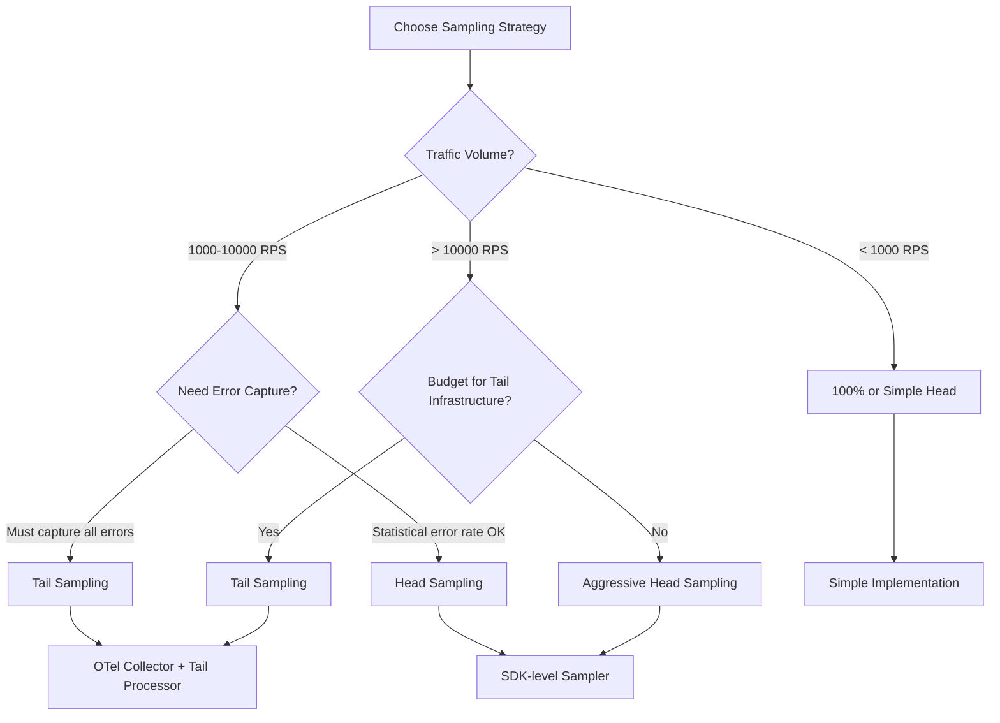

*[APM]: Application Performance Monitoring
*[OTel]: OpenTelemetry
*[SDK]: Software Development Kit
*[RPS]: Requests Per Second
*[SLA]: Service Level Agreement
*[P99]: 99th Percentile
*[P50]: 50th Percentile
*[GB]: Gigabyte
*[TB]: Terabyte

# Distributed Tracing: Value Without 100% Sampling

## Introduction

Brief overview of the sampling dilemma: distributed tracing is invaluable for understanding request flow through microservices, but 100% sampling creates massive storage costs, network overhead, and signal-to-noise problems. This section frames the core trade-off—how do you capture the traces that matter while discarding the routine ones?

_Include the math: a system handling 10,000 RPS with an average of 20 spans per trace, each span 1KB, generates 200MB/second of trace data—17TB per day. At typical APM pricing, that's financially unsustainable._

<Callout type="info">
The goal of sampling isn't to reduce costs (though it does). The goal is to increase signal—keeping the traces that teach you something while discarding the identical successful requests that teach you nothing.
</Callout>

## The Sampling Problem Space

### Why 100% Sampling Fails at Scale

Explain the compound problems of full sampling.

| Problem | Impact | Scale Factor |
|---------|--------|--------------|
| Storage costs | APM vendors charge per GB ingested | Linear with traffic |
| Network overhead | Exporter bandwidth, collector capacity | Linear with traffic |
| Query performance | Searching billions of spans is slow | Superlinear with data |
| Signal-to-noise | Finding interesting traces in sea of identical ones | Exponential difficulty |
| Cardinality explosion | High-cardinality attributes multiply storage | Multiplicative |
| Processing latency | Collectors become bottleneck | Throughput ceiling |

Table: Problems with 100% sampling at scale.

```text
The Economics of Tracing at Scale:

Traffic:          10,000 RPS
Spans per trace:  20 average
Span size:        1 KB average
Trace size:       20 KB

Per second:       200 MB
Per hour:         720 GB
Per day:          17.3 TB
Per month:        519 TB

At $0.30/GB ingestion (typical APM pricing):
Monthly cost:     $155,700

At 1% sampling:
Monthly cost:     $1,557
Monthly savings:  $154,143
```

### What Sampling Preserves and Loses


Figure: Trade-offs between full and sampled tracing.

<Callout type="warning">
Sampling means you can't always find a specific trace by ID. If a customer reports an issue and you only have their trace ID, there's a chance that trace wasn't sampled. Design your debugging workflow around this reality.
</Callout>

## Head-Based Sampling

### How Head Sampling Works

Explain the decision point at trace initiation.


Figure: Head-based sampling decision flow.

```typescript title="head-sampling-implementation.ts"
import { Sampler, SamplingResult, SamplingDecision } from '@opentelemetry/sdk-trace-base';
import { Context, SpanKind, Attributes } from '@opentelemetry/api';

// Simple probability-based head sampler
class ProbabilitySampler implements Sampler {
  private readonly probability: number;
  private readonly upperBound: number;

  constructor(probability: number) {
    this.probability = Math.max(0, Math.min(1, probability));
    // Use trace ID as random source for consistent decisions
    this.upperBound = Math.floor(probability * 0xffffffff);
  }

  shouldSample(
    context: Context,
    traceId: string,
    spanName: string,
    spanKind: SpanKind,
    attributes: Attributes,
  ): SamplingResult {
    // Extract last 8 characters of trace ID as hex number
    const traceIdNum = parseInt(traceId.slice(-8), 16);

    // Deterministic decision based on trace ID
    // Same trace ID always gets same decision across all services
    const shouldSample = traceIdNum < this.upperBound;

    return {
      decision: shouldSample
        ? SamplingDecision.RECORD_AND_SAMPLED
        : SamplingDecision.NOT_RECORD,
      attributes: {},
    };
  }

  toString(): string {
    return `ProbabilitySampler{probability=${this.probability}}`;
  }
}

// Usage
const sampler = new ProbabilitySampler(0.1); // 10% sampling
```
Code: Probability-based head sampler implementation.

### Head Sampling Strategies

```yaml title="head-sampling-strategies.yaml"
strategies:
  fixed_probability:
    description: "Sample fixed percentage of all traces"
    implementation: "Random decision at trace start"
    pros:
      - "Simple to implement and understand"
      - "Predictable cost"
      - "Statistically representative"
    cons:
      - "Misses rare but important traces"
      - "Same rate for all request types"
    use_when: "Baseline sampling for general visibility"

  rate_limiting:
    description: "Sample N traces per second maximum"
    implementation: "Token bucket or leaky bucket at entry point"
    pros:
      - "Predictable cost ceiling"
      - "Handles traffic spikes"
    cons:
      - "Lower effective rate during high traffic"
      - "May miss important traces during spikes"
    use_when: "Hard budget constraints"

  attribute_based:
    description: "Sample based on request attributes"
    implementation: "Rules engine evaluating headers, path, user"
    pros:
      - "Higher rates for important requests"
      - "Can ensure critical paths are traced"
    cons:
      - "Complex configuration"
      - "Must know important attributes upfront"
    use_when: "Different request types have different value"

  parent_based:
    description: "Inherit sampling decision from parent span"
    implementation: "Propagate W3C tracestate sampling flag"
    pros:
      - "Consistent decisions across services"
      - "Upstream controls downstream"
    cons:
      - "Root span decision affects entire trace"
      - "No service-level override"
    use_when: "Distributed systems with clear entry points"
```
Code: Head sampling strategy comparison.

### Attribute-Based Head Sampling

```typescript title="attribute-based-sampler.ts"
interface SamplingRule {
  name: string;
  condition: (attributes: Attributes, spanName: string) => boolean;
  sampleRate: number;
  priority: number;
}

class RuleBasedSampler implements Sampler {
  private rules: SamplingRule[];
  private defaultRate: number;

  constructor(rules: SamplingRule[], defaultRate: number = 0.01) {
    // Sort by priority (highest first)
    this.rules = rules.sort((a, b) => b.priority - a.priority);
    this.defaultRate = defaultRate;
  }

  shouldSample(
    context: Context,
    traceId: string,
    spanName: string,
    spanKind: SpanKind,
    attributes: Attributes,
  ): SamplingResult {
    // Find first matching rule
    for (const rule of this.rules) {
      if (rule.condition(attributes, spanName)) {
        const shouldSample = this.probabilisticDecision(traceId, rule.sampleRate);
        return {
          decision: shouldSample
            ? SamplingDecision.RECORD_AND_SAMPLED
            : SamplingDecision.NOT_RECORD,
          attributes: { 'sampling.rule': rule.name },
        };
      }
    }

    // Default sampling rate
    const shouldSample = this.probabilisticDecision(traceId, this.defaultRate);
    return {
      decision: shouldSample
        ? SamplingDecision.RECORD_AND_SAMPLED
        : SamplingDecision.NOT_RECORD,
      attributes: { 'sampling.rule': 'default' },
    };
  }

  private probabilisticDecision(traceId: string, rate: number): boolean {
    const traceIdNum = parseInt(traceId.slice(-8), 16);
    return traceIdNum < rate * 0xffffffff;
  }
}

// Example rules
const samplingRules: SamplingRule[] = [
  {
    name: 'always-sample-errors',
    condition: (attrs) => attrs['error'] === true,
    sampleRate: 1.0,  // 100% of errors
    priority: 100,
  },
  {
    name: 'high-value-customers',
    condition: (attrs) => attrs['customer.tier'] === 'enterprise',
    sampleRate: 0.5,  // 50% of enterprise customer requests
    priority: 90,
  },
  {
    name: 'payment-endpoints',
    condition: (attrs, spanName) => spanName.startsWith('POST /api/payments'),
    sampleRate: 0.25,  // 25% of payment requests
    priority: 80,
  },
  {
    name: 'health-checks',
    condition: (attrs, spanName) => spanName.includes('/health'),
    sampleRate: 0.001,  // 0.1% of health checks
    priority: 70,
  },
];

const sampler = new RuleBasedSampler(samplingRules, 0.05);
```
Code: Rule-based head sampler with priorities.

<Callout type="success">
Attribute-based sampling lets you apply business logic to sampling decisions. Sample 100% of payment transactions, 50% of enterprise customer requests, and 1% of health checks—all from the same system.
</Callout>

## Tail-Based Sampling

### How Tail Sampling Works

Explain the fundamentally different approach.


Figure: Tail-based sampling decision flow.

```yaml title="tail-sampling-architecture.yaml"
architecture:
  components:
    application_services:
      role: "Generate spans for ALL requests"
      sampling: "No sampling at application level"
      note: "Services don't know what will be sampled"

    otel_collectors:
      role: "Receive and forward spans"
      configuration: "Load balance to tail sampler"
      note: "May need trace ID-based routing"

    tail_sampler:
      role: "Buffer, evaluate, and decide"
      requirements:
        - "Sufficient memory to buffer traces"
        - "Trace completion detection"
        - "Policy evaluation engine"
      stateful: true

    trace_backend:
      role: "Store sampled traces"
      receives: "Only interesting traces"

  data_flow:
    - "All spans flow to collectors (full volume)"
    - "Collectors route by trace ID to tail sampler"
    - "Tail sampler buffers until trace completes"
    - "Decision made on complete trace"
    - "Sampled traces forwarded to backend"
    - "Unsampled traces discarded"
```
Code: Tail sampling architecture components.

### Tail Sampling Policies

```yaml title="otel-collector-tail-sampling.yaml"
# OpenTelemetry Collector tail sampling configuration
processors:
  tail_sampling:
    decision_wait: 10s  # Wait for trace to complete
    num_traces: 100000  # Max traces to buffer
    expected_new_traces_per_sec: 1000

    policies:
      # Always sample traces with errors
      - name: errors
        type: status_code
        status_code:
          status_codes: [ERROR]

      # Always sample slow traces
      - name: slow-traces
        type: latency
        latency:
          threshold_ms: 2000

      # Sample traces from specific services more
      - name: payment-service
        type: string_attribute
        string_attribute:
          key: service.name
          values: [payment-service, billing-service]

      # Probabilistic fallback for everything else
      - name: probabilistic-sample
        type: probabilistic
        probabilistic:
          sampling_percentage: 5

      # Composite policy: slow AND from specific endpoint
      - name: slow-checkout
        type: and
        and:
          and_sub_policy:
            - name: slow
              type: latency
              latency:
                threshold_ms: 1000
            - name: checkout
              type: string_attribute
              string_attribute:
                key: http.route
                values: ["/api/checkout", "/api/cart"]
```
Code: OpenTelemetry Collector tail sampling configuration.

### Tail Sampling Challenges


Figure: Tail sampling operational challenges.

```typescript title="trace-completion-detection.ts"
interface BufferedTrace {
  traceId: string;
  spans: Span[];
  firstSpanTime: Date;
  lastSpanTime: Date;
  rootSpanReceived: boolean;
}

class TraceBuffer {
  private traces: Map<string, BufferedTrace> = new Map();
  private readonly decisionWaitMs: number;
  private readonly maxTraces: number;

  constructor(decisionWaitMs: number = 10000, maxTraces: number = 100000) {
    this.decisionWaitMs = decisionWaitMs;
    this.maxTraces = maxTraces;
  }

  addSpan(span: Span): void {
    const trace = this.traces.get(span.traceId) || {
      traceId: span.traceId,
      spans: [],
      firstSpanTime: new Date(),
      lastSpanTime: new Date(),
      rootSpanReceived: false,
    };

    trace.spans.push(span);
    trace.lastSpanTime = new Date();

    // Check if this is the root span
    if (!span.parentSpanId) {
      trace.rootSpanReceived = true;
    }

    this.traces.set(span.traceId, trace);

    // Evict oldest traces if over limit
    if (this.traces.size > this.maxTraces) {
      this.evictOldest();
    }
  }

  getTracesReadyForDecision(): BufferedTrace[] {
    const now = Date.now();
    const ready: BufferedTrace[] = [];

    for (const [traceId, trace] of this.traces) {
      const age = now - trace.firstSpanTime.getTime();
      const timeSinceLastSpan = now - trace.lastSpanTime.getTime();

      // Decision criteria:
      // 1. Waited long enough since first span
      // 2. OR haven't seen new spans in a while (trace likely complete)
      // 3. AND have received root span (know the trace started)
      const waitedLongEnough = age >= this.decisionWaitMs;
      const noRecentSpans = timeSinceLastSpan >= 2000; // 2 second quiet period

      if ((waitedLongEnough || noRecentSpans) && trace.rootSpanReceived) {
        ready.push(trace);
        this.traces.delete(traceId);
      }
    }

    return ready;
  }

  private evictOldest(): void {
    // Find and remove oldest trace to make room
    let oldest: string | null = null;
    let oldestTime = Infinity;

    for (const [traceId, trace] of this.traces) {
      if (trace.firstSpanTime.getTime() < oldestTime) {
        oldestTime = trace.firstSpanTime.getTime();
        oldest = traceId;
      }
    }

    if (oldest) {
      // Log that we're dropping a trace due to memory pressure
      console.warn(`Evicting trace ${oldest} due to buffer pressure`);
      this.traces.delete(oldest);
    }
  }
}
```
Code: Trace buffering with completion detection.

<Callout type="warning">
Tail sampling requires buffering ALL spans until the trace completes. At 10,000 RPS with 20 spans per trace and 10-second decision wait, you need memory for 2 million spans. Size your collectors accordingly.
</Callout>

## Head vs Tail: Choosing the Right Approach

### Decision Framework


Figure: Sampling strategy decision tree.

| Factor | Head Sampling | Tail Sampling |
|--------|---------------|---------------|
| Decision point | Trace start | Trace end |
| Information available | Request attributes only | Full trace with outcomes |
| Error capture | Probabilistic | Deterministic (if policy includes) |
| Infrastructure | Simple (SDK only) | Complex (stateful collectors) |
| Network overhead | Low (only sampled spans) | High (all spans to collector) |
| Latency impact | None | decision_wait delay |
| Memory requirements | Minimal | Significant (buffering) |
| Best for | High volume, cost control | Error investigation, SLA monitoring |

Table: Head vs tail sampling comparison.

### Hybrid Approaches

```yaml title="hybrid-sampling-strategy.yaml"
hybrid_approach:
  description: "Combine head and tail sampling for best of both"

  head_sampling:
    purpose: "Reduce baseline volume before tail sampler"
    rate: 0.20  # Sample 20% at head
    always_sample:
      - "error=true in headers"
      - "x-priority=high header"
      - "enterprise customer tier"

  tail_sampling:
    purpose: "Keep interesting traces from the 20%"
    input_volume: "20% of original traffic"
    policies:
      - "All errors (100%)"
      - "Slow traces > 2s (100%)"
      - "Traces with retries (100%)"
      - "Probabilistic fallback (25%)"

  effective_rates:
    routine_traces: "20% × 25% = 5%"
    slow_traces: "20% × 100% = 20%"
    error_traces: "100% (head always samples) × 100% (tail keeps) = 100%"

  cost_comparison:
    full_sampling: "100%"
    head_only_5: "5%"
    tail_only: "100% to collector, ~10% to backend"
    hybrid: "20% to collector, ~8% to backend"
```
Code: Hybrid sampling combining head and tail.

```typescript title="hybrid-sampler.ts"
// Head sampler that marks "must sample" traces
class HybridHeadSampler implements Sampler {
  private readonly baseRate: number;
  private readonly mustSampleRules: SamplingRule[];

  shouldSample(
    context: Context,
    traceId: string,
    spanName: string,
    spanKind: SpanKind,
    attributes: Attributes,
  ): SamplingResult {
    // Check must-sample rules first
    for (const rule of this.mustSampleRules) {
      if (rule.condition(attributes, spanName)) {
        return {
          decision: SamplingDecision.RECORD_AND_SAMPLED,
          attributes: {
            'sampling.head_decision': 'must_sample',
            'sampling.rule': rule.name,
          },
        };
      }
    }

    // Base rate sampling
    const shouldSample = this.probabilisticDecision(traceId, this.baseRate);

    if (shouldSample) {
      return {
        decision: SamplingDecision.RECORD_AND_SAMPLED,
        attributes: {
          'sampling.head_decision': 'probabilistic',
          'sampling.rate': this.baseRate,
        },
      };
    }

    return {
      decision: SamplingDecision.NOT_RECORD,
      attributes: {},
    };
  }
}

// Tail sampler respects head decisions
// In OTel Collector config:
// policies:
//   - name: head-must-sample
//     type: string_attribute
//     string_attribute:
//       key: sampling.head_decision
//       values: [must_sample]
//   # ... other tail policies for probabilistic traces
```
Code: Head sampler coordinating with tail sampler.

<Callout type="success">
Hybrid sampling gives you the cost control of head sampling with the intelligent filtering of tail sampling. Sample 20% at head, then use tail policies to keep 100% of interesting traces from that 20%.
</Callout>

## Sampling Rate Tuning

### Calculating Optimal Sample Rates

```typescript title="sample-rate-calculator.ts"
interface SamplingCalculation {
  currentRps: number;
  spansPerTrace: number;
  avgSpanSizeKb: number;
  budgetGbPerMonth: number;
  desiredErrorCaptureRate: number;
  currentErrorRate: number;
}

function calculateOptimalSampleRate(params: SamplingCalculation): {
  baseRate: number;
  errorRate: number;
  effectiveStorageGb: number;
  estimatedMonthlyCost: number;
} {
  const secondsPerMonth = 30 * 24 * 60 * 60;

  // Calculate current full volume
  const fullVolumeKbPerSecond =
    params.currentRps * params.spansPerTrace * params.avgSpanSizeKb;
  const fullVolumeGbPerMonth =
    (fullVolumeKbPerSecond * secondsPerMonth) / (1024 * 1024);

  // Calculate base rate to hit budget
  // Reserve some budget for error traces
  const errorTraceBudget = params.budgetGbPerMonth * 0.2; // 20% for errors
  const baseTraceBudget = params.budgetGbPerMonth * 0.8;

  const baseRate = Math.min(1, baseTraceBudget / fullVolumeGbPerMonth);

  // Calculate error sampling rate
  // Error traces per second = rps * error_rate
  const errorRps = params.currentRps * params.currentErrorRate;
  const errorVolumeKbPerSecond =
    errorRps * params.spansPerTrace * params.avgSpanSizeKb;
  const errorVolumeGbPerMonth =
    (errorVolumeKbPerSecond * secondsPerMonth) / (1024 * 1024);

  // Can we afford 100% error sampling?
  const errorRate = errorVolumeGbPerMonth <= errorTraceBudget
    ? 1.0
    : errorTraceBudget / errorVolumeGbPerMonth;

  // Calculate effective storage
  const baseStorageGb = fullVolumeGbPerMonth * baseRate;
  const errorStorageGb = errorVolumeGbPerMonth * errorRate;
  const effectiveStorageGb = baseStorageGb + errorStorageGb;

  return {
    baseRate,
    errorRate,
    effectiveStorageGb,
    estimatedMonthlyCost: effectiveStorageGb * 0.30, // $0.30/GB typical
  };
}

// Example calculation
const result = calculateOptimalSampleRate({
  currentRps: 10000,
  spansPerTrace: 20,
  avgSpanSizeKb: 1,
  budgetGbPerMonth: 1000,  // 1 TB budget
  desiredErrorCaptureRate: 1.0,
  currentErrorRate: 0.01,  // 1% error rate
});

console.log(`
Recommended Configuration:
- Base sample rate: ${(result.baseRate * 100).toFixed(2)}%
- Error sample rate: ${(result.errorRate * 100).toFixed(2)}%
- Estimated storage: ${result.effectiveStorageGb.toFixed(0)} GB/month
- Estimated cost: $${result.estimatedMonthlyCost.toFixed(2)}/month
`);
```
Code: Sample rate calculator based on budget constraints.

### Adaptive Sampling

```typescript title="adaptive-sampler.ts"
class AdaptiveSampler implements Sampler {
  private currentRate: number;
  private readonly targetRps: number;
  private readonly minRate: number;
  private readonly maxRate: number;
  private sampledCount: number = 0;
  private totalCount: number = 0;
  private lastAdjustment: number = Date.now();
  private readonly adjustmentIntervalMs: number = 60000; // 1 minute

  constructor(config: {
    initialRate: number;
    targetRps: number;
    minRate: number;
    maxRate: number;
  }) {
    this.currentRate = config.initialRate;
    this.targetRps = config.targetRps;
    this.minRate = config.minRate;
    this.maxRate = config.maxRate;
  }

  shouldSample(
    context: Context,
    traceId: string,
    spanName: string,
    spanKind: SpanKind,
    attributes: Attributes,
  ): SamplingResult {
    this.totalCount++;

    // Periodically adjust rate
    if (Date.now() - this.lastAdjustment > this.adjustmentIntervalMs) {
      this.adjustRate();
    }

    const shouldSample = this.probabilisticDecision(traceId, this.currentRate);

    if (shouldSample) {
      this.sampledCount++;
    }

    return {
      decision: shouldSample
        ? SamplingDecision.RECORD_AND_SAMPLED
        : SamplingDecision.NOT_RECORD,
      attributes: { 'sampling.rate': this.currentRate },
    };
  }

  private adjustRate(): void {
    const elapsedSeconds = (Date.now() - this.lastAdjustment) / 1000;
    const currentSampledRps = this.sampledCount / elapsedSeconds;

    // Adjust rate to hit target
    if (currentSampledRps > this.targetRps * 1.1) {
      // Too many traces, reduce rate
      this.currentRate = Math.max(
        this.minRate,
        this.currentRate * (this.targetRps / currentSampledRps)
      );
    } else if (currentSampledRps < this.targetRps * 0.9) {
      // Too few traces, increase rate
      this.currentRate = Math.min(
        this.maxRate,
        this.currentRate * (this.targetRps / currentSampledRps)
      );
    }

    // Reset counters
    this.sampledCount = 0;
    this.totalCount = 0;
    this.lastAdjustment = Date.now();

    console.log(`Adjusted sample rate to ${(this.currentRate * 100).toFixed(2)}%`);
  }
}
```
Code: Adaptive sampler that maintains target throughput.

<Callout type="info">
Adaptive sampling automatically adjusts rates based on actual traffic. During traffic spikes, rate decreases to stay within budget; during quiet periods, rate increases to maintain visibility.
</Callout>

## Ensuring Statistical Validity

### Minimum Sample Sizes

```yaml title="statistical-validity.yaml"
minimum_samples:
  error_rate_estimation:
    description: "Estimate true error rate from sampled data"
    formula: "n = (Z² × p × (1-p)) / E²"
    variables:
      Z: "1.96 for 95% confidence"
      p: "expected proportion (e.g., 0.01 for 1% errors)"
      E: "margin of error (e.g., 0.005 for ±0.5%)"
    example:
      expected_error_rate: 0.01
      desired_margin: 0.005
      confidence: 0.95
      required_samples: 1521

  latency_percentile:
    description: "Estimate P99 latency from samples"
    minimum_samples: 10000  # Rule of thumb for P99
    note: "Need ~100/p samples to estimate Pth percentile"

  rare_event_detection:
    description: "Detecting events occurring 1 in 10000"
    expected_samples_to_see_one: 10000
    at_1_percent_sampling: "Need 1M total requests"
```
Code: Statistical requirements for sampled data validity.

```typescript title="sample-size-calculator.ts"
class StatisticalSampleCalculator {
  // Calculate minimum sample size for error rate estimation
  calculateForErrorRate(params: {
    expectedErrorRate: number;
    marginOfError: number;
    confidenceLevel: number;
  }): number {
    // Z-scores for common confidence levels
    const zScores: Record<number, number> = {
      0.90: 1.645,
      0.95: 1.96,
      0.99: 2.576,
    };

    const z = zScores[params.confidenceLevel] || 1.96;
    const p = params.expectedErrorRate;
    const e = params.marginOfError;

    // n = (Z² × p × (1-p)) / E²
    return Math.ceil((z * z * p * (1 - p)) / (e * e));
  }

  // Calculate minimum sample size for percentile estimation
  calculateForPercentile(percentile: number): number {
    // Rule of thumb: need ~100/p samples for Pth percentile
    // For P99, need ~10,000 samples
    // For P99.9, need ~100,000 samples
    const p = 1 - percentile / 100;
    return Math.ceil(100 / p);
  }

  // Calculate required sampling rate given traffic
  requiredSamplingRate(params: {
    rps: number;
    analysisWindowMinutes: number;
    requiredSamples: number;
  }): number {
    const totalRequests = params.rps * params.analysisWindowMinutes * 60;
    const rate = params.requiredSamples / totalRequests;
    return Math.min(1, rate);
  }
}

// Example: What sampling rate do we need for valid P99 estimation?
const calculator = new StatisticalSampleCalculator();
const p99Samples = calculator.calculateForPercentile(99);
const rate = calculator.requiredSamplingRate({
  rps: 1000,
  analysisWindowMinutes: 60,
  requiredSamples: p99Samples,
});

console.log(`Need ${p99Samples} samples for P99 estimation`);
console.log(`At 1000 RPS over 1 hour, need ${(rate * 100).toFixed(2)}% sampling`);
```
Code: Sample size calculation for statistical validity.

### Weighted Sampling for Accurate Metrics

```typescript title="weighted-metrics.ts"
// When calculating metrics from sampled data, weight by inverse sample rate

interface SampledSpan {
  duration: number;
  error: boolean;
  samplingRate: number;  // Rate at which this span was sampled
}

class WeightedMetricsCalculator {
  // Calculate weighted error rate
  calculateErrorRate(spans: SampledSpan[]): number {
    let weightedErrors = 0;
    let totalWeight = 0;

    for (const span of spans) {
      const weight = 1 / span.samplingRate;
      totalWeight += weight;
      if (span.error) {
        weightedErrors += weight;
      }
    }

    return weightedErrors / totalWeight;
  }

  // Calculate weighted latency percentile
  calculatePercentile(spans: SampledSpan[], percentile: number): number {
    // Create weighted samples
    const weightedSamples: Array<{ duration: number; weight: number }> =
      spans.map(s => ({
        duration: s.duration,
        weight: 1 / s.samplingRate,
      }));

    // Sort by duration
    weightedSamples.sort((a, b) => a.duration - b.duration);

    // Find weighted percentile
    const totalWeight = weightedSamples.reduce((sum, s) => sum + s.weight, 0);
    const targetWeight = totalWeight * (percentile / 100);

    let cumulativeWeight = 0;
    for (const sample of weightedSamples) {
      cumulativeWeight += sample.weight;
      if (cumulativeWeight >= targetWeight) {
        return sample.duration;
      }
    }

    return weightedSamples[weightedSamples.length - 1].duration;
  }
}

// Example: Different endpoints sampled at different rates
const spans: SampledSpan[] = [
  // Health checks sampled at 0.1%
  { duration: 5, error: false, samplingRate: 0.001 },
  // API calls sampled at 10%
  { duration: 150, error: false, samplingRate: 0.1 },
  { duration: 200, error: true, samplingRate: 0.1 },
  // Payment calls sampled at 50%
  { duration: 500, error: false, samplingRate: 0.5 },
];

const calculator = new WeightedMetricsCalculator();
console.log(`Weighted error rate: ${calculator.calculateErrorRate(spans)}`);
```
Code: Weighted metrics calculation for variable sample rates.

<Callout type="warning">
If you use different sample rates for different request types, you must weight your metrics calculations by inverse sample rate. Otherwise, your error rates and latency percentiles will be skewed toward highly-sampled request types.
</Callout>

## Debugging with Sampled Data

### Working Without Full Traces

```yaml title="debugging-with-sampling.yaml"
strategies:
  correlation_ids:
    description: "Link logs to traces even when trace not sampled"
    implementation: |
      // Include trace ID in all logs, even unsampled requests
      logger.info('Request processed', {
        traceId: span.spanContext().traceId,
        sampled: span.spanContext().traceFlags === TraceFlags.SAMPLED,
        userId: user.id,
        requestId: request.id,
      });
    benefit: "Can find logs for unsampled requests"

  on_demand_sampling:
    description: "Force sampling for specific requests"
    implementation: |
      // Header to force sampling
      if (request.headers['x-force-trace'] === 'true') {
        span.setAttribute('sampling.forced', true);
        // Sampler checks this attribute
      }
    use_case: "Debugging specific user issues"

  debug_mode:
    description: "Temporarily increase sample rate"
    implementation: |
      // Feature flag to boost sampling during investigation
      const rate = featureFlags.isEnabled('debug-sampling') ? 1.0 : 0.05;
    caution: "Will increase costs significantly"

  retroactive_sampling:
    description: "Sample more when problem detected"
    implementation: |
      // After detecting anomaly, increase future sampling
      if (errorRateSpike) {
        sampler.setRate(1.0);
        setTimeout(() => sampler.setRate(0.05), 300000); // 5 min
      }
```
Code: Debugging strategies with sampled tracing.

### Finding Related Traces

```typescript title="trace-correlation.ts"
class TraceCorrelationService {
  async findRelatedTraces(params: {
    userId?: string;
    sessionId?: string;
    timeWindow: { start: Date; end: Date };
    errorOnly?: boolean;
  }): Promise<Trace[]> {
    // Even with sampling, can find traces by attributes
    const query = this.buildQuery(params);
    return this.traceBackend.search(query);
  }

  async findSimilarTraces(traceId: string): Promise<Trace[]> {
    // Find the original trace
    const trace = await this.traceBackend.getTrace(traceId);

    if (!trace) {
      // Trace not sampled - search by attributes from logs
      const logEntry = await this.logs.findByTraceId(traceId);
      if (logEntry) {
        return this.findRelatedTraces({
          userId: logEntry.userId,
          timeWindow: {
            start: new Date(logEntry.timestamp - 3600000),
            end: new Date(logEntry.timestamp + 3600000),
          },
        });
      }
      return [];
    }

    // Find traces with similar characteristics
    return this.traceBackend.search({
      'service.name': trace.rootSpan.serviceName,
      'http.route': trace.rootSpan.attributes['http.route'],
      'http.status_code': trace.rootSpan.attributes['http.status_code'],
      timeRange: {
        start: new Date(trace.startTime - 3600000),
        end: new Date(trace.startTime + 3600000),
      },
      limit: 10,
    });
  }
}
```
Code: Finding related traces when specific trace wasn't sampled.

<Callout type="info">
When a specific trace isn't available, search for similar traces. Find traces with the same endpoint, user segment, or error type from the same time period. Sampled traces are representative—if you can't find the exact trace, a similar one often shows the same issue.
</Callout>

## Implementation Patterns

### OpenTelemetry SDK Configuration

```typescript title="otel-sampling-setup.ts"
import { NodeSDK } from '@opentelemetry/sdk-node';
import {
  ParentBasedSampler,
  TraceIdRatioBasedSampler,
  AlwaysOnSampler,
  AlwaysOffSampler,
} from '@opentelemetry/sdk-trace-base';
import { getNodeAutoInstrumentations } from '@opentelemetry/auto-instrumentations-node';

// Composite sampler with multiple strategies
const sampler = new ParentBasedSampler({
  // Root spans: use ratio-based sampling
  root: new TraceIdRatioBasedSampler(0.1), // 10% of new traces

  // Respect parent's decision for non-root spans
  remoteParentSampled: new AlwaysOnSampler(),
  remoteParentNotSampled: new AlwaysOffSampler(),
  localParentSampled: new AlwaysOnSampler(),
  localParentNotSampled: new AlwaysOffSampler(),
});

const sdk = new NodeSDK({
  sampler,
  instrumentations: [getNodeAutoInstrumentations()],
});

sdk.start();
```
Code: OpenTelemetry SDK sampling configuration.

### Collector Pipeline for Tail Sampling

```yaml title="otel-collector-pipeline.yaml"
# otel-collector-config.yaml
receivers:
  otlp:
    protocols:
      grpc:
        endpoint: 0.0.0.0:4317
      http:
        endpoint: 0.0.0.0:4318

processors:
  # Batch before tail sampling to reduce load
  batch:
    timeout: 1s
    send_batch_size: 1024

  # Memory limiter to prevent OOM
  memory_limiter:
    check_interval: 1s
    limit_mib: 4000
    spike_limit_mib: 500

  # Tail sampling processor
  tail_sampling:
    decision_wait: 10s
    num_traces: 50000
    expected_new_traces_per_sec: 500
    policies:
      - name: errors
        type: status_code
        status_code:
          status_codes: [ERROR]
      - name: slow
        type: latency
        latency:
          threshold_ms: 2000
      - name: probabilistic
        type: probabilistic
        probabilistic:
          sampling_percentage: 10

exporters:
  otlp:
    endpoint: "tempo:4317"
    tls:
      insecure: true
  logging:
    loglevel: debug

service:
  pipelines:
    traces:
      receivers: [otlp]
      processors: [memory_limiter, batch, tail_sampling]
      exporters: [otlp, logging]
```
Code: Full OTel Collector configuration with tail sampling.

### Multi-Collector Tail Sampling

```yaml title="multi-collector-tail-sampling.yaml"
# For high-volume systems, need trace ID-based routing
# to ensure all spans for a trace reach the same collector

architecture:
  tier_1_collectors:
    role: "Receive spans from applications"
    count: "Scale with application count"
    routing: "Route to tier 2 by trace ID hash"

  tier_2_collectors:
    role: "Tail sampling decision"
    count: "Fixed, based on trace volume"
    routing: "Consistent hash ring by trace ID"
    stateful: true

  backend:
    role: "Store sampled traces"
    receives: "Only sampled traces"

# Tier 1 collector config (routing)
processors:
  loadbalancing:
    protocol:
      otlp:
        timeout: 1s
        tls:
          insecure: true
    resolver:
      static:
        hostnames:
          - tail-sampler-0:4317
          - tail-sampler-1:4317
          - tail-sampler-2:4317
    routing_key: "traceID"
```
Code: Multi-collector architecture for tail sampling at scale.

<Callout type="success">
For high-volume tail sampling, use a two-tier collector architecture. Tier 1 collectors receive spans and route to tier 2 by trace ID hash. This ensures all spans for a trace reach the same tail sampler while allowing horizontal scaling.
</Callout>

## Conclusion

Summarize the key insights: 100% sampling is neither necessary nor desirable at scale; head sampling provides cost control with minimal infrastructure; tail sampling enables intelligent filtering based on outcomes; hybrid approaches combine the benefits of both; and statistical validity requires understanding minimum sample sizes. Emphasize that the goal is signal, not volume—capturing traces that teach you something while filtering out the routine.

<Callout type="info">
Start with simple head-based sampling. Add tail sampling when you need guaranteed capture of errors or slow requests. Graduate to hybrid approaches when you need both cost control and intelligent filtering. But always start simple—complexity has its own costs.
</Callout>

---

## Cover Prompt

### Prompt 1: The Signal Amidst Noise

Create an image of a vast field of identical white dots (routine traces) with a few distinct colored dots (errors, slow requests) scattered throughout. A magnifying lens hovers over the field, automatically highlighting only the colored dots. Style: minimalist data visualization, high contrast, clean lines, 16:9 aspect ratio.

### Prompt 2: The Funnel of Insights

Design an image of a large funnel receiving a torrent of data streams (all traces) at the top. The funnel filters, and only a refined stream of golden traces emerges at the bottom. Labels on the funnel show "Errors," "Slow," "Important Users." Style: industrial processing aesthetic, data flow visualization, metallic and gold tones, 16:9 aspect ratio.

### Prompt 3: Head and Tail Decision Points

Illustrate a timeline showing a request flowing through services. At the head (start), a dice is rolled for the sampling decision. At the tail (end), a judge evaluates the complete trace. Two parallel paths show the different decision points. Style: timeline diagram, decision tree aesthetic, contrasting colors for head/tail, 16:9 aspect ratio.

### Prompt 4: The Budget Balance

Create an image of a scale balancing "Observability Value" on one side (represented by magnifying glass, insights) against "Cost" on the other (represented by storage icons, money). A dial labeled "Sample Rate" controls the balance point. Style: balance/scale metaphor, financial aesthetic, equilibrium visualization, 16:9 aspect ratio.

### Prompt 5: The Haystack Problem

Design an image of a massive haystack (routine traces) with several golden needles (interesting traces) hidden within. A smart detection system with sensors identifies and extracts only the needles without processing the entire haystack. Style: needle in haystack metaphor, agricultural meets technology, warm golden tones, 16:9 aspect ratio.
