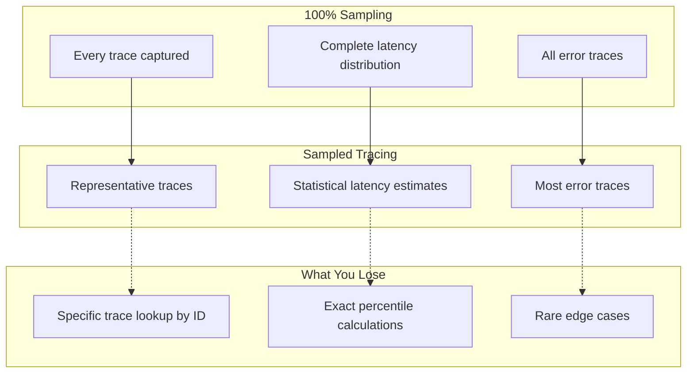
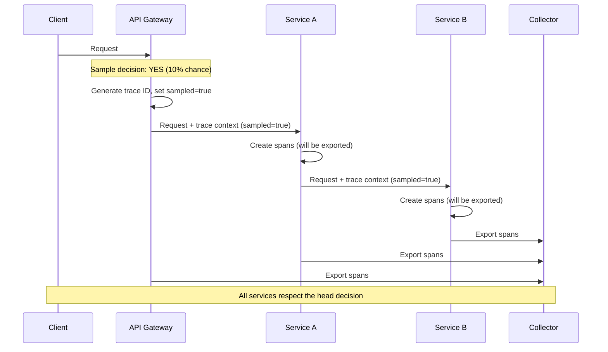
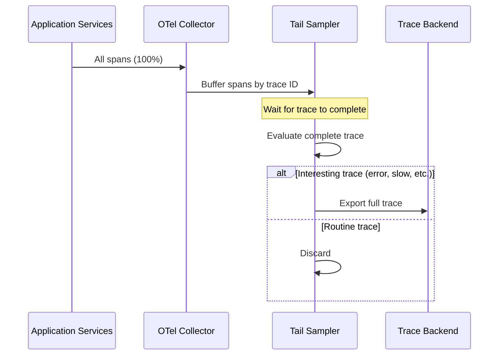
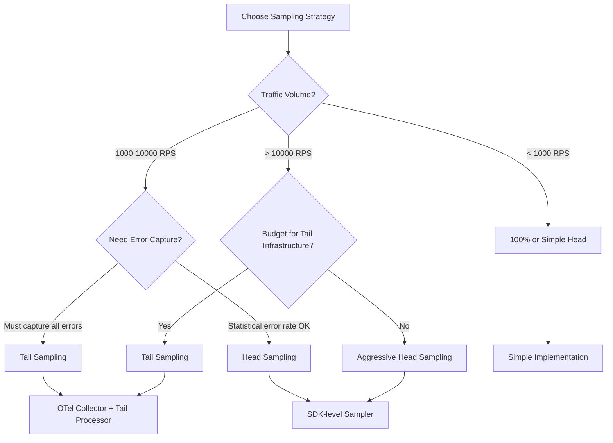

*[APM]: Application Performance Monitoring
*[OTel]: OpenTelemetry
*[SDK]: Software Development Kit
*[RPS]: Requests Per Second
*[SLA]: Service Level Agreement
*[P99]: 99th Percentile
*[P50]: 50th Percentile
*[GB]: Gigabyte
*[TB]: Terabyte

Distributed tracing is invaluable for understanding how requests flow through microservices. It's also expensive. The default assumption - trace everything, keep everything - breaks down the moment you have real traffic.

Let's do the math. A system handling 10,000 requests per second, with an average of 20 spans per trace (pretty modest for a microservices architecture), and each span averaging 1KB of data, generates 200MB of trace data every second. That's 720GB per hour, 17TB per day, over 500TB per month. At typical APM vendor pricing of $0.30 per GB ingested, you're looking at $155,000 per month just for trace storage. Most teams don't have that budget, and even if they did, it's not a good use of money.

The knee-jerk response is to sample: keep 1% of traces and throw away the rest. At 1% sampling, that $155,000 becomes $1,500. Problem solved, right?

Not quite. Naive sampling creates its own problems. You'll miss errors because error traces are rare and random sampling doesn't favor them. You'll miss slow requests for the same reason. You'll struggle to find specific traces when debugging because the trace you need probably wasn't sampled. The cost is controlled, but the value is gutted.

The real goal of sampling isn't cost reduction - it's signal improvement. You want to keep traces that teach you something: errors, latency outliers, unusual patterns, important business transactions. You want to discard traces that teach you nothing: the millions of identical successful requests that look exactly like each other. Intelligent sampling keeps the interesting traces and drops the boring ones, giving you better visibility at lower cost than either full sampling or random sampling.

<Callout type="info">
The goal of sampling isn't to reduce costs (though it does). The goal is to increase signal - keeping the traces that teach you something while discarding the identical successful requests that teach you nothing.
</Callout>

## The Sampling Problem Space

### Why 100% Sampling Fails at Scale

The problems with full sampling compound in ways that aren't immediately obvious. Storage cost is the most visible, but it's not the only issue - and often not even the most painful one.

| Problem | Impact | Scale Factor |
|---------|--------|--------------|
| Storage costs | APM vendors charge per GB ingested | Linear with traffic |
| Network overhead | Exporter bandwidth, collector capacity | Linear with traffic |
| Query performance | Searching billions of spans is slow | Superlinear with data |
| Signal-to-noise | Finding interesting traces in sea of identical ones | Exponential difficulty |
| Cardinality explosion | High-cardinality attributes multiply storage | Multiplicative |
| Processing latency | Collectors become bottleneck | Throughput ceiling |

Table: Problems with 100% sampling at scale.

Storage costs scale linearly - double your traffic, double your bill. But query performance scales worse than linearly. Searching through a billion spans to find the ones matching your filter is slow, and it gets slower faster than the data grows. At some point, your trace backend becomes effectively unusable for ad-hoc queries because every search takes minutes.

The signal-to-noise problem is even more insidious. If 99.9% of your traces are successful requests that look identical, finding the interesting 0.1% becomes a needle-in-haystack problem. Your dashboards show averages dominated by the successful cases. Your engineers scroll through pages of green traces looking for the one red one. The data is there, but it's buried.

Cardinality explosion happens when you add high-cardinality attributes to spans - user IDs, request IDs, session tokens. Each unique value multiplies your storage requirements. A span attribute with 10 million unique values can turn a manageable dataset into an unmanageable one.

### What Sampling Preserves and Loses

When I say "sampling" from here on, I mean keeping less than 100% of traces - making a deliberate decision about which traces to record and which to discard. This is the fundamental trade-off: you're exchanging complete data for manageable data. Understanding what you give up is essential for designing around those limitations, and for choosing sampling strategies that minimize the impact of what you lose.


Figure: Trade-offs between full and sampled tracing.

__What sampling preserves:__ You still get representative traces for understanding request flow. You still get statistical estimates of latency distributions - with enough samples, your P50 and P95 estimates are accurate. You still get most error traces, especially if you use intelligent sampling that prioritizes errors.

__What sampling loses:__ You can't guarantee you'll find a specific trace by ID. If a customer gives you a trace ID from their error message, that trace may not have been sampled. You lose exact percentile calculations - your P99 estimate has confidence intervals. You lose rare edge cases that happen less frequently than your sample rate.

The specific-trace-lookup problem is the one that bites teams most often. A customer reports an issue, includes a trace ID, and you search for it - nothing. The trace wasn't sampled. You have to fall back to searching for similar traces from the same time period, same endpoint, same error type. This works, but it's less satisfying than having the exact trace.

<Callout type="warning">
Sampling means you can't always find a specific trace by ID. If a customer reports an issue and you only have their trace ID, there's a chance that trace wasn't sampled. Design your debugging workflow around this reality.
</Callout>

## The Tracing Stack

Before diving into sampling strategies, it helps to understand where sampling fits in the distributed tracing stack. The stack has two sides: backends that store and visualize traces, and SDKs that generate them.

### Trace Backends and Collectors

The backend is where your traces live after collection. You have several options depending on whether you want managed services or self-hosted infrastructure.

__Jaeger__ is the most widely deployed open-source tracing backend. Originally built by Uber and now a CNCF graduated project, it provides storage, querying, and a web UI for exploring traces. You can run Jaeger with various storage backends - Cassandra, Elasticsearch, or in-memory for development. Its UI lets you search traces by service, operation, tags, and time range, then drill into individual traces to see the span waterfall.

__Zipkin__ predates Jaeger and was originally built by Twitter. It's simpler to deploy (single binary, supports SQLite for small deployments) and has good ecosystem support. Many tracing libraries support Zipkin's wire format natively. The UI is functional if less polished than Jaeger's.

__Grafana Tempo__ takes a different approach - it's a traces-only backend designed to be cheap to operate. Tempo stores traces in object storage (S3, GCS, Azure Blob) without indexing, which dramatically reduces cost. The trade-off is that you can't search by arbitrary attributes; you need a trace ID to retrieve a trace. The intended workflow is to discover trace IDs through other signals - metrics with exemplars, logs with trace correlation - then retrieve the full trace from Tempo. It integrates tightly with Grafana for visualization.

__Commercial APM vendors__ (Datadog, New Relic, Honeycomb, Lightstep) provide fully managed backends with sophisticated UIs, alerting, and analytics built in. They charge per GB ingested, which is why sampling matters so much - the economics section in the introduction assumed vendor pricing.

Between your applications and the backend sits the __OpenTelemetry Collector__. The Collector is a vendor-agnostic proxy that receives telemetry data, processes it (including sampling), and exports it to one or more backends. You can run Collectors as agents on each host, as a centralized gateway, or both. The Collector is where tail-based sampling happens, which we'll cover shortly.

### Client-Side Instrumentation

The client side is where traces originate. OpenTelemetry provides SDKs for most languages - JavaScript/TypeScript, Python, Java, Go, .NET, Ruby, and more. The SDK has two jobs: create spans for the operations your code performs, and export those spans to a Collector or directly to a backend.

When you initialize the OTel SDK (for example, `NodeTracerProvider` in Node.js), you configure three things: which spans to create (via instrumentation libraries or manual instrumentation), which spans to keep (via a sampler), and where to send them (via an exporter). The sampler is where head-based sampling decisions happen.

Instrumentation can be automatic or manual. Auto-instrumentation libraries hook into common frameworks and libraries - Express, Fastify, HTTP clients, database drivers - and create spans automatically. Manual instrumentation means you call the SDK directly to create spans for your business logic. Most deployments use both: auto-instrumentation for the boring infrastructure stuff, manual instrumentation for the business-specific operations you care about.

The SDK also handles trace context propagation. When one service calls another, the SDK injects trace context into the outgoing request (typically as W3C Trace Context headers). The receiving service's SDK extracts that context and links its spans to the same trace. This is how you get a complete picture of a request flowing through multiple services.

## Head-Based Sampling

Head-based sampling makes the keep-or-discard decision at the moment a trace begins, before the request has done anything interesting. The first service to handle a request - typically an API gateway, load balancer, or edge function - decides whether this trace will be sampled. That decision propagates to every downstream service via trace context headers.

The sampler you configure in the OTel SDK runs before any spans are created. The SDK calls your sampler's `shouldSample` method, and that decision sticks for the entire trace. Every span created under that trace ID inherits the sampling decision - if the head says "sample," all services create and export spans; if it says "don't sample," no spans are created anywhere.

This means you deploy sampling logic in your application code, not in a separate collector. Every microservice in your stack runs the same sampler implementation. The sampler uses the trace ID itself as a random seed, making decisions deterministic: given the same trace ID, every service makes the same sampling decision independently. There's no coordination needed between services, no central authority to consult. The math just works out the same everywhere.

### How Head Sampling Works

The sequence is straightforward. A request arrives at your entry point - let's say an API gateway. The gateway's OTel SDK generates a new trace ID and immediately asks the sampler: should we sample this trace? The sampler looks at whatever information is available (the trace ID, request attributes, current rate limits) and returns yes or no. If yes, the gateway creates spans and includes `sampled=true` in the trace context headers it forwards. If no, it can either skip span creation entirely or create spans but mark them as not-for-export.


Figure: Head-based sampling decision flow.

When downstream services receive a request with trace context, they check the sampling flag. If `sampled=true`, they create spans normally. If `sampled=false`, they skip span creation (or create non-exported spans for local debugging). The key insight is that every service respects the head decision - no service overrides it. This keeps traces complete: you never end up with half a trace because some services sampled and others didn't.

The implementation below shows how this works in practice. The sampler extracts the last 8 hex characters of the trace ID, converts them to a number, and compares against a threshold. Because trace IDs are randomly generated, this gives you uniform probability distribution. And because every service uses the same algorithm on the same trace ID, they all reach the same conclusion independently.

```typescript [g1:App Code]
import { NodeTracerProvider } from '@opentelemetry/sdk-trace-node';
import { registerInstrumentations } from '@opentelemetry/instrumentation';

const provider = new NodeTracerProvider({
  // Register your custom sampler here
  sampler: new ProbabilitySampler(0.1),
});

// Initialize the provider to start tracing
provider.register();
```
```typescript [g1:Head Sampling Implementation]
import { Sampler, SamplingResult, SamplingDecision } from '@opentelemetry/sdk-trace-base';
import { Context, SpanKind, Attributes } from '@opentelemetry/api';

// Simple probability-based head sampler
class ProbabilitySampler implements Sampler {
  private readonly probability: number;
  private readonly upperBound: number;

  constructor(probability: number) {
    this.probability = Math.max(0, Math.min(1, probability));
    // Use trace ID as random source for consistent decisions
    this.upperBound = Math.floor(probability * 0xffffffff);
  }

  shouldSample(
    context: Context,
    traceId: string,
    spanName: string,
    spanKind: SpanKind,
    attributes: Attributes,
  ): SamplingResult {
    // Extract last 8 characters of trace ID as hex number
    const traceIdNum = parseInt(traceId.slice(-8), 16);

    // Deterministic decision based on trace ID
    // Same trace ID always gets same decision across all services
    const shouldSample = traceIdNum < this.upperBound;

    return {
      decision: shouldSample
        ? SamplingDecision.RECORD_AND_SAMPLED
        : SamplingDecision.NOT_RECORD,
      attributes: {},
    };
  }

  toString(): string {
    return `ProbabilitySampler{probability=${this.probability}}`;
  }
}

// Usage
const sampler = new ProbabilitySampler(0.1); // 10% sampling
```
Code: Probability-based head sampler implementation.

The key property here is determinism: the same trace ID produces the same decision everywhere. That keeps traces complete across services without coordination and makes missing-trace debugging easier.

### Head Sampling Strategies

The probability sampler above is the simplest approach, but it's not the only one. Different strategies optimize for different constraints.

| Strategy | How It Works | Best For | Limitation |
|----------|--------------|----------|------------|
| Fixed probability | Sample N% of all traces uniformly | Baseline visibility, predictable costs | Misses rare important traces |
| Rate limiting | Sample up to N traces per second | Hard budget ceilings | Lower effective rate during spikes |
| Attribute-based | Different rates based on request properties | Business-critical paths | Must know important attributes upfront |
| Parent-based | Inherit decision from incoming trace context | Downstream services | Root span decision affects entire trace |

Table: Head sampling strategy comparison.

__Fixed probability__ is what we implemented above. It's simple, statistically representative, and gives you predictable costs. The downside is that it treats all requests equally. A payment transaction gets the same 10% chance as a health check.

__Rate limiting__ uses a token bucket or leaky bucket to cap traces per second. You configure "sample at most 100 traces per second," and the sampler keeps a counter. This guarantees a cost ceiling regardless of traffic volume. During a traffic spike, your effective sampling rate drops (100 TPS out of 10,000 RPS is 1%), but you never exceed budget. The risk is missing important traces during exactly the periods when you most want visibility.

__Attribute-based sampling__ applies different rates to different request types. Sample 100% of errors, 50% of enterprise customer requests, 1% of health checks. This requires knowing which attributes matter upfront and configuring rules accordingly. It's more complex but captures more signal per dollar spent.

__Parent-based sampling__ is the default in OpenTelemetry. When a service receives a request with existing trace context, it respects whatever sampling decision the parent made. This ensures trace completeness - you never have partial traces. For root spans (no parent), it falls back to another strategy like probability sampling.

<Callout type="info">
OpenTelemetry's default `ParentBasedSampler` combines parent-based logic with a configurable root sampler. For most deployments, this is the right starting point: respect upstream decisions, apply your own logic only at trace roots.
</Callout>

### Attribute-Based Head Sampling

The real power of head sampling comes from attribute-based rules. Instead of treating all requests equally, you apply business logic: always sample errors, heavily sample payment flows, barely sample health checks.

The implementation is a rules engine. You define rules with conditions, sample rates, and priorities. The sampler evaluates rules in priority order and uses the first match. If no rules match, it falls back to a default rate.

```typescript [g1:App Code]
import { NodeTracerProvider } from '@opentelemetry/sdk-trace-node';

// Configure rules for different request types
const samplingRules: SamplingRule[] = [
  {
    name: 'always-sample-errors',
    condition: (attrs) => attrs['error'] === true,
    sampleRate: 1.0,  // 100% of errors
    priority: 100,
  },
  {
    name: 'high-value-customers',
    condition: (attrs) => attrs['customer.tier'] === 'enterprise',
    sampleRate: 0.5,  // 50% of enterprise customer requests
    priority: 90,
  },
  {
    name: 'payment-endpoints',
    condition: (attrs, spanName) => spanName.startsWith('POST /api/payments'),
    sampleRate: 0.25,  // 25% of payment requests
    priority: 80,
  },
  {
    name: 'health-checks',
    condition: (attrs, spanName) => spanName.includes('/health'),
    sampleRate: 0.001,  // 0.1% of health checks
    priority: 70,
  },
];

const provider = new NodeTracerProvider({
  sampler: new RuleBasedSampler(samplingRules, 0.05), // 5% default
});

provider.register();
```
```typescript [g1:Attribute Sampling Implementation]
interface SamplingRule {
  name: string;
  condition: (attributes: Attributes, spanName: string) => boolean;
  sampleRate: number;
  priority: number;
}

class RuleBasedSampler implements Sampler {
  private rules: SamplingRule[];
  private defaultRate: number;

  constructor(rules: SamplingRule[], defaultRate: number = 0.01) {
    // Sort by priority (highest first)
    this.rules = rules.sort((a, b) => b.priority - a.priority);
    this.defaultRate = defaultRate;
  }

  shouldSample(
    context: Context,
    traceId: string,
    spanName: string,
    spanKind: SpanKind,
    attributes: Attributes,
  ): SamplingResult {
    // Find first matching rule
    for (const rule of this.rules) {
      if (rule.condition(attributes, spanName)) {
        const shouldSample = this.probabilisticDecision(traceId, rule.sampleRate);
        return {
          decision: shouldSample
            ? SamplingDecision.RECORD_AND_SAMPLED
            : SamplingDecision.NOT_RECORD,
          attributes: { 'sampling.rule': rule.name },
        };
      }
    }

    // Default sampling rate
    const shouldSample = this.probabilisticDecision(traceId, this.defaultRate);
    return {
      decision: shouldSample
        ? SamplingDecision.RECORD_AND_SAMPLED
        : SamplingDecision.NOT_RECORD,
      attributes: { 'sampling.rule': 'default' },
    };
  }

  private probabilisticDecision(traceId: string, rate: number): boolean {
    const traceIdNum = parseInt(traceId.slice(-8), 16);
    return traceIdNum < rate * 0xffffffff;
  }
}
```
Code: Rule-based head sampler with priorities.

The rule priority matters. If a request matches multiple rules (say, an error from an enterprise customer on a payment endpoint), you want the highest-priority rule to win. In this case, the error rule at priority 100 takes precedence, ensuring 100% sampling.

Notice that the sampler adds a `sampling.rule` attribute to sampled spans. This is useful for debugging your sampling configuration - you can query your trace backend to see which rules are triggering and at what rates.

<Callout type="success">
Attribute-based sampling lets you apply business logic to sampling decisions. Sample 100% of payment transactions, 50% of enterprise customer requests, and 0.1% of health checks - all from the same system.
</Callout>

The limitation of head sampling is that you're making decisions with incomplete information. At trace start, you don't know if the request will error. You don't know if it'll be slow. You're guessing based on request attributes. The "always sample errors" rule above only works if `error=true` is set in the initial span attributes - which it usually isn't, because the error hasn't happened yet.

This is where tail-based sampling comes in.

## Tail-Based Sampling

Tail-based sampling flips the decision point. Instead of deciding at trace start whether to sample, you wait until the trace completes, examine the whole thing, and then decide. This means you can sample based on outcomes - keep all errors, keep all slow traces, keep traces with retries - rather than guessing based on inputs.

The trade-off is architectural complexity. Head sampling happens in your application's SDK, which you already have. Tail sampling requires infrastructure: a centralized collector that receives all spans, buffers them until traces complete, evaluates them against policies, and forwards the interesting ones to your backend. Your applications emit 100% of spans to this collector; the collector decides what to keep.

### How Tail Sampling Works

The flow looks different from head sampling. Your applications don't make any sampling decisions - they create spans for every request and export them all to a collector. The collector groups incoming spans by trace ID, buffers them in memory, and waits for the trace to complete. Once a trace is complete (or a timeout expires), the collector evaluates it against your policies: does it contain errors? Is it slow? Does it touch certain services? If any policy matches, the entire trace is forwarded to your backend. If nothing matches, the trace is discarded.


Figure: Tail-based sampling decision flow.

The critical insight is that the collector sees the complete trace before deciding. It knows whether the request errored. It knows the total latency. It knows which services were involved and what happened in each one. This is information that head sampling simply doesn't have.

### Deployment Architecture

Tail sampling doesn't happen in your application code - it happens in dedicated infrastructure. The most common options are:

__OpenTelemetry Collector__ is the industry standard. It includes a Tail Sampling Processor that handles buffering, completion detection, and policy evaluation out of the box. You configure it in YAML rather than writing code. The Collector runs as a standalone service - typically a Kubernetes Deployment or DaemonSet - that receives spans from all your microservices.

__Grafana Alloy__ (formerly Grafana Agent) is a high-performance distribution of the OTel Collector, widely used in environments that send data to Grafana Tempo. It supports the same tail-sampling processor with identical configuration.

__Jaeger Collector v2__ is built directly on the OpenTelemetry Collector core, so it can use the same tail-sampling processors natively.

The deployment pattern matters because tail sampling is stateful. The collector must see _all_ spans for a trace to make an informed decision. If your trace spans multiple microservices and those spans land on different collector instances, no single instance has the complete picture.

For simple deployments, you can run the collector as a sidecar in your application pod. This works if your traces stay within a single pod - but that's rare in microservices architectures. For production, you typically need a two-tier setup:

1. __Tier 1 (Agents)__: Local collectors or sidecars receive spans from applications and forward them to a central tier
2. __Tier 2 (Tail-Sampling Cluster)__: A central cluster of collectors uses a load-balancing exporter that routes by trace ID, ensuring all spans with the same trace ID reach the same collector instance

This trace-ID-based routing is what enables tail sampling to work across distributed systems. The routing ensures that one collector instance buffers all the spans for a given trace and can make the sampling decision with complete information.

<Callout type="info">
Tail sampling collectors are stateful - they hold spans in memory while waiting for traces to complete. If a collector restarts, it loses the buffer. Plan for this in your deployment: use rolling updates, run multiple replicas, and accept that some traces may be lost during collector restarts.
</Callout>

<Callout type="success">
For high-volume tail sampling, use a two-tier collector architecture. Tier 1 collectors receive spans and route to tier 2 by trace ID hash. This ensures all spans for a trace reach the same tail sampler while allowing horizontal scaling.
</Callout>

### Tail Sampling Policies

The OTel Collector's tail sampling processor is configured entirely in YAML. You define policies that specify what makes a trace "interesting." The processor evaluates each complete trace against all policies; if any policy matches, the trace is kept.

```yaml title="otel-collector-tail-sampling.yaml"
# OpenTelemetry Collector tail sampling configuration
# Deploy this as part of your OTel Collector's processors pipeline
processors:
  tail_sampling:
    decision_wait: 10s  # Wait for trace to complete
    num_traces: 100000  # Max traces to buffer
    expected_new_traces_per_sec: 1000

    policies:
      # Always sample traces with errors
      - name: errors
        type: status_code
        status_code:
          status_codes: [ERROR]

      # Always sample slow traces
      - name: slow-traces
        type: latency
        latency:
          threshold_ms: 2000

      # Sample traces from specific services more
      - name: payment-service
        type: string_attribute
        string_attribute:
          key: service.name
          values: [payment-service, billing-service]

      # Probabilistic fallback for everything else
      - name: probabilistic-sample
        type: probabilistic
        probabilistic:
          sampling_percentage: 5

      # Composite policy: slow AND from specific endpoint
      - name: slow-checkout
        type: and
        and:
          and_sub_policy:
            - name: slow
              type: latency
              latency:
                threshold_ms: 1000
            - name: checkout
              type: string_attribute
              string_attribute:
                key: http.route
                values: ["/api/checkout", "/api/cart"]
```
Code: OpenTelemetry Collector tail sampling configuration.

The `decision_wait` parameter is how long the collector waits before considering a trace complete. Set it too short and you'll make decisions before all spans arrive; set it too long and you'll buffer too many traces and run out of memory. Ten seconds is a reasonable default for most HTTP-based services.

The `num_traces` parameter caps how many traces can be buffered simultaneously. When you hit this limit, the collector starts evicting the oldest traces to make room for new ones - those evicted traces are lost. Size this based on your traffic volume and `decision_wait`: at 1,000 new traces per second with a 10-second wait, you need capacity for at least 10,000 traces.

The policies themselves are declarative. The `status_code` policy matches traces where any span has the specified status. The `latency` policy matches traces where the root span's duration exceeds the threshold. The `string_attribute` policy matches traces containing spans with specific attribute values. The `and` and `or` policies let you combine conditions.

### Tail Sampling Challenges

Tail sampling solves the "incomplete information" problem of head sampling, but it introduces operational challenges you need to plan for.

__Memory pressure__ is the biggest operational concern. The collector must hold all spans in RAM while waiting for traces to complete. At 10,000 RPS with 20 spans per trace and a 10-second decision wait, you're buffering 2 million spans. Each span might be 1-2KB, so you need gigabytes of RAM just for the buffer - and that's before accounting for the overhead of the data structures holding them. If you run out of memory, the collector either drops traces or crashes.

__Trace completion detection__ is inherently heuristic. There's no "trace complete" signal in distributed tracing - you just stop seeing new spans. The collector uses a timeout (`decision_wait`) to guess when a trace is done. Set it too short and you'll miss late-arriving spans from slow downstream services. Set it too long and your buffer grows, your memory pressure increases, and your traces take longer to appear in your backend.

__Distributed coordination__ adds complexity when you scale beyond a single collector instance. All spans for a trace must reach the same collector for tail sampling to work. This requires trace-ID-based routing at your load balancer, which means your collectors can't be fully stateless. If a collector handling certain trace IDs goes down, those in-flight traces are lost.

__Latency addition__ affects how quickly traces appear in your backend. With head sampling, spans are exported immediately after creation. With tail sampling, spans wait in the buffer for `decision_wait` seconds before the decision is made and the trace is exported. This delay affects real-time debugging - if you're actively investigating an incident, your most recent traces won't be visible yet.

<Callout type="warning">
Tail sampling requires buffering ALL spans until the trace completes. At 10,000 RPS with 20 spans per trace and 10-second decision wait, you need memory for 2 million spans. Size your collectors accordingly, and monitor buffer utilization closely.
</Callout>

The takeaway is simple: tail sampling gives you outcome-aware selection, but it costs memory, routing complexity, and delayed visibility.

## Head vs Tail: Choosing the Right Approach

The choice between head and tail sampling isn't binary - it's about matching your constraints to your requirements. Some teams need guaranteed error capture; others need predictable costs above all else. Most will end up somewhere in between.

### Decision Framework

Start with your traffic volume. At low scale (under 1,000 RPS), the economics of sampling don't matter much - you can afford 100% sampling or use simple head sampling without overthinking it. At moderate scale (1,000-10,000 RPS), the question becomes whether you need deterministic error capture or can live with statistical sampling. At high scale (over 10,000 RPS), the question is whether you can afford the infrastructure for tail sampling.


Figure: Sampling strategy decision tree.

The decision isn't just about what you want - it's about what you can operate. Tail sampling requires stateful infrastructure that needs monitoring, scaling, and maintenance. If your team is small or your ops capacity is limited, the operational overhead of tail sampling may outweigh its benefits.

| Factor | Head Sampling | Tail Sampling |
|--------|---------------|---------------|
| Decision point | Trace start | Trace end |
| Information available | Request attributes only | Full trace with outcomes |
| Error capture | Probabilistic | Deterministic (if policy includes) |
| Infrastructure | Simple (SDK only) | Complex (stateful collectors) |
| Network overhead | Low (only sampled spans) | High (all spans to collector) |
| Latency impact | None | decision_wait delay |
| Memory requirements | Minimal | Significant (buffering) |
| Best for | High volume, cost control | Error investigation, SLA monitoring |

Table: Head vs tail sampling comparison.

__Choose head sampling when:__ You have high traffic volume and need predictable costs. Your error rate is high enough that probabilistic sampling catches most errors. You don't have the ops capacity for stateful collector infrastructure. You need traces to appear in your backend immediately.

__Choose tail sampling when:__ You must capture every error trace for compliance or debugging. You're tracking SLAs and need to sample all requests that violated them. You have moderate traffic where the collector infrastructure is manageable. You can tolerate the `decision_wait` delay before traces appear.

### Hybrid Approaches

For many teams, the answer is both. Hybrid sampling uses head sampling to reduce baseline volume, then tail sampling to filter intelligently from the reduced set. This gives you the cost control of head sampling with the intelligent filtering of tail sampling.

The pattern works like this: your head sampler runs at a moderate rate (say, 20%) but marks certain traces as "must sample" based on request attributes - error headers, priority flags, enterprise customer indicators. The tail sampler receives this 20% and applies its own policies: keep all errors, keep all slow traces, apply probabilistic sampling to the rest. Traces marked "must sample" by the head are always kept by the tail.

The math works in your favor. If you head-sample at 20% and tail-sample at 25% of that for routine traces, your effective rate for boring requests is 5%. But errors and slow traces still get 100% capture (assuming the head sampler catches them via attribute rules or they're captured by the tail's outcome-based policies).

```typescript title="hybrid-sampler.ts"
// Head sampler that marks "must sample" traces
class HybridHeadSampler implements Sampler {
  private readonly baseRate: number;
  private readonly mustSampleRules: SamplingRule[];

  shouldSample(
    context: Context,
    traceId: string,
    spanName: string,
    spanKind: SpanKind,
    attributes: Attributes,
  ): SamplingResult {
    // Check must-sample rules first
    for (const rule of this.mustSampleRules) {
      if (rule.condition(attributes, spanName)) {
        return {
          decision: SamplingDecision.RECORD_AND_SAMPLED,
          attributes: {
            'sampling.head_decision': 'must_sample',
            'sampling.rule': rule.name,
          },
        };
      }
    }

    // Base rate sampling
    const shouldSample = this.probabilisticDecision(traceId, this.baseRate);

    if (shouldSample) {
      return {
        decision: SamplingDecision.RECORD_AND_SAMPLED,
        attributes: {
          'sampling.head_decision': 'probabilistic',
          'sampling.rate': this.baseRate,
        },
      };
    }

    return {
      decision: SamplingDecision.NOT_RECORD,
      attributes: {},
    };
  }
}
```
Code: Head sampler that coordinates with tail sampling.

The head sampler adds a `sampling.head_decision` attribute to spans it samples. The tail sampler's policy can then reference this attribute - always keep traces where `sampling.head_decision` equals `must_sample`, apply normal policies to traces where it equals `probabilistic`.

```yaml title="otel-collector-hybrid-tail.yaml"
# OpenTelemetry Collector config: hybrid head + tail sampling pipeline
receivers:
  otlp:
    protocols:
      grpc:
      http:

processors:
  tail_sampling:
    decision_wait: 10s
    num_traces: 50000  # Lower than pure tail - head already reduced volume

    policies:
      # Always keep traces the head marked as must-sample
      - name: head-must-sample
        type: string_attribute
        string_attribute:
          key: sampling.head_decision
          values: [must_sample]

      # Standard tail policies for probabilistic head samples
      - name: errors
        type: status_code
        status_code:
          status_codes: [ERROR]

      - name: slow-traces
        type: latency
        latency:
          threshold_ms: 2000

      # Lower fallback rate since head already filtered
      - name: probabilistic-fallback
        type: probabilistic
        probabilistic:
          sampling_percentage: 25

exporters:
  otlp:
    endpoint: "tempo:4317"
    tls:
      insecure: true

service:
  pipelines:
    traces:
      receivers: [otlp]
      processors: [tail_sampling]
      exporters: [otlp]
```
Code: OTel tail sampling config that respects head decisions.

The hybrid approach also reduces the operational burden of tail sampling. Because the head sampler already reduced traffic to 20%, your tail sampler buffers 80% fewer spans. The `num_traces` parameter can be lower, memory requirements drop, and the stateful collector becomes more manageable.

<Callout type="success">
Hybrid sampling gives you the cost control of head sampling with the intelligent filtering of tail sampling. Sample 20% at head, then use tail policies to keep 100% of interesting traces from that 20%.
</Callout>

## Tuning Sample Rates for Statistical Validity

Choosing a sample rate isn't just about budget - it's about maintaining statistical validity. Sample too aggressively and your metrics become meaningless. The math for "how much sampling is enough" depends on what you're trying to measure.

### Budget-Based Rate Calculation

Start with your constraints and work backward. If you know your traffic volume, your APM vendor's pricing, and your budget, you can calculate the maximum sample rate you can afford.

The formula is straightforward: take your requests per second, multiply by spans per trace (typically 10-30 for microservices), multiply by average span size (typically 1-2KB), and you get your data volume per second. Scale that to monthly, multiply by your vendor's per-GB price, and you have your cost at 100% sampling. Divide your budget by that cost, and you have your maximum affordable sample rate.

For example, at 10,000 RPS with 20 spans per trace and 1KB per span, you generate about 500TB per month. At $0.30 per GB, that's $155,000/month. If your budget is $1,500/month, you can afford roughly 1% sampling for routine traces.

But budget isn't the only constraint. You also need enough samples to make statistically valid inferences.

### Minimum Samples for Valid Metrics

Different metrics require different sample sizes for valid estimation.

__Error rate estimation__ follows the standard sample size formula from statistics. To estimate a 1% error rate with ±0.5% margin of error at 95% confidence, you need about 1,500 samples. At 10,000 RPS with 1% sampling, you get 6,000 samples per minute - more than enough. But if your error rate is 0.01% and you want ±0.005% precision, you need 150,000 samples. That changes the math significantly.

__Latency percentiles__ need more samples than you might expect. The rule of thumb is that you need roughly 100/p samples to estimate the Pth percentile, where p is the tail probability. For P99 (p = 0.01), you need about 10,000 samples. For P99.9, you need 100,000 samples. If you're sampling at 1% and need P99.9 estimates, you need 10 million total requests in your analysis window to have enough samples.

__Rare event detection__ is where sampling hurts most. If an event occurs once per 10,000 requests and you're sampling at 1%, you need 1 million total requests just to expect to see one occurrence. Rare bugs, edge cases, and unusual failure modes may never appear in your sampled data at all.

| Metric | Minimum Samples | At 1% Sampling | At 10% Sampling |
|--------|-----------------|----------------|-----------------|
| Error rate (±0.5%) | ~1,500 | 150K requests | 15K requests |
| P95 latency | ~2,000 | 200K requests | 20K requests |
| P99 latency | ~10,000 | 1M requests | 100K requests |
| P99.9 latency | ~100,000 | 10M requests | 1M requests |
| 1-in-10K event | ~10,000 | 1M requests | 100K requests |

Table: Sample requirements for statistically valid metrics.

### Adaptive Sampling

Fixed sample rates have an annoying property: they sample too much during quiet periods and too little during spikes - exactly backwards from what you want. During a traffic spike, you're probably experiencing something interesting, but your fixed-rate sampler is dropping more traces than usual to stay at its configured percentage.

Adaptive sampling flips this by targeting a fixed number of samples per time period rather than a fixed percentage. Configure "sample 100 traces per second" instead of "sample 1%." During normal traffic at 10,000 RPS, that's 1% sampling. During a spike to 50,000 RPS, it drops to 0.2%. During a quiet period at 1,000 RPS, it rises to 10%.

The downside is less predictable costs - your sample rate varies with traffic, so your storage costs vary too. But the upside is more consistent statistical validity: you always have enough samples to calculate meaningful metrics, regardless of traffic volume.

<Callout type="info">
Adaptive sampling maintains statistical validity regardless of traffic volume. Instead of "sample 1% of traces," think "sample 100 traces per second." Your metrics stay valid whether you're handling 1,000 or 100,000 RPS.
</Callout>

### Weighted Metrics with Variable Sample Rates

If you use attribute-based sampling with different rates for different request types - 50% for payments, 10% for API calls, 0.1% for health checks - you create a bias in your aggregate metrics. Your error rate will be skewed toward payment errors because payment traces are 500x more likely to be sampled than health check traces.

The fix is weighted aggregation. When calculating metrics from sampled data, weight each sample by the inverse of its sample rate. A health check sampled at 0.1% represents 1,000 actual requests; a payment sampled at 50% represents 2 actual requests. Your trace backend should support this natively (most APM vendors do), but if you're doing custom analysis, you need to account for it yourself.

This matters most when comparing metrics across different request types or when calculating aggregate metrics for an entire service. If you're only looking at payment latencies, the sample rate doesn't affect your percentiles. But if you're calculating overall service error rate, ignoring sample weights will give you wrong answers.

<Callout type="warning">
If you use different sample rates for different request types, you must weight your metrics calculations by inverse sample rate. Otherwise, your error rates and latency percentiles will be skewed toward highly-sampled request types.
</Callout>

## When Traces Go Missing

Sampling creates a fundamental tension: you're reducing data to control costs, but debugging requires data. When a customer reports an issue and includes a trace ID, there's a real chance that trace wasn't sampled. When you're investigating a production incident, the traces you need might not exist. This section covers practical strategies for debugging effectively despite these limitations.

### The Missing Trace Problem

The scenario happens regularly: a customer reports an error, includes a trace ID from their error message, and you search for it in Jaeger or Tempo - nothing. The trace wasn't sampled. Now what?

The first instinct is to increase your sample rate, but that's treating the symptom. The better approach is building systems that give you debugging capability even when specific traces are missing.

__Always log trace IDs, even for unsampled requests.__ Your application creates a trace ID for every request, regardless of whether that request is sampled. Include the trace ID in your structured logs. When a trace isn't sampled, you can still find the logs for that request - and logs often contain enough context to diagnose the issue without the trace.

__Correlate trace IDs with request IDs and user IDs.__ If you can't find trace `abc123`, but you know it was for user `user456` at 14:32 UTC, you can search for other traces from that user around that time. Sampled traces are statistically representative - a similar trace from the same user, endpoint, and time window often shows the same issue.

__Use your trace backend's attribute search.__ Jaeger, Tempo, and commercial APM tools let you search traces by attributes, not just trace ID. Search for traces with the same `http.route`, same `error.type`, same `user.id`, same time window. You may not have _that_ trace, but you'll have similar ones.

### Correlation with Logs and Metrics

Traces are one leg of the observability triad; logs and metrics are the others. When traces are sampled, logs and metrics become your fallback - and they should be designed for that role.

__Structure your logs for trace correlation.__ Every log entry should include the trace ID and span ID. When you can't find a trace, you can still query your log aggregator (Loki, Elasticsearch, CloudWatch Logs) for entries with that trace ID. The logs won't show you the span waterfall, but they'll show you what happened.

```json
{
  "timestamp": "2024-01-15T14:32:01.234Z",
  "level": "error",
  "message": "Payment processing failed",
  "traceId": "abc123def456",
  "spanId": "789ghi",
  "sampled": false,
  "userId": "user456",
  "orderId": "order789",
  "errorCode": "INSUFFICIENT_FUNDS",
  "service": "payment-service"
}
```

Notice the `sampled: false` field. This tells you the trace wasn't sampled, so don't bother searching for it in your trace backend. But the log entry itself contains the error code, user ID, and order ID - often enough to diagnose the issue.

__Use metrics with exemplars.__ Modern metrics systems (Prometheus with exemplar support, Grafana Mimir) can attach trace IDs to metric data points. When you see a latency spike on your P99 dashboard, you can click through to an exemplar trace that represents that spike. This is a form of retroactive trace discovery - the metric tells you something interesting happened, and links you to a trace that was sampled.

__Build dashboards that connect the three signals.__ Your Grafana dashboard should let you go from a metric anomaly → to logs from that time window → to traces matching those logs. Tempo's integration with Loki is designed for exactly this workflow: search logs, find trace IDs in log entries, click through to traces.

## Debugging Strategies for Sampled Systems

When correlation isn't enough, you need active debugging strategies. This section covers techniques for getting the traces you need - whether by forcing specific requests to be sampled, temporarily increasing rates, or finding similar traces that reveal the same issue.

### On-Demand Sampling

Sometimes you need to guarantee that specific requests are traced. On-demand sampling lets you force tracing for particular requests without changing your baseline sample rate.

The pattern is simple: check for a special header (commonly `X-Force-Trace: true` or `X-B3-Sampled: 1`), and if present, always sample that request regardless of your normal sampling rules.

```typescript title="force-sampling-sampler.ts"
class ForceSamplingSampler implements Sampler {
  private readonly baseSampler: Sampler;

  constructor(baseSampler: Sampler) {
    this.baseSampler = baseSampler;
  }

  shouldSample(
    context: Context,
    traceId: string,
    spanName: string,
    spanKind: SpanKind,
    attributes: Attributes,
  ): SamplingResult {
    // Check if force-sampling is requested via attribute
    // (attribute set from header in your HTTP middleware)
    if (attributes['sampling.forced'] === true) {
      return {
        decision: SamplingDecision.RECORD_AND_SAMPLED,
        attributes: { 'sampling.rule': 'forced' },
      };
    }

    // Otherwise use base sampler
    return this.baseSampler.shouldSample(
      context, traceId, spanName, spanKind, attributes
    );
  }
}
```
Code: Sampler that respects force-sampling requests.

```typescript title="force-sampling-middleware.ts"
import type { Request, Response, NextFunction } from 'express';
import { trace } from '@opentelemetry/api';

export const forceSamplingMiddleware = (req: Request, _res: Response, next: NextFunction): void => {
  const headerValue = req.header('X-Force-Trace');
  if (headerValue === 'true') {
    const span = trace.getActiveSpan();
    if (span) {
      span.setAttribute('sampling.forced', true);
    }
  }
  next();
};
```
Code: Express middleware wiring force-sampling requests.

Your HTTP middleware extracts the header and sets the attribute before the sampler runs. Now support engineers can add the header when reproducing customer issues, and those requests are always traced.

<Callout type="info">
On-demand sampling is powerful for debugging but can be abused. Rate-limit forced traces to prevent cost surprises. A customer accidentally leaving `X-Force-Trace: true` on all their requests shouldn't blow your APM budget.
</Callout>

### Temporarily Increasing Sample Rates

During active incidents, you often want more traces than your normal rate provides. The question is how to increase the rate quickly without redeploying.

__Feature flags for sample rates.__ If your sampler reads its rate from a feature flag service (LaunchDarkly, Split, ConfigCat, or even a simple Redis key), you can adjust rates in real-time. During an incident, flip the flag to 100%. After investigation, flip it back. No deployment required.

__OTel Collector hot reload.__ If you're using tail sampling in the OTel Collector, the Collector supports configuration reload via SIGHUP. Update your ConfigMap, trigger a reload, and your sampling policies change without collector restart. This is slower than a feature flag but doesn't require application changes.

__Time-bounded sample rate increases.__ If you're increasing rates during an incident, set a reminder to decrease them afterward. Better yet, build automation that resets rates after a fixed period. A Lambda function that checks a "debug mode" flag and resets it after 30 minutes prevents the "we left it on 100% for a week" budget surprise.

### Searching for Similar Traces

When you can't find a specific trace, find similar ones. The workflow varies by trace backend:

__In Jaeger:__ Use the search panel to filter by service, operation (endpoint), tags, and time range. If you're looking for traces where `/api/checkout` returned a 500 error, search for `service=checkout-service`, `http.status_code=500`, `operation=POST /api/checkout`, time range around when the error occurred. You won't find the exact trace the customer hit, but you'll find recent traces with the same characteristics.

__In Grafana Tempo:__ Tempo's TraceQL query language lets you search by attributes. The query `{ resource.service.name="checkout-service" && span.http.status_code=500 && span.http.route="/api/checkout" }` finds error traces from checkout. Combine with Tempo's integration with Loki: search logs for the trace ID, find related log entries, discover other trace IDs in those logs that _were_ sampled.

__In commercial APM (Datadog, New Relic, Honeycomb):__ These tools have sophisticated search and correlation features. Honeycomb's BubbleUp can automatically identify which attributes are correlated with errors. Datadog's trace search lets you pivot from one trace to others with similar attributes. Use these features - they're designed for exactly this problem.

### Debug Runbook for Sampled Systems

Debugging with sampled data requires a different workflow than debugging with complete data. Copy this runbook and adapt it for your team.

```markdown
Purpose

- Systematic approach to debugging when the specific trace you need may not exist

When to use

- A customer reports an issue with a trace ID
- You are investigating an incident and cannot find expected traces

Step 1: Search for the trace

- [ ] Search trace backend for the exact trace ID (Jaeger, Tempo, or your APM)
- [ ] Confirm the time range includes the incident window
- [ ] Remove service filters that might hide the trace
- [ ] If found, investigate the trace and stop here
- [ ] If not found, continue to Step 2

Step 2: Search logs for context

- [ ] Query logs for traceId="<trace-id>" in Loki, Elasticsearch, or CloudWatch
- [ ] Extract identifiers (user ID, request ID, session ID, order ID)
- [ ] Confirm sampled status (sampled: false means it was dropped intentionally)
- [ ] Review error details (error code, stack trace, request/response bodies)
- [ ] If logs are sufficient, diagnose and stop here
- [ ] If more context is needed, continue to Step 3

Step 3: Find similar traces

- [ ] Search by same service
- [ ] Search by same endpoint (http.route or operation name)
- [ ] Search by same error type or status code
- [ ] Search within issue time window ±1 hour
- [ ] If relevant, match the same customer tier or user segment
- [ ] Review 3-5 matching traces for:

  - Common failure patterns
  - Shared downstream dependencies
  - Similar latency profiles
  - Repeated error messages

- [ ] If a pattern is identified, investigate it and stop here
- [ ] If no useful traces are found, continue to Step 4

Step 4: Reproduce with forced sampling

- [ ] Confirm the issue is reproducible
- [ ] Add header X-Force-Trace: true to the request
- [ ] Reproduce the exact user action
- [ ] Record the new trace ID from response headers
- [ ] Search for the new trace and investigate
- [ ] If not reproducible, continue to Step 5

Step 5: Temporary sample rate increase

- [ ] Increase sample rate via feature flag or collector config
- [ ] Set a calendar reminder for 30-60 minutes
- [ ] Monitor for issue recurrence
- [ ] Reset the sample rate after investigation
- [ ] Document the time window and reason for the increase

Escalation path

- [ ] Verify tracing is active by checking for recent traces in the service
- [ ] Review sampling rules to ensure the endpoint is not excluded
- [ ] Check collector health for dropped spans or backpressure
- [ ] Decide whether instrumentation changes are required
```
Code: Tracing Debug Runbook

<Callout type="success">
Build your debugging workflow around the assumption that the specific trace you need might not exist. Correlate trace IDs with logs. Search for similar traces by attributes. Use on-demand sampling when you can reproduce issues. This workflow is more resilient than depending on having every trace.
</Callout>

## Conclusion

The premise of this article is counterintuitive: you get more value from your distributed tracing by capturing less data. At scale, 100% sampling isn't just expensive - it's counterproductive. The cost of storing and querying petabytes of routine traces overwhelms any debugging benefit. The teams that get the most from tracing are the ones that sample strategically.

Head-based sampling is where most teams should start. It's simple to implement (it's built into every tracing SDK), requires no additional infrastructure, and gives you immediate cost control. Sample 10% of traffic and your tracing bill drops by 90%. The trade-off is that you're making decisions with incomplete information - you can't know at request start whether this trace will be interesting.

Tail-based sampling solves the information problem by waiting until traces complete before deciding what to keep. You can capture every error, every slow request, every trace that violated an SLA. The trade-off is operational complexity: stateful collectors, memory pressure, trace-ID routing, and the inevitable edge cases when collectors restart. Don't adopt tail sampling until you need its capabilities and can absorb its operational cost.

Hybrid approaches give you the best of both - cost control from head sampling, intelligent filtering from tail sampling. Sample 20% at the head, then use tail policies to keep 100% of interesting traces from that 20%. The math compounds in your favor: you get guaranteed error capture at a fraction of the cost of pure tail sampling.

Whatever strategy you choose, remember that sampling changes how you debug. You won't always have the specific trace you need. Build systems that compensate: correlate trace IDs with logs, use metrics with exemplars, implement on-demand sampling for reproducing issues. The teams that struggle with sampling are the ones that treat traces as the only source of truth. The teams that succeed treat traces as one signal among many.

The goal of distributed tracing isn't to capture every request. It's to capture enough requests to understand your system's behavior, diagnose problems when they occur, and improve reliability over time. With thoughtful sampling, a 1% sample can teach you more than 100% ever could - because you'll actually be able to query it.

<Callout type="info">
Start with simple head-based sampling. Add tail sampling when you need guaranteed capture of errors or slow requests. Graduate to hybrid approaches when you need both cost control and intelligent filtering. But always start simple - complexity has its own costs.
</Callout>
