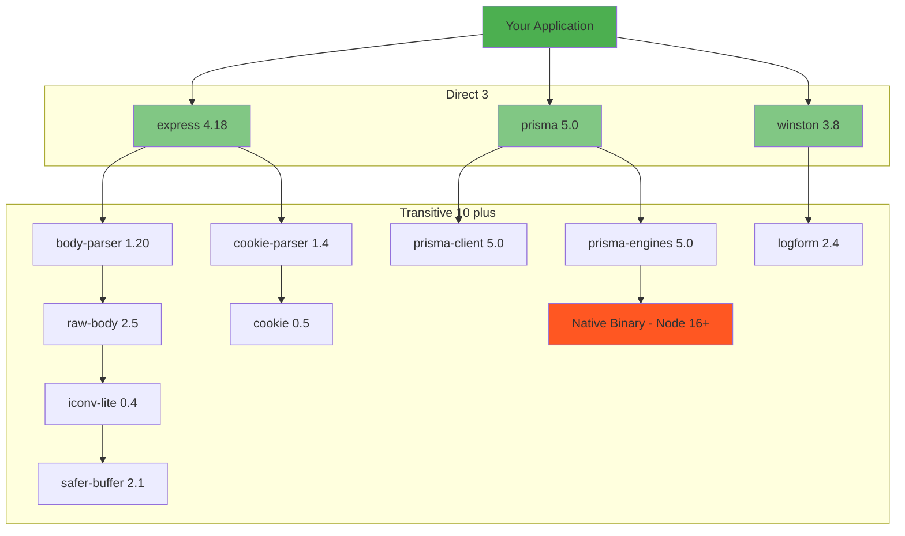
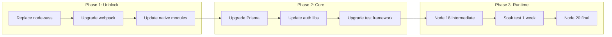

*[EOL]: End of Life
*[LTS]: Long Term Support
*[CVE]: Common Vulnerabilities and Exposures
*[SLA]: Service Level Agreement
*[API]: Application Programming Interface
*[SDK]: Software Development Kit
*[CI]: Continuous Integration
*[CD]: Continuous Deployment

# Dependency Hell: Upgrading EOL Runtimes

## Introduction

Brief overview of the EOL upgrade trap: teams delay runtime upgrades until the deadline looms, then discover a web of transitive dependencies blocking the path forward. This section frames the problem—an EOL runtime isn't just a version number change; it's an unraveling of assumptions baked into every dependency in your graph. The longer you wait, the harder it gets.

_Include a real scenario: a team needs to upgrade from Node 16 (EOL) to Node 20. Their direct dependencies all support Node 20, but a transitive dependency three levels deep pins an old native module that won't compile on Node 20. They're blocked by code they don't own and often don't know exists._

<Callout type="warning">
EOL isn't a deadline—it's a vulnerability window opening. Every day past EOL is a day your runtime won't receive security patches. The question isn't whether to upgrade, but how fast you can safely do it.
</Callout>

## Understanding the Dependency Graph

### Direct vs Transitive Dependencies

Explain the iceberg problem.


Figure: Direct dependencies hide a much larger transitive graph.

```bash title="visualizing-dependency-depth.sh"
# npm: Show full dependency tree
npm ls --all

# npm: Find why a package is installed
npm explain <package-name>

# yarn: Why is this package here?
yarn why <package-name>

# pnpm: List with depth
pnpm list --depth=5

# .NET: Show full graph
dotnet list package --include-transitive

# Python: Show dependency tree
pip install pipdeptree
pipdeptree

# Python: Reverse dependencies (what depends on this?)
pipdeptree --reverse --packages <package-name>
```
Code: Commands to visualize dependency graphs.

### Identifying Blocking Dependencies

```typescript title="dependency-blocker-analysis.ts"
interface DependencyBlocker {
  package: string;
  currentVersion: string;
  requiredRuntimeVersion: string;
  blockedBy: string[];  // Packages that require this version
  upgradeAvailable: string | null;
  upgradeBreaksCompat: boolean;
  effort: 'low' | 'medium' | 'high' | 'extreme';
}

// Example analysis output
const blockers: DependencyBlocker[] = [
  {
    package: 'node-sass',
    currentVersion: '4.14.1',
    requiredRuntimeVersion: 'Node <= 14',
    blockedBy: ['legacy-component-library@2.3.0'],
    upgradeAvailable: null,  // node-sass is deprecated
    upgradeBreaksCompat: true,  // Must migrate to sass (dart-sass)
    effort: 'high',
  },
  {
    package: 'bcrypt',
    currentVersion: '3.0.0',
    requiredRuntimeVersion: 'Node <= 16',
    blockedBy: ['auth-middleware@1.2.0'],
    upgradeAvailable: '5.1.0',
    upgradeBreaksCompat: false,  // API compatible
    effort: 'low',
  },
  {
    package: 'grpc',
    currentVersion: '1.24.0',
    requiredRuntimeVersion: 'Node <= 14',
    blockedBy: ['service-mesh-client@3.0.0'],
    upgradeAvailable: '@grpc/grpc-js@1.8.0',  // Different package
    upgradeBreaksCompat: true,  // API changes
    effort: 'medium',
  },
];
```
Code: Dependency blocker analysis structure.

| Blocker Type | Example | Resolution Strategy |
|--------------|---------|---------------------|
| Native modules | node-sass, bcrypt older versions | Upgrade or replace with pure JS |
| Deprecated packages | request, node-uuid | Replace with maintained alternative |
| Abandoned packages | No updates in 2+ years | Fork, replace, or vendor |
| Internal packages | Company packages not updated | Coordinate with owning team |
| Version constraints | Peer dependency conflicts | Negotiate with upstream |
| Binary distributions | Pre-built binaries for old runtime | Rebuild or find new source |

Table: Common dependency blocker types and strategies.

<Callout type="info">
The packages you directly depend on are rarely the problem. It's the packages three or four levels deep—ones you've never heard of—that block your upgrade. Start analysis from the bottom of the tree, not the top.
</Callout>

## Mapping the Upgrade Path

### Version Compatibility Matrix

```yaml title="compatibility-matrix.yaml"
node_upgrade_path:
  current: "16.20.0"
  target: "20.10.0"

  direct_dependencies:
    express:
      current: "4.18.2"
      node_16: true
      node_18: true
      node_20: true
      action: "none"

    prisma:
      current: "4.8.0"
      node_16: true
      node_18: true
      node_20: false  # Needs upgrade to 5.x
      upgrade_to: "5.6.0"
      breaking_changes:
        - "findUnique returns null instead of throwing"
        - "Removed deprecated methods"
      action: "upgrade with migration"

    node-sass:
      current: "7.0.0"
      node_16: true
      node_18: false
      node_20: false
      replacement: "sass@1.69.0"
      migration_effort: "high"
      action: "replace package"

  transitive_blockers:
    - package: "fsevents@1.2.13"
      required_by: "chokidar@2.1.8 → watchpack@1.7.5 → webpack@4.46.0"
      node_20_compatible: false
      resolution: "Upgrade webpack to 5.x"
      cascade_impact: "Major - loader config changes"
```
Code: Version compatibility matrix for upgrade planning.

### Upgrade Sequencing


Figure: Phased upgrade sequence.

```typescript title="upgrade-sequencer.ts"
interface UpgradeStep {
  id: string;
  description: string;
  packages: string[];
  blockedBy: string[];  // IDs of steps that must complete first
  breakingChanges: boolean;
  estimatedHours: number;
  rollbackStrategy: string;
}

const upgradeSequence: UpgradeStep[] = [
  {
    id: 'replace-node-sass',
    description: 'Replace node-sass with dart-sass',
    packages: ['node-sass → sass'],
    blockedBy: [],
    breakingChanges: true,  // Different API for some features
    estimatedHours: 8,
    rollbackStrategy: 'Revert package.json and lock file',
  },
  {
    id: 'upgrade-webpack',
    description: 'Upgrade webpack 4 to 5',
    packages: ['webpack@4 → webpack@5', 'related loaders'],
    blockedBy: ['replace-node-sass'],  // sass-loader needs sass first
    breakingChanges: true,
    estimatedHours: 16,
    rollbackStrategy: 'Git revert, rebuild node_modules',
  },
  {
    id: 'upgrade-native-modules',
    description: 'Upgrade bcrypt, sharp, and other native deps',
    packages: ['bcrypt@3 → bcrypt@5', 'sharp@0.29 → sharp@0.32'],
    blockedBy: ['upgrade-webpack'],
    breakingChanges: false,
    estimatedHours: 4,
    rollbackStrategy: 'Downgrade packages',
  },
  {
    id: 'upgrade-prisma',
    description: 'Upgrade Prisma 4 to 5',
    packages: ['prisma@4 → prisma@5', '@prisma/client@4 → @prisma/client@5'],
    blockedBy: ['upgrade-native-modules'],
    breakingChanges: true,
    estimatedHours: 12,
    rollbackStrategy: 'Database compatible, revert code changes',
  },
  {
    id: 'node-18-intermediate',
    description: 'Upgrade runtime to Node 18 LTS',
    packages: [],
    blockedBy: ['upgrade-prisma'],
    breakingChanges: false,
    estimatedHours: 4,
    rollbackStrategy: 'Switch back to Node 16 container',
  },
  {
    id: 'node-20-final',
    description: 'Upgrade runtime to Node 20 LTS',
    packages: [],
    blockedBy: ['node-18-intermediate'],
    breakingChanges: false,
    estimatedHours: 2,
    rollbackStrategy: 'Switch back to Node 18 container',
  },
];

// Calculate critical path
function calculateCriticalPath(steps: UpgradeStep[]): {
  totalHours: number;
  criticalPath: string[];
} {
  // Topological sort with longest path
  const visited = new Set<string>();
  const pathLengths = new Map<string, number>();
  const pathPredecessors = new Map<string, string | null>();

  function visit(stepId: string): number {
    if (pathLengths.has(stepId)) return pathLengths.get(stepId)!;

    const step = steps.find(s => s.id === stepId)!;
    let maxPredecessorLength = 0;
    let maxPredecessor: string | null = null;

    for (const blockerId of step.blockedBy) {
      const predecessorLength = visit(blockerId);
      if (predecessorLength > maxPredecessorLength) {
        maxPredecessorLength = predecessorLength;
        maxPredecessor = blockerId;
      }
    }

    const totalLength = maxPredecessorLength + step.estimatedHours;
    pathLengths.set(stepId, totalLength);
    pathPredecessors.set(stepId, maxPredecessor);

    return totalLength;
  }

  // Find the endpoint with longest path
  let maxLength = 0;
  let endpoint = '';
  for (const step of steps) {
    const length = visit(step.id);
    if (length > maxLength) {
      maxLength = length;
      endpoint = step.id;
    }
  }

  // Reconstruct critical path
  const criticalPath: string[] = [];
  let current: string | null = endpoint;
  while (current) {
    criticalPath.unshift(current);
    current = pathPredecessors.get(current) || null;
  }

  return { totalHours: maxLength, criticalPath };
}
```
Code: Upgrade sequencing with critical path analysis.

<Callout type="success">
Sequence upgrades to minimize parallel work streams. Each breaking change is a potential source of bugs—doing them serially means you know exactly what broke when tests fail.
</Callout>

## .NET Framework to .NET Core/5+ Migration

### The .NET Migration Challenge

```yaml title="dotnet-migration-analysis.yaml"
migration_scope:
  source: ".NET Framework 4.8"
  target: ".NET 8"

  breaking_categories:
    apis_removed:
      - "System.Web (entire namespace)"
      - "WCF server-side"
      - "Windows-specific APIs"
      - "AppDomain.CreateDomain"

    apis_changed:
      - "HttpContext → IHttpContextAccessor"
      - "ConfigurationManager → IConfiguration"
      - "System.Drawing (limited support)"

    architecture_changes:
      - "Global.asax → Program.cs startup"
      - "Web.config → appsettings.json"
      - "Dependency injection built-in"
      - "Middleware pipeline vs HTTP modules"

  common_blockers:
    - name: "WCF services"
      replacement: "gRPC or REST APIs"
      effort: "high"

    - name: "Entity Framework 6"
      replacement: "EF Core"
      effort: "medium-high"
      breaking: "Query translation differences"

    - name: "ASP.NET Web Forms"
      replacement: "Blazor or Razor Pages"
      effort: "extreme"

    - name: "Crystal Reports"
      replacement: "Third-party or custom"
      effort: "high"
```
Code: .NET Framework migration scope analysis.

### Portability Analysis

```bash title="dotnet-portability-analysis.sh"
# Install the .NET Upgrade Assistant
dotnet tool install -g upgrade-assistant

# Analyze project for upgrade
upgrade-assistant analyze <solution.sln>

# Interactive upgrade
upgrade-assistant upgrade <solution.sln>

# API Portability Analyzer (deprecated but still useful)
# Generates report of APIs that won't work in .NET Core
dotnet tool install -g Microsoft.DotNet.ApiCompat.Tool
```
Code: .NET portability analysis tools.

```csharp title="compatibility-shim-pattern.cs"
// Pattern: Compatibility shim for APIs that changed

// Old .NET Framework code:
// var config = ConfigurationManager.AppSettings["MySetting"];

// Shim to support both frameworks during migration
public static class ConfigurationShim
{
    private static IConfiguration? _configuration;

    // Called during startup in .NET Core
    public static void Initialize(IConfiguration configuration)
    {
        _configuration = configuration;
    }

    public static string? GetAppSetting(string key)
    {
#if NETFRAMEWORK
        return ConfigurationManager.AppSettings[key];
#else
        return _configuration?[key];
#endif
    }

    public static string? GetConnectionString(string name)
    {
#if NETFRAMEWORK
        return ConfigurationManager.ConnectionStrings[name]?.ConnectionString;
#else
        return _configuration?.GetConnectionString(name);
#endif
    }
}

// Usage (works in both frameworks):
var setting = ConfigurationShim.GetAppSetting("MySetting");
```
Code: Compatibility shim for configuration access.

### Multi-Targeting Strategy

```xml title="multi-target-csproj.xml"
<Project Sdk="Microsoft.NET.Sdk">
  <PropertyGroup>
    <!-- Target both frameworks during migration -->
    <TargetFrameworks>net48;net8.0</TargetFrameworks>
  </PropertyGroup>

  <!-- Framework-specific dependencies -->
  <ItemGroup Condition="'$(TargetFramework)' == 'net48'">
    <Reference Include="System.Web" />
    <PackageReference Include="EntityFramework" Version="6.4.4" />
  </ItemGroup>

  <ItemGroup Condition="'$(TargetFramework)' == 'net8.0'">
    <PackageReference Include="Microsoft.EntityFrameworkCore" Version="8.0.0" />
    <PackageReference Include="Microsoft.EntityFrameworkCore.SqlServer" Version="8.0.0" />
  </ItemGroup>

  <!-- Conditional compilation symbols -->
  <PropertyGroup Condition="'$(TargetFramework)' == 'net48'">
    <DefineConstants>$(DefineConstants);NETFRAMEWORK</DefineConstants>
  </PropertyGroup>
</Project>
```
Code: Multi-targeting project file for gradual migration.

<Callout type="warning">
.NET Framework to .NET 8 isn't an upgrade—it's a migration. APIs are removed, not deprecated. Web Forms has no equivalent. WCF server-side doesn't exist. Plan for significant rewriting, not just version bumps.
</Callout>

## Node.js Version Upgrades

### Node Version Compatibility Issues

```yaml title="node-upgrade-issues.yaml"
common_issues:
  native_modules:
    description: "C++ addons compiled for specific Node version"
    symptoms:
      - "Module did not self-register"
      - "NODE_MODULE_VERSION mismatch"
    resolution: "npm rebuild or upgrade package"

  v8_api_changes:
    description: "V8 engine API changes between versions"
    symptoms:
      - "Native module crashes"
      - "Undefined symbols"
    resolution: "Upgrade native module to version built for new V8"

  openssl_changes:
    description: "OpenSSL version changes (Node 17+)"
    symptoms:
      - "ERR_OSSL_EVP_UNSUPPORTED"
      - "Legacy crypto algorithms fail"
    resolution: |
      // Temporary workaround (not recommended for production)
      // NODE_OPTIONS=--openssl-legacy-provider
      // Better: update crypto usage to modern algorithms

  esm_changes:
    description: "ES Module handling changes"
    symptoms:
      - "ERR_REQUIRE_ESM"
      - "Cannot use import statement"
    resolution: "Update package or use dynamic import()"
```
Code: Common Node.js upgrade issues.

### Native Module Rebuild Strategy

```bash title="native-module-rebuild.sh"
#!/bin/bash
# Script to identify and rebuild native modules

# Find all native modules
echo "Native modules in node_modules:"
find node_modules -name "*.node" -type f 2>/dev/null | \
  sed 's|node_modules/||' | \
  cut -d'/' -f1 | \
  sort -u

# Rebuild all native modules for current Node version
npm rebuild

# If specific module fails, try:
# 1. Clear npm cache
npm cache clean --force

# 2. Remove and reinstall
rm -rf node_modules/<package-name>
npm install <package-name>

# 3. Check for updated version
npm outdated <package-name>
npm install <package-name>@latest

# 4. If still failing, check for alternative packages
npm search <package-name> pure javascript
```
Code: Native module rebuild strategy.

```typescript title="esm-compat-wrapper.ts"
// Pattern: Wrapper for ESM-only packages in CommonJS projects

// Problem: Package upgraded to ESM-only, your project is CommonJS
// Error: ERR_REQUIRE_ESM

// Solution 1: Dynamic import wrapper
export async function loadEsmPackage() {
  // Dynamic import works in CommonJS
  const { default: esmPackage } = await import('esm-only-package');
  return esmPackage;
}

// Solution 2: Convert your project to ESM
// package.json: "type": "module"
// Rename .js to .mjs or update imports

// Solution 3: Pin to last CommonJS version
// package.json: "esm-only-package": "^2.0.0"  // Last CJS version
// (Check changelog for when ESM-only happened)

// Solution 4: Use a CJS wrapper if available
// Some packages provide both:
// import pkg from 'package';        // ESM
// const pkg = require('package');   // CJS (if supported)
```
Code: ESM compatibility patterns for CommonJS projects.

<Callout type="info">
Node 18 and 20 changed OpenSSL defaults, breaking legacy crypto. If you see ERR_OSSL_EVP_UNSUPPORTED, don't just set --openssl-legacy-provider—audit your crypto usage and update to modern algorithms.
</Callout>

## Linux Distribution Upgrades

### OS EOL Impact

```yaml title="os-eol-impact.yaml"
eol_distributions:
  ubuntu_18_04:
    eol_date: "2023-04-30"
    extended_security: "2028-04-30 (ESM)"
    impact:
      - "No free security updates"
      - "Package repos frozen"
      - "New software may not build"
      - "Container base images deprecated"

  centos_7:
    eol_date: "2024-06-30"
    impact:
      - "No further updates"
      - "glibc 2.17 (very old)"
      - "Kernel 3.10"
      - "Many modern packages incompatible"

  debian_10:
    eol_date: "2024-06-30"
    lts_end: "2024-06-30"
    impact:
      - "glibc 2.28"
      - "OpenSSL 1.1.1"

common_blockers:
  glibc_version:
    description: "C library version incompatibility"
    symptom: "version GLIBC_2.XX not found"
    resolution: "Upgrade OS or use static builds"

  kernel_version:
    description: "Kernel features required by software"
    symptom: "io_uring not available"
    resolution: "Upgrade OS"

  package_availability:
    description: "Software not packaged for old OS"
    symptom: "Unable to locate package"
    resolution: "Build from source or upgrade OS"
```
Code: Linux distribution EOL impact analysis.

### Container Base Image Migration

```dockerfile title="container-migration.dockerfile"
# Before: Ubuntu 18.04 (EOL)
# FROM ubuntu:18.04

# After: Ubuntu 22.04 LTS
FROM ubuntu:22.04

# Key differences to handle:

# 1. Python version (3.6 → 3.10+)
# Old: python3 is 3.6
# New: python3 is 3.10
RUN apt-get update && apt-get install -y python3 python3-pip
# May need to update Python code for 3.10 compatibility

# 2. Node.js (if from system packages)
# Old: Node 8 or 10 from default repos
# New: Need to add NodeSource repo for recent versions
RUN curl -fsSL https://deb.nodesource.com/setup_20.x | bash - && \
    apt-get install -y nodejs

# 3. OpenSSL version
# Old: 1.1.0
# New: 3.0 (may break legacy TLS usage)

# 4. Package name changes
# Old: python3-distutils
# New: May not exist, use pip instead

# 5. glibc version
# Old: 2.27
# New: 2.35 (binaries built on new may not run on old)
```
Code: Container base image migration considerations.

### Staged OS Migration

```yaml title="staged-os-migration.yaml"
migration_stages:
  stage_1_preparation:
    duration: "2-4 weeks"
    tasks:
      - "Inventory all servers and their OS versions"
      - "Identify applications with OS dependencies"
      - "Test applications on new OS in dev/staging"
      - "Update CI/CD to build for both OS versions"
      - "Create rollback procedures"

  stage_2_parallel_run:
    duration: "2-4 weeks"
    tasks:
      - "Deploy new OS instances alongside old"
      - "Route small percentage of traffic to new"
      - "Monitor for errors, performance differences"
      - "Fix issues found in parallel operation"

  stage_3_migration:
    duration: "1-2 weeks"
    tasks:
      - "Shift majority of traffic to new OS"
      - "Keep old instances as hot standby"
      - "Address any remaining issues"

  stage_4_cleanup:
    duration: "1 week"
    tasks:
      - "Decommission old OS instances"
      - "Remove dual-OS support from CI/CD"
      - "Update documentation"
      - "Celebrate"

  rollback_triggers:
    - "Error rate > 2x baseline"
    - "Latency p99 > 1.5x baseline"
    - "Critical functionality broken"
    - "Security vulnerability discovered"
```
Code: Staged OS migration plan.

<Callout type="success">
Never upgrade OS in place on production servers. Deploy new instances with the new OS, migrate traffic gradually, and keep the old instances available for rollback. Blue-green deployment for infrastructure.
</Callout>

## Handling Abandoned Dependencies

### Identifying Abandoned Packages

```typescript title="abandoned-package-detection.ts"
interface PackageHealth {
  name: string;
  lastPublish: Date;
  openIssues: number;
  lastCommit: Date;
  maintainerActive: boolean;
  deprecationNotice: string | null;
  healthScore: 'healthy' | 'stale' | 'abandoned' | 'deprecated';
}

async function assessPackageHealth(packageName: string): Promise<PackageHealth> {
  const npmData = await fetch(`https://registry.npmjs.org/${packageName}`);
  const npm = await npmData.json();

  const lastPublish = new Date(npm.time[npm['dist-tags'].latest]);
  const daysSincePublish = (Date.now() - lastPublish.getTime()) / (1000 * 60 * 60 * 24);

  // Check GitHub if available
  const repoUrl = npm.repository?.url;
  let lastCommit = lastPublish;
  let openIssues = 0;

  if (repoUrl?.includes('github.com')) {
    // Fetch GitHub data...
  }

  // Determine health score
  let healthScore: PackageHealth['healthScore'];
  if (npm.deprecated) {
    healthScore = 'deprecated';
  } else if (daysSincePublish > 730) {  // 2 years
    healthScore = 'abandoned';
  } else if (daysSincePublish > 365) {  // 1 year
    healthScore = 'stale';
  } else {
    healthScore = 'healthy';
  }

  return {
    name: packageName,
    lastPublish,
    openIssues,
    lastCommit,
    maintainerActive: daysSincePublish < 180,
    deprecationNotice: npm.deprecated || null,
    healthScore,
  };
}

// Red flags for abandoned packages:
const redFlags = [
  'Last publish > 2 years ago',
  'No response to issues/PRs',
  'Maintainer publicly abandoned',
  'Deprecated with no alternative',
  'Only works with EOL runtime',
  'Known security issues unpatched',
];
```
Code: Package health assessment.

### Strategies for Abandoned Packages

```yaml title="abandoned-package-strategies.yaml"
strategies:
  find_replacement:
    description: "Find actively maintained alternative"
    when: "Modern alternative exists"
    example:
      abandoned: "request"
      replacement: "node-fetch or axios"
    effort: "low to medium"

  fork_and_maintain:
    description: "Fork the package, apply minimal fixes"
    when: "No alternative, small fix needed"
    steps:
      - "Fork to organization GitHub"
      - "Apply necessary patches"
      - "Publish as @org/package-name"
      - "Update package.json to use fork"
    risks:
      - "Now you maintain it"
      - "May diverge from upstream if revived"
    effort: "medium"

  vendor_the_code:
    description: "Copy source code into your repo"
    when: "Small package, unlikely to need updates"
    steps:
      - "Copy source to src/vendor/package-name"
      - "Update imports to use local copy"
      - "Remove from package.json"
      - "Apply necessary patches"
    risks:
      - "No automatic security updates"
      - "License compliance concerns"
    effort: "low"

  rewrite:
    description: "Implement the functionality yourself"
    when: "Small surface area, well-defined behavior"
    example: "Replace left-pad with inline function"
    effort: "varies"

  remove_entirely:
    description: "Remove the dependency and its functionality"
    when: "Feature is no longer needed"
    effort: "lowest (if truly unneeded)"
```
Code: Strategies for handling abandoned packages.

```json title="package-json-fork-reference.json"
{
  "dependencies": {
    "@myorg/abandoned-package": "npm:abandoned-package-fork@^2.0.0"
  },
  "overrides": {
    "abandoned-package": "npm:@myorg/abandoned-package-fork@^2.0.0"
  },
  "resolutions": {
    "abandoned-package": "npm:@myorg/abandoned-package-fork@^2.0.0"
  }
}
```
Code: Referencing forked package while keeping import paths.

<Callout type="warning">
Forking means you own it. Before forking, calculate the true cost: security monitoring, compatibility testing, responding to issues. Sometimes paying for a commercial alternative is cheaper than maintaining a fork.
</Callout>

## Dependency Override Techniques

### Forcing Version Resolution

```json title="npm-overrides.json"
{
  "name": "my-app",
  "dependencies": {
    "some-package": "^2.0.0"
  },
  "overrides": {
    "some-package": {
      "vulnerable-dep": "^2.0.0"
    },
    "vulnerable-dep": "^2.0.0",
    "old-package": {
      ".": "npm:new-package@^1.0.0"
    }
  }
}
```
Code: npm overrides for forcing dependency versions.

```json title="yarn-resolutions.json"
{
  "name": "my-app",
  "dependencies": {
    "some-package": "^2.0.0"
  },
  "resolutions": {
    "**/vulnerable-dep": "^2.0.0",
    "some-package/vulnerable-dep": "^2.0.0",
    "old-package": "npm:new-package@^1.0.0"
  }
}
```
Code: Yarn resolutions for forcing dependency versions.

```xml title="dotnet-version-override.xml"
<Project>
  <!-- Directory.Build.props or .csproj -->
  <ItemGroup>
    <!-- Force all transitive references to use specific version -->
    <PackageReference Include="Newtonsoft.Json" Version="13.0.3" />
  </ItemGroup>

  <!-- Central Package Management (recommended for .NET 6+) -->
  <PropertyGroup>
    <ManagePackageVersionsCentrally>true</ManagePackageVersionsCentrally>
  </PropertyGroup>

  <!-- In Directory.Packages.props -->
  <ItemGroup>
    <PackageVersion Include="Newtonsoft.Json" Version="13.0.3" />
  </ItemGroup>
</Project>
```
Code: .NET dependency version overrides.

### Patching Dependencies

```bash title="patch-package-workflow.sh"
# Using patch-package (npm/yarn)

# 1. Install patch-package
npm install patch-package --save-dev

# 2. Make changes directly in node_modules
# Edit node_modules/broken-package/index.js

# 3. Create patch
npx patch-package broken-package

# 4. Patch is saved to patches/broken-package+1.2.3.patch

# 5. Add postinstall script to package.json
# "scripts": {
#   "postinstall": "patch-package"
# }

# 6. Commit the patches directory
git add patches/
git commit -m "Patch broken-package for Node 20 compatibility"
```
Code: Patching dependencies with patch-package.

```diff title="example-patch.patch"
diff --git a/node_modules/broken-package/index.js b/node_modules/broken-package/index.js
index 1234567..abcdefg 100644
--- a/node_modules/broken-package/index.js
+++ b/node_modules/broken-package/index.js
@@ -10,7 +10,7 @@ function processData(data) {
   // Old code using deprecated API
-  const buffer = new Buffer(data);
+  const buffer = Buffer.from(data);
   return buffer.toString('base64');
 }
```
Code: Example patch file fixing deprecated API usage.

<Callout type="info">
Patches are a temporary measure, not a permanent solution. Track patched packages in your backlog. When the upstream fix is released, remove the patch and upgrade. Set calendar reminders to check quarterly.
</Callout>

## Testing Upgrade Compatibility

### Compatibility Test Matrix

```yaml title="upgrade-test-matrix.yaml"
test_matrix:
  runtime_versions:
    - "node:16"  # Current
    - "node:18"  # Intermediate
    - "node:20"  # Target

  test_suites:
    unit_tests:
      purpose: "Verify code logic unchanged"
      run_on: "all versions"

    integration_tests:
      purpose: "Verify external integrations work"
      run_on: "all versions"
      special_attention:
        - "Database connections (driver compatibility)"
        - "HTTP clients (TLS changes)"
        - "File system operations (path handling)"

    native_module_tests:
      purpose: "Verify native modules load and function"
      run_on: "all versions"
      tests:
        - "bcrypt hash/verify"
        - "sharp image processing"
        - "sqlite3 database operations"

    performance_tests:
      purpose: "Detect performance regressions"
      run_on: "current and target"
      metrics:
        - "Request latency p50, p99"
        - "Memory usage"
        - "CPU utilization"
        - "Startup time"
```
Code: Compatibility test matrix for runtime upgrades.

```yaml title="ci-matrix-test.yaml"
# .github/workflows/compatibility.yaml
name: Runtime Compatibility

on: [push, pull_request]

jobs:
  test:
    runs-on: ubuntu-latest
    strategy:
      fail-fast: false
      matrix:
        node-version: [16, 18, 20]

    steps:
      - uses: actions/checkout@v4

      - name: Setup Node.js ${{ matrix.node-version }}
        uses: actions/setup-node@v4
        with:
          node-version: ${{ matrix.node-version }}

      - name: Install dependencies
        run: npm ci

      - name: Rebuild native modules
        run: npm rebuild

      - name: Run tests
        run: npm test

      - name: Run integration tests
        run: npm run test:integration

  compatibility-report:
    needs: test
    runs-on: ubuntu-latest
    if: always()
    steps:
      - name: Generate compatibility report
        run: |
          echo "## Compatibility Report" >> $GITHUB_STEP_SUMMARY
          echo "| Node Version | Status |" >> $GITHUB_STEP_SUMMARY
          echo "|--------------|--------|" >> $GITHUB_STEP_SUMMARY
          # Parse job results...
```
Code: CI matrix testing across Node versions.

### Canary Deployment for Upgrades

```yaml title="canary-upgrade-deployment.yaml"
canary_strategy:
  phase_1:
    description: "Deploy upgraded runtime to single instance"
    traffic_percentage: 1
    duration: "1 hour"
    rollback_trigger:
      - "Error rate > 2x baseline"
      - "Latency p99 > 1.5x baseline"

  phase_2:
    description: "Expand to 5% of instances"
    traffic_percentage: 5
    duration: "4 hours"
    rollback_trigger:
      - "Error rate > 1.5x baseline"
      - "Any critical errors"

  phase_3:
    description: "Expand to 25% of instances"
    traffic_percentage: 25
    duration: "24 hours"

  phase_4:
    description: "Full rollout"
    traffic_percentage: 100

  monitoring:
    metrics:
      - "Error rate by runtime version"
      - "Latency by runtime version"
      - "Memory usage by runtime version"
      - "CPU usage by runtime version"
    dashboards:
      - "Runtime upgrade comparison"
      - "Error log analysis"
```
Code: Canary deployment strategy for runtime upgrades.

<Callout type="success">
Run your test suite against both old and new runtime versions in CI. If tests pass on both, you have confidence the upgrade won't break existing functionality. If tests only pass on one, you've found your compatibility issues.
</Callout>

## Upgrade Runbook Template

### Standard Upgrade Procedure

```yaml title="upgrade-runbook-template.yaml"
upgrade_runbook:
  metadata:
    title: "Node.js 16 → 20 Upgrade"
    author: "Platform Team"
    last_updated: "2024-01-15"
    estimated_duration: "4-6 hours"
    rollback_time: "15 minutes"

  pre_upgrade_checklist:
    - "[ ] All blocking dependencies resolved"
    - "[ ] CI tests pass on target runtime"
    - "[ ] Performance baseline captured"
    - "[ ] Rollback procedure tested in staging"
    - "[ ] On-call team notified"
    - "[ ] Change management ticket approved"

  upgrade_steps:
    - step: 1
      action: "Enable feature flag for upgraded runtime"
      command: "feature-flag enable node20-runtime --percentage 0"
      verification: "Flag shows enabled at 0%"

    - step: 2
      action: "Deploy canary instance"
      command: "kubectl set image deployment/app app=app:node20-v1.2.3"
      verification: "Pod running, health check passing"

    - step: 3
      action: "Route 1% traffic to canary"
      command: "feature-flag set node20-runtime --percentage 1"
      verification: "Metrics show traffic split"
      wait: "15 minutes"

    - step: 4
      action: "Check error rates"
      verification: "Error rate within 1.1x baseline"
      rollback_if: "Error rate > 2x baseline"

    # ... more steps

  rollback_procedure:
    trigger_conditions:
      - "Error rate > 2x baseline for 5 minutes"
      - "P99 latency > 2x baseline for 5 minutes"
      - "Any data corruption detected"
      - "Critical functionality broken"

    steps:
      - "Set feature flag to 0%"
      - "Scale down upgraded instances"
      - "Verify traffic on old runtime"
      - "Page on-call if automatic rollback"

  post_upgrade_verification:
    - "Error rates returned to baseline"
    - "Latency returned to baseline"
    - "All health checks passing"
    - "No increase in support tickets"
    - "Log analysis shows no new error patterns"
```
Code: Complete upgrade runbook template.

## Conclusion

Summarize the key strategies: understand your full dependency graph before starting; sequence upgrades to minimize parallel risk; use compatibility shims and multi-targeting during transition; test against both old and new runtimes in CI; and deploy upgrades gradually with automated rollback. Emphasize that the real enemy is transitive dependencies—the packages you don't know about that block your progress.

<Callout type="info">
The best time to upgrade is before EOL, when you have time to do it right. The second best time is now. Every day past EOL is a day your runtime won't receive security patches. Start small, test thoroughly, and deploy gradually.
</Callout>

---

## Cover Prompt

### Prompt 1: The Dependency Maze

Create an image of a developer navigating a complex maze where the walls are made of stacked package boxes labeled with version numbers. Some paths are blocked by red "EOL" barriers. A glowing path through the maze represents the upgrade path. Style: isometric 3D maze, package box aesthetic, red barriers, golden path, 16:9 aspect ratio.

### Prompt 2: The Iceberg of Dependencies

Design an image of an iceberg where the tip above water shows 3-4 direct dependency boxes, but below the waterline is a massive tangle of hundreds of transitive dependency boxes, some glowing red as blockers. Style: iceberg cross-section, package visualization, blue water tones, red warning highlights, 16:9 aspect ratio.

### Prompt 3: The Version Timeline

Illustrate a timeline showing runtime versions from EOL (grayed out, crumbling) through current (stable) to future (bright). Applications are shown migrating along the timeline, with some stuck at EOL boundaries. Style: horizontal timeline, version progression, decay-to-renewal gradient, 16:9 aspect ratio.

### Prompt 4: The Upgrade Surgery

Create an image of a surgical operation where surgeons (developers) are carefully replacing components in a complex system (application). Monitors show dependency graphs, and replacement parts are staged nearby. One surgeon holds up an old component labeled "EOL". Style: medical operating theater, technical precision, clean aesthetic, 16:9 aspect ratio.

### Prompt 5: Breaking the Chains

Design an image of chains connecting runtime boxes (Node 16, .NET Framework, CentOS 7) to an application, with some chains being cut by bolt cutters, freeing the application to float toward newer runtime boxes above. Style: chain and lock metaphor, breaking free visual, upward movement, 16:9 aspect ratio.
