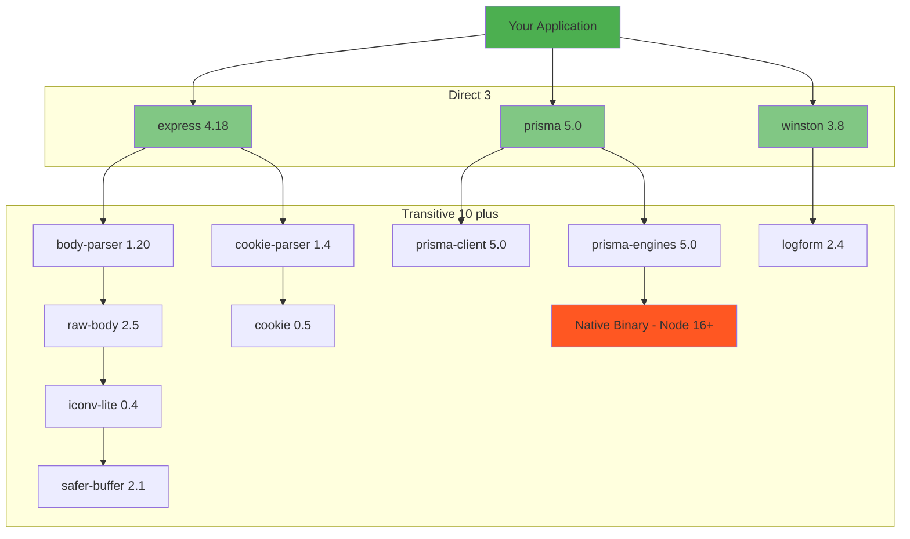

*[EOL]: End of Life
*[LTS]: Long Term Support
*[CVE]: Common Vulnerabilities and Exposures
*[SLA]: Service Level Agreement
*[API]: Application Programming Interface
*[SDK]: Software Development Kit
*[CI]: Continuous Integration
*[CD]: Continuous Deployment

## Introduction

This is the trap I see most often: the runtime hits EOL, the calendar says upgrade now, and the upgrade turns into a dependency archaeology expedition. This article is a survival guide for those upgrades.

The blocker is rarely your code. It is the packages you do not even call directly, the native modules buried in transitive dependencies, and the build tooling that assumed an older ABI or distro.

An EOL runtime is not a version bump. It is a forced audit of assumptions across your entire dependency graph. The longer the gap between your current runtime and the supported version, the more compounding breakage you inherit: abandoned libraries, renamed packages, removed APIs, and binaries that no longer compile.

Here is a typical scenario. A team needs to move from .NET 6 to .NET 8. Their direct dependencies all list .NET 8 support. But a transitive dependency three levels deep pins an old NuGet package that relies on a deprecated API or an incompatible runtime behavior. They are blocked by code they do not own and have never looked at. That is why EOL upgrades feel chaotic: the failure is distributed across the dependency graph, not the app.

In this article I will lay out a practical upgrade path: map the graph, identify blockers by type, then build a staged plan that gets you to a supported runtime without a multi-month freeze.

<Callout type="warning">
EOL isn't a deadline—it's a vulnerability window opening. Every day past EOL is a day your runtime won't receive security patches. The question isn't whether to upgrade, but how fast you can safely do it.
</Callout>

## Understanding the Dependency Graph

Before touching any code, you need to understand what you are actually upgrading. The answer is never just "my application." It is your application plus every package it depends on, plus every package _those_ packages depend on, recursively, until you hit the bottom of the tree.

### Direct vs Transitive Dependencies

Most teams dramatically underestimate their dependency surface. They look at their package.json, Gemfile, or .csproj and see maybe twenty direct dependencies. That is the visible part. The iceberg below the waterline is the transitive graph—the dependencies of your dependencies, often numbering in the hundreds.

This matters for EOL upgrades because a single incompatible package anywhere in that tree blocks the entire upgrade. You can have perfect Node 20 compatibility in your code and in every package you directly reference. But if one of those packages depends on something that depends on something else that ships a native binary compiled against Node 16 headers, you are stuck.


Figure: Direct dependencies hide a much larger transitive graph.

The diagram shows a typical pattern: three direct dependencies fan out to ten transitive dependencies, and one of those transitives—the native binary in prisma-engines—has a hard runtime version constraint. That single node, four levels deep, determines whether your upgrade succeeds.

Your first step is making this hidden graph visible. Every package manager provides tooling to dump the full tree and trace why a particular package exists in your dependency graph.

```bash title="visualizing-dependency-depth.sh"
# npm: Show full dependency tree
npm ls --all

# npm: Find why a package is installed
npm explain <package-name>

# yarn: Why is this package here?
yarn why <package-name>

# pnpm: List with depth
pnpm list --depth=5

# .NET: Show full graph
dotnet list package --include-transitive

# Python: Show dependency tree
pip install pipdeptree
pipdeptree

# Python: Reverse dependencies (what depends on this?)
pipdeptree --reverse --packages <package-name>
```
Code: Commands to visualize dependency graphs.

The `npm explain` and `yarn why` commands are particularly useful when you have already identified a problematic package and need to trace its provenance. They show you the full path from your application to the blocker, which tells you which direct dependency you need to upgrade or replace to eliminate it.

### Identifying Blocking Dependencies

Once you have visibility into the graph, you need to classify blockers by type. Not all incompatibilities are equal. Some require a one-line version bump. Others require replacing a core library and touching every file that imports it. The table below shows the most common blocker categories and the typical resolution path for each.

| Blocker Type | Example | Resolution Strategy |
|--------------|---------|---------------------|
| Native modules | node-sass, bcrypt older versions | Upgrade or replace with pure JS |
| Deprecated packages | request, node-uuid | Replace with maintained alternative |
| Abandoned packages | No updates in 2+ years | Fork, replace, or vendor |
| Internal packages | Company packages not updated | Coordinate with owning team |
| Version constraints | Peer dependency conflicts | Negotiate with upstream |
| Binary distributions | Pre-built binaries for old runtime | Rebuild or find new source |

Table: Common dependency blocker types and strategies.

Native modules are usually the most painful. They ship compiled binaries that link against the Node.js or Python C ABI, and when that ABI changes between major versions, the binary fails to load. The classic example is `node-sass`: it bundles LibSass compiled for a specific Node version, and upgrading Node requires waiting for a new release or switching to `sass` (Dart Sass), which is pure JavaScript.

Internal packages deserve special attention. If your organization maintains shared libraries, those libraries are now on your critical path. An internal package that pins an old runtime version blocks everyone who depends on it. The upgrade conversation becomes a coordination problem across teams, not a technical one.

<Callout type="info">
The packages you directly depend on are rarely the problem. It's the packages three or four levels deep—ones you've never heard of—that block your upgrade. Start analysis from the bottom of the tree, not the top.
</Callout>

## Mapping the Upgrade Path

With the dependency graph visible and blockers classified, you can start planning the actual upgrade sequence. The goal is not to upgrade everything at once. It is to find an order that lets you make incremental progress, validate each step, and maintain a working system throughout.

### Building a Compatibility Matrix

Start by cataloging every dependency that touches the runtime boundary. For each one, answer three questions: Does it support the target runtime? If not, is there a version that does? If no compatible version exists, what is the replacement?

This is tedious work, but it is the foundation of your upgrade plan. I typically build a spreadsheet with columns for the package name, current version, target runtime compatibility, upgrade path, and estimated effort. The effort estimate does not need to be precise—you are trying to distinguish between "version bump" and "rewrite all call sites."

For transitive dependencies, focus on the ones that showed up as blockers in your graph analysis. You do not need to manually check every transitive package. You need to know which direct dependencies pull in incompatible transitives, because upgrading or replacing those direct dependencies is how you eliminate the blockers.

Most ecosystems have tooling that helps with this. The npm `npm outdated` command shows which packages have newer versions available. The .NET upgrade assistant analyzes compatibility and suggests migration paths. Python's `pip-audit` checks for packages with known issues. These tools will not build your matrix for you, but they accelerate the research.

### Sequencing the Work

The order matters. Some upgrades unblock others. Some create risk that you want to isolate. The general pattern I follow:

1. __Unblock__ means eliminating packages that have no path forward on the new runtime. If you are stuck on Node 16 because of `node-sass`, replacing it with Dart Sass is the first step—not because it is the most important change, but because everything else depends on it. These blockers sit at the bottom of your dependency graph, and until they are gone, you cannot move.

2. __Core dependencies__ are the major libraries that define your application's architecture: your ORM, your web framework, your authentication library. These often have breaking changes between major versions, so upgrading them is real work. But they are also well-documented, with migration guides and changelogs. Do these upgrades while you are still on the old runtime. That way, if something breaks, you know it is the library upgrade, not the runtime change.

3. __Runtime change__ comes last. By the time you change the Node version or .NET target framework, every dependency should already be compatible. The runtime switch itself should be anticlimactic—a container base image change and a CI configuration update. If you have done the preparation correctly, your tests pass on the first try.

<Callout type="warning">
Do not skip intermediate versions when the gap is large. Jumping from Node 14 to Node 20 means debugging breakage from three major versions simultaneously. Go 14 → 16 → 18 → 20, validating at each step. The extra time is worth the clarity.
</Callout>

### Estimating the Work

Managers want timelines. The honest answer is that EOL upgrades are hard to estimate because the work is discovery-driven—you do not know what you will find until you start. But you can provide ranges based on blocker classification.

Version bumps with no breaking changes take minutes. You update the version, run tests, and move on. Library upgrades with documented migration paths take hours to days, depending on how many call sites need to change. Package replacements—swapping one library for a different one with a different API—take days to weeks. And if you discover an abandoned dependency with no replacement, you are looking at forking, vendoring, or rewriting, which is unbounded.

Add up the estimates for your blocker list, then double it. EOL upgrades always surface surprises: undocumented behaviors your code depends on, test suites that assume a specific runtime version, deployment scripts that hardcode paths. The buffer is not pessimism; it is realism.

### Parallel vs Serial Execution

I strongly prefer serial upgrades. Change one thing, run the full test suite, commit. Change the next thing, run tests, commit. This approach is slower in wall-clock time but dramatically faster in debugging time. When tests fail after a single change, you know exactly what caused it. When tests fail after five simultaneous changes, you are bisecting.

The exception is when you have genuinely independent workstreams. If one team owns the frontend build and another owns the backend ORM, they can work in parallel because their changes do not interact. But be conservative here. Dependencies have a way of being more coupled than you expect, and a "quick parallel fix" can turn into a merge conflict that costs more time than serial execution would have.

<Callout type="success">
Sequence upgrades to minimize parallel work streams. Each breaking change is a potential source of bugs—doing them serially means you know exactly what broke when tests fail.
</Callout>

## .NET Framework to .NET Core/5+ Migration

The .NET ecosystem has a unique challenge that Node and Python developers do not face: .NET Framework and .NET Core/.NET 5+ are fundamentally different platforms. This is not a version upgrade. It is a migration to a new runtime with a different API surface, different hosting model, and different deployment story.

### The Migration Challenge

.NET Framework 4.8 reached feature-complete status in 2019. Microsoft continues to ship security patches, but new development happens exclusively on .NET 8 and beyond. If you are still on Framework, you are maintaining a codebase that cannot access modern C# language features, cannot run on Linux, and depends on Windows-only APIs that have no forward path.

The breaking changes fall into three categories. _Removed APIs_ are namespaces and classes that do not exist in .NET Core at all—`System.Web` is the biggest one, but `WCF` server-side, `AppDomain.CreateDomain`, and various Windows-specific APIs are also gone. _Changed APIs_ still exist but work differently—`HttpContext` becomes `IHttpContextAccessor` with dependency injection, `ConfigurationManager` becomes `IConfiguration`, and `System.Drawing` has limited cross-platform support. _Architecture changes_ are the deepest—the entire application startup model moved from `Global.asax` to `Program.cs`, configuration moved from `Web.config` to `appsettings.json`, and dependency injection is now built into the framework rather than bolted on.

| Blocker | Replacement | Migration Effort |
|---------|-------------|------------------|
| ASP.NET Web Forms | Blazor or Razor Pages | Extreme—full rewrite |
| WCF server-side | gRPC or REST APIs | High—new service contracts |
| Entity Framework 6 | EF Core | Medium-high—query translation differences |
| System.Web dependencies | ASP.NET Core equivalents | High—scattered throughout codebase |
| Crystal Reports | Third-party or custom | High—report redesign |
| Windows-only APIs | Platform-specific code or alternatives | Varies |

Table: Common .NET Framework blockers and their modern replacements.

Web Forms deserves special mention. There is no migration path. If your application uses Web Forms, you are looking at a rewrite in Blazor, Razor Pages, or a JavaScript frontend. This is often the blocker that kills .NET modernization projects—the effort is so large that teams choose to maintain Framework indefinitely or rebuild from scratch.

### Using the Upgrade Assistant

Microsoft provides tooling to help analyze and automate parts of the migration. The .NET Upgrade Assistant scans your solution, identifies incompatibilities, and can perform some automated transformations.

```bash title="dotnet-upgrade-assistant.sh"
# Install the .NET Upgrade Assistant
dotnet tool install -g upgrade-assistant

# Analyze a solution without making changes
upgrade-assistant analyze MyApp.sln

# Interactive upgrade with prompts
upgrade-assistant upgrade MyApp.sln
```
Code: Installing and running the .NET Upgrade Assistant.

The analyze command generates a report showing which projects can migrate cleanly, which have blockers, and what those blockers are. This is the fastest way to get a compatibility assessment. The upgrade command walks you through the migration interactively, making changes and asking for confirmation at each step.

Do not expect the tool to handle everything. It automates the mechanical parts—updating project file formats, changing target frameworks, adding package references. But it cannot rewrite your Web Forms pages or convert your WCF services. Use it to accelerate the parts it handles well, and plan manual work for the rest.

### Multi-Targeting for Gradual Migration

If you have shared libraries consumed by both Framework and Core applications, multi-targeting lets you maintain a single codebase that compiles for both platforms. This is particularly useful during a phased migration where some applications move to .NET 8 while others remain on Framework.

```xml title="multi-target.csproj"
<Project Sdk="Microsoft.NET.Sdk">
  <PropertyGroup>
    <TargetFrameworks>net48;net8.0</TargetFrameworks>
  </PropertyGroup>

  <ItemGroup Condition="'$(TargetFramework)' == 'net48'">
    <Reference Include="System.Web" />
    <PackageReference Include="EntityFramework" Version="6.4.4" />
  </ItemGroup>

  <ItemGroup Condition="'$(TargetFramework)' == 'net8.0'">
    <PackageReference Include="Microsoft.EntityFrameworkCore" Version="8.0.0" />
  </ItemGroup>
</Project>
```
Code: A multi-targeting project file that compiles for both .NET Framework 4.8 and .NET 8.

The conditional `ItemGroup` elements let you specify different dependencies for each target. Combined with `#if NETFRAMEWORK` preprocessor directives in your code, you can maintain platform-specific implementations behind a common interface.

This approach works well for libraries but poorly for applications. An ASP.NET Framework application and an ASP.NET Core application have fundamentally different startup and hosting models—you cannot meaningfully multi-target them. Use this technique for shared code, not for the applications themselves.

<Callout type="warning">
.NET Framework to .NET 8 isn't an upgrade—it's a migration. APIs are removed, not deprecated. Web Forms has no equivalent. WCF server-side doesn't exist. Plan for significant rewriting, not just version bumps.
</Callout>

## Node.js Version Upgrades

Node.js upgrades are more forgiving than .NET migrations—the platform maintains better backward compatibility, and most pure JavaScript packages work across versions without changes. The problems cluster around native modules, cryptography changes, and the ongoing CommonJS-to-ESM transition.

### Native Modules and the ABI Boundary

Native modules are compiled C++ addons that link against Node's internal APIs. When those APIs change between major versions, the compiled binary becomes incompatible. You will see errors like "Module did not self-register" or "NODE_MODULE_VERSION mismatch."

The first step is identifying which packages in your dependency tree include native code. Any package with a `.node` file in its build output is a native module.

```bash title="find-native-modules.sh"
# List all native modules in your project
find node_modules -name "*.node" -type f 2>/dev/null | \
  sed 's|node_modules/||' | \
  cut -d'/' -f1 | \
  sort -u

# Rebuild all native modules for current Node version
npm rebuild
```
Code: Finding and rebuilding native modules.

Common native module offenders include `bcrypt`, `sharp`, `node-sass` (now deprecated), `sqlite3`, and anything that wraps a C library. Most of these have active maintenance and publish prebuilt binaries for recent Node versions. The fix is usually straightforward: upgrade to a version that supports your target Node, then run `npm rebuild` to fetch the correct binary.

The harder cases are native modules that have been abandoned or that wrap libraries with their own compatibility constraints. If `npm rebuild` fails and no newer version exists, you have three options: find a pure JavaScript alternative, fork the package and update the native bindings yourself, or pin your Node version until you can eliminate the dependency.

### OpenSSL and Cryptography Changes

Node 17 upgraded to OpenSSL 3.0, which removed support for several legacy cryptographic algorithms. If your application or any dependency uses MD4, older cipher suites, or other deprecated crypto, you will see `ERR_OSSL_EVP_UNSUPPORTED` errors.

The tempting fix is to set `NODE_OPTIONS=--openssl-legacy-provider`, which re-enables the old algorithms. This works, but it defeats the purpose of the security improvement. The algorithms were removed because they are cryptographically weak.

The correct fix is to audit your crypto usage. Search your codebase and dependencies for the specific algorithm that is failing. If it is in your code, update to a modern alternative. If it is in a dependency, check for a newer version that uses updated crypto. If the dependency is abandoned, you have another item for your replacement list.

<Callout type="info">
Node 18 and 20 changed OpenSSL defaults, breaking legacy crypto. If you see ERR_OSSL_EVP_UNSUPPORTED, don't just set --openssl-legacy-provider—audit your crypto usage and update to modern algorithms.
</Callout>

### The ESM Transition

The JavaScript ecosystem is slowly migrating from CommonJS (`require`) to ES Modules (`import`). This creates upgrade friction when a package you depend on releases a new major version that is ESM-only while your project is still CommonJS.

The symptom is `ERR_REQUIRE_ESM`—you are trying to `require()` a module that only supports `import`. You have several options depending on your constraints.

If you can update your project to ESM, that is the cleanest path. Set `"type": "module"` in your package.json, rename files to `.mjs` if needed, and update your import statements. This is a one-time cost that eliminates the compatibility issue permanently.

If you must stay on CommonJS, you can use dynamic imports as a bridge:

```typescript title="esm-dynamic-import.ts"
// Dynamic import works in CommonJS and returns a Promise
async function loadEsmPackage() {
  const { default: chalk } = await import('chalk');
  return chalk;
}

// Use it in an async context
const chalk = await loadEsmPackage();
console.log(chalk.green('Loaded ESM package from CommonJS'));
```
Code: Using dynamic imports to load ESM packages from CommonJS.

The third option is pinning to the last CommonJS version of the package. Check the changelog to find when the package went ESM-only, then pin your dependency to the version just before that. This buys time but is not a long-term solution—you are now stuck on an older version that will eventually stop receiving updates.

## Web Framework EOL Considerations

Before moving on to the operating system layer, it is worth noting that the patterns we have covered for .NET and Node apply to other major frameworks as well. Rails, Django, and Spring Boot each have their own release cycles, deprecation policies, and upgrade friction points. The methodology is the same: map the dependency graph, classify blockers, sequence the work. But the specific pain points differ.

| Framework | EOL Pattern | Common Blockers | Key Friction |
|-----------|-------------|-----------------|--------------|
| Ruby on Rails | 3 versions supported; older dropped aggressively | Ruby version requirements, gem native extensions, database adapter changes | Rails version often forces Ruby version; gems lag behind Rails releases |
| Django | 2 versions supported; ~8 month release cycle | Python version requirements, third-party app compatibility, ORM query changes | Aggressive deprecation warnings become errors; middleware API changes |
| Spring Boot | 12 months OSS support per minor; commercial extended | Java version requirements, Spring Framework major version jumps | Java 8 → 17 jump required; XML config to Java config migration |
| Laravel | 2 years bug fixes, 3 years security | PHP version requirements, Composer dependency conflicts | PHP 7 → 8 type system changes break packages |

Table: Framework EOL patterns and common upgrade blockers.

Rails and Django tie closely to their language runtimes. A Rails 7 upgrade typically requires Ruby 3.1+, which means the Ruby upgrade and the Rails upgrade are coupled. Django 5 requires Python 3.10+, dropping support for older Python versions. If you have been deferring language upgrades, the framework EOL will force them.

Spring Boot is notable for requiring larger Java version jumps. Spring Boot 3.x requires Java 17 minimum, which for teams still on Java 8 represents a major migration. The good news is that Java has strong backward compatibility; the bad news is that many enterprise environments have compliance or licensing concerns around Java versions that add non-technical friction to the upgrade.

The advice remains the same regardless of framework: do not wait until EOL to start. The longer you defer, the more breaking changes accumulate. A team that upgrades Rails every year spends a few days per upgrade. A team that skips three versions spends weeks untangling the combined breakage.

## Linux Distribution Upgrades

Operating system EOL is the foundation beneath all the runtime and framework upgrades we have discussed. An EOL distro means frozen package repositories, no security patches, and increasingly, software that simply will not build or run. CentOS 7 hit EOL in June 2024 with glibc 2.17 and kernel 3.10—versions so old that many modern tools require workarounds to function at all.

### The glibc Problem

The GNU C Library (glibc) is the most common OS-level blocker. Every dynamically linked binary on a Linux system depends on glibc, and binaries compiled against a newer glibc version will not run on systems with older versions. You will see errors like "version GLIBC_2.28 not found."

This affects you in two ways. First, prebuilt binaries for tools and runtimes may not work on your old OS. The Node.js 20 official binaries require glibc 2.28, which means they will not run on CentOS 7 (glibc 2.17) or Ubuntu 16.04 (glibc 2.23). Second, binaries you build on a newer OS will not run on older deployment targets—if your CI builds on Ubuntu 22.04 and deploys to Ubuntu 18.04, you may hit glibc mismatches.

<Callout type="warning">
If you are hitting glibc mismatches, upgrading the OS is the real fix. Workarounds like static linking or building on older systems are temporary measures that create ongoing maintenance burden.
</Callout>

The workarounds are limited: build on the oldest OS you need to support, use statically linked binaries where available, or—the real answer—upgrade your OS.

### Container Base Image Migration

If your applications run in containers, OS upgrades happen through base image changes. This is mechanically simpler than upgrading bare metal or VMs, but the compatibility issues are the same.

```dockerfile title="base-image-upgrade.dockerfile"
# Moving from Ubuntu 18.04 to 22.04
FROM ubuntu:22.04

# System Python changed: 3.6 → 3.10
# Update any Python code for 3.10 compatibility first
RUN apt-get update && apt-get install -y python3 python3-pip

# OpenSSL changed: 1.1.1 → 3.0
# May break legacy TLS cipher suites or algorithms

# Some packages renamed or removed
# python3-distutils → install via pip
# Check apt output for "package not found" errors
```
Code: Key differences when upgrading container base images.

The critical principle: test your application on the new base image in dev _before_ committing to the upgrade. The combination of glibc version, system Python, OpenSSL version, and package availability changes between LTS releases can surface issues that are tedious to debug in production.

When you maintain images for multiple applications, consider a staged rollout: upgrade one low-risk application first, let it soak for a week, then proceed with higher-criticality services. The first upgrade catches the base image issues. Subsequent upgrades are smoother because you have already fixed the common problems.

### Staged Migration for VMs and Bare Metal

For non-containerized infrastructure, OS upgrades require more coordination. The safest approach is blue-green deployment at the infrastructure level: provision new instances on the new OS, migrate traffic gradually, and keep the old instances available for rollback.

1. __Preparation__ starts weeks before the migration. Inventory every server and its OS version. Identify applications with dependencies on OS-level packages or paths. Test applications on the new OS in dev and staging environments. Update CI/CD pipelines to build artifacts compatible with both OS versions.

2. __Parallel operation__ runs both OS versions simultaneously in production. Route a small percentage of traffic to new-OS instances and monitor closely for errors, latency changes, and functional issues. This is where you discover the edge cases that testing missed—the hardcoded path that changed, the system call that behaves differently, the package that is no longer available.

3. __Cutover__ shifts the majority of traffic to the new OS while keeping old instances warm. Do not decommission old infrastructure immediately. Give yourself a week to catch issues that only manifest under full production load or at specific times (batch jobs, month-end processing).

4. __Cleanup__ is where you finally remove the old infrastructure, update documentation, and simplify CI/CD back to a single target OS.

<Callout type="success">
Never upgrade OS in place on production servers. Deploy new instances with the new OS, migrate traffic gradually, and keep the old instances available for rollback. Blue-green deployment for infrastructure.
</Callout>

## Handling Abandoned Dependencies

Runtime and OS upgrades have documented migration paths. But abandoned dependencies are a different problem entirely. Eventually you will encounter a dependency that has no path forward: no version compatible with your target runtime, no maintained fork, no drop-in replacement. The maintainer has moved on, the repository is archived, and your upgrade is blocked by code that no one owns.

### Recognizing Abandonment

Not every old package is abandoned. Some packages are simply stable—they do one thing well, they are done, and they do not need updates. The signal is not age alone; it is the combination of age, unresponsiveness, and incompatibility.

Red flags include: no releases in two or more years, open issues and pull requests with no maintainer response, explicit deprecation notices without migration paths, and—most relevant to EOL upgrades—failure to work on current runtime versions. A package that was last updated in 2019 and throws errors on Node 20 is effectively abandoned for your purposes, regardless of whether the maintainer considers it complete.

Check the GitHub repository (or equivalent) before concluding a package is abandoned. Sometimes maintenance has moved to a fork, or the package has been absorbed into a larger project. The npm deprecation field, if set, often points to alternatives.

### Resolution Strategies

Your options, roughly in order of preference:

__Find a replacement.__ Many abandoned packages have actively maintained alternatives. The `request` library, which powered half the Node ecosystem for years, was deprecated in 2020. Its replacements—`node-fetch`, `axios`, `got`—are well documented and widely adopted. Search for "[package name] alternative" or check the npm deprecation notice for suggestions.

__Upgrade to a compatible version.__ Sometimes the package is not abandoned; you are just on an old version. Check whether a newer major version exists that supports your target runtime. This requires a migration, but it is often less work than replacing the package entirely.

__Fork and patch.__ If the package is abandoned and has no replacement, you can fork it to your organization, apply the minimal fixes needed for runtime compatibility, and publish it under your own scope. Update your package.json to reference the fork:

```json title="package.json"
{
  "dependencies": {
    "abandoned-package": "npm:@myorg/abandoned-package-fork@^2.0.0"
  },
  "overrides": {
    "abandoned-package": "npm:@myorg/abandoned-package-fork@^2.0.0"
  }
}
```
Code: Referencing a forked package while maintaining the original import paths.

The `npm:` prefix lets you alias the fork to the original package name, so you do not need to update import statements throughout your codebase. The `overrides` entry ensures that transitive dependencies also use your fork.

__Vendor the code.__ For small packages with simple functionality, copying the source code into your repository may be simpler than maintaining a fork. Put it in a `vendor/` directory, update your imports, and apply whatever patches you need. This removes the dependency from your package.json entirely.

__Rewrite.__ If the package's functionality is narrow and well-defined, writing a replacement yourself may be faster than maintaining someone else's code. The infamous `left-pad` incident aside, many utility packages are just a few functions that you could implement in an afternoon.

<Callout type="warning">
Forking means you own it. Before forking, calculate the true cost: security monitoring, compatibility testing, responding to issues. Sometimes paying for a commercial alternative is cheaper than maintaining a fork.
</Callout>

## Dependency Override Techniques

Sometimes you cannot wait for upstream to release a fix. A transitive dependency has a vulnerability, a package deep in your tree is incompatible with your target runtime, or you need to substitute a fork for an abandoned package. Every modern package manager provides mechanisms to override dependency resolution.

### Forcing Version Resolution

The problem: one of your direct dependencies pulls in an old version of a transitive dependency, and that old version is either vulnerable or incompatible. You cannot upgrade your direct dependency (maybe it has not released a fix yet), but you know the newer transitive version works.

In npm, use the `overrides` field in package.json (as we saw earlier when referencing forked packages):

```json title="package.json"
{
  "overrides": {
    "vulnerable-package": "^2.1.0",
    "parent-package": {
      "nested-vulnerable-package": "^3.0.0"
    }
  }
}
```
Code: npm overrides to force specific versions of transitive dependencies.

The first pattern (`"vulnerable-package": "^2.1.0"`) forces that version everywhere it appears in the tree. The second pattern forces the version only when it is required by a specific parent package, useful when different parts of your tree need different versions.

In .NET, add a direct `PackageReference` to force the version. NuGet's resolution algorithm will use the highest version requested anywhere in the graph:

```xml title="Directory.Build.props"
<ItemGroup>
  <PackageReference Include="Newtonsoft.Json" Version="13.0.3" />
</ItemGroup>
```
Code: .NET dependency version override via direct reference.

For larger .NET solutions, Central Package Management (available in .NET 6+) provides better control. Define all package versions in a `Directory.Packages.props` file, and projects reference packages without specifying versions.

<Callout type="info">
Other ecosystems have varying support for version overrides. Bundler (Ruby) supports overrides via the `force_ruby_platform` config or by adding direct dependencies to your Gemfile. pip (Python) has no native override mechanism—you must add direct dependencies or use pip-compile with constraints files. Composer (PHP) supports `"replace"` and version aliases in composer.json. Yarn uses `"resolutions"` similar to npm overrides.
</Callout>

### Patching Dependencies

Overrides change _which version_ is installed. Patches change _the code itself_ after installation. This is useful when the fix you need does not exist in any released version—maybe it is in a PR that has not been merged, or you are fixing something specific to your use case.

The `patch-package` tool for npm/yarn makes this workflow practical:

```bash title="patch-workflow.sh"
# Install the tool
npm install patch-package --save-dev

# Edit the problematic file directly in node_modules
vim node_modules/broken-package/index.js

# Generate a patch file from your changes
npx patch-package broken-package

# Add a postinstall hook to apply patches automatically
# In package.json: "postinstall": "patch-package"
```
Code: Using patch-package to create persistent patches for dependencies.

The tool creates a `patches/` directory containing diff files. These patches are applied automatically after every `npm install`, so your fixes persist across reinstalls and work for your entire team.

A typical patch might look like this:

```js ins={2} del={1} title="patches/broken-package+1.2.3.patch"
const buffer = new Buffer(data);
const buffer = Buffer.from(data);
```
Code: A patch fixing a deprecated Node.js API.

This example fixes the common `new Buffer()` deprecation that breaks on Node 20. The patch is small, targeted, and clearly documents what was changed and why.

<Callout type="info">
Patches are a temporary measure, not a permanent solution. Track patched packages in your backlog. When the upstream fix is released, remove the patch and upgrade. Set calendar reminders to check quarterly.
</Callout>

<Callout type="info">
Patching tools exist across ecosystems. For .NET, you can use source generators or IL weaving, but most teams simply fork and reference the fork. Bundler supports `git:` references pointing to a forked repo with your patch. pip can install from git URLs or local paths. Composer supports patching via the `cweagans/composer-patches` plugin, which applies diff files similarly to patch-package.
</Callout>

## Testing Upgrade Compatibility

You have mapped the dependency graph, resolved blockers, and sequenced the work. Before you deploy anything, you need confidence that the upgraded system actually works. This is where CI matrix testing and progressive deployment earn their keep.

### CI Matrix Testing

The single most valuable investment for EOL upgrades is running your test suite against multiple runtime versions in CI. If tests pass on both your current and target versions, you can upgrade with confidence. If tests fail, you have found your compatibility issues before they reach production.

```yaml title=".github/workflows/compatibility.yaml"
name: Runtime Compatibility

on: [push, pull_request]

jobs:
  test:
    runs-on: ubuntu-latest
    strategy:
      fail-fast: false
      matrix:
        node-version: [16, 18, 20]

    steps:
      - uses: actions/checkout@v4
      - uses: actions/setup-node@v4
        with:
          node-version: ${{ matrix.node-version }}
      - run: npm ci
      - run: npm rebuild
      - run: npm test
```
Code: GitHub Actions workflow testing against multiple Node versions.

The `fail-fast: false` setting is important—you want to see results for all versions even if one fails. The `npm rebuild` step ensures native modules are compiled for each Node version being tested.

Run this matrix throughout your upgrade project. It tells you immediately when a dependency change breaks compatibility with either the old or new runtime. You want both to pass: the old version ensures you have not broken production, and the new version ensures you are making progress toward the target.

Beyond unit tests, pay special attention to integration tests that exercise external boundaries: database connections (driver compatibility varies across runtimes), HTTP clients (TLS defaults change), file system operations (path handling can differ), and anything that touches native code.

### Progressive Deployment

Even with comprehensive tests, production traffic reveals things that tests miss. Deploy upgrades progressively, with clear rollback triggers.

Start with a single canary instance receiving maybe 1% of traffic. Monitor error rates and latency for at least an hour. If metrics stay within acceptable bounds—I typically use 1.5x baseline as the threshold—expand to 5% for a few hours, then 25% for a day. Only then do a full rollout.

The key is automated rollback triggers. Define the conditions that should automatically revert the deployment: error rate exceeding 2x baseline for five minutes, p99 latency exceeding 2x baseline, any sign of data corruption. Do not rely on humans to notice and react—by the time someone pages you, the damage is done.

During the canary phase, segment your monitoring by runtime version. You want dashboards that show error rate _for Node 20 instances_ versus _for Node 16 instances_. If errors spike only on the new runtime, the cause is obvious. If errors spike on both, you have a different problem.

<Callout type="success">
Run your test suite against both old and new runtime versions in CI. If tests pass on both, you have confidence the upgrade won't break existing functionality. If tests only pass on one, you've found your compatibility issues.
</Callout>

## Upgrade Runbook Template

Complex upgrades benefit from written runbooks—not as bureaucratic overhead, but as checklists that prevent skipped steps under pressure. A runbook captures the upgrade procedure, verification steps, and rollback process in a form that anyone on the team can execute.

### Pre-Upgrade Checklist

Before starting the production upgrade, verify that preparation is complete:

- [ ] All blocking dependencies have been resolved or worked around
- [ ] CI tests pass on the target runtime
- [ ] Performance baselines have been captured for comparison
- [ ] The rollback procedure has been tested in staging
- [ ] The on-call team knows an upgrade is happening
- [ ] Any required change management approvals are in place

Each item should be checkable, not aspirational. "Tests pass" means you have seen green CI on the target runtime branch, not that you expect tests to pass.

### Execution Steps

Document each step with its command, expected outcome, and rollback action if it fails. For example:

1. Deploy canary instances with the new runtime. _Verify: pods running, health checks passing._
2. Route 1% of traffic to canary. _Verify: metrics show traffic split._
3. Monitor for 15 minutes. _Rollback if: error rate > 2x baseline or p99 latency > 2x baseline._
4. Expand to 10% of traffic. _Monitor for 1 hour._
5. Expand to 50% of traffic. _Monitor for 4 hours._
6. Complete rollout. _Monitor for 24 hours._
7. Decommission old runtime instances after soak period.

The specifics depend on your deployment tooling and traffic patterns. The principle is incremental exposure with monitoring gates.

### Rollback Procedure

The rollback section should be the simplest part of the runbook. Under stress, you want to execute the minimum steps to restore service, not debug the upgrade.

Typical rollback: set the traffic split back to 0% for the new runtime, scale down the new instances, verify traffic is flowing through the old runtime, then investigate. Do not troubleshoot during an incident—restore service first.

Document the conditions that trigger rollback and make sure everyone on the team knows them. Error rate thresholds, latency thresholds, specific error messages that indicate incompatibility—these should be concrete, not judgment calls.

## Conclusion

EOL runtime upgrades are not version bumps. They are forced audits of your entire dependency graph, and the blockers are rarely in code you own. The transitive dependencies—packages you have never looked at, three or four levels deep in the tree—are where upgrades stall.

The approach that works: map the dependency graph before you start writing code. Identify and classify blockers by type. Sequence the work so that unblocking changes come first, core library upgrades come second, and the runtime change itself comes last. Test against both old and new runtimes in CI throughout the project. Deploy progressively with automated rollback triggers.

The teams that struggle with EOL upgrades are the ones who wait until the deadline is imminent, then try to do everything at once. The teams that handle them smoothly treat upgrades as continuous maintenance—small, frequent updates rather than multi-year gaps that accumulate compounding breakage.

The overrides, patches, and forks described in this article are stopgaps, not destinations. They buy time for a proper fix while keeping you off EOL runtimes. If you find yourself maintaining patched dependencies for months, that is a signal to invest in proper replacement or contribute the fix upstream.

<Callout type="info">
The best time to upgrade is before EOL, when you have time to do it right. The second best time is now. Every day past EOL is a day your runtime won't receive security patches. Start small, test thoroughly, and deploy gradually.
</Callout>
