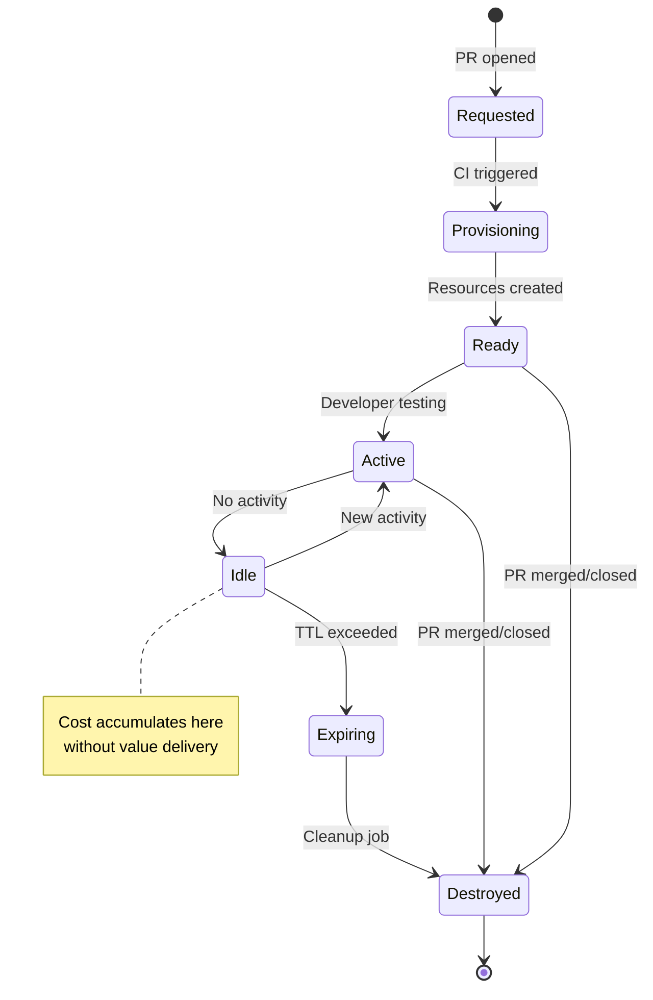
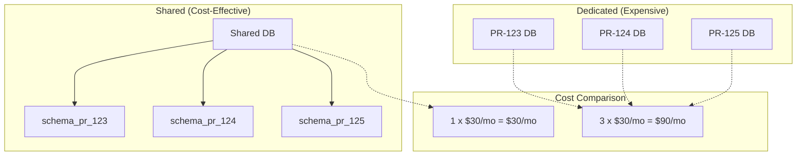
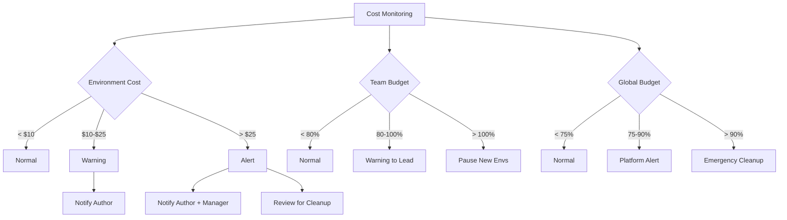

*[PR]: Pull Request
*[TTL]: Time To Live
*[CI]: Continuous Integration
*[CD]: Continuous Deployment
*[K8s]: Kubernetes
*[AWS]: Amazon Web Services
*[GCP]: Google Cloud Platform
*[IaC]: Infrastructure as Code
*[DNS]: Domain Name System

# Ephemeral Environments Without Runaway Costs

## Introduction

Brief overview of the ephemeral environment promise and pitfall: preview environments for every PR accelerate development by letting teams test changes in isolation, but without aggressive lifecycle management, they become cost sinkholes. This section frames the problem—orphaned databases, forgotten load balancers, and zombie containers silently accumulating charges until someone notices a 5x cloud bill.

_Include a real scenario: a team enables preview environments for their 50-developer team. Each PR spawns a full stack with database, Redis, and S3 bucket. With 40 open PRs on average and no cleanup automation, they're running 40 duplicate environments 24/7. When the monthly bill arrives, it's $12,000 higher than expected—mostly from databases that outlived their PRs._

<Callout type="warning">
Preview environments are "free" until they're not. The marginal cost of one environment is negligible; the compound cost of 50 forgotten environments is a budget emergency. Cleanup automation isn't optional—it's the prerequisite.
</Callout>

## The Ephemeral Environment Lifecycle

### Environment Lifecycle States


Figure: Ephemeral environment lifecycle states.

```yaml title="environment-lifecycle-events.yaml"
lifecycle_events:
  creation_triggers:
    - event: "pull_request.opened"
      action: "provision_environment"
    - event: "pull_request.synchronize"
      action: "update_environment"
    - event: "pull_request.reopened"
      action: "provision_if_not_exists"

  destruction_triggers:
    - event: "pull_request.merged"
      action: "destroy_immediately"
    - event: "pull_request.closed"
      action: "destroy_immediately"
    - event: "ttl_exceeded"
      action: "destroy_with_notification"
    - event: "idle_timeout"
      action: "hibernate_or_destroy"
    - event: "budget_exceeded"
      action: "destroy_non_essential"

  state_transitions:
    provisioning:
      timeout: "15 minutes"
      on_timeout: "mark_failed_and_alert"
    active:
      idle_threshold: "4 hours of no HTTP requests"
      transition_to: "idle"
    idle:
      ttl: "24 hours"
      transition_to: "expiring"
    expiring:
      grace_period: "1 hour"
      notification: "Slack DM to PR author"
```
Code: Environment lifecycle event configuration.

### What Gets Provisioned

| Resource Type | Cost Driver | Cleanup Difficulty | Orphan Risk |
|--------------|-------------|-------------------|-------------|
| Containers/Pods | CPU/Memory hours | Easy (K8s namespace delete) | Low |
| Databases | Instance hours + storage | Medium (data retention) | High |
| Load Balancers | Hourly + data transfer | Easy | Medium |
| DNS Records | Per record (usually free) | Easy | Medium |
| SSL Certificates | Usually free (Let's Encrypt) | Easy | Low |
| Object Storage | Storage + requests | Hard (orphaned objects) | High |
| Message Queues | Messages + throughput | Medium | Medium |
| Secrets/Config | Usually free | Easy | Low |
| Persistent Volumes | Storage GB | Hard (data retention) | High |

Table: Resource types and their cleanup characteristics.

<Callout type="info">
Databases and persistent storage are the biggest cost risks. They're expensive per-hour, accumulate data that makes deletion scary, and are often provisioned with "just in case" retention policies that keep them alive long after the environment is gone.
</Callout>

## Provisioning Architecture

### Environment Templates

```yaml title="preview-environment-template.yaml"
# Template for preview environment provisioning
apiVersion: preview.company.io/v1
kind: PreviewEnvironment
metadata:
  name: "pr-${PR_NUMBER}"
  labels:
    team: "${TEAM_NAME}"
    pr: "${PR_NUMBER}"
    branch: "${BRANCH_NAME}"
    author: "${PR_AUTHOR}"
    created: "${TIMESTAMP}"
spec:
  # Source configuration
  source:
    repository: "${REPO_NAME}"
    branch: "${BRANCH_NAME}"
    commit: "${COMMIT_SHA}"

  # Resource limits per environment
  resources:
    limits:
      cpu: "2"
      memory: "4Gi"
      storage: "10Gi"

  # Component configuration
  components:
    app:
      image: "${REGISTRY}/${REPO}:pr-${PR_NUMBER}"
      replicas: 1
      resources:
        requests:
          cpu: "100m"
          memory: "256Mi"
        limits:
          cpu: "500m"
          memory: "512Mi"

    database:
      type: "postgresql"
      version: "15"
      size: "db.t3.micro"  # Smallest instance
      storage: "5Gi"
      # Use shared database with schema isolation instead
      # sharedDatabase: true
      # schemaPrefix: "pr_${PR_NUMBER}_"

    cache:
      type: "redis"
      # Use shared Redis with key prefix instead of dedicated instance
      sharedInstance: true
      keyPrefix: "pr-${PR_NUMBER}:"

  # Lifecycle configuration
  lifecycle:
    ttl: "72h"  # Max lifetime
    idleTimeout: "8h"  # Destroy after 8h of no activity
    hibernateAfter: "4h"  # Scale to zero after 4h idle

  # Access configuration
  access:
    domain: "pr-${PR_NUMBER}.preview.company.io"
    authentication: "github-oauth"  # Restrict to team members
```
Code: Preview environment template with resource limits.

### Shared vs Dedicated Resources


Figure: Shared vs dedicated resource cost comparison.

```typescript title="shared-database-provisioner.ts"
interface PreviewDatabaseConfig {
  prNumber: number;
  schemaPrefix: string;
  seedData: boolean;
}

class SharedDatabaseProvisioner {
  private readonly sharedDbConnection: Pool;

  async provisionSchema(config: PreviewDatabaseConfig): Promise<string> {
    const schemaName = `pr_${config.prNumber}`;

    // Create isolated schema in shared database
    await this.sharedDbConnection.query(`
      CREATE SCHEMA IF NOT EXISTS ${schemaName};
    `);

    // Create role with access only to this schema
    const roleName = `pr_${config.prNumber}_role`;
    await this.sharedDbConnection.query(`
      DO $$
      BEGIN
        IF NOT EXISTS (SELECT FROM pg_roles WHERE rolname = '${roleName}') THEN
          CREATE ROLE ${roleName} LOGIN PASSWORD '${generatePassword()}';
        END IF;
      END
      $$;

      GRANT USAGE ON SCHEMA ${schemaName} TO ${roleName};
      GRANT ALL PRIVILEGES ON ALL TABLES IN SCHEMA ${schemaName} TO ${roleName};
      ALTER DEFAULT PRIVILEGES IN SCHEMA ${schemaName}
        GRANT ALL ON TABLES TO ${roleName};
    `);

    // Run migrations in the new schema
    await this.runMigrations(schemaName);

    // Optionally seed with test data
    if (config.seedData) {
      await this.seedTestData(schemaName);
    }

    // Return connection string for the preview environment
    return `postgresql://${roleName}:${password}@${this.sharedDbHost}/${this.dbName}?schema=${schemaName}`;
  }

  async destroySchema(prNumber: number): Promise<void> {
    const schemaName = `pr_${prNumber}`;
    const roleName = `pr_${prNumber}_role`;

    // Drop schema and all objects
    await this.sharedDbConnection.query(`
      DROP SCHEMA IF EXISTS ${schemaName} CASCADE;
      DROP ROLE IF EXISTS ${roleName};
    `);
  }
}
```
Code: Shared database with schema isolation.

<Callout type="success">
Shared databases with schema isolation can reduce database costs by 80%+. Instead of spinning up a new RDS instance per PR, create a schema in a shared instance. Cleanup is a single DROP SCHEMA command, and you avoid the 10-minute RDS provisioning delay.
</Callout>

## TTL and Cleanup Automation

### TTL Enforcement Strategies

```yaml title="ttl-enforcement-config.yaml"
ttl_policies:
  default:
    max_lifetime: "72h"  # Hard limit regardless of activity
    idle_timeout: "8h"   # No requests for 8 hours
    grace_period: "1h"   # Warning before destruction

  extended:
    # For long-running feature branches
    trigger: "label:preview-extended"
    max_lifetime: "168h"  # 1 week
    idle_timeout: "24h"
    requires_approval: true

  critical:
    # For demo environments
    trigger: "label:preview-critical"
    max_lifetime: "336h"  # 2 weeks
    idle_timeout: "48h"
    requires_approval: true
    approvers: ["engineering-manager", "product-owner"]

enforcement:
  check_interval: "15m"

  actions:
    warning:
      trigger: "30m before destruction"
      channels:
        - "slack_dm_to_author"
        - "pr_comment"

    hibernate:
      trigger: "idle_timeout reached"
      action: "scale_to_zero"
      preserves: ["database", "storage"]

    destruction:
      trigger: "max_lifetime OR idle_after_hibernate"
      action: "full_cleanup"
      notification: "pr_comment_with_cost_summary"
```
Code: TTL policy configuration.

```typescript title="ttl-enforcer.ts"
interface Environment {
  id: string;
  prNumber: number;
  createdAt: Date;
  lastActivityAt: Date;
  state: 'active' | 'idle' | 'hibernated' | 'expiring';
  resources: Resource[];
  accumulatedCost: number;
}

class TTLEnforcer {
  private readonly policies: TTLPolicies;

  async enforceLifecycle(): Promise<EnforcementReport> {
    const environments = await this.listAllEnvironments();
    const report: EnforcementReport = {
      checked: environments.length,
      hibernated: 0,
      destroyed: 0,
      warned: 0,
      costSaved: 0,
    };

    for (const env of environments) {
      const policy = this.getPolicyForEnvironment(env);
      const now = new Date();

      // Check max lifetime
      const age = now.getTime() - env.createdAt.getTime();
      if (age > policy.maxLifetime) {
        await this.destroyEnvironment(env, 'max_lifetime_exceeded');
        report.destroyed++;
        report.costSaved += this.estimateFutureCost(env);
        continue;
      }

      // Check idle timeout
      const idleTime = now.getTime() - env.lastActivityAt.getTime();

      if (env.state === 'hibernated' && idleTime > policy.hibernateIdleLimit) {
        await this.destroyEnvironment(env, 'idle_after_hibernate');
        report.destroyed++;
        report.costSaved += this.estimateFutureCost(env);
        continue;
      }

      if (env.state === 'active' && idleTime > policy.idleTimeout) {
        await this.hibernateEnvironment(env);
        report.hibernated++;
        continue;
      }

      // Check if approaching limits
      const timeToDestruction = policy.maxLifetime - age;
      if (timeToDestruction < policy.gracePeriod && !env.warned) {
        await this.sendWarning(env, timeToDestruction);
        report.warned++;
      }
    }

    return report;
  }

  private async hibernateEnvironment(env: Environment): Promise<void> {
    // Scale compute to zero, keep data
    await this.scaleDeployment(env.id, 0);
    await this.updateEnvironmentState(env.id, 'hibernated');
    await this.notifyAuthor(env, 'environment_hibernated');
  }

  private async destroyEnvironment(
    env: Environment,
    reason: string
  ): Promise<void> {
    // Full cleanup of all resources
    for (const resource of env.resources) {
      await this.deleteResource(resource);
    }

    // Post summary to PR
    await this.postDestructionSummary(env, reason);
  }
}
```
Code: TTL enforcement implementation.

### Cleanup Job Architecture

```yaml title="cleanup-cronjob.yaml"
# Kubernetes CronJob for environment cleanup
apiVersion: batch/v1
kind: CronJob
metadata:
  name: preview-environment-cleanup
spec:
  schedule: "*/15 * * * *"  # Every 15 minutes
  concurrencyPolicy: Forbid
  jobTemplate:
    spec:
      template:
        spec:
          serviceAccountName: preview-cleanup-sa
          containers:
            - name: cleanup
              image: preview-manager:latest
              command:
                - /bin/cleanup
                - --dry-run=false
                - --notify=true
              env:
                - name: SLACK_WEBHOOK_URL
                  valueFrom:
                    secretKeyRef:
                      name: preview-secrets
                      key: slack-webhook
              resources:
                limits:
                  cpu: "100m"
                  memory: "256Mi"
          restartPolicy: OnFailure
---
# ServiceAccount with permissions to delete preview resources
apiVersion: v1
kind: ServiceAccount
metadata:
  name: preview-cleanup-sa
---
apiVersion: rbac.authorization.k8s.io/v1
kind: ClusterRole
metadata:
  name: preview-cleanup-role
rules:
  - apiGroups: [""]
    resources: ["namespaces"]
    verbs: ["list", "delete"]
  - apiGroups: [""]
    resources: ["pods", "services", "configmaps", "secrets"]
    verbs: ["list", "delete"]
  - apiGroups: ["apps"]
    resources: ["deployments", "statefulsets"]
    verbs: ["list", "delete", "patch"]
  - apiGroups: ["networking.k8s.io"]
    resources: ["ingresses"]
    verbs: ["list", "delete"]
```
Code: Kubernetes cleanup CronJob configuration.

<Callout type="warning">
Cleanup jobs must be idempotent and handle partial failures. If deleting a database fails, the job shouldn't crash—it should log the failure, alert, and continue cleaning other resources. Orphaned resources accumulate when cleanup jobs are fragile.
</Callout>

## Cost Monitoring and Alerting

### Per-Environment Cost Tracking

```typescript title="cost-tracker.ts"
interface EnvironmentCost {
  environmentId: string;
  prNumber: number;
  author: string;
  team: string;
  resources: ResourceCost[];
  totalCost: number;
  costPerHour: number;
  projectedMonthlyCost: number;
}

interface ResourceCost {
  type: string;
  name: string;
  hourlyRate: number;
  hoursRunning: number;
  totalCost: number;
}

class EnvironmentCostTracker {
  // Hourly rates by resource type (example for AWS us-east-1)
  private readonly hourlyRates: Record<string, number> = {
    'db.t3.micro': 0.017,
    'db.t3.small': 0.034,
    'db.t3.medium': 0.068,
    'fargate-cpu-per-vcpu': 0.04048,
    'fargate-memory-per-gb': 0.004445,
    'alb': 0.0225,
    'nat-gateway': 0.045,
    's3-storage-gb': 0.023 / 730,  // Per hour
    'ebs-gp3-gb': 0.08 / 730,
  };

  async calculateEnvironmentCost(envId: string): Promise<EnvironmentCost> {
    const env = await this.getEnvironment(envId);
    const resources = await this.getEnvironmentResources(envId);

    const resourceCosts: ResourceCost[] = [];
    let totalCost = 0;
    let costPerHour = 0;

    for (const resource of resources) {
      const hourlyRate = this.getHourlyRate(resource);
      const hoursRunning = this.calculateHoursRunning(resource);
      const resourceTotal = hourlyRate * hoursRunning;

      resourceCosts.push({
        type: resource.type,
        name: resource.name,
        hourlyRate,
        hoursRunning,
        totalCost: resourceTotal,
      });

      totalCost += resourceTotal;
      costPerHour += hourlyRate;
    }

    return {
      environmentId: envId,
      prNumber: env.prNumber,
      author: env.author,
      team: env.team,
      resources: resourceCosts,
      totalCost,
      costPerHour,
      projectedMonthlyCost: costPerHour * 730,
    };
  }

  async generateCostReport(): Promise<CostReport> {
    const environments = await this.listAllEnvironments();
    const costs = await Promise.all(
      environments.map(env => this.calculateEnvironmentCost(env.id))
    );

    // Aggregate by team
    const byTeam = this.aggregateByTeam(costs);

    // Find anomalies
    const anomalies = costs.filter(c =>
      c.totalCost > 50 ||  // Over $50
      c.projectedMonthlyCost > 200  // Would cost >$200/month
    );

    return {
      totalEnvironments: environments.length,
      totalCost: costs.reduce((sum, c) => sum + c.totalCost, 0),
      projectedMonthlyCost: costs.reduce((sum, c) => sum + c.projectedMonthlyCost, 0),
      byTeam,
      anomalies,
      generatedAt: new Date(),
    };
  }
}
```
Code: Per-environment cost tracking.

### Cost Alerts and Budgets

```yaml title="cost-alerts-config.yaml"
cost_alerts:
  per_environment:
    - name: "high-cost-environment"
      condition: "total_cost > $25"
      action: "notify_author_and_manager"
      message: |
        ⚠️ Preview environment pr-{pr_number} has accumulated ${total_cost} in costs.
        Resources: {resource_breakdown}
        Consider merging or closing the PR to clean up resources.

    - name: "runaway-database"
      condition: "database_cost > $15"
      action: "notify_and_suggest_shared"
      message: |
        💰 Database for pr-{pr_number} is costing ${database_cost}.
        Consider using shared database with schema isolation.

  per_team:
    - name: "team-budget-warning"
      condition: "team_total > team_budget * 0.8"
      action: "notify_team_lead"

    - name: "team-budget-exceeded"
      condition: "team_total > team_budget"
      action: "pause_new_environments"

  global:
    - name: "total-preview-budget"
      budget: "$2000/month"
      warning_threshold: 0.75
      critical_threshold: 0.9
      actions:
        warning: "notify_platform_team"
        critical: "destroy_idle_environments"

budget_enforcement:
  enabled: true
  actions:
    soft_limit:
      threshold: "$1500/month"
      action: "require_approval_for_new"
    hard_limit:
      threshold: "$2000/month"
      action: "block_new_and_cleanup_oldest"
```
Code: Cost alert and budget configuration.


Figure: Cost monitoring and enforcement flow.

<Callout type="info">
Cost visibility changes behavior. When developers see "Your PR environment has cost $47 this week" in their PR, they close stale PRs faster. Make costs visible, attributable, and actionable.
</Callout>

## Handling Orphaned Resources

### Orphan Detection

```typescript title="orphan-detector.ts"
interface OrphanedResource {
  resourceId: string;
  resourceType: string;
  createdAt: Date;
  tags: Record<string, string>;
  associatedPR: number | null;
  prStatus: 'merged' | 'closed' | 'not_found' | null;
  estimatedMonthlyCost: number;
  recommendation: 'delete' | 'review' | 'keep';
}

class OrphanDetector {
  async detectOrphans(): Promise<OrphanedResource[]> {
    const orphans: OrphanedResource[] = [];

    // Check each resource type
    const databases = await this.listPreviewDatabases();
    const loadBalancers = await this.listPreviewLoadBalancers();
    const s3Buckets = await this.listPreviewBuckets();
    const volumes = await this.listPreviewVolumes();

    for (const db of databases) {
      const prNumber = this.extractPRNumber(db.tags);
      if (prNumber) {
        const prStatus = await this.getPRStatus(prNumber);
        if (prStatus === 'merged' || prStatus === 'closed' || prStatus === 'not_found') {
          orphans.push({
            resourceId: db.id,
            resourceType: 'database',
            createdAt: db.createdAt,
            tags: db.tags,
            associatedPR: prNumber,
            prStatus,
            estimatedMonthlyCost: this.estimateCost(db),
            recommendation: 'delete',
          });
        }
      } else {
        // No PR tag - suspicious
        orphans.push({
          resourceId: db.id,
          resourceType: 'database',
          createdAt: db.createdAt,
          tags: db.tags,
          associatedPR: null,
          prStatus: null,
          estimatedMonthlyCost: this.estimateCost(db),
          recommendation: db.createdAt < this.oneWeekAgo() ? 'delete' : 'review',
        });
      }
    }

    // Similar checks for other resource types...

    return orphans;
  }

  async cleanupOrphans(dryRun: boolean = true): Promise<CleanupReport> {
    const orphans = await this.detectOrphans();
    const toDelete = orphans.filter(o => o.recommendation === 'delete');

    const report: CleanupReport = {
      detected: orphans.length,
      deleted: 0,
      costSaved: 0,
      errors: [],
    };

    for (const orphan of toDelete) {
      if (dryRun) {
        console.log(`Would delete: ${orphan.resourceType} ${orphan.resourceId}`);
      } else {
        try {
          await this.deleteResource(orphan);
          report.deleted++;
          report.costSaved += orphan.estimatedMonthlyCost;
        } catch (error) {
          report.errors.push({
            resource: orphan.resourceId,
            error: error.message,
          });
        }
      }
    }

    return report;
  }
}
```
Code: Orphaned resource detection and cleanup.

### Resource Tagging Strategy

```yaml title="resource-tagging-policy.yaml"
required_tags:
  preview_environment:
    - key: "preview/pr-number"
      value: "${PR_NUMBER}"
      description: "Associated pull request number"

    - key: "preview/branch"
      value: "${BRANCH_NAME}"
      description: "Source branch name"

    - key: "preview/repository"
      value: "${REPO_NAME}"
      description: "Source repository"

    - key: "preview/author"
      value: "${PR_AUTHOR}"
      description: "PR author for cost attribution"

    - key: "preview/team"
      value: "${TEAM_NAME}"
      description: "Team for budget tracking"

    - key: "preview/created-at"
      value: "${ISO_TIMESTAMP}"
      description: "Creation timestamp for TTL calculation"

    - key: "preview/expires-at"
      value: "${EXPIRY_TIMESTAMP}"
      description: "Expected expiration time"

    - key: "preview/managed-by"
      value: "preview-environment-controller"
      description: "Identifies resources for cleanup"

tag_enforcement:
  method: "terraform-sentinel"
  action: "block_untagged_resources"

  # AWS SCP to deny untagged resources
  scp_policy: |
    {
      "Version": "2012-10-17",
      "Statement": [
        {
          "Sid": "RequirePreviewTags",
          "Effect": "Deny",
          "Action": [
            "rds:CreateDBInstance",
            "ec2:RunInstances",
            "elasticloadbalancing:CreateLoadBalancer"
          ],
          "Resource": "*",
          "Condition": {
            "Null": {
              "aws:RequestTag/preview/pr-number": "true"
            }
          }
        }
      ]
    }
```
Code: Resource tagging policy for preview environments.

<Callout type="success">
Consistent tagging is the foundation of orphan detection. If every preview resource has a `preview/pr-number` tag, you can easily find resources whose PRs no longer exist. Enforce tagging with IaC policies—untagged resources are future orphans.
</Callout>

## CI/CD Integration

### GitHub Actions Integration

```yaml title="preview-environment-workflow.yaml"
# .github/workflows/preview-environment.yaml
name: Preview Environment

on:
  pull_request:
    types: [opened, synchronize, reopened, closed]

jobs:
  deploy-preview:
    if: github.event.action != 'closed'
    runs-on: ubuntu-latest
    permissions:
      contents: read
      pull-requests: write

    steps:
      - uses: actions/checkout@v4

      - name: Build application
        run: |
          docker build -t preview:pr-${{ github.event.pull_request.number }} .

      - name: Push to registry
        run: |
          docker push ${{ env.REGISTRY }}/preview:pr-${{ github.event.pull_request.number }}

      - name: Deploy preview environment
        id: deploy
        uses: ./.github/actions/deploy-preview
        with:
          pr-number: ${{ github.event.pull_request.number }}
          branch: ${{ github.head_ref }}
          author: ${{ github.event.pull_request.user.login }}
          ttl: "72h"

      - name: Comment on PR
        uses: actions/github-script@v7
        with:
          script: |
            github.rest.issues.createComment({
              issue_number: context.issue.number,
              owner: context.repo.owner,
              repo: context.repo.repo,
              body: `## 🚀 Preview Environment Ready

              | | |
              |---|---|
              | **URL** | ${{ steps.deploy.outputs.url }} |
              | **Status** | ✅ Deployed |
              | **Expires** | ${{ steps.deploy.outputs.expires_at }} |
              | **Estimated Cost** | ${{ steps.deploy.outputs.hourly_cost }}/hour |

              The environment will be automatically destroyed when this PR is merged or closed.
              `
            })

  cleanup-preview:
    if: github.event.action == 'closed'
    runs-on: ubuntu-latest

    steps:
      - name: Destroy preview environment
        uses: ./.github/actions/destroy-preview
        with:
          pr-number: ${{ github.event.pull_request.number }}

      - name: Comment cleanup summary
        uses: actions/github-script@v7
        with:
          script: |
            const cost = '${{ steps.destroy.outputs.total_cost }}';
            github.rest.issues.createComment({
              issue_number: context.issue.number,
              owner: context.repo.owner,
              repo: context.repo.repo,
              body: `## 🧹 Preview Environment Destroyed

              | | |
              |---|---|
              | **Total Cost** | ${cost} |
              | **Duration** | ${{ steps.destroy.outputs.duration }} |
              | **Resources Cleaned** | ${{ steps.destroy.outputs.resources_count }} |
              `
            })
```
Code: GitHub Actions workflow for preview environments.

### Webhook-Based Lifecycle Management

```typescript title="webhook-handler.ts"
import { Webhooks } from '@octokit/webhooks';

const webhooks = new Webhooks({
  secret: process.env.GITHUB_WEBHOOK_SECRET,
});

webhooks.on('pull_request.opened', async ({ payload }) => {
  const { number, head, user } = payload.pull_request;

  await previewManager.createEnvironment({
    prNumber: number,
    branch: head.ref,
    commit: head.sha,
    author: user.login,
    repository: payload.repository.full_name,
  });
});

webhooks.on('pull_request.synchronize', async ({ payload }) => {
  const { number, head } = payload.pull_request;

  await previewManager.updateEnvironment({
    prNumber: number,
    commit: head.sha,
  });
});

webhooks.on(['pull_request.closed', 'pull_request.merged'], async ({ payload }) => {
  const { number } = payload.pull_request;

  await previewManager.destroyEnvironment({
    prNumber: number,
    reason: payload.action,
  });
});

// Handle force-push (might need full redeploy)
webhooks.on('push', async ({ payload }) => {
  if (payload.forced) {
    const prs = await findPRsForBranch(payload.ref);
    for (const pr of prs) {
      await previewManager.recreateEnvironment({
        prNumber: pr.number,
        commit: payload.after,
        reason: 'force_push',
      });
    }
  }
});
```
Code: Webhook handler for GitHub events.

<Callout type="info">
Webhook-based cleanup is more reliable than relying solely on CI jobs. If a PR is closed through the GitHub UI while CI is down, the webhook still fires. Use both webhooks and scheduled cleanup jobs for defense in depth.
</Callout>

## Hibernation Strategies

### Scale-to-Zero Hibernation

```yaml title="hibernation-config.yaml"
hibernation:
  triggers:
    - type: "idle_timeout"
      threshold: "4h"

    - type: "schedule"
      # Hibernate all environments overnight and weekends
      hibernate_at: "0 20 * * 1-5"  # 8 PM weekdays
      wake_at: "0 8 * * 1-5"        # 8 AM weekdays

    - type: "budget_pressure"
      threshold: "80% of team budget"
      priority: "oldest_environments_first"

  actions:
    scale_down:
      - resource: "deployment"
        replicas: 0
      - resource: "statefulset"
        replicas: 0

    preserve:
      - "persistent_volumes"
      - "database_instances"  # Or stop if supported
      - "secrets"
      - "configmaps"

    stop_if_supported:
      - "rds_instance"  # AWS RDS can be stopped
      - "cloud_sql"     # GCP Cloud SQL can be stopped

  wake_on_access:
    enabled: true
    method: "ingress_controller_annotation"
    cold_start_timeout: "60s"
    loading_page: true
```
Code: Hibernation configuration.

```typescript title="wake-on-access.ts"
// Custom Ingress controller middleware for wake-on-access

class WakeOnAccessMiddleware {
  async handleRequest(req: Request, env: PreviewEnvironment): Promise<Response> {
    if (env.state === 'hibernated') {
      // Start waking the environment
      const wakePromise = this.wakeEnvironment(env);

      // Return a loading page while waking
      if (this.config.showLoadingPage) {
        return new Response(this.getLoadingPage(env), {
          headers: {
            'Content-Type': 'text/html',
            'Refresh': '5',  // Auto-refresh after 5 seconds
          },
        });
      }

      // Or wait for wake to complete (with timeout)
      try {
        await Promise.race([
          wakePromise,
          this.timeout(this.config.coldStartTimeout),
        ]);

        // Forward request to now-awake environment
        return this.forwardRequest(req, env);
      } catch (error) {
        return new Response('Environment waking up, please retry', {
          status: 503,
          headers: { 'Retry-After': '10' },
        });
      }
    }

    // Environment is active, update last activity timestamp
    await this.updateLastActivity(env);
    return this.forwardRequest(req, env);
  }

  private async wakeEnvironment(env: PreviewEnvironment): Promise<void> {
    // Scale up deployments
    await this.kubernetes.scaleDeployment(env.namespace, 'app', 1);

    // Start stopped databases if applicable
    if (env.database?.stopped) {
      await this.aws.rds.startDBInstance({ DBInstanceIdentifier: env.database.id });
    }

    // Wait for health check
    await this.waitForHealthy(env);

    // Update state
    await this.updateEnvironmentState(env.id, 'active');
  }

  private getLoadingPage(env: PreviewEnvironment): string {
    return `
      <!DOCTYPE html>
      <html>
        <head>
          <title>Waking Preview Environment</title>
          <meta http-equiv="refresh" content="5">
          <style>
            body { font-family: system-ui; text-align: center; padding: 50px; }
            .spinner { animation: spin 1s linear infinite; }
            @keyframes spin { to { transform: rotate(360deg); } }
          </style>
        </head>
        <body>
          <div class="spinner">⏳</div>
          <h1>Waking Up Preview Environment</h1>
          <p>PR #${env.prNumber} environment was hibernated to save costs.</p>
          <p>Starting up now... this usually takes 30-60 seconds.</p>
        </body>
      </html>
    `;
  }
}
```
Code: Wake-on-access implementation for hibernated environments.

<Callout type="success">
Hibernation with wake-on-access gives you the best of both worlds: environments are always "available" from the developer's perspective, but only incur costs when actively used. A 4-hour idle timeout with wake-on-access can reduce preview environment costs by 60%+.
</Callout>

## Resource Sizing Strategies

### Right-Sizing for Preview

```yaml title="preview-resource-sizing.yaml"
resource_profiles:
  minimal:
    description: "Smallest viable for basic testing"
    use_case: "Simple UI changes, documentation"
    resources:
      app:
        cpu: "100m"
        memory: "256Mi"
        replicas: 1
      database:
        type: "shared_schema"
        # No dedicated instance
      cache:
        type: "shared_instance"
        memory_limit: "64Mi"
    estimated_hourly_cost: "$0.05"

  standard:
    description: "Default for most PRs"
    use_case: "Feature development, bug fixes"
    resources:
      app:
        cpu: "250m"
        memory: "512Mi"
        replicas: 1
      database:
        type: "shared_schema"
      cache:
        type: "shared_instance"
        memory_limit: "128Mi"
    estimated_hourly_cost: "$0.10"

  enhanced:
    description: "For performance-sensitive changes"
    use_case: "Performance testing, load testing prep"
    requires_approval: true
    resources:
      app:
        cpu: "1000m"
        memory: "2Gi"
        replicas: 2
      database:
        type: "dedicated"
        size: "db.t3.small"
      cache:
        type: "dedicated"
        size: "cache.t3.micro"
    estimated_hourly_cost: "$0.50"

  production_like:
    description: "Near-production configuration"
    use_case: "Final validation before release"
    requires_approval: true
    approvers: ["tech-lead", "sre-team"]
    max_duration: "24h"
    resources:
      app:
        cpu: "2000m"
        memory: "4Gi"
        replicas: 3
      database:
        type: "dedicated"
        size: "db.t3.medium"
      cache:
        type: "dedicated"
        size: "cache.t3.small"
    estimated_hourly_cost: "$1.50"

profile_selection:
  default: "standard"

  automatic_rules:
    - condition: "files_changed only in docs/"
      profile: "minimal"
    - condition: "label:performance-test"
      profile: "enhanced"
    - condition: "label:release-candidate"
      profile: "production_like"
```
Code: Resource sizing profiles for different use cases.

### Dynamic Resource Adjustment

```typescript title="dynamic-resource-adjuster.ts"
class DynamicResourceAdjuster {
  async adjustBasedOnUsage(envId: string): Promise<void> {
    const metrics = await this.getMetrics(envId, '1h');
    const currentResources = await this.getCurrentResources(envId);

    // CPU adjustment
    const cpuUsage = metrics.cpu.p95;
    if (cpuUsage < 0.3 && currentResources.cpu > '100m') {
      await this.reduceCPU(envId);
    } else if (cpuUsage > 0.8) {
      await this.increaseCPU(envId);
    }

    // Memory adjustment
    const memoryUsage = metrics.memory.p95;
    if (memoryUsage < 0.5 && currentResources.memory > '256Mi') {
      await this.reduceMemory(envId);
    } else if (memoryUsage > 0.85) {
      await this.increaseMemory(envId);
    }

    // Replica adjustment (scale to zero if no traffic)
    const requestRate = metrics.requests.rate;
    if (requestRate === 0 && metrics.requests.lastRequest > 4 * 60 * 60 * 1000) {
      await this.scaleToZero(envId);
    }
  }

  async optimizeAllEnvironments(): Promise<OptimizationReport> {
    const environments = await this.listActiveEnvironments();
    const report: OptimizationReport = {
      checked: environments.length,
      adjusted: 0,
      estimatedSavings: 0,
    };

    for (const env of environments) {
      const before = await this.estimateCost(env);
      await this.adjustBasedOnUsage(env.id);
      const after = await this.estimateCost(env);

      if (after < before) {
        report.adjusted++;
        report.estimatedSavings += (before - after) * 730; // Monthly savings
      }
    }

    return report;
  }
}
```
Code: Dynamic resource adjustment based on actual usage.

<Callout type="info">
Most preview environments are massively over-provisioned. A PR that touches CSS doesn't need 2GB of RAM and a dedicated database. Use automatic profile selection based on files changed to right-size from the start.
</Callout>

## Reporting and Visibility

### Cost Dashboard

```typescript title="cost-dashboard-data.ts"
interface DashboardData {
  summary: {
    activeEnvironments: number;
    totalMonthlyCost: number;
    averageCostPerEnvironment: number;
    costTrend: 'increasing' | 'stable' | 'decreasing';
  };

  byTeam: Array<{
    team: string;
    environments: number;
    totalCost: number;
    budget: number;
    utilizationPercent: number;
  }>;

  topCostEnvironments: Array<{
    prNumber: number;
    author: string;
    age: string;
    totalCost: number;
    state: string;
  }>;

  orphanedResources: Array<{
    type: string;
    count: number;
    estimatedCost: number;
  }>;

  cleanupSavings: {
    lastWeek: number;
    lastMonth: number;
    environmentsDestroyed: number;
  };
}

async function generateDashboardData(): Promise<DashboardData> {
  const environments = await listAllEnvironments();
  const costs = await calculateAllCosts(environments);
  const orphans = await detectOrphans();
  const cleanupHistory = await getCleanupHistory('30d');

  return {
    summary: {
      activeEnvironments: environments.filter(e => e.state === 'active').length,
      totalMonthlyCost: costs.reduce((sum, c) => sum + c.projectedMonthlyCost, 0),
      averageCostPerEnvironment: costs.reduce((sum, c) => sum + c.totalCost, 0) / environments.length,
      costTrend: calculateTrend(costs),
    },
    byTeam: aggregateByTeam(environments, costs),
    topCostEnvironments: costs
      .sort((a, b) => b.totalCost - a.totalCost)
      .slice(0, 10)
      .map(c => ({
        prNumber: c.prNumber,
        author: c.author,
        age: formatAge(c.createdAt),
        totalCost: c.totalCost,
        state: c.state,
      })),
    orphanedResources: summarizeOrphans(orphans),
    cleanupSavings: {
      lastWeek: cleanupHistory.filter(c => c.date > oneWeekAgo()).reduce((sum, c) => sum + c.costSaved, 0),
      lastMonth: cleanupHistory.reduce((sum, c) => sum + c.costSaved, 0),
      environmentsDestroyed: cleanupHistory.length,
    },
  };
}
```
Code: Dashboard data generation for cost visibility.

### Weekly Cost Report

```yaml title="weekly-report-template.yaml"
weekly_report:
  subject: "Preview Environment Cost Report - Week of {week_start}"

  sections:
    - name: "Summary"
      content: |
        **Active Environments:** {active_count}
        **Total Cost This Week:** ${weekly_cost}
        **Projected Monthly Cost:** ${projected_monthly}
        **Budget Utilization:** {budget_percent}%

    - name: "Team Breakdown"
      table:
        headers: ["Team", "Environments", "Cost", "Budget", "Status"]
        rows: "{team_breakdown}"

    - name: "Longest Running"
      content: |
        These environments have been running for over 7 days:
        {long_running_list}

        Consider closing these PRs or requesting extended TTL if still needed.

    - name: "Cost Savings"
      content: |
        **Hibernation Savings:** ${hibernation_savings}
        **TTL Cleanup Savings:** ${ttl_savings}
        **Orphan Cleanup Savings:** ${orphan_savings}

    - name: "Recommendations"
      content: |
        {auto_generated_recommendations}

  recipients:
    - "engineering-managers"
    - "platform-team"

  schedule: "0 9 * * 1"  # Monday 9 AM
```
Code: Weekly cost report template.

<Callout type="success">
Weekly cost reports create accountability. When teams see their preview environment costs relative to budget and other teams, they self-regulate. Public visibility is often more effective than hard enforcement.
</Callout>

## Conclusion

Summarize the key strategies: treat ephemeral environments as cattle not pets with aggressive TTLs and automated cleanup; use shared resources with isolation instead of dedicated instances; implement hibernation with wake-on-access for cost efficiency without sacrificing availability; tag everything for orphan detection; and make costs visible to create accountability. Emphasize that the goal is enabling fast iteration—preview environments should accelerate development, not become a cost management nightmare.

<Callout type="info">
The goal isn't to minimize preview environment spending—it's to maximize value per dollar. A $100/month preview environment that catches a bug before production is worth far more than the savings from not running it. But a $100/month environment for a PR that was abandoned two weeks ago is pure waste. Automate the distinction.
</Callout>

---

## Cover Prompt

### Prompt 1: The Environment Garden

Create an image of a garden with small plant pods (preview environments) sprouting from the ground. A robotic gardener automatically prunes dead plants and waters active ones. Some pods have wilted (expired TTL), while others flourish. A meter shows water (cost) usage. Style: whimsical tech garden, automated gardening robot, lifecycle visualization, 16:9 aspect ratio.

### Prompt 2: The Cloud Bill Monster

Design an image showing a small developer happily creating preview environments (represented as bubbles), while behind them a shadow grows into a monster made of cloud bills and receipts. A cleanup bot stands guard with a broom, keeping the monster at bay. Style: playful warning illustration, shadow monster aesthetic, balance of creation and cleanup, 16:9 aspect ratio.

### Prompt 3: The Lifecycle Clock

Illustrate a large clock where each hour represents a stage in the preview environment lifecycle. Environments move around the clock face from "Created" through "Active" to "Idle" to "Destroyed." Some environments try to escape the clock but are caught by cleanup automation. Style: clock face visualization, lifecycle stages as hours, automation as clock mechanism, 16:9 aspect ratio.

### Prompt 4: The Resource Hotel

Create an image of a hotel where each room is a preview environment. The front desk shows check-in/check-out (TTL), some rooms have "Do Not Disturb" signs (extended TTL), and a cleaning crew systematically cleans empty rooms. A billing counter tallies room charges in real-time. Style: hotel management metaphor, orderly hospitality, visible cost tracking, 16:9 aspect ratio.

### Prompt 5: The Hibernation Pods

Design an image of a futuristic facility with rows of hibernation pods. Active environments glow with activity, while hibernated ones are dimmed but intact. When someone approaches a hibernated pod, it begins to wake up with lights activating. A control panel shows power (cost) savings. Style: sci-fi hibernation facility, energy efficiency visualization, wake-on-demand aesthetic, 16:9 aspect ratio.
